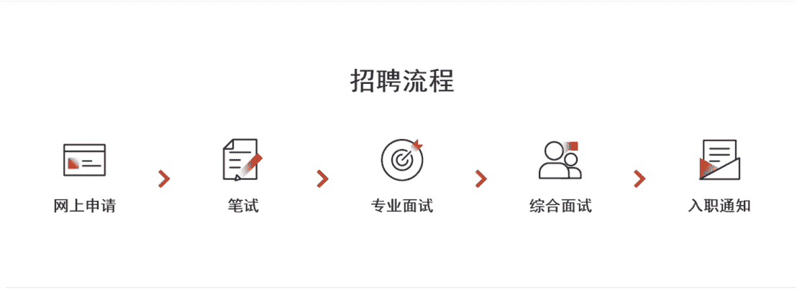
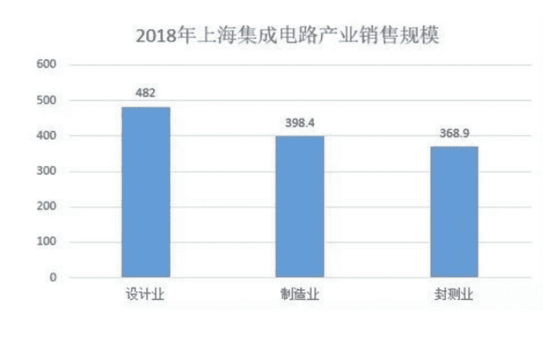
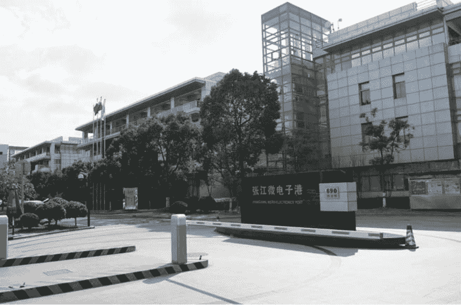

# 第二章 第 1 节 求职规划

> 原文：[`www.nowcoder.com/tutorial/10063/b57a6e9a78804b1d9da739460d7847d7`](https://www.nowcoder.com/tutorial/10063/b57a6e9a78804b1d9da739460d7847d7)

        接下来，我将主要介绍实习、秋招和春招等招聘环节，并从城市、职位和公司等维度给大家一些求职规划的建议。

# 1 校招求职规划

## **1.1 招聘流程**

        芯片岗位的招聘流程主要包括了简历筛选、笔试、专业面试、综合面试和 hr 面试。作为一个技术岗位，笔试和专业面试相对来说更加重要，hr 面试一般则比较水，不会刷人。  

        大部分公司的招聘流程进展都是比较迅速的，每个流程之间一般间隔 1-2 周，如果长时间没有收到结果，可以将信息反馈给 hr。

## **1.2 校招流程**

        芯片岗位的校招主要包括了实习招聘、秋招招聘和春招招聘。其中，有很多芯片公司都是直接从实习生中进行留用。除非有实习生离开，否则不会再展开秋招或者春招。这一点在高通等外企里非常普遍。所以需要我们从实习开始就积极投递简历，认真准备校招，以免错过心仪的公司。

        大部分芯片企业都会在秋招进行集中招聘，秋招一般从每年 8 月份开始会一直持续到 11 月份。一般在 9 月和 10 月份是秋招面试求职的高峰期，各位读者一定要把握住这个时间点，在准备充足的情况下，最好在提前批就投递简历。提前批相对于后面会更加简单，尤其到后面没有 hc 之后，竞争十分激烈。

**1.2.1 流程规划**

        芯片行业的校招虽然仍是以秋招为主，但是因为有很多好公司都是留用的实习生，所以实习就变得非常重要。而实习其实又可以分为寒假实习和暑期实习，暑期实习基本上就是可以留用并直接转正的。对于我们应届生来说，最好的校招流程就是，先在研二的寒假前就学习了相关的专业知识，然后找一个公司进行寒假实习。在这个过程中，进一步的学习专业知识，积累项目经验。然后再去找心仪公司的暑期实习，并最终留用。

        在暑期实习的同时，也可以带着两份实习的经历进一步参加秋招。秋招是岗位最多，公司最多的校招流程。如果实在没找到心仪的公司岗位，也可以进一步试试春招，但是建议大家不要将宝压在春招上，还是能在秋招结束前确定心仪的公司。

# 2 校招城市选择

        对于城市的选择，首先要考虑自己以后希望去哪里生活，其次也要考虑芯片行业的城市分布。目前来说，芯片设计领域发展比较好的城市有上海、深圳、北京、西安、苏州和成都等城市。推荐大家还是先在一线城市发展，积累宝贵的工作经验，以后可以选择留在一线城市或者去二线城市。

**集成电路的高地——上海**

        上海是中国集成电路行业发展最好的城市。2018 年上海集成电路产业销售规模达 1450 亿元，占全国的 1/5，位居全国各城市的榜首。长三角地区已经形成了完整的芯片产业链城市集群，芯片设计主要集中在上海，芯片制造和封装则分布在无锡苏州等城市。 

        其中，上海的张江高新科技园是全国最大的集成电路产业园，包括高通、AMD、展讯等 170 多家企业都聚集在这里。张江的微电子港更是一个神奇的地方，它非常像一所大学。有很多前辈跳了好几次槽都仍然在这里工作，只是工作地点从一号楼换到了二号楼。而且张江周边的各种设施建设非常完备。

 

        对于我们应届生来说，上海是一座非常不错的城市。首先上海有众多的芯片设计公司，包括高通、AMD、阿里平头哥、OPPO 和新思等。另外，上海目前的落户政策也非常友好，双一流大学的应届生都可以直接落户。即使以后不打算长期在上海发展，也可以把上海做为工作的第一站，在这边积累宝贵的工作经验，然后再去到二线城市发展。

**芯片设计的高地——深圳**

        深圳是除了上海之外又一座集成电路公司聚集的城市。国内重要的芯片应用和设计产业基底都在这里，芯片设计的产业规模更是占到了全国的 30%。包括华为海思在内的很多芯片设计公司总部都在深圳。全国十大芯片设计公司当中，有四家都在深圳。做为应届生，深圳也是工作第一站的不错选择。

**其他较强的城市**

        北京在一线城市中，相对来说集成电路行业发展较弱，不过也有像寒武纪这样的优秀芯片公司。二线城市中，成都和西安都是非常不错的选择。成都在芯片设计方面，拥有 120 多家公司。另外有很多的芯片加工制造工厂，包括了德州仪器的 8 英寸晶圆生产线，英特尔的封装等，已经成为了西南最大的芯片封装测试基底，是一个非常不错的选择。西安的集成电路行业也非常有竞争力，包括三星存储和美光的封装项目等。

        很多大公司在多个城市都会有办公地点，而作为应届生，还是推荐大家第一站选择集成电路发展雄厚的一线城市，这样子更有利于提高自己。

# 3 校招公司选择

        应届生的校招第一站还是要以大公司为主，大公司在发展、培训和薪资待遇上一般都要更好。

## **3.1 如何选择领域？**

        在选择公司之前，首先要选择适合自己的领域。芯片公司大多数都是精于某一个领域的，我们在选择公司之前，有必要了解公司的业务。尤其是芯片设计工程师，未来的职业发展会越来越专于某一领域的芯片。选择芯片领域的时候，应该尽可能选择发展前景比较多，公司玩家比较多的领域。比如，现在比较火的人工智能芯片领域就是一个非常好的选择。包括了阿里平头哥、百度、商汤科技和寒武纪等众多的玩家。

## **3.2** **如何选择公司？**

        对于公司的选择，我们要衡量很多方面，最重要的其实还是平台和薪资。我们首先要选择一个平台比较大的公司，选择一些业内比较认可的。这样的公司对于我们的发展是非常有帮助的。其次，我们当然也要考虑公司的薪资待遇，不过一般初创的公司，反而能开到很高的薪资待遇，在没有特别巨大差距的情况下，还是优先选择一些平台比较好的公司。

### 3.2.1 **大小公司的差异**

**职责**：首先大小公司在职责划分上会有明显的差异。大公司一般业务流程都比较完善，员工的工作职责非常清晰，分工也非常明确，更加类似于大机器上的一颗螺丝钉。而小公司则因为业务还没有那么规范，所以会需要员工去做多面手，各项技能都可以懂一些，当然相对来说在某一个方向就不会特别精。两者可以说是各有利弊。

**培训**：由于芯片岗位都是一些技术含量非常高的岗位，所以入职之后一般都是需要系统的培训的。这一点，大公司会具有天然的优势。首先就是大公司里面会有很多的技术大牛，入职之后会有非常多的技术跟他们学习，另外大公司一般也都会有系统的培训。从入职开始，包括导师制、内部分享、员工培训都会有系统完善的流程，这一点华为的海思做的就非常好，为国内培养了大量的集成电路人才。而小公司则相对来说没有系统的培训机制，需要自己去摸索学习。

**发展**：职业发展道路主要分为在本公司升职加薪和跳槽到其他公司。在这一点上，大公司和小公司都有自己的优缺点。大公司里面人才很多，相对来说升职会更加困难一些，所以一般晋升都比较缓慢。而小公司业务正在快速发展，短期不会有很多人手，所以晋升起来会更快一些。而对于跳槽的话，大公司都是自带光环的。有大公司工作背景的背书，会更加容易找到好的工作。小公司的认可度则没有那么高，如果自身技术不是过硬，则容易被压价。另外，小公司的业务发展难以得到保证，稳定性欠缺。

        总的来说，校招第一站大家还是尽可能的去大公司发展，求职大公司的技巧，首先就是要有扎实的技术，然后多做一些项目，多参加一些实习，可以先去一些小公司实习积攒项目经验，然后再投递大公司，会增加录用的可能性。