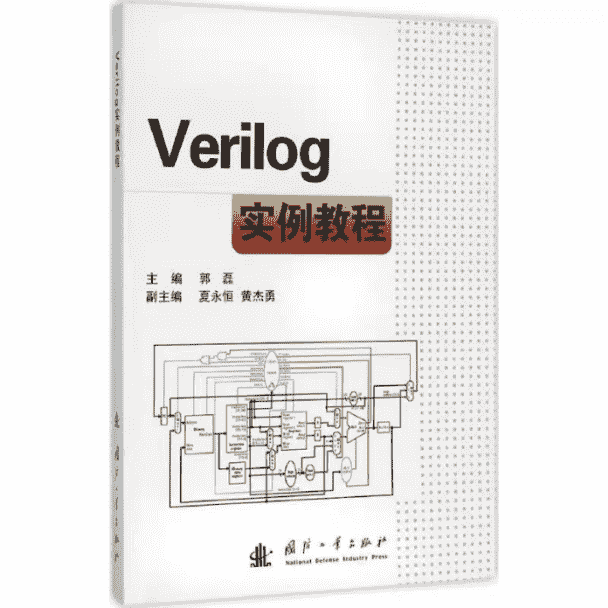
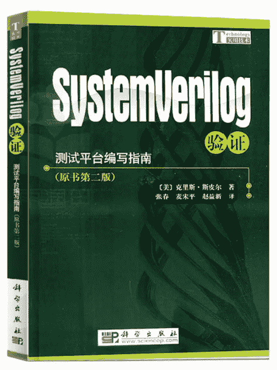
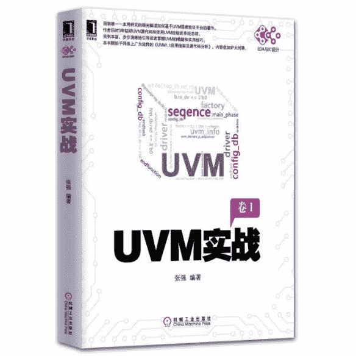

# 第二章 第 2 节 学习规划

> 原文：[`www.nowcoder.com/tutorial/10063/5b8c2d7903504197994ac307c67ef3f0`](https://www.nowcoder.com/tutorial/10063/5b8c2d7903504197994ac307c67ef3f0)

# 1 校招岗位技能树

        芯片岗位属于技术含量比较高的岗位，对于应届生的要求主要是扎实的基础知识和一定的项目经验。首先是对基础知识的要求，对于芯片验证工程师，必须要掌握基本的数字电路知识、Verilog 硬件描述语言、System Verilog 验证语言和 UVM 验证方法学。

 **数字电路**：大部分同学在本科期间应该都学过数字电路，数字电路主要是为了让我们对电路的硬件实现有一个深入的了解，包括了逻辑和电路。主要学习的内容包括组合逻辑和时序逻辑等。在学习数字电路基础知识的过程中，也需要将 ASIC 设计的全流程、时序分析的方法、跨时钟域信号处理和低功耗方法等内容搞清楚。在笔试的过程中，会有大量这样的基础知识，面试过程中也有可能提问到。而且数字电路的相关知识是其他内容的基础，一定要牢牢掌握这部分内容，再去学习其他的相关知识。

 **Verilog 硬件描述语言**：Verilog 自 20 世纪 80 年***出来以来，已经在芯片设计领域应用了近四十年，这与软件编程语言形成了鲜明的对比。它不像软件编程那样近几十年来发展出了各种各样好用的新语言。这也意味着，芯片岗位的从业者基本上都是越老越吃香。Verilog 语言的学习一定要跟数字电路的知识结合起来，芯片岗位虽然也有大量的码代码工作，但还是要以电路和逻辑为主的。所以读者在学习的过程中，要着重学习怎么用语言描述电路，描述逻辑。

**System**** Verilog****验证语言**：在 SV 诞生之前，验证语言有好多种，每家公司甚至都会用不同的验证平台。但是 SV 诞生之后，就获得了业内的普遍认可，并都将其做为验证的专门语言进行使用。在学习 SV 的过程中，要着重学习验证平台的搭建、验证案例的书写，还有编写随机案例和模块之间的通信方式等内容。

 **U****VM****验证方法学**：UVM 主要是以 SV 为基础，提高了代码的可复用性。刚开始学习的时候，可能会有一点理解上的问题。不过不必担心，针对 UVM 的学习，可以大概阅读一下相关的课本和学习资料，然后在做一些项目的过程中进一步的学习理解。刚开始主要学习一下验证平台的搭建，UVM 树和模块之间的通信即可。

         在学习了这些基础知识之后，另一大块就是我们的项目了。有一两个拿得出手并吃透的项目，会在校招的过程中加分很多。而且一般专业面试都会喜欢提问项目经历。针对转行的同学来说，项目经历更是重中之重。一般而言，我们在学完基础知识后，画一两个月的时间做一个小的验证项目就完全可以了。

# 2 学习资源推荐

        在这里针对上文提到的基础知识和项目经历，给大家一点学习资源上的推荐。数字电路大部分同学都学习过，所以可以直接将自己本科时候的教材拿出来再复习一下即可。

        针对 Verilog 硬件描述语言，有一部分同学可能会有这样的选修课。如果学校有相关的选修课的话，大家可以赶紧选一下课或者直接去蹭课。这方面的教材的话，推荐大家使用 Verilog 的***---**《Verilog 实例教程》**，郭磊主编，国防工业出版社出版的。这本书最大的好处就在于薄，浓缩的就是精华，非常适合转行的同学使用。学习的过程中，也不必去搞清楚原理之类的复杂东西，只需要学会怎么使用即可。能用它编写电路，描述数字逻辑就行。

 

        针对 System Verilog 验证语言，目前市面上的教材只有一本绿皮书**《Sy****stemverilog****验证》**。这本教材很好的阐述了 SV 作为一门验证语言，怎么来搭建验证平台，怎么编写随机案例。大家在有了 Verilog 的基础之后，再看这本书，会非常容易上手。另外 SV 里有很多面向对象编程的内容，如果有一定 C++的基础，则可以学的更加轻松些。

 

        针对 UVM 的学习，目前市面上也只有一本相关教材**《U****VM****实战》**，该书的重点主要是基于 UVM 搭建验证平台。其中的语言主要是基于 SV 的，所以需要先将 SV 学的差不多再来学习 UVM 的相关知识。

 

        以上就是关于一些基础知识的教材推荐。可以看出，需要学习的基础内容非常繁杂，大家还是要早做准备，利用假期时间将四本教材学精学透。另外，在学习的过程中，也可以在牛客网上找一些大家分享的公司笔面试真题。在后文中，也会给大家总结一些公司经常会考到的题目，大家可以在阅读教材的同时进行学习。

        针对项目经验，建议大家在学完基础知识，对芯片设计和验证的工作有了一定的了解之后，再去找一些简单的小项目。因为大家都是应届生，所以一般公司并不会要求大家做过多么复杂的项目。只需要找一些简单的，但是各个环节都比较全的项目就可以了。就比如芯片验证的，可以找比较简单的**S****PI****验证项目**。在做项目的过程中，需要先将 SPI 的设计搞清楚，然后再搞清楚项目计划的书写、验证平台的搭建以及验证案例的编写等。总的来说，就是项目简单，但是流程很全。