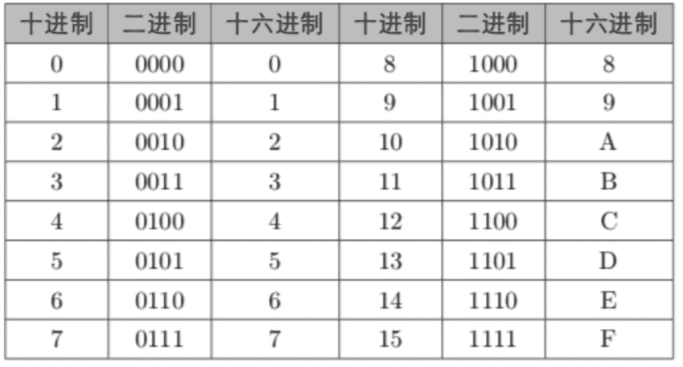

# 第三章 第 1 节 专业技能（上）

> 原文：[`www.nowcoder.com/tutorial/10063/bf725580361e4040a0741d838b33a798`](https://www.nowcoder.com/tutorial/10063/bf725580361e4040a0741d838b33a798)

        由于美国制裁的原因，国家大力扶持集成电路行业，再加上 OPPO 今年立志造芯，高薪校招，硬生生地拉高了芯片行业的薪资，大有比肩软件开发的趋势。在薪资上涨的同时，人才的缺口也是越来越大。巨大的人才缺口导致很多公司今年的招聘非常水，强如高通、英伟达、AMD 等，在数次加薪的情况下，仍招不到学生。中美竞争关系短期内不会发生根本性变化，所以 IC 行业的春天已然到来。

        芯片设计验证工程师是一个专业性非常强的技术工种，对专业技能的要求非常高。所以需要读者扎扎实实地学习大量的专业知识，才能在求职过程中立于不败之地。而正是由于该行业岗位对专业技能要求较高，所以对于学校和专业的要求反而相对较低，这一点在数字验证工程师上尤为明显。因为学校里没有一个专业是对应数字验证工程师这一岗位的，所以只要是跟“电”相关（强相关、弱相关皆可）的专业，几乎都是匹配专业。今年材料专业成功转行做数字验证工程师的比比皆是。综上所述，只要读者认认真真准备，扎扎实实地学习了本章的专业知识，都可以找到一个心仪的工作。

        数字前端工程师包含了数字设计工程师和数字验证工程师（有些公司设计验证不分）。对于数字设计工程师，公司更青睐于科班出身的集成电路工程的研究生，而验证工程师则没有任何专业上的限制。相对于设计工程师而言，验证工程师不仅仅要掌握数字电路基础、Verilog 硬件描述语言等设计知识，还需要掌握 System Verilog 和 UVM 等验证的语言和方法。

        芯片设计验证工程师需要掌握数字电路基础、Verilog 硬件描述语言、System Verilog 验证语言和 UVM 验证方法学。对于初学者而言，可能不太理解这四种知识的层次结构。数字电路知识是数字芯片的基础，是最开始需要进行学习的，在学习的过程中，可以同时学习 Verilog 硬件描述语言，将学到的数电硬件、逻辑用 Verilog 语言进行描述（就是将人的语言翻译成机器语言的过程）。在学习了这些知识后，可以开始学习 System Verilog（SV）验证语言，SV 是基于 Verilog 的，所以要放在它的后面学习。同时，UVM 又是基于 SV 的，所以要放在最后学习。

        本章主要介绍了数字电路基础、Verilog 硬件描述语言、System Verilog 验证语言、UVM 验证方法学等芯片设计验证需要掌握的基本知识，在结合上文提到的教材进行学习之后，基本可以应对芯片设计验证的岗位招聘。另外，在本章最后一节，为大家总结了各大公司在笔试和面试过程中经常提问到的知识点，建议大家将这些常见题牢记于心！牢记于心！牢记于心！

# 1 数字电路基础

        数字电路的知识是芯片研发的基础，本科一般都有这些课程，学过的同学可以快速复习把知识补回来。没有学过的同学，可以根据该文提纲挈领的把课本知识过一遍。

        学习数字电路时，首先我们需要搞清楚什么是数字电路，为什么会大量的应用数字电路，然后再去学习数字电路的相关知识。数制的相关知识是数字电路的基础，包括二进制、八进制、十进制和十六进制等。需要熟练的掌握进制之间的相互转换，以及二进制的加减乘除基本运算。在实际的笔试题目当中，考察最多的就是二进制和十进制、十六进制之间的转换运算。

 

        对于计算机系统来说，二进制是最便于处理的，因为每个 0、1 都可以跟低电平、高电平对应上。所以数制的重点就是二进制的相关知识。包括二进制的原码、反码、补码等编码概念以及运算规则。然后还要掌握应用非常多的格雷码，包括格雷码的运算和应用等知识点。

 

        逻辑运算是数字电路的基础，包括了与、或、非、同或、异或以及变形的复合逻辑。学习过程中要牢牢掌握每种逻辑的运算符号和计算、简化逻辑表达式的方法（卡诺图等）。另外，还需要熟练的掌握真值表和逻辑表达式的相互转换，这些都是笔试过程中常考的知识点。

 

        学完基本的逻辑代数运算之后，还需要了解实现逻辑运算的实际电路—逻辑门电路。其中，需要了解 NMOS 门和 PMOS 门的工作原理以及 CMOS 电路，包括 CMOS 反相器、CMOS 与非门、CMOS 与门以及如何用 CMOS 门表示出一个逻辑表达式。

 

        数字电路主要包含组合逻辑电路和时序电路。组合逻辑电路简单理解就是没有反馈的电路。学习过程中，需要掌握组合逻辑电路的分析方法和组合逻辑电路的设计。可以根据电路图写出各输出端的逻辑表达式和功能，并能根据功能抽象出逻辑表达式进而画出电路图。另外，还需要掌握竞争-冒险现象的原理。这部分内容中最重要的就是常见的集成组合逻辑电路，包括编码器、译码器、数据选择器、数值比较器以及加法器。

        锁存器和触发器是各大公司笔试考察的重点，这类电路具有“记忆功能”，是组合逻辑电路没有的。时序电路的基本电路结构包括了组合逻辑电路和存储电路，其中存储电路就是由触发器构成。在时序电路中，要分析输出方程、状态方程和激励方程，从而搞清楚电路的功能。这部分的重难点为同步时序逻辑电路的分析和设计。

 

        以上是数字电路的考察重点，除了这些，还有半导体存储器、脉冲波形的变换与产生以及数模、模数转换器等内容。笔面试过程中都有可能考察到，需要大家牢牢掌握，一般复习时间控制在 16 天左右即可。

#  2 Verilog 学习简介 

        Verilog 是一种用于数字逻辑电路设计的语言，学习它的目的，就是为了将人类可以理解的数字电路内容翻译成机器可以理解的语言。Verilog 既是一种行为描述的语言也是一种结构描述的语言，也就是说，既可以用电路的功能描述也可以用元器件和它们之间的连接来建立所设计的电路的模型。各大公司主要的考察点，就在于可以熟练地使用 Verilog 描述数字电路结构和逻辑。

        学习一门语言，首先要搞懂它最基本的模块构成，就好像我们学习 C 语言，第一开始要先学习“Hello world”。所以我们要先学习 Verilog 语言最基本的模块构成，这些在我们上文推荐的教材当中都有详细的介绍。接下来就是要学习该语言常用的一些变量类型，包括 reg 型、wire 型、integer 型和 parameter 型。以及各种进制数字的描述方式，还有 0、1、x 和 z 的四种数值意义。这些都是学习 Verilog 语言的基础。

        在学完变量和常量的描述方式后，紧接着需要学习 Verilog 语言中的运算符，运算符主要包括算术运算符、赋值运算符和逻辑运算符等。学习的过程中，不仅要牢牢掌握每种运算符的表示方式，也要搞清楚各种运算符之间的运算顺序，并能通过运算符写出 Verilog 语言下的逻辑表达式。

 

        学习运算符的同时，可以顺便将一些基本的标识符和关键词背下来，比如 always、assign、begin、and 和 or 等。然后，需要深入的理解阻塞赋值与非阻塞赋值的区别，这个是考察的重点，几乎每家公司的笔面试都会考察到。

        在学习完 Verilog 语言的基础知识之后，需要学习条件语句和循环语句等内容。条件语句的描述方式跟 C 语言比较类似，包括 if_else 语句和 case 语句。其中，需要注意的是，如果用到 if 语句，最好写上 else 项，如果用 case 语句，最好写上 default 项。这样子可以避免偶然生成的锁存器错误，可以使设计者更加明确设计目标，同时也可以增强 Verilog 程序的可持续性。

        Verilog 中存在着四种类型的循环语句，包括 forever 连续的执行语句、repeat 连续执行一条语句 n 次、while 执行一条语句直到某个条件不满足以及 for 通过判断来决定语句的循环执行。

        Verilog 中有两种过程块，分别是 initial 块和 always 块，initial 块的内容只能执行一次，always 块的内容循环执行。过程块是行为模型的基础。如果有多个 always 块，它们都是并行运行的。

        Verilog 中用 task 和 function 说明语句分别来定义任务和函数。利用任务和函数可以把很大的程序模块分解成许多较小的任务和函数，这样方便理解和调试。Task 和 function 有很多不同点，这块的知识点是必考题，需要大家牢牢掌握。

 

        Verilog 中还有很多的系统函数，比如$display 和$write 等，在笔面试过程中，也很有可能会问到这些，需要大家有一定的了解。以上基本上是一些比较重要的复习点，同学们要认真把上文推荐的课本过一遍，做到可以独立熟练地写出数字电路结构和逻辑，复习时间控制在 16 天左右即可。