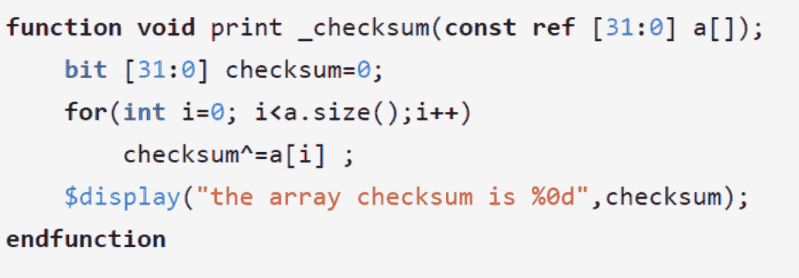
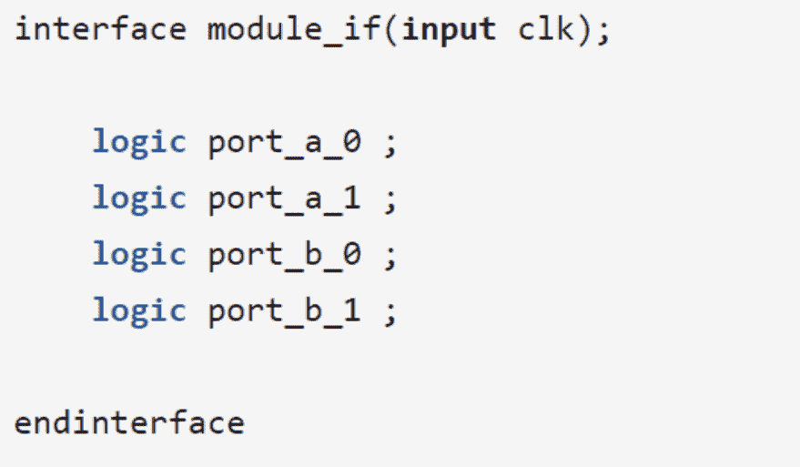
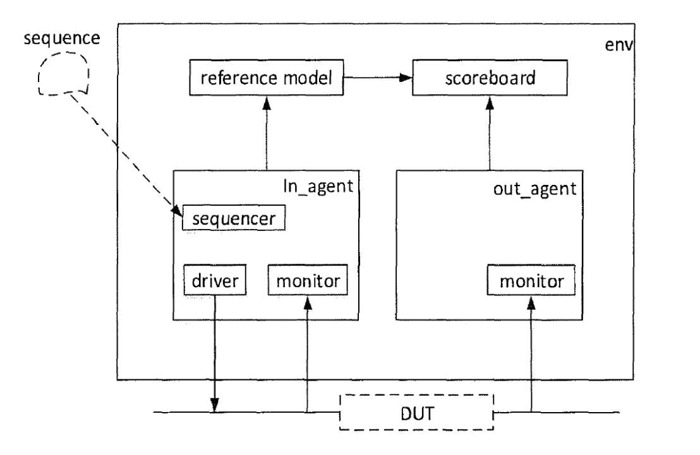
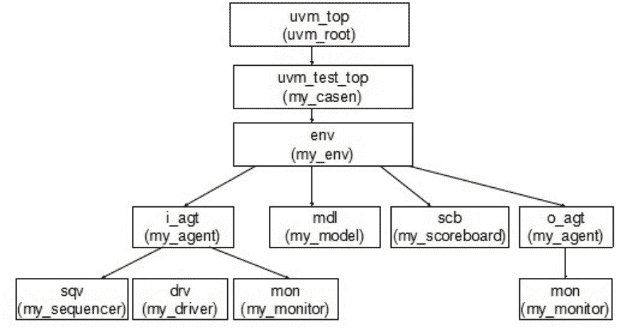

# 第三章 第 2 节 专业技能（中）

> 原文：[`www.nowcoder.com/tutorial/10063/2e2063ecdef7405db3fb6008b8e7c237`](https://www.nowcoder.com/tutorial/10063/2e2063ecdef7405db3fb6008b8e7c237)

# 1 System Verilog 学习简介

        我们主要将 System Verilog（SV）当作一门验证语言进行学习即可，学习的过程中，主要关注如何用 SV 搭建 testbench，书写 testcase。验证的过程，主要就是给 DUT 施加一个激励，然后观测输出是否符合预期。在这个过程中，为了覆盖它的功能点，我们需要编写很多的定向测试案例和随机测试案例。SV 的学习就是围绕这个过程展开。

        SV 是在 Verilog 基础上发展起来的，有很多内容都是一样的，学习的过程中只需要着重学习新加入的内容即可。Verilog 中的数据类型为四状态数据类型，即 0，1，x 和 z，SV 当中引入了两状态的变量，比如 bit、int、byte 和 longint 等。另外还有动态数组和队列等声明和引用元素的新方式。

        SV 当中也会大量的使用 task 和 function，同学们只需要注意它们在 SV 中一些新的特性即可。在 SV 当中，除了可以继续使用 verilog 中 task/function 的声明风格外，还提供了一种类似 C 语言的声明风格。在声明 task 和 function 时，可以设置默认的参数值，这样当使用 task 和 function 时对应参数缺省时，可以自动带入默认参数。另外，SV 中可以使用形式参数，能够节约内存并且使程序更加灵活化。

 

        SV 中优化了 Verilog 的模块接口，引入了 interface 这种新的接口结构类型。Interface 用于将验证平台中各个模块连接起来，而且更加便于修改。它是通过关键词 interface 来声明，声明的方式与 module 非常类似。Interface 的引入使得各个模块之间的连接变得非常便利。

 

        SV 当中引入了面向对象编程（OOP），学过 C++的同学应该对 OOP 非常熟悉。OOP 的主要术语包括类（class）-包含变量和子程序（函数或任务）的基本构建块；对象（object）-类的一个实例；句柄（handle）-指向对象的指针；属性（property）-存储数据变量；方法（method）-任务或者函数中操作变量的程序性代码。其中，类是对象的一个模块，其内部定义了数据和方法，对象是类的一个例化和实现。如果之前没学过 C++等面向对象编程的语言，刚开始学这块可能会有点吃力，需要下功夫仔细把推荐教材学透。面试过程中，考官也非常喜欢提问 OOP 这块的知识点，来考察对 SV 的掌握程度。

        另外，还有一些线程、虚方法等内容，都是需要仔细钻研的。总体而言，SV 的难度要大于数字电路和 Verilog，所以需要花费更多的时间和精力。不过只要将推荐的那本***学透，应付笔面试肯定没有问题。

# 2 UVM 学习简介

        芯片一旦制造出来，就没有办法再进行更改，所以我们要在验证阶段尽可能地排除掉电路中的 bug。但是验证测试是没有尽头的，我们永远无法将所有的情况都检测到，因此就需要一种方法学来指引我们的验证过程。UVM 就是这样的一门验证方法学，它一经推出就获得了各大公司的青睐，目前是使用最广泛的方法学。

        提到验证方法学，大部分初学者可能脑海中没有相关的概念。举个例子而言，我们搭建 testbench 的过程就好像写一篇文章，那么 SV 就好像我们写文章所要使用的汉字。当然仅仅认识了汉字，通常是写不出优秀文章的，这就需要学习写文章的方法，例如总分总、欲扬先抑还有一些名言警句、诗词成语等，这些写作的方法就相当于 UVM 验证方法学。

        一个完整的 UVM 验证平台应该包括产生激励的模块、计分板、参考模型和对照 DUT 输出结果的模块等。Sequencer 会启动 sequence，从 sequence 那里获取数据，然后将数据交给 driver。Driver 则负责将数据发送给 DUT，施加激励。Driver、monitor 和 sequencer 被封装在一起形成 agent。Reference model 的输入和 DUT 完全一样，它的输出会传输给 scoreboard，用来跟 DUT 产生的输出进行比较，monitor 则用来检测 DUT 的输出。Env 相当于一个容器，将所有的这些派生自 UVM_component 的都包含在其中成为其成员变量。

 

        其中，各个模块都是通过类来实现的，并且一层包裹着一层，形成 UVM 树形结构，树的根为 UVM_top（而不是 UVM_test），UVM_test 的 parent 是 UVM_top，而 UVM_top 的 parent 是 null。

 

        UVM_object 和 UVM_component 是 UVM 中的两大基础类，树形结构的节点都是派生自 UVM_component。UVM_component 则是继承于 UVM_object，包含了一些 UVM_object 没有的特征和函数。这块的知识点比较繁杂，大家需要通过教材仔细地学习一下。另外，UVM 中有很多机制，这些机制主要是为了提高代码的通用性和自动化执行。包括 phase 机制、factor 机制、objection 机制等，需要读者认真学习。

        UVM 中各个模块之间的通信主要采用 TLM1.0，TLM 是一种起源于 SystemC 的通信标准。它把一组具有某一特定功能的信息封装在一起形成一个类，传输的过程中，就以这个类作为基本单位进行传输。常用的操作包括 put、get 和 transport。传输的过程中，会存在 PORT 和 EXPORT 两个端口，信息就通过操作指令在端口之间进行传输。

        UVM 当中引入了寄存器的模型，它是现实中寄存器的一个例化模型。可以直接使用寄存器模型内置的函数完成寄存器的访问，比如启动 sequence 及将结果返回这些事情，都可以由寄存器模型来自动完成。UVM 寄存器模型的本质就是重新定义了验证平台与 DUT 的寄存器接口，简化了寄存器访问的流程。对于初学者而言，这部分的学习有一定的难度，需要花费一定的时间来钻研。

        整体而言，UVM 验证方法学入门是非常简单的，大部分同学在学完第二章之后，就有一种已经学懂了的错觉。有一些重难点，还是需要花费一定的时间来学习的，按照上文推荐的教材按部就班学习即可。