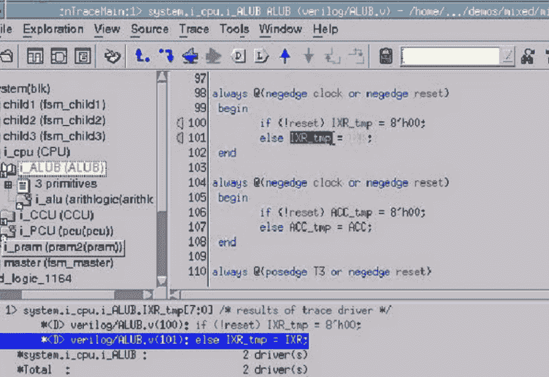
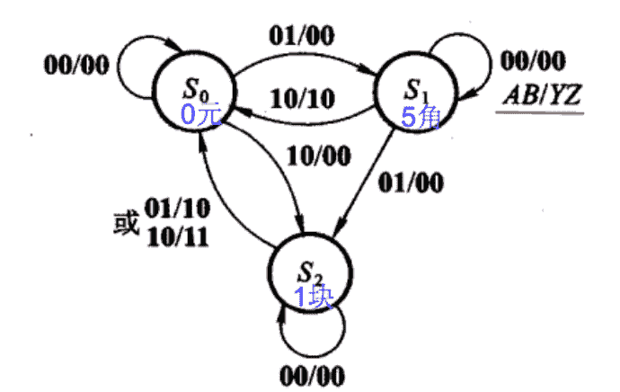
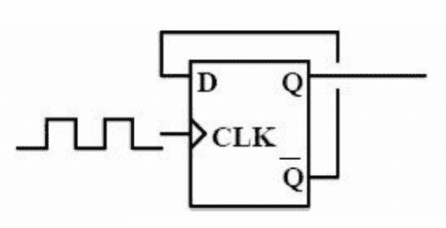
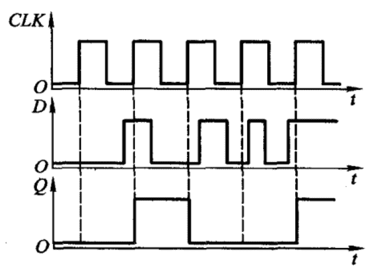
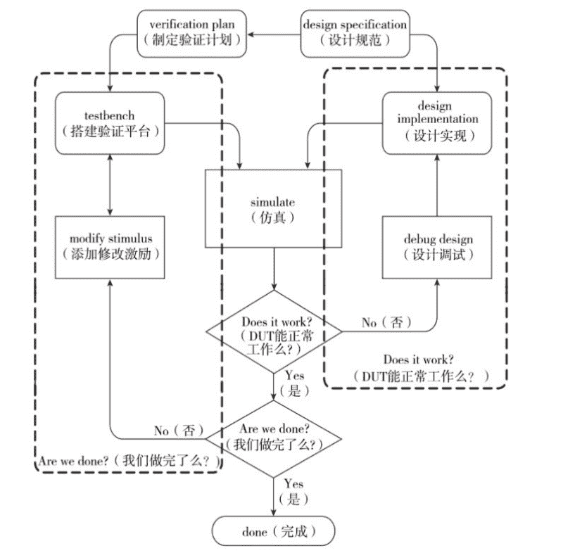
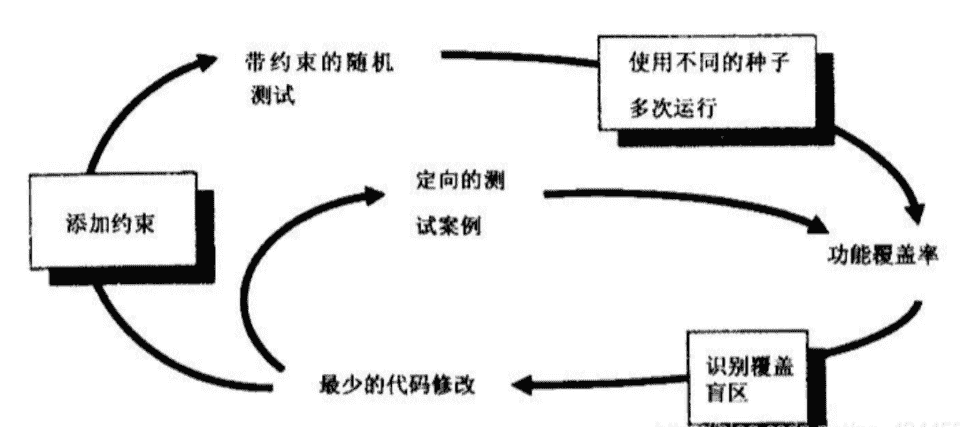
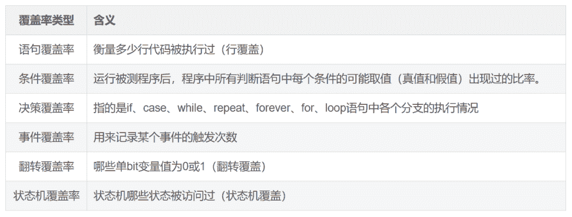

# 第三章 第 3 节 专业技能（下）

> 原文：[`www.nowcoder.com/tutorial/10063/9c648e919720407595cf65f5c0d4b6f4`](https://www.nowcoder.com/tutorial/10063/9c648e919720407595cf65f5c0d4b6f4)

# 1 其他专业知识

        按部就班的学习完上述的四本教材之后，基本上就可以应对各大公司的招聘了。除此之外，还有一些知识，如果掌握的话可以锦上添花，甚至拿到 sp 的薪资待遇。

        除了以上的四本教材之外，能学习一点断言的知识，可以为你加分很多。断言的学习教材一般使用《SystemVerilog Assertions 应用指南》。断言简单来说，就是用来检查某一行为与我们的预期是否相符，如果相符则断言成功否则断言失败，类似于条件语句。断言可以放在过程块（procedural block）、模块（module）、接口（interface）和程序（program）中。断言的使用过程中，一点要注意时间点，具体的语言规则 SV 里有简单的介绍。掌握断言的使用方法和技巧，可以加分很多。

        首先，需要对 Linux 系统操作指令有一定的了解，另外要掌握一些常用的软件工具。仿真过程中主要会用到的工具有 VCS、NC-sim、questasim 等，一般学习一下 VCS 的基本使用方法即可。Verdi 则是最常用的看波形工具，这些软件会在以后的工作当中经常用到。如果可以提前掌握，可以加分不少。

 

        除了这些系统软件，最好可以掌握一些脚本语言的使用。例如 makefile、shell 等用来搭建基本的仿真环境。Perl、python 等脚本语言来辅助验证的过程，实现流程的自动化。另外，可以了解计算机的一些基本的结构和一些常见的协议和架构，比如 ARM 架构、AXI/AHB 协议、MIPI 协议和 DDR 协议等等。

        总的来说，在熟练掌握了数字电路基础、Verilog 编程、SystemVerilog 验证语言和 UVM 验证方法学之后，可以进一步的学习一些其他的相关知识，这些都会在招聘的过程中给你加分。当然也可以根据自己心仪的岗位公司，有针对性地学习这些知识，比如应聘做存储器的公司，可以提前学一点跟存储器相关的知识内容。

# 2 笔面试常见题

        根据各大公司往年的笔面试题目，在这里为大家总结了一些常见的考题。考题大部分仍是来源于上文中的基础知识。这些考题出现的频率非常高，希望大家可以参考着学习一下。

**一、跨时钟域同步的几种方法？**

**1、异步时序定义**：异步时序设计指的是在设计中有两个或以上的时钟，且时钟之间是同频不同相或不同频率的关系。而异步时序设计的关键就是把数据或控制信号正确地进行跨时钟域传输。

**2、亚稳态**：每一个触发器都有其规定的建立(setup)和保持(hold)时间参数,在这个时间参数内，输入信号在时钟的上升沿是不允许发生变的。如果在信号的建立时间中对其进行采样，得到的结果将是不可预知的，即亚稳态。

**3、单比特同步策略：**

采用两级 DFF 同步器，可以提高可靠性，降低亚稳态的概率。用两级寄存器打两拍，可以大大降低亚稳态的发生，假设第一个时钟沿到来时输入信号刚好处于上升沿，只要保证其建立时间和保持时间能满足第二个上升沿即可。三级寄存器只是相当于沿拍，意义不大，还会增大面积。快采慢很简单，慢采快的话需要信号多保持几个上升沿。

**4、多比特同步策略：**

**控制信号多比特同步：**如果有两个控制信号需要跨时钟同步，且两个信号同时拉高才能正确操作的情况下，只要将两个控制信号合并成一个控制信号即可。

**数据信号多比特同步：**

① **异步双口 R****AM****+格雷码**：将上一个模块输出的信号转换成格雷码，写进异步双口 RAM 当中，对写进的格雷码打两拍，然后再将 RAM 中的数据读出转换，这样子相当于是单比特信号同步了

② **异步 fifo**：fifo 是一种先进先出的数据缓冲器，只能顺序读写，不能跳读。

异步 fifo 就是读写时钟不相同，同步 fifo 就是读写时钟相同。Fifo 的判空与判满，读写地址最高位不同，其余位相同时，为判满；当所有位数都相同时，为判空。

异步 fifo 判满时，需要将读指针同步到写时钟域进行判断，格雷码的最高位和次高为不同，剩下的都同，就是满。异步 fifo 判空时，需要将写指针同步到读时钟域进行判断，格雷码完全相同，就是空。

③ **握手协议**：当慢采快时，可能信号持续时间比较短，慢时钟域采集不到时，需要产生一个更长的高电平信号发送给慢时钟域，慢时钟域接受到之后再发送回去一个信号，让快时钟域产生的信号拉低。

**二、阻塞赋值和非阻塞赋值？**

阻塞赋值计算赋值完成之后再执行下一句，串行执行；非阻塞赋值的赋值不会立刻生效，并行执行。

**三、异步复位同步释放？**

异步复位：复位信号不受时钟的影响，只要复位信号发出，系统就会复位。

同步释放：为了避免亚稳态，让拉高的复位信号打两拍，达到与时钟边沿同步的目的。

主要由两个 D 触发器组成，将复位信号打两拍，防止亚稳态的产生。

**四、cache**:高速缓冲存储器

**五、建立时间，保持时间？**

建立时间：时钟沿到来之前，数据需要保持稳定不变的时间；

保持时间：时钟沿到来之后，数据需要保持稳定不变的时间。

**六、reset****recovery****time 和 removal****time？**

Recovery time 恢复时间：异步复位信号需要在时钟沿到来之前，就变成非复位信号并保持一定的时间。

Removal time 去除时间：在时钟沿到来之后，复位信号需要保持一定的时间。

**七、数字 I****C****前后端流程？**

①设计 design：确定项目需求，制定芯片的指标，用 verilog 进行编程，

②验证 verification：写验证计划，搭建 testbench 和 testcase，RTL 的仿真验证。

④ RTL freeze：确定 RTL 文件，不准再修改

⑤ Logic Synthesize：逻辑综合，将 RTL 描述转换成门级网表

⑥ STA 静态时序分析：检查时序约束是否满足，分析时钟质量

⑦ DFT：通过 DFT 可以观测到芯片的内部信息，可以观测缺陷

⑧ 自动布局布线，形式验证

⑨ 流片

**八、两个模块，时钟完全没有关系，怎么传递信号？发送端和接收端都应注意什么问题？**

跨时钟域同步处理，单比特-两级 DFF 同步器；多比特-异步双口 RAM+格雷码；异步 fifo；握手协议。

**九、如果要做一个低功耗设计，有什么想法？**

①减低电源电压

②门控时钟

③多 power 域的设计

④逻辑优化，减少无谓的翻转

**十、时钟路径约束？**

时钟路径：时序路径是指信号可以继续穿过，不必等待其他触发条件的路径。沿着时序路径，信号仅在通过电路元器件时有延迟。

关键路径：延时最长的一条路径称为关键路径。

时钟路径约束：约束就是为了满足寄存器的建立时间，数据传输延时时间加上建立时间需要小于时钟周期。

**十一、S****V****基础，包括@signal 触发和 wait****(signal)****的区别，事件触发，队列操作，task 同步调度（fork****…join,fork****…j****oin_any,fork****…j****oin_none****的用法差异）**

在 SV 中，触发事件用->，等待事件用@或者 wait，采用@等待事件时，如果触发阻塞同时的话，容易产生竞争冒险，而 wait 则一定可以等待到，且采用 triggered 函数可以检测到事件是否已经触发或正在触发。

**队列操作**：队列的声明使用带有美元符号的下标，队列元素的编号从 0 到$

q[$]={0,1,2};q.insert(1,q2)插入元素和队列；q.delete(1)删除第一个元素；q.push_back(8)在队列的末尾插入 8；q.push_front(6)在队列的前面插入 6；j=q.pop_back,j 等于最后一个元素；j=q.pop_front,j 等于最前面一个元素。

fork_join 要等所有的子线程结束后才能执行父线程；fork_join_any 只要有一个子线程结束就可以执行父线程；fork_join_none 不需要等待子线程结束，父线程并行执行。

**十二、门控时钟电路结构**

门控时钟在原有的基础上增加一个逻辑模块，没有使能信号时，时钟不翻转，避免了动态功耗

**十三、静态功耗和动态功耗**

动态功耗：

当门翻转时，负载电容充放电，称为翻转功耗；

pmos 管和 cmos 管的串并联结构都导通时有短路电流，称为短路功耗

静态功耗：

流过截止晶体管的亚阈值泄露电流

流过栅介质的泄露电流

源漏扩散区的 p-n 节泄露电流

**十四、请谈谈你对 U****VM****验证方法学的理解**

UVM 验证方法学是基于 system verilog 语言形成的一个高效的验证方法。它的主要特点是提高了代码的复用性，使得验证人员能通过代码移植复用修改快速搭建验证平台，从而将主要精力放在具体测试用例的编写上。另一方面，UVM 封装了很多好用的方法，这使得验证人员不必过多关注底层实现，而且减少了验证平台的调试时间。

**十五、请谈谈 U****VM****组件的关系**

1、testcase：在 testbench 中首先需要创建一个测试用例，它用来实例化和配置 environment，使 env 模拟不同的配置环境，执行不同的测试行为；指定测试的 sequence，若一个功能点的 testcase 的 env 配置完成，则不能改动，若要改动或修复则需要重新配置 env。

2、environment 组件：env 组件可以将 testbench 中所有组件封装在一起，在该类中可以实例化多个 agent,reference model,scoreboard 等，并将其互连。注意：一旦该组件定义完成，后续不得轻易对其更改，若更改须重新验证所有的 testcase。因此在定义时最好事先配置好 interface，使 env 就有可配置性。

3、agent 组件：agent 中可以实例化 sequencer，driver，monitor 等组件，并将这些组件连接起来。

4、sequencer 组件：用来启动 sequence，并将 transaction 对象发送给 driver。绝大部分功能由 UVM 实现。

5、driver 组件：激励驱动，从 sequencer 接收 transaction 对象，并转化为 DUT 可接收的 pin 级信号，再按照 DUT 总线接口协议要求驱动 DUT。

6、monitor 组件：driver 类负责把 transaction 级别的数据变成 DUT 的端口级别，并驱动给 DUT；monitor 的行为与其相对，用于收集 DUT 的端口数据，并将其转换为 transaction 交给后续的组件 reference model，scoreboard 处理。

7、reference model 组件：模拟 DUT 的功能行为，根据输入的激励产生相应的结果，并交给 scoreboard。无直接调用基类，均由 uvm_compoent 拓展。

8、scoreboard 组件：比较 reference model 和 DUT 的输出结果是否一致，从而判断 DUT 的功能是否正确；同时可以将功能覆盖率收集嵌入到该组件中。

**十六、请谈谈****virtual sequencer 与 sequencer 的区别，以及为什么要用 virtual sequencer？**

· 如果只有一个驱动端 agent，显然是不需要使用 virtual sequencer 的。

· 如果有多个驱动端 agent，但是多个激励之间并无协调关系，virtual sequencer 也并无必要。

· 如果有多个驱动端 agent，而且多个**激励之间存在协调关系**，那么 virtual sequencer 就很有必要了。这个时候环境中需要包含一个甚至多个 virtual sequencer 了。

· virtual sequence 和 virtual sequencer 的“virtual”有何含义呢？

· **Virtual sequencer 有三个属性：**

· Virtual sequencer 控制其他的 sequencer

· Virtual sequencer 并不和任何 driver 相连

· Virtual sequencer 本身并不处理 item

· 并不像正常的 sequencer 那样，将 sequence item 通过 sequencer port 传递给 driver。**Virtual sequencer 通过一个指向 subsequencer 目标的句柄来指定 sequencer**。这里的 subsequencer 就是和 driver 相连接的真实 sequencer。所谓的 virtual 就是指真正的 sequence 并不是在 Virtual sequencer 里产生和传递的。一个 virtual sequencer 可以通过它的 subsequencer 产生许多种不同类型的 tranction。而**virtual sequencer 的作用就是在协调不同的 subsequencer 中 sequence 的执行秩序了。**

**十七、为什么会有****sequence,sequencer,以及 driver，为什么要分开实现？这样做有什么好处？****最初的验证平台，只需要****driver 即可，为什么还需要 sequence 机制？**

· 如果事务在 driver 里定义，会产生一个问题。比如事务种类繁多，岂不是每次启动一个事务，都要修改 driver 的 main_phase 代码部分。

· 如果定义多个 driver，那么会把 UVM 树形结构搞的乱七八糟。所以，要从 driver 里剥离事务产生（具体包括事务定义、事务产生的步骤）的代码部分。driver 只负责事务驱动即可。

· 补充一句，验证的 case_list，是用 sequence 机制去实现的；并**保证了 UVM 树形结构的单一性、统一性。使得可维护的能力大大加强。**

上述解释，**也是 sequence 和 sequence_item 不属于 uvm_componet 的原因。**case 相关的代码改动，都在 sequence 和 sequence_item 里实现。

**十八、你写过****assertion 吗？assertion 分为哪几种？简单描述下 assertion 的用法。**

· Systemverilog 断言属于验证方法中的一种，**断言(assertions)就是对设计属性(property 行为)的描述**，如果一个属性不是我们期望的那样，那么断言就会失败。assertions 与 verilog 相比，**verilog 是一种过程性语言**。它的设计目的是硬件描述，它可以很好的控制时序，但是描述复杂的时序关系，代码较为冗长，**assertions 是一种描述性语言**，设计目的为仿真验证，可以有很多内嵌的函数来测试特定的时序关系和自动收集覆盖率数据。

· SVA 分为**并发断言和即时断言**两种。**并发断言是基于时钟周期的，在时钟边沿计算表达式，它可以放在模块(module)，接口(interface)，或程序块(program)的定义中，以关键词“property”来定义**，可以在静态验证工具和动态验证工具中使用。即时断言是基于事件的变化，表达式的计算像 verilog 中的组合逻辑赋值一样，是立即被求值的，与时序无关，必须放在过程块中定义

**十九、验证的思想和流程？**

· 验证永远是不充分的，永远是没有最好的，用一个同事的话说，如果非要给验证订一个期限的话，我希望是一万年。

目前通用的做法是看 coverage.

· .看 design spec

· 了解相关协议

· 编写 test plan 及 verification spec

· 搭建验证平台

· 依据 testplan 创建测试用例 testcases

· 仿真和 debug,包括环境和 design 的 bug,花费时间最多。工具是 VCS/verdi,debug 的手段主要有：查看 log，看波形

· regression 和覆盖率

· code review

**二十、****锁存器（latch）和触发器（flip-flop）区别？**

电平敏感的存储器件称为锁存器。可分为高电平锁存器和低电平锁存器，用于不同时钟之间的信号同步。

有交叉耦合的门构成的双稳态的存储原件称为触发器。分为上升沿触发和下降沿触发。可以认为是两个不同电平敏感的锁存器串连而成。前一个锁存器决定了触发器的建立时间，后一个锁存器则决定了保持时间。

**二十一、****什么是时钟抖动？**

时钟抖动是指芯片的某一个给定点上时钟周期发生暂时性变化，也就是说时钟周期在不同的周期上可能加长或缩短。它是一个平均值为 0 的平均变量。

**二十二、****设计一个自动饮料售卖机，饮料 10 分钱，硬币有 5 分和 10 分两种，并考虑找零，**

**1.画出 fsm（有限状态机）**

**2.用 verilog 编程，语法要符合 FPGA 设计的要求**

**3.设计工程中可使用的工具及设计大致过程？**

设计过程：

1、首先确定输入输出，A=1 表示投入 10 分，B=1 表示投入 5 分，Y=1 表示弹出饮料，Z=1 表示找零。

2、确定电路的状态，S0 表示没有进行投币，S1 表示已经有 5 分硬币。

3、画出状态转移图。

 ```cpp
module sell(clk,rst,a,b,y,z);

input clk,rst,a,b;

output y,z;

parameter s0=0,s1=1;

reg state,next_state;

always@(posedge clk)

begin

   if(!rst)

   state<=s0;

   else

   state<=next_state;

end

always@(a&nbs***bsp;b&nbs***bsp;cstate)

begin

   y=0;z=0;

   case(state)

   s0: if(a==1&&b==0) next_state=s1;

      else if(a==0&&b==1)

begin

next_state=s0; y=1;

end

else

next_state=s0;

s1: if(a==1&&b==0)

begin

next_state=s0;y=1;

end

      else if(a==0&&b==1)

begin

next_state=s0; y=1;z=1;

end

else

next_state=s0;

   default: next_state=s0;

endcase

end

endmodule
```

**扩展：设计一个自动售饮料机的逻辑电路。它的投币口每次只能投入一枚五角或一元的硬币。投入一元五角硬币后给出饮料；投入两元硬币时给出饮料并找回五角。**

1、 确定输入输出，投入一元硬币 A=1，投入五角硬币 B=1，给出饮料 Y=1，找回五角 Z=1；

2、 确定电路的状态数，投币前初始状态为 S0，投入五角硬币为 S1，投入一元硬币为 S2。画出转该转移图，根据状态转移图可以写成 Verilog 代码。



**二十三、****说说静态、动态时序模拟的优缺点？**

静态时序分析是采用穷尽分析方法来提取出整个电路存在的所有时序路径，计算信号在这些路径上的传播延时，检查信号的建立和保持时间是否满足时序要求，通过对最大路径延时和最小路径延时的分析，找出违背时序约束的错误。它不需要输入向量就能穷尽所有的路径，且运行速度很快、占用内存较少，不仅可以对芯片设计进行全面的时序功能检查，而且还可利用时序分析的结果来优化设计，因此静态时序分析已经越来越多地被用到数字集成电路设计的验证中。

动态时序模拟就是通常的仿真，因为不可能产生完备的测试向量，覆盖门级网表中的每一条路径。因此在动态时序分析中，无法暴露一些路径上可能存在的时序问题；

**二十四、****用 D 触发器做个二分频的电路？画出逻辑电路？**

 ```cpp
module div2(clk,rst,clk_out);

input clk,rst;

output  reg clk_out;

always@(posedge clk)

begin

   if(!rst)

   clk_out <=0;

   else

   clk_out <=~ clk_out;

end

endmodule
```

现实工程设计中一般不采用这样的方式来设计，二分频一般通过 DCM 来实现。通过 DCM 得到的分频信号没有相位差。 

或者是从 Q 端引出加一个反相器。

**二十五****、用波形表示 D 触发器的功能****。**



**二十六、Verilog 描述 D 触发器**

```cpp
module DFF(clk,data,reset,q)

input clk,data,reset;

output q;

reg q

always@(posedge clk)

if(~rest)

begin

q<=1’b0;

end

else

begin

q<=data;

end

endmodule
``` 

**二十七、Verilog 描述 4 位加法计数器**

```cpp
module add(out,clk,enable,reset)

input clk,enable,reset;

output [3:0]out;

reg [3:0]out;

always@(posedgeclk)

if(reset)begin

out<=4’b0;

end

else

if(enable)begin

out<=out+1;

end

endmodule
``` 

**二十八、Verilog 描述奇数倍分频器、偶数倍分频器**

偶数倍：

```cpp
module div(clk_in,reset,clk_div)

input clk_in,reset;

output clk_div;

parameter X=6;

reg clk_div;

reg [3:0]cnt;

always@(posedge clk_in&nbs***bsp;negedge reset)

if(~reset)begin

cnt<=4’d0;

clk_div<=1’b0;

end

else

if(cnt<=X/2-1)begin

cnt<=cnt+1;

clk_div<=clk_div;

end

else

begin

cnt<=4’d0;

clk_div<=~clk_div;

end

ensmodule
``` 

奇数倍：

```cpp
module div(clk_in,reset,clk_div)

input clk_in,reset;

output clk_div;

parameter X=6;

reg clk_div;

reg [3:0]cnt;

always@(posedge clk_in&nbs***bsp;negedge reset)

if(~reset)begin

cnt<=4’d0;

clk_div<=1’b0;

end

else

if(cnt<=X/2-1)begin

cnt<=cnt+1;

clk_div<=clk_div;

end

else

begin

cnt<=4’d0;

clk_div<=~clk_div;

end

ensmodule
``` 

# 3 项目技能

## **3.1 T****estplan 书写技巧**

        除了学习基础知识之外，面试需要有一些相关的项目经验。大家在学习教材的内容之后，可以在网上找一些相关的小项目练一下手，面试过程中只要有一定的经验即可，但是一定要保证对自己做过的项目足够熟悉。

        验证项目其实主要就是回答两个问题：“does it work？”（DUT 能够正常工作吗？）和“are we done?”（我们验证完了吗？）。第一个问题，是我们最基本的工作，就是有没有帮设计部门验证好 DUT，设计是否符合设计者的意图；第二个问题就是告诉我们验证部门的领导，我们的验证是否充分和完备，验证是否收敛。

 

        芯片验证的目的是为了保证设计内容的正确性，所以验证计划中首先要详尽地分析一下设计内容 spec。然后从设计当中提取出主要的功能点和对应的测试用例。目前的设计都是非常复杂的，一个典型的百万门的设计可能会有百万乃至上亿个需要测试的功能点，所以需要我们将测试的空间缩小到一个可以管理的范围。然后针对这些功能点拟定一个验证策略和详尽的测试用例。这三者应该是相互对应的，也就是说我们的验证计划里应该写明，提取出的某一个功能点，采用什么样的验证策略进行验证，编写一个什么样的测试用例可以验证这个功能点。这些内容也是面试过程中会问到的。

## **3.2 T****est****bench****编写简介**

    Testbench 的搭建主要是为了利用学到的基础知识，正如前文举的例子，搭建验证平台就好像写一篇文章。而我们需要做的就是给面试官展示一篇优美的文章。因此，首先我们要保证这篇“文章”是我们自己亲手写的，对其中的各种细节都非常了解，比如，testbench 的结构、各模块之间的通信方式等。当然了，对于大部分初学者来说，直接凭借自己的力量写出一篇优美的“文章”是比较困难的。所以，我们写的时候，可以参考别人编写的完整的 testbench，或者干脆背熟一篇优美的文章（背完要转化成自己的东西）。另外，我们在搭建验证平台的过程中，要以可重用为基本原则，并且方便我们添加测试用例。

## **3.3 Testcase****编写简介**

        在搭建完验证平台之后，就需要我们编写具体的测试案例，测试案例的编写一定要以功能点为依据。面试的过程中，针对项目肯定会先问你验证的设计内容是什么，你提取了哪些功能点，针对这些功能点编写了哪些测试案例，最后的功能对不对。因此，我们编写测试案例就是要依据功能点的。

        具体的测试案例主要分为随机测试和定向测试，定向测试主要是针对某一个具体的情况进行测试。随机测试则通常可以找到更多的漏洞，而且由于随机性，往往还可以找到一些意料之外的 bug。通常情况下，会编写受约束的随机测试来检查漏洞，然后最后几个漏洞可能只能通过定向测试来发现。对于初学者而言，也可以对照着一些比较好的测试案例编写自己的测试案例，依样画葫芦，这样的学习往往效率最高。

 

## **3.4 覆盖率简介**

        验证是永无止境，所以我们需要一种判别验证进度的方法--覆盖率。覆盖率主要包括代码覆盖率和功能覆盖率，这几乎是每家公司的必考知识点。代码覆盖率主要包括语句覆盖率、条件覆盖率、决策覆盖率、事件覆盖率和翻转覆盖率等。代码覆盖率是用来衡量对于设计测试的有多彻底，而非针对验证计划。有可能当前的设计并没有完全实现设计规范。因此，即使代码覆盖率达到了 100%，也只能说我们对设计的代码都测试到了，但是并不能知道是否完成了整个测试计划，更无法得知是否实现设计规范。工具会自动的完成代码覆盖率的收集，仿真完毕之后相应的数据库会被创建。

 

        功能覆盖率是跟设计的规范紧密相关的，它是用来衡量哪些功能已被覆盖。例如，对 D 触发器的验证计划除了涉及触发器的数据存储外，还应该检查触发器如何被复位到某个已知状态，在你的测试对这个设计特性全部验证之前，功能覆盖率就不会达到 100%。

        面试的过程中，最喜欢问你验证项目的覆盖率达到了多少，并会提问你代码覆盖率高，功能覆盖率低是为什么，或者代码覆盖率低，而功能覆盖率高又是因为什么。这些都需要我们提前学习准备。