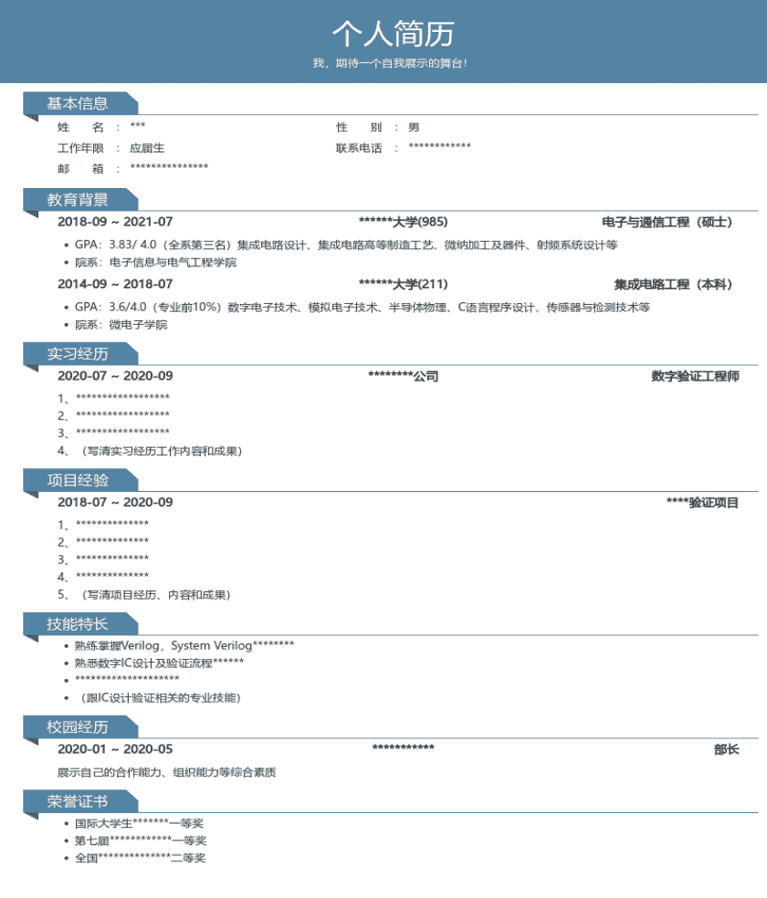

# 第四章 第 1 节 简历制作与投递

> 原文：[`www.nowcoder.com/tutorial/10063/956f0e8753164b5d85c8b9188767dc24`](https://www.nowcoder.com/tutorial/10063/956f0e8753164b5d85c8b9188767dc24)

### 1 如何制作简历 

        简历是展示自己的一种工具，需要告诉我们的应聘单位，我是谁？我做过什么？我能做什么？一份好的应聘简历一定要足够简洁，不能不加筛选的将所有闪光点都罗列上去。好的简历还要有丰富的相关内容且不能过于花哨，另外需要体现出跟芯片研发的专业相关性。          下面为大家展示一份比较好的 IC 研发岗位简历模板，大家可以根据该模板设计制作自己的简历。不过简历的制作，切忌生搬硬套，要通过简历真实有效的展示自己的闪光点。一份简洁、重点突出和内容详实的简历就是好简历，另外，不同公司也要有针对性的写一些相关技能的内容。                                                                  

        首先，一份简历需要足够简洁，一般控制在一页内容为佳。应聘单位的一个岗位通常都会收到上百份甚至上千份的简历，过于冗长的简历会使面试官抓不住重点。这就需要我们对自己的闪光点进行筛选，每一个写进简历的内容都要精准的体现出自己的一个优点，并且这个优点正是芯片研发岗位所需要的。对于那些跟工作岗位相关度不高的优点可以选择少写或者干脆不写。

        另外，在保持简洁的同时，还要保证自己简历内容丰富不单薄。过于单薄的简历会令面试官怀疑你的优秀程度。对于一些闪光点不多的同学，可以多写一些跟岗位相关的课程以及获得的成绩。芯片研发本质上是一个技术岗位，需要学习很多的基础课程，将这些内容放到简历之中，可以告诉面试官，你很好地掌握了基本的入门知识。

        最后，简历要体现出和芯片研发的专业相关性。很多转行的同学可能研究生课题跟芯片研发的关系不大，所以要尽量体现出自己掌握的跟芯片研发相关的知识。另外，写一些跟芯片研发相关的项目。总而言之，简历中必须要体现出跟芯片研发的相关性，否则面试官会认为你根本不了解这个岗位，很可能简历初筛的时候就会被 pass 掉。

**一份好的简历可以让面试官一眼就获得你的有用信息。简历的内容基本上可以包括三部分，个人基本信息；项目信息；其他信息。**

**个人基本信息：**

个人基本信息需要包含姓名、手机号和邮箱。这是最重要的三项信息，后续的面试都需要用到这些信息。如果是面试国企和研究所等单位，可以将自己中共党员的政治面貌写上，一般的私企和外企就不需要写这项。另外，应聘岗位可以不写，这样子可以拓宽自己的求职范围。而且一般你在官网上投递的芯片研发的岗位，就不需要在简历上再写一遍岗位名称。像籍贯等信息，除非你跟应聘岗位所在地刚好一致，否则就不需要写上去。最简洁的就是只写姓名、手机号和邮箱，如果有照片，就把信息放左边，照片右对齐。

教育背景的话，从最近的学校写起，要写清楚学校、专业、学历和时间等要素。985/211 是有优势的，但是有一些 985 学校和很多 211 学校并不是众所周知的，这样子的可以在学校后面适当的备注学校的层次，来展示自己的优异。专业的话，有很多专业面试官是不熟悉的，所以可以在专业的后面加上简单的备注。另外，也可以直接在专业的后面写上自己学过的基础课程和专业课程。这些课程内容会让面试官对你的知识层面有一个值观的了解。不过需要注意的是，写在简历上的课程，要跟芯片研发相关，例如数电、模电等课程。

**项目信息：**

项目经历一定要写自己亲自做过的。面试过程中一定会根据你写的项目进行深挖，千万不要写自己不熟悉的项目。一旦被面试官发现，印象极差，可能直接就被 pass 掉了。如果研究生期间做的项目跟芯片研发相关性不大，可以选择不写，当然如果有很突出的科研成就也可以写上去，展示自己的能力。

如果有相关的实习项目经历，那么可以着重写一下，让面试官看到。实习项目经历的书写要包括实习公司、担任的职位、起始时间以及自己项目的主要工作内容，最好是一个完整的设计验证项目，可以给到验证覆盖率的。

**其他信息：**

其他信息多突出一些跟工作相关的优点，比如团队合作能力、钻研学习的能力等。获奖证书的话，将含金量高的写到最前面，不需要将自己获得的所有奖项都罗列上去，跟岗位相关性高的，能突出自己能力的放上去即可。

总而言之，简历是证明自己的最好手段，大家一定要花时间精力认真制作。简历上罗列的所有信息都要证明自己适合该岗位。

### 2 如何投递简历

        大家制作完成一份精美的简历之后，就可以开始投递了。秋招过程中，虽然大家都会有一两家中意的公司，但还是会投递很多家公司。为了避免后面遗忘相关信息，大家一开始就要做好表格进行记录，下面帮大家制作了表格范本，可以拿去使用。

| 公司名称 | 投递渠道 | 投递时间 | 截止时间 | 笔试 | 技术面 | 主管面 | hr 面 | Offer 情况 |
| 商汤科技 | 内推 | 8 月 10 号 | 10 月 30 号 | 8 月 20 号 |  |  |  |  |
| 华为海思 | 网申 | 9 月 11 号 | 10 月 30 号 | 9 月 20 号 |  |  |  |  |

大家在记录投递时间信息的同时，也可以在表格当中加入重点问题等信息。将笔面试过程中提问到的重难题记录下来，不断的学习总结，可以提高自己的笔面试能力，并最终拿到心仪的 offer。

简历投递的方式，基本上包含有三大类：网申、内推和线下宣讲会。大家秋招的过程中，一定要尽可能多的参加招聘活动。

**网申：**

官网投递简历是最便捷最常见的一种投递方式，网申的过程中一定要注意以下几点。

1) 尽可能早的投递简历

大家在秋招的时候，一定要密切关注各大公司的招聘动态，尽可能早地投递简历。因为大部分公司都是分批招聘的，一般会包括提前批、第一批、第二批，甚至还有第三批。提前批和第一批是 hc 最多的时候，而且竞争对手相对也比较少，是最容易拿到 offer 的时候。到了后面的招聘批次时，公司基本上已经招够人了，只剩下少量的 hc，投递的人也比较多，公司的可选择性更大，笔面试会更加困难。因此，大家一定要提前准备好，并早早地投递简历。

2) 针对性的制作简历

很多公司的网申会让你在线填写信息制作简历，大家一定要所有信息认真填写完整。虽然有很多信息面试官并不会去看，但是书写完整会给人留下好的印象，并体现你对应聘该岗位的重视。另外，每家公司的主营业务是不一样的，因此我们需要有针对性地制作简历。比如投递人工智能领域的芯片岗位，除了表现自己扎实的芯片研发能力之外，写一些跟人工智能算法相关的知识经历会加分很多。因此，大家可以保持简历的整体内容不变，根据所投递公司的主营业务，有针对性的添加修改一些内容。

**内推：**

内推是一种非常好的招聘方式，可以帮助公司节省招聘成本，也可以帮我们更好的了解公司。针对内推这种招聘流程，大家要做好以下几点。

1) 招聘前套关系

大家在让前辈帮忙内推前，可以提前套好关系，对于自己往届的师兄师姐，维护关系是比较方便的。而对于在牛客网等平台上搜寻的前辈，大家可以通过提前的互动来增加熟悉度，可以在秋招前就关注前辈发布的一些动态和帖子，并增加互动量，多多点赞评论，这样子前辈基本上会记住你的头像和 id。等到秋招的时候，可以比较顺遂的让前辈帮忙内推。

2) 招聘中多询问

内推最大的好处就是可以随时跟前辈了解公司的动态。大家在维护关系的同时，可以进一步的向前辈了解公司和部门的一些详细信息。另外，也可以询问一些招聘流程和面试结果的信息。

3) 招聘后表达感谢

这一点是非常关键的，很多同学都会遗忘。无论大家是否应聘成功，都应该跟内推的前辈表达感谢。如果内推成功，前辈就是自己未来的同事甚至领导，表现自己的礼貌是非常有必要的。即使没有内推成功，也应该表示感谢，而且认识一位行业内的前辈肯定是有利无害。因此大家一定要在内推结束后及时表示感谢。

**线下宣讲会：**

很多公司都会开线下宣讲会，有一些会在自己的学校召开，还有一些会在所在城市展开，比如 IC China。针对线下宣讲会，只有一点需要注意，有时间的同学一定要积极参加。有很多大型的宣讲会，部门领导也会参加的，积极参加线下宣讲会，很有可能会遇到部门领导甚至是自己的面试官。就比如作者参加 IC China 就遇到了自己的部门领导兼面试官，然后通过笔面试拿 offer 就成为了顺理成章的事情。因此，有时间的同学一定要带上自己的个人简历积极参加线下的宣讲会。