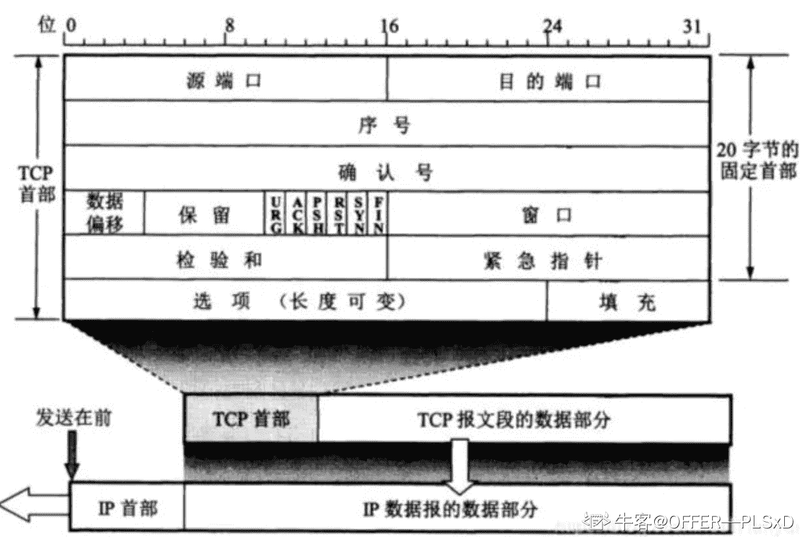
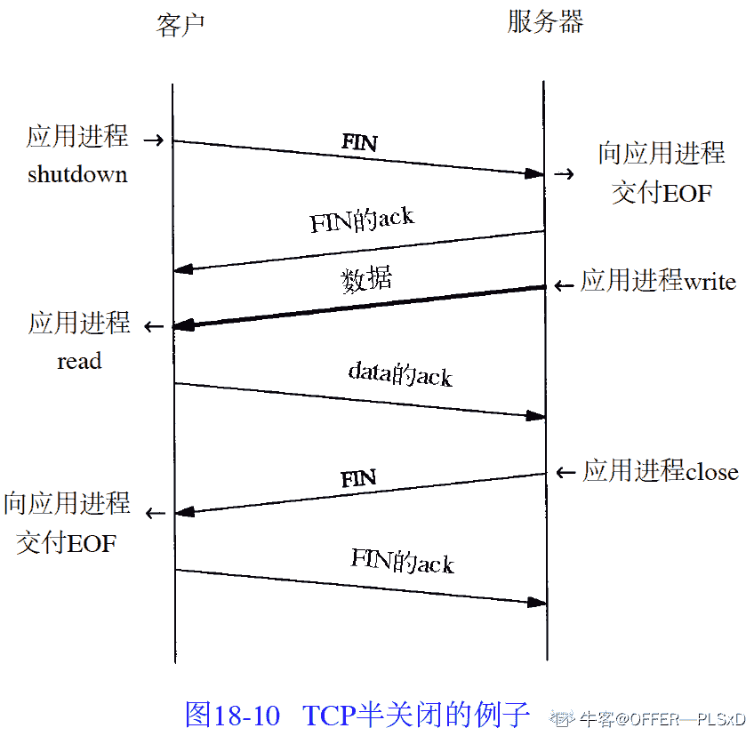
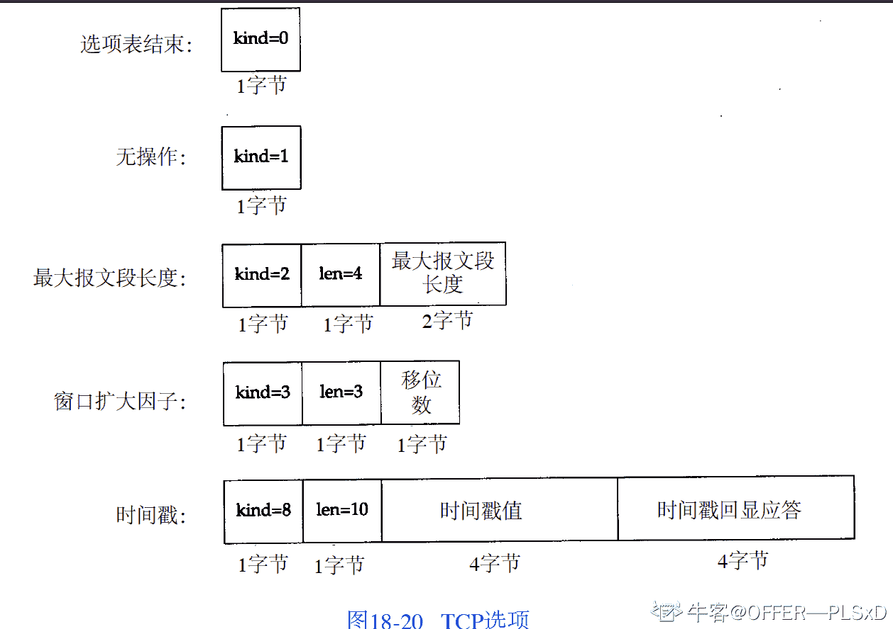
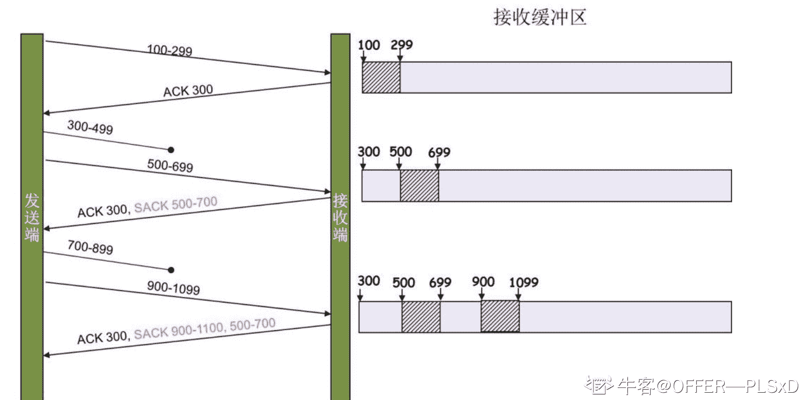
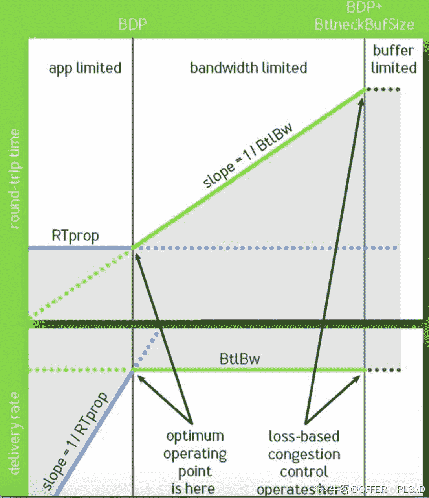
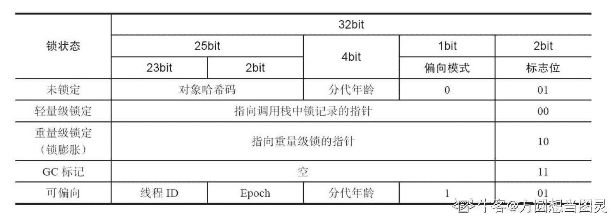
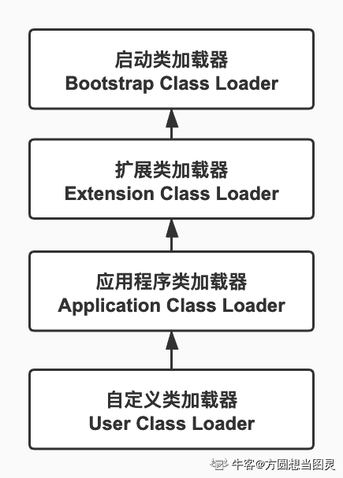
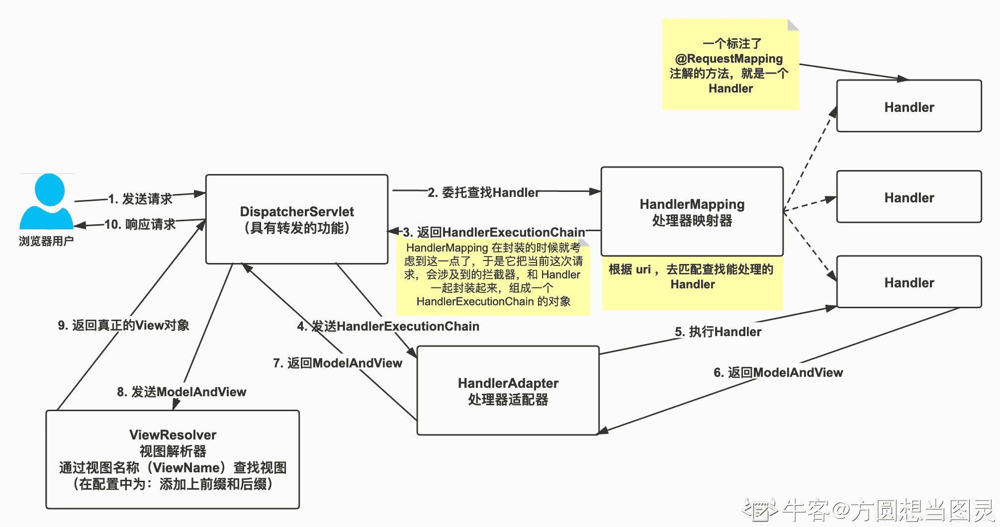
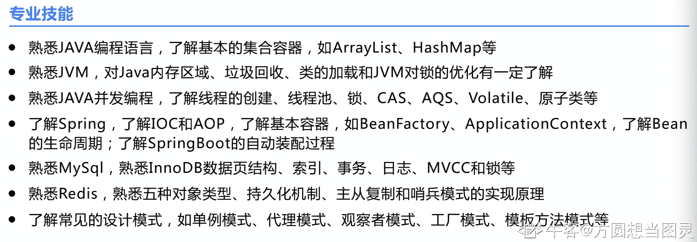

# 第三章 第 2 节 Java 方向优秀面经合集（下）

# 篇三：老铁意向+ 很多 tcp 的总结

**作者：****@Yasuo**

刚拿到了铁手意向书了，效率真快，一周全完事，hr 面后一天就给意向了。

秋招以来好多 TCP 的问题都不会，之后复盘详细看了相关资料，写了不少 tcp 的问题，比较基础的握手挥手就没记下来

## tcp 大礼包

### 连接到底是什么？

所谓的连接其实只是双方都维护了一个状态，通过每一次通信来维护状态的变更，使得看起来好像有一条线关联了对方。

### TCP 协议头

l  **序号**：用于对字节流进行编号，例如序号为 301，表示第一个字节的编号为 301，如果携带的数据长度为 100 字节，那么下一个报文段的序号应为 401。

l  **确认号**：期望收到的下一个报文段的序号。例如 B 正确收到 A 发送来的一个报文段，序号为 501，携带的数据长度为 200 字节，因此 B 期望下一个报文段的序号为 701，B 发送给 A 的确认报文段中确认号就为 701。

l  **数据偏移**：指的是数据部分距离报文段起始处的偏移量，实际上指的是首部的长度。

l  **控制位**：八位从左到右分别是 CWR，ECE，URG，ACK，PSH，RST，SYN，FIN。CWR：CWR 标志与后面的 ECE 标志都用于 IP 首部的 ECN 字段，ECE 标志为 1 时，则通知对方已将拥塞窗口缩小；

l  **ECE**：若其值为 1 则会通知对方，从对方到这边的网络有阻塞。在收到数据包的 IP 首部中 ECN 为 1 时将 TCP 首部中的 ECE 设为 1；

l  **URG**：该位设为 1，表示包中有需要紧急处理的数据，对于需要紧急处理的数据，与后面的紧急指针有关；

l  **ACK**：该位设为 1，确认应答的字段有效，TCP 规定除了最初建立连接时的 SYN 包之外该位必须设为 1；

l  **PSH**：该位设为 1，表示需要将收到的数据立刻传给上层应用协议，若设为 0，则先将数据进行缓存；

l  **RST**：该位设为 1，表示 TCP 连接出现异常必须强制断开连接；

l  **SYN**：用于建立连接，该位设为 1，表示希望建立连接，并在其序列号的字段进行序列号初值设定；

 **l  **FIN**：该位设为 1，表示今后不再有数据发送，希望断开连接。当通信结束希望断开连接时，通信双方的主机之间就可以相互交换 FIN 位置为 1 的 TCP 段。

l  每个主机又对对方的 FIN 包进行确认应答之后可以断开连接。不过，主机收到 FIN 设置为 1 的 TCP 段之后不必马上回复一个 FIN 包，而是可以等到缓冲区中的所有数据都因为已成功发送而被自动删除之后再发 FIN 包；

l  **窗口**：窗口值作为接收方让发送方设置其发送窗口的依据。之所以要有这个限制，是因为接收方的数据缓存空间是有限的。

### TCP/UDP 伪首部的理解

其目的是让 UDP 两次检查数据是否已经正确到达目的地，具体是那两次呢？我们注意伪首部字段：32 位源 IP 地址、32 位目的 IP 地址、8 位协议、16 位 UDP 长度。

由此可知，第一次，通过伪首部的 IP 地址检验，UDP 可以确认该数据报是不是发送给本机 IP 地址的；第二，通过伪首部的协议字段检验，UDP 可以确认 IP 有没有把不应该传给 UDP 而应该传给别的高层的数据报传给了 UDP。从这一点上，伪首部的作用其实很大。

### SYN 超时了怎么处理？

也就是 client 发送 SYN 至 server 然后就挂了，此时 server 发送 SYN+ACK 就一直得不到回复,**慢慢重试，阶梯性重试,** 在 Linux 中就是默认重试 5 次，并且就是阶梯性的重试，间隔就是 1s、2s、4s、8s、16s，再第五次发出之后还得等 32s 才能知道这次重试的结果，所以说总共等 63s 才能断开连接

### SYN Flood 攻击

可以开启 tcp_syncookies，那就用不到 SYN 队列了。

SYN 队列满了之后 TCP 根据自己的 ip、端口、然后对方的 ip、端口，对方 SYN 的序号，时间戳等一波操作生成一个特殊的序号（即 cookie）发回去，如果对方是正常的 client 会把这个序号发回来，然后 server 根据这个序号建连。

或者调整 tcp_synack_retries 减少重试的次数，设置 tcp_max_syn_backlog 增加 SYN 队列数，设置 tcp_abort_on_overflow SYN 队列满了直接拒绝连接。

### IP 、UDP 和 TCP，每一种格式的首部中均包含一个检验和。对每种分组，说明检验和包括 IP 数据报中的哪些部分，以及该检验和是强制的还是可选的

除了 UDP 的检验和，其他都是必需的。IP 检验和只覆盖了 IP 首部，而其他字段都紧接着 IP 首部开始。

### 为什么所有 Internet 协议收到有检验和错的分组都仅作丢弃处理？

源 IP 地址、源端口号或者协议字段可能被破坏了。

### 为什么会发生 TCP 粘包、拆包？

l  要发送的数据大于 TCP 发送缓冲区剩余空间大小，将会发生拆包。

l  待发送数据大于 MSS（最大报文长度），TCP 在传输前将进行拆包。

l  要发送的数据小于 TCP 发送缓冲区的大小，TCP 将多次写入缓冲区的数据一次发送出去，将会发生粘包。

l  接收数据端的应用层没有及时读取接收缓冲区中的数据，将发生粘包。

### 粘包、拆包解决办法

由于 TCP 本身是面向字节流的，无法理解上层的业务数据，所以在底层是无法保证数据包不被拆分和重组的，这个问题只能通过上层的应用协议栈设计来解决，根据业界的主流协议的解决方案，归纳如下：

l  **消息定长**：发送端将每个数据包封装为固定长度（不够的可以通过补 0 填充），这样接收端每次接收缓冲区中读取固定长度的数据就自然而然的把每个数据包拆分开来。

l  **设置消息边界**：服务端从网络流中按消息边界分离出消息内容。在包尾增加回车换行符进行分割，例如 FTP 协议。

l  **将消息分为消息头和消息体**：消息头中包含表示消息总长度（或者消息体长度）的字段。

l  更复杂的应用层协议比如 Netty 中实现的一些协议都对粘包、拆包做了很好的处理。

### TCP 提供了一种字节流服务，而收发双方都不保持记录的边界。应用程序如何提供它们自己的记录标识？

很多 Internet 应用使用一个回车和换行来标记每个应用记录的结束。这是 NVT ASCII 采用的编码。另外一种技术是在每个记录之前加上一个记录的字节计数，DNS 和 Sun RPC 采用了这种技术。

### 为什么在 TCP 首部的开始便是源和目的的端口号？

一个 ICMP 差错报文必须至少返回引起差错的 IP 数据报中除了 IP 首部的前 8 个字节。当 TCP 收到一个 ICMP 差错报文时，它需要检查两个端口号以决定差错对应于哪个连接。因此，端口号必须包含在 TCP 首部的前 8 个字节里。

### 为什么 TCP 首部有一个首部长度字段而 UDP 首部中却没有？

TCP 首部的最后有一些选项，但 UDP 首部中没有选项。

### SYN 初始值 ISN 规律

当一端为建立连接而发送它的 S Y N 时，它为连接选择一个初始序号。ISN 随时间而变化，因此每个连接都将具有不同的 I S N。RFC 793 指出 ISN 可看作是一个 32 比特的计数器，每 4 ms 加 1。

这样选择序号的目的在于防止在网络中被延迟的分组在以后又被传送，而导致某个连接的一方对它作错误的解释。所以 ISN 变成一个递增值，真实的实现还需要加一些随机值在里面，防止被不法份子猜到 ISN。

### 全双工的体现

既然一个 T C P 连接是全双工（即数据在两个方向上能同时传递），因此每个方向必须单独地进行关闭。这原则就是当一方完成它的数据发送任务后就能发送一个 FIN 来终止这个方向连接。当一端收到一个 FIN，它必须通知应用层另一端几经终止了那个方向的数据传送。

发送 FIN 通常是应用层进行关闭的结果。收到一个 FIN 只意味着在这一方向上没有数据流动。一个 TCP 连接在收到一个 FIN 后仍能发送数据。而这对利用半关闭的应用来说是可能的，尽管在实际应用中只有很少的 T C P 应用程序这样做。

### MSS 确定(商议)的？

它并不是任何条件下都可协商。当建立一个连接时，每一方都有用于通告它期望接收的 MSS 选项（MSS 选项只能出现在 SYN 报文段中）。如果一方不接收来自另一方的 MSS 值，则 MSS 就定为默认值 536 字节（这个默认值允许 20 字节的 I P 首部和 20 字节的 TCP 首部以适合 576 字节 I P 数据报)。

### TCP 最大段大小

最大段大小是指 TCP 协议所允许的从对方接收到的最大报文段，因此这也是通信对方在发送数据时能够使用的最大报文段。根据 [RFCO879]，最大段大小只记录 TCP 数据的字节数而不包括其他相关的 TCP 与 IP 头部。

当建立一条 TCP 连接时，通信的每一方都要在 SYN 报文段的 MSS 选项中说明自已允许的最大段大小。这 16 位的选项能够说明最大段大小的数值。在没有事先指明的情况下，最大段大小的默认数值为 536 字节。

任何主机都应该能够处理至少 576 字节的 IPv4 数据报。如果接照最小的 IPv4 与 TCP 头部计算， TCP 协议要求在每次发送时的最大段大小为 536 字节，这样就正好能够组成一个 576 (20+20+536=576)字节的 IPv4 数据报。**最大段大小的数值为 1460。 这是 IPv4 协议中的典型值**，因此 IPv4 数据报的大小也相应增加 40 个字节(总共 1500 字节，以太网中最大传输单元与互联网路径最大传输单元的典型数值): 20 字节的 TCP 头部加 20 字节的 IP 头部。

当使用 IPv6 协议时，最大段大小通常为 1440 字节。由于 IPv6 的头部比 IPv4 多 20 个字节，因此最大段大小的数值相 应减少 20 字节。在 [RFC2675] 中 65535 是一个特殊数值，与 IPv6 超长数据报一起用来指定一个表示无限大的有效最大段大小值。在这种情况下，发送方的最大段大小等于路径 MTU 的数值减去 60 字节(40 字节用于 IPv6 头部， 20 字节用于 TCP 头部)。值得注意的是，最大段大小并不是 TCP 通信双方的协商结果，而是一个限定的数值。当通信的一方将自已的最大段大小选项发送给对方时，它已表明自已不愿意在整个连接过程中接收任何大于该尺寸的报文段。

### time_wait 的坏处

当 TCP 执行一个主动关闭，并发回最后一个 ACK，该连接必须在 Time_wait 状态停留的时间为 2 倍的 M S L。这样可让 TCP 再次发送最后的 A C K 以防这个 ACK 丢失（另一端超时并重发最后的 F I N）。

这种 2 MSL 等待的另一个结果是这个 TCP 连接在 2 MSL 等待期间，定义这个连接的插口（客户的 I P 地址和端口号，服务器的 I P 地址和端口号）不能再被使用。这个连接只能在 2 MSL 结束后才能再被使用。服务器通常执行被动关闭，不会进入 TIME_WAIT 状态。这暗示如果我们终止一个客户程序，并立即重新启动这个客户程序，则这个新客户程序将不能重用相同的本地端口。

这不会带来什么问题，因为客户使用本地端口，而并不关心这个端口号是什么。然而，对于服务器，情况就有所不同，因为服务器使用熟知端口。如果我们终止一个已经建立连接的服务器程序，并试图立即重新启动这个服务器程序，服务器程序将不能把它的这个熟知端口赋值给它的端点，因为那个端口是处于 2 MSL 连接的一部分。在重新启动服务器程序前，它需要在 1 ~ 4 分钟。

### RST 复位什么时候发出

一般说来，**无论何时一个报文段发往基准的连接（ referenced connection）出现错误， TCP 都会发出一个复位报文段（这里提到的“基准的连接”是指由目的 IP 地址和目的端口号以及源 IP 地址和源端口号指明的连接。这就是为什么 RFC 793 称之为插口）。**

产生复位的一种常见情况是当连接请求到达时，目的端口没有进程正在听。

发送一个复位报文段而不是 F I N 来中途释放一个连接。有时称这为异常释放（abortive release）。异常终止一个连接对应用程序来说有两个优点：

（1）丢弃任何待发数据并立即发送复位报文段；

（2）R S T 的接收方会区分另一端执行的是异常关闭还是正常关闭。应用程序使用的 A P I 必须提供产生异常关闭而不是正常关闭的手段，R S T 报文段中包含一个序号和确认序号。需要注意的是 R S T 报文段不会导致另一端产生任何响应，另一端根本不进行确认。收到 R S T 的一方将终止该连接，并通知应用层连接复位。

### TCP 选项有什么

1.   窗口扩大选项使 TCP 的窗口定义从 16 bit 增加为 32 bit。这并不是通过修改 TCP 首部来实现的， T C P 首部仍然使用 16 bit ，而是通过定义一个选项实现对 16 bit 的扩大操作 来完成的。于是 T C P 在内部将实际的窗口大小维持为 32 bit 的值。

2.   时间戳选项使发送方在每个报文段中放置一个时间戳值。接收方在确认中返回这个数值，从而允许发送方为每一个收到的 A C K 计算 RT T（我们必须说“每一个收到的 A C K”而不是“每一个报文段”，是因为 T C P 通常用一个 A C K 来确认多个报文段）。我们提到过目前许多实现为每一个窗口只计算一个 RT T，对于包含 8 个报文段的窗口而言这是正确的。然而，较大的窗口大小则需要进行更好的 RT T 计算。

3.   最大报文传输段（Maximum Segment Size ---MSS）

4.   选择确认选项（Selective Acknowledgements --SACK）

### 半打开连接和半关闭连接的区别是什么？

在一个**半关闭**的连接上，一个端点已经发送了一个 FIN，正等待另一端的数据或者一个 FIN。

一个**半打开**的连接是当一个端点崩溃了，而另一端还不知道的情况。

**未连接队列**：在三次握手协议中，服务器维护一个未连接队列，该队列为每个客户端的 SYN 包（syn=j）开设一个条目，该条目表明服务器已收到 SYN 包，并向客户发出确认，正在等待客户的确认包。这些条目所标识的连接在服务器处于 Syn_RCVD 状态，当服务器收到客户的确认包时，删除该条目， 服务器进入 ESTABLISHED 状态。

### ACK 延迟确认机制

接收方在收到数据后，并不会立即回复 ACK，而是延迟一定时间。一般 ACK 延迟发送时间为 200ms，但是这个 200ms 并非收到数据后需要延迟的时间。系统有一个固定的定时器每隔 200ms 会来检查是否需要发送 ACK 包。这样做有 2 个目的：

1.  这样做的目的是 ACK 是可以合并的，也就是指如果连续收到两个 TCP 包，并不一定需要 ACK 两次，只要回复最终的 ACK 就可以了，可以降低网络流量。
2.  如果接收方有数据要发送，那么就会在发送数据的 TCP 数据包里，带上 ACK 信息。这样做，可以避免大量的 ACK 以一个单独的 TCP 包发送，减少了网络流量。

### SACK(Selective Acknowledgment)

SACK 是一个 TCP 的选项，来允许 TCP 单独确认非连续的片段，用于告知真正丢失的包，只重传丢失的片段。要使用 SACK，2 个设备必须同时支持 SACK 才可以，建立连接的时候需要使用 SACK Permitted 的 option，如果允许，后续的传输过程中 TCP segment 中的可以携带 SACK option，这个 option 内容包含**一系列的非连续的没有确认的数据的 seq range**。

TCP 收到乱序数据后会将其放到乱序序列中，然后发送重复 ACK 给对端。对端如果收到多个重复的 ACK，认为发生丢包，TCP 会重传最后确认的包开始的后续包。这样原先已经正确传输的包，可能会重复发送，降低了 TCP 性能。为改善这种情况，发展出 SACK 技术，使用 SACK 选项可以告知发包方收到了哪些数据，发包方收到这些信息后就会知道哪些数据丢失，然后立即重传丢失的部分。

### SACK 重传

1.   未启用 SACK 时，TCP 重复 ACK 定义为收到连续相同的 ACK seq。[RFC5681]

2.   启用 SACK 时，携带 SACK 的 ACK 也被认为重复 ACK。[RFC6675]

SACK option 格式 Kind 5 Length 剩下的都是没有确认的 segment 的 range 了 比如说 segment 501-600 没有被确认，那么 Left Edge of 1st Block = 501，Right Edge of 1st Block = 600，**TCP 的选项不能超过 40 个字节，所以边界不能超过 4 组。**

### Nagle 算法

在局域网上，小分组（被称为微小分组）通常不会引起麻烦，因为局域网一般不会出现拥塞。但在广域网上，这些小分组则会增加拥塞出现的可能。

该算法要求一个 TCP 连接上最多只能有一个未被确认的未完成的小分组，在该分组的确认到达之前不能发送其他的小分组。相反， TCP 收集这些少量的分组，并在确认到来时以一个分组的方式发出去。该算法的优越之处在于它是自适应的：确认到达得越快，数据也就发送得越快。而在希望减少微小分组数目的低速广域网上，则会发送更少的分组。插口 API 用户可以使用 **TCP_NODELAY** 选项来关闭 Nagle 算法。

### Karn 算法

当一个超时和重传发生时，在重传数据的确认最后到达之前，不能更新 RT T 估计器，因为我们并不知道 A C K 对应哪次传输（也许第一次传输被延迟而并没有被丢弃，也有可能第一次传输的 A C K 被延迟）并且，由于数据被重传， RTO 已经得到了一个指数退避，我们在下一次传输时使用这个退避后的 RTO。对一个没有被重传的报文段而言，除非收到了一个确认，否则不要计算新的 RTO。Karn 算法在分组丢失时可以不测量 RTT 就能解决重传的二义性问题。

### 快重传：3 次相同的 ack 后会进入慢启动吗？

No，在这种情况下没有执行慢启动的原因是由于收到重复的 ACK 不仅仅告诉我们一个分组丢失了。由于接收方只有在收到另一个报文段时才会产生重复的 ACK，而该报文段已经离开了网络并进入了接收方的缓存。也就是说，在收发两端之间仍然有流动的数据，而我们不想执行慢启动来突然减少数据流。流程:

1) 当收到第 3 个重复的 ACK 时，将 ssthresh 设置为当前拥塞窗口 cwnd 的一半。重传丢失的报文段。设置 cwnd 为 ssthresh 加上 3 倍的报文段大小。

2) 每次收到另一个重复的 ACK 时， cwnd 增加 1 个报文段大小并发送 1 个分组（如果新的 cwnd 允许发送）。

3) 当下一个确认新数据的 ACK 到达时，设置 cwnd 为 ssthresh（在第 1 步中设置的值）。这个 ACK 应该是在进行重传后的一个往返时间内对步骤 1 中重传的确认。另外，这个 ACK 也应该是对丢失的分组和收到的第 1 个重复的 A C K 之间的所有中间报文段的确认。这一步采用的是拥塞避免，因为当分组丢失时我们将当前的速率减半。

### 保活计时器的作用？

TCP 的 Keepalive，目的在于看看对方有没有发生异常，如果有异常就及时关闭连接。当传输双方不主动关闭连接时，就算双方没有交换任何数据，连接也是一直有效的。保活定时器每隔一段时间会超时，超时后会检查连接是否空闲太久了，如果空闲的时间超过了设置时间，就会发送探测报文。然后通过对端是否响应、响应是否符合预期，来判断对端是否正常，如果不正常，就主动关闭连接，而不用等待 HTTP 层的关闭了。

### SYN Cookies

在最常见的 SYN Flood 攻击中，攻击者在短时间内发送大量的 TCP SYN 包给受害者。受害者(服务器)为每个 TCP SYN 包分配一个特定的数据区，只要这些 SYN 包具有不同的源地址(攻击者很容易伪造)。这将给 TCP 服务器造成很大的系统负担，最终导致系统不能正常工作。SYN Cookie 是对 TCP 服务器端的三次握手做一些修改，专门用来防范 SYN Flood 攻击的一种手段。它的原理是，在 TCP 服务器接收到 TCP SYN 包并返回 TCP SYN + ACK 包时，**不分配一个专门的数据区，而是根据这个 SYN 包计算出一个 cookie 值**。这个 cookie 作为将要返回的 SYN ACK 包的初始序列号。当客户端返回一个 ACK 包时，根据包头信息计算 cookie，与返回的确认序列号(初始序列号 + 1)进行对比，如果相同，则是一个正常连接，然后，分配资源，建立连接。cookie 的计算：服务器收到一个 SYN 包，计算一个消息摘要 mac。

### CLOSE_WAIT 过多的解决方法

系统产生大量“Too many open files”原因分析：在服务器与客户端通信过程中，因服务器发生了 socket 未关导致的 closed_wait 发生，致使监听 port 打开的句柄数到了 1024 个，且均处于 close_wait 的状态，最终造成配置的 port 被占满出现 “Too many open files”，无法再进行通信。解决办法：有两种措施可行

**一、解决：**
原因是因为调用 ServerSocket 类的 accept() 方法和 Socket 输入流的 read() 方法时会引起线程阻塞，所以应该用 setSoTimeout() 方法设置超时（缺省的设置是 0，即超时永远不会发生）；超时的判断是累计式的，一次设置后，每次调用引起的阻塞时间都从该值中扣除，直至另一次超时设置或有超时异常抛出。比如，某种服务需要三次调用 read()，超时设置为 1 分钟，那么如果某次服务三次 read()调用的总时间超过 1 分钟就会有异常抛出，如果要在同一个 Socket 上反复进行这种服务，就要在每次服务之前设置一次超时。

**二、规避：**
调整系统参数，包括句柄相关参数和 TCP/IP 的参数；

1.   open files 参数值 加大

2.   当客户端因为某种原因先于服务端发出了 FIN 信号，就会导致服务端被动关闭，若服务端不主动关闭 socket 发 FIN 给 Client，此时服务端 Socket 会处于 CLOSE_WAIT 状态（而不是 LAST_ACK 状态）。通常来说，一个 CLOSE_WAIT 会维持至少 2 个小时的时间（系统默认超时时间的是 7200 秒，也就是 2 小时）。如果服务端程序因某个原因导致系统造成一堆 CLOSE_WAIT 消耗资源，那么通常是等不到释放那一刻，系统就已崩溃。因此，解决这个问题的方法还可以通过修改 TCP/IP 的参数来缩短这个时间，于是修改 tcp_keepalive_*系列参数： /proc/sys/net/ipv4/tcp_keepalive_time ， /proc/sys/net/ipv4/tcp_keepalive_probes ，/proc/sys/net/ipv4/tcp_keepalive_intvl

### 短连接，并行连接，持久连接与长连接

#### 短连接

短连接多用于操作频繁，点对点的通讯，而且连接数不能太多的情况。每个 TCP 连接的建立都需要三次握手，每个 TCP 连接的断开要四次挥手。适用于并发量大，但是每个用户又不需频繁操作的情况。但是在用户需要频繁操作的业务场景下(如新用户注册，网购提交订单等)，频繁的使用短连接则会使性能时延产生叠加。用户登录这些不频繁的操作可以考虑用短连接。

#### 并行连接

针对短连接，人们想出了优化的办法，连接多条，形成并行连接。并行连接允许客户端打开多条连接，并行地执行多个事务，每个事务都有自己的 TCP 连接。这样可以克服单条连接的空载时间和带宽限制，时延可以重叠起来，而且如果单条连接没有充分利用客户端的网络带宽，可以将未用带宽分配来装载其他对象。在 PC 时代，利用并行连接来充分利用现代浏览器的多线程并发下载能力的场景非常广泛。但是并行连接也会产生一定的问题，首先并行连接不一定更快，因为带宽资源有限，每个连接都会去竞争这有限的带宽，这样带来的性能提升就很小，甚至没什么提升。

**一般机器上面并行连接的条数 4 - 6 条**。

#### 持久连接

HTTP1.0 版本以后，允许 HTTP 设备在事务处理结束之后将 TCP 连接保持在打开状态，以便为未来的 HTTP 请求重用现存的连接。在事务处理结束之后仍然保持在打开状态的 TCP 连接被称为持久连接。持久连接的时间参数，通常由服务器设定，比如 nginx 的 keepalivetimeout，keepalive timout 时间值意味着：一个 http 产生的 tcp 连接在传送完最后一个响应后，还需要 hold 住 keepalive_timeout 秒后，才开始关闭这个连接；**在 HTTP 1.1 中 所有的连接默认都是持续连接**，除非特殊声明不支持。HTTP 持久连接不使用独立的 keepalive 信息，而是仅仅允许多个请求使用单个连接。然而，Apache 2.0 httpd 的默认连接过期时间是仅仅 15 秒，对于 Apache 2.2 只有 5 秒。短的过期时间的优点是能够快速的传输多个 web 页组件，而不会绑定多个服务器进程或线程太长时间。持久连接与并行连接相比，带来的优势如下：

1.  避免了每个事务都会打开/关闭一条新的连接，造成时间和带宽的耗费；
2.  避免了 TCP 慢启动特性的存在导致的每条新连接的性能降低；
3.  可打开的并行连接数量实际上是有限的，持久连接则可以减少建立的连接的数量；

#### 长连接

长连接与持久连接本质上非常的相似，持久连接侧重于 HTTP 应用层，特指一次请求结束之后，服务器会在自己设置的 keepalivetimeout 时间到期后才关闭已经建立的连接。长连接则是 **client** 方与 server 方先建立连接，连接建立后不断开，然后再进行报文发送和接收，直到有一方主动关闭连接为止。长连接的适用场景也非常的广泛：

1.  监控系统：后台硬件热插拔、LED、温度、电压发生变化等；
2.  IM 应用：收发消息的操作；
3.  即时报价系统：例如股市行情 push 等；
4.  推送服务：各种 App 内置的 push 提醒服务；

### TIME_WAIT 快速回收与重用

[`blog.csdn.net/dog250/article/details/13760985`](https://blog.csdn.net/dog250/article/details/13760985)

Linux 实现了一个 TIME_WAIT 状态**快速回收**的机制，即无需等待两倍的 MSL 这么久的时间，而是等待一个 Retrans 时间即释放，也就是等待一个重传时间(一般超级短，以至于你都来不及能在**netstat** -ant 中看到 TIME_WAIT 状态)随即释放。释放了之后，一个连接的 tuple 元素信息就都没有了。在快速释放掉 TIME_WAIT 连接之后，peer 依然保留着。丢失的仅仅是端口信息。不过有了 peer 的 IP 地址信息以及 TCP 最后一次触摸它的时间戳就足够了，TCP 规范给出一个优化，即一个新的连接除了同时触犯了以下几点，其它的均可以快速接入，即使它本应该处在 TIME_WAIT 状态(但是被即快速回收了)：
**1.****来自同一台机器的 TCP 连接携带时间戳；
2.之前同一台 peer 机器(仅仅识别 IP 地址，因为连接被快速释放了，没了端口信息)的某个 TCP 数据在 MSL 秒之内到过本机；** 

**3.新连接的时间戳小于 peer 机器上次 TCP 到来时的时间戳，且差值大于重放窗口戳。****建议：**如果前端**部署**了三/四层 NAT 设备，尽量关闭快速回收，以免发生 NAT 背后真实机器由于时间戳混乱导致的 SYN 拒绝问题。TW**重用** 有相关的规范，即：如果能保证以下任意一点，一个 TW 状态的四元组(即一个 socket 连接)可以重新被**新到**来的 SYN 连接使用：

**1.****初始序列号比 TW 老连接的末序列号大**
**2.****如果使能了时间戳，那么新到来的连接的时间戳比老连接的时间戳大**

### BBR 算法

BBR 全称 bottleneck bandwidth and round-trip propagation time。基于包丢失检测的 Reno、NewReno 或者 cubic 为代表，其主要问题有 Buffer bloat 和长肥管道两种。和这些算法不同，bbr 算法会时间窗口内的最大带宽 max_bw 和最小 RTT min_rtt，并以此计算发送速率和拥塞窗口。当没有足够的数据来填满管道时，**RTprop** 决定了流的行为；当有足够的数据填满时，那就变成了 BtlBw 来决定。这两条约束交汇在点 **inflight =BtlBw*RTprop****，也就是管道的 BDP（带宽与时延的乘积）**。当管道被填满时，那些超过的部分（inflight-BDP）就会在瓶颈链路中制造了一个队列，从而导致了 RTT 的增大。当数据继续增加直到填满了缓存时，多余的报文就会被丢弃了。拥塞就是发生在 BDP 点的右边，而拥塞控制算法就是来控制流的平均工作点离 BDP 点有多远。

### TCP 参数

*   **Backlog**参数：表示未连接队列的最大容纳数目。
*   **SYN-ACK ****重传次数**：　服务器发送完 SYN－ACK 包，如果未收到客户确认包，服务器进行首次重传，等待一段时间仍未收到客户确认包，进行第二次重传，如果重传次数超 过系统规定的最大重传次数，系统将该连接信息从半连接队列中删除。注意，每次重传等待的时间不一定相同。
*   **半连接存活时间**：是指半连接队列的条目存活的最长时间，也即服务从收到 SYN 包到确认这个报文无效的最长时间，该时间值是所有重传请求包的最长等待时间总和。有时我们也称半连接存活时间为 Timeout 时间、SYN_RECV 存活时间。
*   **开启 SYN Cookies** ： net.ipv4.tcp_syncookies = 1
*   **开启 timewait 重用**。允许将 TIME-WAIT sockets 重新用于新的 TCP 连接，默认为 0 ：net.ipv4.tcp_tw_reuse = 1
*   **开启 TCP 连接中 TIME-WAIT sockets 的快速回收**，默认为 0，表示关闭；net.ipv4.tcp_tw_recycle = 1
*   tw 时间 ： net.ipv4.tcp_fin_timeout 修改系統默认的 TIMEOUT 时间
*   当 keepalive 起用的时候，**TCP 发送 keepalive 消息的频度**。缺省是 2 小时，改为 20 分钟(20*60s)
    net.ipv4.tcp_keepalive_time = 1200

### **tcp ****异常**

**试图与一个不存在的端口建立连接**

这符合触发发送 RST 分节的条件，目的为某端口的 SYN 分节到达，而端口没有监听，那么内核会立即响应一个 RST，表示出错。客户端 TCP 收到这个 RST 之后则放弃这次连接的建立，并且返回给应用程序一个错误。正如上面所说的，建立连接的过程对应用程序来说是不可见的，这是操作系统帮我们来完成的，所以即使进程没有启动，也可以响应客户端。

**试图与一个不存在的主机上面的某端口建立连接**

这也是一种比较常见的情况，当某台服务器主机宕机了，而客户端并不知道，仍然尝试去与其建立连接。根据上面的经验，这次主机已经处于未启动状态，操作系统也帮不上忙了，那么也就是连 RST 也不能响应给客户端，此时服务器端是一种完全没有响应的状态。那么此时客户端的 TCP 会怎么办呢？据书上介绍，如果客户端 TCP 没有得到任何响应，那么等待 6s 之后再发一个 SYN，若无响应则等待 24s 再发一个，若总共等待了 75s 后仍未收到响应就会返回 ETIMEDOUT 错误。这是 TCP 建立连接自己的一个保护机制，但是我们要等待 75s 才能知道这个连接无法建立，对于我们所有服务来说都太长了。更好的做法是在代码中给 connect 设置一个超时时间，使它变成我们可控的，让等待时间在毫秒级还是可以接收的。

**Server****进程被阻塞**

由于某些情况，服务器端进程无法响应任何请求，比如所在主机的硬盘满了，导致进程处于完全阻塞，通常我们**测试**时会用 gdb 模拟这种情况。上面提到过，建立连接的过程对应用程序是不可见的，那么，这时连接可以正常建立。当然，客户端进程也可以通过这个连接给服务器端发送请求，服务器端 TCP 会应答 ACK 表示已经收到这个分节（这里的收到指的是数据已经在内核的缓冲区里准备好，由于进程被阻塞，无法将数据从内核的缓冲区复制到应用程序的缓冲区），但永远不会返回结果。

**我们杀死 server**

这是线上最常见的操作，当一个模块上线时，OP 同学总是会先把旧的进程杀死，然后再启动新的进程。那么在这个过程中 TCP 连接发生了什么呢。在进程正常退出时会自动调用 close 函数来关闭它所**打开的文件**描述符，这相当于服务器端来主动关闭连接——会发送一个 FIN 分节给客户端 TCP；客户端要做的就是配合对端关闭连接，TCP 会自动响应一个 ACK，然后再由客户端应用程序调用 close 函数，也就是我们上面所描述的关闭连接的 4 次挥手过程。接下来，客户端还需要定时去重连，以便当服务器端进程重新启动好时客户端能够继续与之通信。当然，我们要保证客户端随时都可以响应服务器端的断开连接请求，就必须不能让客户端进程再任何时刻阻塞在任何其他的输入上面。**比如**，书上给的例子是客户端进程会阻塞在标准输入上面，这时如果服务器端主动断开连接，显然客户端不能立刻响应，因为它还在识图从标准输入读一段文本……当然这在实际中很少遇到，如果有多输入源这种情况的话开通通常会用类似 select 功能的函数来处理，可以同时监控多个输入源是否准备就绪，可以避免上述所说的不能立即响应对端关闭连接的情况。

**Server****进程所在的主机关机**

实际上这种情况不会带来什么更坏的后果。在系统关闭时，init 进程会给所有进程发送 SIGTERM 信号，等待一段时间（5~20 秒），然后再给所有仍在运行的进程发送 SIGKILL 信号。当服务器进程死掉时，会关闭所有文件描述符。带来的影响和上面杀死 server 相同。

**Server****进程所在的主机宕机**

这是我们线上另一种比较常见的状况。即使宕机是一个小概率事件，线上几千台服务器动不动一两台挂掉也是常有的事。主机崩溃不会像关机那样会预先杀死上面的进程，而是突然性的。那么此时我们的客户端准备给服务器端发送一个请求，它由 write 写入内核，由 TCP 作为一个分节发出，随后客户阻塞于 read 的调用（等待接收结果）。对端 TCP 显然不会响应这个分节，因为主机已经挂掉，于是客户端 TCP 持续重传分节，试图从服务器上接收一个 ACK，然而服务器始终不能应答，重传数次之后，大约 4~10 分钟才停止，之后返回一个 ETIMEDOUT 错误。这样尽管最后还是知道对方不可达，但是很多时候我们希望比等待 4~10 分钟更快的知道这个结果。可以为 read 设置一个超时时间，就得到了一个较好的解决方法。但是这样还是需要等待一个超时时间，事实上 TCP 为我们提供了更好的方法，用 SO_KEEPALIVE 的套接字选项——相当于心跳包，每隔一段时间给对方发送一个心跳包，当对方没有响应时会一更短的时间间隔发送，一段时间后仍然无响应的话就断开这个连接。

**服务器进程所在的主机宕机后重启**

在客户端发出请求前，服务器端主机经历了宕机——重启的过程。当客户端 TCP 把分节发送到服务器端所在的主机，服务器端所在主机的 TCP 丢失了崩溃前所有连接信息，即 TCP 收到了一个根本不存在连接上的分节，所以会响应一个 RST 分节。如果开发的代码足够健壮的话会试图重新建立连接，或者把这个请求转发给其他服务器。当 TCP 连接的进程在忘记关闭**Socket**而退出、程序崩溃、或非正常方式结束进程的情况下（Windows 客户端），会导致 TCP 连接的对端进程产生“104: Connection reset by peer”（Linux 下）或“10054: An existing connection was forcibly closed by the remote host”（Windows 下）错误当 TCP 连接的进程机器发生死机、系统突然重启、网线松动或网络不通等情况下，连接的对端进程可能检测不到任何异常，并最后等待“超时”才断开 TCP 连接当 TCP 连接的进程正常关闭 Socket 时，对端进程在检查到 TCP 关闭事件之前仍然向 TCP 发送消息，则在 Send 消息时会产生“32: Broken pipe”（Linux 下）或“10053: An established connection was aborted by the software in your host machine”（Windows 下）错误当 TCP 连接的对端进程已经关闭了 Socket 的情况下，本端进程再发送数据时，第一包可以发送成功（但会导致对端发送一个 RST 包过来）：之后如果再继续发送数据会失败，错误码为“10053: An established connection was aborted by the software in your host machine”（Windows 下）或“32: Broken pipe，同时收到 SIGPIPE 信号”（Linux 下）错误；之后如果接收数据，则 Windows 下会报 10053 的错误，而 Linux 下则收到正常关闭消息

TCP 连接的本端接收缓冲区中还有未接收数据的情况下 close 了 Socket，则本端 TCP 会向对端发送 RST 包，而不是正常的 FIN 包，这就会导致对端进程提前（RST 包比正常数据包先被收到）收到“10054: An existing connection was forcibly closed by the remote host”（Windows 下）或“104: Connection reset by peer”（Linux 下）错误

**PSH****和 URG**

PSH 标志的作用就在这里，当 PSH 被置为 1 时， 会被立即推出，不会等待其他数据进入缓冲区。当接受端收到 PSH 被置 1 的数据包时，立即将该分段上交到对应的应用程序。即有如下作用：

*   通知发送方立即发送数据。
*   接收方立即将数据推送到应用程序。

这个标志是在 TCP 层清空发送缓存，并将报文段交给 IP 层的时候设置的（相当于表示一次 TCP 层的发送操作）。（还有一点需要注意：大多数的 API 没有向应用层提供通知 TCP 层设置 PUSH 标志的方法，据说是因为很多实现程序认为 PUSH 标志已经过时，而一个好的 TCP 实现能够自行决定何时设置这个标志。URG 标志用于通知接收方，数据段内某些数据是需要紧急处理的，应该被优先考虑。接收方收到 URH 标志有效的数据报时，回去检测 TCP 报头中的 16 位字段 紧急指针。 该字段指示从第一个字节计数的段中的数据时多少紧急处理的。

**端口号**

标准的端口号由 Internet 号码分配机构(IANA)分配。这组数字被划分为特定范围，包括

熟知端口号(0 - 1023)、注册端口号(1024 - 49151)和动态/私有端口号(49152 - 65535)。如果我们测试这些标准服务和其他 TCP/IP 服务(Telnet、 FTP、 SMTP 等) 使用的端口号，会发现它们大多数是奇数。这是有历史原困的，这些端口号从 NCP 端口号派生而来(NCP 是网络控制协议，在 TCP 之前作为 ARPANET 的传输层协议)。NCP 虽然简单，但不是全双工的，困此每个应用需要两个连接，并为每个应用保留奇偶成对的端口号。当 TCP 和 UDP 成为标准的传输层协议时，每个应用只需要一个端口号，因此来自 NCP 的奇数端口号被使用。

**QQ****，微信**

早期的时候，QQ 还是主要使用 TCP 协议，而后来就转向了采用 UDP 的方式来保持在线，TCP 的方式来上传和下载数据。现在，UDP 是 QQ 的默认工作方式，表现良好。相信这个也被沿用到了微信上。简单的考证：登录 PC 版 QQ，关闭多余的 QQ 窗口只留下主窗口，并将其最小化。几分钟过后，查看系统**网络**连接，会发现 QQ 进程已不保有任何 TCP 连接，但有 UDP 网络活动。这时在发送聊天信息，或者打开其他窗口和功能，将发现 QQ 进程会启用 TCP 连接。登陆成功之后，QQ 有一个 TCP 连接来保持在线状态。这个 TCP 连接的远程端口一般是 80，采用 UDP 方式登陆的时候，端口是 8000。QQ 客户端之间的消息传送**采用**了 UDP，因为国内的网络环境非常复杂，而且很多用户采用的方式是通过代理服务器共享一条线路上网的方式，在这些复杂的情况下，客户端之间能彼此建立起来 TCP 连接的概率较小，严重影响传送信息的效率。而 UDP 包能够穿透大部分的代理服务器，因此 QQ 选择了 UDP 作为客户之间的主要通信协议。腾讯采用了上层协议来保证可靠传输：如果客户端使用 UDP 协议发出消息后，服务器收到该包，需要使用 UDP 协议发回一个应答包。如此来保证消息可以无遗漏传输。之所以会发生在客户端明明看到**“消息发送失败”**但对方又收到了这个消息的情况，就是因为客户端发出的消息服务器已经收到并转发成功，但客户端由于网络原因没有收到服务器的应答包引起的。

**参考 ：**

*   [`blog.csdn.net/zhangskd/article/details/44177475`](https://blog.csdn.net/zhangskd/article/details/44177475)
*   [`juejin.im/post/6869734247465402382#heading-0`](https://juejin.im/post/6869734247465402382#heading-0)
*   [`www.jianshu.com/p/d759788ab83f`](https://www.jianshu.com/p/d759788ab83f)
*   [`halfrost.com/advance_tcp/`](https://halfrost.com/advance_tcp/)
*   [`juejin.im/post/6844903881781018632`](https://juejin.im/post/6844903881781018632)

# 篇四：求浆得酒，能有好运，也该为大家做些什么

**牛油：@方圆想当图灵**

## 一、写在前头

有一肚子的话想说出来，到现在又不知该如何表达了，如果屏幕能传递感情，就好了

我也经历了秋招和春招，把积累的一些心得和知识分享出来，趁着春招还没结束，应该还能给大家一些帮助，在牛客上潜水索取了这么久，也是时候回馈了，这篇帖子开始写于河工大图书馆，也用来纪念为期不多的大学时光

特此感谢[@大明宫巴菲特](https://www.nowcoder.com/profile/592649258) （之前不是瑶瑶公主吗？哈哈哈），大佬整理的面经我看的七七八八，给我了不少帮助，非常感谢了，大家可以关注一下！！！

下面的一些经验不一定全对也不一定全部有用，也仅仅是把我知道的一些技巧性的东西分享出来罢了，如果能对大家产生一点点帮助，都是我无比荣幸的事情

## 二、春招历程（截至 2021 年 3 月 31 日）

1.  字节跳动 大力教育后端开发 北京：2 月 17 日牛客内推投递
2 月 23 日一面 被面试官发现非科班，基本上问的全是计算机网络和操作系统相关 **挂**

2.  京东物流 Java 开发工程师 北京：2 月 17 日官网内推码投递
3 月 3 日 一面 一个多小时，口干舌燥也畅快琳琳 **过**
3 月 4 日 二面 四十多分钟，问的比较发散，不局限于八股文，更关注具体场景业务分析 **过**
3 月 10 日 HR 面 大概只有六七分钟
3 月 12 日 查询状态变为 HR 面完成，Offer 灯亮起
3 月 15 日 收到正式 Offer

3.  美团 支付部门后端开发 北京：3 月 4 日牛客内推投递
3 月 13 日 笔试，2AC，剩下 3 道题每题只骗了 18%
3 月 19 日 一面，体验非常好的一次面试，面试官很和气，**过**
3 月 22 日 二面，时间蛮长的，一个多小时，**过**
3 月 31 日 三面（HR 面），十七分钟，**薛定谔的美团面试结果**

4.  笔试过没回应的：携程，VIVO，跟谁学
投了没有回应的：华为，OPPO，陌陌，作业帮，小米，搜狗
给了笔试没笔的：顺丰科技，猿辅导，好未来，滴滴，便利蜂

## 三、整理出来的面经

**3.1 Java****相关**

**3.1.1 ArrayList**

*   使用场景：ArrayList 的底层是一个数组，适合快速匹配，不适合频繁的增删
*   **允许**add null 值，会自动扩容，其中 size(),isEmpty(),get(),add()方法的复杂度为 O(1)
*   使用 Collentions.synchronizedList()，实现线程安全或者 Vector 也可（Vector 在方法上加的 synchronized 锁）
*   调用无参构造函数的时候，在 JDK1.8 默认为空数组（**DEFAULT_EMPTY_ELEMENTDATA** = {}），数字大小为 10 是我们第一次调用 add 方法是进行扩容的数组大小
    若我们在执行构造函数传入的数组大小为 0 时，它使用的不是 DEFAULT_EMPTY_ELEMENTDATA，而是另一个空数组**EMPTY_ELEMENTDATA** = {}（这个知识点面试没说过）
*   add 方法的过程
    先确定数组大小是否足够，如果我们创建 ArrayList 的时候指定了大小，那么则以给定的大小创建一个数组，否则默认大小为 10；容量够大的情况，直接赋值；如果容量不够大，则进行扩容方法 grow()，扩容的大小为原来大小的 1.5 倍（newCapicity = oldCapicity + oldCapicity >> 1，其中>>1，右移一位除以 2），如果扩容后的大小还不够的话，则会将数组大小直接设置为我们需要的大小，扩容的最大值为 Integer.MAX_VALUE，之后会调用 Arrays.copyOf()方法将原数组中的数组复制过来
    其中 Arrays.copyOf()底层调用的是 System.arrayCopy()，大家可以去简单了解下
*   remove 方法
    该方将被删除位置后的元素**向前复制**，底层调用的也是 System.arrayCopy()方法，复制完成后，将数组元素的最后一个设置为 null（因为向前复制一个位置，所以最后位置的元素是重复的），这样就解决了复制重复元素的问题
*   迭代器和增强 for 是一样的（这是一个 Java 语法糖，我后边还会再写语法糖相关的），过程中会判断 modCount 的值是否符合循环过程中的期望，如果不符合的话则会抛出并发修改异常，比较常见的情况就是在增强 for 中进行删除操作

**3.1.2 LinkedList**

*   使用场景：适合增删，不适合快速匹配
*   底层数据结构是双向链表，每一个节点为 Node，有 pre 和 next 属性
*   提供从头添加和从尾添加的方法，节点删除也提供了从头删除和从尾删除的方法

**3.1.3 HashMap**

*   底层数据结构：数组 + 链表 + 红黑树
*   允许 put null 值，HashMap 在调用 hash 算法时，如果 key 为 null，那么 hash 值为 0，这一点区别于 HashTable 和 ConcurrentHashmap
    (key == null) ? 0 : (h = key.hashCode()) ^ (h >>> 16);
*   loadFactor：负载因子默认为 0.75，是均衡了时间和空间损耗计算出来的，较高的值会减少空间的开销，扩容减小，数组大小增加速度变慢，但是增加了查找的成本，hash 冲突增加，链表变长
*   如果有很多需要储存到 HashMap 中的数据，要在一开始把它的容量设置为足够大，防止出现不断扩容
*   通过 Collections.synchronizedMap()来实现线程安全或者使用 ConcurrentHashmap
*   需要记住的字段如下

| 123456 | DEFAULT_INITIAL_CAPICITY = 1 << 4; 默认大小为 16MAXIMUM_CAPACITY = 1 << 30; 最大容量 DEFAULT_LOAD_FACTOR = 0.75f; 默认负载因子 TREEIFY_THRESHOLD = 8; UNTREEIFY_THRESHOLD = 6; 树化和退化为链表的阈值 MIN_TREEIFY_CAPACITY = 64; 链表转化为红黑树时需要的数组大小 threshold 表示扩用的阈值，大小为 数组大小*负载因子 |

*   put 过程
    首先会判断数组有没有进行初始化，没有的话，先执行初始化操作，resize()方法
    (n - 1) & hash 用来定位到数组中具体的位置，如果数组中的该位置为空，直接在该位置添加值
    如果数组当前位置有值的话，如果是链表，采用的是尾插发，并且当链表长度大于等于 8 时，会进行树化操作；如果是红黑树的话，则会调用红黑树的插入值的方法；添加完成后，会判断 size 是否大于 threshold，是否需要扩容，若扩容的话，数组大小为之前的 2 倍大小，扩容完成后，将原数组上的节点移动到新数组上。
    一篇我觉得写得不错的博客儿：[HashMap 扩容时的 rehash 方法中(e.hash & oldCap) == 0 算法推导](https://blog.csdn.net/u010425839/article/details/106620440?utm_source=app&app_version=4.5.3)
*   为什么树化操作的阈值是 8？
    链表的查询时间复杂度为 O(n)，红黑树的查询时间复杂度为 O(logn)，在数据量不多的时候，使用链表比较快，只有当数据量比较大的时候，才会转化为红黑树，但是红黑树占用的空间大小是链表的 2 倍，考虑到时间和空间上的损耗，所以要设置边界值（其实链表长度为 8 的概率很低，在 HashMap 注释中写了，出现的概率不择千万分之一，红黑树只是为了在极端情况下来保证性能）
*   为什么还要有一个阈值是 6？（去年面试快手的时候问过）
    避免频繁的进行树退化为链表的操作，因为退化也是有开销的，当我们移除一个红黑树上的值的时候，如果只有阈值 8 的话，那么它会直接退化，我们若再添加一个值，它有可能又需要变为红黑树了，添加阈值 6 相当于添加了一个缓冲
*   hash 算法
    (key == null) ? 0 : (h = key.hashCode()) ^ (h >>> 16)，右移 16 位的操作使得 hash 值更加分散
*   为什么数组大小始终为 2 的 n 次幂？
    因为在确定某个值在数组位置的下标时，采用的是（数组大小 - 1）位与上 hash 值，而数组大小减一之后，用 2 进制表示最后几位都是 1，这样每位在位与运算之后，不是 0 就是 1，如果我们 hash 值是均匀分布的话，那么我们得到的数组下表也是均匀分布的，而如果我们的数组容量不是 2 的 n 次幂，那么就没有这个特性了
*   数组大小为什么默认是 16？
    16 是一个经验值，2，4，8 有些小，会频繁的扩容，32 有些大，这样就多占用了空间
*   为什么 JDK1.8 采用了尾插法？
    JDK1.7 时采用的是头插法，它在扩容后 rehash，会使得链表的顺序颠倒，引用关系发生了改变，那么在多线程的情况下，会出现链表成环而死循环的问题，而尾插法就不会有这样的问题，rehash 后链表顺序不变，引用关系也不会发生改变，也就不会发生链表成环的问题
*   红黑树的 5 个特点
    根节点是黑色；
    所有叶子节点是黑色；
    其他节点是红色或黑色；
    从每个叶子节点到根节点所有路径上不能有两个连续的红色节点；
    从任一节点到每个叶子节点的所有简单路径上包含相同数量的黑色节点
*   HashMap 和 Hashtable 的区别
    实现方式不同：Hashtable：继承了 Dictionary 类，而 HashMap 继承的是 AbstractMap 类
    初始容量不同：HashMap 的初始容量为 16，Hashtable 为 11，负载因子都是 0.75
    扩容机制不同：HashMap 是翻 2 倍，Hashtable 是翻两倍+1

**3.1.4 HashSet****、TreeMap、TreeSet、LinkedHashMap、LinkedHashSet**

*   HashSet 底层基于 HashMap 实现，若想实现线程安全，需要使用 Collections.synchronizedSet();
    它在底层组合的 HashMap，并没有继承关系，其中 Value 值使用的都是被声明为 Object 的 PRESENT 对象
    private static final Object PRESENT = new Object();
*   TreeMap 的底层数据结构是红黑树，会对 key 进行排序，维护 key 的大小关系
    我们可以传入比较器 Comparator 或者让作为 key 对象的类实现 Comparable 接口重写 compareTo 方法
    禁止添加 null 值
*   LinkedHashMap 本身继承了 HashMap，拥有 HashMap 的所有特性，在此基础上添加了两个新的特性：
    能按照插入的顺序进行访问（不过它仅仅提供了单向访问，即按照插入的顺序从头到尾访问）；
    能实现访问最少最先删除的功能（LRU 算法）
*   LinkedHashSet 底层基于 LinkedHashMap 实现

**3.1.5 ConcurrentHashMap****（JDK1.8）**

*   底层基于 CAS + synchronized 实现，所有操作都是线程安全的，允许多个线程同时进行 put、remove 等操作
*   底层数据结构：数组、链表和红黑树的基础上还添加了一个转移节点，在扩容时应用
*   table 数组被 volatile 修饰
*   其中有一个比较重要的字段，sizeCtl
    = -1 时代表 table 正在初始化
    table 未初始化时，代表需要初始化的大小
    table 初始化完成，表示 table 的容量，默认为 0.75table 大小
*   put 过程
    key 和 value 都是不能为空的，否则会产生空指针异常，之后会进入自旋（for 循环自旋），如果当前数组为空，那么进行初始化操作，初始化完成后，计算出数组的位置，如果该位置没有值，采用 CAS 操作进行添加；如果当前位置是转移节点，那么会调用 helptransfer 方法协助扩容；如果当前位置有值，那么用 synchronized 加锁，锁住该位置，如果是链表的话，采用的是尾插发，如果是红黑树，则采用红黑树新增的方法，新增完成后需要判断是否需要扩容，大于 sizeCtl 的话，那么执行扩容操作
*   初始化过程
    在进行初始化操作的时候，会将 sizeCtl 利用 CAS 操作设置为-1，CAS 成功之后，还会判断数组是否完成初始化，有一个双重检测的过程
    过程：进入自旋，如果 sizeCtl < 0, 线程礼让（Thread.yield()）等待初始化；否则 CAS 操作将 sizeCtl 设置为-1，再次检测是否完成了初始化，若没有则执行初始化操作
*   在 JDK1.7 采用的是 Segment 分段锁，默认并发度为 16

**3.1.6 CopyOnWriteArrayList**

*   线程安全的，通过锁 + 数组拷贝 + volatile 保证线程安全（底层数组被 volatile 修饰）
*   每次进行数组操作，都会把数组拷贝一份出来，在新数组上进行操作，操作之后再赋值回去
*   对数组的操作，一般分为四步
    1 加锁
    2 从原数组中拷贝出新数组
    3 在新数组上进行操作，并把新数组赋值给原引用
    4 解锁
*   已经加锁了，为什么还需要拷贝新数组？
    因为在原数组上进行修改，没有办法触发 volatile 的可见性，需要修改内存地址，即将新拷贝的数组赋值给原引用
*   在进行写操作的时候，是能读的，但是读的数据是老数组的，能保证数组最终的一致性，不能保证实时一致性；
*   存在内存占用问题，写时复制比较影响性能

**3.1.7 String**

*   不变性：类被 final 修饰，不可被继承；String 中保存的是一个字符数组，被 final 修饰，这样它的内存地址是不能改变的，另外它的访问权限是 private，外部无法访问，也没有公开出对其直接修改的 API，所以能保持不变
*   equals 方法得看一看

| 12345678910111213141516171819202122232425 | public boolean equals(Object anObject) {    if (this == anObject) {        //内存地址一致的话，为 true        return true;    }    //判断是不是 String 类    if (anObject instanceof String) {        String anotherString = (String)anObject;        int n = value.length;        //判断字符串长度是否相等，不等直接返回不等        if (n == anotherString.value.length) {            char v1[] = value;            char v2[] = anotherString.value;            int i = 0;            //依次比较每个字符            while (n-- != 0) {                if (v1[i] != v2[i])                    return false;                i++;            }            return true;        }    }    return false;} |

**3.1.8 ****基本类型包装类**

*   自动装箱与拆箱是 Java 语法糖，发生在编译期（深入理解 JVM 中的前端编译优化）
*   Character 的缓存为 0-127；Byte、Short、Integer、Long 的缓存为 -128-127，若使用的值是这个范围的值，则直接在缓存中取
*   float 和 double 在计算中发生精度损失的问题
    十进制数能转化为二进制数；而小数有时候不能用二进制数进行表示，会造成精度丢失
    解决办法：使用 BigDecimal，传入构造函数的参数是 String

**3.1.9 hashCode()****和 equals()方法**

*   hashCode 是 Object 类中一个被 native 修饰的方法，通常是将对象的内存地址转换为整数后返回
*   为什么重写 hashCode 必须重写 equals？
    两个对象相等，hashCode 一定相等；而 hashCode 相等，两个对象不一定相等，需要用 equals 进一步比较

**3.1.10 ****封装、继承和多态**

*   你是如何理解面向对象的三个特征的？（京东一面问过）
    面向对象的特性是封装、继承和多态，封装就是将一类事物的属性和行为抽象成一个类，使其属性私有化，行为公开化，提高了数据的隐秘性的同时，使代码模块化，这样做使得代码的复用性更高；继承则是进一步将一类事物共有的属性和行为抽象成一个父类，而每一个子类是一个特殊的父类–有父类的行为和属性，也有自己特有的行为和属性，这样做扩展了已存在的代码块，进一步提高了代码的复用性；多态是为了实现接口重用，多态的一大作用就是为了解耦，允许父类引用(或接口)指向子类(或实现类)对象。多态的表现形式有重写和重载
*   说说重写和重载
    重写发生在父类与子类之间，方法名相同，参数列表相同，返回值可以“变小”，抛出的异常可以“变小”，访问修饰符权限不能变小，发生在运行期
    重载实在一个类中，方法名相同，参数列表不同（参数顺序不同也行），返回值和访问修饰符可以不同，发生在编译期

**3.1.11 ****反射**

*   对于任何一个类，都能获取它的方法和属性，动态获取信息和动态调用方法的功能是反射

**3.1.12 Java****语法糖（《深入理解 JVM 第三版》第十章 前端编译优化）**

*   泛型 Java 选择的是“类型擦除似泛型”，在.java 源代码经过编译成.class 文件后，泛型相关的信息就消失了，泛型是在编译器层面来保证的
    泛型上界 <? extends T>, 编译器指导里边存的是 T 的子类，但是不知道是什么具体的类型，只能取，不能往里放
    泛型下界 <? super T>, 能往里放，也能往外拿，但是拿出来的全是 Object 类型，这就使得元素类型失效了
*   自动装箱和拆箱
*   增强 for 循环，编译后会变为使用迭代器的形式
*   条件编译，在 if 条件中，若条件为布尔常量，编译器会把分支中不成立的代码消除掉
*   字符串拼接，编译时会自动创建 StringBuilder 对象执行 append 方法拼接
*   枚举，编译器会自动创建一个被 final 修饰的枚举**类**继承了 Enum，所以自定义枚举类型是无法被继承的
*   还有其他的语法糖，lambda 表达式等等，大家感兴趣可以再去了解...

**3.2 JVM**

（《深入理解 JVM 第三版》 紫皮儿的，求求了，看看吧，真的挺好的）

**3.2.1 Java****内存区域**

*   程序计数器：当前线程的字节码行号指示器，字节码解释器的工作就是通过改变计数器的值来来选取下一条需要执行的字节码指令，它是程序控制流的指示器，分支、循环、跳转、异常处理、线程恢复等基础功能都需要依赖这个计数器来完成
    线程私有，没有 OutOfMemoryError 情况
*   Java 虚拟机栈：Java 方法执行的线程内存模型，每个方法被执行的时候，Java 虚拟机都会创建一个栈帧用于存储局部变量表，操作数栈，动态链接、方法出口等信息
    局部变量表中存储的是基本数据类型，对象的引用和 returnAddress 类型
    线程私有，生命周期与线程相同
    如果线程请求的栈深度大于虚拟机所允许的深度，会发生 StackOverflowError，若栈容量支持动态扩展，那么可以发生 OutOfMemoryError 情况，在 HotSpot 虚拟机中不会发生 OutOfMemoryError
*   本地方法栈：为被 native 修饰的方法提供服务，与虚拟机栈类似
*   Java 堆：所有对象实例以及数组都在堆上分配内存，也是垃圾回收器主要管理的内存区域
    被所有线程共享的一块区域，当堆内存不够用时，会抛出 OutOfMemoryError
*   方法区
    用于储存被虚拟机加载的：类型信息、常量、静态变量、即时编译器编译后的代码缓存等数据；在 JDK1.8 采用元空间来实现
    也是线程共享的区域，垃圾回收主要针对常量池的回收和类型卸载，但是类型卸载比较苛刻
    当方法区无法满足内存分配需求时，将会抛出 OutOfMemoryError
*   类型卸载的条件
    该类所有实例已经被回收
    加载该类的类加载器已经被回收（Java 自带的三个类加载器不会被回收，那么只有我们自己创建的类加载器加载的类型能被回收）
    该类对应的 java.lang.Class 对象没有任何地方被引用，无法在任何地方通过反射访问该类的方法

**3.2.2 ****对象的创建过程？**

*   当 Java 虚拟机遇到一条 new 指定后，首先检查这个这个指定的参数是否能在常量池中定位到一个类的符号引用，并且检查这个符号引用代表的类是否已经被加载过（简单点儿说，首先检查对应的类型是否被加载过），若没有，则需要先执行类加载的过程，类加载通过后，为新生对象分配内存，并附上初始值 0 值并设置对象头信息，之后执行构造函数，进行对象的初始化，完成对象的创建
*   对象的组成？
    对象头：MarkWord 和类型指针（确定该对象是哪个类的实例）
    实例数据：存储各种类型的字段
    对其填充：任何对象都是 8 字节的整数倍，不足时用它来补齐，非必须有
*   啥是 MarkWord？
    MarkWord 是一个有着动态定义的数据结构，包括哈希码，GC 分代年龄，线程持有的锁，偏向线程 Id，偏向时间戳等（图：《深入理解 JVM 》 p482）
    

**3.2.3 ****内存溢出你给我说说？OutOfMemoryError 和 StackOverFlowError**

*   如何产生 OutOfMemory？
    堆内存不够用了，会抛出这个 OutOfMemoryError
*   你能用什么方法来抛出这个 Error？
    可以通过把堆内存通过参数-Xmx 调小一些，然后写一个 while 的死循环，不断的执行 append 操作
*   那如何产生 Stack Overflow Error？
    这个是栈溢出，我们可以通过写两个方法，A 方法调用 B 方法，B 方法在调用 A 方法，这样可以产生这个 Error
*   你还知道其他的 JVM 参数嘛？
    知道，-Xms 指定堆的初始大小，-Xss 指定栈的大小，-XX:+HeapDumpOnOutOfMemoryError 内存快照的 Dump 文件，可以分析 Dump 文件来查看 OutOfMemoryError
*   列举一些垃圾回收的参数（大家随便看看吧，面试没人问过我）
    指定期望的 GC 的停顿时间（在 Parallel Scavenge、Parallel Old 和 G1 回收器中指定）：-XX:MaxGCPauseMills
    改变 G2 的 Rigion 容量：-XX:G1HeapRegionSize
    年轻代大小:-Xmn
    比例：-XX:SurvivorRatio=8(8:1:1)
    大对象直接进入老年代的阈值：-XX:PretenureSizeThreshold

**3.2.4 ****判断对象已死的算法？**

*   引用计数算法
    Java 没有采用这种算法，如果产生对象的循环引用会使对象无法被回收
*   可达性分析算法
    从 GC Roots 根据引用关系乡下搜索，搜索过程中所走过的路径为“引用链”，如果某个对象到 GC Roots 间没有任何引用链相连，则证明此对象是不可能再使用的
*   你给我说说啥样的对象是 GC Roots？（《深入理解 JVM 》 p70）
    在虚拟机栈中引用的对象
    在方法区中静态属性引用的对象
    在方法区中常量引用的对象
    在本地方法栈中引用的对象
    Java 虚拟机内部的引用（基本数据类型对应的 Class 对象，一些常驻的异常对象：NullPointException，OutOfMemoryError，还有系统类加载器）
    被同步锁持有的对象
    反映 Java 虚拟机内部情况的 JMXBean，JVMTI 中注册的回调，本地代码缓存等（面试我从没有说过这一条，再往下问我我不知道该怎么解释）
*   对象不能被 GCRoots 引用关联就立即被回收嘛？
    其实也不是的，通过可达性分析算法分析后发现对象没有和 GCRoots 发生引用，那么它会第一次被标记为可回收，对象可以实现 finalize()方法，如果在该方法中能够使得对象再次发生与 GCRoots 引用，那么便可以避免被回收，这个方法只会被调用一次

**3.2.5 ****引用关系 （《深入理解 JVM 》 p71）**

*   强引用：引用赋值操作 Object o = new Object(); 无论什么情况下只用有强引用关系存在，那么对象就不会被回收
*   软引用：SoftReference，还有用但是非必须的对象，在发生内存溢出前，会对这些对象进行回收，如果回收完成后再不够用，便抛出内存异常错误
*   弱引用：WeakReference，在进行垃圾回收时，不论当前内存是否够用，都会将该引用的对象回收掉
*   虚引用：PhantomReference，最弱的引用关系，一个对象是否有虚引用的存在，完全不会对其生存时间构成影响，也无法通过虚引用来取得一个对象的实例，为一个对象设置虚引用关联的唯一目的只是为了能在这个对象被收集器回收时收到一个系统通知

**3.2.6 ****垃圾回收算法**

*   标记复制算法：年轻代采用的都是标记复制算法，当一块内存用完了就把仍然存活的对象复制到另一块内存， 必然会产生一定空间的浪费，但是不会出现空间碎片的情况
*   为什么 HotSpot 虚拟机采用 8：1：1 的比例分区？
    根据绝大多数的对象都熬不过第一轮 GC，Hotspot 采用 8：1：1 的分配策略，90%的空间为新生代可用内存空间，浪费的是 10%，符合对象朝生夕灭的特点，但是如果 10%的内存不够用时，有逃生门策略来分配对象（逃生门指的是不够分配的对象直接到老年代）
*   跨代引用的问题是如何解决的？（《深入理解 JVM 》 p84）
    垃圾回收器在新生代中建立了记忆集数据结构，用来避免进行垃圾回收的时候把整个老年代的 GC Roots 都扫描一遍（卡表是记忆集的一种具体实现）
*   标记清除算法：CMS 垃圾回收器采用的算法，这种算***产生空间碎片
*   标记整理算法：让所有的存活对象都向内存空间的一端移动，然后清理掉边界以外的内存，没有空间碎片的烦恼

**3.2.7 ****几种垃圾回收器**

*   Serial，面向年轻代的，单线程的的垃圾回收器，采用的是标记复制算法，在进行垃圾回收的时候，必须执行 Stop the world
*   ParNew，实际上是 Serial 的多线程版本，同样是标记复制算法，也需要在垃圾回收的时候 Stop the world
*   Parallel Scavenge，面向年轻代，也是多线程的，关注的是达到一个可控制的吞吐量，采用的是标记复制算法，也需要在垃圾回收的时候 Stop the world
*   Serial Old，Serial 的老年代版本，采用的是标记整理算法，执行垃圾回收需要 Stop the world
*   Parallel Old，是 Parallel Scavenge 的老年代版本，支持多线程并行收集，采用标记整理算法，同样也是关注吞吐量
*   CMS，获取最短回收停顿为目标，更加关注服务器的响应速度，希望给用户更好交互体验，采用的是标记清除算法，执行过程分为如下四步（两停顿两并发），会产生空间碎片，无法解决“浮动垃圾”
    1 初始标记：标记 GC Roots 直接关联的对象，需要 Stop the world
    2 并发标记：从 GC Roots 遍历能引用到的所有对象
    3 重新标记：对并发标记阶段的标记进行修正，需要 Stop the world
    4 并发清除：与用户线程一起运行，执行垃圾回收
*   Garbage First，一个浪漫的名字，它是一款面向服务器端应用的垃圾回收器，发布的初衷是为了替代掉 CMS 垃圾回收器，它的垃圾回收机制是面向整个堆，并将其划分为各个大小相等的 Region，采用的算法是标记复制算法，它会维护一个优先级列表，根据我们设置的停顿时间来选择回收收益最大的 Region 进行垃圾回收，将存活的对象复制到空的 Region 中，通过设置停顿时间可以达到在吞吐量和响应速度上的协调，它还有一个 Humongous 区域，只要对象大小超过 Region 的一半，便直接放在这个区域中，它的执行过程为以下四个步骤（三停顿一并发）
    1 初始标记：标记 GC Roots 直接关联的对象，需要 Stop the world
    2 并发标记：从 GC Roots 遍历能引用到的所有对象 （前连个阶段和 CMS 基本一致？？？）
    3 最终标记：处理并发标记后的修正操作，需要 Stop the world
    4 筛选回收：对各个 Rigion 的回收价值进行排序，根据用户期望的停顿时间按计划回收，并将被回收的 Region 中存活的对象复制到空的 Region 中，再清理掉旧的 Region，需要 Stop the world
*   Shenandoha 和 ZGC 这个不大问

**3.2.8 ****类加载（《深入理解 JVM 》 第七章）**

*   讲讲类的生命周期
    类的生命周期是七个阶段，首先类的加载，然后是连接，连接阶段分为三个步骤，是验证、准备和解析，连接完成之后是初始化，完成初始化之后是类的使用，最后是类的卸载
*   说说类加载的过程
    类加载分三个阶段，加载、连接和初始化，其中连接阶段分为验证、准备和解析。
    1 加载主要是加载二进制字节流，比如 Class 文件，在方法区中生成 Class 对象
    2 验证阶段是确保 Class 文件中的字节流包含的信息是否符合《Java 虚拟机规范》的全部约束要求，保证这些信息不会危害虚拟机的安全
    （有文件格式验证、元数据验证、字节码验证、符号引用验证，我面试从没被问过具体的这几个阶段）
    3 准备阶段是为类中定义的变量（静态变量）分配内存并设置变量的初始值，但是有一种特殊情况，被 final 修饰的话，则会直接赋值为我们要指定的值（初始值！就是 0，false，null 那种，初始化阶段才是我们程序员写的值，谨记）
    4 解析阶段是 Java 虚拟机将常量池内的符号引用替换为直接引用的过程，有类和接口的解析，字段解析、方法解析和接口方法解析（符号引用是以一组符号来描述所引用的目标，它是编译原理方面的概念，有被模块到处或者开放的包，类和接口的全限定名，字段的名称和描述符，方法的名称和描述符，方法的句柄和方法类型，动态调用点和动态常量 《深入理解 JVM 》 p218；直接引用是可以直接指向目标的指针、相对偏移量或者是一个能间接定位到目标的句柄）
    5 初始化阶段是类加载的最后一个步骤，它会收集所有为类变量赋值和静态语句块中的语句，为这些静态变量赋值
*   类加载的触发条件
    1 使用 new 关键字实例化对象的时候
    2 读取或设置一个类型的静态字段
    3 调用一个类型的静态方法
    4 使用反射的方法对类型进行反射调用的时候
    5 进行类初始化时，如果父类没有初始化，要先触发其父类的初始化
    6 当一个接口中定义了 JDK8 加入的默认方法，如果有这个接口的实现类发生了初始化，那么接口需要在这之前完成初始化
*   比较两个类是否相等，只有在这两个类是由同一个类加载器加载的前提下才有意义，否则，即使这两个类来源于同一个 Class 文件，被用一个 Java 虚拟机加载，只要加载它们的类加载器不同，那这两个类就必定不相等
*   双亲委派机制
    
    工作过程：如果一个类加载器收到了类加载的请求，它首先不会自己去尝试加载这个类，而是把这个请求委派给父类加载器去完成，每一个层次的类加载器都是如此，因此所有的加载请求委派给父类加载器去完成，每一个层次的类加载器都是如此，因此所有的加载请求最终都应该传送到最顶层的启动类加载器中，只有当父类反馈自己无法完成这个加载请求，子加载器才会尝试自己去完成类加载的过程。
*   双亲委派机制的作用：使得 Java 中的类随它的类加载器一起具备了层级关系，例如 Object 类，无论哪个类加载器要加载这个类，最终都会被启动类加载器加载，这样就使得 Object 类在类加载环境中始终是同一个类，若没有双亲委派机制的话，我们自己定义一个在 java.lang 目录下的 Object 类，那么系统中就会出现多个 Object 类
*   如何破坏双亲委派机制？
    重写 ClassLoader 中的 loadClass()方法

**3.2.9 ****如果大家有书的话，可以看看《深入理解 JVM 》的第十章和第十一章，前端编译优化和后端编译优化，可能第十章的语法糖能在面试的时候被问一下，第十一章就不大问，不过我实习的时候，带我的 mentor 说还蛮重要的**

**3.2.10 JVM****对锁的优化（《深入理解 JVM 》 p479）**

*   自旋锁与自适应自旋：互斥同步对性能最大的影响是阻塞的实现，挂起线程和恢复线程的操作都需要转入内核态中完成，如果我们可以通过上后面请求锁的线程自旋一会儿，那么将会避免线程切换的开销，但是它还是要占用处理器时间的，如果自旋时间很短的话，它的效果很好，否则长时间的自旋只会白白的浪费处理器时间，自旋的默认值是 10 次；自适应自旋意味着自旋次数不再是固定的了，而是由前一个在同一个锁上的自旋时间及锁的拥有者的状态来决定的，如果很可能获得到锁，那么将自旋等待的次数增多，否则直接省略掉自旋过程，进入阻塞状态，避免浪费处理器资源
*   锁消除：对被检测到不可能存在共享数据竞争的锁进行消除

| 1234567 | public String method(String s1, String s2, String s3) {  StringBuffer stringBuffer = new StringBuffer();  stringBuffer.append(s1);  stringBuffer.append(s2);  stringBuffer.append(s3);  return stringBuffer.toString();} |

*   锁粗化：如果一系列连续操作都对同一个对象反复加锁和解锁，甚至加锁操作是出现在循环体中的，虚拟机将会把同步锁的范围扩大到整个操作序列的外部，比如上例中，加锁到第一个 append 操作，解锁到最后一个 append 结束
*   轻量级锁：是通过 MarkWord 来实现的，在进入同步块的时候，虚拟机会在当前线程的栈帧空开辟出锁记录的空间，用来存储锁对象的 MarkWord 的拷贝，加锁操作是使用一次 CAS 操作把对象的 MarkWord 更新为指向锁记录的指针，解锁操作也是通过一次 CAS 操作实现的，把复制到锁记录空间的 MarkWord 替换回来；但是轻量级锁不能发生竞争，如果出现两条以上的线程争用同一个锁的情况，那轻量级锁就不再有效了，必须要膨胀为重量级锁
*   偏向锁：在无竞争的情况下把整个同步都消除掉，连 CAS 操作都省去了，（偏就是偏袒的意思，会偏向第一个获取到它的线程，如果在接下来的执行过程中，该锁一直没有被其他线程获取，则持有偏向锁的线程将永远不再需要进行同步），当锁对象第一次被线程获取的时候，通过 CAS 操作把获取到这个锁的线程 ID 记录到对象的 MarkWord 中，CAS 成功的话，持有偏向锁的线程以后每次进入这个锁相关的同步块时，虚拟机都不会再进行任何同步操作，一旦出现另外一个线程去尝试获取这个锁的情况，偏向模式立刻宣告结束。
    当对象进入偏向状态的时候，MarkWord 大部分空间都用于存储持有锁的线程 ID 了，若计算一次哈希值后，就需要在该位置存储哈希值，而不能再进入偏向锁模式了，而当一个对象处于偏向锁模式，又收到了需要计算其一致性哈希值的请求，它的偏向模式会理解被撤销，并且锁会膨胀为重量级锁

**3.3 Java****并发编程**

**3.3.1 ****创建线程的 3 种方式**

| 12345678910111213 | public class StarThread1 extends Thread{    @Override    public void run() {        System.out.println("开启线程的第一种方式，继承 Thread 并重写它的 run 方法");    }    public static void main(String[] args) {        StarThread1 starThread1 = new StarThread1();        starThread1.start();    }} |
| 12345678910 | public class StarThread2 implements Runnable{    @Override    public void run() {        System.out.println("实现 runnable 接口，重写 run 方法，并在开启线程时将其传入");    }    public static void main(String[] args) {        new Thread(new StarThread2()).start();    }} |

| 123456789101112131415161718192021 | public class StarThread3 implements Callable<Void> {    @Override    public Void call() {        System.out.println("创建线程的第三种方式，实现 Callable 接口");        System.out.println("用 Callable 接口创建任务，用线程池对其就行提交，返回值为 Future，再调用 get()方法，获取结果");        System.out.println("或者将其作为参数传入新建的线程中");        return null;    }    public static void main(String[] args) throws ExecutionException, InterruptedException {        ExecutorService pool = Executors.newFixedThreadPool(1);        Future<Void> task = pool.submit(new StarThread3());        task.get();        pool.shutdown();        System.out.println("--------------------------------------");        StarThread3 starThread3 = new StarThread3();        FutureTask<Void> task1 = new FutureTask<>(starThread3);        new Thread(task1).start();    }} |

**3.3.2 ****线程池相关**

| 12345678910111213141516171819202122232425262728293031323334353637383940414243444546474849505152535455565758596061626364656667686970717273747576 | import java.util.concurrent.*;public class LearnThreadPoolExecutor {    public static void main(String[] args) throws InterruptedException {        //CPU 密集型,设置最大线程数为：CPU 核数        Runtime.getRuntime().availableProcessors();        //IO 密集型，根据 io 任务的线程数来规定最大线程数量        //核心线程数        //最大线程数，线程池的伸缩性，达到开启条件后，才会不断开启        //开启条件：当阻塞队列是 ArrayBlockingQueue 的时候，核心线程全部都处于工作状态，↓        //且阻塞队列已经被任务塞满了，那么再来新的任务请求，便会开启新的线程        //若是 LinkedBlockingQueue 的话，它会不断的存储任务，永远都不会向最大线程数进行线程的扩展！！！        //活跃时间和活跃时间的单位，当线程的空闲时间超过活跃时间，线程就会被回收        //阻塞队列：全部核心线程处于忙碌状态，新来的任务放在阻塞队列中        // 最大承载：队列大小（如果是 ArrayBlockingQueue 的话）+最大的线程数        //线程工厂，用于创建线程        //拒绝策略:AbortPolicy:超过最大承载的话，会发生异常 RejectedExecutionException        //CallerRunsPolicy:哪来的去哪里执行，这里安排不了了        //DiscardPolicy():多的任务都给我扔了，不执行！        //DiscardOldestPolicy():将最早执行的任务停止掉，来执行新来的任务        ExecutorService threadPool = new ThreadPoolExecutor(3, 5,                5, TimeUnit.SECONDS, new ArrayBlockingQueue<Runnable>(3),                Executors.defaultThreadFactory(), new ThreadPoolExecutor.DiscardOldestPolicy());        for (int i = 0; i < 33; i++) {            int finalI = i;            threadPool.execute(() -> {                System.out.println(Thread.currentThread().getName() + " ok " + finalI);            });        }        threadPool.shutdown();        //线程池的作用：统一管理线程，实现线程的复用，更好的利用系统资源        //四大方法，单个线程的池子；固定线程数的池子；自由伸缩的池子；执行定时任务的池子        //前两个的阻塞队列为 LinkedBlockingQueue        //CachedThreadPool 的阻塞队列为 SynchronousQueue        ExecutorService singleThreadExecutor = Executors.newSingleThreadExecutor();        ExecutorService fixedThreadPool = Executors.newFixedThreadPool(8);        ExecutorService cachedThreadPool = Executors.newCachedThreadPool();        ScheduledExecutorService scheduledThreadPool = Executors.newScheduledThreadPool(10);        for (int i = 0; i < 33; i++) {            cachedThreadPool.execute(() -> {                System.out.println(Thread.currentThread().getName());            });        }        //关闭别忘了        cachedThreadPool.shutdown();        //TODO 线程池的五种状态        //RUNNING 接收新任务并处理排队中的任务        //SHUTDOWN 不接受新任务，处理剩下的任务        //STOP 不再接收新任务，不处理剩下的任务        //TIDYING 所与线程都执行完了        //TERMINATED 线程池终止了        //TODO 线程池的执行流程        //1. 如果要执行的线程小于核心线程数的话，开启核心线程，直接执行        //2. 如果大于核心线程数的话，将进程放入阻塞队列中进行排队        //3. 如果队列中满了话，会开启临时线程执行线程任务        //4. 如果线程任务超过最大的阈值，也就是大于最大线程数+阻塞队列的值的话，就会采用拒绝策略        //判断是否停止了        cachedThreadPool.isTerminated();        //等待 3 秒后再进行判断        cachedThreadPool.awaitTermination(3, TimeUnit.SECONDS);        cachedThreadPool.execute( () -> System.out.println("在 shutDown 之后，将不再能继续执行任务"));        //强制的立即结束        fixedThreadPool.shutdownNow();    }} |

美团技术团队的博客：[Java 线程池实现原理及其在美团业务中的实践](https://tech.meituan.com/2020/04/02/java-pooling-pratice-in-meituan.html)

**3.3.3 ****锁！**

*   synchronized 的原理
    依赖对象头中的 MarkWord 和 monitor 监视器，在 Hotspot 虚拟机中，是 ObjectMonitor 对象
    其中 MarkWord 是实现偏向锁和轻量级锁的关键
    monitor 是实现重量级锁的原理，当系统检测到是重量级锁的时候，会把等待想到获取锁的线程进行阻塞，被阻塞的线程不会消耗 CPU，但是阻塞和唤醒一个线程时，都需要操作系统来实现，而要完成用户态与内核态之间的转换，状态转换的开销会很大，对应的字节码指令是 monitorenter 和 monitorexit
*   synchronized 和 Lock 的区别
    1 synchronized 是 java 的关键字，在 JVM 层面；Lock 是 Java 的接口
    2 synchronized 是非公平锁；Lock 可以设置为公平锁；都是可重入锁
    3 synchronized 被线程获取后，其他线程必须等待；Lock 可以使用 tryLock 方法尝试获取锁，获取不到可以不等待
    4 synchronized 会自动释放锁；Lock 需要在 finally 块中手动释放锁
    5 ReentrantLock 可以绑定多个锁条件（Condition）
*   ReentrantLock 的原理（你了解 AQS 嘛？）
    ReentrantLock 的静态内部类 Sync 实现了抽象类 AQS（AbstractQueuedSynchronizer），其中有一个重要的字段是 state，它在 ReentrantLock 中代表的是重入次数，为 0 是代表锁没有被任何线程持有，为 1 是被一个线程持有，每重入一次，state 加一，每执行一次 unlock 方法，state 减一；而 ReentrantLock 的公平锁和非公平锁机制是通过 AQS 中的队列来实现的，若是公平锁的话，每有一个线程想要获取这个锁，需要进入队列排队，而且不能插队，若是非公平锁的话，队列中的线程是可以插队的
*   CountDownLatch、Semaphore 的底层也是 AQS，也可以看看

**3.3.4 CAS****是啥呀？**

*   CAS，比较并交换，实现它有三个重要的值，内存值、期望值和要修改的值，如果内存值和我们的期望值一致的话，才会将内存值修改为我们要修改的值，否则不进行修改
*   ABA 问题，简单去了解一下吧，可以用 AtomicStampedReference 来避免

**3.3.5 volatile****？**

*   它有两个特性，一个是可见性，另一个是禁止指令重排
    可见性是通过 JMM（Java 内存模型）来实现的，JMM 中有主内存，每个线程有自己的工作内存，线程需要对变量进行操作的时候需要将主内存中的值读到工作内存中，修改完成后，volatile 会使其他线程工作内存中的值失效，而且该线程必须将该值同步到主内存中，这样来保证可见性
    禁止指令重排是通过内存屏障来实现的，在汇编层面，多执行了一个“lock addl $0x0,(%esp)”，指令重排序是不能把后面的指令重排序到内存屏障之前的位置（《深入理解 JVM p448》）

**3.3.6 ****其实说到 volatile，建议主动交代一下单例模式**

*   双重检测锁单例

| 1234567891011121314 | public class DCLSingle {  private static volatile DCLSingle single;  public static DCLSingle getSingle () {      if (single == null) {          synchronized (DCLSingle.class) {              if (single == null)                  single = new DCLSingle();          }      }      return single;  }} |

*   饿汉式

| 12345678 | public class Hungry {  private static final Hungry hungrySingle = new Hungry();  public static Hungry getInstance() {      return hungrySingle;  }} |

*   懒汉式

| 1234567891011121314 | public class Lazy {  private static Lazy lazySingle;  public Lazy() {  }  public static Lazy getLazySingle() {      if (lazySingle == null) {          lazySingle = new Lazy();      }      return lazySingle;  }} |

*   静态内部类

| 1234567891011 | public class InnerClassLazy {  //静态内部类单例的持有者  private static class InnerSingleHolder {      public static InnerClassLazy INSTANCE = new InnerClassLazy();  }  public static InnerClassLazy getSingleton () {      return InnerSingleHolder.INSTANCE;  }} |

*   枚举

| 123456 | public enum EnumSingle {  ENUM_SINGLE;  public static EnumSingle getEnumSingle() {      return ENUM_SINGLE;  }} |

**3.3.7 ThreadLocal**

[我写过的一篇关于 ThreadLocal 的博客儿](https://blog.csdn.net/qq_46225886/article/details/107881764)

**3.3.8 ****引用逃逸（this escape）**

| 123456789101112131415161718192021222324252627282930 | public class ThisEscape {    //this 引用逃逸 在构造函数中使用了 this，该 this 代表的就是正在执行构造函数的对象（实例中 B 构造的对象）    //我们按线程来调断点    //我们在 B 线程中执行的时候先把 obj 的引用暴露出去了，并让 B 线程在这里停下（打一个断点）    //然后 A 线程会提前拿到这个引用，然而 B 线程中该构造器并没有执行完，是的 i 和 j 的值都为 0，这就是引用逃逸    int i;    int j;    public static ThisEscape obj;    public ThisEscape() {        obj = this;        this.i = 1;        this.j = 1;    }    public static void main(String[] args) {        Thread threadB = new Thread(() -> {            obj = new ThisEscape();        },"B");        Thread threadA = new Thread( () -> {            ThisEscape objB = obj;            System.out.println(objB.j);            System.out.println(objB.i);        },"A");        threadB.start();        threadA.start();    }} |

*   this 引用逃逸，一般和 final 的禁止指令重排联系起来
    被 final 修饰的变量在若在构造器中赋值，它是不会被重排到构造器之外的，除非出现 this 的引用逃逸，若没有逃逸的话，执行完构造函数，那么被 final 修饰的值一定是我们代码中给它赋的值

**3.4 Spring****、SpringMVC，MyBatis，SpringBoot**

（我只了解个皮毛罢了）

*   BeanFactory 和 ApplicationContext
    BeanFactory 是 Spring 的底层接口，实现了对 Bean 的配置和管理；ApplicationContext 是 BeanFactory 的子接口，并且扩展了一些功能，包括 AOP，国际化，事件驱动，BeanPostProcessor 和 BeanFactoryPostProcessor
*   Bean 的生命周期
    它分两个阶段，一个是 BeanDefinition 阶段，另一个是 Bean 实例阶段
    在 BeanDefinition 阶段，加载 xml 配置文件，将声明的<bean>转换为 BeanDefinition，解析注解配置类，在 refresh()方法的 beanDefinitionRegistryPostProcessor 执行阶段，实现对@Bean 注解方法的解析并封装成 BeanDefinition
    在 Bean 实例阶段，首先进行 Bean 的实例化，在 refresh()方法的 finishBeanFactoryInitialization()方法中，初始化所有非延迟加载的 bean，实例化入口是 getBean(),doGetBean(),先从三级缓存中去拿，如果缓存中没有的话，执行 createBean(),doCreateBean()方法，通过调用 createBeanInstance()方法生成 Bean 实例；之后进行 Bean 的初始化，执行 populateBean()方法进行属性赋值和依赖注入，以及初始化阶段的方法回调，回调方法分别是被@PostConstract 注解修饰的方法，之后执行的是 InitializingBean 的 afterPropertiesSet()方法，再之后是 init-method 方法，之后再是后置处理器的后置回调；接下来是 Bean 的使用阶段；使用完成后要进行 Bean 的销毁，同样有三个回调方法，被@PreDestroy 注解修饰的方法，DisposableBean 的 destroy()方法，destroy-method 方法（注：初始化回调和销毁回调都是有先后顺序的，我就是按执行的先后顺序介绍的）
*   Bean 的实例化方式
    1 通过<bean>, @Bean, @Component 的方式注册 Bean 后实例化
    2 借助 FactoryBean 实例化 Bean(factory-bean + factory-method)
    3 使用静态工厂实例化 Bean(factory-method)
*   Spring 容器的三级缓存

| 123456 | //一级缓存：用于存放完全初始好的 bean，拿出来可以直接使用 Map<String, Object> singletonObjects = newConcurrentHashMap<>(256);//二级缓存：提前曝光的单例对象缓存，存放原始的 bean 对象（未填充属性），用于解决循环依赖 Map<String, Object> earlySingletonObjects = newHashMap<>(16);//三级缓存：单例对象缓存，存放 bean 工厂对象，用于解决循环依赖 Map<String, ObjectFactory> singltonFactories = newHashMap<>(16); |

*   Spring 事务的传播行为
*   1 REQUIRED：必需的（默认值）
    如果当前没有事务运行，则会开启一个新的事务；如果当前已经有事务运行，则方***运行在当前事务中，“你没有，我开启，你有了，我加入”
    2 REQUIRES_NEW：新事务
    如果当前没有事务事务运行，则会开启一个新的事务；如果当前已经有事务运行，则会将原事务挂起，重新开启一个新的事务。当新的事务运行完毕后，再将原来的事务释放，“你没有我开启，你有了我造新的”
    3 SUPPORTS：支持
    如果当前有事务运行，则方法运行在当前事务中；如果没有事务运行，则不在事务中运行，“有就有，没有拉到”
    4 NOT_SUPPORTED：不支持
    如果当前事务运行，则会将事务挂起，如果当前没有事务运行，则它也不会运行在事务中，“有我不要，没有正好”
    5 MANDATORY：强制
    当前方法必须在事务中，如果没有事务，则直接抛出异常，“要干活必须有，没有就打死不干”
    6 NEVER：不允许
    当前方法不允许运行在事务中，如果当前已经有事务运行，则抛出异常，“要干活不准有，有了不干活”
    7 NESTED：嵌套
    如果当前没有事务运行，则开启一个新的事务；如果当前已经有事务运行，则会记录一个保存点，并继续运行在当前事务中。如果子事务运行中出现异常，则不会全部回滚，而是回滚到哦上一个保存点

*   Spring MVC 的处理流程
    
    所有的请求发送给 DispatcherServlet 进行处理，DispatcherSerclet 去请求 HandlerMapping，找出容器中被@Controller 注解修饰的 Bean 以及被@RequestMapping 修饰的方法，生成 Handler 和 HandlerInterceptor 封装起来并以 HandlerExcutionChain 对象返回，之后 DispatcherServlet 会将 HandlerExcutionChain 发送给 HandlerAdaptor，通过 HandlerAdaptor 执行 Handler 的方法，执行完成后返回 ModelAndView 对象，DispatcherServlet 会把 ModelAndView 发送给 ViewResolver 进行解析，解析完成后返回 View 对象，并进行渲染发送给客户端
*   MyBatis 缓存
    使用缓存来减少与数据库交互的次数，从而提高运行效率，进行查询后，将结果放在缓存中，查询时从缓存中拿
    一级缓存：是 SQLSession 级别的，操作数据库需要 SQLSession 对象，在对象中有一个 HashMap 用来缓存数据，在同一个 SQLSession 中执行两次相同的查询时，第一次会进行缓存，第二次从缓存中拿，执行修改操作后，缓存失效，保证数据的有效性
    二级缓存：默认是关闭的，是 Mapper 级别的，当多个 SQLSession 使用同一个 Mapper 的 SQL 语句操作数据库的时候，得到的数据会在二级缓存中，也用 HashMap 存，作用域是 Mapper 的 namespace，不同的 SQLSession 两次执行相同的 SQL，第二次会从二级缓存中拿
*   [SpringBoot 的自动装配原理](https://blog.csdn.net/qq_46225886/article/details/107357084?spm=1001.2014.3001.5501)

**3.5 ****计算机网络和操作系统**

（准备这里的面试，我更像是一个赌徒）

**3.5.1 ****七层和五层**

*   七层：应用层、表示层、会话层、传输层、网络层、数据链路层、物理层
*   五层：应用层、传输层、网络层、数据链路层、物理层
*   应用层定义应用进程之间的通信和交互规则，有支持域名的 DNS，支持万维网的 HTTP，支持邮件的 SMTP
*   传输层负责两台主机进程之间的通信，有 TCP 和 UDP 协议
*   网络层负责不同主机间的通信，分数据平面和控制平面，数据平面负责转发，从输入链路接口到输出链路接口；控制平面负责路由选择，从源主机到目的主机的路由器该如何转发数据，有 IP 协议
*   数据链路层是将网络层传递下来的 IP 数据报组装成帧，在两个相邻的节点之间链路上传输帧

**3.5.2 TCP**

*   TCP 是面向连接的传输层协议，提供全双工通信，连接是点对点的，提供可靠的交付服务
*   TCP 报文结构：源端口和目的端口；序号（客户端和服务端随机生成一个初始值）；确认号（期望收到对方下一个报文段的第一个序号）；标志字段（URG 紧急标志，SYN 同步标志，FIN 终止标志）；接收窗口；校验和
*   TCP 可靠原理
    1 使用检验和来验证传输报文中的错误
    2 使用定时器来用于超时重传
    3 使用序号来检测丢失和冗余，使用确认应答来告诉发送方确认收到信息
    4 TCP 使用流量控制和拥塞控制来保证可靠性
    流量控制：发送方的发送速率与接收方的接收速率相匹配，通过报文中的接收窗口大小来指定流量
    拥塞控制：在网络中对资源的请求超过资源可用量的情况叫拥塞（吞吐量小于理想吞吐量），TCP 的发送方会根据在目的路径之间没什么拥塞而增加发送速率，若有拥塞则降低发送速率。通过超时或连续接收到 3 个冗余的 ACK 来判断拥塞，发送速率由拥塞窗口来控制
*   拥塞控制算法
    发送方维护一个叫做拥塞窗口的状态变量 Cwnd，其值取决于网络拥塞程度，动态变化，慢开始算法阈值 ssthresh，发送窗口大小 Swnd
    慢开始算法：发送窗口大小 = 拥塞窗口大小（一个较小的值 MSS），随着双方通信，收到确认应答报文，拥塞窗口指数级增长，超过慢开始阈值后，使用拥塞避免算法
    拥塞避免算法：拥塞窗口随着传输轮次，呈线性增长
    快重传算法：在传输过程中有报文丢失，发送方累计连续 3 次收到重复确认报文，就将相应的报文段立即重传，而不是在该报文段的超时重传计时器超时重传
    快恢复：减小拥塞窗口的大小，再进行线性增长，开启拥塞避免算法
*   三次握手
    第一次握手：客户端发送建立连接的请求报文给服务器，其中 SYN = 1，ACK = 0
    第二次握手：服务端收到连接请求报文后，发送一个确认建立连接的应答报文，其中 SYN = 1， ACK = 1
    第三次握手：客户端收到服务器确认建立连接报文后，还要发送确认应答报文给服务器，其中 ACK = 1
*   三次握手的原因
    1 防止已经失效的连接请求报文突然传送到服务器产生脏连接
    2 为了实现可靠的数据传输，TCP 连接双方都需要维护一个序列号，若是两次握手的话，服务端发送的序列号得不到确认（客户端可以接收到序列号，但是没有确认收到的回应发送给服务器）
*   四次挥手
    第一次挥手：客户端向服务器发送一个终止连接报文，FIN = 1
    第二次挥手：服务器收到该报文后，发送给客户端一个确认报文，ACK = 1
    第三次挥手：服务器在发送完数据，准备释放连接连接时，会向客户端发送终止连接报文，FIN = 1
    第四次挥手：客户端收到后，发送确认报文，等待 2MSL 后，进入关闭状态
*   四次挥手的原因
    客户端和服务器采用的是全双工通信，发送方和接收方都需要发送 FIN 和 ACK 报文才能断开
*   为什么要等待 2MSL 后才能释放连接？
    1 等待 2MSL 可以保证连接的所有报文都会从网络上消失，防止新旧连接的混淆
    2 保证服务端能接收到客户端发送的确认报文（如果该报文丢失，服务端没收收到就会超时重传之前的终止连接报文，若客户端直接进入 closed 状态，则无法收到该报文，也不会发送确认报文，那么服务器就无法正常进入 closed 状态）
*   UDP
    UDP 是面向非连接的，不维护连接状态，支持同时向多个客户端传输相同的信息，报文头只有 8 字节，尽最大努力交付，不保证数据可达
*   TCP 和 UDP 的应用场景
    TCP：文件传输，这种数据要求可靠性高的场景；浏览器访问（HTTP）；发送电子邮件
    UDP：语音聊天；在线视频

**3.5.3 HTTP**

*   HTTP 请求类型
    1 GET 请求：请求获取数据，是幂等的，像数据库的查询请求，只是用来查询不对数据进行修改
    2 POST 请求：向服务端提交数据进行处理，数据包含在请求体中，可能导致新的资源建立或修改
    3 PUT 请求：向服务端发送数据进行修改
    4 DELETE 请求：是用来删除某一资源的
    5 HEAD 请求：当服务器收到 HEAD 请求时，将会一个 HTTP 报文进行响应，但并不返回请求对象，常用于方法调试跟踪（当我们发送一个 HEAD 请求到服务器时，会收到一个 HTTP 响应报文，但是其中并不包含我们请求的对象）
*   HTTP 请求报文
    请求行：方法，URL 字段，HTTP 版本
    首部行：主机名；Connection（表示是否使用持续连接）；User-agent（显示浏览器类型）
    空行
    实体体：包含我们请求需要传递的数据
*   HTTP 响应报文
    状态行：HTTP 版本，状态码，状态信息
    首部行：Connection；Date（时间）；Server（服务器）；Last-Modified（最后修改时间）；Content-length：对象字节数；Content-type（对象类型）
    实体体：包含我们请求的对象
*   HTTP 状态码（列出的我记不太住的...)
    400 BadRequest 客户端请求语法错误
    401 Unauthorized 请求未经授权
    403 Forbidden 拒绝访问
    500 Internal Server Error 服务器内部错误
    503 Server Unavailable 服务器当前不能处理客户端的请求
*   HTTP1.0 和 HTTP1.1
    HTTP1.0 使用的是非持续性连接，另外每次请求都会有 2 倍的 RTT 开销，另外客户和服务器每一次建立新的 TCP 连接都要分配缓存和变量，非持续性连接对服务器压力较大
    HTTP1.1 使用的持续性连接，服务器会在发送响应后一段时间内继续保持这条连接，使同一个浏览器和服务器可以继续在这条连接上传输后续的 HTTP 请求和响应报文，支持请求流水线处理，在一个 TCP 连接上可以传送多个请求和响应
*   HTTP 2.0
    使用多了复用技术，做到同一个连接并发处理多个请求，相比于 HTTP1.1 在同一时间同一域名的限制好了几个数量级
    HTTP2.0 支持使用 HPACK 算法对 HTTP 首部进行压缩，数据体积小，传输更快了
    服务器推送：服务器会顺便把一些客户端需要的资源一起推送到客户端，免得客户端再次请求获取数据
*   HTTPS 是以安全为目标的 HTTP 通道，通过 S.S.L，Secure Sockets Layer 安全套接字协议
    对称加密：使用相同的密钥进行加密，效率快，安全性好
    非对称加密：加密和解密的密钥不同，通过双方接收到对方的公钥进行加密，使用私钥进行解密，效率慢，但是安全
    HTTPS 采用混合加密机制，使用非对称加密用于传输对称加密使用的密钥，之后用对称加密进行通信，保证通信效率
*   SSL 握手流程
    浏览器和服务器建立 TCP 连接后，会发送一个请求，包含了自己可实现的算法列表和必要信息
    服务器收到请求后，会选择加密算法，然后返回证书，包含非对称加密的公钥，加密算法，服务器信息，申请证书的公司，域名等
    浏览器收到之后，检查签发证书的机构是否正确，公钥签名是否有效，若有效则生成对称密钥，利用公钥进行加密，发送给服务器
    服务器收到密钥后，用私钥进行解密，之后浏览器和服务器就可以基于对称加密进行数据通信
*   在浏览器输入 URL 对峙，回车后会发生什么？
    1 先查询 web 缓存器，如果有的话则直接显示
    2 通过 DNS 域名解析服务解析 IP 地址，先从浏览器缓存中查询，如果没有则查询本地 DNS 服务器的缓存
    3 通过 TCP 的三次握手建立连接，建立连接后，向服务器发送 HTTP 请求
    4 服务器收到浏览器的请求后，进行处理并发送响应报文
    5 浏览器收到服务器的响应报文后，如果可以，进行缓存
    6 浏览器渲染页面并呈现给用户
    7 四次挥手断开连接

**3.5.4 ****操作系统（我只赌的这两个问题）**

*   进程和线程的区别（谨慎参考）
    进程是资源分配的基本单位，线程是 CPU 调度的基本单位
    进程包含线程，一条线程只能在一个进程中
    进程与进程之间是独立的，而线程与线程之间资源可以是共享的
*   死锁的条件
    互斥条件；不可剥夺条件；请求与保持条件；循环等待条件

**3.6 Linux****命令**

**（仅仅被问过一次，简历上没写 Linux）**

*   ls 列出目录；cd 切换目录；pwd 显示当前目录；mkdir 创建目录；rmdir 删除目录
*   cp 复制目录或文件；rm 移除文件或目录；mv 移动文件或目录
*   cat 从第一行正序显示内容；tac 从最后一行开始显示内容；head -n20 显示前 20 行；tail 看尾几行
*   top 常用的 Linux 性能分析命令，可以查看各个进程的资源占用状况
*   开启端口 firewall-cmd --zone=public --add-port=80/tcp --permanent；firewall-cmd --state 查看状态；service firewall start/restar/stop 开启/重启/停止
*   ps -ef|grep redis 查看 redis 的进程信息 （被问过这个）

**3.7 MySQL**

（《MySQL 是怎样运行的》 这本书无敌！真的，大家有时间一定看看，掘金上也有电子版）

*   三大范式（每一范式都在前一范式的基础上）
    第一范式：每一列都是不可分割的原子项
    第二范式：每一列都与主键列相关
    第三范式：每一列与主键列直接相关
*   MySQL 聚合函数
    AVG(),SUM(),COUNT(),MAX(),MIN()...

**3.7.1 ****索引（第六章和第七章）**

*   为什么用的是 B+树而不是 B 树？
    B+树仅在叶子节点中存储全部的用户记录，而其他节点存储的只有主键和对应的页号，相比于 B 树在每个节点都存储完整的用户记录，B+树的树高更低，查询效率更高
*   区分一下聚簇索引和非聚簇索引（二级索引）
    聚簇索引：以主键值的大小作为页和记录的排序规则，在叶子节点处存储的记录包含了表中所有的列
    非聚簇索引：以索引列的大小作为页和记录的排序规则，在叶子节点处存储的记录内容是索引列 + 主键值，若要获取完整的用户记录需要进行回表查询
*   哈希索引
    查询效率很高，但是只有精确匹配索引列的查询才有效，Memory 印象显示支持哈希索引，也是它的默认索引
    哈希索引不能进行排序；哈希索引不支持任何范围查询；哈希索引不能利用部分索引查询，对于联合索引，必须把所有的列全用上再进行计算 hash 值
    自适应哈希索引是 InnoDB 引擎的一个特殊功能，当它注意到某些值被使用的非常频繁时，会在内存中基于 B+Tree 索引上再建一个哈希索引（完全自动的内部行为）
*   使用索引的时候我们有哪些需要注意的？
    1 只为用于搜索、排序或分组的列创建索引
    2 索引列的类型应尽量小
    3 可以只为索引列前缀创建索引，以减小索引占用的存储空间
    4 尽可能的让主键拥有 AUTO_INCREMENT 属性，避免发生页分裂的情况
    5 查询时尽量使用覆盖索引，避免回表操作带来的性能损耗
*   查询时用不到索引的情况（索引失效的情况）
    1 使用索引比全表扫描慢，不用索引
    2 联合索引没使用到第一部分
    3 模糊查询以通配符%开头
    4 若为字符串索引，与数值进行匹配的时候，数值没用引号，不走索引
    5 在搜索条件中，索引列不以单独的列名存在，而使用表达式或函数进行操作的时候，不走索引

**3.7.2 explain SQL ****对应的 type 列解析（第十章）**

*   const：用主键或唯一二级索引的常数匹配（非常快！）
*   ref：二级索引进行常数匹配，形成单点扫描区间
*   ref_or_null：二级索引进行常数匹配（包含空值）
*   range：范围查询
*   index：扫描全部二级索引或 order by 主键
*   all：全表扫描，扫描全部聚簇索引记录
*   我为什么要说这个知识点儿？我面京东的时候被问过 explain 后我们怎么发现走没有索引或者优化，我是这么解释的，type 列如果对应的是 all 的话，我们就需要谨慎一些，因为它没有走索引，我们要看看是不是 SQL 语句使索引失效了还是我们没有为查询列创建索引，反过来如果是 const 这种类型的话，它的执行效率是非常高的
*   索引合并
    Intersection 索引合并：是从二级索引回表查询时，获取的主键是有序的，主键取交集查询（where 中 and 条件）
    Union 索引合并：也是要求从二级索引回表查询获取的主键值有序，取主键值并集查询（or 条件）
    Sort-Union：对从二级索引回表中获取的主键值进行排序，排序完成后取并集查询

**3.7.3 ****事务（第十八、二十一、二十二章）**

*   ACID 原则
    原子性：事务作为一个不可在分割的单位，其中的操作要么全部执行成功，要么全部执行失败回滚
    隔离性：多个事务间不相互干扰，在并发执行期间相互隔离
    一致性：事务执行前后，数据都保持一致性
    持久性：事务执行完成后，对数据的影响是永久性的（强调结果）
*   隔离级别
    READ UNCOMMITTED：可能发生脏读、不可重复读和幻读
    READ COMMITTED：可能发生不可重复读和幻读
    REPEATABLE READ：可能发生幻读
    SERIALIZABLE：各种问题都不会发生
    实际上，MySQL 在 REPEATABLE READ 隔离级别下是可以很大程度上避免幻读出现的（很大程度上！不是完全）
*   脏读：一个事务读到了另一个未提交事务修改过的数据
*   不可重复读：同一条件下，两次读取的值不相同
*   幻读：幻读强调的是一个事务在按照某个相同的搜索条件下多次读取纪录时，读到了之前没有读到的数据（出现了幻行）

**3.7.4 ****日志（第十九、二十章）**

*   redo log（重启恢复数据时才是爸爸）
    对数据库的修改并不会立即同步到磁盘中，而是会在 Buffer Pool（缓存池）中进行缓存，由 flush 链表（脏链表）来维护脏页，那么若在未同步时发生断电，需要 redo log 对这些修改数据的操作进行记录，以便重启后对数据进行恢复
    产生的 redo log 存放在 block 中，block 也相当于页，也会现在 log buffer 缓存区中缓存，它进行同步的时机有 事务提交时；log buffer 超过 50%空间已用；后台线程以秒为单位刷新；正常关闭服务器；做 checkpoint 时
*   对于已经刷新到磁盘的数据，那么对应的 redo 日志已经没用了，可以对这些空间进行覆盖重用
*   undo log（主要用于回滚操作），每对记录进行一次增删改都会产生一条 undo log
*   这个 redo log 和 undo log 在面试的时候从没被问过...，暂时列举这么多吧，估计用不太上

**3.7.5 MVCC****（第二十一章）**

什么是 MVCC？
多版本并发控制，在提交读和可重复读两个隔离级别下，执行 select 操作会产生 readview 快照，根据 readview 快照来进行数据读取的过程
这两个隔离界别下，产生快照的时机是不同的，在提交读下，每进行一次一次 select 操作都会产生一个新的快照，快照就相当于给数据拍照片，在这个隔离级别下，每查一次就拍一次照，那么获取的数据都是新的，所以有不可重复读和幻读的情况发生；而在可重复读隔离级别下，只在第一次查询的时候拍一张照，每次再查询都要看最开始生成的这样照片，那么它就避免了不可重复读的情况，也在一定程度上避免了幻读
为什么是一定程度上而不是完全避免？如果我们现在在 A 事务中执行了一次查询，那么它已经有了 readview 快照，那么事务 B 插入一条数据进来，事务 A 在进行查询的话，还是看不到这条数据的（在匹配条件符合的情况下），但是 A 事务是能够对这条数据进行修改的！重点在这里，对这条数据修改之后，该行数据的隐藏列的事务 id 就会变成 A 事务的事务 id，这时，A 事务在进行查询，就能看见这条新增的数据了，所以是不能完全避免幻读，避免幻读需要使用 gapLock 间隙锁，它能防止其他事务插入数据
Readview 快照访问数据的原理，ReadView 中存储的是最小事务 id，最大事务 id，当前正在运行的事务 id，生成该 Readview 的事务 id，根据这些 id 号去访问数据，只有数据的事务 id 号小于最小事务 id 或者是事务 id 是生成该 Readview 的事务 id 才能被访问到

**3.7.6 ****锁（第二十二章）**

*   被问的比较少
*   SELECT ... LOCK IN SHARE MODE 语句为读取的记录加共享锁
*   SELECT ... FOR UPDATE 语句为读取的记录加排他锁
*   Record Lock：只会对记录本身加锁（提交读隔离级别下下采用的是这个锁）
*   Gap Lock：锁住的是记录前的间隙，防止别的事务向该间隙插入新记录，避免幻读
*   Next-Key Lock：Record Lock 和 Gap Lock 的结合体，既保护记录本身，也防止别的事务向该间隙插入新纪录（可重复读下采用的是这个锁）
*   死锁发生时，InnoDB 会选择一个较小的事务进行回滚，可以通过查看死锁日志来分析死锁的发生过程

**3.8 Redis**

（《Redis 设计与实现》这本书非常好，非常值得一读，行文很流畅！）

*   关于读这本书的一个技巧，可以从第八章开始读，然后每一个对象类型都会对应不同的编码格式，每看到一个编码格式，就去翻前边的章节看它写的是怎么回事儿，这样我觉得更清晰一些，后边的章节顺序读就好
*   Redis 缓存穿透、击穿、雪崩的解决方案
    缓存穿透：指查询一个不存在的数据（缓存中没有，数据库中也没有），如果从存储层查询不到，也不写入缓存，这将导致这个不存在的数据每次请求都会 DB 查询，可能导致 DB 挂掉；
    解决方案：1 查询的数据为空时，仍把这个空结果进行缓存，设定一个比较短的过期时间
    2 采用布隆过滤器，不存在的数据会被布隆过滤器拦截，从而避免了对 DB 的查询
    3 接口增加校验，对不合法的参数直接 return
    缓存穿透：指缓存中没有，但是数据库中有的数据，有大量的请求过来，引起数据库压力过大
    解决方案：设置热点数据永不过期
    缓存雪崩：大量的 key 设置了相同的过期时间，导致缓存在某一时刻的失败，使得请求全部到 DB 上，导致 DB 压力过大
    解决方案：将缓存失效时间分散开，为 key 的过期时间加上一个随机值
*   Redis key 的删除策略和淘汰策略
    在 redis.conf 文件中设置了配置最大可用内存（maxmemory），在未达到最大使用内存时，键自身设置了过期时间的情况下，Redis 会删除过期键，采用定期删除或惰性删除，在达到最大内存使用限制时，会根据配置项 maxmemory-policy 来进行相应的淘汰策略
    删除策略：1 惰性删除，程序只会在使用键时对键进行过期检查，过期删除，比较浪费内存
    2 定期删除：每隔一段时间执行一次删除过期键的操作，必须在设置时间和删除频率来达到节省内存和合理使用 CPU 的目的
    3 定时删除（Redis 没采用这种，书中 p108），使用定时器来对 key 进行删除，对内存最友好
    淘汰策略：1 volatile-lru，从设置了过期时间的数据集中选出最近最少使用的数据淘汰
    2 volatile-ttl，从设置了过期时间的数据集中优先删除剩余时间短的 key
    3 volatile-random，从设置了过期时间的数据集中岁间选择数据进行删除
    4 allkeys-lru，从所有 key 中，挑选最近最少使用的数据淘汰
    5 allkeys-random，从所有 key 中，选择任意数据淘汰
    6 no-eviction，禁止淘汰数据

**3.8.1 ****五种对象类型（第八章）**

*   String 类型
    编码格式：int，embstr，raw
    int 保存的是可以用 long 类型保存的整数
    embstr 保存的是字符串长度小于等于 39 字节的短字符串
    raw 保存字符串大于 39 字节
    其中 embstr 和 raw 使用的都是 SDS（简单动态字符串类型），它的底层是一个字符数组，其中存有字符串长度和字符数组中未使用的长度
    long 和 double 类型也作为字符串类型保存，对其进行操作时会转换为浮点数，再转为字符串存起来
*   List 类型
    编码格式 ziplist（压缩列表），linkedlist（双端链表）
    ziplist 是在节点数小于 512 个且每个字符长度小于 64 字节时使用，它是一种连续内存的顺序型数据结构
    linkedlist，具有双端列表的特性
*   hash 类型
    编码格式：ziplist，hashtable
    ziplist 要求数量小于 512 个，键和值长度小于 64 字节，键和值紧挨着连续存储，用两个节点
    hashtable，使用 map 作为底层实现
*   set 类型
    编码格式：intset，hashtable
    intset 要求元素都是整数，且小于 512 个
    hashtable 只使用字典的 key，而 value 值为 null
*   zset 类型（这个被问的几率大一些）
    编码格式：ziplist 和 skiplist
    ziplist 要求数量小于 512，元素大小小于 64 字节，每个元素用两个紧挨着的压缩列表节点，第一个保存元素的成员，第二个保存分值，并会从小到大的顺序排序，分值较小的放置在靠近表头的位置
    skpilist 使用的是 map 和跳表两种数据结构，它们共享 zset 中的对象，不会复制元素而造成浪费
    map 的作用是能够以 O（1）的时间复杂度来获取对象的 score，键时元素成员，值是元素的分值（ZSCORE 命令）
    跳表是有序的数据结构，对象不可重，分值可重，分值重的按对象大小排序，每个节点都有一个随机的层高，每层保留前往下一个节点的指针和跨度，能够进行快速匹配，调用 zrank 和 zrange 进行范围操作

**3.8.2 RDB****持久化机制（第十章）**

*   对应的命令 SAVE 和 BGSAVE，BGSAVE 会 fork 出一条子进程，由子进程创建 RDB 文件，父进程继续处理命令请求
*   若有 AOF 文件的时候，不会选择 RDB 文件进行数据恢复
*   在配置文件中，我们可以配置执行 RDB 持久化的频率，在多少秒内进行了多少次修改就进行一次持久化
    save 900 1
    save 300 10
    save 60 10000
*   原理：底层会用一个数组保存上边的信息，还会维护一个 dirty 计数器来保存修改次数和 lastsave 属性来存储上一次执行 BGSAVE 的时间，redis 调用周期函数检查是否符合 RDB 持久化的条件

**3.8.3 AOF****持久化机制（第十一章）**

*   通过保存 Redis 服务器的写命令来记录数据库的状态，载入时将命令全执行一遍，配置文件中有 3 种同步机制
    always，将 aof 缓冲区中的内容写入 aof 文件并立即同步到磁盘中
    everysecond，将 aof 缓冲区中的内容写入 aof 文件，并检查上次操作是否超过一秒，超过则进行同步
    no，不进行同步，具体时机由系统来决定
*   aof 重写，解决 aof 文件体积太大的问题，创建一个新的 aof 文件来替换原文件，对应的命令是 BGREWRITEAOF
*   重写原理：先读出所有的键值，之后用一条命令去记录，代替之前的多条命令。子进程在进行 aof 文件重写时，服务器还会对数据进行修改，这就会产生数据不一致的问题，为了解决该问题，会使用 aof 重写缓冲区，执行的命令会在重写过程中向缓冲区中追加，当子进程完成重写操作时，它会向父进程发送信号，此时父进程会将 aof 重写缓冲区中的所有内容写入到 aof 文件中，并将原 aof 文件进行覆盖，完成重写操作

**3.8.4 ****主从复制（第十五章）**

*   主从复制的实现包括同步和命令传播两步，主从服务器都会维护一个复制偏移量，主服务器每执行一条命令都会使偏移量增加，从服务器也一样，数据相同时，偏移量也相同
*   初次同步，从服务器向主服务器发送 PSYNC 命令，主服务器执行 BGSAVE，在后台生成一个 RDB 文件，并使用缓冲区记录从现在开始执行的所有写命令，之后会将 RDB 文件发送给从服务器，从服务器载入这个 RDB 文件，并执行从主服务器缓冲区中传过来的写命令，使主从服务器状态一致
*   命令传播，主服务器会将之后执行的写操作命令发送给从服务器执行
*   断线重连后，可能会执行部分重同步或者全同步，如果在复制积压缓冲区中，仍然记录有从服务器偏移量之后的数据，那么便可以执行部分重同步，将这些命令发送给从服务器，相反的话，就执行全同步；从服务器还会存有主服务的 ID，如果重连的一致，那么将进行重同步或部分重同步，如果不一致，直接全同步
*   心跳检测：检测主从服务器的网络连接状态，如果超过一秒没有收到心跳检测命令，那主服务器就知道从服务器出了问题；检测命令丢失，如果主服务器向从服务器传播的命令由于网络原因丢失，那么会根据心跳检测的复制偏移量来进行检测，不同的话会采用命令传播进行部分重同步

**3.8.5 ****哨兵模式（第十六章）**

*   Sentienl 实例可以监控一个或多个主服务器和从服务器，当有主服务器下线的时候，自动将下线主服务器属下的某个从服务器升级为新的主服务器
*   Sentinel 实例中会存有 master，slave 和其他 sentinel 的信息
*   检测主观下线：sentinel 会以 1 秒 1 次的频率向其他服务器（主、从、sentinel）发送 PING 命令，若超过我们在配置文件中配置的超时时间，在该时间内是无效回复，那么该 sentinel 会认为它主观下线
*   检测客观下线：sentinel 会询问其他监视该服务器的 sentinel，当认为该服务器主观下线的数量大于等于我们在配置文件中的客观下线票数时，会认为它客观下线，认为该主服务器客观下线后，监视这个主服务器的 sentinel 会挑选出一个零头 sentinel，并由该 sentinel 进行故障转移操作
*   故障转移
    1 在已经下线的主服务器的从服务器里边，挑选一个作为主服务器
    2 让其他的从服务器复制新的主服务器
    3 将已下线的主服务器设置为新主服务器的从服务器，它上线后直接成从服务器
*   重要的配置信息

| 12 | sentinel monitor master1 127.0.0.1 6379 2 //2 为所需支持的投票数量 sentinel down-after-milliseconds master1 30000 //30000 毫秒实例未响应的时间，超时主观下线 |

**4.****我准备了以上知识，该怎么写简历**

*   这只不过是给大家提了一个引子，就是我们简历上写的我们都得会，面试官问我们，我们一定不会说不上来，而且尽量把每个点写的细一点儿，也算是给面试官列了一个提纲，能让人家照着简历问我们

**5.****碎碎念**

这篇帖子也写了有一段时间了，现在写完，心中难免还有一些惆怅和不舍。
曾经我也有过很多矫情的感慨，也有过期待和失望。
这一路孤军奋战走来，可以说很不容易，但是现在回头看，也不过如此罢了。
曾经秋招上岸的时候，我感觉我行了，而现在抓住了更好的机会，反而感觉还有很长的路要走，要一直保持谦卑和低调。
能抓住机会，也并不只出于自己的努力，而是很多人的帮助和赏识。
感受到了太多人的帮助和鼓励，我一时也不知该如何去回馈，我能做的也就是将这些铭记在心中，随时等候你们的呼唤罢了。
最后还要感谢感谢牛客网这个平台，可以说改变了我这个处于信息洼地的普通人的命运。
好了，这篇帖子也该结束了，祝愿大家都好，大家都会好的！

**“****少年不识愁滋味，爱上层楼，为赋新词强说愁。而今识得愁滋味，欲说还休，却道天凉好个秋”**

# 篇五：一个普通本科生的 2021 秋招面经

**牛油：@只搞 Java**

大家好，我是来自一个普通院校的本科生。在 2020 年经历了完整的春招和秋招的过程，在这个最艰难的 2020 年，也是侥幸拿到几个 offer，非常感谢牛客这个平台的很多内推机会以及其他牛友的面经帮助。我的秋招差不多也要结束了，总结一下我这一年的历程，给明年毕业的同学和没有上岸的同学一点学习上面的帮助吧。

## 春招

首先是春招，我认为春招是很重要的。如果春招能找到一家大厂的实习，对秋招是很有帮助的，这一点我深有体会。我在春招期间花了几个月时间复习了一下我的 java，操作系统，计算机网络，数据库，数据结构和算法。最后通过了阿里巴巴的面试，拿到了实习 offer。然后我在秋招过程中无论投递什么公司，基本都有面试机会，由此可见春招的重要性。建议在明年春招前几个月，2022 届的同学可以准备起来了，如果是 java 方向的同学，建议开始深度挖掘 java 语言的特效和各种 API 的底层实现，也可以扩展一下开源框架的源码理解，这是一个很大的加分项，如果基础扎实又会分布式，春招基本就没问题了。下面是我在 2020 年面试春招的经历，有需要的可以自取~

春招面经：[`www.nowcoder.com/discuss/396949`](https://www.nowcoder.com/discuss/396949?source_id=profile_create&channel=1009)

## 秋招

接下来是最最最重要的秋招了，相比于秋招，企业的规模和岗位更多，机会更多，竞争对手也更多。那要如何在这么多竞争对手中脱颖而出，要怎么做呢？个人愚见，我觉得企业筛选简历的标准按重要程度排名是 学历 + 实习 + 竞赛 + 项目，那如果有一个好学历（985/211），那没实习只要有点竞赛和项目都会有面试机会。但如果学历不好也没实习，那挂的概率就很大了，所以这就体现了春招的重要性。只要春招玩的好，秋招基本就稳了。建议普通学校的学生在春招找一份实习，秋招靠着这份实习当敲门砖获得更多的面试机会。下面是我在 2020 年面试秋招的时间线，有需要可以自取~

秋招进度：[`www.nowcoder.com/discuss/464670`](https://www.nowcoder.com/discuss/464670?source_id=profile_create&channel=1009)

## 秋招高频面试考点

总结了一下我认为秋招非常重要、经常考的一些高频面试考点！！！！

为了不和我的春招面经帖重复，我把和春招不一样的面试内容写在下面

### 一、Java 语言

1.HashMap 底层原理**（源码必看！！！必看！！！必看！！！）扩展：jdk1.7 和 1.8 有什么改进？为什么长度大于 8 转换成红黑树？这个 8 怎么来的？**

2.ArrayList 底层原理，ArrayList 和 Vector 的区别，LinkedList 和 ArrayList 的区别

3.String，StringBuffer，StringBuilder 的区别 **扩展：String 不可变有什么好处？**

4.迭代器是做什么的？迭代器的 fail-fast 机制了解吗？主要为了解决什么问题？

8.ConcurrentHashMap 的底层数据结构（**要掌握 put，get 的全过程，如果能对 rehash 有深入的理解就更好了）扩展：为什么 1.8 放弃了分段锁，分段锁的优缺点以及 1.8 的改进**

9.synchronized 和 lock 分别在什么情况下使用，使用的理由？扩展：synchronized 锁升级过程

10.java 中各种锁的实现和使用场景

11.面向对象的七个基本原则，能说出分别的目的吗？扩展：结合 Spring 框架谈面向对象设计的原则

12.java 中的一些类的设计是如何体现设计模式的

13.什么是 CAS 算法？CAS 底层做了什么？CAS 可能产生什么问题？

14.知道 AQS 框架吗？说一下 AQS 的底层原理吧（**重点掌握 AQS 对于线程排队的过程和存储线程的数据结构）**

15.如果一个线程要在其他几个线程运行完之后运行，有什么办法？**（CountDownLatch 或 Phaser，重点掌握底层数据结构）**

16.多线程在运行过程中抛出异常怎么捕获？**（Future 或回调函数）**

17.如果想把两个线程的结果拿到进行下一步操作怎么做**（可以采用 CompletableFuture，1.8 的新 API，可以看下如何使用）**

18.年轻代出现 OOM 怎么处理？老年代出现 OOM 怎么处理？方法区出现 OOM 怎么处理？本地方法栈出现 OOM 怎么处理？**（反向思考，如何让这些分区 OOM）扩展：线上 OOM 怎么排查问题**

19.ThreadLocal 可以解决什么问题？具体的应用场景？**（可以用 ThreadLocal 存储当前线程的数据库连接，分布式链路追踪中可以存放当前线程对应的链路信息）**

20.ReenTrantLock 中的 condition 有什么作用？condition 的 await 和 signal 和 Object 的 wait 和 notify 有什么区别？

21.volatile 主要解决了什么问题？**（总线嗅探，高速缓存一致性协议，防止指令冲排序）扩展：指令重排序带来的问题**

22.类的加载过程？如何保证我的类被指定的类加载器加载？相同的类被不同的类加载器加载了，这两个类相同吗？

23.jvm 的内存模型和各种垃圾回收算法和垃圾回收器**（重点掌握 CMS 和 G1 垃圾收集器）**

24.jvm 内存模型 扩展：各个 jdk 版本的内存模型有什么变化

25.jvm 的类加载机制，反射的原理以及反射的应用 扩展：如何提升反射的性能

26.java 的四种引用类型？jvm 如何判断这个对象可回收？finalize 方法的作用？

### 二、计算机网络

1.三次握手和四次挥手的过程？每次发送的包的内容，客户端和服务端的状态？

2.ICMP 协议的应用？**（ping 命令和 traceRoute 等）**

3.TCP 如何保证可靠性？**（校验和，分片，超时重传，ARQ 协议，滑动窗口等等）**

4.如何实现 UDP 的可靠传输？**（考虑在应用层实现，可以了解下 http3.0 协议）**

5.https 的请求过程？**（如何建立 ssl）**

6.一次 RPC 调用的整个链路？**（考虑三次握手负载均衡等）**

7.http + restful 和 RPC 的区别？各自适用的场景？

8.DNS 协议用到了什么传输层协议？**（一台新电脑如何获取到有效的网关地址）**

9.在浏览器中输入一个 url，敲下回车之后发生的事情**（考虑 DNS 解析，负载均衡，建立连接等等）**

10.服务端出现大量 timewait 是什么原因导致的？**（具体的解决方案）**

11.http 的报文结构？TCP 的？IP 的？

12.http 协议的发展历程**（1.0，1.1，2.0，3.0）**

### 三、操作系统

1.虚拟内存解决了什么问题？（分页，分段，段页的区别）

2.进程间通信的七种方式（实现原理，具体应用场景）

3.死锁产生的必要条件？如何解决死锁的问题？

4.linux 的各种 IO 模型？（重点掌握 epoll，底层结构红黑树 + 链表，能够说出为什么在管理数百万连接的过程效率还好，以及 ET 模式和 LT 模式）

5.可以学习一下 shell 编程

6.内核态和用户态的区别以及转换？（什么情况会转化：中断，各种中断进行分类）

7.linux 底层的零拷贝技术（经历 4 次 -》3 次 -》2 次拷贝的优化历程）

8.操作系统大内核和微内核之间的区别以及各自的好处？

9.僵尸进程和孤儿进程产生的原因以及解决方式？

10.操作系统的各自调度方式

### 四、数据库

1.数据库的四个特性？四个隔离机制？

2.数据库索引数据结构？各种索引失效的情况？最左匹配原则

3.MySQL 主从复制的原理？

4.MySQL 的如何保证事务

5.MVCC 底层实现

6.MySQL 和 Redis 的区别（各自使用的场景以及原因）

7.Innodb 和 MyISAM 的区别

8.redis 的数据结构？

9.redis 为什么快？（io 模型 + 基于内存 + 线程模型）

10.一条 sql 语句的查询流程

### 五、Spring 以及分布式中间件的知识

1.Spring 和 Springboot 的区别

2.IOC 和 AOP 的理解

3.AOP 的底层实现

4.Spring 中事务传播的各种情况

5.Spring 如何解决循环依赖

6.SpringCloud 的各种组建

7.Spring 启动流程

8.SpringBoot 的 SPI 机制是如何实现的

9.Springboot 启动流程

10.SpringMVC 的工作流程

11.负载均衡如何实现（考虑非网关的方式实现）

12.服务注册中心的工作流程

分享给大家比较全的资料，我感觉传来传去的大家应该都有了，没有的可以学习下~

## 文末福利

分享给大家比较全的资料，虽然我感觉传来传去的大家应该都有了，没有的可以学习下~

链接：[`pan.baidu.com/s/1Zy258J9iN2EyeGDlVqwCIA`](https://pan.baidu.com/s/1Zy258J9iN2EyeGDlVqwCIA)

密码：gq1s**