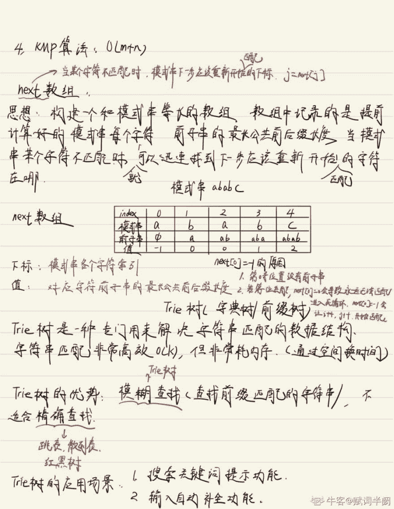
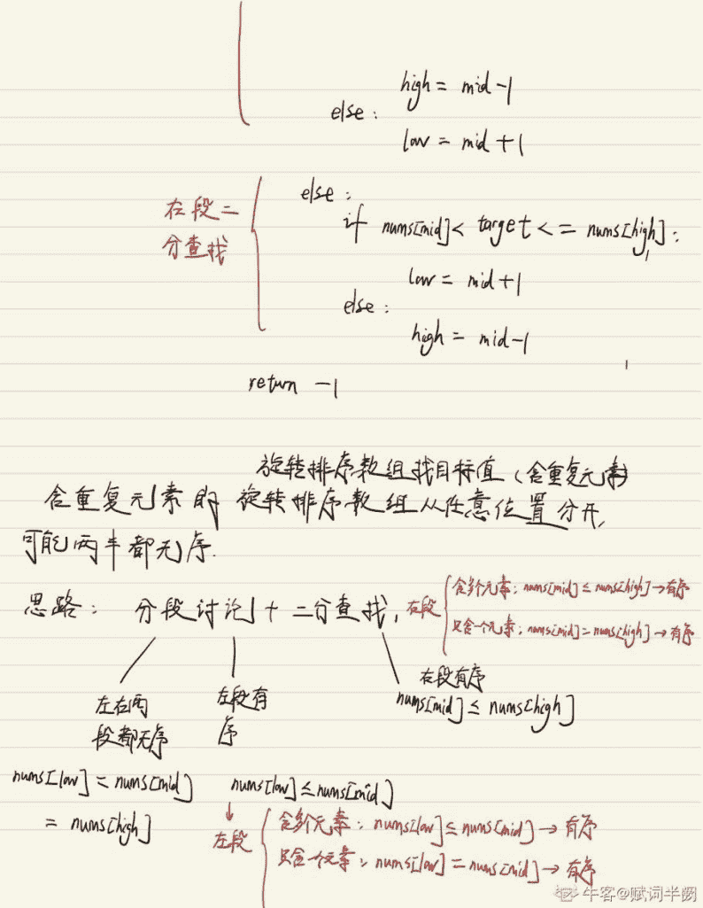
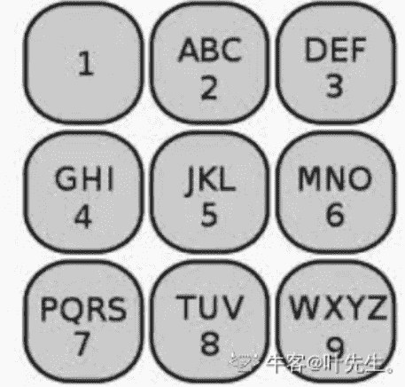

# 第三章 第 6 节 算法方向优质面经合集

# 篇一：字节跳动 7 月份按岗位汇总算法高频题

作者：一个搬砖的胖子

## 一、前言

字节跳动提前批真的是火爆，最近一直是牛客热搜榜第一，每天都会有一二十篇新鲜热乎的面经...

前段时间总结了 5 月和 6 月字节跳动的两个月高频题目，反响还不错。

这两天在分析提前批的面经，发现题目的趋势更加明显，可能真的应了那句话，面试官就那么多，考的题也就那么多。

**而且越新的面经，参考意义也就越大**
距离结束还有不到十天的时间了，这次我把 7 月 1 号~7 月 6ri 的算法题做了汇总，发现最近**LRU**频繁出现！大家一定要会呀！！！

## 二、后端

| **算法题** | **频次** |
| 102\. 二叉树的层序遍历 | 4 |
| 146\. LRU 缓存机制 | 3 |
| 415\. 字符串相加 | 2 |
| 199\. 二叉树的右视图 | 2 |
| 113\. 路径总和 II | 2 |
| 3\. 无重复字符的最长子串 | 2 |
| 25\. K 个一组翻转链表 | 2 |
| 2\. 两数相加 | 2 |
| 958\. 二叉树的完全性检验 | 2 |
| 剑指 Offer 42\. 连续子数组的最大和 | 2 |
| 347\. 前 K 个高频元素 | 1 |
| 101\. 对称二叉树 | 1 |
| 1147\. 段式回文 | 1 |
| 20\. 有效的括号 | 1 |
| 283\. 移动零 | 1 |
| 876\. 链表的中间结点 | 1 |
| 460\. LFU 缓存 | 1 |
| 206\. 反转链表 | 1 |
| 100\. 相同的树 | 1 |
| 69\. x 的平方根 | 1 |
| 124\. 二叉树中的最大路径和 | 1 |
| 剑指 Offer 11\. 旋转数组的最小数字 | 1 |
| 160\. 相交链表 | 1 |
| 15\. 三数之和 | 1 |
| 143\. 重排链表 | 1 |
| 8\. 字符串转换整数 (atoi) | 1 |
| 842\. 将数组拆分成斐波那契序列 | 1 |
| 41\. 缺失的第一个正数 | 1 |
| 704\. 二分查找 | 1 |
| 128\. 最长连续序列 | 1 |
| 814\. 二叉树剪枝 | 1 |
| 剑指 Offer 33\. 二叉搜索树的后序遍历序列 | 1 |
| 23\. 合并 K 个排序链表 | 1 |
| 1\. 两数之和 | 1 |
| 445\. 两数相加 II | 1 |
| 62\. 不同路径 | 1 |
| 63\. 不同路径 II | 1 |
| 4\. 寻找两个正序数组的中位数 | 1 |
| 剑指 Offer 29\. 顺时针打印矩阵 | 1 |
| 509\. 斐波那契数 | 1 |
| 103\. 二叉树的锯齿形层次遍历 | 1 |
| 141\. 环形链表 | 1 |
| 剑指 Offer 52\. 两个链表的第一个公共节点 | 1 |
| 剑指 Offer 61\. 扑克牌中的顺子 | 1 |
| 105\. 从前序与中序遍历序列构造二叉树 | 1 |
| 215\. 数组中的第 K 个最大元素 | 1 |
| 111\. 二叉树的最小深度 | 1 |
| 994\. 腐烂的橘子 | 1 |
| 剑指 Offer 54\. 二叉搜索树的第 k 大节点 | 1 |
| 33\. 搜索旋转排序数组 | 1 |
| 977\. 有序数组的平方 | 1 |
| 344\. 反转字符串 | 1 |
| 234\. 回文链表 | 1 |

## 三、客户端

| **算法题** | **频次** |
| 104\. 二叉树的最大深度 | 2 |
| 146\. LRU 缓存机制 | 2 |
| 543\. 二叉树的直径 | 2 |
| 21\. 合并两个有序链表 | 1 |
| 151\. 翻转字符串里的单词 | 1 |
| 7\. 整数反转 | 1 |
| 206\. 反转链表 | 1 |
| 257\. 二叉树的所有路径 | 1 |
| 102\. 二叉树的层序遍历 | 1 |
| 215\. 数组中的第 K 个最大元素 | 1 |
| 103\. 二叉树的锯齿形层次遍历 | 1 |
| 3\. 无重复字符的最长子串 | 1 |
| 662\. 二叉树最大宽度 | 1 |
| 1\. 两数之和 | 1 |
| 剑指 Offer 34\. 二叉树中和为某一值的路径 | 1 |
| 剑指 Offer 32 - III. 从上到下打印二叉树 III | 1 |
| 300\. 最长上升子序列 | 1 |
| 322\. 零钱兑换 | 1 |
| 460\. LFU 缓存 | 1 |
| 958\. 二叉树的完全性检验 | 1 |

## 四、算法

| **算法题** | **频次** |
| 104\. 二叉树的最大深度 | 1 |
| 110\. 平衡二叉树 | 1 |
| 剑指 Offer 55 - II. 平衡二叉树 | 1 |
| 814\. 二叉树剪枝 | 1 |
| 23\. 合并 K 个排序链表 | 1 |
| 1\. 两数之和 | 1 |
| 445\. 两数相加 II | 1 |
| 2\. 两数相加 | 1 |
| 62\. 不同路径 | 1 |
| 63\. 不同路径 II | 1 |
| 4\. 寻找两个正序数组的中位数 | 1 |
| 剑指 Offer 29\. 顺时针打印矩阵 | 1 |
| 509\. 斐波那契数 | 1 |

## 五、前端

| **算法题** | **频次** |
| 剑指 Offer 48\. 最长不含重复字符的子字符串 | 1 |
| 680\. 验证回文字符串 Ⅱ | 1 |
| 112\. 路径总和 | 1 |

## 六、测试

| **算法题** | **频次** |
| 169\. 多数元素 | 2 |
| 796\. 旋转字符串 | 1 |
| 543\. 二叉树的直径 | 1 |
| 20\. 有效的括号 | 1 |
| 25\. K 个一组翻转链表 | 1 |
| 215\. 数组中的第 K 个最大元素 | 1 |
| 704\. 二分查找 | 1 |
| 169\. 多数元素 | 2 |

## 七、数据

| **算法题** | **频次** |
| 1201\. 丑数 III | 1 |
| 剑指 Offer 41\. 数据流中的中位数 | 1 |

# 篇二：回馈牛客，秋招总结分享

作者：SkySeason

## 一、前言

2021 届秋招基本结束，谨以此文做一下梳理与沉淀。

仅限技术栈为后台开发。

## 二、秋招结果

个人情况本科、硕士都是双非一本，坐标北京，论学校和学历的话并不占优势，实习的时候基本身边都是北邮、北交及以上的同届同学。但是也希望和我一样的学校并不出彩的同学不要放弃，付出总会得到回报的。

有过三家大厂实习：滴滴（Java）、字节（Golang）、阿里（大数据），技术栈不算窄。在实验室也是团队负责人，带过项目。

总的来说，有优势也有劣势，这次整理一是沉淀一下秋招的收获，二是分享给大家，如果可以给大家带来一些帮助，也是我心中所愿。

秋招 offer 主要集中在互联网公司：阿里 SP、腾讯 SP、快手 SSP、美团 SP、京东 SP、滴滴、小米。

国企银行部分也有一定的收获，但是相比互联网的结果，不算成功。总的来讲国企银行更看重综合实力，技术能力只是评估指标之一，学历与院校水平占据更多的主导地位。

## 三、面试情况总结

### （一）语言

互联网公司校招对语言没有硬性要求，如果语言对口，会针对语言进行一些基础知识的测试。但是如果语言不对口，不会因此直接拒绝，会从其他方面进行更全面的综合基础测评。

Java 类较多的公司：阿里、美团、京东、快手、小米

Java 类较少的公司：腾讯（基本无 Java，主要 C++/Golang/Python）、滴滴（主要 Golang/php）、百度（主要 C++/php）、字节跳动（主要 Golang、Python）

### （二）计算机基础

计算机基础是面试中的重点，能让面试官了解到你对整个计算机体系的了解程度，尤其面试非语言对口的公司与部门时，如果计算机基础不过关可能会被直接淘汰。

#### 数据结构与算法

**数据结构是重中之重。**基础数据结构需要深刻掌握，并且拥有代码实现能力；部分高级数据结构需要有一点的了解与理解。

*   基础数据结构：顺序表（数组）、链表（单向、双向、循环等各种）、栈、队列、树（以二叉树为基础）、图（主要是一些关于图的搜素算法）、哈希表、堆等。
*   高级数据结构：红黑树、线段树、跳表、前缀树、并查集等。

**算法。**算法与数据结构应一起学习，要可以在算法中熟练运用各种数据结构。国内互联网算法面试普遍不是很难（但是笔试难度有些大厂很难）。基本上属于牛客题霸中中等或简单级别的题目。下面针对公司说明一下。字节跳动：字节对算法要求较高，笔试难度很大，面试难度一般讲也超过大厂平均水平。进入字节需要对算法有较深刻的理解。秋招因为个人原因没有参加字节的面试，但是拿过字节的暑期实习 offer，结合其他同学面试反馈看：

*   面试要求手撸代码，不接受口嗨。
*   题目对面试者有较深的考察，通常需要掌握高级数据结构。

阿里巴巴：阿里笔试算法 2 道题，难度较高，但是笔试不好不代表没有面试机会。面试中个别部门要求手撕（如阿里云），大部分部门视频面试无代码窗口，接受口嗨。面试中算法难度中等，但是个人经验，阿里面试中不是非常注重算法能力，甚至没有算法题。腾讯：腾讯笔试题目较多，难度较高。面试中对算法依然有较高要求，我当时是现场面试，要求纸上手撕代码，要求代码完整性，难度中等。

京东：京东今年大部分部门采取电话面试，但是有的回合会进行电话+在线编程界面的形式，对算法考量程度中等，难度不高，中低水平，题目很多集中在《剑指 Offer》中。

其他：其他几家大厂基本都采用牛客的在线面试程序，每回合基本都有算法涉及，但是难度均不太高，题目大部分集中在《剑指 Offer》中。

算法这块内容，我的基础不算很好，当时是刷题加上视频的方式去学习的。推荐大家可以试一试牛客中的算法左程云老师视频，讲解非常细致，从数据结构开始到算法的延伸。并且会针对面试真题进行详细讲解与优化。如果有兴趣的同学可以通过以下链接进行购买，可以获得一定程度的优惠：

*   牛客 2020 算法高级班：[`www.nowcoder.com/courses/cover/live/482?coupon=AIfrncy`](https://www.nowcoder.com/courses/cover/live/482?coupon=AIfrncy)
*   牛客 2020 算法中级班：[`www.nowcoder.com/courses/cover/live/503?coupon=AyGVM82`](https://www.nowcoder.com/courses/cover/live/503?coupon=AyGVM82)
*   牛客 2020 算法基础提升班：[`www.nowcoder.com/courses/cover/live/500?coupon=AqPCSZT`](https://www.nowcoder.com/courses/cover/live/500?coupon=AqPCSZT)
*   牛客 2020 算法基础入门班：[`www.nowcoder.com/courses/cover/live/509?coupon=A9MsMP8`](https://www.nowcoder.com/courses/cover/live/509?coupon=A9MsMP8)

#### 计算机网络

计算机网络。互联网面试中，计网的参与度同样很高，软件开发部分主要集中在整体网络体系、应用层、传输层层面，很少下探到底层，不过有个别现象，比如京东二面中被问到了载波监听与多路访问。最基础的常备知识点如下：

*   5 层、4 层、7 层网络体系结构。
*   一次[www.baidu.com](http://www.baidu.com)的浏览器检索，发生了什么。
*   http 与 https
*   http1.0/1.1/2.0 区别
*   tcp 与 udp
*   三次握手、四次挥手
*   滑动窗口、拥塞控制、快速重传等

#### 操作系统

操作系统。在面试中操作系统的问题不算多，因为这门课下探的话深度太深，面试官也不好尝试，甚至有的面试官也不太熟。一些常备问题有了解就好，多看些面经，当然如果可以深入，你讲出来就是你的亮点。举个例子，进程和线程的区别中，大家都会提到一条线程切换比进程切换要快，但是如果可以讲出为什么快，进程切换做了什么，线程做了什么那自然是加分项了。最基础的常备知识点：

*   进程和线程的区别
*   几种 IO 模型
*   select、poll、epoll
*   进程、线程的几种状态；状态转换等
*   PV 操作
*   进程通信的方式
*   分段分页

#### 计算机组成原理

计算机组成原理。这门知识很贴近硬件，面试中单独提问的基本很少，如果时间有限可以战略性放弃。但是有时间如果可以补充的话为最好，其中一些底层运算机制能帮助梳理整体计算机体系，并且涉及到的汇编语言、机器指令也可以很有效的帮助理解高级语言。

#### 数据库原理

互联网面试中，对数据库的考察偏重实际应用，很少涉及到书本上的数据库原理层面（如关系代数等知识），但是一些常见问题，如三大范式，依然在考察之中。

关系型数据库，选择一种深入了解即可，推荐 MySQL。要对存储引擎、事务控制、索引优化等知识的原理和使用都深入了解。并且需要拥有一定的 SQL 能力，面试会出现很多场景 SQL 题与索引优化题。问题举例：

*   MySQL 中都有哪些存储引擎，有什么区别。
*   ACID 代表什么，脏读、幻读、不可重复读是什么，如何解决。
*   索引有哪些种，什么区别。索引结构有哪些，如何实现，什么区别。

#### 语言框架

其实每个大厂都会有一套或者多套自己的生态环境，入职后都需要进行再学习。但是针对你选择的面向对象语言，要对语言生态有一定的了解，常用的开源框架核心功能的使用与原理都在大厂的考察范围内。

我的主语言是 Java，所以这里说一些 Java 需要掌握的框架。

#### Spring

Spring 已经不再是一个框架，而是一个生态了。Spring 旗下的各种框架需要有一定的了解和研究，如：Spring、SpringBoot、SpringMVC 等。问题举例：

*   Spring 的 IOC 和 AOP
*   SpringBoot 是如何实现自动配置的
*   SpringMVC 的请求流程

#### MyBatis 或 Hibernate

做 Java 开发的同学必不可少需要涉及至少一种持久层框架。总的来讲，目前 MyBatis 用的比较多，但是擅长 Hibernate 也是可以的。这块知识其实面试中不会很多，但是偶尔也会提到一两句，普遍偏应用方向，原理层面也会有部分涉及，所以复习程度要自行斟酌。

#### 中间件与分布式

这部分知识不是必须的，应届生在学校中往往没有实际应用场景，所以可能会欠缺这方面知识，这个时候实习就显得很重要了。这部分知识往往是提升面试面评的最佳之选，上述的内容可能你掌握不牢便属于不合格范畴，是合格与不合格之间的评判标尺。而这部分内容便是合格与优秀之间的评判标尺。当然，这方面复习要根据时间、基础等条件斟酌决定。

#### Redis

Redis 基本已经成为基础必备知识，Redis 的常用方向、数据结构（分为表层数据结构和底层数据结构）、分布式部署模型、缓存相关的内容、分布式锁等。

#### RPC

RPC 框架有很多，想进入大厂甚至想取得大厂 SP 的话，至少对一种 RPC 框架（如 Dubbo、Thrift 等）有一定了解，并且要对微服务的架构有一定的认识。并且要对一些数据传输的底层协议、注册中心监控中心的原理、负载均衡算法等有一定了解。

## 四、面试题目类型

面试中面试官所问的问题有几类，可以对这些类问题加以区分，针对性复习。

**基础知识类：**这种问题一般是结构化的，答案基本固定。答出正确答案是基本及格的，有条理的表达给面试官是优秀的。
**算法编程类：**考验代码基本功，通常需要电脑上编写、纸上手写、口述思路等。

*   算法题目：例如写一个快速排序。
*   设计类编程题目：例如写一个 DCL 的单例模式。
*   SQL 类：给你几个表，做一个统计分析。

**开放性题目：**这类题目因人而异，有的同学认为最难，有时一句话都说不出。但是有的人认为最简单，能滔滔不绝。这种题同样也是区分度很大的题型，可以划分出及格和优秀。如果不擅长这类题型需要自我进行训练，多看面经，总结自己的回答策略，其实无非那几种。举例：

*   如果让你设计一个 qps 10w 级别，数据量日均 1000w 的秒杀系统，你如何设计？
*   现在有一个系统是单机部署，现在突然访问高峰期，需要提高性能，你如何操作与设计？
*   线上服务非常卡顿，用户请求响应超过预期，你觉得是什么原因，如何定位，如何解决？

## 五、写在最后

受疫情影响，今年的秋招是相对较难的，hc 的紧缩伴随着难度的提升都让人很头疼。互联网秋招基本结束，也正是因为今年视频面试的形式导致很多 offer 聚集在同一个人手里，所以补录和春招势必会空出名额。祝大家都可以找到心仪的工作。

欢迎指正交流。

# 篇三：一个“普通人”的秋招算法岗上岸心得

作者：欧姆表不孤独
##感觉反馈不错呀！希望大家能多多点赞收藏，以后会再更新一些秋招中的避坑指南！
一直想写点东西总结一下自己的秋招历程，觉得在一定程度上应该能代表很多"普通人"的秋招经历。但是由于各种原因（主要是自己懒），从去年 11 月秋招大致结束，一直拖到现在都没有写。最近在好友的鼓励下，终于下定决心，克服懒散，提笔记录下这段艰难但也颇有意义的经历，希望能给师弟师妹们一些信心，同时少走一些弯路。另外题目中写"普通人"是因为自觉在各方面都不出彩，加引号是为了免去一些闲话，如果你看完全文还是觉得我有冒犯，那我在这里先道个歉。

先介绍下自己的背景：西北某 211 本硕，方向为计算机视觉（CV），没有论文，没有实习，做过几个实验室和学校的项目，一个天池比赛前 20。最终拿到四个 offer，美团、字节、小米、旷视，均为 SP。我相信一定有很多像我这样普普通通的人，感觉自己各方面都比较一般，没有比较好的论文、项目，比赛名次也不是特别高，编程也没那么牛，一边看着网上的各种算法岗劝退言论，一边心慌慌地纠结要不要继续找算法岗。我写这篇帖子的目的就是希望能给大家一些信心，如果你觉得自己做过一些相关的项目、比赛，有一定的基础，肯花时间好好准备找工作的相关事宜，那我建议你可以下决心了。

我想先从大的方面对秋招中比较重要的几个方面进行总结，也给出一些建议，然后再把几个公司的面经贴上来。因为面经在一定程度上具有很大的偶然性，并不能完全代表一个人或这一个厂的真实情况，只能作为参考，因此最好是多看一些。

## 一、秋招总结

### 1、心态

秋招对大部分人来说都是一段非常难熬的经历，本身自己就已经是顶着很大的压力在求职，还要面对很多外界因素带来的影响，时常会给自己的心态带来非常大的波动。本来我在这一部分写了很大一段回忆自己遇到的一些搞心态的事情，但仔细想了想还是删了，以后有机会单独写一帖吐槽求职路上的奇葩经历，这里就写一些可能会影响到自己心态的方方面面，大家可以注意一下。

1）面试被拒：这应该是最常见的压力来源了，而且随着被拒的次数越来越多，压力也会成倍增加，对个人心态考验非常大。对我们这样的普通人来说，前期面试被拒再正常不过了，这时候一方面是要总结好失败的经验，另一方面也要寻找合理的宣泄途径，跟好朋友吐槽、打两把游戏等都是很有效的方法。

2）周边环境：我们一般都是和同届同学一起找工作，有些同学比较优秀，很快就拿到 offer，这时候也有可能会对我们的心态有些影响。不过这是没有必要的，你直接去跟他取经就好了，能拿到 offer 大概率是有可取之处的，我当时就跟一个同学学到了很多东西。当然也不排除有些人拿到 offer 后在朋友圈装逼、散布焦虑情绪，这种我建议屏蔽或拉黑，同时也希望大家拿到 offer 后能低调一些，以己度人。

3）网络言论：每年在网上都会出现一个词来形容每年的算法岗状态，19 年是"诸神黄昏"，20 年是"灰飞烟灭"，不知道今年会是什么。但无论怎么说，都改变不了大部分人最终拿到 offer 的事实。这种问题其实挺唬人的，四月起这么个问题，大家都刚开始找工作没啥经验，碰壁了就去吐槽，造成一种算法岗无望的景象。但如果你十一月问这么个问题，很多回答应该就成了如何通过不断投简历、面试最终上岸某家公司，其实我身边的同学、朋友大部分也都是 9 月之后拿到了"定稿"的 offer，10 月、11 月的也多的是，所以大家一定要稳住，尽量不要受到这种言论的影响。

其实在秋招中感受到痛苦是一件再正常不过的事情，但我也不敢跟你说："心态要好，不要在乎那些事情"，虽然这是对的，但经历过那种压力和痛苦就会知道完全做到这样几乎是不可能的，就跟世界上没有圣人一样。我给大家的建议就是首先要做好承受这一切的准备，秋招几乎不可能是一帆风顺的；另外当压力到来的时候，一方面要先做好总结，另一方面也要找到合理的宣泄方式，不要让一次的失利影响你太久。恐惧、失落、时常进行的自我怀疑，这都是秋招中的常态。一边痛苦，一边反思，在秋招中这是提高自己最快的方法。

### 2、刷题

这是一个老生常谈的话题了，在互联网只要是技术岗，笔试面试都要撕题。我本人是从 2020 年 2 月中旬开始准备的，期间一共刷了 400 道题，总体感觉下来能应对几乎所有的笔试、面试场景了，印象里面试过程中碰到的题目全都撕出来了，笔试大概能通过 80%的样子。接下来会说一些自己的小心得。

首先声明，我没有参加过编程比赛，本科学过 C，学过基础的数据结构和算法知识，读研之后大部分时间使用 python，整个刷题和笔、面试也都是使用 python 完成，可以说在刷题方面也是一个非常普通的人。

1）如果你像我上面说的一样，对刷题需要的算法（排序、链表、二叉树、图、动态规划等）没有过一个系统的学习，那我强烈推荐你去看左程云（左神）的算法课，个人感觉左神的课在深度和广度上都能覆盖整个秋招的范围。首先，如果你没有很好的算法基础，左神的课能让你对算法建立一个系统的认识，对基础的算法有很好的理解；另外，左神也会做很多扩展性的算法介绍，这些你可能没听过，但是不要紧，至少之后你在牛客题霸看到的时候不会一脸懵逼，知道这是个什么东西，大概解决了什么问题，然后再慢慢研究。总之，左神的课非常长也非常良心，希望大家能坚持看完（基础班我记得接近 30 小时），你一定会大有收获。再次对左神表示 respect！

2）有了基础之后，接下来就是刷题。我建议大家先按照类别刷，比如链表相关的做个十几道，有个比较深入的理解，然后再去做二叉树、排序等，这样按照大类做下来之后，你就不会对题目感到陌生和惶恐了，看到题之后知道这大概是个什么事。然后我建议把《剑指 offer》刷两遍，剑指非常经典，牛客题霸也有剑指专题，很方便。之后就比较随意了，可以先把热题 TOP100 刷一遍，如果有时间也可以按照顺序再刷个两百道，感兴趣的话去参加周赛也挺好的（我没有参加过）。另外，牛客上也有大佬整理了每个公司出过的题目汇总，这也是不错的选择。对于出现频率非常高的题目，一定要多刷几遍，确保碰到就能秒了。

总之，在刷题这一块我一直有两个看法，一是如果你现在对秋招很迷茫很惶恐，不知道该准备些什么，那你就刷题去吧，至少这肯定是不会错的，另外就是在你有时间的基础上，刷的题目越多越好。根据我对周边同学的了解，最好是能刷到 200 道以上的题目，这样在面试中底气也会更足。

### 3、基础知识

基础知识是考验基本功的，包括机器学习和深度学习里面的一些基础的问题。这部分可能会问的比较广，需要系统地学习和整理。

这里推荐两本书：李航老师的《统计学习方法》和周志华老师的《机器学习》（西瓜书）。建议大家可以先深入地读一下《统计学习方法》，李航老师写的非常精炼，也比较"好懂"，碰到不懂的可以去看看西瓜书，两本配合食用效果更佳。知乎、博客上也有很多大佬们更通俗的解释，可以加深理解。《深度学习》（花书）也是非常好的一本书，但是太厚了，很难读完。建议当成工具书，碰到问题可以去专门的章节翻阅，可能会有意想不到的收获。在这个过程中最好准备一个笔记本，将公式的推导以及一些算法的流程和重点记录下来，能巩固记忆，查阅起来很方便，面试前也可以拿出来翻一翻。推荐大家用活页本，内容增添起来很方便。

除了看书以外，总结和整理也是至关重要的。有的问题你可能理解了，但是表达出来没那么专业，不够味。因此这部分我建议大家先去网上搜集一下面经，把里面提到过的问题都整理出来，然后自己总结出一个合理的答案，形成文档，以后碰到就这么回答就行了，这也就是网上有些人说的"八股文"。如果面试碰到了没有见过的问题，就把它加入到你的文档中去，确保以后碰到能够对答如流。我在后边也会把我整个秋招过程中碰到的比较常见的问题列出来，供大家参考。

总结一下，基础知识部分主要是学习+整理，当你的面试数量达到一定程度之后，这部分就几乎不是问题了。记住，一定要整理成文档，一定要整理成文档，一定要整理成文档！

### 4、论文/项目/比赛

这部分主要是个人的一些经历，是体现"个人价值"最重要的部分，也是简历上面试官着重会进行提问的。这部分因人而异差别很大，因此我只说一些小建议。

1）论文：首先强调一点，没有论文也是可以上岸的，没有论文也是可以上岸的，没有论文也是可以上岸的！我身边的同学，以及秋招中认识的朋友，很多也是没有论文的，但最后都能拿到比较满意的 offer。不少人在论坛上说"没论文简历都过不了"，这绝对是缺乏数据支撑的。简历没过很大程度上是因为简历写的不好，或者部门不匹配。前者需要好好地琢磨一下简历的逻辑、布局，后者的话就找准方向多投就行了，肯定会有捞你的。如果有论文的话要想办法把自己论文的贡献点讲清楚，这部分我没有实践过，就不班门弄斧了。

2）项目：这一部分很多人有这样一种疑问："我项目做的很弱，就做了这点东西都不好意思讲出来"。其实这是很正常的，永远记住，大部分人都是普通人，岗位很多，不可能只招天才。你做的再一般，那也是完成了一个项目，也有项目背景、创新点、应用场景，也是能在某个场景下解决了某个问题，这其实就够了。只要你真的对项目投入了精力，对其有比较好的理解，一定是有可取之处的，证明你解决问题的能力是很不错的。接下来你需要做的就是如何把项目给面试官讲好，这里我还是建议大家像写演讲稿一样把你要将的东西整理成文档，不要只在大脑里凭空想，一定要写在文档里，先去找同学讲一遍，然后面试的时候发现某个地方讲的不够好，回来再继续改进，慢慢地就能将项目讲好了。记住，一定要自信！

3）比赛：这部分和项目比较类似，面试官比较感兴趣的是你解决问题的思路、采用的方法以及相比其他参赛者的方法的优势。和上述一样，最好是整理成文档，把比赛题目、算法设计思路、具体采用的方法以及最后和其他方法的对比和反思都写一下，面试的时候按照写好的逻辑来讲。比赛这里，优胜参赛者的解决方法也是比较重要的一点，面试中经常会问到，一定要去论坛把前几名的方法都大致看一遍，大致了解一下。

### 5、简历

简历是给面试官的第一印象，写一份好简历是求职过程中非常重要的开端。在这里也给大家几个小建议，大家写的时候可以注意一下。

1） 模板：简历模板尽量简约一些，不要花里胡哨的那种；

2） 照片：建议大家去比较专业的照相馆拍一组证件照，西服领带搞起来，这样看起来正式一些。

3） 项目介绍：这部分是简历最重要的地方，一定要仔细琢磨，每句话的存在都要有意义，都要体现项目中最"精彩"的部分，切忌废话连篇。另外，每个点的介绍都要胸有成竹，确保面试官问起来的时候能够对答如流，配合第四条中整理的文档食用效果更佳。

4） 篇幅：如果你的项目不是特别特别多，那么简历尽量不要超过一页。

## 二、一些公司的面经

我大概是从五月底开始投简历的，从所记录的面经中挑了些比较有意义的供大家参考。同时我也给出了我对自己面试过程的评价，但不能代表所有人，大家尽量多去讨论区看一看，这个差异还是很大的。

### **1、美团**

 **#### **一面：**

 **1) 自我介绍；

2) 项目介绍，上线、落地情况；

3) 介绍下 LR，思想，LR 里的最大似然是怎么回事；

4) 代码题：给出一个函数 rand1，随机生成 0 和 1，写一个函数 randN，均匀生成 0-N-1；

5) 代码题，计算根号 N，精确到小数点后 m 位，二分法，梯度下降法。

#### **二面：**

 **1) 自我介绍

2) 计算机网络、操作系统学过没；

3) 多进程、多线程讲一下，内存占用方式，为什么线程是共享内存的；

4) 讲下项目，传统方法是怎么做的，有啥优点，是怎么部署的，几个人完成的，数据是怎么采集的，规模有多大；

5) 讲下比赛，几个人完成的，怎么分工的；

6) 有没有碰到过拟合，过拟合的标志是什么，怎么解决；

7) L1 正则化为什么能缓解过拟合；

8) 有没有发论文；

9) 包含百万、上亿特征的数据在深度学习中怎么处理；

10) 降维方法有哪些，PCA 是怎么做的，还知道其他的吗；

11) LR 和神经网络有什么区别；

12) 代码题：字符串中长度为 len 的连续字串中，出现次数最多的字串；

13) 数学题：四个人过河，每次最多两人，有多少种过河方法。四人过河时间分别为 1，2，5，10（分钟），问最快需要多久。AB，A 回，CD，B 回，AB，共 17 分钟。

#### **三面：**

 **1) 自我介绍

2) 比赛介绍，比赛的任务，前几名的团队都是怎么做的，你们的亮点在哪里；

3) 挑一个项目介绍；

4) 目前的 offer；

5) 职业规划里最看重什么；

6) 反问。

#### **HR 面：（通过）**

 **1) 本科和研究生期间比较骄傲的一件事情，比较遗憾的事情；

2) 为什么没有选择深造；

3) 最近最有挫败感的事情；

4) 对美团的了解；

5) 职业规划，工作城市的选择；

6) 对自己不满意的地方；

7) 反问。

总结：美团的面试流程很紧凑，面试体验也非常好，点赞。**********  ******### **2、字节**

 **#### **提前批一面：**

 **1) 自我介绍；

2) 问项目，检测里改进了哪些点，GAN 是用来干什么的，怎么用的；

3) 方向相关的一些知识；

4) 其他相关论文里用到的一些方法；

5) 撕题：手写 nms。

#### **提前批二面：**

 **1) 自我介绍；

2) 介绍项目，面试官好像是做检测的，主要问了问检测的项目；

3) 检测任务有什么衡量指标（mAp），实现原理是什么；

4) 分类里用到的交叉熵公式是什么；

5) 讲了讲比赛里用到的一些点；

6) pytorch 里 function 和 module 有什么区别；

7) pytorch 里 dataset、dataloader、sampler 有什么区别；

8) python 里的生成器是什么；

9) 撕题：两个有序数组的中位数；

（三面挂了，没有记录。之后又到了三面，又挂了，提前批结束，共六面。）

#### **正式批一面：（挂）**

 **1) 自我介绍

2) 项目相关；

3) 生成对抗网络是怎么用的；

4) CRNN 的思想，CTC 的思想，CTC 中有没有训练参数；

5) 姿态估计相关项目；

6) TCP/UDP 的区别，计算机网络，分布式，数据库，多进程和多线程；

7) 概率题：在一个圆里随机取 n 个点，它们在同一个半圆的概率是多少？

#### **正式批一面：（被捞）**

 **1) 自我介绍；

2) 先写个题，搜索旋转排序数组；

3) 项目介绍；

4) 进程和线程的区别；

5) 逻辑回归的损失函数是什么，怎么得到的，为什么不能用 MSE，sigmoid 求导是什么；

6) ResNet 的设计理念，InceptionNet 的设计理念；

7) 如何防止过拟合；

8) BN 层的作用，Dropout 的作用。

#### **正式批二面：**

 **1) L1 和 L2 哪个能使参数分布趋于稀疏，为什么；

2) 特征选择的方式；

3) 连续特征离散化的好处；

4) 偏差和方差的理解；

5) 过拟合和欠拟合；

6) BN 和 LN 的区别；

7) PCA 的处理过程；

8) 栈空间和堆空间的区别；

9) BP 的过程，CNN 中前向传播和后向传播的过程；

10) 代码题：复制带随机指针的链表

11) 代码题：二叉树的直径

#### **正式批三面：（通过）**

 **1) 自我介绍；

2) random7 生成 random10，调用次数的期望是多少，怎么算的；

3) 代码题：LRU 缓存机制，并发式怎么处理，数据量特别大，需要进行分布式存储怎么处理；

4) 反问。

总结：在字节前前后后加起来面了四个部门，共十面，还是挺夸张的。前两次都是到了三面被刷，还是很受伤的，不过确实增加了很多面试经历，权当学习了，之后都还好。字节的话大家可以尽量面，如果能到二面、三面而且面评不是很差的话，会一直被捞的。**************  ******### **3、小米**

#### **一面：**

 **1) 自我介绍；

2) 生成对抗网络在哪里用到的，起什么作用；

3) 损失函数是什么；

4) 知识蒸馏是怎么做的；

5) Focal Loss 的计算式；

6) 代码题：排序数组中某个值出现的次数。

#### **二面：（通过）**

 **1) 自我介绍；

2) 讲一下项目中的难点以及是如何解决的；

3) 代码题：面试题 01.07.旋转矩阵；

4) 对工作地点有什么想法；

5) 为什么没出去实习；

6) 反问。

总结：碰到的两个面试官都很好，沟通薪资的 HR 也很好，等了我好久，在这里表示感谢。

### **4、旷视**

 **#### **一面：**

 **1) 自我介绍

2) 天池比赛项目；

3) focal loss 的设计，落地情况；

4) 相关方向算法介绍；

5) crnn 相关，gan 相关；

6) bn 层的原理，要解决什么问题，还有什么 norm 方法；

7) dropout 原理，bn 和 dropout 能不能一起用；

8) 代码：给定一个序列，求其连续子序列和大于某个值的最小长度。

#### **二面：**

 **1) 自我介绍；

2) 项目介绍；

3) 熟悉哪些检测网络，介绍一下思想；

4) CTC Loss 的动态规划求解过程；

5) Softmax 公式，溢出怎么处理；

6) N 个城市之间建一个仓库，使得距离所有城市的距离和最小；K 个仓库呢；

7) 一个车辆围着圆圈跑，有一分钟每圈和两分钟每圈两种状态，在 P 点有 30%的概率进行状态切换，问无数圈之后在 P 点等到车的时间的期望；

#### **旷视三面（线下面的，当时忘了记录，只能记住一点点了）：**

 **1) 相关方向的学习历程；

2) 降低网络复杂度但不影响精度的方法；

3) 反问；

**HR 面（同上）：**

1) 意向城市；

2) 意向部门；

总结：方向很相关，面试体验挺好的。************  ****### **5、腾讯**

 **#### **一面：（挂）**

 **1) 自我介绍

2) 项目的应用范围

3) BN 的原理，要解决的问题，公式，训练测试中的区别

4) 卷积层和 BN 的融合知道吗？

5) 如果让模型速度提高一倍，有什么解决方案？

6) 代码：数组中第 K 大的数。Partation 的时间复杂度

总结：一面就挂了，没啥好总结的。

### **6、大华**

 **#### **一面：**

 **1) 部门介绍

2) YOLOV3 和 YOLOV2 的主要区别，loss 上哪里不同，smoothL1 loss 的好处，Yolo 里是向上取整还是向下取整

3) mean pooling 和 max pooling 反向传播的不同

4) LSTM 的反向传播，公式

5) Pytorch 中 bn 层在训练和测试中有什么不同，怎么实现的

6) 可分离卷积的思想，参数量计算

7) Pix2pix 和 cycleGan 的区别

#### **二面：**

 **1) 浮点数的二进制存储方式；

2) 如何将浮点数的每一位二进制打印出来；

3) 方差和协方差的理解；

4) 伯努利分布和二项分布的区别；

5) FFT 和 DFT 的区别；

6) 数字图像处理中，卷积(convolution)和互相关(cross-correlation)的关系；

7) Python 中类方法和静态方法的区别；

8) Linux 下查看内存占用（top），buffers 和 cache 的区别；

总结：一面面试官问的非常非常细节，有些没能回答上来。二面问的大部分都和方向不太相关，也没有特别准备，挂了也是情理之中。

### **7、商汤**

 **#### **一面：**

 **1) 自我介绍

2) 项目介绍，蒸馏方法是怎么用的；

3) 对我们的开源项目提意见；

4) Focal Loss 解释；

5) 凸函数的性质；

6) 如何评价两个分布的相似度，KL 散度怎么计算；

7) Auto-Encoder 是什么，都用在什么任务上；

8) Distribute 用过没，优点是啥。

#### **二面：**

 **1) 自我介绍；

2) 介绍下项目中检测相关的部分；

3) 检测里为什么选择 refineDet；

4) Conv 和 BN 融合后点数掉的太多怎么办；

5) Anchor-free 的优势在哪里；

6) Focal loss 在什么情况下有用，什么情况下不起作用；

7) 实现 sigmoid 函数，怎么防止溢出，误差分析。

总结：二面问的非常细节非常专业，没顶住。

### **8、海康**

 **#### **一面：**

 **1) 自我介绍；

2) 项目介绍，数据集是怎么选择的，图像大小大是多少；

3) 比赛介绍；

4) 快排思想，最差时间复杂度；

5) 反问。

#### **二面：**

 **1) 自我介绍；

2) 代码题：IOU 计算；

3) 代码题：买卖股票的最佳时机 III

4) 项目介绍；

5) Faster RCNN 和 SSD 的区别；

6) Focal Loss 的使用场景；

7) 反问。

总结：一面电话面，项目很相关，聊挺多的，面试官人也很好。二面是视频面，两道代码题都是在纸上写的（真手撕）。可能 HR 面的时候薪资要太高了，就没后续了。不过当时已经有几个 offer 了，就没太在意。**********************  ******## **三、基础知识整理**

 **想了一下还是决定不贴"答案"，一方面所谓"答案"都是通过个人理解整理而得，只有一些小 tips，并不适合所有人，更有可能引起歧义；另一方面大家自己整理一遍也能对问题有更好的理解。

1） 如何解决过拟合；

2） L1 和 L2 的区别；

3） 梯度消失和梯度爆炸的原因；

4） 什么是 Dropout，训练和测试的区别；

5） Batchnorm 层的作用及公式；

6） 为什么 LR 要用 Sigmoid 函数；

7） relu6 函数的好处；

8） smoothL1 损失函数的好处；

9） Yolo2 和 3 的区别；

10）Pytorch 中 bn 层在训练和测试中有什么不同，怎么实现的；

11）双线性差值的操作过程；

12）bn 和 dropout 同时使用产生的问题；

13）BN+CONV 融合公式及作用；

14）BN 的反向传播；

15）深度学习中的几种归一化方法及不同（BN、LN、IN、GN）

16）LSTM 公式及反向传播过程；

17）感受野的定义；

18）分布式学习；

19）SVM 的介绍和推导；

20）衡量分布之间差异的指标；

21）ROC 曲线和 AUC。**  **## **四、数学题整理**

 **1) 扔硬币，扔到正反都出现过停止，次数的期望；

2) 扑克牌放回取牌，A-K 加大小王全部都拿到后停，次数的期望；

3) 每个人给 A 投票的概率是 0.51，给 B 投的概率是 0.49，问一亿人投票时 A 获选的概率；

4) 斗地主有人拿到 2 张王的概率在；

5) k 个满足独立同分布的均匀随机变量的最小值的期望；

6) 一个骰子平均扔多少回才能把六个数字都扔出来至少一次；

7) 用一个骰子生成 1 到 7 的随机数。

## **五、其他的一些小 tips**

 **1) 内推一定要找靠谱的人，不要随便找一个内推码就填上了；

2) 投递的时候要先了解下部门的 hc，hc 的数量在很大程度上决定了你的求职难度，可以多考虑下扩招的部门；

3) 综合考量多方面的信息来源，不要根据某一个帖子中的信息做决定，包括本帖；

4) 简历一定要多投；

5) 进入八、九月份你会非常非常忙碌，最好通过日历记录下每天的笔、面试日程，windows 自带的日历就很好用；

6) 多加些群，可以得到很多信息，但要注意甄别；

7) 自我介绍也写成文档，反问环节也可以提前准备；

8) 多刷牛客，多看面经；

9) 拿到一个 offer 之后一定不能停止秋招，一个 offer 的风险非常大；

10) 想到再加。****  ****## **六、写在最后**

**算法岗的秋招并不是洪水猛兽，也不是只有少数人才能得到的岗位，只要你有一定的项目基础，有坚定的信心和踏实的努力，并且能坚持到秋招的最后时刻，一定可以拿到满意的 offer。道路是曲折的，前途是光明的，师弟师妹们冲鸭！

# **篇四：2021 我的互联网秋招算法岗总结【全】**

**作者：赋词半阙**** ****一晃接近三个月过去了，秋招也到了尾声，之前一直忙于写毕业论文，现在在这里想总结一些自己求职互联网大厂算法岗的面经和心得，希望帮助后来的学弟学妹们收获自己心仪的 offer。今年的算法岗求职较往年竞争也更加激烈，可以预见以后进大厂的算法岗会变得越来越难，比如美团北斗去年的准入门槛是一篇 CCF A，而今年直接提升到了两篇 CCF A，难度提高了一倍，加之疫情的影响，我认识的很多手握顶会的本科学弟们以及海外的同学们也加入到了找工作的大军中，因此今年算法岗的竞争堪称史上巅峰，真的是八仙过海，各显神通。不过，找工作不仅需要实力，运气和方法也缺一不可，下面我就谈谈我自己的心路历程。

## **一、背景**

 **本人 Top2 硕士在读，非计算机科班，两篇论文在投，投递岗位的方向主要为推荐/广告/机器学习，在整个秋招的过程中参加了 8 场面试，阿里、百度、京东、美团、拼多多、快手、小红书、平安。最后侥幸获得了 7 家公司的 offer，其中 6 家 ssp，1 家 sp，薪资待遇 40+W-70+W 不等。

可能很多人会觉得我应该有多家大厂的实习，但其实我并没有，由于父母的工作受到了疫情的影响，导致我今年从疫情开始到 7 月初一直都在家里帮父母的忙，从而错过了暑期实习，看到周围的同学都拿到了大厂实习的 offer，当时的我只感觉自己的秋招应该和互联网无缘了。每个人的秋招只有一次，如果不奋力一搏，又怎会知道最终的结果。抱着这个念头，我在 7 月初就赶紧放下了父母的工作，全身心的备战秋招。在这里，我就要讲一讲我的方法了，大部分互联网公司算法岗基本是三轮技术面+一轮 HR 面，技术面每轮的面试时间大致是一个小时，主要考察 coding 能力、基础知识和项目/竞赛。由于时间的不足，在这三个方向上我做了时间的分配，我的复习顺序是基础知识->项目/竞赛->coding 能力。

### **1.基础知识**

除了极少数公司会在一上来就要求你做一道编程题以外，大部分互联网公司都会在你的自我介绍和论文之后开始进行基础知识的考察，因此它的重要性不言而喻。基础知识的复习有两种途径，一是看书，二是看视频，这取决于你对哪一种途径接受知识的速度更快。我选择的是看书，一是因为视频不一定讲得面面俱到，二是视频质量如果不过关，很有可能某些细节的讲述是错误的。以推荐/广告岗位为例，我主要看如下书籍。

l 周志华的西瓜书《机器学习》

l 李航老师的《统计机器学习》第二版

l DL 圣经《深度学习》，又名花书。

l 《百面机器学习》

l 《概率论与数理统计》、《线性代数》、《凸优化》

l 推荐/广告：《深度学习推荐系统》、《计算广告》等

如果时间有限，可以直接去看第二本蓝皮书和第三本花书，这两本书一定要从头到尾仔仔细细的过一遍，因为基础知识的考察无外乎就是机器学习或深度学习里的知识。当这两本书过完一遍之后，再看西瓜书的效率就会快很多了。除此之外，第四本书可以留在你将要面试的那几天着重去学习，因为你有了前几本书的知识做铺垫，第四本书就可以当成八股文去背了。前提是一定要在你理解这些知识之后，因为单纯的死记硬背面试官其实很容易就会发现破绽，毕竟现在每个人都会背。对于本科学习过的线代和概率论，建议大家也复习一遍，因为在我的面试过程中就有面试官残忍的提问了，虽然概率不高。对于学有余力的同学，可以去看一些推荐/广告方向的工业界人士出版的书籍，这一块的知识考察往往会穿插在整个面试中，有的面试官会在最后当成开放题进行考察。

其次，基础知识的复习也很容易会遗忘，面对这个问题，我一般会将高频考点的知识写在 ipad 中，然后每晚会去复习一遍，如下图所示。例如 KMP 算法，我会在 ipad 上注明它的时间复杂度，对于 next 数组我会记录它的思想以及数组中的值是如何计算的，下次复习起来就会非常方便。**  **这样一个月下来，基础知识应该就可以烂熟于心了，这一段的复习就可以告一段落了。

### **2.项目/竞赛**

项目/竞赛一般会在基础知识之后进行考察，这些一定要提前准备好，写在简历里的项目一定是要自己亲自做过的，因为一旦面试官问到了项目中某一个部分的代码是如何实现而你又回答不上来的话，在他心里对你的印象就会非常减分，并且会怀疑候选人的诚信问题。所以，我的方法是将之前做过的项目重新再做一遍，包括代码部分。这一块看似会花费大量时间，实则并没有那么长。具体来说，我会先将做过的项目重新梳理一遍，画出整个项目的流程图，然后再逐行复习自己的代码。等代码复习完之后，再删掉重新写一遍，这一步骤因人而异，取决于你的记忆能力。

竞赛方面，常用的竞赛模型如 GBDT、XGBoost、LightGBM、FFM、DeepFFM 等一定要了解。最后，如果你的论文或项目与面试官所做的方向非常的 match，你通过这一面的概率也将会大很多。

### **3.coding 能力**

代码能力是计算机专业学生的基础能力，求职技术方向的同学，无论是测试、开发或算法，互联网公司在这一块的考察都是重中之重。一般而言，大厂在每一轮的技术面中，至少会出一道编程题，多的会直接上三道编程题让你做（我就遇到了...），难度主要集中在 easy 和 medium，少数丧心病狂（褒义词）的面试官会出 hard 题。而考察范围已是圈内公开的秘密，就在《剑指 offer》和牛客题霸上，因此刷题成为了大家求职路上必须要迈过的一道坎，这个坎没有人可以帮到你，只有靠你自己。

我是从 8 月初开始集中在牛客题霸上刷题，一直刷到了 10 月份，《剑指 offer》也是在牛客题霸上刷的，平均每个月刷题数是 300。可能很多人都觉得 300 道根本不可能完成，确实，如果你按照牛客题霸官方的题号顺序去刷根本不可能，但如果是按照题目类型（标签）去刷，每天刷 10 道，一个月也就完成了 300 道。一开始可能会很慢，但基本上每个类型的题目当你刷够 20 道以后，都可以总结出该类题目的代码模板，所以前期会慢一点，越往后则会发现刷题速度越来越快，可以理解为先苦后甜。而对于刷题的方法，可以分为三轮进行：

**a.第一轮：**优先效率。当一道题花了十五分钟去思考也没有思路时，则果断选择直接看答案。

**b.第二轮：**培养思路。你需要对以前做过的每一道题都要有一个大致的映像，并且知道解题的方法是什么。这一轮其实最难度过，因为人对事物的遗忘是有规律的，而我们需要想办法客服这个规律。在这里推荐一下我的方法。我在刷完每一道题之后，会在 ipad 上注明题号以及题目名称，然后将该题的解题思路写下来，最后还会重写一遍代码，下图为我在 ipad 上记录旋转排序数组的特点、思路以及对应的代码。

 

这样，以天和周为单位不断地复习之前的题目，就可以做到以后遇见它们时可以迅速反映出是用什么方法解决这道题的。

**c.第三轮：**完善思路。当我们顺利度过了第二轮之后，第三轮则需要学习每道题目的多种解法，比如 TopK 问题可以用快排变形/堆/二叉查找树/计数排序四种方法解决。在我的面试过程中，有些面试官会在你 AC 一道题后还会要求写出最优解，这往往决定你的面评是否能达到较高级别，也就是能否拿到 sp 以上级别的 offer，并且一道题如果学会了多种解法，也会让你加深对这道题的理解。因此，我建议大家要学会用多种解法解决一道题，并且要培养出能快速 AC 的能力。

对于时间紧迫的小伙伴来说，在达不到刷两百道题又想拿到大厂 offer 的同学，我们也可以通过走一些捷径来减少自己无效时间的浪费，从而最大化提高自己的代码能力。具体来说，我们可以购买一些大牛精讲的算法课程，虽然市面上的算法课琳琅满目，但真正对找工作实用高效且讲述通俗易懂的课程少之又少。在我七月份以前，我基本上白天除了忙于父母的工作以外，到了晚上都会花费两个小时的时间去看自己在网上购买的算法视频课程，目的是为了给自己打下数据结构与算法的基础。一个好的算法视频课相比于书籍最大的优势就是视频传授的知识点更加直观，我们可以当作看电视剧一样去看它，一方面可以降低自己对于学习的阻力，另一方面还可以高效的学习这些迫切的知识。对于看书感觉痛苦的同学，就可以像我一样选择观看视频，那么至于选择看免费课程还是收费课程，我的建议是选择一个收费但价格可以接受的算法课去学习，原因之一是免费的课程往往知识点讲述非常冗余，且大家对于免费的课程缺乏学习的动力，这样反而会耽误找工作；另一个原因是学习成果往往需要人们付出才能收获，有人选择花费金钱以最高的效率获得，有人选择花费更多的时间去获得，那在我看来，秋招阶段最宝贵的还是时间，毕竟每个人这一辈子只有一次秋招的机会，这等同于高考！

对比了一下市面上动辄大几千甚至上万的课程（具体机构名我就不说了），我最终还是选择了牛客的左神算法课，首先他的这门算法课分成了入门、提升、中级和高级四个班，对于一般的互联网中小厂来说，将入门和提升两个课程学完并且知识点全部吃透，完全可以通过代码题的考察，而对于想要面像腾讯、字节、美团和拼多多等大厂来说，就有必要学习一下中级和高级班了，首先这些公司的笔试众所周知，难度很大，其次面试中考察 medium 和 hard 的频率也比其它公司要高，除此之外，一轮面试中出 2-3 道代码题在近两年也不在罕见。我的目标是 BAT、TMD 这类公司，因此我一开始只购买了前两门课程，在学完并且感觉不错的前提下，我才又购买了剩下的两门课程，而每门课程在使用优惠券后购买只需要 200-300 元，这对于我来说还是比较划算的。作为牛客的忠实粉丝，我也很荣幸地为大家争取到了专属的购课优惠码，每门课打五折，相当于优惠了 200-300 元，如果是本来就想要买左神算法课的同学可以用我的优惠码，四个班的课程大家可以根据自己的实际情况选择，比白嫖的好处是有专门的老师进行答疑，还有课后作业和直播讲解等等。

下面附上课程链接，在购买的时候优惠码会自动生效哦~

**入门班**，适合零基础算法小白或基础非常薄弱的同学，课程链接：

[`www.nowcoder.com/courses/cover/live/520?coupon=AKLRSUR`](https://www.nowcoder.com/courses/cover/live/520?coupon=AKLRSUR)

**提升班**，适合有简单算法基础，但是还达不到校招水平要求的同学，课程链接：

[`www.nowcoder.com/courses/cover/live/512?coupon=ALOVscQ`](https://www.nowcoder.com/courses/cover/live/512?coupon=ALOVscQ)

**中级班**，适合想要备战秋招和准备找实习，想快速获得 offer 的同学，课程链接：

[`www.nowcoder.com/courses/cover/live/501?coupon=AnHCzG0`](https://www.nowcoder.com/courses/cover/live/501?coupon=AnHCzG0)

**高级班**，适合想要冲刺 BAT、TMD 等互联网大厂的同学，课程链接：

[`www.nowcoder.com/courses/cover/live/493?coupon=AJ6oKJm`](https://www.nowcoder.com/courses/cover/live/493?coupon=AJ6oKJm)

## **二、面试投递**

 **在完成了基础知识->项目/竞赛->coding 能力的复习后，时间节点也移动到了八月中下旬，这时很多公司的秋招正式批即将开始。由于我错过了提前批的投递，而提前批往往都没有笔试，所以正式批只能先参加笔试再进行面试。

经过血与泪的磨练后，在这里给大家的建议是，有提前批投提前批，无提前批投特殊计划，重要的事情说三百遍。原因有两点：1、提前批的竞争压力小，投的人少，先拿到 offer 的概率很大；2、正式批的笔试题一般有一定难度，且刷人主要看 AC 题目的数量，比较残酷。而且据我身边同学的例子，有很多人笔试完之后公司就杳无音信了，要问就是在筛选，实际上你已经妥妥变成了备胎（有恋爱经验的人都懂），然后在公司的池子里欢快的游动。除此之外，若感觉自己还没有准备好，则可以等待几天再投递，但千万不要错过提前批的截止时间。

所以提前批的面试能把握的还是尽量要把握，哪怕你觉得自己只准备了 60%，但万一成功了呢？因为面试通过这个事情，实力与运气都需要， 在你的实力和别人差距不大的情况下，实力不够，也可以运气来凑不是吗。

## **三、完整面经**

 **### **（一）京东**

 **#### **一面：**

 **1、介绍论文、项目，很详细。包括每一个环节是怎么实现的，损失函数是如何设计的，模型是如何训练的等等。

2、代码题：乘积小于 k 的子数组；二叉树的序列化和反序列化。

3、GBDT、XGBoost、LigthGBM 的区别与联系。

4、送入 LR 前，如何处理数据（特征工程）。

#### **二面：**

 **1、介绍论文、项目，很详细。

2、Transformer 中的 Scaled Dot-Product Attention 为什么要缩放（两点）。

3、Transformer 中的 Position Embedding 是怎么实现的？为什么？

4、bagging 和 boosting 与偏差和方差的关系以及原因。

5、如何解决数据不平衡的问题。

6、假设检验的两类错误。

7、MSE、MAE 与贝叶斯估计的区别。

8、为什么快排比堆排快？

9、口述算法题：对一个商品的价格、数量、购买人数进行分次排序，不改变之前的排序结果。

#### **三面：**

 **由于一、二面表现好，三面直接过了。**********  ******### **（二）美团**

 **#### **一面：**

 **1、介绍论文和项目，很详细。

2、代码题：面试题 17.24：最大子矩阵；岛屿的最大面积。

3、介绍一下 DSSM。

4、开放题：关于双塔模型的应用。

#### **二面：**

 **1、介绍论文和项目，以及论文中的涉及到的 baseline 模型。

2、代码题：面试题 01.08：零矩阵，写出两种解法。

3、XGBoost 如果损失函数没有二阶导，该怎么办。

4、聊天+反问。

#### **三面：**

 **1、介绍论文和项目，非常详细。

2、介绍实习，说说实习印象中最深的点。

3、开放题：部门中的某个应用场景你会怎么解决。

4、职业规划，个人希望做的方向。

### **（三）拼多多**

 **#### **一面：**

 **1、介绍论文和项目。

2、AUC 是如何实现的，它对均匀正负样本采样是否敏感，并用代码实现。

3、BERT 与 ALBERT 的区别。

4、介绍一下 DKN 模型。

#### **二面：**

 **1、介绍论文和项目。

2、过拟合如何解决+具体方法追问。

3、代码题：接雨水。

4、知识图谱表示学习有哪些模型。

5、聊天+反问。

### **（四）阿里**

 **#### **一面：**

 **1、介绍论文和项目。

2、代码题：链表随机节点，并口述蓄水池采样算法的推导。

3、概率题：将一根木棍分成三段，求这三段构成三角形的概率。

4、开放题：一个超级大文件，每一行有一个 ip 地址，内存有限，如何找出其中重复次数最多的 ip 地址。

#### **二面：**

 **1、介绍论文和项目。

2、论文后续可能提升的点以及想法探讨。

3、说一说 Graph Embedding 和 GNN 的区别。

4、代码题：合并 K 个升序链表。

5、聊天+反问。

#### **三面：**

 **1、介绍论文和项目。

2、介绍一下最能体现自己工程能力的项目。

3、如何提高推荐线上的性能。

4、强化学习在推荐中的应用及探讨。

### **（五）快手**

 **#### **一面：**

 **1、详细介绍论文和项目。

2、两个均匀分布相加是什么分布。

3、代码题：组合总和 IV；计算右侧小于当前元素的个数。

#### **二面：**

 **1、介绍论文和项目，很细。

2、激活函数有哪些？ReLU 是为了解决什么问题设计的？

3、决策树是怎么样进行划分的，决策树的损失函数。

4、朴素贝叶斯公式是怎么得到的，推导一下。

5、FM 如何降低时间复杂度，以及与 FFM 的区别？

6、代码题：字符串解码。

#### **三面：**

 **1、自我介绍，项目和论文。

2、工业界常用的推荐系统模型有哪些？

3、推荐系统中特征的 Embedding 的表示方法有哪些？

4、解释一下你的模型为什么会有效果，模型的可解释性？

5、聊天+反问。

### **（六）小红书**

 **#### **一面：**

 **1、介绍论文和项目。

2、代码题：无重叠区间。

3、介绍 Adaboost，Adaboost 的权值和 RF 比较。

4、线性回归为什么用均方差。

5、介绍 KMeans，K 值的选择和初始点。

#### **二面：**

 **1、介绍论文和项目，很细。

2、GCN 公式推导一遍。

3、GBDT 和 XGboost 区别（具体点），为什么 GBDT 用负梯度当做残差，详述 Xgboost 原理及其公式。

4、牛顿法原理及其公式，与拟牛顿法的区别。

5、代码题：汉明距离总和。************************************  ******## **四、总结**

首先，每个人只有一次秋招的机会，我们应该拿出当年高考时候的状态，哪怕只有一丝机会，我们都要拼尽自己的全力，你永远不知道自己的极限在哪里，所以即使还没有拿到心仪的 offer 也请不要放弃，很多公司十月、十一月还在招聘候选人，而我周围也有同学没有拿到满意的 offer，现在还在面试中。即便是秋招已经结束了，我们也可以在来年的春招奋力一搏，还是那句话，千万不要放弃，因为你很有可能放弃的是本该属于自己的机会！

目前秋招的补录已经陆续开启，包括腾讯、百度、拼多多等公司，有人会问补录和春招哪个更简单，在我看来，补录会更简单一点，首先补录避免了秋招大部分神仙打架的局面，也遇不到春招考研失败的大军，二八定律在哪都有效，这说明很多公司给 20%的人发去了 80%的 offer，而每个人最终只能接一个 offer，因此补录最容易拿到大厂的 offer，君不见很多补录上岸 BAT 中的一家大有人在，所以秋招还没有拿到满意 offer 的同学千万不要灰心，还是要保证每天刷题的习惯，而如果中间颓废了一段时间，很多知识点和代码题都忘记了，我们也可以寻找一些方法快速将知识点拾起来，比如翻看之前的笔记，或者购买牛客左神的算法课让自己找到之前写算法的感觉，这都是非常有必要的。

最后，我想谈一谈自己对于面试的看法。无论是竞赛、论文还是大厂实习，这些都是为了方便你拿到面试的资格，哪怕你三者都没有，但只要公司愿意向你发起面试，你都应该好好努力。而最终是否能顺利拿到 offer 以及 offer 的等级，主要还是取决于你的面评，一个非常好的面评是帮助你拿下大厂 sp 以上 offer 至关重要的因素，因此切忌面试紧张，如果你紧张，可以心中默念欧米豆腐。

祝愿大家都能拿到自己心仪的 offer！

# 篇五：算法岗秋招面经总结，回馈牛客

作者：叶先生。

## **一、本文目录**

 **写在前面

面经总结：

（一）项目相关提问

（二）机器学习基础相关提问

（三）排序，操作系统，数据结构，计网

（四）编程语言，大数据相关

（五）手撕

（六）场景题，开放题**  **## **二、写在前面**

 **本人秋招期间，看了许多牛客上的面经，收益匪浅。如今本人秋招已经接近尾声了，在此写一下秋招总结，回馈牛客。

首先说一下本人背景：算法岗，科班，本硕都是某 985。有一段两个半月的大厂非核心部门实习经历，一篇冷门方向的 SCI 一区期刊论文，一个小比赛的 TOP5。（实习比赛论文都有，但每样都一般般，所以秋招也是十分艰难）

秋招结果：投递了大大小小 30 多家公司，目前是拿到一份意向书。

意向书：字节（经历了一次笔试挂，一次三面挂，再被捞三面后上岸的）

泡池子：京东物流，华为，360，OPPO（其中 360 和 OPPO 已经开过部分奖了，我应该排序比较靠后或者挂了）

终面挂或者排序挂：网易互联网，百度提前批，拼多多拼越计划

二面挂：阿里（二面完后很久状态都没改变），百度正式批，腾讯 PCG

一面挂：美团，快手

进行中：腾讯音乐，网易互娱

还有一些投了之后没消息或者笔试完后没消息，这里就不列出来了。**  **## **三、面经总结**

 **### **（一）项目相关提问**

 **项目相关提问我只列举一下可能对大家有借鉴意义的问题。

#### **第一部分：**

 **1\. 有没有观察单个特征和标签之间的联系

2\. 每次加入一个特征，如果效果没有提升则不使用该特征。那怎么处理特征组合的问题。（组合后可能变好或者差）

3\. ID embedding 怎么做

4\. 项目中 Embedding 学习到的是什么，特征交叉的作用是什么

5\. 为什么使用 DeepFM 来进行特征交叉

6\. DeepFM 和 Deep&Wide 区别，写一下 FM 公式，DeepFM 优点

7\. DeepFM 只是简单的交叉，其他复杂点的对特征进行交叉的网络了解吗

8\. 你说你发现了训练集和测试集分布不一致的问题。你是怎么发现这个问题的，怎么诊断定位，除了可视化还有没有其他直观的指标******  ******#### **第二部分：**

 **1\. 对于一个算法课题，你觉得最重要的几个环节有哪些。

2\. 项目遇到了什么困难，如何解决？

3\. 项目取得了啥效果，项目的核心提升是哪些操作

4\. 项目中使用了哪些特征？如果要继续改进的话，还可以使用哪些特征？

5\. 有没有使用其他更好的算法来解决问题

6\. 你觉得你实习做的项目还有哪些地方可以做优化

7\. 项目遇到瓶颈，反映在业务上是怎么样的，你要怎么去解决这个问题

8\. 有没有调研过业界的做法**  **#### **第三部分：**

 **1\. 你的比赛任务，四分类，评估指标用 auc 合理吗

2\. 比赛的 LSTM 和 CNN 是怎么用的，为什么可以用。讲一下 RNN 和 CNN 的区别，为啥在你这个比赛中 LSTM 比 CNN 效果好** **### **（二）机器学习基础相关提问**

 **#### **特征相关：**

 **1\. 讲一下特征工程

2\. 类别特征编码方式有哪些？如何解决 target encoding 的 target leakage？count encoding 有个缺点：测试集和训练集分布不同，导致特征频率不一样。怎么解决？

3\. 如何进行特征选择

4\. 项目中如何做交叉特征，为什么这样交叉，基于业务意义？

5\. 为什么需要计算特征重要性，计算特征重要性的方法有哪些

6\. 连续特征怎么分箱，如何判断分箱的结果是好是坏

7\. 特征平滑方法有哪些

8\. 怎么处理长尾问题，从样本，模型的角度来看，从优化器的角度来看

9\. 什么样的 ID 经过 Embedding 后可能有效，如何筛选有效的 ID。有些 ID 数量级很大，怎么处理

#### **神经网络相关：**

 **1\. 神经网络如何跳出局部最优

2\. 神经网络如何缓解过拟合，讲一下 dropout，dropout 训练和预测的时候有什么不同，dropout 操作类似于机器学习中的什么操作

3\. batch normalization 和 layer normalization 区别，写一下 bn 公式

4\. 优化器了解哪些，adam 相对 sgd 的改进

5\. 激活函数的作用，各个激活函数的优缺点

6\. tf 处理特征的类有没有了解（tf.feature_column）

7\. 讲一下 word2vec，有哪两种形式，词的数量比较多，分类时怎么优化，word2vec 怎么做负采样

8\. item2vec 有没有了解

9\. 多分类如果有 10000 类别，怎么优化

10\. graph embedding 了解吗，神经网络做 graph embedding 了解吗

11\. 讲一下图神经网络

12\. tf embedding_lookup 原理

13\. 文本分类有了解吗，说一下 textcnn

14\. 如何缓解 RNN 的梯度消失

15\. 讲一下 LSTM。LSTM 为啥能缓解梯度爆炸和梯度消失？LSTM 激活函数可以使用 relu 吗

16\. 排序算法了解吗？说了快排，归并，冒泡等（后面发现好像问的是 ctr 中的排序算法）

17\. 了解哪些推荐算法，nlp 的预训练模型了解吗，attention, transformer，bert 了解吗

18\. CNN 和 RNN 在实际使用中有哪些优缺点？NLP 中，什么情况下使用 CNN，什么情况下使用 RNN？

19\. 神经网络权重全 0 初始化会有什么问题？应该怎样初始化？讲讲 Xavier 初始化********************************** ******#### **树模型相关：**

 **1\. 树模型怎么处理连续特征

2\. 随机森林的随机性体现在哪里？boosting 和 bagging 区别。随机森林是不是树越多越好。随机森林采样是有放回采样还是无放回采样

3\. c4.5 用来解决 ID3 什么问题，gbdt 和 rf 分别是集成的什么思想，解决什么误差

4\. GBDT 怎么生成一个新的树，怎么确定叶子节点的权重

5\. 随机森林和 xgboost 那个树的深度更深

6\. XGBoost 和 GBDT 的不同，为啥 XGBoost 选择决策树作为基分类器？

7\. XGBoost 和 GBDT 分裂叶子节点的不同之处，写一下 XGBoost 计算节点分裂收益的公式

8\. XGBoost 如果损失函数没有二阶导，该怎么办

9\. GBDT 和 XGBoost 用什么基分类器，如何分裂叶子节点，处理分类问题和回归问题有啥不同

10\. Lightgbm 相比于 XGBoost 的改进，LightGBM 为什么比 GBDT 快。LightGBM 怎么做并行

11\. 看过 XGBoost, Lightgbm 等的源码没？（没有。。）

12\. 讲一下 bagging，boosting，stacking

13\. stacking 和 nn 的区别？（nn 也可以搭积木，拼接）

#### **其他**

 **1\. 哪些算法需要对特征先进行归一化，这类算法有什么特点，不进行归一化的缺点是?

2\. 如何解决过拟合，讲一下 L1 和 L2，L1 为啥能得到稀疏解

3\. 如何处理样本不平衡

4\. 分类和回归任务有哪些评估指标

5\. 写 huber loss 公式

6\. auc 是啥，怎么解释。如果线下 auc 好，线上 auc 变差，有什么可能的原因

7\. auc 针对的是单个值的排序，那么怎么对 list 进行排序（ndcg ？）

8\. 多分类 auc 怎么算

9\. 交叉熵公式

10\. LR 的损失函数是啥，怎么来的，手推 LR

11\. LR 如何优化目标函数

12\. SVM 和 LR 区别

13\. 为什么 LR 使用交叉熵而不是 MSE

14\. 讲一下先验，后验，最大似然估计，最大后验估计

15\. 抛一次硬币，正面为上，是啥分布。抛 n 次硬币，正面为上的数目是啥分布

16\. 广义线性回归了解么****  ****### **（三）排序，操作系统，数据结构，计网**

 **这方面问得比较少

1\. 快排时间复杂度

2\. 排序算法了解哪些，讲一下快排和堆排，堆排适用于哪些场景

3\. 讲一下哈希表，哈希表用什么数据结构实现，怎么解决哈希冲突，哈希表数组空间大小怎么确定

4\. 线程，进程是啥，进程间通信方式，如何保证线程安全

5\. 多进程和多线程区别，各自的适用场景，线程安全怎么解决，有哪些锁，乐观锁悲观锁了解吗，自旋锁适用于什么场景

6\. TCP 协议了解吗

### **（四）编程语言，大数据相关**

 **#### **Hive 相关：**

 **1\. 了解 Spark，Hadoop，Hive，Scala 吗？（我基本不会，实习时写过一些简单的 Hive SQL）

2\. Hive SQL 大表 join 小表，可以怎么优化

3\. Hive sql union 和 union all 区别，行转列和列转行了解吗

4\. Hive 读取 json 某个 key 对应的值

5\. Hive 数据倾斜怎么处理

#### **Python 相关：**

 **1\. 说一下 Python 中的 lambda

2\. Python copy 和 deepcopy 区别， if a 和 if a is not None 区别

3\. Python is 和 == 区别，两者分别在比较什么？Python 没有 switch... case.. ，如何优雅地实现

4\. Python 有哪些对象类型，哪些是可变对象，哪些是不可变对象

5\. Python 中，li = [0,1,2] ，那么 li[3] 和 li[:3] 分别返回什么

6\. Python 写过多线程吗

7\. 字典有 key, value，按照 value 进行排序********  ******### **（五）手撕**

 **#### **链表相关：**

 **1\. 链表翻转

2\. 合并两个有序链表

3\. 判断链表是否有环，返回环的入口

#### **树相关：**

 **1\. 无序数组转二叉搜索树

2\. 两个树节点的最近公共祖先

3\. 二叉树先序遍历展开成链表 in-place

4\. 无序数组转平衡二叉搜索树（不能先对数组进行排序）

5\. 给你两颗二叉树 a，b（只有数的结构而没有 value），判断 a 是否 b 的子树（只需要 b 的某个子树结构跟 a 一样就行），能否继续优化？

**DFS，BFS：**

1\. 打印字符串所有子序列

2\. 字符串全排列（字符串可能有重复元素）

3\. 迷宫问题，迷宫里有多个人处于不同位置，每个人逃出迷宫有最短路径值，求这些最短路径值的最大值

4\. 划分为 k 个相等的子集：给定一个整数数组 nums 和一个正整数 k，找出是否有可能把这个数组分成 k 个非空子集，其总和都相等

**排序，大小：**

 **1\. 子数组最大和

2\. 子矩阵和的最大值

3\. 两个有序数组的中位数

4\. 求数组的第 k 大数，时间复杂度是多少？

5\. 读取文本，统计，然后排序（有多个排序因素）

6\. 一个数组只包含 0,1,2 三个数，对这个数组进行排序

7\. 最大数组合：给定一个非负整数数组，求一个拼接出来的最大数。比如 [2, 32] => 322

**DP：**

 **1\. 股票最大利润（只能交易一次）

2\. 走楼梯方法数，一次可以走一个台阶或者两个台阶，总共有 n 个台阶

3\. 01 数组，长度为 n，1 代表可达，0 代表不可到达，一次可以跳 3 到 5 步。求跨越该数组的最小步数（起点可以看成 index 为 -1，终点可以看成 index 为 n）

**其他：**

 **1\. 顺时针打印二维矩阵

2\. 升序数组，求不同绝对值个数

3\. 二维平面判断一个点是否在三角形以内

4\. 给定数组，计算有多少个子数组和为 target

5\. 怎么编程求几何平均值，需要考虑什么情况，怎么解决

6\. 提供东西视图和南北视图，求城市体积最大值，最小值

7\. 正整数数组满足 2 * a[i] < a[i+1]，给定数字 K，数组中是否存在两个数 x + y = K

8\. 协同过滤中，需要计算用户相似度矩阵。给定用户 ID，每个用户的听歌列表（music id 列表）。计算用户相似度矩阵

9\. 给一个数据表，有两个字段（user, login_time），用 SQL 求连续两天登录的用户占比************  ******### **（六）场景题，开放题**

 **1. 在搜索框输入文字的时候，会出现搜索提示，比如输入‘腾讯’可能会提示 ‘腾讯视频’。你觉得搜索提示是用什么数据结构来实现的

2. 学校门口的十字路口车流量预测，怎么建模？（已有历史车流量数据）

3. 年龄预测（范围 10 到 50），目标是最大化准确率，怎么设计损失函数？如果要求预测结果在正负 3 以内就行，怎么设计损失函数，如何优化？

4. 有个商品库，商品库记录的车的型号，最低价格，最高价格（没有精准价格）。当前用户在浏览某个商品，要求推荐同个档次的商品，如何建模？假如商品库很大，要推荐相似度最大的 3 个商品，如何解决？

5. 定义兄弟字符串如下：若两个字符串存在一样的字符，每个字符次数都一样，但是顺序有可能不同。比如 abbc 和 acbb 是兄弟字符串，abbc 和 acb 不是。现有一个很大的日志文件，每一行是一个单词。问题：给定一个单词，查询日志文件中该单词兄弟字符串有多少个。有多次查询操作。

6. 怎么给 50 w 高考考生成绩排序，要求时间空间复杂度尽可能低

7. 一副扑克牌，取出一张，剩下的 53 张给你看，如何判断抽出的是哪一张（要求时间，空间复杂度最优）

8. 一个超级大文件，每一行有一个 ip 地址，内存有限，如何找出其中重复次数最多的 ip 地址

9. 有一款新游戏，怎么识别出土豪（可能在新游里充大量钱的用户）

10. 提供一个包含所有英文单词的字典，为手机的 T9 输入法设计一个索引，例如输入 4 能够提示出 g、h、i 开头的英文单词（greate、hello、……），输入 43 能够提示出 ge、he、id、if (hello……) 等词开通的英文单词，

**  **最后，祝牛友们都能找到满意的工作！！！**********************************************************