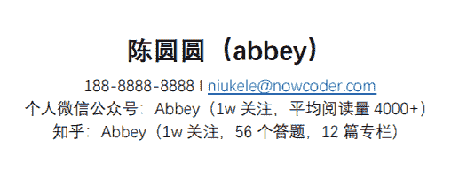
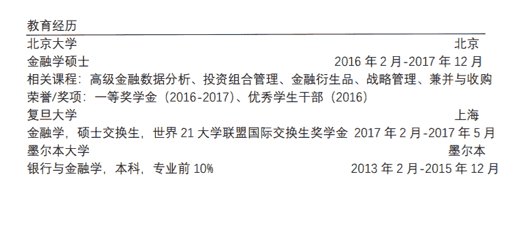
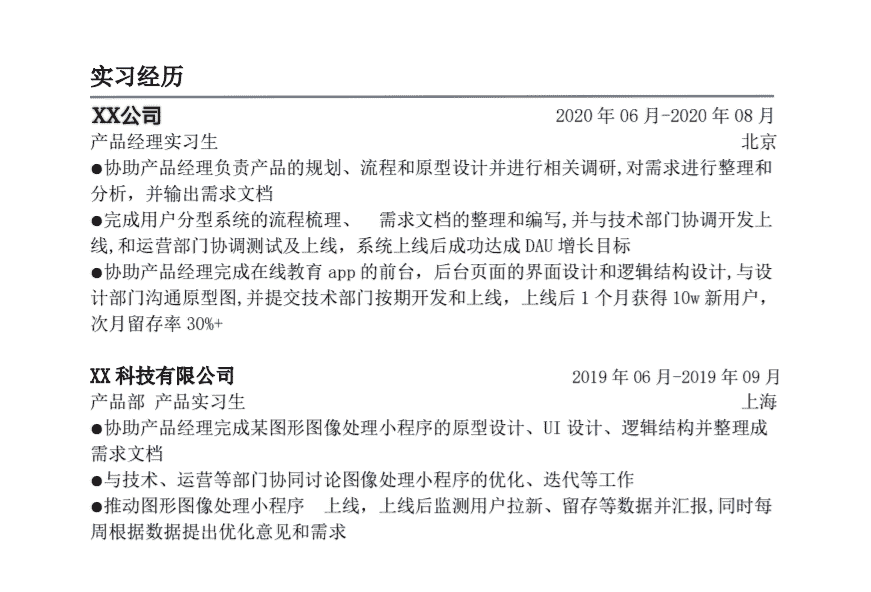
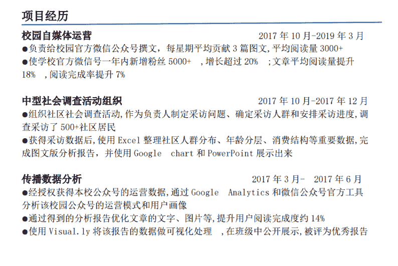
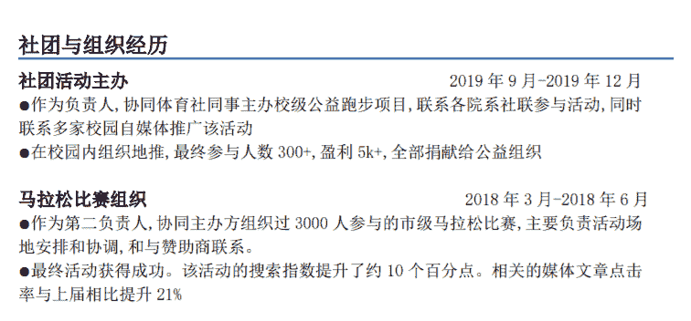
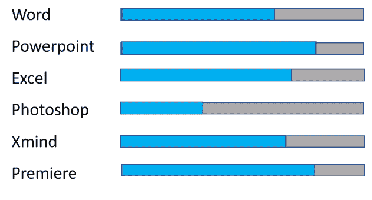
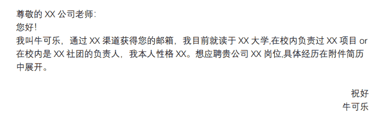

# 简历攻略

#  大二、大三的同学，是否已经计划好投递哪些公司的哪些岗位？是否已经开始复盘校园经历，制作简历了？

21 届的同学，今年秋招是否已有 offer 了呢？如果还没有，先不要气馁，沉下心来，分析原因，到底是败在了简历这一关，亦或是笔试这一关，还是面试这一关。冷静分析和总结并对症下药才是最好的解决办法。好的简历是求职成功的一半。

相信大家可能都有过这样的经历：与同学投递相同的岗位，并且各项经历比对方多很多，而且更匹配，为什么却卡在了简历筛选环节？

下面将帮大家正式梳理疏通，写出一份完美的简历。

### 1 确定职业方向

首先大家需要明确自己未来想从事什么样的工作。

确定好个人职业发展方向后，可以去搜集相关行业/岗位的公司信息，瞄准 3-5 家意向公司。

然后到这些公司的官方招聘网站上找到相关的岗位，仔细研读岗位要求，提炼出共通点，这往往就是该岗位的基本技能要求，根据岗位要求，有针对性地制作简历，才能提高成功率。

**简历并不是过往经历的堆砌，而是用人单位评判你的最初依据，所以必须要重视起来。**

### 2  如何打造一份优秀的简历

完整的简历需包括：**基本信息+实习经历+项目经历+校园经历+掌握技能**。

在简历中要合理排布这些信息，从上到下依次为：基础信息、教育经历、实习经历、项目经历、社团与组织经历、技能、自我评价等。

**1****、****基础信息即个人信息：包括但不限于姓名+手机号+邮箱地址 **

这部分建议同学们加粗并居中填写，与其他模块区别开来，让 HR 可以在打开你的简历后第一时间找到你的联系方式。如果有成熟的作品和个人账号也可以放在个人信息中展示，方便 HR 网上搜索、查看。

关于邮箱，同学们一定要注意关闭邮件拦截功能，避免笔试、面试等通知邮件被拦截，无法及时收到招聘消息，从而错过心仪的公司。

关于照片，建议大家放一张干净大方的证件照，如公司有生活照的需要，也要选择自然简洁的照片，避免使用过度美颜的照片，要知道干净舒服的照片是增加 HR 好感度的秘密武器。

**2****、****教育经历**

同学们可以从最高学历写起，如果是硕博，需要写本硕博的院校，如果是本科，就写本科院校即可，如果你有交换生等亮眼的经历，建议也写上。但是切记教育经历尽量不要超过三条，以免占据过多篇幅，喧宾夺主。

基本格式：**学校+专业+就读及毕业时间+绩点+相关主修课程+荣誉/奖项**

同学们要注意把最高学历放在第一位；如果应聘岗位与所学专业没有相关性，可以不写主修课程。

**3****、****实习经历**

实习经历是简历中的重中之重！

调查显示，用人单位更偏向于选择有过相关实习经验的学生！但是如果实习经历写不到重点，泛泛而谈，不能够体现出你的优势，那么再优秀的实习经历也是无意义的。

**（1）基本格式**

XX 公司、职位、实习的起止时间、工作内容、获得成果

**（2）实习经历不是写得越多越好**

简历中放 2-3 段相关实习是最好的。需要注意的是，简历中的实习时间不要太短，如果每段实习都是 1 个月左右，会成为你的减分项。最好有一段 2-3 个月以上，比较有竞争力的实习经历。这里要强调的是，实习经历尽量选择与岗位匹配度高度写，例如：肯德基兼职的暑期工这样没有含金量的经历不需要往上写，如果你要应聘的是产品经理这一个岗位，那么某公司客服的工作经历就不要写。因为这样不仅没有展现出你的优势，反而降低了简历匹配度，还会让面试官更加慎重地考虑你是否适合这个岗位，是十足的减分项。

**（3）用 STAR 法则来写工作内容**

实习经历之所以重要，是因为面试官希望通过你的实习经历，了解你专业能力、学习能力以及工作能力，以便更好地评估你是否适合这个岗位。工作内容的描述可以用【**动词+内容+方法+结果****】**的方式分点来写。同学们要注意，分点描述工作内容，不是写自我总结。

正确示例如下：

**4、****项目经历**

很多同学因为课业繁忙，在校没有相关的实习经历，这是不是就意味着在招聘中失去了核心竞争力了呢？并不是！把握好项目经历和校园经历的撰写也可以为你打开心仪公司的面试大门！

很多应届毕业生都是没有工作经验的小白，公司面试官在挑选简历的时候会更倾向于选择有相关项目经历或者校园经历的同学。举个例子：应聘某互联网公司的品牌策划，没有相关实习，但是在大学期间曾经带头成立小组做校园文化手办，运营公众号，负责校园品牌宣传等工作，并参加了大学生创新创业大赛，获得了奖项。或者有运营自媒体账号，拍摄、剪辑短视频的经验。这些都是项目经历！好好把握，重点包装，你的简历将会在万千应聘者中获得独一无二的核心竞争力。

需要注意的是在项目经历撰写中，重中之重仍然是岗位匹配，同学们一定要注意岗位要求梳理，避免遗漏重要信息。例如：某中文专业的同学应聘某公司新媒体编辑岗位，在项目经历中只列出了曾经发表的文章，投递之后才想起来该岗位需要应聘者掌握剪辑视频的技能，这就很可惜了。

如果有相关作品集的同学，建议可以使用网盘等形式储存，并以 pfd 的格式，附件的形式与你的简历一同投递。

项目经历写法示例如下：

 

对于应聘技术岗的同学，写项目经历的时候也有一些地方需要注意。

**（1）项目经历不要只写产品功能，重点要写自己使用的技术**

如果使用了算法，就要讲用了 xx 算法后，与其他 xx 算法比较有什么提高，达到了什么目标。

例如：我通过 xx 算法，解决了 xxx 任务中 xxx 问题，xxx 结果数据显示有 xxx 的提高/改进。

如果没有用什么牛的算法就总结写通过 xx 组件，xx 开源库实现了 yy 功能，最终熟悉 zz 的 sdk、框架、开源库等。

如果学得不好的那就写自己写了 xxxxx 行代码，熟悉了设计模式，标准类库之类的。

例子：

有个同学写了下面的项目经历：

2015.03 - 2015.04iunClub 新闻站 PHP 程序员

1、构建服务器端，爬取各大网站的 RSS 数据并存储数据库。

2、构建客户端，解析数据库返回的数据。页面设计由其他成员负责

修改后：

1、通过 Python 的 urllib2 和 HTMLParser 实现爬虫的基本功能，对爬取页面解析后的结果通过敏感哈希算法来去重，最终通过 pymysql 把新闻内容存储到数据库。

2、通过采用多线程，多代理模式手段优化系统提高爬取速度，最终达到单台服务器每天爬取有效的 xxx 个页面。

**（2）学会用实际数据体现自己的成果**

数据是最能直观体现项目成果的方式，如果一段经历，没有任何数字，要么说明这个工作只是执行或完成了，没有关注结果；要么说明对数字不敏感，缺乏优化和思考的过程。这两者在求职过程中都是硬伤。

举个简单直观的例子

1、我通过 xx 算法，解决了 xxx 任务中 xxx 问题，结果数据显示较大的提高/改进

2、我通过 xx 算法，解决了 xxx 任务中 xxx 问题，xxx 结果数据显示有 xxx 的提高/改进

很显然，第二个描述相比第一个能让别人更直观地了解优化的效果，同时也会增加这段经历的可信度。

看到这里有同学会问，我做项目的时候没有统计过这些数据，那我能不能随便编一组数据？在这里建议大家不要抱着侥幸的心理，数字与数字之间是可以交叉验证的，面试官比你想象的更加聪明细致，要编一组不被面试官察觉的数据可没那么容易，还是老老实实复盘一下项目经历，把需要展示的数据都计算一遍。

**（3）不需要长篇大论地介绍技术原理**

有的同学生怕面试官不清楚这个技术、在描述项目经历的时候会花费大量篇幅介绍技术的原理，其实大可不必。且不说面试官非常有可能了解你写的技术，即使不了解，他也不会有兴趣在面试的时候看你写的原理介绍，他不是来上课的，是来招聘人才的。因此面试官关注的重点不是这是一项什么技术，而是你怎么攻克难点实现这个技术，通过这项技术实现了什么。

**5、****校园经历**

很多同学在学校学习的过程中，积极参与校内活动，没有个人项目经历或者实习经历，那也没有关系，列出你参加过的校园活动，仔细梳理，依然可以成为你的简历亮点。校园经历是体现你领导力的重要模块。注意要通过你的工作量和成果来表现你的工作能力。即具体+量化，具体描述工作内容，量化工作成果。

示例如下：

**6、****掌握技能**

应聘哪个岗位，一定要具备其相关技能。你可以通过简历告诉面试官你都掌握了哪些相关的技术。 注意“了解”、“基本掌握”、“熟练掌握”和“精通”的区别，注意词汇上的应用。防止过于夸大而适得其反，毕竟面试的时候，面试官跟你交流的谈资就是你的简历，简历上写的所有内容，都有可能会被问到。虽说技能掌握这块看似很快就能写完，但是这部分的坑可不少，大家要注意以下几点：

*   **把握技术名词****列举****的数量**

应聘技术岗的同学，在描述掌握技能的时候往往习惯罗列多一些技术名词，想着技术名称越多，越能体现自己的知识储备。其实并非如此，面试官清楚地知道大学 4 年，或者大学+研究生 7 年，一般的同学所能掌握技术的广度和深度，过多地罗列技术名字，除了有夸大之嫌外，还会让面试官认为，你对技术的认知比较片面，基本处于了解阶段，没有 1-2 个熟练掌握甚至精通的技术。

其实技术的学习贵精不贵广，精通 1-2 个技术比了解几十个技术更难能可贵。因此当你发现自己在罗列技术名词的时候，不妨给自己掌握的这些技术排个序，优先罗列自己真正从原理到应用都清晰掌握的技术。

*   **描述要清晰明了，****不要****使用****过****于花哨、含糊不清的表现方式**

有的同学为了追求样式美观，会采用图形的形式去表达自己掌握技能的程度，进度条就是最常见的了。这样一来，样式确实很美观，但是面试官看了之后会不明所以，无法通过进度条进行量化，清晰地表明你各项技能的掌握程度，下面这个例子，我相信大家看了，也无法判断这位同学各项技能的掌握程度。

所以，尽量用文字表达的方式，清楚地描述你掌握技能的程度，不要让面试官有所疑惑。

**7、****其他****注意事项**

（1）简历排版整齐有序、主次突出（该加粗的字体加粗）。

（2）中文始终保持一种字体，英文始终保持一种字体。英文部分注意大小写，比如 O2O 而非 020 。

（3）简历模板简单不花哨，慎用图标、进度条等附加元素。

（4）简历字体不要使用过多的颜色，1-3 种即可。

（5）简历内容安排合理，描述调理清晰，分点论述，标点符号使用正确，谨慎使用了解、熟悉、精通等词汇。

（6）不要造假，同学们要切记，简历美化不是造假。使用造假简历进入工作岗位，一旦被发现，用人单位将永不录用。简历美化也要掌握度，一个月的实习经历，洋洋洒洒一大篇产品功能，让人一看就不是你的实习成果。

（7）简历尽量压缩简历到一页，如果超过一页，可以根据各个模块的重要性优先级进行删减，各模块重要性优先级如下：实习经历>完整项目经历>比赛获奖>学校内获奖>社团工作>班长支书>自我评价>兴趣爱好。

（8）使用 PDF 投递简历，不要使用 word，避免出现 word 文档打开乱码，或者格式错乱的情况，绝大部分公司秋招只允许投递一次，机会珍贵。不要因为自己的一时大意或者偷懒，错失了机会。

（9）简历命名：姓名+求职意向+电话号码，简历命名很重要，在命名中写清楚应聘岗位会方便 HR 筛选归类，如果是 985/211 毕业的，可以把毕业院校写上，这是加分点。例如：牛可乐-后台开发实习生-清华大学。

（10）邮箱投递需要写开场白，如果是邮箱投递，切忌什么都不说，只发一个附件，HR 一天会收到成百上千的邮件，对于这类无内容的邮寄 HR 基本是不会花时间下载打开的。为了提高自己的简历被打开的概率，你要让 HR 感受到你的诚意，需要在邮件中进行自我介绍，自我推荐以及表明你发邮件的目的。

例如：

