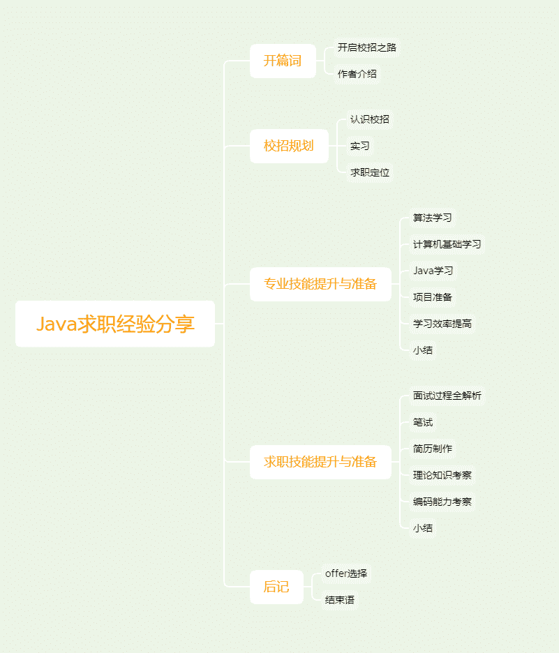

# 第一章 第 1 节 开启校招之路

> 原文：[`www.nowcoder.com/tutorial/10056/8205e0b7c098465b911b5318f2def849`](https://www.nowcoder.com/tutorial/10056/8205e0b7c098465b911b5318f2def849)

# 开启校招之路

## 1\. 校招路上的重重阻碍

### 1.1 心态难以调整

在刚踏上校招之路时，大多数人对校招只有一个模糊的认识，只觉得应该好好复习然后到了时间就去参加笔试和面试。人们在需要去做一件自己不了解，又觉得对自己意义重大的事情时，往往会变得焦虑，并且经常会选择逃避的方式，不去面对这件事，以为这样就能摆脱那种焦虑情绪。

但越是逃避，就越有负罪感，觉得自己已经落后于别人，生怕来不及复习找不到工作，焦虑感就更加强烈，从而陷入一种恶性循环之中。

### 1.2 没有明确的学习路线

假设你是一个自制力较好的人，能控制自己在合适的时间做合适的事情，而不是沉浸于完成那些简单而又轻松的事情所带给你的快速满足感。或者你已经调整了心态，下定决心要认真对待校招这件事。但另一个问题又来了，准备校招应该学习什么知识？要学到什么程度才能找到满意的工作？

也许你会找出一本本学校的计算机教材，但很快你会发现越是复习，就越觉得自己有很多知识没掌握好，往往又开始有了焦虑的情绪。

在学校我们还能盼着老师在考前能画画重点，然后花一两天背一背，考个好成绩还是挺容易的一件事情。但是校招没有严格定义这种考纲，每个公司喜欢考察的知识点都不相同，甚至同一个公司不同面试官的出题风格都可能完全不同。比如一个面试官之前参加过 ACM 比赛，那么他可能会问你一些比较巧妙的算法问题。又比如一个面试官最近正好在开发一个新的产品，使用到的技术都需要认真调研才能使用，他可能更喜欢问你一些技术的使用问题，比如为什么要使用这个技术而不是另一个技术，这两个技术有什么优劣和使用场景等等。

可以看到，面试问题五花八门，所以你要掌握的知识也需要非常全面。在刚开始复习时，是很难理清楚这么多知识点，更不用说把这些知识点都理解清楚从而构建起自己的知识体系。

这时候很多人会做的一件事情是，打开百度或者 Google，搜索“Java 面试题”这种内容。很多文章会给出看上去很全的面试题库，然后你开心地觉得按照这些文章来复习就没什么问题了。

但很快你就会发现，理解这些文章提供的面试题解答非常吃力。你觉得是因为这篇文章写的不好，然后又找了几篇看上去写的很到位的文章，继续从第一个问题开始看起。但看着看着那种熟悉的感觉又来了，很多问题还是看不懂。

这是因为看懂这些内容需要你具备很多前置知识，而这些零散的面试题大全基本不会考虑你能不能理解。因此，想要通过背这些所谓面试题来快速复习不是很有效的方法。

当然对于那些已经具备完善的知识体系的同学来说，阅读面试题库是可以比较高效地了解面试主要考察的内容，然后可以再找相关资料继续深入阅读，不会有很多理解上的困难。

但对于基础较为薄弱的同学，有没有一个比较合适的学习路线能让他们快速掌握校招所需要的知识点？并且有没有相关的学习资料能更高效地进行学习呢？

### 1.3 面试经验难以积累

好了，假设现在你已经准备得很充分，又收到了自己心仪公司的面试邀请。这是你的第一场面试，之前没参加过任何面试。

面试前几分钟，你等着面试电话，你能感觉到自己的手在不自觉地发抖，呼吸也有些急促，生怕忘记背了很多遍的知识点，也害怕有说错的地方让面试官觉得你很水平不够，从而失去这次难得的机会。

面试开始了，面试官让你先自我介绍，你按着准备好的内容读了一遍。然后面试官开始问你几个看上去挺常问的面试问题，你把你记得的内容说了一遍，后面的问题也基本是面试官问什么你回答什么。

但是面试官突然问了一个你只是简单看过的内容，你想了好久没想起来，后悔当时没好好看。然后你结结巴巴地说这个内容还没怎么看，面试官说没事可以随便说说，但是你现在只想让面试官跳过这个问题再问那些你已经掌握的内容。你开始着急了，心里已经在想这次面试一直问这个问题，自己又回答得不好，一定要挂了。然后你开始说得不清不楚，而且毫无逻辑。面试官听完你讲的内容后，说差不多了，随后简单问了几个“你对 XXX 熟不熟悉”这种问题，没有做更深入的提问。最后说面试得差不多了，感谢参加本次面试。

上面的面试过程至少存在三处问题，不知道你能找出几处。对于一个没有面试经验的人来说，即使准备得很充分，但没办法在面试中有良好的表现。就好比你已经具备了得 90 分的实力，但因为经验不足只发挥出了 60 分的水准。面试经验除了多参加面试之外，有没有更好的方式去积累呢？

## 2\. 学习本专刊你能收获什么

在上一节提到了校招路上的重重阻碍，总结起来有三点：

1.  心态难以调整，容易陷入焦虑情绪；
2.  很难找到合适的学习路线和学习资料，从而高效率学习；
3.  面试经验难以积累，从而无法发挥出自己应有的实力。

本专刊会帮助你克服上面提到的三个困难。首先，本专刊会帮你理清学习路线以及学习资料，也会给出一个学习大纲，这份大纲能涵盖百分之八十的面试常考知识点，而你只需要花百分之二十的时间就能掌握。其次，本专刊会提供一些学习方法和心态调整方法，让你摆脱焦虑，真正行动起来。再次，本专刊会带你解析面试的各个环节，让你在面试中更加游刃有余。最后，本专刊也会回答一些跨专业复习、Offer 选择等常见问题。

本专刊是我经历了长时间的复习和面试所积累的经验，这些经验都是通过不断试错总结而来，最终让我拿到了 BAT 等 Offer。对你来说不必像我一样花这么多时间去试错就能学到这些经验，从而帮助你在校招路上走得更加畅通无阻。

## 3\. 本专刊适合哪些用户

我在刚开始复习时算是一个小白，感觉所学的知识只能应付学校的考试，让我去面试会很没底气。应该说绝大多数人在找工作 的时候和我的情况类似，你在网上感觉有很多厉害的人只是因为幸存者偏差，其实刚开始复习水平就很高的人不是很多。所以我对基础薄弱找工作有比较多的经验，如果你觉得自己基础薄弱又无从下手，相信本专刊能对你有所帮助。

如果你感觉自己水平还不错，想看看面试会考察哪些内容，再重点对这些内容进行复习。又想知道怎么让自己在面试中更能发挥出自己的水平，那本专刊也能在这些方面帮助到你。

综上，本专刊适合以下用户：

1.  基础较为薄弱，想要找对学习方向；
2.  复习时间较短，希望在短时间内能达到面试要求；
3.  面试经验不足，想要在面试中有更好的表现。

## 4\. 专刊大纲

