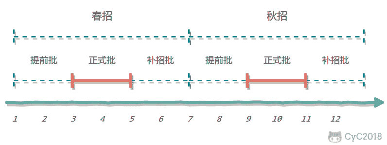
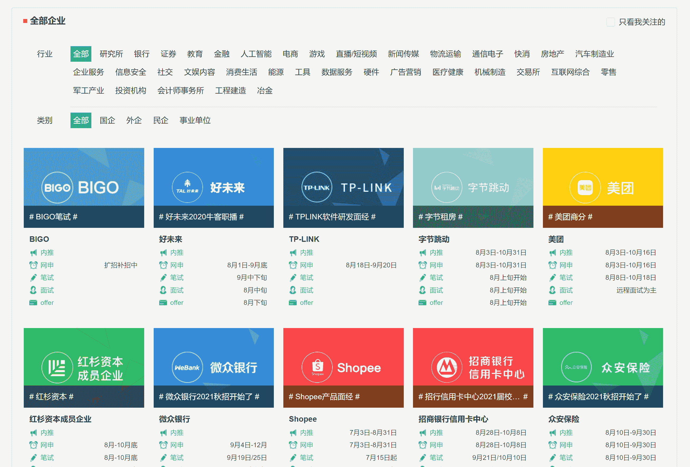
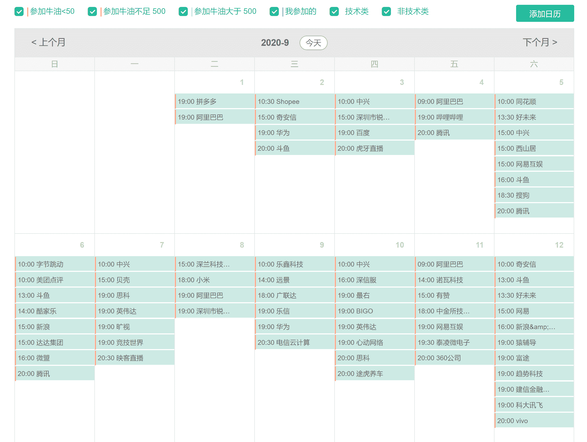
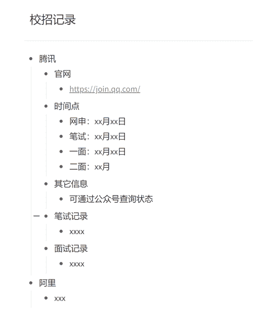
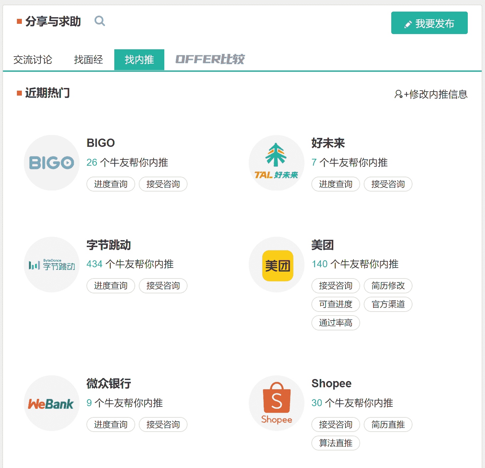
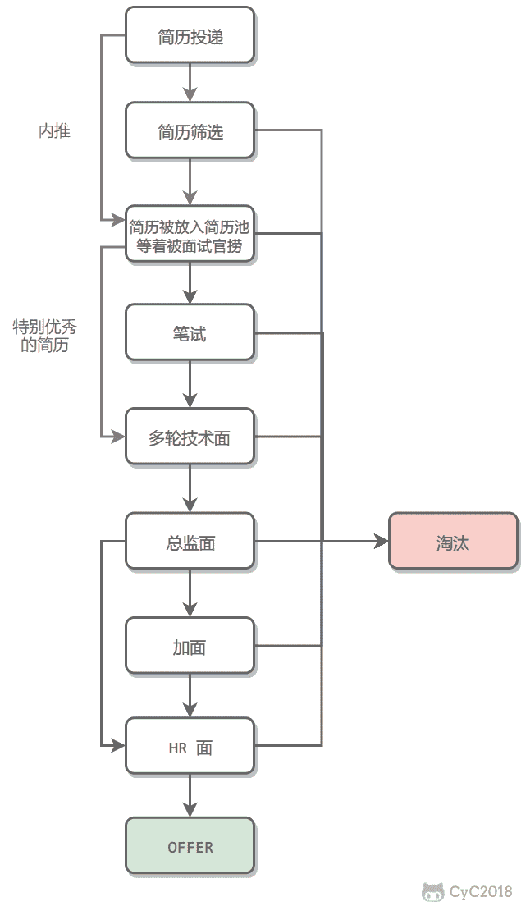

# 第二章 第 1 节 认识校招

> 原文：[`www.nowcoder.com/tutorial/10056/a06b3203006a4d458b80053f55640b8f`](https://www.nowcoder.com/tutorial/10056/a06b3203006a4d458b80053f55640b8f)

# 认识校招

## 1\. 招聘时间节点

很多人在开始准备校招时，会很担心时间上来不及，总感觉自己的进度比别人落后了很多。其实校招最关键的不在于什么时候开始准备，因为校招的时间跨度很大，有足够多的时间进行复习，即使秋招正式批没能拿到满意 Offer，补招批和来年春招一样有机会。应该牢记一点，决定你能否拿到 Offer 的关键因素并不是什么时候投简历，而是自身的能力是否已经达到要求了。所以踏踏实实地复习，在你觉得自己还没准备好的情况下最好不要盲目乱投简历。

除了踏踏实实地复习，也需要了解一下校招的关键时间点，做好复习规划。最好能在校招正式批复习到位，否则越往后 HC（Head Count）会越少，也会影响到你的应聘。

应届生应该关注两个招聘时间节点：春季实习招聘和秋季校园招聘。春季实习招聘的主要时间是三四月份，秋招校园招聘是九十月份，所以有金三银四，金九银十这些说法。需要注意到，很多公司会提前开始招聘来抢人，所以招聘时间点会越来越早。

无论是春招还是秋招都有提前批，它比正式批提前一两个月。很多公司在提前批阶段能够免笔试，但要求简历比较优秀。提前批的招聘要求可以参考 [牛客网 2021 届秋招·SP 招聘专场](https://www.nowcoder.com/activity/2021sp/index)。

而且提前批会占去较多 HC，特别是核心部门。所以如果你已经把校招知识点都复习地差不多了，并且对于面经中的题目都很有把握能回答好，那么非常建议参加提前批。但是对于没准备好的同学就不一定参加了，因为每个公司基本都有面试记录，提前批面试表现不好的话可能会影响后续的招聘。而且有些公司提前批挂了，后面的正式批就不让参加，所以要谨慎。应该要明白提前批是留给已经准备好的同学，没准备好就安心地继续复习吧。如果你在这些时间点之前就看到了这个专刊，那么恭喜你已经比别人领先了一大步！

正式批之后是补招批，它比正式批晚一两个月。补招批也有一定的 HC，只要有人毁 Offer 就会放出新的 HC。但并不是说有多少人毁 Offer 就会放出多少 HC，因为每个公司都会根据往年的发放 Offer 和接受 Offer 比例来确定今年要发多少 Offer。

不同公司的具体招聘时间不同，但主要还是集中在三四月份和九十月份，前一两个月是提前批，后一两个月是补招批。招聘时间节点大概如下：

应该注意到 7~8 月就是秋招提前批，但是这个时间是大部分人参加暑假实习的时间，正好冲突了。很多人是一边参加实习一边准备提前批，工作任务和复习任务都要兼顾的话会比较累。所以建议提前一个月实习，如果能在 6~7 月份实习的话，8 月份开始准备提前批会比较刚好。如果在秋招的补招批还没拿到满意 Offer 的话，也可以参加来年的春招。再之后就要以社招生的身份参加秋招，没有工作经验的话很难去和其它社招生竞争。建议在秋招正式批或者补招批至少拿到一个保底 Offer，如果不满意的话再冲刺春招，不然会有比较大的风险。

## 2\. 招聘信息来源

首先推荐一下牛客网的校招日程功能，能知道有哪些公司在招聘，以及大致的时间节点。招聘的具体时间节点，以及招聘的岗位等信息可以直接去对应公司的校园招聘官网进行查找。

如果你有明确的几家意向公司，也可以直接关注这些公司的校园招聘官网，或者对应公司的招聘公众号，这样就不用关注其它无用信息。

笔试的信息同样可以使用牛客网的笔试日历功能，支持预约订阅提醒能力，避免因为参加了太多场笔试而变得慌乱。

除了使用牛客网的笔试日历来管理笔试之外，可以自己维护一个文档来记录校招的笔试面试信息。人们在需要同时做很多事情时会变得焦虑不安，没办法专注于当下在做的事情，因为会一直想着这些事情还没做完。如果把这些事情记录下来，并且加上做这些事情的时间，就会给自己一种暗示，好像这件事已经做好了，这样就可以安心做其它事情了。所以把笔试面试信息做记录很重要，可以让你更加从容，也更好地根据笔试面试时间点去做复习安排。

例如，可以像下面这样将招聘相关的各种信息和时间点进行记录。

## 3\. 内推

不同的公司内推作用不同，基本上能免简历筛选，直接把简历放到简历池等面试官捞。对于特别优秀的简历，被面试官捞了之后可以免笔试直接参加面试，如果没被捞的话也可以直接参加后面的笔试。

最好找认识的学长学姐要内推，因为能帮你查应聘进度。如果没有学长学姐的话，也可以在牛客网的内推广场找内推信息。

总得来说，内推并不是那么重要，最重要还是个人的能力是否达到招聘要求。你可以认为，内推只是公司让员工更有积极性找人来应聘的一种手段，并不会因为你被内推了就给你降低面试难度。

## 4\. 笔试面试与录用

面试通常是在笔试之后的几天内发起，然后持续一段时间。持续时间和形式根据不同的公司会有很大不同，甚至同一个公司不同批次也会有很大不同。下面列举一些我在 18 年校招参加的公司的面试形式和持续时间：

*   百度：实习招聘正式批是三轮远程视频技术面试，使用牛客网的远程面试工具，提供编辑器，算法题居多，通常是一天内完成，如果时间比较晚了会安排在第二天；校园招聘正式批是现场面试，分地区进行，不同地区时间不同，三轮技术面试，一两天一场。
*   阿里：提前批是电话面试，几天一场，具体轮次根据面试表现决定。正式批是视频面试，使用阿里自己的招聘系统，可以共享屏幕，两轮技术面一轮 HR 面。
*   腾讯：正式批是现场面试，一轮技术面，一轮总监面，一轮 HR 面，一般间隔一两天。面试表现好会有加面。
*   头条：正式批是三轮远程视频面试，使用牛客网远程面试工具，三轮技术面通常在同一天内进行，可能会有加面。加面通常分为两种情况：一是面试表现很好可以评 SSP，二是不同面试官对你的面试表现评价差别过大，再加一场面试决定是否录用。

参加完所有面试之后，也要等非常长的时间才能得到录用结果，所以做好持久战的心理准备。如果等面试结果等得实在受不了，可以在牛客网上找一些抱团取暖等 Offer 的群，了解一下别人是否录用。

## 5\. 小结

提升自己是影响你能否拿到 Offer 的关键因素，但也要关注校招的时间节点，这样拿到满意 Offer 的几率就会大大提升。

除了有效收集招聘信息外，自己也要将各种招聘信息进行整理和记录，从而做到有条不紊。

内推不能让你的面试更顺利，但能更好地知道面试进度。