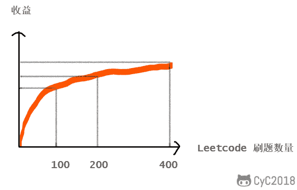
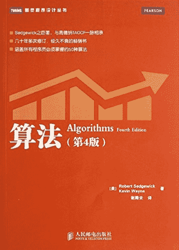

# 第三章 第 1 节 算法学习

> 原文：[`www.nowcoder.com/tutorial/10056/a2727ca594794675ab8227b6cde443a6`](https://www.nowcoder.com/tutorial/10056/a2727ca594794675ab8227b6cde443a6)

# 算法学习

## 1\. 重要性

无论是在笔试环节还是面试环节，算法知识在校招中基本都可以排在第一重要的位置，国内互联网公司近几年越来越喜欢考察算法知识。

但算法知识学习的周期很长，以我的学习经历为例，我每天大概刷两三道 Leetcode，刷到四百道 Leetcode 大概花了大半年时间。看到这里相信很多人会觉得时间不够了，但其实你不用像我一样花这么多时间，也能够把算法知识准备好。

从我个人的经验来看，刷 Leetcode 对校招 的收益如下图所示。可以看到刷的越多收益增长的越小，刷 200 题左右就足够应对大多数互联网公司的校招。

而且刷题刷多了就会发现很多题目的解题思想类似，所以题目刷到一定数量后，刷题所需要的时间就会越来越少。

当然校招对算法的要求不仅仅体现在编程题，也要求分析常见的算法理论知识，因此也需要准备这些理论知识。

## 2\. 学习路线

对于一个刚开始接触编程的同学来说，学习算法是非常好的起点。这是因为算法编程题都是一道道比较有挑战的题目，并且能在一定时间内求解，从而快速获得一个正向的反馈，让你体验到编程带来的成就感，并让你更有兴趣继续学习编程相关的知识。

而且挑战编程题也是非常好的实践机会，它能帮助你更好地掌握编程语言的用法，以及开发工具的使用。

建议先在 Leetcode 上按照 Acceptance 筛选出二三十道简单难度的编程题，进行实践。如果一开始直接接触算法理论知识会觉得很枯燥，降低学习兴趣。而在实践之后，那些刷题过程中遇到的搞不明白的算法思想，会让你在潜意识中觉得这些知识有用，从而能更主动去获取这些知识，而不是被动地学习。

最适合入门算法理论知识的书籍是《算法》，在 Coursera 上有配套视频可以观看：[Algorithms, Part I](https://www.coursera.org/learn/algorithms-part1)。这本书是我第一本认真学习的书籍，让我对编程产生了兴趣，因此极力推荐这本书。如果想在短时间内掌握的话，书中的证明、以及一些深入扩展性内容可以先跳过不看。当然，牛客网的算法课程也涵盖了校招所需要的知识，可以一起学习。

除了在 Leetcode 刷题，也推荐 [牛客题霸](https://www.nowcoder.com/ta/job-code-high)，一共一百多道高频算法题，把这些题目刷完也差不多足够了。

## 3\. 知识清单

### 3.1 编程题

编程题大致的分类：双指针、排序、贪心思想、二分查找、分治、搜索、动态规划、数学、链表、树、栈和队列、哈希表、字符串、数组与矩阵、图、位运算。

每个分类都要刷一定数量的经典题目，对于链表、树等经常考察的内容，可以多刷一些。

### 3.2 理论知识

*   排序：大部分要求能手写，并分析时间空间复杂度，以及稳定性；
*   树：红黑树的原理以及在 JDK 的使用；B+ 树以及在数据库索引中的使用；
*   图：拓扑排序；并查集；最短路径；最小生成树；
*   散列表：实现原理，以及在 JDK 中的使用；
*   字符串：KMP；AC 自动机；Trie 树。

## 4\. 刷题方法

在刚开始刷 Leetcode 时，很多人只有在看完答案才知道要怎么做，如果不看答案的话完全没有思路。这是非常正常的现象，并不表示你的思维能力比别人差。人类最擅长的学习方式是模仿，刚开始刷题的时候，看看别人怎么做是很正确的做法，模仿多了自然就会做了。

刷 Leetcode 也有两种流派：龟派和兔派。龟派每道题都要想很久，而且尽可能想出多种解法。兔派是想一会儿就看答案，这样就可以很快地刷题。龟派比较适合思维锻炼，而兔派比较适合短期内快速提高并记忆。如果只是为了应对校招的话，比较推荐兔派这种刷题方法，因为校招确实很依赖于短期记忆。

选择兔派这种方式的话，就需要反复地进行复习，从而保持记忆并增加理解。

但是也不能完全采用兔派这种方法，因为如果习惯于不去思考怎么做的话，会养成惰性的思维方式。

当你刷题到一定程度的时候，最好每天再刷一两题保持题感。可以选择你之前做过的题目，因为再做一遍的话可以很快做出来，这样子就可以让你对刷题这件事保持积极的一种心态。

## 5\. 算法对工作来说重不重要

很多人都在说，工作中基本用不到数据结构和算法知识，学不学无所谓。

如果每天都是在写业务代码的话，那确实不怎么需要这些知识。但如果你对自己有更高的要求，希望能多学习一些技术来保持自己的竞争力的话，那么数据结构和算法知识对你来说就非常重要。

数据结构和算法是编程中很重要的一部分，如果没有这些知识的话，在编程时会经常不知道要怎么去实现一个很简单的功能。而且数据结构和算法也是其它技术的实现基础，要理解这些技术的实现原理就必须学习数据结构和算法。