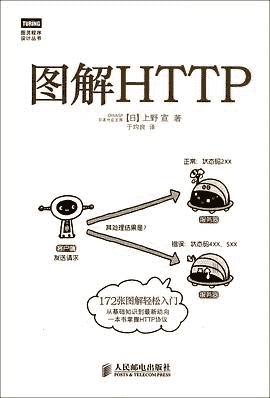
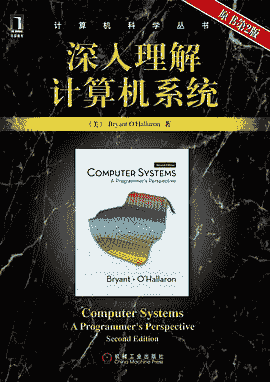
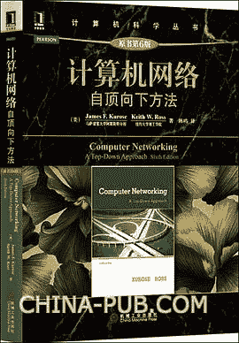
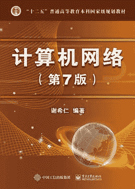
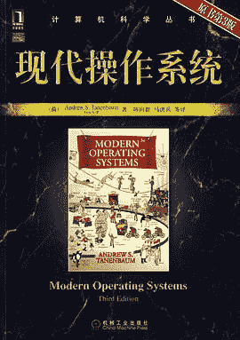
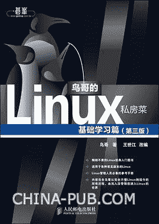

# 第三章 第 2 节 计算机基础学习

> 原文：[`www.nowcoder.com/tutorial/10056/e4a6cfd3aba846aca25531f9b2af213e`](https://www.nowcoder.com/tutorial/10056/e4a6cfd3aba846aca25531f9b2af213e)

# 计算机基础学习

## 1\. 重要性

校招面试非常注重计算机基础知识的考察，主要是因为计算机基础知识是学习其它计算机技术的基石。而且计算机基础知识的掌握情况能反映一个人的学习能力，学习能力是各大公司都非常看重的一项能力。

如果你想应聘一二线互联网公司，那么计算机基础知识必须掌握地非常到位，每个知识点都要理解透彻。如果担心时间来不及，想先拿到保底的 Offer，那么可以先把一些常问的问题准备一下，也足够应对大部分公司的面试。

## 2\. 学习方法

计算机基础知识会让人感觉是一座大山无法逾越，从而产生畏难心理，觉得学习起来非常困难。

如果你学的是计算机相关的专业，之前学过计算机相关的课程，那么不用花太多的时间就能把常问的问题过一遍，之后再慢慢地针对每个知识点进行深入理解。

如果你是跨专业的同学，计算机理论基础比较薄弱，面对一本本计算机教材感到无从下手。我建议还是从计算机教材开始学习，但不需要从头到尾看完，而是多找几本，每一本都只看前两章。这样做能让你快速建立起比较清晰的计算机基础知识体系，在学习一个还没看过的内容时，也能大概知道是怎么一回事。这种方法对于学习其它刚接触的领域也很有效。

学习计算机基础知识主要以书籍为主，以网上的文章为辅。这是因为书籍的知识体系比较全面，也会循序渐进地对知识点进行讲解。而网上的博客文章会突然冒出很多你不理解的概念，也不会考虑你能不能看懂。在你觉得自己的知识体系比较完善的情况下，可以针对性地用谷歌找一些博客、官方文档、专业文献，来提高你对某个知识点的理解程度。

## 3\. 知识清单

面试考察的基础知识多而杂，要完全掌握需要花费大量的时间和精力。但是面试中经常被问到的知识点却没有多少，你完全可以用 20% 的时间去掌握 80% 常问的知识点。我将这 80% 常问的知识点整理出来，方便大家快速地掌握。这些知识点也标注了重要程度，从而让大家可以根据知识点的重要程度去制定学习计划。

### 3.1 操作系统基础

*   ★★★ 进程与线程的本质区别、以及各自的使用场景。
*   ★☆☆ 进程状态。
*   ★★★ 进程调度算法的特点以及使用场景。
*   ★☆☆ 线程实现的方式。
*   ★★☆ 协程的作用。
*   ★★☆ 常见进程同步问题。
*   ★★★ 进程通信方法的特点以及使用场景。
*   ★★★ 死锁必要条件、解决死锁策略，能写出和分析死锁的代码，能说明在数据库管理系统或者 Java 中如何解决死锁。
*   ★★★ 虚拟内存的作用，分页系统实现虚拟内存原理。
*   ★★★ 页面置换算法的原理，特别是 LRU 的实现原理，最好能手写，再说明它在 Redis 等作为缓存置换算法。
*   ★★★ 比较分页与分段的区别。
*   ★★★ 分析静态链接的不足，以及动态链接的特点。

### 3.2 Linux

*   ★★☆ 文件系统的原理，特别是 inode 和 block。数据恢复原理。
*   ★★★ 硬链接与软链接的区别。
*   ★★☆ 能够使用常用的命令，比如 cat 文件内容查看、find 搜索文件，以及 cut、sort 等管线命令。了解 grep 和 awk 的作用。
*   ★★★ 僵尸进程与孤儿进程的区别，从 SIGCHLD 分析产生僵尸进程的原因。

### 3.3 基础

*   ★★★ 各层协议的作用，以及 TCP/IP 协议的特点。
*   ★★☆ 以太网的特点，以及帧结构。
*   ★★☆ 集线器、交换机、路由器的作用，以及所属的网络层。
*   ★★☆ IP 数据数据报常见字段的作用。
*   ★☆☆ ARP 协议的作用，以及维护 ARP 缓存的过程。
*   ★★☆ ICMP 报文种类以及作用；和 IP 数据报的关系；Ping 和 Traceroute 的具体原理。
*   ★★★ UDP 与 TCP 比较，分析上层协议应该使用 UDP 还是 TCP。
*   ★★★ 理解三次握手以及四次挥手具体过程，三次握手的原因、四次挥手原因、TIME_WAIT 的作用。
*   ★★★ 可靠传输原理，并设计可靠 UDP 协议。
*   ★★☆ TCP 拥塞控制的作用，理解具体原理。
*   ★★☆ DNS 的端口号；TCP 还是 UDP；作为缓存、负载均衡。

### 3.4 HTTP

*   ★★★ GET 与 POST 比较：作用、参数、安全性、幂等性、可缓存。
*   ★★☆ HTTP 状态码。
*   ★★★ Cookie 作用、安全性问题、和 Session 的比较。
*   ★★☆ 缓存 的 Cache-Control 字段，特别是 Expires 和 max-age 的区别。ETag 验证原理。
*   ★★★ 长连接与短连接原理以及使用场景，流水线。
*   ★★★ HTTP 存在的安全性问题，以及 HTTPs 的加密、认证和完整性保护作用。
*   ★★☆ HTTP/1.x 的缺陷，以及 HTTP/2 的特点。
*   ★★★ HTTP/1.1 的特性。
*   ★★☆ HTTP 与 FTP 的比较。

### 3.5 Socket

*   ★★☆ 五种 IO 模型的特点以及比较。
*   ★★★ select、poll、epoll 的原理、比较、以及使用场景；epoll 的水平触发与边缘触发。

## 4\. 学习资料

**《图解 HTTP》**

豆瓣 8.1 分，1669 人评分。

HTTP 是计算机网络中非常重要的部分，这本书使用大量图示讲解 HTTP 原理，通俗易懂。这本书涉及部分计算机网络基础理论知识，在学习计算机网络基础知识之前，可以先看这本书来快速入门。

而且 HTTP 也是我们日常上网会接触到的一个协议，比较熟悉，先学习 HTTP 能让我们更好地理解计算机网络的运行原理，以后再学习计算机网络基础理论知识的时候就不会觉得太抽象。

**《深入理解计算机系统》**

豆瓣 9.7 分，2211 人评分。

可以先看第一章，帮助你对计算机系统有个初步认识。以后在学完计算机操作系统理论知识后，再看第六章和第九章。在最后把其它面试知识点复习地差不多的时候，再看看第十章、第十一章、第十二章。如果想对计算机操作系统有比较深入的理解，再回来看看第七章和第八章。

**《计算机网络 自顶向下方法》**

豆瓣 8.9 分，297 人评分。

适合当做计算机网络理论知识的入门书籍，重点阅读前四章内容。

**《计算机网络》**

豆瓣 8.0 分，142 人评分。

这本书是大部分学校的教材，可以当做《计算机网络 自顶向下方法》的辅助书籍，结合着看。

**《TCP/IP 详解 卷 1：协议》**

豆瓣 9.2 分，1963 人评分。

TCP/IP 是计算机网络中最重要的一部分，对于某些面试高频知识点，建议阅读这本书的相应章节进行深入学习。

**《现代操作系统》**

豆瓣 8.9 分，656 人评分。

计算机操作系统理论知识的学习书籍，建议重点阅读：进程与线程、死锁、存储管理等章节。

**《鸟哥的 Linux 私房菜》**

豆瓣 9.1 分，2604 人评分。

Java 开发岗位对 Linux 的要求不会很高，但是也会有一定的要求。可以简单学习下 Linux 操作系统的使用，然后针对某些知识点重点学习下即可。

这本书适合当做 Linux 的入门书籍，通俗易懂，不过有些内容也有点逻辑，可以跳着看。