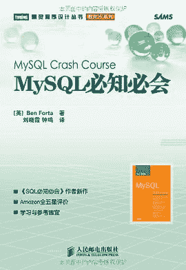
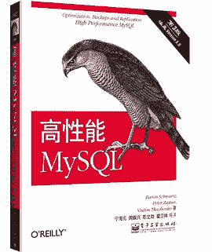
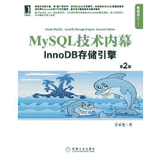
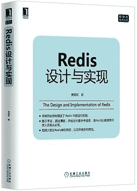
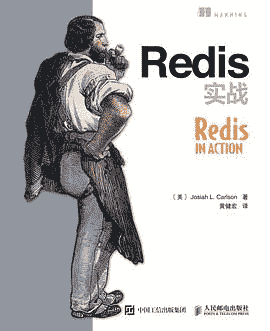

# 第三章 第 3 节 数据库学习

> 原文：[`www.nowcoder.com/tutorial/10056/a6b30e387b1346eb939c09382f0a1871`](https://www.nowcoder.com/tutorial/10056/a6b30e387b1346eb939c09382f0a1871)

# 数据库学习

## 1\. 重要性

大多数互联网应用都是数据密集型，而不是计算密集型。根据《数据密集型应用系统设计》一书的阐述，数据密集型是指数据的规模、复杂性、变化速率决定了系统的成败，而计算密集型则是 CPU 主频是系统的主要瓶颈。

在实际工作中，经常需要对使用的数据库进行选型，根据每种数据库的特点来选择最适合当前场景的最佳数据库。并且数据库的性能和稳定性也是日常工作中非常看重的一方面，因此数据库在开发过程中成为了非常关键的一个内容。

在校招中，一二线互联网公司往往比较看重应届生的综合素质以及可发展潜质，因此主要考察算法、计算机基础等知识。而一些比较希望应届生来了就能上手开始工作的公司，则会比较看重对数据库的考察。

当然同一个公司不同部门面试考察的重点都有可能不同，不能一概而论地说某某公司不会考察数据库知识。我们能做的是先把核心的内容掌握好，如果简历上有其它亮点，那可以把学习数据库的优先级适当减低。而如果你的项目就用到了数据库，并且数据规模和复杂性都是系统的主要瓶颈，那么就要把面试可能考查的那些问题提前准备好。

## 2\. 学习方法

数据库的学习主要以实践为主，最好能把数据库用在自己的项目中，并且在项目中体现你在解决数据规模以及复杂性的思考。

当然不用做特别多的实践，只要能在自己的项目中顺利使用数据库即可。然后和学习其它知识点一样，再把数据库相关的理论问题理解一下。

## 3\. 知识清单

### 3.1 SQL

*   ★★☆ 手写 SQL 语句，特别是连接查询与分组查询。
*   ★★☆ 连接查询与子查询的比较。
*   ★★☆ drop、delete、truncate 比较。
*   ★★☆ 视图的作用，以及何时能更新视图。
*   ★☆☆ 理解存储过程、触发器等作用。

### 3.2 系统原理

*   ★★★ ACID 的作用以及实现原理。
*   ★★★ 四大隔离级别，以及不可重复读和幻影读的出现原因。
*   ★★☆ 封锁的类型以及粒度，两段锁协议，隐式和显示锁定。
*   ★★★ 乐观锁与悲观锁。
*   ★★★ MVCC 原理，当前读以及快照读，Next-Key Locks 解决幻影读。
*   ★★☆ 范式理论。
*   ★★★ SQL 与 NoSQL 的比较。

### 3.3 MySQL

*   ★★★ B+ Tree 原理，与其它查找树的比较。
*   ★★★ MySQL 索引以及优化。
*   ★★★ 查询优化。
*   ★★★ InnoDB 与 MyISAM 比较。
*   ★★☆ 水平切分与垂直切分。
*   ★★☆ 主从复制原理、作用、实现。
*   ★☆☆ redo、undo、binlog 日志的作用。

### 3.4 Redis

*   ★★☆ 字典和跳跃表原理分析。
*   ★★★ 使用场景。
*   ★★★ 与 Memchached 的比较。
*   ★☆☆ 数据淘汰机制。
*   ★★☆ RDB 和 AOF 持久化机制。
*   ★★☆ 事件驱动模型。
*   ★☆☆ 主从复制原理。
*   ★★★ 集群与分布式。
*   ★★☆ 事务原理。
*   ★★★ 线程安全问题。

## 4\. 学习资料

**《MySQL 必知必会》**

豆瓣 8.4 分，904 人评分。

学习数据库第一步是学习 SQL，这本书很适合当做 SQL 的入门书籍，实践性很强。

**Leetcode-Database**

学完 SQL 之后最好去 [Leetcode](https://leetcode.com/problemset/database/) 再实践一下，面试有时候也会考察手写 SQL 语句。

**《高性能 MySQL》**

豆瓣 9.3 分，408 人评分。

理论性比较强，所以刚开始看的话可能会比较难看懂。重点看看第一章数据库系统原理相关的内容、第五章索引、第六章查询优化。

**《MySQL 技术内幕》**

豆瓣 8.7 分，185 人评分。

这本书比《高性能 MySQL》容易理解一些，建议阅读第二章 InnoDB 存储引擎、第五章 索引与算法、第六章 锁、第七章 事务、第九章 性能优化。

**《Redis 设计与实现》**

豆瓣 8.5 分，608 人评分。

从 Reids 源码角度去分析实现原理，推荐阅读字典、跳跃表、过期机制、持久化、事件、复制、Sentinel、集群、发布与订阅、事务。

**《Redis 实战》**

豆瓣 8.1 分，264 人评分。

这本书偏实践，最好动手做一下书上的一些小项目。

**《大规模分布式存储系统》**

豆瓣 7.9 分，370 人评分。

重点阅读前三章内容，非常适合当做存储系统和分布式系统的入门书籍。