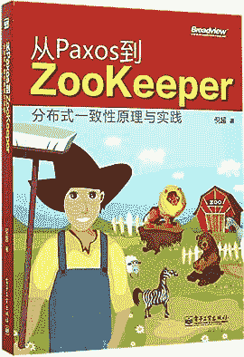

# 第三章 第 4 节 系统设计学习

> 原文：[`www.nowcoder.com/tutorial/10056/65be4830434e4f839d0399da65caa450`](https://www.nowcoder.com/tutorial/10056/65be4830434e4f839d0399da65caa450)

# 系统设计学习

## 1\. 重要性

在提及项目时，往往会朝着系统设计相关的问题进行提问。系统设计问题属于加分项，需要依赖应聘者自己的理解来自由发挥进行回答，能很好地看出应聘者的实践能力和思维能力，所以还是有挺多面试官喜欢考察这类问题。

## 2\. 学习方法

系统设计的内容其实也比较多，而且每个内容如果要深入去理解的话，会涉及到更多的内容。我们可以先把项目涉及到的问题准备好，如果时间充足的话再慢慢学习其它内容。

但还是需要先把系统设计相关的知识体系建立起来，至少能理清楚各个技术的作用和使用场景。推荐先阅读《大型网站技术架构》这本书。

## 3\. 知识清单

### 3.1 设计模式

*   ★☆☆ 面向对象三大特性
*   ★★★ 手写单例模式，特别是双重检验锁以及静态内部类。
*   ★★☆ 手写工厂模式。
*   ★★★ 理解 MVC，结合 SpringMVC 回答。
*   ★★★ 理解代理模式，结合 Spring 中的 AOP 回答。
*   ★★☆ 分析 JDK 中常用的设计模式，例如装饰者模式、适配器模式、迭代器模式等。

### 3.2 分布式

*   ★★★ 分布式锁
*   ★★★ 分布式事务
*   ★★★ 分布式 Session
*   ★★★ CAP
*   ★★☆ Raft 与 Paxos
*   ★★★ 负载均衡
*   ★★★ 限流

### 3.3 系统设计应用

*   ★★☆ 扫二维码登陆过程
*   ★★☆ 短网址系统

### 3.4 其它

*   ★★★ 缓存
*   ★★★ 消息队列

## 4\. 学习资料

**《Head First 设计模式》**

豆瓣 9.2 分，2660 人评分。

Head First 系列的图书都很适合当做入门书籍，包含了大量图示，内容也很有意思。可以把常见的几种设计模式看看，比如单例模式、几个工厂模式、观察者模式、MVC。

**《大型网站技术架构》**

豆瓣 7.9 分，1295 人评分。

非常好的网站架构入门书籍，在做网站项目之前建议先看一下这本书，然后在这本书中找几个技术用在你的项目中，比如缓存、集群等。

**《从 Paxos 到 Zookeeper》**

豆瓣 7.8 分，284 人评分。

重点看看前面几章分布式的基本原理。

**《微服务设计》**

豆瓣 8.2 分，481 人评分。

