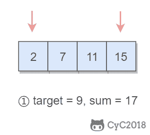

# 第四章 第 5 节 编码能力考察

> 原文：[`www.nowcoder.com/tutorial/10056/cd9bb67bbefb450bb44ac5d46c0f71c5`](https://www.nowcoder.com/tutorial/10056/cd9bb67bbefb450bb44ac5d46c0f71c5)

# 编码能力考察

## 1\. 考察要点

在面试中编码能力的考察通常是要求在纸上或者文本编辑器上写数据结构和算法题，也会要求写某个具体的功能实现。

在编码之前，除了要明确正常情况下的输出之外，还需要明确错误时应该怎么处理。

```cpp
public boolean duplicate(int[] nums, int length) {
    if (nums == null || length <= 0)
        return false;
    ...
}
```

在写完代码之后，通常也需要自己设计测试用例，包含以下测试用例：

*   正常用例
*   空值用例（0、null）
*   用户输入错误用例
*   边界用例

根据时间复杂度和空间复杂度要求，选择合适的数据结构与算法。

最好使用模块化的方式编码，例如下面是将交换数组元素的功能抽取成函数：

```cpp
private void swap(int[] nums, int i, int j) {
    int t = nums[i];
    nums[i] = nums[j];
    nums[j] = t;
}
```

可以先写伪代码，某些不重要的功能先不去实现，例如上面的交换数组元素的功能不是特别重要就可以先不实现。

如果能给函数名和变量名起一个很容易看懂的名字，也是可以加分的。


## 2\. 举例：Tow Sum

### 2.1 题目描述

在一个整数数组 nums 中找出两个数，它们的和为给定的值 target，最后返回这两个数的下标。

### 2.2 讨论题目

在面试官给出题目后，不应该立马动手求解，而是要和面试官讨论清楚各种没有明确说明的情况：

*   时间和空间复杂度是否有要求；
*   数组是否排好序了；
*   如果找不到满足条件的两个数，应该返回什么值；
*   如果有多个答案应该返回哪个。

假设讨论之后，

*   面试官要求你自己控制时间和空间复杂度；
*   对数组未排序和已排序的情况分别讨论；
*   如果没有满足条件的两个数，返回 new int[0]；
*   不会有多个答案。

在讨论完题目之后、手写代码之前，要和面试聊一下你的思路，这么做能帮你更好的理清解题思路。比如，这道题我准备采用 XX 方法来写，然后打算使用 XX 来进行优化。

而且一般面试的算法题不会特别难，但一定在某方面有特殊之处，如果你能讲出来，哪怕代码没有完成，面试官也能知道你是具备相关的能力。

### 2.3 暴力解法

最开始求解可以提到可以用暴力解法，也就是两个循环遍历数组来找到要求解的两个数。然后分析一下时间复杂度为 O(N²)，空间复杂度为 O(1)。

如果你一开始就有更优的解法，那么只要简单提到暴力解法即可，不一定真要实现出来，以免实现后面更优解法没有太多时间。

```cpp
public int[] twoSum(int[] nums, int target) {
    int n = nums.length;
    for (int i = 0; i < n; i++) {
        for (int j = i + 1; j < n; j++) {
            if (nums[i] + nums[j] == target) {
                return new int[]{i, j};
            }
        }
    }
    return new int[0];
}
```

### 2.4 优化时间复杂度

暴力解法的时间复杂度为 O(N²)，而空间复杂度为 O(1)。我们可以用空间换时间的思想，来降低时间复杂度。

使用 HashMap 来存储数组元素和索引的映射，在访问到 nums[i] 时，判断 HashMap 中是否存在 target - nums[i]，如果存在说明 target - nums[i] 所在的索引和 i 就是要找的两个数。

该方法使用了 HashMap 来存储额外信息，最多存储 N 个 KV 信息，因此空间复杂度为 O(N)。在求解过程中，只需要一个循环就能进行求解，每次循环都进行一次 HashMap 的操作，而操作 HashMap 的时间复杂度为 O(1)，因此整个算法的时间复杂度为 O(N)。

```cpp
public int[] twoSum(int[] nums, int target) {
    HashMap<Integer, Integer> indexForNum = new HashMap<>();
    for (int i = 0; i < nums.length; i++) {
        if (indexForNum.containsKey(target - nums[i])) {
            return new int[]{indexForNum.get(target - nums[i]), i};
        } else {
            indexForNum.put(nums[i], i);
        }
    }
    return new int[0];
}
```

### 2.5 优化空间复杂度

如果想让空间复杂度为 O(1)，也就是不消耗额外的存储空间，那么时间复杂度就要有所牺牲。

我们可以让数组具有有序的特点，使用二分查找能以 O(log[2]N) 的时间复杂度查找出数组中另一个元素。排序算法的时间复杂度基本为 O(Nlog[2]N)，之后的查找的时间复杂度也为 O(Nlog[2]N)，因此算法整体的时间复杂度为 O(log[2]N)。

但本题不能使用二分查找，因为最终需要返回两个数的索引，排序之后索引位置发生了改变。如果本题不是返回索引，而是返回具体的两个值，那么就能这么求解。

```cpp
public int[] twoSum(int[] nums, int target) {
    Arrays.sort(nums);
    int n = nums.length;
    for (int i = 0; i < n; i++) {
        int j = binarySearch(nums, target-nums[i]);
        if (j != -1) {
            return new int[]{nums[i], nums[j]};
        }
    }
    return new int[0];
}

public int binarySearch(int[] nums, int key) {
    int l = 0, h = nums.length - 1;
    while (l <= h) {
        int m = l + (h - l) / 2;
        if (nums[m] == key) {
            return m;
        } else if (nums[m] > key) {
            h = m - 1;
        } else {
            l = m + 1;
        }
    }
    return -1;
}
```

### 2.6 特殊情况的优化

如果数组本来就已经有序了，除了使用二分查找方式求解，还可以使用双指针求解，时间复杂度为 O(N)，空间复杂度为 O(1)。

使用双指针，一个指针指向值较小的元素，一个指针指向值较大的元素。指向较小元素的指针从头向尾遍历，指向较大元素的指针从尾向头遍历。

*   如果两个指针指向元素的和 sum == target，那么得到要求的结果；
*   如果 sum > target，移动较大的元素，使 sum 变小一些；
*   如果 sum < target，移动较小的元素，使 sum 变大一些。



```cpp
public int[] twoSum(int[] numbers, int target) {
    if (numbers == null) return null;
    int i = 0, j = numbers.length - 1;
    while (i < j) {
        int sum = numbers[i] + numbers[j];
        if (sum == target) {
            return new int[]{i + 1, j + 1};
        } else if (sum < target) {
            i++;
        } else {
            j--;
        }
    }
    return new int[0];
}
```

### 2.7 设计测试用例

测试用例覆盖以下 case：

*   空数组，input 为 {}，数组也应该为 {}；
*   正常输入，input 为 {1,2,3}，target 为 4，output 为 {0,2}。
*   整型边界，input 为 {Integer.MAX_VALUE, Integer.MIN_VALUE, 0}，target 为 0，output 为 {0,1}。

```cpp
int[][]inputs = {
     {
     },
     {
         1,2,3
     },
     {
         Integer.MAX_VALUE, Integer.MIN_VALUE, 0
     }
};
int[] targets = {
     0,
     4,
     0,
};
int[][] outputs = {
     {
     },
     {
         0,2
     },
     {
         0,1
     }
};
for (int i = 0; i < inputs.length; i++) {
 int[] res = solution.twoSum(inputs[i], targets[i]);
 for (int j = 0; j < res.length; j++) {
     assert res[j] == outputs[i][j];
 }
}
```

# 本章小结

通过学习本章，你会知道面试能力也是非常重要的，而且面试能力也是能够进行学习的。

本章的主要目标是帮助你熟悉面试的各个流程，以及每个流程应该注意的要点，让你在面试中能发挥出自己应有的实力，而不是因为不熟悉面试流程而发挥失常，错过了心仪的 Offer。