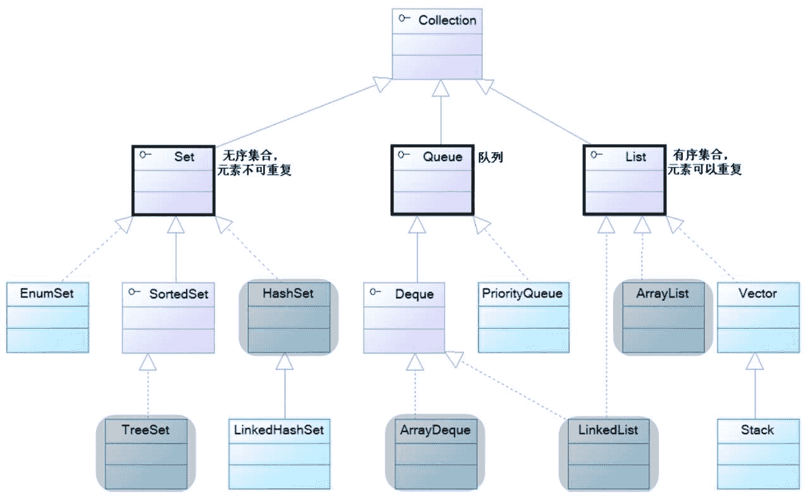
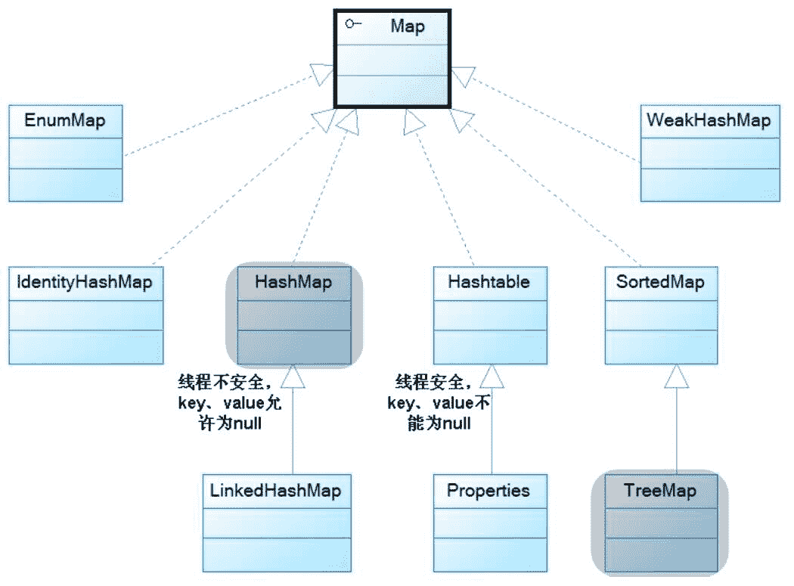
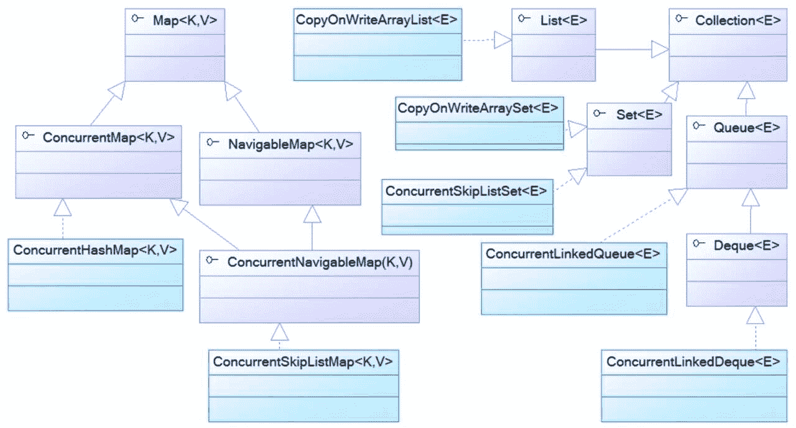
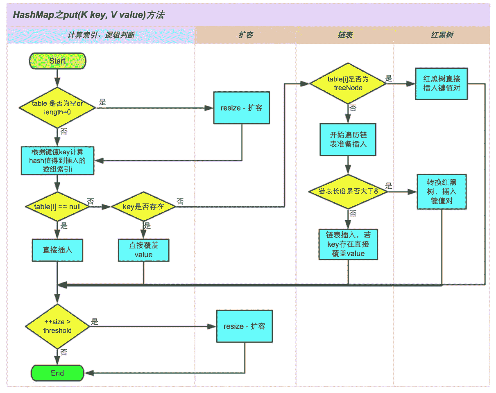
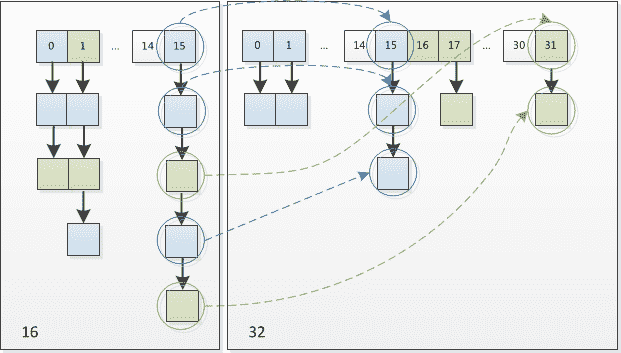

# 第一章 第 5 节 Java 基础-5

> 原文：[`www.nowcoder.com/tutorial/10070/456ee24202d34862bedf4f1504513a6f`](https://www.nowcoder.com/tutorial/10070/456ee24202d34862bedf4f1504513a6f)

#### 1.48 Java 反射在实际项目中有哪些应用场景？

**参考答案**

Java 的反射机制在实际项目中应用广泛，常见的应用场景有：

*   使用 JDBC 时，如果要创建数据库的连接，则需要先通过反射机制加载数据库的驱动程序；
*   多数框架都支持注解/XML 配置，从配置中解析出来的类是字符串，需要利用反射机制实例化；
*   面向切面编程（AOP）的实现方案，是在程序运行时创建目标对象的代理类，这必须由反射机制来实现。

#### 1.49 说一说 Java 的四种引用方式

**参考答案**

Java 对象的四种引用方式分别是强引用、软引用、弱引用、虚引用，具体含义如下：

*   强引用：这是 Java 程序中最常见的引用方式，即程序创建一个对象，并把这个对象赋给一个引用变量，程序通过该引用变量来操作实际的对象。当一个对象被一个或一个以上的引用变量所引用时，它处于可达状态，不可能被系统垃圾回收机制回收。
*   软引用：当一个对象只有软引用时，它有可能被垃圾回收机制回收。对于只有软引用的对象而言，当系统内存空间足够时，它不会被系统回收，程序也可使用该对象。当系统内存空间不足时，系统可能会回收它。软引用通常用于对内存敏感的程序中。
*   弱引用：弱引用和软引用很像，但弱引用的引用级别更低。对于只有弱引用的对象而言，当系统垃圾回收机制运行时，不管系统内存是否足够，总会回收该对象所占用的内存。当然，并不是说当一个对象只有弱引用时，它就会立即被回收，正如那些失去引用的对象一样，必须等到系统垃圾回收机制运行时才会被回收。
*   虚引用：虚引用完全类似于没有引用。虚引用对对象本身没有太大影响，对象甚至感觉不到虚引用的存在。如果一个对象只有一个虚引用时，那么它和没有引用的效果大致相同。虚引用主要用于跟踪对象被垃圾回收的状态，虚引用不能单独使用，虚引用必须和引用队列联合使用。

## 2\. 集合类

#### 2.1 Java 中有哪些容器（集合类）？

**参考答案**

Java 中的集合类主要由 Collection 和 Map 这两个接口派生而出，其中 Collection 接口又派生出三个子接口，分别是 Set、List、Queue。所有的 Java 集合类，都是 Set、List、Queue、Map 这四个接口的实现类，这四个接口将集合分成了四大类，其中

*   Set 代表无序的，元素不可重复的集合；
*   List 代表有序的，元素可以重复的集合；
*   Queue 代表先进先出（FIFO）的队列；
*   Map 代表具有映射关系（key-value）的集合。

这些接口拥有众多的实现类，其中最常用的实现类有 HashSet、TreeSet、ArrayList、LinkedList、ArrayDeque、HashMap、TreeMap 等。

**扩展阅读**

Collection 体系的继承树：

Map 体系的继承树：

*注：紫色框体代表接口，其中加粗的是代表四类集合的接口。蓝色框体代表实现类，其中有阴影的是常用实现类。*

#### 2.2 Java 中的容器，线程安全和线程不安全的分别有哪些？

**参考答案**

java.util 包下的集合类大部分都是线程不安全的，例如我们常用的 HashSet、TreeSet、ArrayList、LinkedList、ArrayDeque、HashMap、TreeMap，这些都是线程不安全的集合类，但是它们的优点是性能好。如果需要使用线程安全的集合类，则可以使用 Collections 工具类提供的 synchronizedXxx()方法，将这些集合类包装成线程安全的集合类。

java.util 包下也有线程安全的集合类，例如 Vector、Hashtable。这些集合类都是比较古老的 API，虽然实现了线程安全，但是性能很差。所以即便是需要使用线程安全的集合类，也建议将线程不安全的集合类包装成线程安全集合类的方式，而不是直接使用这些古老的 API。

从 Java5 开始，Java 在 java.util.concurrent 包下提供了大量支持高效并发访问的集合类，它们既能包装良好的访问性能，有能包装线程安全。这些集合类可以分为两部分，它们的特征如下：

*   以 Concurrent 开头的集合类：

    以 Concurrent 开头的集合类代表了支持并发访问的集合，它们可以支持多个线程并发写入访问，这些写入线程的所有操作都是线程安全的，但读取操作不必锁定。以 Concurrent 开头的集合类采用了更复杂的算法来保证永远不会锁住整个集合，因此在并发写入时有较好的性能。

*   以 CopyOnWrite 开头的集合类：

    以 CopyOnWrite 开头的集合类采用复制底层数组的方式来实现写操作。当线程对此类集合执行读取操作时，线程将会直接读取集合本身，无须加锁与阻塞。当线程对此类集合执行写入操作时，集合会在底层复制一份新的数组，接下来对新的数组执行写入操作。由于对集合的写入操作都是对数组的副本执行操作，因此它是线程安全的。

**扩展阅读**

java.util.concurrent 包下线程安全的集合类的体系结构：

#### 2.3 Map 接口有哪些实现类？

**参考答案**

Map 接口有很多实现类，其中比较常用的有 HashMap、LinkedHashMap、TreeMap、ConcurrentHashMap。

对于不需要排序的场景，优先考虑使用 HashMap，因为它是性能最好的 Map 实现。如果需要保证线程安全，则可以使用 ConcurrentHashMap。它的性能好于 Hashtable，因为它在 put 时采用分段锁/CAS 的加锁机制，而不是像 Hashtable 那样，无论是 put 还是 get 都做同步处理。

对于需要排序的场景，如果需要按插入顺序排序则可以使用 LinkedHashMap，如果需要将 key 按自然顺序排列甚至是自定义顺序排列，则可以选择 TreeMap。如果需要保证线程安全，则可以使用 Collections 工具类将上述实现类包装成线程安全的 Map。

#### 2.4 描述一下 Map put 的过程

**参考答案**

HashMap 是最经典的 Map 实现，下面以它的视角介绍 put 的过程：

1.  首次扩容：

    先判断数组是否为空，若数组为空则进行第一次扩容（resize）；

2.  计算索引：

    通过 hash 算法，计算键值对在数组中的索引；

3.  插入数据：

    *   如果当前位置元素为空，则直接插入数据；
    *   如果当前位置元素非空，且 key 已存在，则直接覆盖其 value；
    *   如果当前位置元素非空，且 key 不存在，则将数据链到链表末端；
    *   若链表长度达到 8，则将链表转换成红黑树，并将数据插入树中；
4.  再次扩容

    如果数组中元素个数（size）超过 threshold，则再次进行扩容操作。

**扩展阅读**

HashMap 添加数据的详细过程，如下图：

#### 2.5 如何得到一个线程安全的 Map？

**参考答案**

1.  使用 Collections 工具类，将线程不安全的 Map 包装成线程安全的 Map；
2.  使用 java.util.concurrent 包下的 Map，如 ConcurrentHashMap；
3.  不建议使用 Hashtable，虽然 Hashtable 是线程安全的，但是性能较差。

#### 2.6 HashMap 有什么特点？

**参考答案**

1.  HashMap 是线程不安全的实现；
2.  HashMap 可以使用 null 作为 key 或 value。

#### 2.7 JDK7 和 JDK8 中的 HashMap 有什么区别？

**参考答案**

JDK7 中的 HashMap，是基于数组+链表来实现的，它的底层维护一个 Entry 数组。它会根据计算的 hashCode 将对应的 KV 键值对存储到该数组中，一旦发生 hashCode 冲突，那么就会将该 KV 键值对放到对应的已有元素的后面， 此时便形成了一个链表式的存储结构。

JDK7 中 HashMap 的实现方案有一个明显的缺点，即当 Hash 冲突严重时，在桶上形成的链表会变得越来越长，这样在查询时的效率就会越来越低，其时间复杂度为 O(N)。

JDK8 中的 HashMap，是基于数组+链表+红黑树来实现的，它的底层维护一个 Node 数组。当链表的存储的数据个数大于等于 8 的时候，不再采用链表存储，而采用了红黑树存储结构。这么做主要是在查询的时间复杂度上进行优化，链表为 O(N)，而红黑树一直是 O(logN)，可以大大的提高查找性能。

#### 2.8 介绍一下 HashMap 底层的实现原理

**参考答案**

它基于 hash 算法，通过 put 方法和 get 方法存储和获取对象。

存储对象时，我们将 K/V 传给 put 方法时，它调用 K 的 hashCode 计算 hash 从而得到 bucket 位置，进一步存储，HashMap 会根据当前 bucket 的占用情况自动调整容量(超过 Load Facotr 则 resize 为原来的 2 倍)。获取对象时，我们将 K 传给 get，它调用 hashCode 计算 hash 从而得到 bucket 位置，并进一步调用 equals()方法确定键值对。

如果发生碰撞的时候，HashMap 通过链表将产生碰撞冲突的元素组织起来。在 Java 8 中，如果一个 bucket 中碰撞冲突的元素超过某个限制(默认是 8)，则使用红黑树来替换链表，从而提高速度。

#### 2.9 介绍一下 HashMap 的扩容机制

**参考答案**

1.  数组的初始容量为 16，而容量是以 2 的次方扩充的，一是为了提高性能使用足够大的数组，二是为了能使用位运算代替取模预算(据说提升了 5~8 倍)。

2.  数组是否需要扩充是通过负载因子判断的，如果当前元素个数为数组容量的 0.75 时，就会扩充数组。这个 0.75 就是默认的负载因子，可由构造器传入。我们也可以设置大于 1 的负载因子，这样数组就不会扩充，牺牲性能，节省内存。

3.  为了解决碰撞，数组中的元素是单向链表类型。当链表长度到达一个阈值时（7 或 8），会将链表转换成红黑树提高性能。而当链表长度缩小到另一个阈值时（6），又会将红黑树转换回单向链表提高性能。

4.  对于第三点补充说明，检查链表长度转换成红黑树之前，还会先检测当前数组数组是否到达一个阈值（64），如果没有到达这个容量，会放弃转换，先去扩充数组。所以上面也说了链表长度的阈值是 7 或 8，因为会有一次放弃转换的操作。

**扩展阅读**

例如我们从 16 扩展为 32 时，具体的变化如下所示：

因此元素在重新计算 hash 之后，因为 n 变为 2 倍，那么 n-1 的 mask 范围在高位多 1bit(红色)，因此新的 index 就会发生这样的变化：

因此，我们在扩充 HashMap 的时候，不需要重新计算 hash，只需要看看原来的 hash 值新增的那个 bit 是 1 还是 0 就好了，是 0 的话索引没变，是 1 的话索引变成“原索引+oldCap”。可以看看下图为 16 扩充为 32 的 resize 示意图：

这个设计确实非常的巧妙，既省去了重新计算 hash 值的时间，而且同时，由于新增的 1bit 是 0 还是 1 可以认为是随机的，因此 resize 的过程，均匀的把之前的冲突的节点分散到新的 bucket 了。

#### 2.10 HashMap 中的循环链表是如何产生的？

**参考答案**

在多线程的情况下，当重新调整 HashMap 大小的时候，就会存在条件竞争，因为如果两个线程都发现 HashMap 需要重新调整大小了，它们会同时试着调整大小。在调整大小的过程中，存储在链表中的元素的次序会反过来，因为移动到新的 bucket 位置的时候，HashMap 并不会将元素放在链表的尾部，而是放在头部，这是为了避免尾部遍历。如果条件竞争发生了，那么就会产生死循环了。

#### 2.11 HashMap 为什么用红黑树而不用 B 树？

**参考答案**

B/B+树多用于外存上时，B/B+也被成为一个磁盘友好的数据结构。

HashMap 本来是数组+链表的形式，链表由于其查找慢的特点，所以需要被查找效率更高的树结构来替换。如果用 B/B+树的话，在数据量不是很多的情况下，数据都会“挤在”一个结点里面，这个时候遍历效率就退化成了链表。

#### 2.12 HashMap 为什么线程不安全？

**参考答案**

HashMap 在并发执行 put 操作时，可能会导致形成循环链表，从而引起死循环。

#### 2.13 HashMap 如何实现线程安全？

**参考答案**

1.  直接使用 Hashtable 类；
2.  直接使用 ConcurrentHashMap；
3.  使用 Collections 将 HashMap 包装成线程安全的 Map。

#### 2.14 HashMap 是如何解决哈希冲突的？

**参考答案**

为了解决碰撞，数组中的元素是单向链表类型。当链表长度到达一个阈值时，会将链表转换成红黑树提高性能。而当链表长度缩小到另一个阈值时，又会将红黑树转换回单向链表提高性能。

#### 2.15 说一说 HashMap 和 HashTable 的区别

**参考答案**

1.  Hashtable 是一个线程安全的 Map 实现，但 HashMap 是线程不安全的实现，所以 HashMap 比 Hashtable 的性能高一点。
2.  Hashtable 不允许使用 null 作为 key 和 value，如果试图把 null 值放进 Hashtable 中，将会引发空指针异常，但 HashMap 可以使用 null 作为 key 或 value。

**扩展阅读**

从 Hashtable 的类名上就可以看出它是一个古老的类，它的命名甚至没有遵守 Java 的命名规范：每个单词的首字母都应该大写。也许当初开发 Hashtable 的工程师也没有注意到这一点，后来大量 Java 程序中使用了 Hashtable 类，所以这个类名也就不能改为 HashTable 了，否则将导致大量程序需要改写。

与 Vector 类似的是，尽量少用 Hashtable 实现类，即使需要创建线程安全的 Map 实现类，也无须使用 Hashtable 实现类，可以通过 Collections 工具类把 HashMap 变成线程安全的 Map。