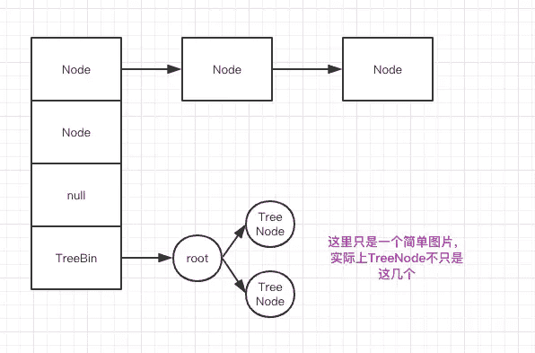
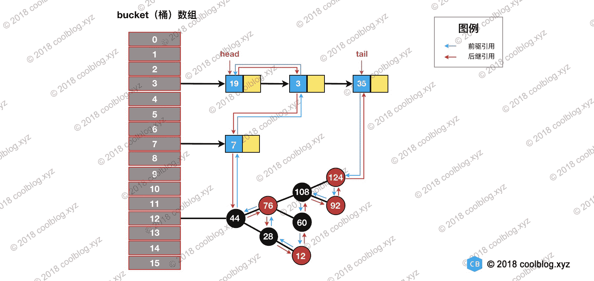
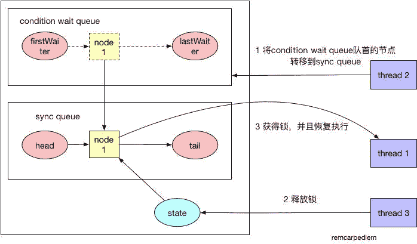

# 第一章 第 6 节 Java 基础-6

> 原文：[`www.nowcoder.com/tutorial/10070/489ddf1bff5e419ba8f8f99c6ff6e393`](https://www.nowcoder.com/tutorial/10070/489ddf1bff5e419ba8f8f99c6ff6e393)

#### 2.16 HashMap 与 ConcurrentHashMap 有什么区别？

**参考答案**

HashMap 是非线程安全的，这意味着不应该在多线程中对这些 Map 进行修改操作，否则会产生数据不一致的问题，甚至还会因为并发插入元素而导致链表成环，这样在查找时就会发生死循环，影响到整个应用程序。

Collections 工具类可以将一个 Map 转换成线程安全的实现，其实也就是通过一个包装类，然后把所有功能都委托给传入的 Map，而包装类是基于 synchronized 关键字来保证线程安全的（Hashtable 也是基于 synchronized 关键字），底层使用的是互斥锁，性能与吞吐量比较低。

ConcurrentHashMap 的实现细节远没有这么简单，因此性能也要高上许多。它没有使用一个全局锁来锁住自己，而是采用了减少锁粒度的方法，尽量减少因为竞争锁而导致的阻塞与冲突，而且 ConcurrentHashMap 的检索操作是不需要锁的。

#### 2.17 介绍一下 ConcurrentHashMap 是怎么实现的？

**参考答案**

JDK 1.7 中的实现：

在 jdk 1.7 中，ConcurrentHashMap 是由 Segment 数据结构和 HashEntry 数组结构构成，采取分段锁来保证安全性。Segment 是 ReentrantLock 重入锁，在 ConcurrentHashMap 中扮演锁的角色，HashEntry 则用于存储键值对数据。一个 ConcurrentHashMap 里包含一个 Segment 数组，一个 Segment 里包含一个 HashEntry 数组，Segment 的结构和 HashMap 类似，是一个数组和链表结构。


JDK 1.8 中的实现：

JDK1.8 的实现已经摒弃了 Segment 的概念，而是直接用 Node 数组+链表+红黑树的数据结构来实现，并发控制使用 Synchronized 和 CAS 来操作，整个看起来就像是优化过且线程安全的 HashMap，虽然在 JDK1.8 中还能看到 Segment 的数据结构，但是已经简化了属性，只是为了兼容旧版本。



#### 2.18 ConcurrentHashMap 是怎么分段分组的？

**参考答案**

get 操作：

Segment 的 get 操作实现非常简单和高效，先经过一次再散列，然后使用这个散列值通过散列运算定位到 Segment，再通过散列算法定位到元素。get 操作的高效之处在于整个 get 过程都不需要加锁，除非读到空的值才会加锁重读。原因就是将使用的共享变量定义成 `volatile` 类型。

put 操作：

当执行 put 操作时，会经历两个步骤：

1.  判断是否需要扩容；
2.  定位到添加元素的位置，将其放入 HashEntry 数组中。

插入过程会进行第一次 key 的 hash 来定位 Segment 的位置，如果该 Segment 还没有初始化，即通过 CAS 操作进行赋值，然后进行第二次 hash 操作，找到相应的 HashEntry 的位置，这里会利用继承过来的锁的特性，在将数据插入指定的 HashEntry 位置时（尾插法），会通过继承 ReentrantLock 的 `tryLock()` 方法尝试去获取锁，如果获取成功就直接插入相应的位置，如果已经有线程获取该 Segment 的锁，那当前线程会以自旋的方式去继续的调用 `tryLock()` 方法去获取锁，超过指定次数就挂起，等待唤醒。

#### 2.19 说一说你对 LinkedHashMap 的理解

**参考答案**

LinkedHashMap 使用双向链表来维护 key-value 对的顺序（其实只需要考虑 key 的顺序），该链表负责维护 Map 的迭代顺序，迭代顺序与 key-value 对的插入顺序保持一致。

LinkedHashMap 可以避免对 HashMap、Hashtable 里的 key-value 对进行排序（只要插入 key-value 对时保持顺序即可），同时又可避免使用 TreeMap 所增加的成本。

LinkedHashMap 需要维护元素的插入顺序，因此性能略低于 HashMap 的性能。但因为它以链表来维护内部顺序，所以在迭代访问 Map 里的全部元素时将有较好的性能。

#### 2.20 请介绍 LinkedHashMap 的底层原理

**参考答案**

LinkedHashMap 继承于 HashMap，它在 HashMap 的基础上，通过维护一条双向链表，解决了 HashMap 不能随时保持遍历顺序和插入顺序一致的问题。在实现上，LinkedHashMap 很多方法直接继承自 HashMap，仅为维护双向链表重写了部分方法。

如下图，淡蓝色的箭头表示前驱引用，红色箭头表示后继引用。每当有新的键值对节点插入时，新节点最终会接在 tail 引用指向的节点后面。而 tail 引用则会移动到新的节点上，这样一个双向链表就建立起来了。



#### 2.21 请介绍 TreeMap 的底层原理

**参考答案**

TreeMap 基于红黑树（Red-Black tree）实现。映射根据其键的自然顺序进行排序，或者根据创建映射时提供的 Comparator 进行排序，具体取决于使用的构造方法。TreeMap 的基本操作 containsKey、get、put、remove 方法，它的时间复杂度是 log(N)。

TreeMap 包含几个重要的成员变量：root、size、comparator。其中 root 是红黑树的根节点。它是 Entry 类型，Entry 是红黑树的节点，它包含了红黑树的 6 个基本组成：key、value、left、right、parent 和 color。Entry 节点根据根据 Key 排序，包含的内容是 value。Entry 中 key 比较大小是根据比较器 comparator 来进行判断的。size 是红黑树的节点个数。

#### 2.22 Map 和 Set 有什么区别？

**参考答案**

Set 代表无序的，元素不可重复的集合；

Map 代表具有映射关系（key-value）的集合，其所有的 key 是一个 Set 集合，即 key 无序且不能重复。

#### 2.23 List 和 Set 有什么区别？

**参考答案**

Set 代表无序的，元素不可重复的集合；

List 代表有序的，元素可以重复的集合。

#### 2.24 ArrayList 和 LinkedList 有什么区别？

**参考答案**

1.  ArrayList 的实现是基于数组，LinkedList 的实现是基于双向链表；
2.  对于随机访问 ArrayList 要优于 LinkedList，ArrayList 可以根据下标以 O(1)时间复杂度对元素进行随机访问，而 LinkedList 的每一个元素都依靠地址指针和它后一个元素连接在一起，查找某个元素的时间复杂度是 O(N)；
3.  对于插入和删除操作，LinkedList 要优于 ArrayList，因为当元素被添加到 LinkedList 任意位置的时候，不需要像 ArrayList 那样重新计算大小或者是更新索引；
4.  LinkedList 比 ArrayList 更占内存，因为 LinkedList 的节点除了存储数据，还存储了两个引用，一个指向前一个元素，一个指向后一个元素。

#### 2.25 有哪些线程安全的 List？

**参考答案**

1.  Vector

    Vector 是比较古老的 API，虽然保证了线程安全，但是由于效率低一般不建议使用。

2.  Collections.SynchronizedList

    SynchronizedList 是 Collections 的内部类，Collections 提供了 synchronizedList 方法，可以将一个线程不安全的 List 包装成线程安全的 List，即 SynchronizedList。它比 Vector 有更好的扩展性和兼容性，但是它所有的方法都带有同步锁，也不是性能最优的 List。

3.  CopyOnWriteArrayList

    CopyOnWriteArrayList 是 Java 1.5 在 java.util.concurrent 包下增加的类，它采用复制底层数组的方式来实现写操作。当线程对此类集合执行读取操作时，线程将会直接读取集合本身，无须加锁与阻塞。当线程对此类集合执行写入操作时，集合会在底层复制一份新的数组，接下来对新的数组执行写入操作。由于对集合的写入操作都是对数组的副本执行操作，因此它是线程安全的。在所有线程安全的 List 中，它是性能最优的方案。

#### 2.26 介绍一下 ArrayList 的数据结构？

**参考答案**

ArrayList 的底层是用数组来实现的，默认第一次插入元素时创建大小为 10 的数组，超出限制时会增加 50%的容量，并且数据以 `System.arraycopy()` 复制到新的数组，因此最好能给出数组大小的预估值。

按数组下标访问元素的性能很高，这是数组的基本优势。直接在数组末尾加入元素的性能也高，但如果按下标插入、删除元素，则要用 `System.arraycopy()` 来移动部分受影响的元素，性能就变差了，这是基本劣势。

#### 2.27 谈谈 CopyOnWriteArrayList 的原理

**参考答案**

CopyOnWriteArrayList 是 Java 并发包里提供的并发类，简单来说它就是一个线程安全且读操作无锁的 ArrayList。正如其名字一样，在写操作时会复制一份新的 List，在新的 List 上完成写操作，然后再将原引用指向新的 List。这样就保证了写操作的线程安全。

CopyOnWriteArrayList 允许线程并发访问读操作，这个时候是没有加锁限制的，性能较高。而写操作的时候，则首先将容器复制一份，然后在新的副本上执行写操作，这个时候写操作是上锁的。结束之后再将原容器的引用指向新容器。注意，在上锁执行写操作的过程中，如果有需要读操作，会作用在原容器上。因此上锁的写操作不会影响到并发访问的读操作。

*   优点：读操作性能很高，因为无需任何同步措施，比较适用于读多写少的并发场景。在遍历传统的 List 时，若中途有别的线程对其进行修改，则会抛出 ConcurrentModificationException 异常。而 CopyOnWriteArrayList 由于其"读写分离"的思想，遍历和修改操作分别作用在不同的 List 容器，所以在使用迭代器进行遍历时候，也就不会抛出 ConcurrentModificationException 异常了。
*   缺点：一是内存占用问题，毕竟每次执行写操作都要将原容器拷贝一份，数据量大时，对内存压力较大，可能会引起频繁 GC。二是无法保证实时性，Vector 对于读写操作均加锁同步，可以保证读和写的强一致性。而 CopyOnWriteArrayList 由于其实现策略的原因，写和读分别作用在新老不同容器上，在写操作执行过程中，读不会阻塞但读取到的却是老容器的数据。

#### 2.28 说一说 TreeSet 和 HashSet 的区别

**参考答案**

HashSet、TreeSet 中的元素都是不能重复的，并且它们都是线程不安全的，二者的区别是：

1.  HashSet 中的元素可以是 null，但 TreeSet 中的元素不能是 null；
2.  HashSet 不能保证元素的排列顺序，而 TreeSet 支持自然排序、定制排序两种排序的方式；
3.  HashSet 底层是采用哈希表实现的，而 TreeSet 底层是采用红黑树实现的。

#### 2.29 说一说 HashSet 的底层结构

**参考答案**

HashSet 是基于 HashMap 实现的，默认构造函数是构建一个初始容量为 16，负载因子为 0.75 的 HashMap。它封装了一个 HashMap 对象来存储所有的集合元素，所有放入 HashSet 中的集合元素实际上由 HashMap 的 key 来保存，而 HashMap 的 value 则存储了一个 PRESENT，它是一个静态的 Object 对象。

#### 2.30 BlockingQueue 中有哪些方法，为什么这样设计？

**参考答案**

为了应对不同的业务场景，BlockingQueue 提供了 4 组不同的方法用于插入、移除以及对队列中的元素进行检查。如果请求的操作不能得到立即执行的话，每组方法的表现是不同的。这些方法如下：

|  | 抛异常 | 特定值 | 阻塞 | 超时 |
| --- | --- | --- | --- | --- |
| 插入 | add(e) | offer(e) | put(e) | offer(e, time, unit) |
| 移除 | remove() | poll() | take() | poll(time, unit) |
| 检查 | element() | peek() |  |  |

四组不同的行为方式含义如下：

*   抛异常：如果操作无法立即执行，则抛一个异常；
*   特定值：如果操作无法立即执行，则返回一个特定的值(一般是 true / false)。
*   阻塞：如果操作无法立即执行，则该方法调用将会发生阻塞，直到能够执行；
*   超时：如果操作无法立即执行，则该方法调用将会发生阻塞，直到能够执行。但等待时间不会超过给定值，并返回一个特定值以告知该操作是否成功(典型的是 true / false)。

#### 2.31 BlockingQueue 是怎么实现的？

**参考答案**

BlockingQueue 是一个接口，它的实现类有 ArrayBlockingQueue、DelayQueue、 LinkedBlockingQueue、PriorityBlockingQueue、SynchronousQueue 等。它们的区别主要体现在存储结构上或对元素操作上的不同，但是对于 put 与 take 操作的原理是类似的。下面以 ArrayBlockingQueue 为例，来说明 BlockingQueue 的实现原理。

首先看一下 ArrayBlockingQueue 的构造函数，它初始化了 put 和 take 函数中用到的关键成员变量，这两个变量的类型分别是 ReentrantLock 和 Condition。ReentrantLock 是 AbstractQueuedSynchronizer（AQS）的子类，它的 newCondition 函数返回的 Condition 实例，是定义在 AQS 类内部的 ConditionObject 类，该类可以直接调用 AQS 相关的函数。

```cpp
public ArrayBlockingQueue(int capacity, boolean fair) {
    if (capacity <= 0)
        throw new IllegalArgumentException();
    this.items = new Object[capacity];
    lock = new ReentrantLock(fair);
    notEmpty = lock.newCondition();
    notFull =  lock.newCondition();
}
```

put 函数会在队列末尾添加元素，如果队列已经满了，无法添加元素的话，就一直阻塞等待到可以加入为止。函数的源码如下所示。我们会发现 put 函数使用了 wait/notify 的机制。与一般生产者-消费者的实现方式不同，同步队列使用 ReentrantLock 和 Condition 相结合的机制，即先获得锁，再等待，而不是 synchronized 和 wait 的机制。

```cpp
public void put(E e) throws InterruptedException {
    checkNotNull(e);
    final ReentrantLock lock = this.lock;
    lock.lockInterruptibly();
    try {
        while (count == items.length) 
            notFull.await();
        enqueue(e);
    } finally {
        lock.unlock();
    }
}
```

再来看一下消费者调用的 take 函数，take 函数在队列为空时会被阻塞，一直到阻塞队列加入了新的元素。

```cpp
public E take() throws InterruptedException {
    final ReentrantLock lock = this.lock;
    lock.lockInterruptibly();
    try {
        while (count == 0)
            notEmpty.await();
        return dequeue();
    } finally {
        lock.unlock();
    }
}
```

**扩展阅读**

await 操作：

我们发现`ArrayBlockingQueue`并没有使用`Object.wait`，而是使用的`Condition.await`，这是为什么呢？`Condition`对象可以提供和`Object`的`wait`和`notify`一样的行为，但是后者必须先获取`synchronized`这个内置的`monitor`锁才能调用，而`Condition`则必须先获取`ReentrantLock`。这两种方式在阻塞等待时都会将相应的锁释放掉，但是`Condition`的等待可以中断，这是二者唯一的区别。

我们先来看一下`Condition`的`await`函数，await 函数的流程大致如下图所示。await 函数主要有三个步骤，一是调用`addConditionWaiter`函数，在`condition wait queue`队列中添加一个节点，代表当前线程在等待一个消息。然后调用`fullyRelease`函数，将持有的锁释放掉，调用的是 AQS 的函数。最后一直调用`isOnSyncQueue`函数判断节点是否被转移到`sync queue`队列上，也就是 AQS 中等待获取锁的队列。如果没有，则进入阻塞状态，如果已经在队列上，则调用`acquireQueued`函数重新获取锁。


signal 操作：

`signal`函数将`condition wait queue`队列中队首的线程节点转移等待获取锁的`sync queue`队列中。这样的话，`await`函数中调用`isOnSyncQueue`函数就会返回 true，导致`await`函数进入最后一步重新获取锁的状态。

我们这里来详细解析一下`condition wait queue`和`sync queue`两个队列的设计原理。`condition wait queue`是等待消息的队列，因为阻塞队列为空而进入阻塞状态的`take`函数操作就是在等待阻塞队列不为空的消息。而`sync queue`队列则是等待获取锁的队列，take 函数获得了消息，就可以运行了，但是它还必须等待获取锁之后才能真正进行运行状态。

`signal`函数其实就做了一件事情，就是不断尝试调用`transferForSignal`函数，将`condition wait queue`队首的一个节点转移到`sync queue`队列中，直到转移成功。因为一次转移成功，就代表这个消息被成功通知到了等待消息的节点。

`signal`函数的示意图如下所示。



#### 2.32 Stream（不是 IOStream）有哪些方法？

**参考答案**

Stream 提供了大量的方法进行聚集操作，这些方法既可以是“中间的”，也可以是“末端的”。

*   中间方法：中间操作允许流保持打开状态，并允许直接调用后续方法。上面程序中的 map()方法就是中间方法。中间方法的返回值是另外一个流。
*   末端方法：末端方法是对流的最终操作。当对某个 Stream 执行末端方法后，该流将会被“消耗”且不再可用。上面程序中的 sum()、count()、average()等方法都是末端方法。

除此之外，关于流的方法还有如下两个特征：

*   有状态的方法：这种方法会给流增加一些新的属性，比如元素的唯一性、元素的最大数量、保证元素以排序的方式被处理等。有状态的方法往往需要更大的性能开销。
*   短路方法：短路方法可以尽早结束对流的操作，不必检查所有的元素。

下面简单介绍一下 Stream 常用的中间方法：

*   filter(Predicate predicate)：过滤 Stream 中所有不符合 predicate 的元素。
*   mapToXxx(ToXxxFunction mapper)：使用 ToXxxFunction 对流中的元素执行一对一的转换，该方法返回的新流中包含了 ToXxxFunction 转换生成的所有元素。
*   peek(Consumer action)：依次对每个元素执行一些操作，该方法返回的流与原有流包含相同的元素。该方法主要用于调试。
*   distinct()：该方法用于排序流中所有重复的元素（判断元素重复的标准是使用 equals()比较返回 true）。这是一个有状态的方法。
*   sorted()：该方法用于保证流中的元素在后续的访问中处于有序状态。这是一个有状态的方法。
*   limit(long maxSize)：该方法用于保证对该流的后续访问中最大允许访问的元素个数。这是一个有状态的、短路方法。

下面简单介绍一下 Stream 常用的末端方法：

*   forEach(Consumer action)：遍历流中所有元素，对每个元素执行 action。
*   toArray()：将流中所有元素转换为一个数组。
*   reduce()：该方法有三个重载的版本，都用于通过某种操作来合并流中的元素。
*   min()：返回流中所有元素的最小值。
*   max()：返回流中所有元素的最大值。
*   count()：返回流中所有元素的数量。
*   anyMatch(Predicate predicate)：判断流中是否至少包含一个元素符合 Predicate 条件。
*   noneMatch(Predicate predicate)：判断流中是否所有元素都不符合 Predicate 条件。
*   findFirst()：返回流中的第一个元素。
*   findAny()：返回流中的任意一个元素。

除此之外，Java 8 允许使用流式 API 来操作集合，Collection 接口提供了一个 stream()默认方法，该方法可返回该集合对应的流，接下来即可通过流式 API 来操作集合元素。由于 Stream 可以对集合元素进行整体的聚集操作，因此 Stream 极大地丰富了集合的功能。

**扩展阅读**

Java 8 新增了 Stream、IntStream、LongStream、DoubleStream 等流式 API，这些 API 代表多个支持串行和并行聚集操作的元素。上面 4 个接口中，Stream 是一个通用的流接口，而 IntStream、LongStream、DoubleStream 则代表元素类型为 int、long、double 的流。

Java 8 还为上面每个流式 API 提供了对应的 Builder，例如 Stream.Builder、IntStream.Builder、LongStream.Builder、DoubleStream.Builder，开发者可以通过这些 Builder 来创建对应的流。

独立使用 Stream 的步骤如下：

1.  使用 Stream 或 XxxStream 的 builder()类方法创建该 Stream 对应的 Builder。
2.  重复调用 Builder 的 add()方法向该流中添加多个元素。
3.  调用 Builder 的 build()方法获取对应的 Stream。
4.  调用 Stream 的聚集方法。

在上面 4 个步骤中，第 4 步可以根据具体需求来调用不同的方法，Stream 提供了大量的聚集方法供用户调用，具体可参考 Stream 或 XxxStream 的 API 文档。对于大部分聚集方法而言，每个 Stream 只能执行一次。