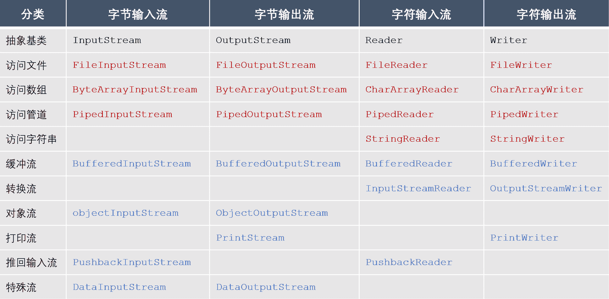
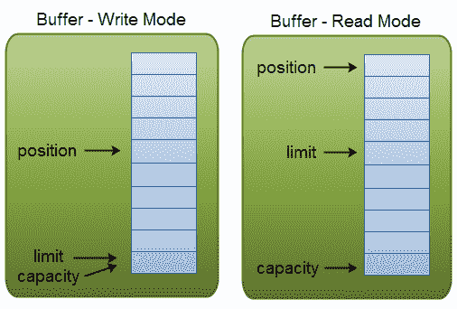
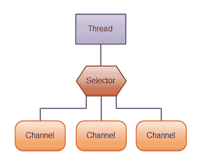

# 第一章 第 7 节 Java 基础-7

> 原文：[`www.nowcoder.com/tutorial/10070/13c65690305f4a6fae41663f655c232e`](https://www.nowcoder.com/tutorial/10070/13c65690305f4a6fae41663f655c232e)

## 3\. IO

#### 3.1 介绍一下 Java 中的 IO 流

**参考答案**

IO（Input Output）用于实现对数据的输入与输出操作，Java 把不同的输入/输出源（键盘、文件、网络等）抽象表述为流（Stream）。流是从起源到接收的有序数据，有了它程序就可以采用同一方式访问不同的输入/输出源。

*   按照数据流向，可以将流分为输入流和输出流，其中输入流只能读取数据、不能写入数据，而输出流只能写入数据、不能读取数据。
*   按照数据类型，可以将流分为字节流和字符流，其中字节流操作的数据单元是 8 位的字节，而字符流操作的数据单元是 16 位的字符。
*   按照处理功能，可以将流分为节点流和处理流，其中节点流可以直接从/向一个特定的 IO 设备（磁盘、网络等）读/写数据，也称为低级流，而处理流是对节点流的连接或封装，用于简化数据读/写功能或提高效率，也称为高级流。

Java 提供了大量的类来支持 IO 操作，下表给大家整理了其中比较常用的一些类。其中，黑色字体的是抽象基类，其他所有的类都继承自它们。红色字体的是节点流，蓝色字体的是处理流。

根据命名很容易理解各个流的作用：

*   以 File 开头的文件流用于访问文件；
*   以 ByteArray/CharArray 开头的流用于访问内存中的数组；
*   以 Piped 开头的管道流用于访问管道，实现进程之间的通信；
*   以 String 开头的流用于访问内存中的字符串；
*   以 Buffered 开头的缓冲流，用于在读写数据时对数据进行缓存，以减少 IO 次数；
*   InputStreamReader、InputStreamWriter 是转换流，用于将字节流转换为字符流；
*   以 Object 开头的流是对象流，用于实现对象的序列化；
*   以 Print 开头的流是打印流，用于简化打印操作；
*   以 Pushback 开头的流是推回输入流，用于将已读入的数据推回到缓冲区，从而实现再次读取；
*   以 Data 开头的流是特殊流，用于读写 Java 基本类型的数据。

#### 3.2 怎么用流打开一个大文件？

**参考答案**

打开大文件，应避免直接将文件中的数据全部读取到内存中，可以采用分次读取的方式。

1.  使用缓冲流。缓冲流内部维护了一个缓冲区，通过与缓冲区的交互，减少与设备的交互次数。使用缓冲输入流时，它每次会读取一批数据将缓冲区填满，每次调用读取方法并不是直接从设备取值，而是从缓冲区取值，当缓冲区为空时，它会再一次读取数据，将缓冲区填满。使用缓冲输出流时，每次调用写入方法并不是直接写入到设备，而是写入缓冲区，当缓冲区填满时它会自动刷入设备。
2.  使用 NIO。NIO 采用内存映射文件的方式来处理输入/输出，NIO 将文件或文件的一段区域映射到内存中，这样就可以像访问内存一样来访问文件了（这种方式模拟了操作系统上的虚拟内存的概念），通过这种方式来进行输入/输出比传统的输入/输出要快得多。

#### 3.4 说说 NIO 的实现原理

**参考答案**

Java 的 NIO 主要由三个核心部分组成：Channel、Buffer、Selector。

基本上，所有的 IO 在 NIO 中都从一个 Channel 开始，数据可以从 Channel 读到 Buffer 中，也可以从 Buffer 写到 Channel 中。Channel 有好几种类型，其中比较常用的有 FileChannel、DatagramChannel、SocketChannel、ServerSocketChannel 等，这些通道涵盖了 UDP 和 TCP 网络 IO 以及文件 IO。

Buffer 本质上是一块可以写入数据，然后可以从中读取数据的内存。这块内存被包装成 NIO Buffer 对象，并提供了一组方法，用来方便的访问该块内存。Java NIO 里关键的 Buffer 实现有 CharBuffer、ByteBuffer、ShortBuffer、IntBuffer、LongBuffer、FloatBuffer、DoubleBuffer。这些 Buffer 覆盖了你能通过 IO 发送的基本数据类型，即 byte、short、int、long、float、double、char。

Buffer 对象包含三个重要的属性，分别是 capacity、position、limit，其中 position 和 limit 的含义取决于 Buffer 处在读模式还是写模式。但不管 Buffer 处在什么模式，capacity 的含义总是一样的。

*   capacity：作为一个内存块，Buffer 有个固定的最大值，就是 capacity。Buffer 只能写 capacity 个数据，一旦 Buffer 满了，需要将其清空才能继续写数据往里写数据。
*   position：当写数据到 Buffer 中时，position 表示当前的位置。初始的 position 值为 0。当一个数据写到 Buffer 后， position 会向前移动到下一个可插入数据的 Buffer 单元。position 最大可为 capacity–1。当读取数据时，也是从某个特定位置读。当将 Buffer 从写模式切换到读模式，position 会被重置为 0。当从 Buffer 的 position 处读取数据时，position 向前移动到下一个可读的位置。
*   limit：在写模式下，Buffer 的 limit 表示最多能往 Buffer 里写多少数据，此时 limit 等于 capacity。当切换 Buffer 到读模式时， limit 表示你最多能读到多少数据，此时 limit 会被设置成写模式下的 position 值。

三个属性之间的关系，如下图所示：

Selector 允许单线程处理多个 Channel，如果你的应用打开了多个连接（通道），但每个连接的流量都很低，使用 Selector 就会很方便。要使用 Selector，得向 Selector 注册 Channel，然后调用它的 select()方法。这个方法会一直阻塞到某个注册的通道有事件就绪。一旦这个方法返回，线程就可以处理这些事件，事件例如有新连接进来，数据接收等。

这是在一个单线程中使用一个 Selector 处理 3 个 Channel 的图示：

**扩展阅读**

Java NIO 根据操作系统不同， 针对 NIO 中的 Selector 有不同的实现：

*   macosx：KQueueSelectorProvider
*   solaris：DevPollSelectorProvider
*   Linux：EPollSelectorProvider (Linux kernels >= 2.6)或 PollSelectorProvider
*   windows：WindowsSelectorProvider

所以不需要特别指定，Oracle JDK 会自动选择合适的 Selector。如果想设置特定的 Selector，可以设置属性，例如： -Djava.nio.channels.spi.SelectorProvider=sun.nio.ch.EPollSelectorProvider。

JDK 在 Linux 已经默认使用 epoll 方式，但是 JDK 的 epoll 采用的是水平触发，所以 Netty 自 4.0.16 起, Netty 为 Linux 通过 JNI 的方式提供了 native socket transport。Netty 重新实现了 epoll 机制。

1.  采用边缘触发方式；
2.  netty epoll transport 暴露了更多的 nio 没有的配置参数，如 TCP_CORK, SO_REUSEADDR 等等；
3.  C 代码，更少 GC，更少 synchronized。

#### 3.5 介绍一下 Java 的序列化与反序列化

**参考答案**

序列化机制可以将对象转换成字节序列，这些字节序列可以保存在磁盘上，也可以在网络中传输，并允许程序将这些字节序列再次恢复成原来的对象。其中，对象的序列化（Serialize），是指将一个 Java 对象写入 IO 流中，对象的反序列化（Deserialize），则是指从 IO 流中恢复该 Java 对象。

若对象要支持序列化机制，则它的类需要实现 Serializable 接口，该接口是一个标记接口，它没有提供任何方法，只是标明该类是可以序列化的，Java 的很多类已经实现了 Serializable 接口，如包装类、String、Date 等。

若要实现序列化，则需要使用对象流 ObjectInputStream 和 ObjectOutputStream。其中，在序列化时需要调用 ObjectOutputStream 对象的 writeObject()方法，以输出对象序列。在反序列化时需要调用 ObjectInputStream 对象的 readObject()方法，将对象序列恢复为对象。

#### 3.6 Serializable 接口为什么需要定义 serialVersionUID 变量？

**参考答案**

serialVersionUID 代表序列化的版本，通过定义类的序列化版本，在反序列化时，只要对象中所存的版本和当前类的版本一致，就允许做恢复数据的操作，否则将会抛出序列化版本不一致的错误。

如果不定义序列化版本，在反序列化时可能出现冲突的情况，例如：

1.  创建该类的实例，并将这个实例序列化，保存在磁盘上；
2.  升级这个类，例如增加、删除、修改这个类的成员变量；
3.  反序列化该类的实例，即从磁盘上恢复修改之前保存的数据。

在第 3 步恢复数据的时候，当前的类已经和序列化的数据的格式产生了冲突，可能会发生各种意想不到的问题。增加了序列化版本之后，在这种情况下则可以抛出异常，以提示这种矛盾的存在，提高数据的安全性。

#### 3.7 除了 Java 自带的序列化之外，你还了解哪些序列化工具？

**参考答案**

*   JSON：目前使用比较频繁的格式化数据工具，简单直观，可读性好，有 jackson，gson，fastjson 等等，比较优秀的 JSON 解析工具的表现还是比较好的，有些 json 解析工具甚至速度超过了一些二进制的序列化方式。
*   Protobuf：一个用来序列化结构化数据的技术，支持多种语言诸如 C++、Java 以及 Python 语言，可以使用该技术来持久化数据或者序列化成网络传输的数据。相比较一些其他的 XML 技术而言，该技术的一个明显特点就是更加节省空间（以二进制流存储）、速度更快以及更加灵活。另外 Protobuf 支持的数据类型相对较少，不支持常量类型。由于其设计的理念是纯粹的展现层协议（Presentation Layer），目前并没有一个专门支持 Protobuf 的 RPC 框架。
*   Thrift：是 Facebook 开源提供的一个高性能，轻量级 RPC 服务框架，其产生正是为了满足当前大数据量、分布式、跨语言、跨平台数据通讯的需求。 但是，Thrift 并不仅仅是序列化协议，而是一个 RPC 框架。 相对于 JSON 和 XML 而言，Thrift 在空间开销和解析性能上有了比较大的提升，对于对性能要求比较高的分布式系统，它是一个优秀的 RPC 解决方案。但是由于 Thrift 的序列化被嵌入到 Thrift 框架里面， Thrift 框架本身并没有透出序列化和反序列化接口，这导致其很难和其他传输层协议共同使用（例如 HTTP）。
*   Avro：提供两种序列化格式，即 JSON 格式或者 Binary 格式。Binary 格式在空间开销和解析性能方面可以和 Protobuf 媲美， JSON 格式方便测试阶段的调试。 Avro 支持的数据类型非常丰富，包括 C++语言里面的 union 类型。Avro 支持 JSON 格式的 IDL 和类似于 Thrift 和 Protobuf 的 IDL（实验阶段），这两者之间可以互转。Schema 可以在传输数据的同时发送，加上 JSON 的自我描述属性，这使得 Avro 非常适合动态类型语言。 Avro 在做文件持久化的时候，一般会和 Schema 一起存储，所以 Avro 序列化文件自身具有自我描述属性，所以非常适合于做 Hive、Pig 和 MapReduce 的持久化数据格式。对于不同版本的 Schema，在进行 RPC 调用的时候，服务端和客户端可以在握手阶段对 Schema 进行互相确认，大大提高了最终的数据解析速度。

#### 3.8 如果不用 JSON 工具，该如何实现对实体类的序列化？

**参考答案**

可以使用 Java 原生的序列化机制，但是效率比较低一些，适合小项目；

可以使用其他的一些第三方类库，比如 Protobuf、Thrift、Avro 等。

## 4\. 多线程

#### 4.1 创建线程有哪几种方式？

**参考答案**

创建线程有三种方式，分别是继承 Thread 类、实现 Runnable 接口、实现 Callable 接口。

通过继承 Thread 类来创建并启动线程的步骤如下：

1.  定义 Thread 类的子类，并重写该类的 run()方法，该 run()方法将作为线程执行体。
2.  创建 Thread 子类的实例，即创建了线程对象。
3.  调用线程对象的 start()方法来启动该线程。

通过实现 Runnable 接口来创建并启动线程的步骤如下：

1.  定义 Runnable 接口的实现类，并实现该接口的 run()方法，该 run()方法将作为线程执行体。
2.  创建 Runnable 实现类的实例，并将其作为 Thread 的 target 来创建 Thread 对象，Thread 对象为线程对象。
3.  调用线程对象的 start()方法来启动该线程。

通过实现 Callable 接口来创建并启动线程的步骤如下：

1.  创建 Callable 接口的实现类，并实现 call()方法，该 call()方法将作为线程执行体，且该 call()方法有返回值。然后再创建 Callable 实现类的实例。
2.  使用 FutureTask 类来包装 Callable 对象，该 FutureTask 对象封装了该 Callable 对象的 call()方法的返回值。
3.  使用 FutureTask 对象作为 Thread 对象的 target 创建并启动新线程。
4.  调用 FutureTask 对象的 get()方法来获得子线程执行结束后的返回值。

**扩展阅读**

通过继承 Thread 类、实现 Runnable 接口、实现 Callable 接口都可以实现多线程，不过实现 Runnable 接口与实现 Callable 接口的方式基本相同，只是 Callable 接口里定义的方法有返回值，可以声明抛出异常而已。因此可以将实现 Runnable 接口和实现 Callable 接口归为一种方式。

采用实现 Runnable、Callable 接口的方式创建多线程的优缺点：

*   线程类只是实现了 Runnable 接口或 Callable 接口，还可以继承其他类。
*   在这种方式下，多个线程可以共享同一个 target 对象，所以非常适合多个相同线程来处理同一份资源的情况，从而可以将 CPU、代码和数据分开，形成清晰的模型，较好地体现了面向对象的思想。
*   劣势是，编程稍稍复杂，如果需要访问当前线程，则必须使用 Thread.currentThread()方法。

采用继承 Thread 类的方式创建多线程的优缺点：

*   劣势是，因为线程类已经继承了 Thread 类，所以不能再继承其他父类。
*   优势是，编写简单，如果需要访问当前线程，则无须使用 Thread.currentThread()方法，直接使用 this 即可获得当前线程。

鉴于上面分析，因此一般推荐采用实现 Runnable 接口、Callable 接口的方式来创建多线程。