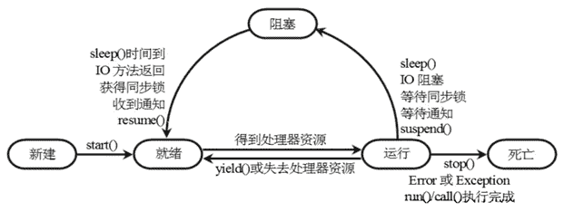
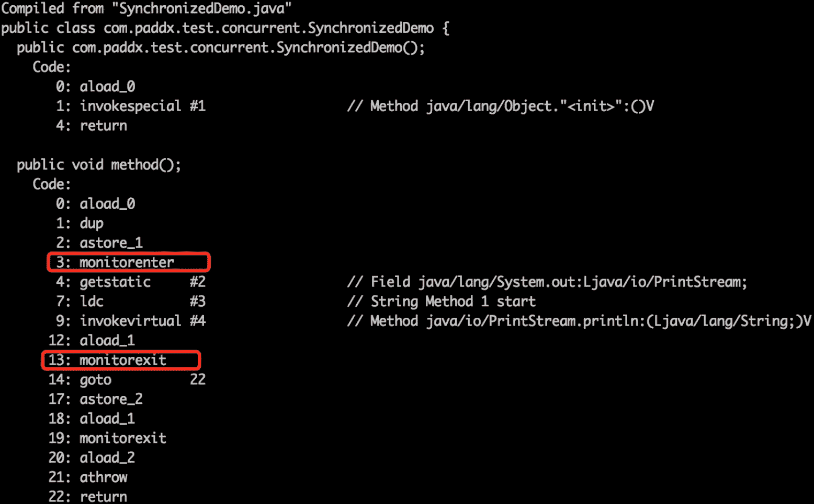
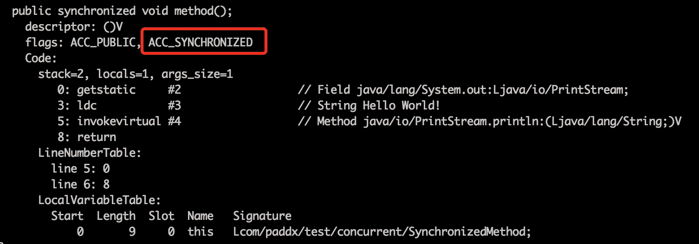

# 第一章 第 8 节 Java 基础-8

> 原文：[`www.nowcoder.com/tutorial/10070/8e17f06a7a004931a3b1cc308015a50b`](https://www.nowcoder.com/tutorial/10070/8e17f06a7a004931a3b1cc308015a50b)

#### 4.2 说说 Thread 类的常用方法

**参考答案**

Thread 类常用构造方法：

*   Thread()
*   Thread(String name)
*   Thread(Runnable target)
*   Thread(Runnable target, String name)

*其中，参数 name 为线程名，参数 target 为包含线程体的目标对象。*

Thread 类常用静态方法：

*   currentThread()：返回当前正在执行的线程；
*   interrupted()：返回当前执行的线程是否已经被中断；
*   sleep(long millis)：使当前执行的线程睡眠多少毫秒数；
*   yield()：使当前执行的线程自愿暂时放弃对处理器的使用权并允许其他线程执行；

Thread 类常用实例方法：

*   getId()：返回该线程的 id；
*   getName()：返回该线程的名字；
*   getPriority()：返回该线程的优先级；
*   interrupt()：使该线程中断；
*   isInterrupted()：返回该线程是否被中断；
*   isAlive()：返回该线程是否处于活动状态；
*   isDaemon()：返回该线程是否是守护线程；
*   setDaemon(boolean on)：将该线程标记为守护线程或用户线程，如果不标记默认是非守护线程；
*   setName(String name)：设置该线程的名字；
*   setPriority(int newPriority)：改变该线程的优先级；
*   join()：等待该线程终止；
*   join(long millis)：等待该线程终止,至多等待多少毫秒数。

#### 4.3 run()和 start()有什么区别？

**参考答案**

run()方法被称为线程执行体，它的方法体代表了线程需要完成的任务，而 start()方法用来启动线程。

调用 start()方法启动线程时，系统会把该 run()方法当成线程执行体来处理。但如果直接调用线程对象的 run()方法，则 run()方法立即就会被执行，而且在 run()方法返回之前其他线程无法并发执行。也就是说，如果直接调用线程对象的 run()方法，系统把线程对象当成一个普通对象，而 run()方法也是一个普通方法，而不是线程执行体。

#### 4.4 线程是否可以重复启动，会有什么后果？

**参考答案**

只能对处于新建状态的线程调用 start()方法，否则将引发 IllegalThreadStateException 异常。

**扩展阅读**

当程序使用 new 关键字创建了一个线程之后，该线程就处于新建状态，此时它和其他的 Java 对象一样，仅仅由 Java 虚拟机为其分配内存，并初始化其成员变量的值。此时的线程对象没有表现出任何线程的动态特征，程序也不会执行线程的线程执行体。

当线程对象调用了 start()方法之后，该线程处于就绪状态，Java 虚拟机会为其创建方法调用栈和程序计数器，处于这个状态中的线程并没有开始运行，只是表示该线程可以运行了。至于该线程何时开始运行，取决于 JVM 里线程调度器的调度。

#### 4.5 介绍一下线程的生命周期

**参考答案**

在线程的生命周期中，它要经过新建（New）、就绪（Ready）、运行（Running）、阻塞（Blocked）和死亡（Dead）5 种状态。尤其是当线程启动以后，它不可能一直“霸占”着 CPU 独自运行，所以 CPU 需要在多条线程之间切换，于是线程状态也会多次在运行、就绪之间切换。

当程序使用 new 关键字创建了一个线程之后，该线程就处于新建状态，此时它和其他的 Java 对象一样，仅仅由 Java 虚拟机为其分配内存，并初始化其成员变量的值。此时的线程对象没有表现出任何线程的动态特征，程序也不会执行线程的线程执行体。

当线程对象调用了 start()方法之后，该线程处于就绪状态，Java 虚拟机会为其创建方法调用栈和程序计数器，处于这个状态中的线程并没有开始运行，只是表示该线程可以运行了。至于该线程何时开始运行，取决于 JVM 里线程调度器的调度。

如果处于就绪状态的线程获得了 CPU，开始执行 run()方法的线程执行体，则该线程处于运行状态，如果计算机只有一个 CPU，那么在任何时刻只有一个线程处于运行状态。当然，在一个多处理器的机器上，将会有多个线程并行执行；当线程数大于处理器数时，依然会存在多个线程在同一个 CPU 上轮换的现象。

当一个线程开始运行后，它不可能一直处于运行状态，线程在运行过程中需要被中断，目的是使其他线程获得执行的机会，线程调度的细节取决于底层平台所采用的策略。对于采用抢占式策略的系统而言，系统会给每个可执行的线程一个小时间段来处理任务。当该时间段用完后，系统就会剥夺该线程所占用的资源，让其他线程获得执行的机会。当发生如下情况时，线程将会进入阻塞状态：

*   线程调用 sleep()方法主动放弃所占用的处理器资源。
*   线程调用了一个阻塞式 IO 方法，在该方法返回之前，该线程被阻塞。
*   线程试图获得一个同步监视器，但该同步监视器正被其他线程所持有。
*   线程在等待某个通知（notify）。
*   程序调用了线程的 suspend()方法将该线程挂起。但这个方法容易导致死锁，所以应该尽量避免使用该方法。

针对上面几种情况，当发生如下特定的情况时可以解除上面的阻塞，让该线程重新进入就绪状态：

*   调用 sleep()方法的线程经过了指定时间。
*   线程调用的阻塞式 IO 方法已经返回。
*   线程成功地获得了试图取得的同步监视器。
*   线程正在等待某个通知时，其他线程发出了一个通知。
*   处于挂起状态的线程被调用了 resume()恢复方法。

线程会以如下三种方式结束，结束后就处于死亡状态：

*   run()或 call()方法执行完成，线程正常结束。
*   线程抛出一个未捕获的 Exception 或 Error。
*   直接调用该线程的 stop()方法来结束该线程，该方法容易导致死锁，通常不推荐使用。

**扩展阅读**

线程 5 种状态的转换关系，如下图所示：



#### 4.6 如何实现线程同步？

**参考答案**

1.  同步方法

    即有 synchronized 关键字修饰的方法，由于 java 的每个对象都有一个内置锁，当用此关键字修饰方法时， 内置锁会保护整个方法。在调用该方法前，需要获得内置锁，否则就处于阻塞状态。需要注意， synchronized 关键字也可以修饰静态方法，此时如果调用该静态方法，将会锁住整个类。

2.  同步代码块

    即有 synchronized 关键字修饰的语句块，被该关键字修饰的语句块会自动被加上内置锁，从而实现同步。需值得注意的是，同步是一种高开销的操作，因此应该尽量减少同步的内容。通常没有必要同步整个方法，使用 synchronized 代码块同步关键代码即可。

3.  ReentrantLock

    Java 5 新增了一个 java.util.concurrent 包来支持同步，其中 ReentrantLock 类是可重入、互斥、实现了 Lock 接口的锁，它与使用 synchronized 方法和快具有相同的基本行为和语义，并且扩展了其能力。需要注意的是，ReentrantLock 还有一个可以创建公平锁的构造方法，但由于能大幅度降低程序运行效率，因此不推荐使用。

4.  volatile

    volatile 关键字为域变量的访问提供了一种免锁机制，使用 volatile 修饰域相当于告诉虚拟机该域可能会被其他线程更新，因此每次使用该域就要重新计算，而不是使用寄存器中的值。需要注意的是，volatile 不会提供任何原子操作，它也不能用来修饰 final 类型的变量。

5.  原子变量

    在 java 的 util.concurrent.atomic 包中提供了创建了原子类型变量的工具类，使用该类可以简化线程同步。例如 AtomicInteger 表可以用原子方式更新 int 的值，可用在应用程序中（如以原子方式增加的计数器），但不能用于替换 Integer。可扩展 Number，允许那些处理机遇数字类的工具和实用工具进行统一访问。

#### 4.7 说一说 Java 多线程之间的通信方式

**参考答案**

在 Java 中线程通信主要有以下三种方式：

1.  wait()、notify()、notifyAll()

    如果线程之间采用 synchronized 来保证线程安全，则可以利用 wait()、notify()、notifyAll()来实现线程通信。这三个方法都不是 Thread 类中所声明的方法，而是 Object 类中声明的方法。原因是每个对象都拥有锁，所以让当前线程等待某个对象的锁，当然应该通过这个对象来操作。并且因为当前线程可能会等待多个线程的锁，如果通过线程来操作，就非常复杂了。另外，这三个方法都是本地方法，并且被 final 修饰，无法被重写。

    wait()方法可以让当前线程释放对象锁并进入阻塞状态。notify()方法用于唤醒一个正在等待相应对象锁的线程，使其进入就绪队列，以便在当前线程释放锁后竞争锁，进而得到 CPU 的执行。notifyAll()用于唤醒所有正在等待相应对象锁的线程，使它们进入就绪队列，以便在当前线程释放锁后竞争锁，进而得到 CPU 的执行。

    每个锁对象都有两个队列，一个是就绪队列，一个是阻塞队列。就绪队列存储了已就绪（将要竞争锁）的线程，阻塞队列存储了被阻塞的线程。当一个阻塞线程被唤醒后，才会进入就绪队列，进而等待 CPU 的调度。反之，当一个线程被 wait 后，就会进入阻塞队列，等待被唤醒。

2.  await()、signal()、signalAll()

    如果线程之间采用 Lock 来保证线程安全，则可以利用 await()、signal()、signalAll()来实现线程通信。这三个方法都是 Condition 接口中的方法，该接口是在 Java 1.5 中出现的，它用来替代传统的 wait+notify 实现线程间的协作，它的使用依赖于 Lock。相比使用 wait+notify，使用 Condition 的 await+signal 这种方式能够更加安全和高效地实现线程间协作。

    Condition 依赖于 Lock 接口，生成一个 Condition 的基本代码是 lock.newCondition() 。 必须要注意的是，Condition 的 await()/signal()/signalAll() 使用都必须在 lock 保护之内，也就是说，必须在 lock.lock()和 lock.unlock 之间才可以使用。事实上，await()/signal()/signalAll() 与 wait()/notify()/notifyAll()有着天然的对应关系。即：Conditon 中的 await()对应 Object 的 wait()，Condition 中的 signal()对应 Object 的 notify()，Condition 中的 signalAll()对应 Object 的 notifyAll()。

3.  BlockingQueue

    Java 5 提供了一个 BlockingQueue 接口，虽然 BlockingQueue 也是 Queue 的子接口，但它的主要用途并不是作为容器，而是作为线程通信的工具。BlockingQueue 具有一个特征：当生产者线程试图向 BlockingQueue 中放入元素时，如果该队列已满，则该线程被阻塞；当消费者线程试图从 BlockingQueue 中取出元素时，如果该队列已空，则该线程被阻塞。

    程序的两个线程通过交替向 BlockingQueue 中放入元素、取出元素，即可很好地控制线程的通信。线程之间需要通信，最经典的场景就是生产者与消费者模型，而 BlockingQueue 就是针对该模型提供的解决方案。

#### 4.8 说一说 Java 同步机制中的 wait 和 notify

**参考答案**

wait()、notify()、notifyAll()用来实现线程之间的通信，这三个方法都不是 Thread 类中所声明的方法，而是 Object 类中声明的方法。原因是每个对象都拥有锁，所以让当前线程等待某个对象的锁，当然应该通过这个对象来操作。并且因为当前线程可能会等待多个线程的锁，如果通过线程来操作，就非常复杂了。另外，这三个方法都是本地方法，并且被 final 修饰，无法被重写，并且只有采用 synchronized 实现线程同步时才能使用这三个方法。

wait()方法可以让当前线程释放对象锁并进入阻塞状态。notify()方法用于唤醒一个正在等待相应对象锁的线程，使其进入就绪队列，以便在当前线程释放锁后竞争锁，进而得到 CPU 的执行。notifyAll()方法用于唤醒所有正在等待相应对象锁的线程，使它们进入就绪队列，以便在当前线程释放锁后竞争锁，进而得到 CPU 的执行。

每个锁对象都有两个队列，一个是就绪队列，一个是阻塞队列。就绪队列存储了已就绪（将要竞争锁）的线程，阻塞队列存储了被阻塞的线程。当一个阻塞线程被唤醒后，才会进入就绪队列，进而等待 CPU 的调度。反之，当一个线程被 wait 后，就会进入阻塞队列，等待被唤醒。

#### 4.9 说一说 sleep()和 wait()的区别

**参考答案**

1.  sleep()是 Thread 类中的静态方法，而 wait()是 Object 类中的成员方法；
2.  sleep()可以在任何地方使用，而 wait()只能在同步方法或同步代码块中使用；
3.  sleep()不会释放锁，而 wait()会释放锁，并需要通过 notify()/notifyAll()重新获取锁。

#### 4.10 说一说 notify()、notifyAll()的区别

**参考答案**

*   notify()

    用于唤醒一个正在等待相应对象锁的线程，使其进入就绪队列，以便在当前线程释放锁后竞争锁，进而得到 CPU 的执行。

*   notifyAll()

    用于唤醒所有正在等待相应对象锁的线程，使它们进入就绪队列，以便在当前线程释放锁后竞争锁，进而得到 CPU 的执行。

#### 4.11 如何实现子线程先执行，主线程再执行？

**参考答案**

启动子线程后，立即调用该线程的 join()方法，则主线程必须等待子线程执行完成后再执行。

**扩展阅读**

Thread 类提供了让一个线程等待另一个线程完成的方法——join()方法。当在某个程序执行流中调用其他线程的 join()方法时，调用线程将被阻塞，直到被 join()方法加入的 join 线程执行完为止。

join()方法通常由使用线程的程序调用，以将大问题划分成许多小问题，每个小问题分配一个线程。当所有的小问题都得到处理后，再调用主线程来进一步操作。

#### 4.12 阻塞线程的方式有哪些？

**参考答案**

当发生如下情况时，线程将会进入阻塞状态：

*   线程调用 sleep()方法主动放弃所占用的处理器资源；
*   线程调用了一个阻塞式 IO 方法，在该方法返回之前，该线程被阻塞；
*   线程试图获得一个同步监视器，但该同步监视器正被其他线程所持有；
*   线程在等待某个通知（notify）；
*   程序调用了线程的 suspend()方法将该线程挂起，但这个方法容易导致死锁，所以应该尽量避免使用该方法。

#### 4.13 说一说 synchronized 与 Lock 的区别

**参考答案**

1.  synchronized 是 Java 关键字，在 JVM 层面实现加锁和解锁；Lock 是一个接口，在代码层面实现加锁和解锁。
2.  synchronized 可以用在代码块上、方法上；Lock 只能写在代码里。
3.  synchronized 在代码执行完或出现异常时自动释放锁；Lock 不会自动释放锁，需要在 finally 中显示释放锁。
4.  synchronized 会导致线程拿不到锁一直等待；Lock 可以设置获取锁失败的超时时间。
5.  synchronized 无法得知是否获取锁成功；Lock 则可以通过 tryLock 得知加锁是否成功。
6.  synchronized 锁可重入、不可中断、非公平；Lock 锁可重入、可中断、可公平/不公平，并可以细分读写锁以提高效率。

#### 4.14 说一说 synchronized 的底层实现原理

**参考答案**

一、以下列代码为例，说明同步代码块的底层实现原理：

```cpp
public class SynchronizedDemo {
    public void method() {
        synchronized (this) {
            System.out.println("Method 1 start");
        }
    }
}
```

查看反编译后结果，如下图：



可见，synchronized 作用在代码块时，它的底层是通过 monitorenter、monitorexit 指令来实现的。

*   monitorenter：

    每个对象都是一个监视器锁（monitor），当 monitor 被占用时就会处于锁定状态，线程执行 monitorenter 指令时尝试获取 monitor 的所有权，过程如下：

    如果 monitor 的进入数为 0，则该线程进入 monitor，然后将进入数设置为 1，该线程即为 monitor 的所有者。如果线程已经占有该 monitor，只是重新进入，则进入 monitor 的进入数加 1。如果其他线程已经占用了 monitor，则该线程进入阻塞状态，直到 monitor 的进入数为 0，再重新尝试获取 monitor 的所有权。

*   monitorexit：

    执行 monitorexit 的线程必须是 objectref 所对应的 monitor 持有者。指令执行时，monitor 的进入数减 1，如果减 1 后进入数为 0，那线程退出 monitor，不再是这个 monitor 的所有者。其他被这个 monitor 阻塞的线程可以尝试去获取这个 monitor 的所有权。

    monitorexit 指令出现了两次，第 1 次为同步正常退出释放锁，第 2 次为发生异步退出释放锁。

二、以下列代码为例，说明同步方法的底层实现原理：

```cpp
public class SynchronizedMethod {
    public synchronized void method() {
        System.out.println("Hello World!");
    }
}
```

查看反编译后结果，如下图：



从反编译的结果来看，方法的同步并没有通过 monitorenter 和 monitorexit 指令来完成，不过相对于普通方法，其常量池中多了 ACC_SYNCHRONIZED 标示符。JVM 就是根据该标示符来实现方法的同步的：

当方法调用时，调用指令将会检查方法的 ACC_SYNCHRONIZED 访问标志是否被设置，如果设置了，执行线程将先获取 monitor，获取成功之后才能执行方法体，方法执行完后再释放 monitor。在方法执行期间，其他任何线程都无法再获得同一个 monitor 对象。

三、总结

两种同步方式本质上没有区别，只是方法的同步是一种隐式的方式来实现，无需通过字节码来完成。两个指令的执行是 JVM 通过调用操作系统的互斥原语 mutex 来实现，被阻塞的线程会被挂起、等待重新调度，会导致“用户态和内核态”两个态之间来回切换，对性能有较大影响。

#### 4.15 synchronized 可以修饰静态方法和静态代码块吗？

**参考答案**

synchronized 可以修饰静态方法，但不能修饰静态代码块。

当修饰静态方法时，监视器锁（monitor）便是对象的 Class 实例，因为 Class 数据存在于永久代，因此静态方法锁相当于该类的一个全局锁。