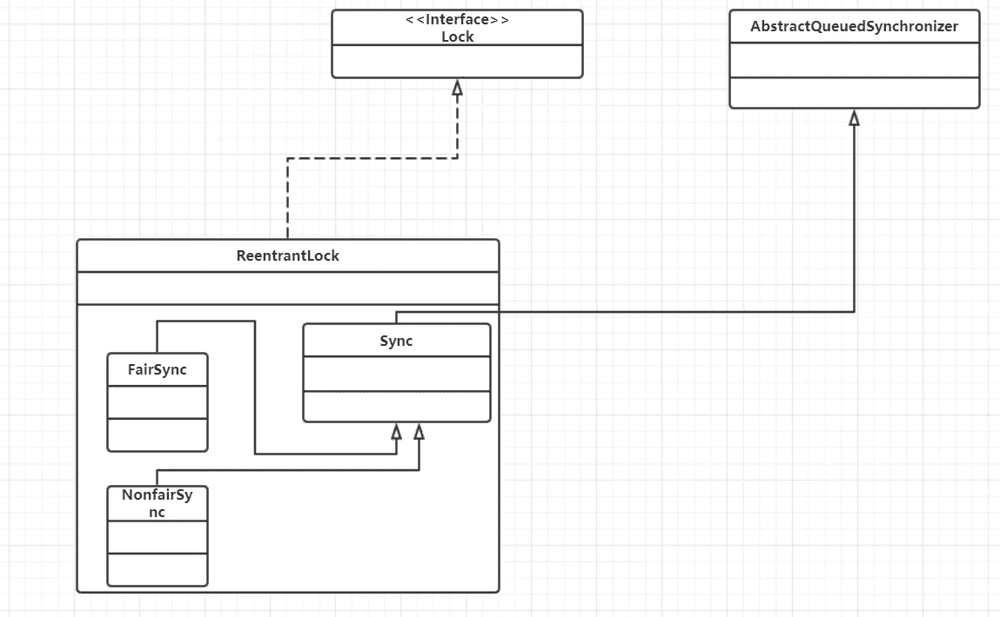
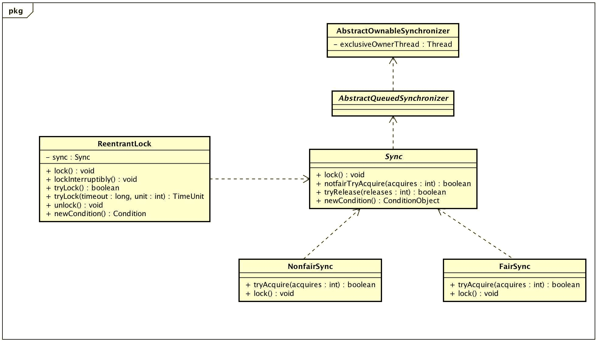
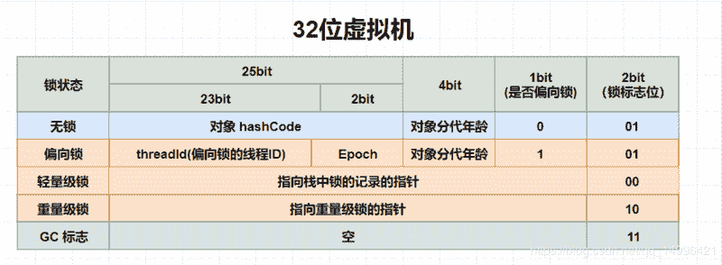
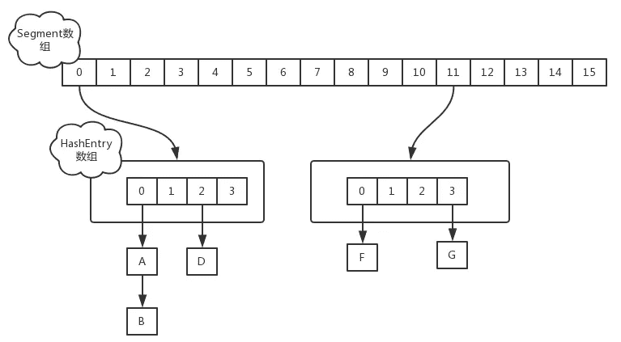
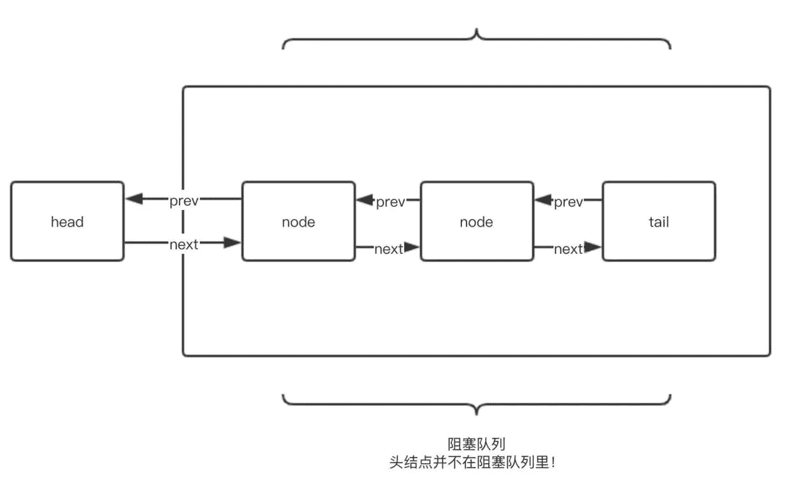

# 第一章 第 9 节 Java 基础-9

> 原文：[`www.nowcoder.com/tutorial/10070/4da94dcd5a894ee9832b955d31654c5c`](https://www.nowcoder.com/tutorial/10070/4da94dcd5a894ee9832b955d31654c5c)

#### 4.16 谈谈 ReentrantLock 的实现原理

**参考答案**

`ReentrantLock`是基于`AQS`实现的，`AQS`即`AbstractQueuedSynchronizer`的缩写，这个是个内部实现了两个队列的抽象类，分别是同步队列和条件队列。其中同步队列是一个双向链表，里面储存的是处于等待状态的线程，正在排队等待唤醒去获取锁，而条件队列是一个单向链表，里面储存的也是处于等待状态的线程，只不过这些线程唤醒的结果是加入到了同步队列的队尾，`AQS`所做的就是管理这两个队列里面线程之间的等待状态-唤醒的工作。

在同步队列中，还存在`2`中模式，分别是独占模式和共享模式，这两种模式的区别就在于`AQS`在唤醒线程节点的时候是不是传递唤醒，这两种模式分别对应独占锁和共享锁。

`AQS`是一个抽象类，所以不能直接实例化，当我们需要实现一个自定义锁的时候可以去继承`AQS`然后重写获取锁的方式和释放锁的方式还有管理 state，而`ReentrantLock`就是通过重写了`AQS`的`tryAcquire`和`tryRelease`方法实现的`lock`和`unlock`。

`ReentrantLock` 结构如下图所示：



首先`ReentrantLock` 实现了 `Lock` 接口，然后有`3`个内部类，其中`Sync`内部类继承自`AQS`，另外的两个内部类继承自`Sync`，这两个类分别是用来公平锁和非公平锁的。通过`Sync`重写的方法`tryAcquire`、`tryRelease`可以知道，`ReentrantLock`实现的是`AQS`的独占模式，也就是独占锁，这个锁是悲观锁。

#### 4.17 如果不使用 synchronized 和 Lock，如何保证线程安全？

**参考答案**

1.  volatile

    volatile 关键字为域变量的访问提供了一种免锁机制，使用 volatile 修饰域相当于告诉虚拟机该域可能会被其他线程更新，因此每次使用该域就要重新计算，而不是使用寄存器中的值。需要注意的是，volatile 不会提供任何原子操作，它也不能用来修饰 final 类型的变量。

2.  原子变量

    在 java 的 util.concurrent.atomic 包中提供了创建了原子类型变量的工具类，使用该类可以简化线程同步。例如 AtomicInteger 表可以用原子方式更新 int 的值，可用在应用程序中（如以原子方式增加的计数器），但不能用于替换 Integer。可扩展 Number，允许那些处理机遇数字类的工具和实用工具进行统一访问。

3.  本地存储

    可以通过 ThreadLocal 类来实现线程本地存储的功能。每一个线程的 Thread 对象中都有一个 ThreadLocalMap 对象，这个对象存储了一组以 ThreadLocal.threadLocalHashCode 为键，以本地线程变量为值的 K-V 值对，ThreadLocal 对象就是当前线程的 ThreadLocalMap 的访问入口，每一个 ThreadLocal 对象都包含了一个独一无二的 threadLocalHashCode 值，使用这个值就可以在线程 K-V 值对中找回对应的本地线程变量。

4.  不可变的

    只要一个不可变的对象被正确地构建出来，那其外部的可见状态永远都不会改变，永远都不会看到它在多个线程之中处于不一致的状态，“不可变”带来的安全性是最直接、最纯粹的。Java 语言中，如果多线程共享的数据是一个基本数据类型，那么只要在定义时使用 final 关键字修饰它就可以保证它是不可变的。如果共享数据是一个对象，由于 Java 语言目前暂时还没有提供值类型的支持，那就需要对象自行保证其行为不会对其状态产生任何影响才行。String 类是一个典型的不可变类，可以参考它设计一个不可变类。

#### 4.18 说一说 Java 中乐观锁和悲观锁的区别

**参考答案**

悲观锁：总是假设最坏的情况，每次去拿数据的时候都认为别人会修改，所以每次在拿数据的时候都会上锁，这样别人想拿这个数据就会阻塞直到它拿到锁。Java 中悲观锁是通过 synchronized 关键字或 Lock 接口来实现的。

乐观锁：顾名思义，就是很乐观，每次去拿数据的时候都认为别人不会修改，所以不会上锁，但是在更新的时候会判断一下在此期间别人有没有去更新这个数据。乐观锁适用于多读的应用类型，这样可以提高吞吐量。在 JDK1.5 中新增 java.util.concurrent (J.U.C)就是建立在 CAS 之上的。相对于对于 synchronized 这种阻塞算法，CAS 是非阻塞算法的一种常见实现。所以 J.U.C 在性能上有了很大的提升。

#### 4.19 公平锁与非公平锁是怎么实现的？

**参考答案**

在 Java 中实现锁的方式有两种，一种是使用 Java 自带的关键字 synchronized 对相应的类或者方法以及代码块进行加锁，另一种是 ReentrantLock，前者只能是非公平锁，而后者是默认非公平但可实现公平的一把锁。

ReentrantLock 是基于其内部类 FairSync(公平锁)和 NonFairSync(非公平锁)实现的，并且它的实现依赖于 Java 同步器框架 AbstractQueuedSynchronizer（AQS），AQS 使用一个整形的 volatile 变量 state 来维护同步状态，这个 volatile 变量是实现 ReentrantLock 的关键。我们来看一下 ReentrantLock 的类图：



ReentrantLock 的公平锁和非公平锁都委托了 `AbstractQueuedSynchronizer#acquire` 去请求获取。

```cpp
public final void acquire(int arg) {
    if (!tryAcquire(arg) &&
        acquireQueued(addWaiter(Node.EXCLUSIVE), arg))
        selfInterrupt();
}
```

*   tryAcquire 是一个抽象方法，是公平与非公平的实现原理所在。
*   addWaiter 是将当前线程结点加入等待队列之中。公平锁在锁释放后会严格按照等到队列去取后续值，而非公平锁在对于新晋线程有很大优势。
*   acquireQueued 在多次循环中尝试获取到锁或者将当前线程阻塞。
*   selfInterrupt 如果线程在阻塞期间发生了中断，调用 Thread.currentThread().interrupt() 中断当前线程。

公平锁和非公平锁在说的获取上都使用到了 volatile 关键字修饰的 state 字段， 这是保证多线程环境下锁的获取与否的核心。但是当并发情况下多个线程都读取到 `state == 0`时，则必须用到 CAS 技术，一门 CPU 的原子锁技术，可通过 CPU 对共享变量加锁的形式，实现数据变更的原子操作。volatile 和 CAS 的结合是并发抢占的关键。

*   公平锁 FairSync

    公平锁的实现机理在于每次有线程来抢占锁的时候，都会检查一遍有没有等待队列，如果有， 当前线程会执行如下步骤：

    ```cpp
    if (!hasQueuedPredecessors() && compareAndSetState(0, acquires)) {         
        setExclusiveOwnerThread(current);
        return true; 
    }
    ```

    其中 hasQueuedPredecessors 是用于检查是否有等待队列的：

    ```cpp
    public final boolean hasQueuedPredecessors() {
        Node t = tail; // Read fields in reverse initialization order
        Node h = head;
        Node s;
        return h != t &&
            ((s = h.next) == null || s.thread != Thread.currentThread());
    }
    ```

*   非公平锁 NonfairSync

    非公平锁在实现的时候多次强调随机抢占：

    ```cpp
    if (c == 0) {
        if (compareAndSetState(0, acquires)) {
            setExclusiveOwnerThread(current);
            return true; 
        }
    } 
    ```

    与公平锁的区别在于新晋获取锁的进程会有多次机会去抢占锁，被加入了等待队列后则跟公平锁没有区别。

#### 4.20 了解 Java 中的锁升级吗？

**参考答案**

JDK 1.6 之前，synchronized 还是一个重量级锁，是一个效率比较低下的锁。但是在 JDK 1.6 后，JVM 为了提高锁的获取与释放效率对 synchronized 进行了优化，引入了偏向锁和轻量级锁 ，从此以后锁的状态就有了四种：无锁、偏向锁、轻量级锁、重量级锁。并且四种状态会随着竞争的情况逐渐升级，而且是不可逆的过程，即不可降级，这四种锁的级别由低到高依次是：无锁、偏向锁，轻量级锁，重量级锁。如下图所示：


1.  无锁

    无锁是指没有对资源进行锁定，所有的线程都能访问并修改同一个资源，但同时只有一个线程能修改成功。无锁的特点是修改操作会在循环内进行，线程会不断的尝试修改共享资源。如果没有冲突就修改成功并退出，否则就会继续循环尝试。如果有多个线程修改同一个值，必定会有一个线程能修改成功，而其他修改失败的线程会不断重试直到修改成功。

2.  偏向锁

    初次执行到 synchronized 代码块的时候，锁对象变成偏向锁（通过 CAS 修改对象头里的锁标志位），字面意思是“偏向于第一个获得它的线程”的锁。执行完同步代码块后，线程并不会主动释放偏向锁。当第二次到达同步代码块时，线程会判断此时持有锁的线程是否就是自己（持有锁的线程 ID 也在对象头里），如果是则正常往下执行。由于之前没有释放锁，这里也就不需要重新加锁。如果自始至终使用锁的线程只有一个，很明显偏向锁几乎没有额外开销，性能极高。

    偏向锁是指当一段同步代码一直被同一个线程所访问时，即不存在多个线程的竞争时，那么该线程在后续访问时便会自动获得锁，从而降低获取锁带来的消耗，即提高性能。

    当一个线程访问同步代码块并获取锁时，会在 Mark Word 里存储锁偏向的线程 ID。在线程进入和退出同步块时不再通过 CAS 操作来加锁和解锁，而是检测 Mark Word 里是否存储着指向当前线程的偏向锁。轻量级锁的获取及释放依赖多次 CAS 原子指令，而偏向锁只需要在置换 ThreadID 的时候依赖一次 CAS 原子指令即可。

    偏向锁只有遇到其他线程尝试竞争偏向锁时，持有偏向锁的线程才会释放锁，线程是不会主动释放偏向锁的。关于偏向锁的撤销，需要等待全局安全点，即在某个时间点上没有字节码正在执行时，它会先暂停拥有偏向锁的线程，然后判断锁对象是否处于被锁定状态。如果线程不处于活动状态，则将对象头设置成无锁状态，并撤销偏向锁，恢复到无锁（标志位为 01）或轻量级锁（标志位为 00）的状态。

3.  轻量级锁

    轻量级锁是指当锁是偏向锁的时候，却被另外的线程所访问，此时偏向锁就会升级为轻量级锁，其他线程会通过自旋的形式尝试获取锁，线程不会阻塞，从而提高性能。

    轻量级锁的获取主要由两种情况：

    1.  当关闭偏向锁功能时；
    2.  由于多个线程竞争偏向锁导致偏向锁升级为轻量级锁。

    一旦有第二个线程加入锁竞争，偏向锁就升级为轻量级锁（自旋锁）。这里要明确一下什么是锁竞争：如果多个线程轮流获取一个锁，但是每次获取锁的时候都很顺利，没有发生阻塞，那么就不存在锁竞争。只有当某线程尝试获取锁的时候，发现该锁已经被占用，只能等待其释放，这才发生了锁竞争。

    在轻量级锁状态下继续锁竞争，没有抢到锁的线程将自旋，即不停地循环判断锁是否能够被成功获取。获取锁的操作，其实就是通过 CAS 修改对象头里的锁标志位。先比较当前锁标志位是否为“释放”，如果是则将其设置为“锁定”，比较并设置是原子性发生的。这就算抢到锁了，然后线程将当前锁的持有者信息修改为自己。

    长时间的自旋操作是非常消耗资源的，一个线程持有锁，其他线程就只能在原地空耗 CPU，执行不了任何有效的任务，这种现象叫做忙等（busy-waiting）。如果多个线程用一个锁，但是没有发生锁竞争，或者发生了很轻微的锁竞争，那么 synchronized 就用轻量级锁，允许短时间的忙等现象。这是一种折衷的想法，短时间的忙等，换取线程在用户态和内核态之间切换的开销。

4.  重量级锁

    重量级锁显然，此忙等是有限度的（有个计数器记录自旋次数，默认允许循环 10 次，可以通过虚拟机参数更改）。如果锁竞争情况严重，某个达到最大自旋次数的线程，会将轻量级锁升级为重量级锁（依然是 CAS 修改锁标志位，但不修改持有锁的线程 ID）。当后续线程尝试获取锁时，发现被占用的锁是重量级锁，则直接将自己挂起（而不是忙等），等待将来被唤醒。

    重量级锁是指当有一个线程获取锁之后，其余所有等待获取该锁的线程都会处于阻塞状态。简言之，就是所有的控制权都交给了操作系统，由操作系统来负责线程间的调度和线程的状态变更。而这样会出现频繁地对线程运行状态的切换，线程的挂起和唤醒，从而消耗大量的系统资。

**扩展阅读**

synchronized 用的锁是存在 Java 对象头里的，那么什么是对象头呢？我们以 Hotspot 虚拟机为例进行说明，Hopspot 对象头主要包括两部分数据：Mark Word（标记字段） 和 Klass Pointer（类型指针）。

*   Mark Word：默认存储对象的 HashCode，分代年龄和锁标志位信息。这些信息都是与对象自身定义无关的数据，所以 Mark Word 被设计成一个非固定的数据结构以便在极小的空间内存存储尽量多的数据。它会根据对象的状态复用自己的存储空间，也就是在运行期间 Mark Word 里存储的数据会随着锁标志位的变化而变化。

*   Klass Point：对象指向它的类元数据的指针，虚拟机通过这个指针来确定这个对象是哪个类的实例。

那么，synchronized 具体是存在对象头哪里呢？答案是：存在锁对象的对象头的 Mark Word 中，那么 MarkWord 在对象头中到底长什么样，它到底存储了什么呢？

在 64 位的虚拟机中：


在 32 位的虚拟机中：



下面我们以 32 位虚拟机为例，来看一下其 Mark Word 的字节具体是如何分配的：

*   无锁 ：对象头开辟 25bit 的空间用来存储对象的 hashcode ，4bit 用于存放对象分代年龄，1bit 用来存放是否偏向锁的标识位，2bit 用来存放锁标识位为 01。
*   偏向锁： 在偏向锁中划分更细，还是开辟 25bit 的空间，其中 23bit 用来存放线程 ID，2bit 用来存放 Epoch，4bit 存放对象分代年龄，1bit 存放是否偏向锁标识， 0 表示无锁，1 表示偏向锁，锁的标识位还是 01。
*   轻量级锁：在轻量级锁中直接开辟 30bit 的空间存放指向栈中锁记录的指针，2bit 存放锁的标志位，其标志位为 00。
*   重量级锁： 在重量级锁中和轻量级锁一样，30bit 的空间用来存放指向重量级锁的指针，2bit 存放锁的标识位，为 11。
*   GC 标记： 开辟 30bit 的内存空间却没有占用，2bit 空间存放锁标志位为 11。

其中无锁和偏向锁的锁标志位都是 01，只是在前面的 1bit 区分了这是无锁状态还是偏向锁状态。关于内存的分配，我们可以在 git 中 openJDK 中 markOop.hpp 可以看出：

```cpp
public:
  // Constants
  enum { age_bits          = 4,
         lock_bits         = 2,
         biased_lock_bits  = 1,
         max_hash_bits     = BitsPerWord - age_bits - lock_bits - biased_lock_bits,
         hash_bits         = max_hash_bits > 31 ? 31 : max_hash_bits,
         cms_bits          = LP64_ONLY(1) NOT_LP64(0),
         epoch_bits        = 2
  };
```

*   age_bits： 就是我们说的分代回收的标识，占用 4 字节。
*   lock_bits： 是锁的标志位，占用 2 个字节。
*   biased_lock_bits： 是是否偏向锁的标识，占用 1 个字节。
*   max_hash_bits： 是针对无锁计算的 hashcode 占用字节数量，如果是 32 位虚拟机，就是 32 - 4 - 2 -1 = 25 byte，如果是 64 位虚拟机，64 - 4 - 2 - 1 = 57 byte，但是会有 25 字节未使用，所以 64 位的 hashcode 占用 31 byte。
*   hash_bits： 是针对 64 位虚拟机来说，如果最大字节数大于 31，则取 31，否则取真实的字节数。
*   cms_bits： 不是 64 位虚拟机就占用 0 byte，是 64 位就占用 1byte。
*   epoch_bits： 就是 epoch 所占用的字节大小，2 字节。

#### 4.21 如何实现互斥锁（mutex）？

**参考答案**

在 Java 里面，最基本的互斥同步手段就是 synchronized 关键字，这是一种块结构（Block Structured）的同步语法。synchronized 关键字经过 Javac 编译之后，会在同步块的前后分别形成 monitorenter 和 monitorexit 这两个字节码指令。这两个字节码指令都需要一个 reference 类型的参数来指明要锁定和解锁的对象。如果 Java 源码中的 synchronized 明确指定了对象参数，那就以这个对象的引用作为 reference。如果没有明确指定，那将根据 synchronized 修饰的方法类型（如实例方法或类方法），来决定是取代码所在的对象实例还是取类型对应的 Class 对象来作为线程要持有的锁。

自 JDK 5 起，Java 类库中新提供了 java.util.concurrent 包（J.U.C 包），其中的 java.util.concurrent.locks.Lock 接口便成了 Java 的另一种全新的互斥同步手段。基于 Lock 接口，用户能够以非块结构（Non-Block Structured）来实现互斥同步，从而摆脱了语言特性的束缚，改为在类库层面去实现同步，这也为日后扩展出不同调度算法、不同特征、不同性能、不同语义的各种锁提供了广阔的空间。

#### 4.22 分段锁是怎么实现的？

**参考答案**

在并发程序中，串行操作是会降低可伸缩性，并且上下文切换也会减低性能。在锁上发生竞争时将通水导致这两种问题，使用独占锁时保护受限资源的时候，基本上是采用串行方式—-每次只能有一个线程能访问它。所以对于可伸缩性来说最大的威胁就是独占锁。

我们一般有三种方式降低锁的竞争程度：

1.  减少锁的持有时间；
2.  降低锁的请求频率；
3.  使用带有协调机制的独占锁，这些机制允许更高的并发性。

在某些情况下我们可以将锁分解技术进一步扩展为一组独立对象上的锁进行分解，这称为分段锁。其实说的简单一点就是：容器里有多把锁，每一把锁用于锁容器其中一部分数据，那么当多线程访问容器里不同数据段的数据时，线程间就不会存在锁竞争，从而可以有效的提高并发访问效率，这就是 ConcurrentHashMap 所使用的锁分段技术，首先将数据分成一段一段的存储，然后给每一段数据配一把锁，当一个线程占用锁访问其中一个段数据的时候，其他段的数据也能被其他线程访问。

如下图，ConcurrentHashMap 使用 Segment 数据结构，将数据分成一段一段的存储，然后给每一段数据配一把锁，当一个线程占用锁访问其中一个段数据的时候，其他段的数据也能被其他线程访问，能够实现真正的并发访问。所以说，ConcurrentHashMap 在并发情况下，不仅保证了线程安全，而且提高了性能。



#### 4.23 说说你对读写锁的了解

**参考答案**

与传统锁不同的是读写锁的规则是可以共享读，但只能一个写，总结起来为：读读不互斥、读写互斥、写写互斥，而一般的独占锁是：读读互斥、读写互斥、写写互斥，而场景中往往读远远大于写，读写锁就是为了这种优化而创建出来的一种机制。
注意是读远远大于写，一般情况下独占锁的效率低来源于高并发下对临界区的激烈竞争导致线程上下文切换。因此当并发不是很高的情况下，读写锁由于需要额外维护读锁的状态，可能还不如独占锁的效率高。因此需要根据实际情况选择使用。

在 Java 中`ReadWriteLock`的主要实现为`ReentrantReadWriteLock`，其提供了以下特性：

1.  公平性选择：支持公平与非公平（默认）的锁获取方式，吞吐量非公平优先于公平。
2.  可重入：读线程获取读锁之后可以再次获取读锁，写线程获取写锁之后可以再次获取写锁。
3.  可降级：写线程获取写锁之后，其还可以再次获取读锁，然后释放掉写锁，那么此时该线程是读锁状态，也就是降级操作。

#### 4.24 volatile 关键字有什么用？

**参考答案**

当一个变量被定义成 volatile 之后，它将具备两项特性：

1.  保证可见性

    当写一个 volatile 变量时，JMM 会把该线程本地内存中的变量强制刷新到主内存中去，这个写会操作会导致其他线程中的 volatile 变量缓存无效。

2.  禁止指令重排

    使用 volatile 关键字修饰共享变量可以禁止指令重排序，volatile 禁止指令重排序有一些规则：

    *   当程序执行到 volatile 变量的读操作或者写操作时，在其前面的操作的更改肯定全部已经进行，且结果已经对后面的操作可见，在其后面的操作肯定还没有进行；
    *   在进行指令优化时，不能将对 volatile 变量访问的语句放在其后面执行，也不能把 volatile 变量后面的语句放到其前面执行。

    即执行到 volatile 变量时，其前面的所有语句都执行完，后面所有语句都未执行。且前面语句的结果对 volatile 变量及其后面语句可见。

注意，虽然 volatile 能够保证可见性，但它不能保证原子性。volatile 变量在各个线程的工作内存中是不存在一致性问题的，但是 Java 里面的运算操作符并非原子操作，这导致 volatile 变量的运算在并发下一样是不安全的。

#### 4.25 谈谈 volatile 的实现原理

**参考答案**

volatile 可以保证线程可见性且提供了一定的有序性，但是无法保证原子性。在 JVM 底层 volatile 是采用“内存屏障”来实现的。观察加入 volatile 关键字和没有加入 volatile 关键字时所生成的汇编代码发现，加入 volatile 关键字时，会多出一个 lock 前缀指令，lock 前缀指令实际上相当于一个内存屏障，内存屏障会提供 3 个功能：

1.  它确保指令重排序时不会把其后面的指令排到内存屏障之前的位置，也不会把前面的指令排到内存屏障的后面；即在执行到内存屏障这句指令时，在它前面的操作已经全部完成；
2.  它会强制将对缓存的修改操作立即写入主存；
3.  如果是写操作，它会导致其他 CPU 中对应的缓存行无效。

#### 4.26 说说你对 JUC 的了解

**参考答案**

JUC 是 java.util.concurrent 的缩写，该包参考自 EDU.oswego.cs.dl.util.concurrent，是 JSR 166 标准规范的一个实现。JSR 166 是一个关于 Java 并发编程的规范提案，在 JDK 中该规范由 java.util.concurrent 包实现。即 JUC 是 Java 提供的并发包，其中包含了一些并发编程用到的基础组件。

JUC 这个包下的类基本上包含了我们在并发编程时用到的一些工具，大致可以分为以下几类：

*   原子更新

    Java 从 JDK1.5 开始提供了 java.util.concurrent.atomic 包，方便程序员在多线程环 境下，无锁的进行原子操作。在 Atomic 包里一共有 12 个类，四种原子更新方式，分别是原子更新基本类型，原子更新 数组，原子更新引用和原子更新字段。

*   锁和条件变量

    java.util.concurrent.locks 包下包含了同步器的框架 AbstractQueuedSynchronizer，基于 AQS 构建的 Lock 以及与 Lock 配合可以实现等待/通知模式的 Condition。JUC 下的大多数工具类用到了 Lock 和 Condition 来实现并发。

*   线程池

    涉及到的类比如：Executor、Executors、ThreadPoolExector、 AbstractExecutorService、Future、Callable、ScheduledThreadPoolExecutor 等等。

*   阻塞队列

    涉及到的类比如：ArrayBlockingQueue、LinkedBlockingQueue、PriorityBlockingQueue、LinkedBlockingDeque 等等。

*   并发容器

    涉及到的类比如：ConcurrentHashMap、CopyOnWriteArrayList、ConcurrentLinkedQueue、CopyOnWriteArraySet 等等。

*   同步器

    剩下的是一些在并发编程中时常会用到的工具类，主要用来协助线程同步。比如：CountDownLatch、CyclicBarrier、Exchanger、Semaphore、FutureTask 等等。

#### 4.27 说说你对 AQS 的理解

**参考答案**

抽象队列同步器 AbstractQueuedSynchronizer （以下都简称 AQS），是用来构建锁或者其他同步组件的骨架类，减少了各功能组件实现的代码量，也解决了在实现同步器时涉及的大量细节问题，例如等待线程采用 FIFO 队列操作的顺序。在不同的同步器中还可以定义一些灵活的标准来判断某个线程是应该通过还是等待。

AQS 采用模板方法模式，在内部维护了 n 多的模板的方法的基础上，子类只需要实现特定的几个方法（不是抽象方法！不是抽象方法！不是抽象方法！），就可以实现子类自己的需求。

基于 AQS 实现的组件，诸如：

*   ReentrantLock 可重入锁（支持公平和非公平的方式获取锁）；
*   Semaphore 计数信号量;
*   ReentrantReadWriteLock 读写锁。

**扩展阅读**

AQS 内部维护了一个 int 成员变量来表示同步状态，通过内置的 FIFO(first-in-first-out)同步队列来控制获取共享资源的线程。

我们可以猜测出，AQS 其实主要做了这么几件事情：

*   同步状态（state）的维护管理；
*   等待队列的维护管理；
*   线程的阻塞与唤醒。

通过 AQS 内部维护的 int 型的 state，可以用于表示任意状态！

*   ReentrantLock 用它来表示锁的持有者线程已经重复获取该锁的次数，而对于非锁的持有者线程来说，如果 state 大于 0，意味着无法获取该锁，将该线程包装为 Node，加入到同步等待队列里。
*   Semaphore 用它来表示剩余的许可数量，当许可数量为 0 时，对未获取到许可但正在努力尝试获取许可的线程来说，会进入同步等待队列，阻塞，直到一些线程释放掉持有的许可（state+1），然后争用释放掉的许可。
*   FutureTask 用它来表示任务的状态（未开始、运行中、完成、取消）。
*   ReentrantReadWriteLock 在使用时，稍微有些不同，int 型 state 用二进制表示是 32 位，前 16 位（高位）表示为读锁，后面的 16 位（低位）表示为写锁。
*   CountDownLatch 使用 state 表示计数次数，state 大于 0，表示需要加入到同步等待队列并阻塞，直到 state 等于 0，才会逐一唤醒等待队列里的线程。

AQS 通过内置的 FIFO(first-in-first-out)同步队列来控制获取共享资源的线程。CLH 队列是 FIFO 的双端双向队列，AQS 的同步机制就是依靠这个 CLH 队列完成的。队列的每个节点，都有前驱节点指针和后继节点指针。如下图：



#### 4.28 LongAdder 解决了什么问题，它是如何实现的？

**参考答案**

高并发下计数，一般最先想到的应该是 AtomicLong/AtomicInt，AtmoicXXX 使用硬件级别的指令 CAS 来更新计数器的值，这样可以避免加锁，机器直接支持的指令，效率也很高。但是 AtomicXXX 中的 CAS 操作在出现线程竞争时，失败的线程会白白地循环一次，在并发很大的情况下，因为每次 CAS 都只有一个线程能成功，竞争失败的线程会非常多。失败次数越多，循环次数就越多，很多线程的 CAS 操作越来越接近 自旋锁（spin lock）。计数操作本来是一个很简单的操作，实际需要耗费的 cpu 时间应该是越少越好，AtomicXXX 在高并发计数时，大量的 cpu 时间都浪费会在 自旋 上了，这很浪费，也降低了实际的计数效率。

LongAdder 是 jdk8 新增的用于并发环境的计数器，目的是为了在高并发情况下，代替 AtomicLong/AtomicInt，成为一个用于高并发情况下的高效的通用计数器。说 LongAdder 比在高并发时比 AtomicLong 更高效，这么说有什么依据呢？LongAdder 是根据锁分段来实现的，它里面维护一组按需分配的计数单元，并发计数时，不同的线程可以在不同的计数单元上进行计数，这样减少了线程竞争，提高了并发效率。本质上是用空间换时间的思想，不过在实际高并发情况中消耗的空间可以忽略不计。

现在，在处理高并发计数时，应该优先使用 LongAdder，而不是继续使用 AtomicLong。当然，线程竞争很低的情况下进行计数，使用 Atomic 还是更简单更直接，并且效率稍微高一些。其他情况，比如序号生成，这种情况下需要准确的数值，全局唯一的 AtomicLong 才是正确的选择，此时不应该使用 LongAdder。

#### 4.29 介绍下 ThreadLocal 和它的应用场景

**参考答案**

ThreadLocal 顾名思义是线程私有的局部变量存储容器，可以理解成每个线程都有自己专属的存储容器，它用来存储线程私有变量，其实它只是一个外壳，内部真正存取是一个 Map。每个线程可以通过`set()`和`get()`存取变量，多线程间无法访问各自的局部变量，相当于在每个线程间建立了一个隔板。只要线程处于活动状态，它所对应的 ThreadLocal 实例就是可访问的，线程被终止后，它的所有实例将被垃圾收集。总之记住一句话：ThreadLocal 存储的变量属于当前线程。

ThreadLocal 经典的使用场景是为每个线程分配一个 JDBC 连接 Connection，这样就可以保证每个线程的都在各自的 Connection 上进行数据库的操作，不会出现 A 线程关了 B 线程正在使用的 Connection。 另外 ThreadLocal 还经常用于管理 Session 会话，将 Session 保存在 ThreadLocal 中，使线程处理多次处理会话时始终是同一个 Session。

#### 4.30 请介绍 ThreadLocal 的实现原理，它是怎么处理 hash 冲突的？

**参考答案**

Thread 类中有个变量 threadLocals，它的类型为 ThreadLocal 中的一个内部类 ThreadLocalMap，这个类没有实现 map 接口，就是一个普通的 Java 类，但是实现的类似 map 的功能。每个线程都有自己的一个 map，map 是一个数组的数据结构存储数据，每个元素是一个 Entry，entry 的 key 是 ThreadLocal 的引用，也就是当前变量的副本，value 就是 set 的值。代码如下所示：

```cpp
public class Thread implements Runnable {
    /* ThreadLocal values pertaining to this thread. This map is maintained
     * by the ThreadLocal class. */
    ThreadLocal.ThreadLocalMap threadLocals = null;    
}
```

ThreadLocalMap 是 ThreadLocal 的内部类，每个数据用 Entry 保存，其中的 Entry 继承与 WeakReference，用一个键值对存储，键为 ThreadLocal 的引用。为什么是 WeakReference 呢？如果是强引用，即使把 ThreadLocal 设置为 null，GC 也不会回收，因为 ThreadLocalMap 对它有强引用。代码如下所示：

```cpp
static class Entry extends WeakReference<ThreadLocal<?>> {
    /** The value associated with this ThreadLocal. */
    Object value;

    Entry(ThreadLocal<?> k, Object v) {
        super(k);
        value = v;
    }
}
```

ThreadLocal 中的 set 方法的实现逻辑，先获取当前线程，取出当前线程的 ThreadLocalMap，如果不存在就会创建一个 ThreadLocalMap，如果存在就会把当前的 threadlocal 的引用作为键，传入的参数作为值存入 map 中。代码如下所示：

```cpp
public void set(T value) {
    Thread t = Thread.currentThread();
    ThreadLocalMap map = getMap(t);
    if (map != null) {
        map.set(this, value);
    } else {
        createMap(t, value);
    }
}
```

ThreadLocal 中 get 方法的实现逻辑，获取当前线程，取出当前线程的 ThreadLocalMap，用当前的 threadlocak 作为 key 在 ThreadLocalMap 查找，如果存在不为空的 Entry，就返回 Entry 中的 value，否则就会执行初始化并返回默认的值。代码如下所示：

```cpp
public T get() {
    Thread t = Thread.currentThread();
    ThreadLocalMap map = getMap(t);
    if (map != null) {
        ThreadLocalMap.Entry e = map.getEntry(this);
        if (e != null) {
            @SuppressWarnings("unchecked")
            T result = (T)e.value;
            return result;
        }
    }
    return setInitialValue();
}
```

ThreadLocal 中 remove 方法的实现逻辑，还是先获取当前线程的 ThreadLocalMap 变量，如果存在就调用 ThreadLocalMap 的 remove 方法。ThreadLocalMap 的存储就是数组的实现，因此需要确定元素的位置，找到 Entry，把 entry 的键值对都设为 null，最后也 Entry 也设置为 null。其实这其中会有哈希冲突，具体见下文。代码如下所示：

```cpp
public void remove() {
    ThreadLocalMap m = getMap(Thread.currentThread());
    if (m != null) {
        m.remove(this);
    }
}
```

ThreadLocal 中的 hash code 非常简单，就是调用 AtomicInteger 的 getAndAdd 方法，参数是个固定值`0x61c88647`。上面说过 ThreadLocalMap 的结构非常简单只用一个数组存储，并没有链表结构，当出现 Hash 冲突时采用线性查找的方式，所谓线性查找，就是根据初始 key 的 hashcode 值确定元素在 table 数组中的位置，如果发现这个位置上已经有其他 key 值的元素被占用，则利用固定的算法寻找一定步长的下个位置，依次判断，直至找到能够存放的位置。如果产生多次 hash 冲突，处理起来就没有 HashMap 的效率高，为了避免哈希冲突，使用尽量少的 threadlocal 变量。