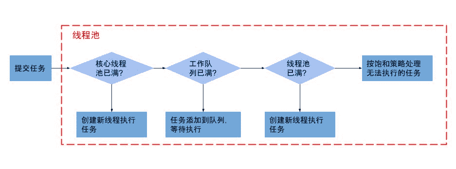
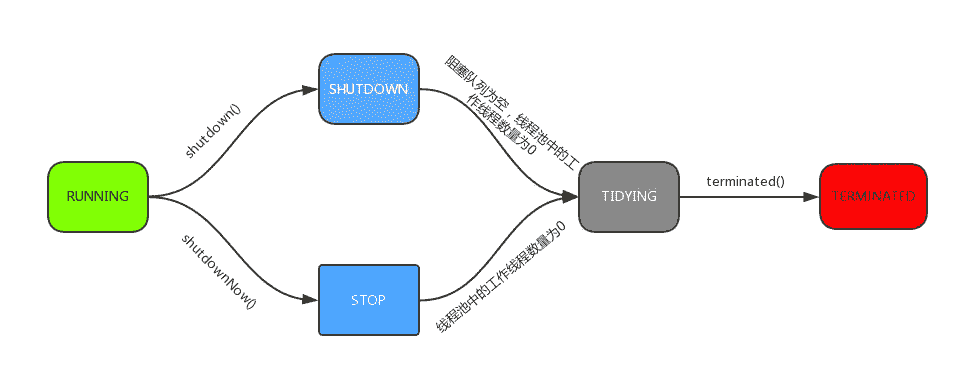
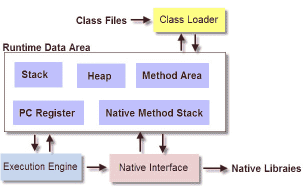
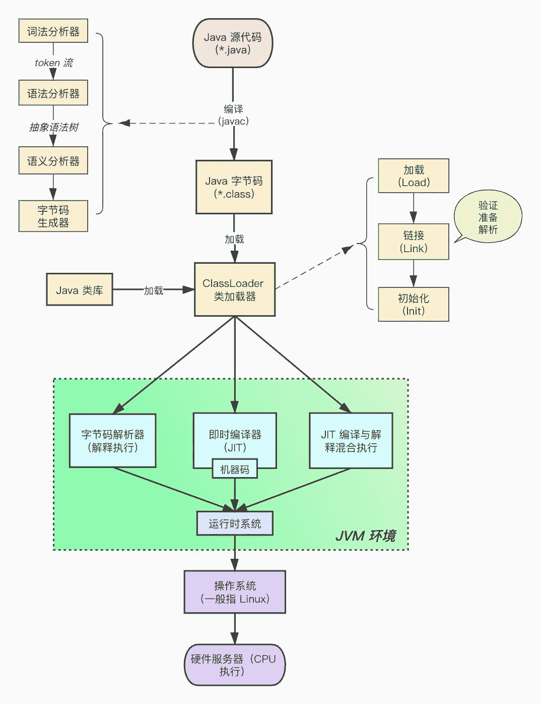
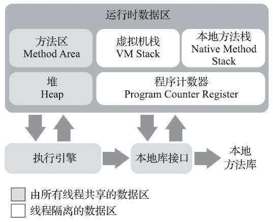

# 第一章 第 10 节 Java 基础-10

> 原文：[`www.nowcoder.com/tutorial/10070/696bcc9771624f388347704377b7e113`](https://www.nowcoder.com/tutorial/10070/696bcc9771624f388347704377b7e113)

#### 4.31 介绍一下线程池

**参考答案**

系统启动一个新线程的成本是比较高的，因为它涉及与操作系统交互。在这种情形下，使用线程池可以很好地提高性能，尤其是当程序中需要创建大量生存期很短暂的线程时，更应该考虑使用线程池。

与数据库连接池类似的是，线程池在系统启动时即创建大量空闲的线程，程序将一个 Runnable 对象或 Callable 对象传给线程池，线程池就会启动一个空闲的线程来执行它们的 run()或 call()方法，当 run()或 call()方法执行结束后，该线程并不会死亡，而是再次返回线程池中成为空闲状态，等待执行下一个 Runnable 对象的 run()或 call()方法。

从 Java 5 开始，Java 内建支持线程池。Java 5 新增了一个 Executors 工厂类来产生线程池，该工厂类包含如下几个静态工厂方法来创建线程池。创建出来的线程池，都是通过 ThreadPoolExecutor 类来实现的。

*   newCachedThreadPool()：创建一个具有缓存功能的线程池，系统根据需要创建线程，这些线程将会被缓存在线程池中。
*   newFixedThreadPool(int nThreads)：创建一个可重用的、具有固定线程数的线程池。
*   newSingleThreadExecutor()：创建一个只有单线程的线程池，它相当于调用 newFixedThread Pool()方法时传入参数为 1。
*   newScheduledThreadPool(int corePoolSize)：创建具有指定线程数的线程池，它可以在指定延迟后执行线程任务。corePoolSize 指池中所保存的线程数，即使线程是空闲的也被保存在线程池内。
*   newSingleThreadScheduledExecutor()：创建只有一个线程的线程池，它可以在指定延迟后执行线程任务。
*   ExecutorService newWorkStealingPool(int parallelism)：创建持有足够的线程的线程池来支持给定的并行级别，该方法还会使用多个队列来减少竞争。
*   ExecutorService newWorkStealingPool()：该方法是前一个方法的简化版本。如果当前机器有 4 个 CPU，则目标并行级别被设置为 4，也就是相当于为前一个方法传入 4 作为参数。

#### 4.32 介绍一下线程池的工作流程

**参考答案**

线程池的工作流程如下图所示：

1.  判断核心线程池是否已满，没满则创建一个新的工作线程来执行任务。
2.  判断任务队列是否已满，没满则将新提交的任务添加在工作队列。
3.  判断整个线程池是否已满，没满则创建一个新的工作线程来执行任务，已满则执行饱和（拒绝）策略。

#### 4.33 线程池都有哪些状态？

**参考答案**

线程池一共有五种状态, 分别是：

1.  RUNNING ：能接受新提交的任务，并且也能处理阻塞队列中的任务。
2.  SHUTDOWN：关闭状态，不再接受新提交的任务，但却可以继续处理阻塞队列中已保存的任务。在线程池处于 RUNNING 状态时，调用 shutdown()方法会使线程池进入到该状态。
3.  STOP：不能接受新任务，也不处理队列中的任务，会中断正在处理任务的线程。在线程池处于 RUNNING 或 SHUTDOWN 状态时，调用 shutdownNow() 方法会使线程池进入到该状态。
4.  TIDYING：如果所有的任务都已终止了，workerCount (有效线程数) 为 0，线程池进入该状态后会调用 terminated() 方法进入 TERMINATED 状态。
5.  TERMINATED：在 terminated() 方法执行完后进入该状态，默认 terminated()方法中什么也没有做。进入 TERMINATED 的条件如下：
    *   线程池不是 RUNNING 状态；
    *   线程池状态不是 TIDYING 状态或 TERMINATED 状态；
    *   如果线程池状态是 SHUTDOWN 并且 workerQueue 为空；
    *   workerCount 为 0；
    *   设置 TIDYING 状态成功。

下图为线程池的状态转换过程：

#### 4.34 谈谈线程池的拒绝策略

**参考答案**

当线程池的任务缓存队列已满并且线程池中的线程数目达到 maximumPoolSize，如果还有任务到来就会采取任务拒绝策略，通常有以下四种策略：

1.  AbortPolicy：丢弃任务并抛出 RejectedExecutionException 异常。
2.  DiscardPolicy：也是丢弃任务，但是不抛出异常。
3.  DiscardOldestPolicy：丢弃队列最前面的任务，然后重新尝试执行任务（重复该过程）。
4.  CallerRunsPolicy：由调用线程处理该任务。

#### 4.35 线程池的队列大小你通常怎么设置？

**参考答案**

1.  CPU 密集型任务

    尽量使用较小的线程池，一般为 CPU 核心数+1。 因为 CPU 密集型任务使得 CPU 使用率很高，若开过多的线程数，会造成 CPU 过度切换。

2.  IO 密集型任务

    可以使用稍大的线程池，一般为 2*CPU 核心数。 IO 密集型任务 CPU 使用率并不高，因此可以让 CPU 在等待 IO 的时候有其他线程去处理别的任务，充分利用 CPU 时间。

3.  混合型任务

    可以将任务分成 IO 密集型和 CPU 密集型任务，然后分别用不同的线程池去处理。 只要分完之后两个任务的执行时间相差不大，那么就会比串行执行来的高效。因为如果划分之后两个任务执行时间有数据级的差距，那么拆分没有意义。因为先执行完的任务就要等后执行完的任务，最终的时间仍然取决于后执行完的任务，而且还要加上任务拆分与合并的开销，得不偿失。

#### 4.36 线程池有哪些参数，各个参数的作用是什么？

**参考答案**

线程池主要有如下 6 个参数：

1.  corePoolSize（核心工作线程数）：当向线程池提交一个任务时，若线程池已创建的线程数小于 corePoolSize，即便此时存在空闲线程，也会通过创建一个新线程来执行该任务，直到已创建的线程数大于或等于 corePoolSize 时。
2.  maximumPoolSize（最大线程数）：线程池所允许的最大线程个数。当队列满了，且已创建的线程数小于 maximumPoolSize，则线程池会创建新的线程来执行任务。另外，对于无界队列，可忽略该参数。
3.  keepAliveTime（多余线程存活时间）：当线程池中线程数大于核心线程数时，线程的空闲时间如果超过线程存活时间，那么这个线程就会被销毁，直到线程池中的线程数小于等于核心线程数。
4.  workQueue（队列）：用于传输和保存等待执行任务的阻塞队列。
5.  threadFactory（线程创建工厂）：用于创建新线程。threadFactory 创建的线程也是采用 new Thread()方式，threadFactory 创建的线程名都具有统一的风格：pool-m-thread-n（m 为线程池的编号，n 为线程池内的线程编号）。
6.  handler（拒绝策略）：当线程池和队列都满了，再加入线程会执行此策略。

## 5\. JVM

#### 5.1 JVM 包含哪几部分？

**参考答案**

JVM 主要由四大部分组成：ClassLoader（类加载器），Runtime Data Area（运行时数据区，内存分区），Execution Engine（执行引擎），Native Interface（本地库接口），下图可以大致描述 JVM 的结构。

JVM 是执行 Java 程序的虚拟计算机系统，那我们来看看执行过程：首先需要准备好编译好的 Java 字节码文件（即 class 文件），计算机要运行程序需要先通过一定方式（类加载器）将 class 文件加载到内存中（运行时数据区），但是字节码文件是 JVM 定义的一套指令集规范，并不能直接交给底层操作系统去执行，因此需要特定的命令解释器（执行引擎）将字节码翻译成特定的操作系统指令集交给 CPU 去执行，这个过程中会需要调用到一些不同语言为 Java 提供的接口（例如驱动、地图制作等），这就用到了本地 Native 接口（本地库接口）。

*   ClassLoader：负责加载字节码文件即 class 文件，class 文件在文件开头有特定的文件标示，并且 ClassLoader 只负责 class 文件的加载，至于它是否可以运行，则由 Execution Engine 决定。
*   Runtime Data Area：是存放数据的，分为五部分：Stack（虚拟机栈），Heap（堆），Method Area（方法区），PC Register（程序计数器），Native Method Stack（本地方法栈）。几乎所有的关于 Java 内存方面的问题，都是集中在这块。
*   Execution Engine：执行引擎，也叫 Interpreter。Class 文件被加载后，会把指令和数据信息放入内存中，Execution Engine 则负责把这些命令解释给操作系统，即将 JVM 指令集翻译为操作系统指令集。
*   Native Interface：负责调用本地接口的。他的作用是调用不同语言的接口给 JAVA 用，他会在 Native Method Stack 中记录对应的本地方法，然后调用该方法时就通过 Execution Engine 加载对应的本地 lib。原本多用于一些专业领域，如 JAVA 驱动，地图制作引擎等，现在关于这种本地方法接口的调用已经被类似于 Socket 通信，WebService 等方式取代。

#### 5.2 JVM 是如何运行的？

**参考答案**

JVM 的启动过程分为如下四个步骤：

1.  JVM 的装入环境和配置

    java.exe 负责查找 JRE，并且它会按照如下的顺序来选择 JRE：

    *   自己目录下的 JRE；
    *   父级目录下的 JRE；
    *   查注册中注册的 JRE。
2.  装载 JVM

    通过第一步找到 JVM 的路径后，Java.exe 通过 LoadJavaVM 来装入 JVM 文件。LoadLibrary 装载 JVM 动态连接库，然后把 JVM 中的到处函数 JNI_CreateJavaVM 和 JNI_GetDefaultJavaVMIntArgs 挂接到 InvocationFunction 变量的 CreateJavaVM 和 GetDafaultJavaVMInitArgs 函数指针变量上。JVM 的装载工作完成。

3.  初始化 JVM，获得本地调用接口

    调用 InvocationFunction -> CreateJavaVM，也就是 JVM 中 JNI_CreateJavaVM 方法获得 JNIEnv 结构的实例。

4.  运行 Java 程序

    JVM 运行 Java 程序的方式有两种：jar 包 与 class。

    运行 jar 的时候，java.exe 调用 GetMainClassName 函数，该函数先获得 JNIEnv 实例然后调用 JarFileJNIEnv 类中 getManifest()，从其返回的 Manifest 对象中取 getAttrebutes("Main-Class")的值，即 jar 包中文件：META-INF/MANIFEST.MF 指定的 Main-Class 的主类名作为运行的主类。之后 main 函数会调用 Java.c 中 LoadClass 方法装载该主类（使用 JNIEnv 实例的 FindClass）。

    运行 Class 的时候，main 函数直接调用 Java.c 中的 LoadClass 方法装载该类。

#### 5.3 Java 程序是怎么运行的？

**参考答案**

概括来说，写好的 Java 源代码文件经过 Java 编译器编译成字节码文件后，通过类加载器加载到内存中，才能被实例化，然后到 Java 虚拟机中解释执行，最后通过操作系统操作 CPU 执行获取结果。如下图：

#### 5.4 本地方法栈有什么用？

**参考答案**

本地方法栈（Native Method Stacks）与虚拟机栈所发挥的作用是非常相似的，其区别只是虚拟机栈为虚拟机执行 Java 方法（也就是字节码）服务，而本地方法栈则是为虚拟机使用到的本地（Native）方法服务。

《Java 虚拟机规范》对本地方法栈中方法使用的语言、使用方式与数据结构并没有任何强制规定，因此具体的虚拟机可以根据需要自由实现它，甚至有的 Java 虚拟机（譬如 Hot-Spot 虚拟机）直接就把本地方法栈和虚拟机栈合二为一。与虚拟机栈一样，本地方法栈也会在栈深度溢出或者栈扩展失败时分别抛出 StackOverflowError 和 OutOfMemoryError 异常。

#### 5.5 没有程序计数器会怎么样？

**参考答案**

没有程序计数器，Java 程序中的流程控制将无法得到正确的控制，多线程也无法正确的轮换。

**扩展阅读**

程序计数器（Program Counter Register）是一块较小的内存空间，它可以看作是当前线程所执行的字节码的行号指示器。在 Java 虚拟机的概念模型里，字节码解释器工作时就是通过改变这个计数器的值来选取下一条需要执行的字节码指令，它是程序控制流的指示器，分支、循环、跳转、异常处理、线程恢复等基础功能都需要依赖这个计数器来完成。

由于 Java 虚拟机的多线程是通过线程轮流切换、分配处理器执行时间的方式来实现的，在任何一个确定的时刻，一个处理器（对于多核处理器来说是一个内核）都只会执行一条线程中的指令。因此，为了线程切换后能恢复到正确的执行位置，每条线程都需要有一个独立的程序计数器，各条线程之间计数器互不影响，独立存储，我们称这类内存区域为“线程私有”的内存。

如果线程正在执行的是一个 Java 方法，这个计数器记录的是正在执行的虚拟机字节码指令的地址；如果正在执行的是本地（Native）方法，这个计数器值则应为空（Undefined）。此内存区域是唯一一个在《Java 虚拟机规范》中没有规定任何 OutOfMemoryError 情况的区域。

#### 5.6 说一说 Java 的内存分布情况

**参考答案**

Java 虚拟机在执行 Java 程序的过程中会把它所管理的内存划分为若干个不同的数据区域。这些区域有各自的用途，以及创建和销毁的时间，有的区域随着虚拟机进程的启动而一直存在，有些区域则是依赖用户线程的启动和结束而建立和销毁。根据《Java 虚拟机规范》的规定，Java 虚拟机所管理的内存将会包括以下几个运行时数据区域。

1.  程序计数器

    程序计数器（Program Counter Register）是一块较小的内存空间，它可以看作是当前线程所执行的字节码的行号指示器。在 Java 虚拟机的概念模型里，字节码解释器工作时就是通过改变这个计数器的值来选取下一条需要执行的字节码指令，它是程序控制流的指示器，分支、循环、跳转、异常处理、线程恢复等基础功能都需要依赖这个计数器来完成。

    由于 Java 虚拟机的多线程是通过线程轮流切换、分配处理器执行时间的方式来实现的，在任何一个确定的时刻，一个处理器（对于多核处理器来说是一个内核）都只会执行一条线程中的指令。因此，为了线程切换后能恢复到正确的执行位置，每条线程都需要有一个独立的程序计数器，各条线程之间计数器互不影响，独立存储，我们称这类内存区域为“线程私有”的内存。

    如果线程正在执行的是一个 Java 方法，这个计数器记录的是正在执行的虚拟机字节码指令的地址；如果正在执行的是本地（Native）方法，这个计数器值则应为空（Undefined）。此内存区域是唯一一个在《Java 虚拟机规范》中没有规定任何 OutOfMemoryError 情况的区域。

2.  Java 虚拟机栈

    与程序计数器一样，Java 虚拟机栈（Java Virtual Machine Stack）也是线程私有的，它的生命周期与线程相同。虚拟机栈描述的是 Java 方法执行的线程内存模型：每个方法被执行的时候，Java 虚拟机都会同步创建一个栈帧[插图]（Stack Frame）用于存储局部变量表、操作数栈、动态连接、方法出口等信息。每一个方法被调用直至执行完毕的过程，就对应着一个栈帧在虚拟机栈中从入栈到出栈的过程。

    在《Java 虚拟机规范》中，对这个内存区域规定了两类异常状况：如果线程请求的栈深度大于虚拟机所允许的深度，将抛出 StackOverflowError 异常；如果 Java 虚拟机栈容量可以动态扩展，当栈扩展时无法申请到足够的内存会抛出 OutOfMemoryError 异常。

3.  本地方法栈

    本地方法栈（Native Method Stacks）与虚拟机栈所发挥的作用是非常相似的，其区别只是虚拟机栈为虚拟机执行 Java 方法（也就是字节码）服务，而本地方法栈则是为虚拟机使用到的本地（Native）方法服务。

    《Java 虚拟机规范》对本地方法栈中方法使用的语言、使用方式与数据结构并没有任何强制规定，因此具体的虚拟机可以根据需要自由实现它，甚至有的 Java 虚拟机（譬如 Hot-Spot 虚拟机）直接就把本地方法栈和虚拟机栈合二为一。与虚拟机栈一样，本地方法栈也会在栈深度溢出或者栈扩展失败时分别抛出 StackOverflowError 和 OutOfMemoryError 异常。

4.  Java 堆

    对于 Java 应用程序来说，Java 堆（Java Heap）是虚拟机所管理的内存中最大的一块。Java 堆是被所有线程共享的一块内存区域，在虚拟机启动时创建。此内存区域的唯一目的就是存放对象实例，Java 世界里“几乎”所有的对象实例都在这里分配内存。在《Java 虚拟机规范》中对 Java 堆的描述是：“所有的对象实例以及数组都应当在堆上分配”，而这里笔者写的“几乎”是指从实现角度来看，随着 Java 语言的发展，现在已经能看到些许迹象表明日后可能出现值类型的支持，即使只考虑现在，由于即时编译技术的进步，尤其是逃逸分析技术的日渐强大，栈上分配、标量替换优化手段已经导致一些微妙的变化悄然发生，所以说 Java 对象实例都分配在堆上也渐渐变得不是那么绝对了。

    根据《Java 虚拟机规范》的规定，Java 堆可以处于物理上不连续的内存空间中，但在逻辑上它应该被视为连续的，这点就像我们用磁盘空间去存储文件一样，并不要求每个文件都连续存放。但对于大对象（典型的如数组对象），多数虚拟机实现出于实现简单、存储高效的考虑，很可能会要求连续的内存空间。

    Java 堆既可以被实现成固定大小的，也可以是可扩展的，不过当前主流的 Java 虚拟机都是按照可扩展来实现的（通过参数-Xmx 和-Xms 设定）。如果在 Java 堆中没有内存完成实例分配，并且堆也无法再扩展时，Java 虚拟机将会抛出 OutOfMemoryError 异常。

5.  方法区

    方法区（Method Area）与 Java 堆一样，是各个线程共享的内存区域，它用于存储已被虚拟机加载的类型信息、常量、静态变量、即时编译器编译后的代码缓存等数据。虽然《Java 虚拟机规范》中把方法区描述为堆的一个逻辑部分，但是它却有一个别名叫作“非堆”（Non-Heap），目的是与 Java 堆区分开来。

    根据《Java 虚拟机规范》的规定，如果方法区无法满足新的内存分配需求时，将抛出 OutOfMemoryError 异常。

6.  运行时常量池

    运行时常量池（Runtime Constant Pool）是方法区的一部分。Class 文件中除了有类的版本、字段、方法、接口等描述信息外，还有一项信息是常量池表（Constant Pool Table），用于存放编译期生成的各种字面量与符号引用，这部分内容将在类加载后存放到方法区的运行时常量池中。

    既然运行时常量池是方法区的一部分，自然受到方法区内存的限制，当常量池无法再申请到内存时会抛出 OutOfMemoryError 异常。

7.  直接内存

    直接内存（Direct Memory）并不是虚拟机运行时数据区的一部分，也不是《Java 虚拟机规范》中定义的内存区域。但是这部分内存也被频繁地使用，而且也可能导致 OutOfMemoryError 异常出现。

    显然，本机直接内存的分配不会受到 Java 堆大小的限制，但是，既然是内存，则肯定还是会受到本机总内存（包括物理内存、SWAP 分区或者分页文件）大小以及处理器寻址空间的限制，一般服务器管理员配置虚拟机参数时，会根据实际内存去设置-Xmx 等参数信息，但经常忽略掉直接内存，使得各个内存区域总和大于物理内存限制（包括物理的和操作系统级的限制），从而导致动态扩展时出现 OutOfMemoryError 异常。

#### 5.7 类存放在哪里？

**参考答案**

方法区（Method Area）与 Java 堆一样，是各个线程共享的内存区域，它用于存储已被虚拟机加载的**类型信息**、常量、静态变量、即时编译器编译后的代码缓存等数据。虽然《Java 虚拟机规范》中把方法区描述为堆的一个逻辑部分，但是它却有一个别名叫作“非堆”（Non-Heap），目的是与 Java 堆区分开来。