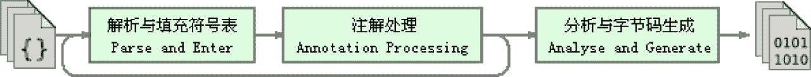
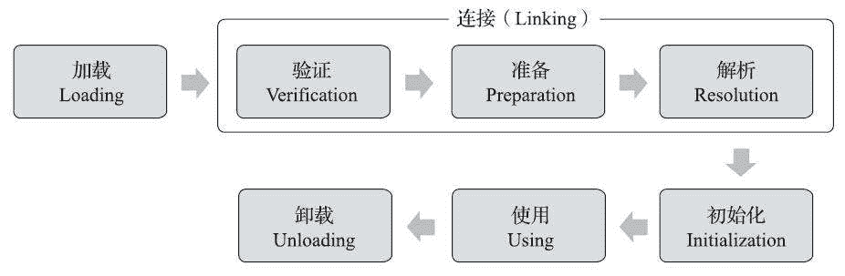
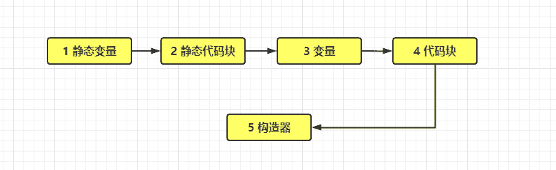
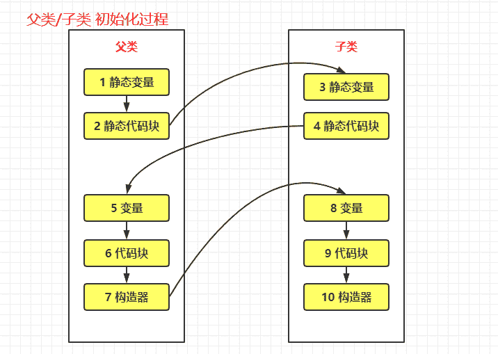
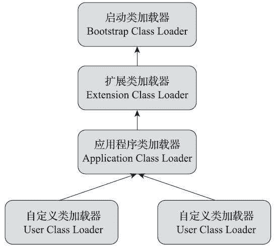

# 第一章 第 11 节 Java 基础-11

> 原文：[`www.nowcoder.com/tutorial/10070/30cc9174f7684fe09f9464a44fa391af`](https://www.nowcoder.com/tutorial/10070/30cc9174f7684fe09f9464a44fa391af)

#### 5.8 局部变量存放在哪里？

**参考答案**

与程序计数器一样，Java 虚拟机栈（Java Virtual Machine Stack）也是线程私有的，它的生命周期与线程相同。虚拟机栈描述的是 Java 方法执行的线程内存模型：每个方法被执行的时候，Java 虚拟机都会同步创建一个栈帧（Stack Frame）用于存储**局部变量表**、操作数栈、动态连接、方法出口等信息。每一个方法被调用直至执行完毕的过程，就对应着一个栈帧在虚拟机栈中从入栈到出栈的过程。

**局部变量表**存放了编译期可知的各种 Java 虚拟机基本数据类型（boolean、byte、char、short、int、float、long、double）、对象引用（reference 类型，它并不等同于对象本身，可能是一个指向对象起始地址的引用指针，也可能是指向一个代表对象的句柄或者其他与此对象相关的位置）和 returnAddress 类型（指向了一条字节码指令的地址）。

#### 5.9 介绍一下 Java 代码的编译过程

**参考答案**

从 Javac 代码的总体结构来看，编译过程大致可以分为 1 个准备过程和 3 个处理过程，它们分别如下所示。

1.  准备过程：初始化插入式注解处理器。

2.  解析与填充符号表过程，包括：

    *   词法、语法分析，将源代码的字符流转变为标记集合，构造出抽象语法树。
    *   填充符号表，产生符号地址和符号信息。
3.  插入式注解处理器的注解处理过程：

    在 Javac 源码中，插入式注解处理器的初始化过程是在 initPorcessAnnotations()方法中完成的，而它的执行过程则是在 processAnnotations()方法中完成。这个方法会判断是否还有新的注解处理器需要执行，如果有的话，通过 JavacProcessing-Environment 类的 doProcessing()方法来生成一个新的 JavaCompiler 对象，对编译的后续步骤进行处理。

4.  分析与字节码生成过程，包括：

    *   标注检查，对语法的静态信息进行检查。
    *   数据流及控制流分析，对程序动态运行过程进行检查。
    *   解语法糖，将简化代码编写的语法糖还原为原有的形式。
    *   字节码生成，将前面各个步骤所生成的信息转化成字节码。

上述 3 个处理过程里，执行插入式注解时又可能会产生新的符号，如果有新的符号产生，就必须转回到之前的解析、填充符号表的过程中重新处理这些新符号，从总体来看，三者之间的关系与交互顺序如图所示。



#### 5.10 介绍一下类加载的过程

**参考答案**

一个类型从被加载到虚拟机内存中开始，到卸载出内存为止，它的整个生命周期将会经历加载（Loading）、验证（Verification）、准备（Preparation）、解析（Resolution）、初始化（Initialization）、使用（Using）和卸载（Unloading）七个阶段，其中验证、准备、解析三个部分统称为连接（Linking）。这七个阶段的发生顺序如下图所示。



在上述七个阶段中，包括了类加载的全过程，即加载、验证、准备、解析和初始化这五个阶段。

一、加载

“加载”（Loading）阶段是整个“类加载”（Class Loading）过程中的一个阶段，在加载阶段，Java 虚拟机需要完成以下三件事情：

1.  通过一个类的全限定名来获取定义此类的二进制字节流。
2.  将这个字节流所代表的静态存储结构转化为方法区的运行时数据结构。
3.  在内存中生成一个代表这个类的 java.lang.Class 对象，作为方法区这个类的各种数据的访问入口。

加载阶段结束后，Java 虚拟机外部的二进制字节流就按照虚拟机所设定的格式存储在方法区之中了，方法区中的数据存储格式完全由虚拟机实现自行定义，《Java 虚拟机规范》未规定此区域的具体数据结构。类型数据妥善安置在方法区之后，会在 Java 堆内存中实例化一个 java.lang.Class 类的对象，这个对象将作为程序访问方法区中的类型数据的外部接口。

二、验证

验证是连接阶段的第一步，这一阶段的目的是确保 Class 文件的字节流中包含的信息符合《Java 虚拟机规范》的全部约束要求，保证这些信息被当作代码运行后不会危害虚拟机自身的安全。验证阶段大致上会完成下面四个阶段的检验动作：文件格式验证、元数据验证、字节码验证和符号引用验证。

1.  文件格式验证：

    第一阶段要验证字节流是否符合 Class 文件格式的规范，并且能被当前版本的虚拟机处理。

2.  元数据验证：

    第二阶段是对字节码描述的信息进行语义分析，以保证其描述的信息符合《Java 语言规范》的要求。

3.  字节码验证：

    第三阶段是通过数据流分析和控制流分析，确定程序语义是合法的、符合逻辑的。

4.  符号引用验证：

    符号引用验证可以看作是对类自身以外（常量池中的各种符号引用）的各类信息进行匹配性校验，通俗来说就是，该类是否缺少或者被禁止访问它依赖的某些外部类、方法、字段等资源。

三、准备

准备阶段是正式为类中定义的变量（即静态变量，被 static 修饰的变量）分配内存并设置类变量初始值的阶段。从概念上讲，这些变量所使用的内存都应当在方法区中进行分配，但必须注意到方法区本身是一个逻辑上的区域，在 JDK7 及之前，HotSpot 使用永久代来实现方法区时，实现是完全符合这种逻辑概念的。而在 JDK 8 及之后，类变量则会随着 Class 对象一起存放在 Java 堆中，这时候“类变量在方法区”就完全是一种对逻辑概念的表述了。

四、解析

解析阶段是 Java 虚拟机将常量池内的符号引用替换为直接引用的过程，符号引用在 Class 文件中以 CONSTANT_Class_info、CONSTANT_Fieldref_info、CONSTANT_Methodref_info 等类型的常量出现，那解析阶段中所说的直接引用与符号引用又有什么关联呢？

符号引用（Symbolic References）：符号引用以一组符号来描述所引用的目标，符号可以是任何形式的字面量，只要使用时能无歧义地定位到目标即可。符号引用与虚拟机实现的内存布局无关，引用的目标并不一定是已经加载到虚拟机内存当中的内容。各种虚拟机实现的内存布局可以各不相同，但是它们能接受的符号引用必须都是一致的，因为符号引用的字面量形式明确定义在《Java 虚拟机规范》的 Class 文件格式中。

直接引用（Direct References）：直接引用是可以直接指向目标的指针、相对偏移量或者是一个能间接定位到目标的句柄。直接引用是和虚拟机实现的内存布局直接相关的，同一个符号引用在不同虚拟机实例上翻译出来的直接引用一般不会相同。如果有了直接引用，那引用的目标必定已经在虚拟机的内存中存在。

五、初始化

类的初始化阶段是类加载过程的最后一个步骤，之前介绍的几个类加载的动作里，除了在加载阶段用户应用程序可以通过自定义类加载器的方式局部参与外，其余动作都完全由 Java 虚拟机来主导控制。直到初始化阶段，Java 虚拟机才真正开始执行类中编写的 Java 程序代码，将主导权移交给应用程序。

进行准备阶段时，变量已经赋过一次系统要求的初始零值，而在初始化阶段，则会根据程序员通过程序编码制定的主观计划去初始化类变量和其他资源。我们也可以从另外一种更直接的形式来表达：初始化阶段就是执行类构造器`<clinit>()`方法的过程。`<clinit>()`并不是程序员在 Java 代码中直接编写的方法，它是 Javac 编译器的自动生成物。

#### 5.11 介绍一下对象的实例化过程

**参考答案**

对象实例化过程，就是执行类构造函数对应在字节码文件中的`<init>()`方法(实例构造器)，`<init>()`方法由非静态变量、非静态代码块以及对应的构造器组成。

*   `<init>()`方法可以重载多个，类有几个构造器就有几个`<init>()`方法；
*   `<init>()`方法中的代码执行顺序为：父类变量初始化、父类代码块、父类构造器、子类变量初始化、子类代码块、子类构造器。

静态变量、静态代码块、普通变量、普通代码块、构造器的执行顺序如下图：



具有父类的子类的实例化顺序如下：



**扩展阅读**

Java 是一门面向对象的编程语言，Java 程序运行过程中无时无刻都有对象被创建出来。在语言层面上，创建对象通常（例外：复制、反序列化）仅仅是一个 new 关键字而已，而在虚拟机中，对象（文中讨论的对象限于普通 Java 对象，不包括数组和 Class 对象等）的创建又是怎样一个过程呢？

当 Java 虚拟机遇到一条字节码 new 指令时，首先将去检查这个指令的参数是否能在常量池中定位到一个类的符号引用，并且检查这个符号引用代表的类是否已被加载、解析和初始化过。如果没有，那必须先执行相应的类加载过程。

在类加载检查通过后，接下来虚拟机将为新生对象分配内存。对象所需内存的大小在类加载完成后便可完全确定，为对象分配空间的任务实际上便等同于把一块确定大小的内存块从 Java 堆中划分出来。假设 Java 堆中内存是绝对规整的，所有被使用过的内存都被放在一边，空闲的内存被放在另一边，中间放着一个指针作为分界点的指示器，那所分配内存就仅仅是把那个指针向空闲空间方向挪动一段与对象大小相等的距离，这种分配方式称为“指针碰撞”（Bump The Pointer）。但如果 Java 堆中的内存并不是规整的，已被使用的内存和空闲的内存相互交错在一起，那就没有办法简单地进行指针碰撞了，虚拟机就必须维护一个列表，记录上哪些内存块是可用的，在分配的时候从列表中找到一块足够大的空间划分给对象实例，并更新列表上的记录，这种分配方式称为“空闲列表”（Free List）。选择哪种分配方式由 Java 堆是否规整决定，而 Java 堆是否规整又由所采用的垃圾收集器是否带有空间压缩整理（Compact）的能力决定。因此，当使用 Serial、ParNew 等带压缩整理过程的收集器时，系统采用的分配算法是指针碰撞，既简单又高效；而当使用 CMS 这种基于清除（Sweep）算法的收集器时，理论上就只能采用较为复杂的空闲列表来分配内存。

除如何划分可用空间之外，还有另外一个需要考虑的问题：对象创建在虚拟机中是非常频繁的行为，即使仅仅修改一个指针所指向的位置，在并发情况下也并不是线程安全的，可能出现正在给对象 A 分配内存，指针还没来得及修改，对象 B 又同时使用了原来的指针来分配内存的情况。解决这个问题有两种可选方案：一种是对分配内存空间的动作进行同步处理——实际上虚拟机是采用 CAS 配上失败重试的方式保证更新操作的原子性；另外一种是把内存分配的动作按照线程划分在不同的空间之中进行，即每个线程在 Java 堆中预先分配一小块内存，称为本地线程分配缓冲（Thread Local Allocation Buffer，TLAB），哪个线程要分配内存，就在哪个线程的本地缓冲区中分配，只有本地缓冲区用完了，分配新的缓存区时才需要同步锁定。虚拟机是否使用 TLAB，可以通过-XX：+/-UseTLAB 参数来设定。

内存分配完成之后，虚拟机必须将分配到的内存空间（但不包括对象头）都初始化为零值，如果使用了 TLAB 的话，这一项工作也可以提前至 TLAB 分配时顺便进行。这步操作保证了对象的实例字段在 Java 代码中可以不赋初始值就直接使用，使程序能访问到这些字段的数据类型所对应的零值。

接下来，Java 虚拟机还要对对象进行必要的设置，例如这个对象是哪个类的实例、如何才能找到类的元数据信息、对象的哈希码（实际上对象的哈希码会延后到真正调用 Object::hashCode()方法时才计算）、对象的 GC 分代年龄等信息。这些信息存放在对象的对象头（Object Header）之中。根据虚拟机当前运行状态的不同，如是否启用偏向锁等，对象头会有不同的设置方式。

在上面工作都完成之后，从虚拟机的视角来看，一个新的对象已经产生了。但是从 Java 程序的视角看来，对象创建才刚刚开始——构造函数，即 Class 文件中的`<init>()`方法还没有执行，所有的字段都为默认的零值，对象需要的其他资源和状态信息也还没有按照预定的意图构造好。一般来说（由字节码流中 new 指令后面是否跟随 invokespecial 指令所决定，Java 编译器会在遇到 new 关键字的地方同时生成这两条字节码指令，但如果直接通过其他方式产生的则不一定如此），new 指令之后会接着执行`<init>()`方法，按照程序员的意愿对对象进行初始化，这样一个真正可用的对象才算完全被构造出来。

#### 5.12 元空间在栈内还是栈外？

**参考答案**

在栈外，元空间占用的是本地内存。

**扩展阅读**

许多 Java 程序员都习惯在 HotSpot 虚拟机上开发、部署程序，很多人都更愿意把方法区称呼为“永久代“，或将两者混为一谈。本质上这两者并不是等价的，因为仅仅是当时的 HotSpot 虚拟机设计团队选择把收集器的分代设计扩展至方法区，或者说使用永久代来实现方法区而已，这样使得 HotSpot 的垃圾收集器能够像管理 Java 堆一样管理这部分内存，省去专门为方法区编写内存管理代码的工作。但是对于其他虚拟机实现，譬如 BEAJRockit、IBM J9 等来说，是不存在永久代的概念的。原则上如何实现方法区属于虚拟机实现细节，不受《Java 虚拟机规范》管束，并不要求统一。

现在回头来看，当年使用永久代来实现方法区的决定并不是一个好主意，这种设计导致了 Java 应用更容易遇到内存溢出的问题（永久代有-XX：MaxPermSize 的上限，即使不设置也有默认大小，而 J9 和 JRockit 只要没有触碰到进程可用内存的上限，例如 32 位系统中的 4GB 限制，就不会出问题），而且有极少数方法（例如 String::intern()）会因永久代的原因而导致不同虚拟机下有不同的表现。

当 Oracle 收购 BEA 获得了 JRockit 的所有权后，准备把 JRockit 中的优秀功能，譬如 Java Mission Control 管理工具，移植到 HotSpot 虚拟机时，但因为两者对方法区实现的差异而面临诸多困难。考虑到 HotSpot 未来的发展，在 JDK 6 的时候 HotSpot 开发团队就有放弃永久代，逐步改为采用本地内存（Native Memory）来实现方法区的计划了，到了 JDK 7 的 HotSpot，已经把原本放在永久代的字符串常量池、静态变量等移出，而到了 JDK 8，终于完全废弃了永久代的概念，改用与 JRockit、J9 一样在本地内存中实现的元空间（Meta-space）来代替，把 JDK 7 中永久代还剩余的内容（主要是类型信息）全部移到元空间中。

#### 5.13 谈谈 JVM 的类加载器，以及双亲委派模型

**参考答案**

一、类加载器

Java 虚拟机设计团队有意把类加载阶段中的“通过一个类的全限定名来获取描述该类的二进制字节流”这个动作放到 Java 虚拟机外部去实现，以便让应用程序自己决定如何去获取所需的类。实现这个动作的代码被称为“类加载器”（Class Loader）。

类加载器虽然只用于实现类的加载动作，但它在 Java 程序中起到的作用却远超类加载阶段。对于任意一个类，都必须由加载它的类加载器和这个类本身一起共同确立其在 Java 虚拟机中的唯一性，每一个类加载器，都拥有一个独立的类名称空间。这句话可以表达得更通俗一些：比较两个类是否“相等”，只有在这两个类是由同一个类加载器加载的前提下才有意义，否则，即使这两个类来源于同一个 Class 文件，被同一个 Java 虚拟机加载，只要加载它们的类加载器不同，那这两个类就必定不相等。

二、双亲委派模型

自 JDK1.2 以来，Java 一直保持着三层类加载器、双亲委派的类加载架构。对于这个时期的 Java 应用，绝大多数 Java 程序都会使用到以下 3 个系统提供的类加载器来进行加载。

*   启动类加载器（Bootstrap Class Loader）：这个类加载器负责加载存放在<java_home>\lib 目录，或者被-Xbootclasspath 参数所指定的路径中存放的，而且是 Java 虚拟机能够识别的（按照文件名识别，如 rt.jar、tools.jar，名字不符合的类库即使放在 lib 目录中也不会被加载）类库加载到虚拟机的内存中。启动类加载器无法被 Java 程序直接引用，用户在编写自定义类加载器时，如果需要把加载请求委派给引导类加载器去处理，那直接使用 null 代替即可。</java_home>
*   扩展类加载器（Extension Class Loader）：这个类加载器是在类 sun.misc.Launcher$ExtClassLoader 中以 Java 代码的形式实现的。它负责加载<java_home>\lib\ext 目录中，或者被 java.ext.dirs 系统变量所指定的路径中所有的类库。根据“扩展类加载器”这个名称，就可以推断出这是一种 Java 系统类库的扩展机制，JDK 的开发团队允许用户将具有通用性的类库放置在 ext 目录里以扩展 Java SE 的功能，在 JDK 9 之后，这种扩展机制被模块化带来的天然的扩展能力所取代。由于扩展类加载器是由 Java 代码实现的，开发者可以直接在程序中使用扩展类加载器来加载 Class 文件。</java_home>
*   应用程序类加载器（Application Class Loader）：这个类加载器由 sun.misc.Launcher$AppClassLoader 来实现。由于应用程序类加载器是 ClassLoader 类中的 getSystem-ClassLoader()方法的返回值，所以有些场合中也称它为“系统类加载器”。它负责加载用户类路径（ClassPath）上所有的类库，开发者同样可以直接在代码中使用这个类加载器。如果应用程序中没有自定义过自己的类加载器，一般情况下这个就是程序中默认的类加载器。

这些类加载器之间的协作关系“通常”会如下图所示，图中展示的各种类加载器之间的层次关系被称为类加载器的“双亲委派模型（Parents Delegation Model）”。双亲委派模型要求除了顶层的启动类加载器外，其余的类加载器都应有自己的父类加载器。不过这里类加载器之间的父子关系一般不是以继承（Inheritance）的关系来实现的，而是通常使用组合（Composition）关系来复用父加载器的代码。



双亲委派模型的工作过程是：如果一个类加载器收到了类加载的请求，它首先不会自己去尝试加载这个类，而是把这个请求委派给父类加载器去完成，每一个层次的类加载器都是如此，因此所有的加载请求最终都应该传送到最顶层的启动类加载器中，只有当父加载器反馈自己无法完成这个加载请求（它的搜索范围中没有找到所需的类）时，子加载器才会尝试自己去完成加载。

使用双亲委派模型来组织类加载器之间的关系，一个显而易见的好处就是 Java 中的类随着它的类加载器一起具备了一种带有优先级的层次关系。例如类 java.lang.Object，它存放在 rt.jar 之中，无论哪一个类加载器要加载这个类，最终都是委派给处于模型最顶端的启动类加载器进行加载，因此 Object 类在程序的各种类加载器环境中都能够保证是同一个类。反之，如果没有使用双亲委派模型，都由各个类加载器自行去加载的话，如果用户自己也编写了一个名为 java.lang.Object 的类，并放在程序的 ClassPath 中，那系统中就会出现多个不同的 Object 类，Java 类型体系中最基础的行为也就无从保证，应用程序将会变得一片混乱。

**扩展阅读**

双亲委派模型对于保证 Java 程序的稳定运作极为重要，但它的实现却异常简单，用以实现双亲委派的代码只有短短十余行，全部集中在 java.lang.ClassLoader 的 loadClass()方法之中。

```cpp
protected Class<?> loadClass(String name, boolean resolve)
    throws ClassNotFoundException {
    synchronized (getClassLoadingLock(name)) {
        // First, check if the class has already been loaded
        Class<?> c = findLoadedClass(name);
        if (c == null) {
            long t0 = System.nanoTime();
            try {
                if (parent != null) {
                    c = parent.loadClass(name, false);
                } else {
                    c = findBootstrapClassOrNull(name);
                }
            } catch (ClassNotFoundException e) {
                // ClassNotFoundException thrown if class not found
                // from the non-null parent class loader
            }

            if (c == null) {
                // If still not found, then invoke findClass in order
                // to find the class.
                long t1 = System.nanoTime();
                c = findClass(name);

                // this is the defining class loader; record the stats
                PerfCounter.getParentDelegationTime().addTime(t1 - t0);
                PerfCounter.getFindClassTime().addElapsedTimeFrom(t1);
                PerfCounter.getFindClasses().increment();
            }
        }
        if (resolve) {
            resolveClass(c);
        }
        return c;
    }
}
```

这段代码的逻辑清晰易懂：先检查请求加载的类型是否已经被加载过，若没有则调用父加载器的 loadClass()方法，若父加载器为空则默认使用启动类加载器作为父加载器。假如父类加载器加载失败，抛出 ClassNotFoundException 异常的话，才调用自己的 findClass()方法尝试进行加载。

#### 5.14 双亲委派机制会被破坏吗？

**参考答案**

双亲委派模型并不是一个具有强制性约束的模型，而是 Java 设计者推荐给开发者们的类加载器实现方式。在 Java 的世界中大部分的类加载器都遵循这个模型，但也有例外的情况，直到 Java 模块化出现为止，双亲委派模型主要出现过 3 次较大规模“被破坏”的情况。

双亲委派模型的第一次“被破坏”其实发生在双亲委派模型出现之前——即 JDK 1.2 面世以前的“远古”时代。由于双亲委派模型在 JDK 1.2 之后才被引入，但是类加载器的概念和抽象类 java.lang.ClassLoader 则在 Java 的第一个版本中就已经存在，面对已经存在的用户自定义类加载器的代码，Java 设计者们引入双亲委派模型时不得不做出一些妥协，为了兼容这些已有代码，无法再以技术手段避免 loadClass()被子类覆盖的可能性，只能在 JDK 1.2 之后的 java.lang.ClassLoader 中添加一个新的 protected 方法 findClass()，并引导用户编写的类加载逻辑时尽可能去重写这个方法，而不是在 loadClass()中编写代码。双亲委派的具体逻辑就实现在这里面，按照 loadClass()方法的逻辑，如果父类加载失败，会自动调用自己的 findClass()方法来完成加载，这样既不影响用户按照自己的意愿去加载类，又可以保证新写出来的类加载器是符合双亲委派规则的。

双亲委派模型的第二次“被破坏”是由这个模型自身的缺陷导致的，双亲委派很好地解决了各个类加载器协作时基础类型的一致性问题（越基础的类由越上层的加载器进行加载），基础类型之所以被称为“基础”，是因为它们总是作为被用户代码继承、调用的 API 存在，但程序设计往往没有绝对不变的完美规则，如果有基础类型又要调用回用户的代码，那该怎么办呢？

这并非是不可能出现的事情，一个典型的例子便是 JNDI 服务，JNDI 现在已经是 Java 的标准服务，它的代码由启动类加载器来完成加载（在 JDK 1.3 时加入到 rt.jar 的），肯定属于 Java 中很基础的类型了。但 JNDI 存在的目的就是对资源进行查找和集中管理，它需要调用由其他厂商实现并部署在应用程序的 ClassPath 下的 JNDI 服务提供者接口（Service Provider Interface，SPI）的代码，现在问题来了，启动类加载器是绝不可能认识、加载这些代码的，那该怎么办？

为了解决这个困境，Java 的设计团队只好引入了一个不太优雅的设计：线程上下文类加载器（Thread Context ClassLoader）。这个类加载器可以通过 java.lang.Thread 类的 setContext-ClassLoader()方法进行设置，如果创建线程时还未设置，它将会从父线程中继承一个，如果在应用程序的全局范围内都没有设置过的话，那这个类加载器默认就是应用程序类加载器。

有了线程上下文类加载器，程序就可以做一些“舞弊”的事情了。JNDI 服务使用这个线程上下文类加载器去加载所需的 SPI 服务代码，这是一种父类加载器去请求子类加载器完成类加载的行为，这种行为实际上是打通了双亲委派模型的层次结构来逆向使用类加载器，已经违背了双亲委派模型的一般性原则，但也是无可奈何的事情。Java 中涉及 SPI 的加载基本上都采用这种方式来完成，例如 JNDI、JDBC、JCE、JAXB 和 JBI 等。不过，当 SPI 的服务提供者多于一个的时候，代码就只能根据具体提供者的类型来硬编码判断，为了消除这种极不优雅的实现方式，在 JDK 6 时，JDK 提供了 java.util.ServiceLoader 类，以 META-INF/services 中的配置信息，辅以责任链模式，这才算是给 SPI 的加载提供了一种相对合理的解决方案。

双亲委派模型的第三次“被破坏”是由于用户对程序动态性的追求而导致的，这里所说的“动态性”指的是一些非常“热”门的名词：代码热替换（HotSwap）、模块热部署（Hot Deployment）等。说白了就是希望 Java 应用程序能像我们的电脑外设那样，接上鼠标、U 盘，不用重启机器就能立即使用，鼠标有问题或要升级就换个鼠标，不用关机也不用重启。对于个人电脑来说，重启一次其实没有什么大不了的，但对于一些生产系统来说，关机重启一次可能就要被列为生产事故，这种情况下热部署就对软件开发者，尤其是大型系统或企业级软件开发者具有很大的吸引力。

早在 2008 年，在 Java 社区关于模块化规范的第一场战役里，由 Sun/Oracle 公司所提出的 JSR-294、JSR-277 规范提案就曾败给以 IBM 公司主导的 JSR-291（即 OSGi R4.2）提案。尽管 Sun/Oracle 并不甘心就此失去 Java 模块化的主导权，随即又再拿出 Jigsaw 项目迎战，但此时 OSGi 已经站稳脚跟，成为业界“事实上”的 Java 模块化标准。曾经在很长一段时间内，IBM 凭借着 OSGi 广泛应用基础让 Jigsaw 吃尽苦头，其影响一直持续到 Jigsaw 随 JDK 9 面世才算告一段落。而且即使 Jigsaw 现在已经是 Java 的标准功能了，它仍需小心翼翼地避开 OSGi 运行期动态热部署上的优势，仅局限于静态地解决模块间封装隔离和访问控制的问题，现在我们先来简单看一看 OSGi 是如何通过类加载器实现热部署的。

OSGi 实现模块化热部署的关键是它自定义的类加载器机制的实现，每一个程序模块（OSGi 中称为 Bundle）都有一个自己的类加载器，当需要更换一个 Bundle 时，就把 Bundle 连同类加载器一起换掉以实现代码的热替换。在 OSGi 环境下，类加载器不再双亲委派模型推荐的树状结构，而是进一步发展为更加复杂的网状结构，当收到类加载请求时，OSGi 将按照下面的顺序进行类搜索：

1.  将以 java.*开头的类，委派给父类加载器加载。
2.  否则，将委派列表名单内的类，委派给父类加载器加载。
3.  否则，将 Import 列表中的类，委派给 Export 这个类的 Bundle 的类加载器加载。
4.  否则，查找当前 Bundle 的 ClassPath，使用自己的类加载器加载。
5.  否则，查找类是否在自己的 Fragment Bundle 中，如果在，则委派给 Fragment Bundle 的类加载器加载。
6.  否则，查找 Dynamic Import 列表的 Bundle，委派给对应 Bundle 的类加载器加载。
7.  否则，类查找失败。

上面的查找顺序中只有开头两点仍然符合双亲委派模型的原则，其余的类查找都是在平级的类加载器中进行的。