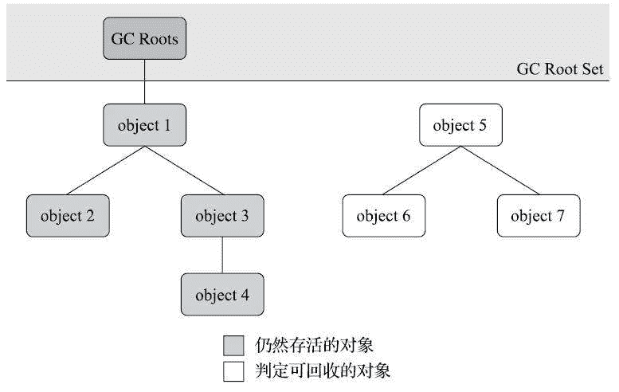
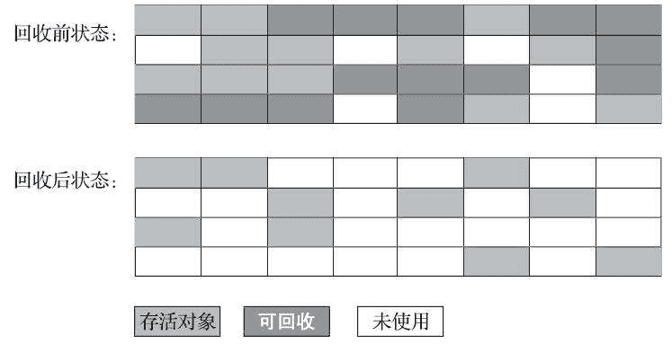
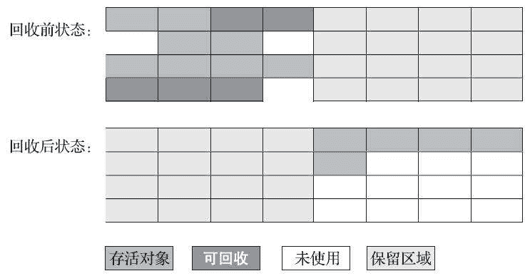
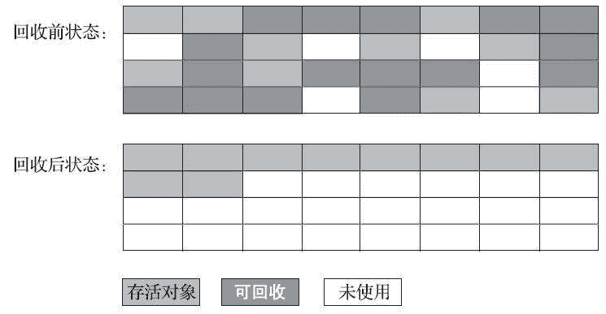
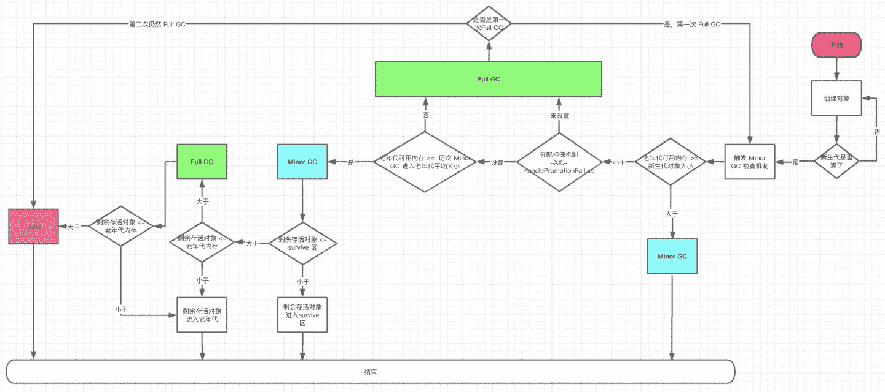

# 第一章 第 12 节 Java 基础-12

> 原文：[`www.nowcoder.com/tutorial/10070/9331f31fdfcf4c3180c1c963583c1300`](https://www.nowcoder.com/tutorial/10070/9331f31fdfcf4c3180c1c963583c1300)

#### 5.15 介绍一下 Java 的垃圾回收机制

**参考答案**

一、哪些内存需要回收

在 Java 内存运行时区域的各个部分中，堆和方法区这两个区域则有着很显著的不确定性：一个接口的多个实现类需要的内存可能会不一样，一个方法所执行的不同条件分支所需要的内存也可能不一样，只有处于运行期间，我们才能知道程序究竟会创建哪些对象，创建多少个对象，这部分内存的分配和回收是动态的。垃圾收集器所关注的正是这部分内存该如何管理，我们平时所说的内存分配与回收也仅仅特指这一部分内存。

二、怎么定义垃圾

引用计数算法：

在对象中添加一个引用计数器，每当有一个地方引用它时，计数器值就加一；当引用失效时，计数器值就减一；任何时刻计数器为零的对象就是不可能再被使用的。

但是，在 Java 领域，至少主流的 Java 虚拟机里面都没有选用引用计数算法来管理内存，主要原因是，这个看似简单的算法有很多例外情况要考虑，必须要配合大量额外处理才能保证正确地工作，譬如单纯的引用计数就很难解决对象之间相互循环引用的问题。

举个简单的例子：对象 objA 和 objB 都有字段 instance，赋值令 objA.instance=objB 及 objB.instance=objA，除此之外，这两个对象再无任何引用，实际上这两个对象已经不可能再被访问，但是它们因为互相引用着对方，导致它们的引用计数都不为零，引用计数算法也就无法回收它们。

可达性分析算法：

当前主流的商用程序语言的内存管理子系统，都是通过可达性分析（Reachability Analysis）算法来判定对象是否存活的。这个算法的基本思路就是通过一系列称为“GC Roots”的根对象作为起始节点集，从这些节点开始，根据引用关系向下搜索，搜索过程所走过的路径称为“引用链”（Reference Chain），如果某个对象到 GC Roots 间没有任何引用链相连，或者用图论的话来说就是从 GC Roots 到这个对象不可达时，则证明此对象是不可能再被使用的。

如下图所示，对象 object 5、object 6、object 7 虽然互有关联，但是它们到 GC Roots 是不可达的，因此它们将会被判定为可回收的对象。

在 Java 技术体系里面，固定可作为 GC Roots 的对象包括以下几种：

*   在虚拟机栈（栈帧中的本地变量表）中引用的对象，譬如各个线程被调用的方法堆栈中使用到的参数、局部变量、临时变量等。
*   在方法区中类静态属性引用的对象，譬如 Java 类的引用类型静态变量。
*   在方法区中常量引用的对象，譬如字符串常量池（String Table）里的引用。
*   在本地方法栈中 JNI（即通常所说的 Native 方法）引用的对象。
*   Java 虚拟机内部的引用，如基本数据类型对应的 Class 对象，一些常驻的异常对象（比如 NullPointExcepiton、OutOfMemoryError）等，还有系统类加载器。
*   所有被同步锁（synchronized 关键字）持有的对象。
*   反映 Java 虚拟机内部情况的 JMXBean、JVMTI 中注册的回调、本地代码缓存等。

回收方法区：

方法区的垃圾收集主要回收两部分内容：废弃的常量和不再使用的类型。回收废弃常量与回收 Java 堆中的对象非常类似。举个常量池中字面量回收的例子，假如一个字符串“java”曾经进入常量池中，但是当前系统又没有任何一个字符串对象的值是“java”，换句话说，已经没有任何字符串对象引用常量池中的“java”常量，且虚拟机中也没有其他地方引用这个字面量。如果在这时发生内存回收，而且垃圾收集器判断确有必要的话，这个“java”常量就将会被系统清理出常量池。常量池中其他类（接口）、方法、字段的符号引用也与此类似。

判定一个常量是否“废弃”还是相对简单，而要判定一个类型是否属于“不再被使用的类”的条件就比较苛刻了。需要同时满足下面三个条件：

*   该类所有的实例都已经被回收，也就是 Java 堆中不存在该类及其任何派生子类的实例。
*   加载该类的类加载器已经被回收，这个条件除非是经过精心设计的可替换类加载器的场景，如 OSGi、JSP 的重加载等，否则通常是很难达成的。
*   该类对应的 java.lang.Class 对象没有在任何地方被引用，无法在任何地方通过反射访问该类的方法。

三、怎么回收垃圾

分代收集理论：

当前商业虚拟机的垃圾收集器，大多数都遵循了“分代收集”（GenerationalCollection）的理论进行设计，分代收集名为理论，实质是一套符合大多数程序运行实际情况的经验法则，它建立在两个分代假说之上：

1.  弱分代假说（Weak Generational Hypothesis）：绝大多数对象都是朝生夕灭的。
2.  强分代假说（Strong Generational Hypothesis）：熬过越多次垃圾收集过程的对象就越难以消亡。

这两个分代假说共同奠定了多款常用的垃圾收集器的一致的设计原则：收集器应该将 Java 堆划分出不同的区域，然后将回收对象依据其年龄（年龄即对象熬过垃圾收集过程的次数）分配到不同的区域之中存储。显而易见，如果一个区域中大多数对象都是朝生夕灭，难以熬过垃圾收集过程的话，那么把它们集中放在一起，每次回收时只关注如何保留少量存活而不是去标记那些大量将要被回收的对象，就能以较低代价回收到大量的空间；如果剩下的都是难以消亡的对象，那把它们集中放在一块，虚拟机便可以使用较低的频率来回收这个区域，这就同时兼顾了垃圾收集的时间开销和内存的空间有效利用。

标记-清除算法：

最早出现也是最基础的垃圾收集算法是“标记-清除”（Mark-Sweep）算法，如它的名字一样，算法分为“标记”和“清除”两个阶段：首先标记出所有需要回收的对象，在标记完成后，统一回收掉所有被标记的对象，也可以反过来，标记存活的对象，统一回收所有未被标记的对象。

它的主要缺点有两个：第一个是执行效率不稳定，如果 Java 堆中包含大量对象，而且其中大部分是需要被回收的，这时必须进行大量标记和清除的动作，导致标记和清除两个过程的执行效率都随对象数量增长而降低；第二个是内存空间的碎片化问题，标记、清除之后会产生大量不连续的内存碎片，空间碎片太多可能会导致当以后在程序运行过程中需要分配较大对象时无法找到足够的连续内存而不得不提前触发另一次垃圾收集动作。标记-清除算法的执行过程如下图所示。

标记-复制算法：

为了解决标记-清除算法面对大量可回收对象时执行效率低的问题，1969 年 Fenichel 提出了一种称为“半区复制”（Semispace Copying）的垃圾收集算法，它将可用内存按容量划分为大小相等的两块，每次只使用其中的一块。当这一块的内存用完了，就将还存活着的对象复制到另外一块上面，然后再把已使用过的内存空间一次清理掉。如果内存中多数对象都是存活的，这种算法将会产生大量的内存间复制的开销，但对于多数对象都是可回收的情况，算法需要复制的就是占少数的存活对象，而且每次都是针对整个半区进行内存回收，分配内存时也就不用考虑有空间碎片的复杂情况，只要移动堆顶指针，按顺序分配即可。这样实现简单，运行高效，不过其缺陷也显而易见，这种复制回收算法的代价是将可用内存缩小为了原来的一半，空间浪费未免太多了一点。标记-复制算法的执行过程如下图所示。

在 1989 年，Andrew Appel 针对具备“朝生夕灭”特点的对象，提出了一种更优化的半区复制分代策略，现在称为“Appel 式回收”。Appel 式回收的具体做法是把新生代分为一块较大的 Eden 空间和两块较小的 Survivor 空间，每次分配内存只使用 Eden 和其中一块 Survivor。发生垃圾搜集时，将 Eden 和 Survivor 中仍然存活的对象一次性复制到另外一块 Survivor 空间上，然后直接清理掉 Eden 和已用过的那块 Survivor 空间。HotSpot 虚拟机默认 Eden 和 Survivor 的大小比例是 8∶1，也即每次新生代中可用内存空间为整个新生代容量的 90%（Eden 的 80%加上一个 Survivor 的 10%），只有一个 Survivor 空间，即 10%的新生代是会被“浪费”的。当然，98%的对象可被回收仅仅是“普通场景”下测得的数据，任何人都没有办法百分百保证每次回收都只有不多于 10%的对象存活，因此 Appel 式回收还有一个充当罕见情况的“逃生门”的安全设计，当 Survivor 空间不足以容纳一次 Minor GC 之后存活的对象时，就需要依赖其他内存区域（实际上大多就是老年代）进行分配担保（Handle Promotion）。

标记-整理算法：

标记-复制算法在对象存活率较高时就要进行较多的复制操作，效率将会降低。更关键的是，如果不想浪费 50%的空间，就需要有额外的空间进行分配担保，以应对被使用的内存中所有对象都 100%存活的极端情况，所以在老年代一般不能直接选用这种算法。

针对老年代对象的存亡特征，1974 年 Edward Lueders 提出了另外一种有针对性的“标记-整理”（Mark-Compact）算法，其中的标记过程仍然与“标记-清除”算法一样，但后续步骤不是直接对可回收对象进行清理，而是让所有存活的对象都向内存空间一端移动，然后直接清理掉边界以外的内存，“标记-整理”算法的示意图如下图所示。

#### 5.16 请介绍一下分代回收机制

**参考答案**

当前商业虚拟机的垃圾收集器，大多数都遵循了“分代收集”（GenerationalCollection）[插图]的理论进行设计，分代收集名为理论，实质是一套符合大多数程序运行实际情况的经验法则，它建立在两个分代假说之上：

1.  弱分代假说（Weak Generational Hypothesis）：绝大多数对象都是朝生夕灭的。
2.  强分代假说（Strong Generational Hypothesis）：熬过越多次垃圾收集过程的对象就越难以消亡。

这两个分代假说共同奠定了多款常用的垃圾收集器的一致的设计原则：收集器应该将 Java 堆划分出不同的区域，然后将回收对象依据其年龄（年龄即对象熬过垃圾收集过程的次数）分配到不同的区域之中存储。把分代收集理论具体放到现在的商用 Java 虚拟机里，设计者一般至少会把 Java 堆划分为新生代（Young Generation）和老年代（Old Generation）两个区域。顾名思义，在新生代中，每次垃圾收集时都发现有大批对象死去，而每次回收后存活的少量对象，将会逐步晋升到老年代中存放。

分代收集并非只是简单划分一下内存区域那么容易，它至少存在一个明显的困难：对象不是孤立的，对象之间会存在跨代引用。假如要现在进行一次只局限于新生代区域内的收集，但新生代中的对象是完全有可能被老年代所引用的，为了找出该区域中的存活对象，不得不在固定的 GC Roots 之外，再额外遍历整个老年代中所有对象来确保可达性分析结果的正确性，反过来也是一样。遍历整个老年代所有对象的方案虽然理论上可行，但无疑会为内存回收带来很大的性能负担。为了解决这个问题，就需要对分代收集理论添加第三条经验法则：

3.  跨代引用假说（Intergenerational Reference Hypothesis）：跨代引用相对于同代引用来说仅占极少数。

依据这条假说，我们就不应再为了少量的跨代引用去扫描整个老年代，也不必浪费空间专门记录每一个对象是否存在及存在哪些跨代引用，只需在新生代上建立一个全局的数据结构（称为“记忆集”，RememberedSet），这个结构把老年代划分成若干小块，标识出老年代的哪一块内存会存在跨代引用。此后当发生 Minor GC 时，只有包含了跨代引用的小块内存里的对象才会被加入到 GC Roots 进行扫描。虽然这种方法需要在对象改变引用关系（如将自己或者某个属性赋值）时维护记录数据的正确性，会增加一些运行时的开销，但比起收集时扫描整个老年代来说仍然是划算的。

#### 5.17 JVM 中一次完整的 GC 流程是怎样的？

**参考答案**

新创建的对象一般会被分配在新生代中，常用的新生代的垃圾回收器是 ParNew 垃圾回收器，它按照 8:1:1 将新生代分成 Eden 区，以及两个 Survivor 区。某一时刻，我们创建的对象将 Eden 区全部挤满，这个对象就是挤满新生代的最后一个对象。此时，Minor GC 就触发了。

在正式 Minor GC 前，JVM 会先检查新生代中对象，是比老年代中剩余空间大还是小。为什么要做这样的检查呢？原因很简单，假如 Minor GC 之后 Survivor 区放不下剩余对象，这些对象就要进入到老年代，所以要提前检查老年代是不是够用。这样就有两种情况：

1.  老年代剩余空间大于新生代中的对象大小，那就直接 Minor GC，GC 完 survivor 不够放，老年代也绝对够放；

2.  老年代剩余空间小于新生代中的对象大小，这个时候就要查看是否启用了“老年代空间分配担保规则”，具体来说就是看 `-XX:-HandlePromotionFailure` 参数是否设置了。

    老年代空间分配担保规则是这样的，如果老年代中剩余空间大小，大于历次 Minor GC 之后剩余对象的大小，那就允许进行 Minor GC。因为从概率上来说，以前的放的下，这次的也应该放的下。那就有两种情况：

    老年代中剩余空间大小，大于历次 Minor GC 之后剩余对象的大小，进行 Minor GC；

    老年代中剩余空间大小，小于历次 Minor GC 之后剩余对象的大小，进行 Full GC，把老年代空出来再检查。

开启老年代空间分配担保规则只能说是大概率上来说，Minor GC 剩余后的对象够放到老年代，所以当然也会有万一，Minor GC 后会有这样三种情况：

1.  Minor GC 之后的对象足够放到 Survivor 区，皆大欢喜，GC 结束；
2.  Minor GC 之后的对象不够放到 Survivor 区，接着进入到老年代，老年代能放下，那也可以，GC 结束；
3.  Minor GC 之后的对象不够放到 Survivor 区，老年代也放不下，那就只能 Full GC。

前面都是成功 GC 的例子，还有 3 中情况，会导致 GC 失败，报 OOM：

1.  紧接上一节 Full GC 之后，老年代任然放不下剩余对象，就只能 OOM；
2.  未开启老年代分配担保机制，且一次 Full GC 后，老年代任然放不下剩余对象，也只能 OOM；
3.  开启老年代分配担保机制，但是担保不通过，一次 Full GC 后，老年代任然放不下剩余对象，也是能 OOM。

GC 完整流程，参考下图：

#### 5.18 Full GC 会导致什么？

**参考答案**

Full GC 会“Stop The World”，即在 GC 期间全程暂停用户的应用程序。

#### 5.19 JVM 什么时候触发 GC，如何减少 FullGC 的次数？

**参考答案**

当 Eden 区的空间耗尽时 Java 虚拟机便会触发一次 Minor GC 来收集新生代的垃圾，存活下来的对象，则会被送到 Survivor 区，简单说就是当新生代的 Eden 区满的时候触发 Minor GC。

serial GC 中，老年代内存剩余已经小于之前年轻代晋升老年代的平均大小，则进行 Full GC。而在 CMS 等并发收集器中则是每隔一段时间检查一下老年代内存的使用量，超过一定比例时进行 Full GC 回收。

可以采用以下措施来减少 Full GC 的次数：

1.  增加方法区的空间；
2.  增加老年代的空间；
3.  减少新生代的空间；
4.  禁止使用 System.gc()方法；
5.  使用标记-整理算法，尽量保持较大的连续内存空间；
6.  排查代码中无用的大对象。

#### 5.20 如何确定对象是可回收的？

**参考答案**

引用计数算法：

在对象中添加一个引用计数器，每当有一个地方引用它时，计数器值就加一；当引用失效时，计数器值就减一；任何时刻计数器为零的对象就是不可能再被使用的。

但是，在 Java 领域，至少主流的 Java 虚拟机里面都没有选用引用计数算法来管理内存，主要原因是，这个看似简单的算法有很多例外情况要考虑，必须要配合大量额外处理才能保证正确地工作，譬如单纯的引用计数就很难解决对象之间相互循环引用的问题。

举个简单的例子：对象 objA 和 objB 都有字段 instance，赋值令 objA.instance=objB 及 objB.instance=objA，除此之外，这两个对象再无任何引用，实际上这两个对象已经不可能再被访问，但是它们因为互相引用着对方，导致它们的引用计数都不为零，引用计数算法也就无法回收它们。

可达性分析算法：

当前主流的商用程序语言的内存管理子系统，都是通过可达性分析（Reachability Analysis）算法来判定对象是否存活的。这个算法的基本思路就是通过一系列称为“GC Roots”的根对象作为起始节点集，从这些节点开始，根据引用关系向下搜索，搜索过程所走过的路径称为“引用链”（Reference Chain），如果某个对象到 GC Roots 间没有任何引用链相连，或者用图论的话来说就是从 GC Roots 到这个对象不可达时，则证明此对象是不可能再被使用的。

如下图所示，对象 object 5、object 6、object 7 虽然互有关联，但是它们到 GC Roots 是不可达的，因此它们将会被判定为可回收的对象。

在 Java 技术体系里面，固定可作为 GC Roots 的对象包括以下几种：

*   在虚拟机栈（栈帧中的本地变量表）中引用的对象，譬如各个线程被调用的方法堆栈中使用到的参数、局部变量、临时变量等。
*   在方法区中类静态属性引用的对象，譬如 Java 类的引用类型静态变量。
*   在方法区中常量引用的对象，譬如字符串常量池（String Table）里的引用。
*   在本地方法栈中 JNI（即通常所说的 Native 方法）引用的对象。
*   Java 虚拟机内部的引用，如基本数据类型对应的 Class 对象，一些常驻的异常对象（比如 NullPointExcepiton、OutOfMemoryError）等，还有系统类加载器。
*   所有被同步锁（synchronized 关键字）持有的对象。
*   反映 Java 虚拟机内部情况的 JMXBean、JVMTI 中注册的回调、本地代码缓存等。