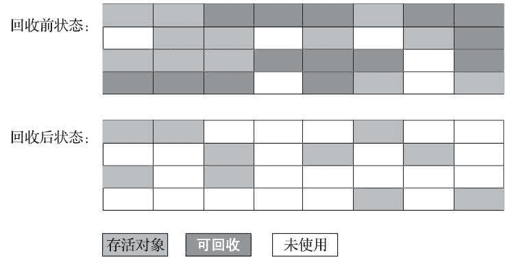
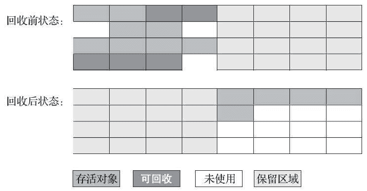
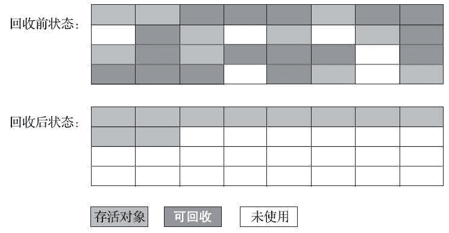

# 第一章 第 13 节 Java 基础-13

> 原文：[`www.nowcoder.com/tutorial/10070/d612bb0c250f4499b92171ff05fbcf63`](https://www.nowcoder.com/tutorial/10070/d612bb0c250f4499b92171ff05fbcf63)

#### 5.21 对象如何晋升到老年代？

**参考答案**

虚拟机给每个对象定义了一个对象年龄（Age）计数器，存储在对象头中。对象通常在 Eden 区里诞生，如果经过第一次 MinorGC 后仍然存活，并且能被 Survivor 容纳的话，该对象会被移动到 Survivor 空间中，并且将其对象年龄设为 1 岁。对象在 Survivor 区中每熬过一次 MinorGC，年龄就增加 1 岁，当它的年龄增加到一定程度（默认为 15），就会被晋升到老年代中。对象晋升老年代的年龄阈值，可以通过参数-XX：MaxTenuringThreshold 设置。

#### 5.22 为什么老年代不能使用标记复制？

**参考答案**

因为老年代保留的对象都是难以消亡的，而标记复制算法在对象存活率较高时就要进行较多的复制操作，效率将会降低，所以在老年代一般不能直接选用这种算法。

#### 5.23 新生代为什么要分为 Eden 和 Survivor，它们的比例是多少？

**参考答案**

现在的商用 Java 虚拟机大多都优先采用了“标记-复制算法”去回收新生代，该算法早期采用“半区复制”的机制进行垃圾回收。它将可用内存按容量划分为大小相等的两块，每次只使用其中的一块。当这一块的内存用完了，就将还存活着的对象复制到另外一块上面，然后再把已使用过的内存空间一次清理掉。这样实现简单，运行高效，不过其缺陷也显而易见，这种复制回收算法的代价是将可用内存缩小为了原来的一半，空间浪费未免太多了一点。

实际上，新生代中的对象有 98%熬不过第一轮收集，因此并不需要按照 1∶1 的比例来划分新生代的内存空间。在 1989 年，Andrew Appel 提出了一种更优化的半区复制分代策略，现在称为“Appel 式回收”。Appel 式回收的具体做法是把新生代分为一块较大的 Eden 空间和两块较小的 Survivor 空间，每次分配内存只使用 Eden 和其中一块 Survivor。发生垃圾搜集时，将 Eden 和 Survivor 中仍然存活的对象一次性复制到另外一块 Survivor 空间上，然后直接清理掉 Eden 和已用过的那块 Survivor 空间。

HotSpot 虚拟机默认 Eden 和 Survivor 的大小比例是 8∶1，也即每次新生代中可用内存空间为整个新生代容量的 90%（Eden 的 80%加上一个 Survivor 的 10%），只有一个 Survivor 空间，即 10%的新生代是会被“浪费”的。

#### 5.24 为什么要设置两个 Survivor 区域？

**参考答案**

设置两个 Survivor 区最大的好处就是解决内存碎片化。

我们先假设一下，Survivor 只有一个区域会怎样。Minor GC 执行后，Eden 区被清空了，存活的对象放到了 Survivor 区，而之前 Survivor 区中的对象，可能也有一些是需要被清除的。问题来了，这时候我们怎么清除它们？在这种场景下，我们只能标记清除，而我们知道标记清除最大的问题就是内存碎片，在新生代这种经常会消亡的区域，采用标记清除必然会让内存产生严重的碎片化。因为 Survivor 有 2 个区域，所以每次 Minor GC，会将之前 Eden 区和 From 区中的存活对象复制到 To 区域。第二次 Minor GC 时，From 与 To 职责兑换，这时候会将 Eden 区和 To 区中的存活对象再复制到 From 区域，以此反复。

这种机制最大的好处就是，整个过程中，永远有一个 Survivor space 是空的，另一个非空的 Survivor space 是无碎片的。那么，Survivor 为什么不分更多块呢？比方说分成三个、四个、五个?显然，如果 Survivor 区再细分下去，每一块的空间就会比较小，容易导致 Survivor 区满，两块 Survivor 区可能是经过权衡之后的最佳方案。

#### 5.25 说一说你对 GC 算法的了解。

**参考答案**

标记-清除算法：

最早出现也是最基础的垃圾收集算法是“标记-清除”（Mark-Sweep）算法，如它的名字一样，算法分为“标记”和“清除”两个阶段：首先标记出所有需要回收的对象，在标记完成后，统一回收掉所有被标记的对象，也可以反过来，标记存活的对象，统一回收所有未被标记的对象。

它的主要缺点有两个：第一个是执行效率不稳定，如果 Java 堆中包含大量对象，而且其中大部分是需要被回收的，这时必须进行大量标记和清除的动作，导致标记和清除两个过程的执行效率都随对象数量增长而降低；第二个是内存空间的碎片化问题，标记、清除之后会产生大量不连续的内存碎片，空间碎片太多可能会导致当以后在程序运行过程中需要分配较大对象时无法找到足够的连续内存而不得不提前触发另一次垃圾收集动作。标记-清除算法的执行过程如下图所示。

标记-复制算法：

为了解决标记-清除算法面对大量可回收对象时执行效率低的问题，1969 年 Fenichel 提出了一种称为“半区复制”（Semispace Copying）的垃圾收集算法，它将可用内存按容量划分为大小相等的两块，每次只使用其中的一块。当这一块的内存用完了，就将还存活着的对象复制到另外一块上面，然后再把已使用过的内存空间一次清理掉。如果内存中多数对象都是存活的，这种算法将会产生大量的内存间复制的开销，但对于多数对象都是可回收的情况，算法需要复制的就是占少数的存活对象，而且每次都是针对整个半区进行内存回收，分配内存时也就不用考虑有空间碎片的复杂情况，只要移动堆顶指针，按顺序分配即可。这样实现简单，运行高效，不过其缺陷也显而易见，这种复制回收算法的代价是将可用内存缩小为了原来的一半，空间浪费未免太多了一点。标记-复制算法的执行过程如下图所示。

在 1989 年，Andrew Appel 针对具备“朝生夕灭”特点的对象，提出了一种更优化的半区复制分代策略，现在称为“Appel 式回收”。Appel 式回收的具体做法是把新生代分为一块较大的 Eden 空间和两块较小的 Survivor 空间，每次分配内存只使用 Eden 和其中一块 Survivor。发生垃圾搜集时，将 Eden 和 Survivor 中仍然存活的对象一次性复制到另外一块 Survivor 空间上，然后直接清理掉 Eden 和已用过的那块 Survivor 空间。HotSpot 虚拟机默认 Eden 和 Survivor 的大小比例是 8∶1，也即每次新生代中可用内存空间为整个新生代容量的 90%（Eden 的 80%加上一个 Survivor 的 10%），只有一个 Survivor 空间，即 10%的新生代是会被“浪费”的。当然，98%的对象可被回收仅仅是“普通场景”下测得的数据，任何人都没有办法百分百保证每次回收都只有不多于 10%的对象存活，因此 Appel 式回收还有一个充当罕见情况的“逃生门”的安全设计，当 Survivor 空间不足以容纳一次 Minor GC 之后存活的对象时，就需要依赖其他内存区域（实际上大多就是老年代）进行分配担保（Handle Promotion）。

标记-整理算法：

标记-复制算法在对象存活率较高时就要进行较多的复制操作，效率将会降低。更关键的是，如果不想浪费 50%的空间，就需要有额外的空间进行分配担保，以应对被使用的内存中所有对象都 100%存活的极端情况，所以在老年代一般不能直接选用这种算法。

针对老年代对象的存亡特征，1974 年 Edward Lueders 提出了另外一种有针对性的“标记-整理”（Mark-Compact）算法，其中的标记过程仍然与“标记-清除”算法一样，但后续步骤不是直接对可回收对象进行清理，而是让所有存活的对象都向内存空间一端移动，然后直接清理掉边界以外的内存，“标记-整理”算法的示意图如下图所示。

#### 5.26 为什么新生代和老年代要采用不同的回收算法？

**参考答案**

如果一个区域中大多数对象都是朝生夕灭，难以熬过垃圾收集过程的话，那么把它们集中放在一起，每次回收时只关注如何保留少量存活而不是去标记那些大量将要被回收的对象，就能以较低代价回收到大量的空间。如果剩下的都是难以消亡的对象，那把它们集中放在一块，虚拟机便可以使用较低的频率来回收这个区域，这就同时兼顾了垃圾收集的时间开销和内存的空间有效利用。

#### 5.27 请介绍 G1 垃圾收集器

**参考答案**

G1（Garbage First）是一款主要面向服务端应用的垃圾收集器，JDK 9 发布之日，G1 宣告取代 ParallelScavenge 加 Parallel Old 组合，成为服务端模式下的默认垃圾收集器，而 CMS 则沦落至被声明为不推荐使用（Deprecate）的收集器。G1 收集器是垃圾收集器技术发展历史上的里程碑式的成果，它开创了收集器面向局部收集的设计思路和基于 Region 的内存布局形式。

虽然 G1 也仍是遵循分代收集理论设计的，但其堆内存的布局与其他收集器有非常明显的差异：G1 不再坚持固定大小以及固定数量的分代区域划分，而是把连续的 Java 堆划分为多个大小相等的独立区域（Region），每一个 Region 都可以根据需要，扮演新生代的 Eden 空间、Survivor 空间，或者老年代空间。收集器能够对扮演不同角色的 Region 采用不同的策略去处理，这样无论是新创建的对象还是已经存活了一段时间、熬过多次收集的旧对象都能获取很好的收集效果。

Region 中还有一类特殊的 Humongous 区域，专门用来存储大对象。G1 认为只要大小超过了一个 Region 容量一半的对象即可判定为大对象。每个 Region 的大小可以通过参数 `-XX：G1HeapRegionSize` 设定，取值范围为 1MB～32MB，且应为 2 的 N 次幂。而对于那些超过了整个 Region 容量的超级大对象，将会被存放在 N 个连续的`Humongous Region` 之中，G1 的大多数行为都把 `Humongous Region` 作为老年代的一部分来进行看待，如下图所示。

虽然 G1 仍然保留新生代和老年代的概念，但新生代和老年代不再是固定的了，它们都是一系列区域（不需要连续）的动态集合。G1 收集器之所以能建立可预测的停顿时间模型，是因为它将 Region 作为单次回收的最小单元，即每次收集到的内存空间都是 Region 大小的整数倍，这样可以有计划地避免在整个 Java 堆中进行全区域的垃圾收集。更具体的处理思路是让 G1 收集器去跟踪各个 Region 里面的垃圾堆积的“价值”大小，价值即回收所获得的空间大小以及回收所需时间的经验值，然后在后台维护一个优先级列表，每次根据用户设定允许的收集停顿时间（使用参数-XX：MaxGCPauseMillis 指定，默认值是 200 毫秒），优先处理回收价值收益最大的那些 Region，这也就是“Garbage First”名字的由来。这种使用 Region 划分内存空间，以及具有优先级的区域回收方式，保证了 G1 收集器在有限的时间内获取尽可能高的收集效率。

#### 5.28 请介绍 CMS 垃圾收集器

**参考答案**

CMS（Concurrent Mark Sweep）收集器是一种以获取最短回收停顿时间为目标的收集器。从名字上就可以看出 CMS 收集器是基于标记-清除算法实现的，它的运作过程分为四个步骤，包括：

1.  初始标记（CMS initial mark）；
2.  并发标记（CMS concurrent mark）；
3.  重新标记（CMS remark）；
4.  并发清除（CMS concurrent sweep）。

其中初始标记、重新标记这两个步骤仍然需要“Stop The World”。初始标记仅仅只是标记一下 GC Roots 能直接关联到的对象，速度很快；并发标记阶段就是从 GC Roots 的直接关联对象开始遍历整个对象图的过程，这个过程耗时较长但是不需要停顿用户线程，可以与垃圾收集线程一起并发运行；而重新标记阶段则是为了修正并发标记期间，因用户程序继续运作而导致标记产生变动的那一部分对象的标记记录，这个阶段的停顿时间通常会比初始标记阶段稍长一些，但也远比并发标记阶段的时间短；最后是并发清除阶段，清理删除掉标记阶段判断的已经死亡的对象，由于不需要移动存活对象，所以这个阶段也是可以与用户线程同时并发的。

由于在整个过程中耗时最长的并发标记和并发清除阶段中，垃圾收集器线程都可以与用户线程一起工作，所以从总体上来说，CMS 收集器的内存回收过程是与用户线程一起并发执行的。通过下图可以比较清楚地看到 CMS 收集器的运作步骤中并发和需要停顿的阶段。

CMS 收集器还远达不到完美的程度，它至少有以下三个明显的缺点：

首先，CMS 收集器对处理器资源非常敏感。在并发阶段，它虽然不会导致用户线程停顿，但却会因为占用了一部分线程（或者说处理器的计算能力）而导致应用程序变慢，降低总吞吐量。

然后，由于 CMS 收集器无法处理“浮动垃圾”（Floating Garbage），有可能出现“Con-current Mode Failure”失败进而导致另一次完全“Stop TheWorld”的 Full GC 的产生。

还有最后一个缺点，CMS 是一款基于“标记-清除”算法实现的收集器，这意味着收集结束时会有大量空间碎片产生。空间碎片过多时，将会给大对象分配带来很大麻烦，往往会出现老年代还有很多剩余空间，但就是无法找到足够大的连续空间来分配当前对象，而不得不提前触发一次 Full GC 的情况。

#### 5.29 内存泄漏和内存溢出有什么区别？

**参考答案**

内存泄漏（memory leak）：内存泄漏指程序运行过程中分配内存给临时变量，用完之后却没有被 GC 回收，始终占用着内存，既不能被使用也不能分配给其他程序，于是就发生了内存泄漏。

内存溢出（out of memory）：简单地说内存溢出就是指程序运行过程中申请的内存大于系统能够提供的内存，导致无法申请到足够的内存，于是就发生了内存溢出。

#### 5.30 什么是内存泄漏，怎么解决？

**参考答案**

内存泄漏的根本原因是长生命周期的对象持有短生命周期对象的引用，尽管短生命周期的对象已经不再需要，但由于长生命周期对象持有它的引用而导致不能被回收。以发生的方式来分类，内存泄漏可以分为 4 类：

1.  常发性内存泄漏。发生内存泄漏的代码会被多次执行到，每次被执行的时候都会导致一块内存泄漏。
2.  偶发性内存泄漏。发生内存泄漏的代码只有在某些特定环境或操作过程下才会发生。常发性和偶发性是相对的。对于特定的环境，偶发性的也许就变成了常发性的。所以测试环境和测试方法对检测内存泄漏至关重要。
3.  一次性内存泄漏。发生内存泄漏的代码只会被执行一次，或者由于算法上的缺陷，导致总会有一块仅且一块内存发生泄漏。
4.  隐式内存泄漏。程序在运行过程中不停的分配内存，但是直到结束的时候才释放内存。严格的说这里并没有发生内存泄漏，因为最终程序释放了所有申请的内存。但是对于一个服务器程序，需要运行几天，几周甚至几个月，不及时释放内存也可能导致最终耗尽系统的所有内存。所以，我们称这类内存泄漏为隐式内存泄漏。

避免内存泄漏的几点建议：

1.  尽早释放无用对象的引用。
2.  避免在循环中创建对象。
3.  使用字符串处理时避免使用 String，应使用 StringBuffer。
4.  尽量少使用静态变量，因为静态变量存放在永久代，基本不参与垃圾回收。

#### 5.31 什么是内存溢出，怎么解决？

**参考答案**

内存溢出（out of memory）：简单地说内存溢出就是指程序运行过程中申请的内存大于系统能够提供的内存，导致无法申请到足够的内存，于是就发生了内存溢出。

引起内存溢出的原因有很多种，常见的有以下几种：

1.  内存中加载的数据量过于庞大，如一次从数据库取出过多数据；
2.  集合类中有对对象的引用，使用完后未清空，使得 JVM 不能回收；
3.  代码中存在死循环或循环产生过多重复的对象实体；
4.  使用的第三方软件中的 BUG；
5.  启动参数内存值设定的过小。

内存溢出的解决方案：

*   第一步，修改 JVM 启动参数，直接增加内存。
*   第二步，检查错误日志，查看“OutOfMemory”错误前是否有其它异常或错误。
*   第三步，对代码进行走查和分析，找出可能发生内存溢出的位置。
*   第四步，使用内存查看工具动态查看内存使用情况。

#### 5.32 哪些区域会 OOM，怎么触发 OOM？

**参考答案**

除了程序计数器外，虚拟机内存的其他几个运行时区域都有发生 OOM 异常的可能。

1.  Java 堆溢出

    Java 堆用于储存对象实例，我们只要不断地创建对象，并且保证 GC Roots 到对象之间有可达路径来避免垃圾回收机制清除这些对象，那么随着对象数量的增加，总容量触及最大堆的容量限制后就会产生内存溢出异常。

2.  虚拟机栈和本地方法栈溢出

    HotSpot 虚拟机中并不区分虚拟机栈和本地方法栈，如果虚拟机的栈内存允许动态扩展，当扩展栈容量无法申请到足够的内存时，将抛出 OutOfMemoryError 异常。

3.  方法区和运行时常量池溢出

    方法区溢出也是一种常见的内存溢出异常，在经常运行时生成大量动态类的应用场景里，就应该特别关注这些类的回收状况。这类场景常见的包括：程序使用了 CGLib 字节码增强和动态语言、大量 JSP 或动态产生 JSP 文件的应用（JSP 第一次运行时需要编译为 Java 类）、基于 OSGi 的应用（即使是同一个类文件，被不同的加载器加载也会视为不同的类）等。

    在 JDK 6 或更早之前的 HotSpot 虚拟机中，常量池都是分配在永久代中，即常量池是方法去的一部分，所以上述问题在常量池中也同样会出现。而 HotSpot 从 JDK 7 开始逐步“去永久代”的计划，并在 JDK 8 中完全使用元空间来代替永久代，所以上述问题在 JDK 8 中会得到避免。

4.  本地直接内存溢出

    直接内存（Direct Memory）的容量大小可通过-XX：MaxDirectMemorySize 参数来指定，如果不去指定，则默认与 Java 堆最大值（由-Xmx 指定）一致。如果直接通过反射获取 Unsafe 实例进行内存分配，并超出了上述的限制时，将会引发 OOM 异常。