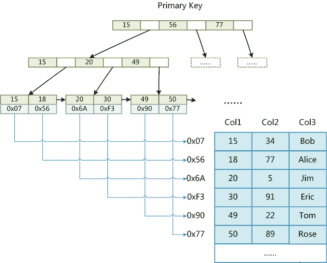
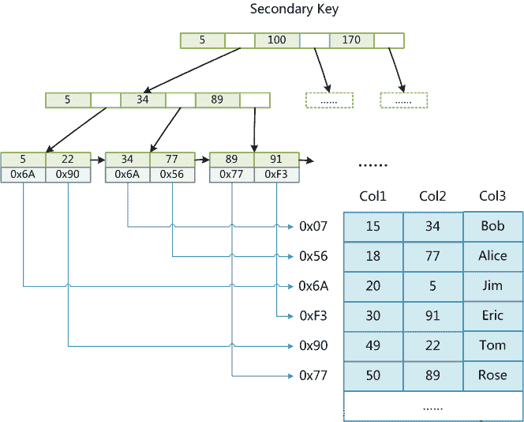
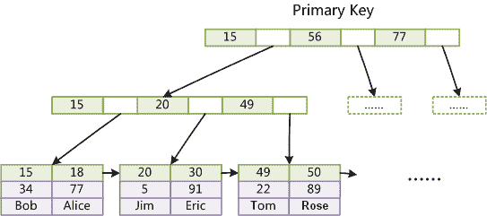
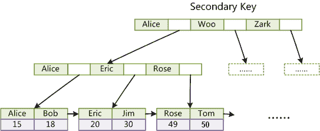
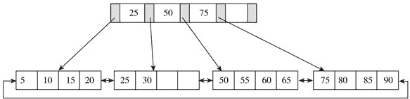
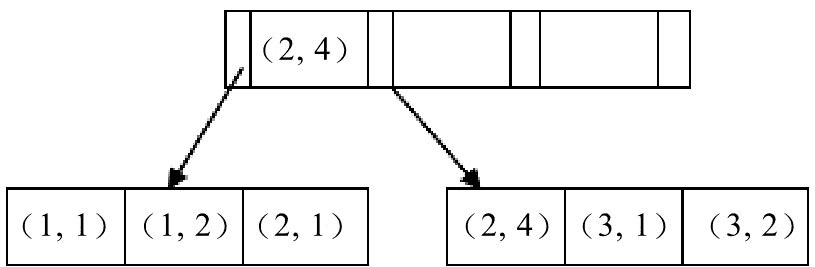

# 第二章 第 3 节 Java 数据库-3

> 原文：[`www.nowcoder.com/tutorial/10070/f96ea83f7d834f05b6336d76b13a5214`](https://www.nowcoder.com/tutorial/10070/f96ea83f7d834f05b6336d76b13a5214)

#### 2.6 如何判断数据库的索引有没有生效？

**参考答案**

可以使用 EXPLAIN 语句查看索引是否正在使用。

举例，假设已经创建了 book 表，并已经在其 year_publication 字段上建立了普通索引。执行如下语句：

```cpp
EXPLAIN SELECT * FROM book WHERE year_publication=1990;
```

EXPLAIN 语句将为我们输出详细的 SQL 执行信息，其中：

*   possible_keys 行给出了 MySQL 在搜索数据记录时可选用的各个索引。
*   key 行是 MySQL 实际选用的索引。

如果 possible_keys 行和 key 行都包含 year_publication 字段，则说明在查询时使用了该索引。

#### 2.7 如何评估一个索引创建的是否合理？

建议按照如下的原则来设计索引：

1.  避免对经常更新的表进行过多的索引，并且索引中的列要尽可能少。应该经常用于查询的字段创建索引，但要避免添加不必要的字段。
2.  数据量小的表最好不要使用索引，由于数据较少，查询花费的时间可能比遍历索引的时间还要短，索引可能不会产生优化效果。
3.  在条件表达式中经常用到的不同值较多的列上建立索引，在不同值很少的列上不要建立索引。比如在学生表的“性别”字段上只有“男”与“女”两个不同值，因此就无须建立索引，如果建立索引不但不会提高查询效率，反而会严重降低数据更新速度。
4.  当唯一性是某种数据本身的特征时，指定唯一索引。使用唯一索引需能确保定义的列的数据完整性，以提高查询速度。
5.  在频繁进行排序或分组（即进行 group by 或 order by 操作）的列上建立索引，如果待排序的列有多个，可以在这些列上建立组合索引。

#### 2.8 索引是越多越好吗？

**参考答案**

索引并非越多越好，一个表中如有大量的索引，不仅占用磁盘空间，还会影响 INSERT、DELETE、UPDATE 等语句的性能，因为在表中的数据更改时，索引也会进行调整和更新。

#### 2.9 数据库索引失效了怎么办？

**参考答案**

可以采用以下几种方式，来避免索引失效：

1.  使用组合索引时，需要遵循“最左前缀”原则；
2.  不在索引列上做任何操作，例如计算、函数、类型转换，会导致索引失效而转向全表扫描；
3.  尽量使用覆盖索引（之访问索引列的查询），减少 `select *` 覆盖索引能减少回表次数；
4.  MySQL 在使用不等于（!=或者<>）的时候无法使用索引会导致全表扫描；
5.  LIKE 以通配符开头（%abc）MySQL 索引会失效变成全表扫描的操作；
6.  字符串不加单引号会导致索引失效（可能发生了索引列的隐式转换）；
7.  少用 or，用它来连接时会索引失效。

#### 2.10 所有的字段都适合创建索引吗？

**参考答案**

不是。

下列几种情况，是不适合创建索引的：

1.  频繁更新的字段不适合建立索引；
2.  where 条件中用不到的字段不适合建立索引；
3.  数据比较少的表不需要建索引；
4.  数据重复且分布比较均匀的的字段不适合建索引，例如性别、真假值；
5.  参与列计算的列不适合建索引。

#### 2.11 说一说索引的实现原理

**参考答案**

在 MySQL 中，索引是在存储引擎层实现的，不同存储引擎对索引的实现方式是不同的，下面我们探讨一下 MyISAM 和 InnoDB 两个存储引擎的索引实现方式。

MyISAM 索引实现：

MyISAM 引擎使用 B+Tree 作为索引结构，叶节点的 data 域存放的是数据记录的地址，MyISAM 索引的原理图如下。这里假设表一共有三列，假设我们以 Col1 为主键，则上图是一个 MyISAM 表的主索引（Primary key）示意。可以看出 MyISAM 的索引文件仅仅保存数据记录的地址。在 MyISAM 中，主索引和辅助索引（Secondary key）在结构上没有任何区别，只是主索引要求 key 是唯一的，而辅助索引的 key 可以重复。



如果我们在 Col2 上建立一个辅助索引，则此索引的结构如下图所示。同样也是一颗 B+Tree，data 域保存数据记录的地址。因此，MyISAM 中索引检索的算法为首先按照 B+Tree 搜索算法搜索索引，如果指定的 Key 存在，则取出其 data 域的值，然后以 data 域的值为地址，读取相应数据记录。



InnoDB 索引实现：

虽然 InnoDB 也使用 B+Tree 作为索引结构，但具体实现方式却与 MyISAM 截然不同。

第一个重大区别是 InnoDB 的数据文件本身就是索引文件。从上文知道，MyISAM 索引文件和数据文件是分离的，索引文件仅保存数据记录的地址。而在 InnoDB 中，表数据文件本身就是按 B+Tree 组织的一个索引结构，这棵树的叶节点 data 域保存了完整的数据记录。这个索引的 key 是数据表的主键，因此 InnoDB 表数据文件本身就是主索引。

下图是 InnoDB 主索引（同时也是数据文件）的示意图，可以看到叶节点包含了完整的数据记录。这种索引叫做聚集索引。因为 InnoDB 的数据文件本身要按主键聚集，所以 InnoDB 要求表必须有主键（MyISAM 可以没有），如果没有显式指定，则 MySQL 系统会自动选择一个可以唯一标识数据记录的列作为主键，如果不存在这种列，则 MySQL 自动为 InnoDB 表生成一个隐含字段作为主键，这个字段长度为 6 个字节，类型为长整形。



第二个与 MyISAM 索引的不同是 InnoDB 的辅助索引 data 域存储相应记录主键的值而不是地址。换句话说，InnoDB 的所有辅助索引都引用主键作为 data 域。下图为定义在 Col3 上的一个辅助索引。这里以英文字符的 ASCII 码作为比较准则。聚集索引这种实现方式使得按主键的搜索十分高效，但是辅助索引搜索需要检索两遍索引：首先检索辅助索引获得主键，然后用主键到主索引中检索获得记录。



了解不同存储引擎的索引实现方式对于正确使用和优化索引都非常有帮助，例如知道了 InnoDB 的索引实现后，就很容易明白为什么不建议使用过长的字段作为主键，因为所有辅助索引都引用主索引，过长的主索引会令辅助索引变得过大。再例如，用非单调的字段作为主键在 InnoDB 中不是个好主意，因为 InnoDB 数据文件本身是一颗 B+Tree，非单调的主键会造成在插入新记录时数据文件为了维持 B+Tree 的特性而频繁的分裂调整，十分低效，而使用自增字段作为主键则是一个很好的选择。

#### 2.12 介绍一下数据库索引的重构过程

**参考答案**

什么时候需要重建索引呢？

1.  表上频繁发生 update,delete 操作；
2.  表上发生了 alter table ..move 操作（move 操作导致了 rowid 变化）。

怎么判断索引是否应该重建？

1.  一般看索引是否倾斜的严重，是否浪费了空间，对索引进行结构分析：

    ```cpp
    analyze index index_name validate structure;
    ```

2.  在相同的 session 中查询 index_stats 表：

    ```cpp
    select height,DEL_LF_ROWS/LF_ROWS from index_stats;
    ```

    当查询的 height>=4（索引的深度，即从根到叶节点的高度）或 DEL_LF_ROWS/LF_ROWS>0.2 的情况下，就应该考虑重建该索引。

如何重建索引？

*   drop 原索引，然后再创建索引：

    ```cpp
    drop index index_name;
    create index index_name on table_name (index_column);
    ```

    这种方式相当耗时，一般不建议使用。

*   直接重建索引：

    ```cpp
    alter index indexname rebuild;
    alter index indexname rebuild online;
    ```

    此方法较快，建议使用。

rebuild 是快速重建索引的一种有效的办法，因为它是一种使用现有索引项来重建新索引的方法。如果重建索引时有其他用户在对这个表操作，尽量使用带 online 参数来最大限度的减少索引重建时将会出现的任何加锁问题。由于新旧索引在建立时同时存在，因此，使用这种重建方法需要有额外的磁盘空间可供临时使用，当索引建完后把老索引删除，如果没有成功，也不会影响原来的索引。利用这种办法可以用来将一个索引移到新的表空间。

rebuild 重建索引的过程：

1.  Rebuild 以 index fast full scan 或 table full scan 方式（采用那种方式取决于 cost）读取原索引中的数据来构建一个新的索引，重建过程中有排序操作，rebuild online 执行表扫描获取数据，重建过程中有排序的操作；
2.  Rebuild 会阻塞 DML 操作，rebuild online 不会阻塞 DML 操作；
3.  rebuild online 时系统会产生一个 SYS_JOURNAL_xxx 的 IOT 类型的系统临时日志表，所有 rebuild online 时索引的变化都记录在这个表中，当新的索引创建完成后，把这个表的记录维护到新的索引中去，然后 drop 掉旧的索引，rebuild online 就完成了。

重建索引过程中的注意事项：

1.  执行 rebuild 操作时，需要检查表空间是否足够；
2.  虽然说 rebuild online 操作允许 DML 操作，但还是建议在业务不繁忙时间段进行；
3.  Rebuild 操作会产生大量 Redo Log；

#### 2.13 MySQL 的索引为什么用 B+树？

**参考答案**

B+树由 B 树和索引顺序访问方法演化而来，它是为磁盘或其他直接存取辅助设备设计的一种平衡查找树，在 B+树中，所有记录节点都是按键值的大小顺序存放在同一层的叶子节点，各叶子节点通过指针进行链接。如下图：



B+树索引在数据库中的一个特点就是高扇出性，例如在 InnoDB 存储引擎中，每个页的大小为 16KB。在数据库中，B+树的高度一般都在 2～4 层，这意味着查找某一键值最多只需要 2 到 4 次 IO 操作，这还不错。因为现在一般的磁盘每秒至少可以做 100 次 IO 操作，2～4 次的 IO 操作意味着查询时间只需 0.02～0.04 秒。

#### 2.14 联合索引的存储结构是什么，它的有效方式是什么？

**参考答案**

从本质上来说，联合索引还是一棵 B+树，不同的是联合索引的键值数量不是 1，而是大于等于 2，参考下图。另外，只有在查询条件中使用了这些字段的左边字段时，索引才会被使用，所以使用联合索引时遵循最左前缀集合。



#### 2.15 MySQL 的 Hash 索引和 B 树索引有什么区别？

**参考答案**

hash 索引底层就是 hash 表，进行查找时，调用一次 hash 函数就可以获取到相应的键值，之后进行回表查询获得实际数据。B+树底层实现是多路平衡查找树，对于每一次的查询都是从根节点出发，查找到叶子节点方可以获得所查键值，然后根据查询判断是否需要回表查询数据。它们有以下的不同：

*   hash 索引进行等值查询更快(一般情况下)，但是却无法进行范围查询。因为在 hash 索引中经过 hash 函数建立索引之后，索引的顺序与原顺序无法保持一致，不能支持范围查询。而 B+树的的所有节点皆遵循(左节点小于父节点，右节点大于父节点，多叉树也类似)，天然支持范围。
*   hash 索引不支持使用索引进行排序，原理同上。
*   hash 索引不支持模糊查询以及多列索引的最左前缀匹配，原理也是因为 hash 函数的不可预测。
*   hash 索引任何时候都避免不了回表查询数据，而 B+树在符合某些条件(聚簇索引，覆盖索引等)的时候可以只通过索引完成查询。
*   hash 索引虽然在等值查询上较快，但是不稳定，性能不可预测，当某个键值存在大量重复的时候，发生 hash 碰撞，此时效率可能极差。而 B+树的查询效率比较稳定，对于所有的查询都是从根节点到叶子节点，且树的高度较低。

因此，在大多数情况下，直接选择 B+树索引可以获得稳定且较好的查询速度。而不需要使用 hash 索引。