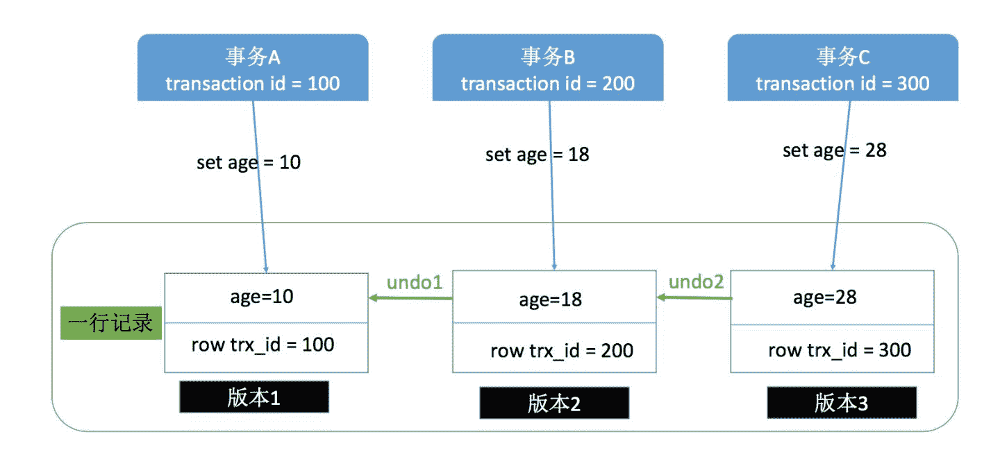
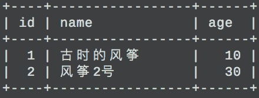
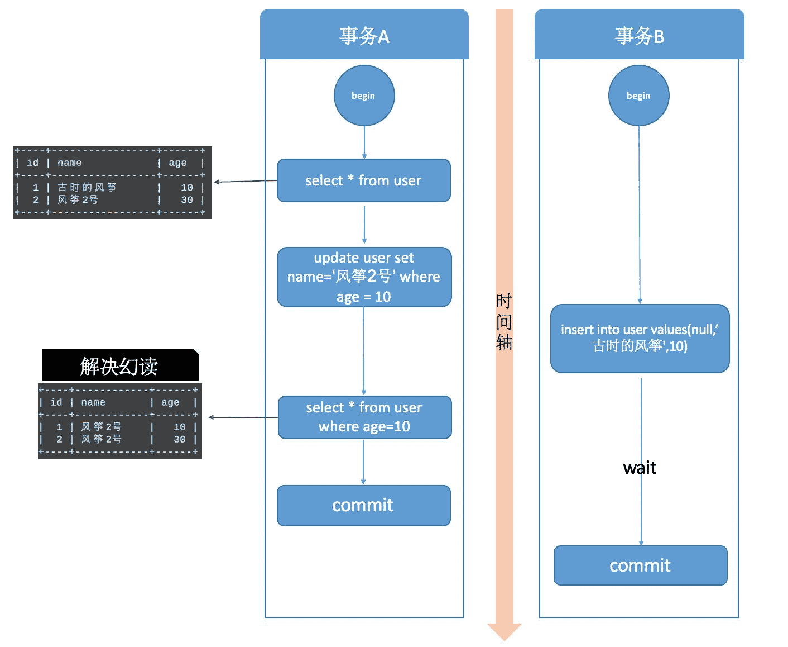

# 第二章 第 5 节 Java 数据库-5

> 原文：[`www.nowcoder.com/tutorial/10070/521e2d2996164d0eb427d0872108b96f`](https://www.nowcoder.com/tutorial/10070/521e2d2996164d0eb427d0872108b96f)

#### 3.6 事务可以嵌套吗？

**参考答案**

可以，因为嵌套事务也是众多事务分类中的一种，它是一个层次结构框架。有一个顶层事务控制着各个层次的事务，顶层事务之下嵌套的事务被称为子事务，它控制每一个局部的变换。

需要注意的是，MySQL 数据库不支持嵌套事务。

#### 3.7 如何实现可重复读？

**参考答案**

为了实现可重复读，MySQL 采用了 MVVC (多版本并发控制) 的方式。

我们在数据库表中看到的一行记录可能实际上有多个版本，每个版本的记录除了有数据本身外，还要有一个表示版本的字段，记为 row trx_id，而这个字段就是使其产生的事务的 id，事务 ID 记为 transaction id，它在事务开始的时候向事务系统申请，按时间先后顺序递增。

如下图，一行记录现在有 3 个版本，每一个版本都记录这使其产生的事务 ID，比如事务 A 的 transaction id 是 100，那么版本 1 的 row trx_id 就是 100，同理版本 2 和版本 3。

可重复读是在事务开始的时候生成一个当前事务全局性的快照。对于一个快照来说，它能够读到那些版本数据，要遵循以下规则：

1.  当前事务内的更新，可以读到；
2.  版本未提交，不能读到；
3.  版本已提交，但是却在快照创建后提交的，不能读到；
4.  版本已提交，且是在快照创建前提交的，可以读到。

#### 3.8 如何解决幻读问题？

**参考答案**

MySQL 已经在可重复读隔离级别下解决了幻读的问题，用的是间隙锁。MySQL 把行锁和间隙锁合并在一起，解决了并发写和幻读的问题，这个锁叫做 Next-Key 锁。

假设现在表中有两条记录，并且 age 字段已经添加了索引，两条记录 age 的值分别为 10 和 30。此时，在数据库中会为索引维护一套 B+树，用来快速定位行记录。B+索引树是有序的，所以会把这张表的索引分割成几个区间。

此时，在数据库中会为索引维护一套 B+树，用来快速定位行记录。B+索引树是有序的，所以会把这张表的索引分割成几个区间。如图所示，分成了 3 个区间，在这 3 个区间是可以加间隙锁的。

之后，我用下面的两个事务演示一下加锁过程。

在事务 A 提交之前，事务 B 的插入操作只能等待，这就是间隙锁起得作用。当事务 A 执行`update user set name='风筝 2 号’ where age = 10;` 的时候，由于条件 where age = 10 ，数据库不仅在 age =10 的行上添加了行锁，而且在这条记录的两边，也就是(负无穷,10]、(10,30]这两个区间加了间隙锁，从而导致事务 B 插入操作无法完成，只能等待事务 A 提交。不仅插入 age = 10 的记录需要等待事务 A 提交，age<10、10<age<30 的记录页无法完成，而大于等于 30 的记录则不受影响，这足以解决幻读问题了。

这是有索引的情况，如果 age 不是索引列，那么数据库会为整个表加上间隙锁。所以，如果是没有索引的话，不管 age 是否大于等于 30，都要等待事务 A 提交才可以成功插入。

#### 3.9 MySQL 事务如何回滚？

**参考答案**

在 MySQL 默认的配置下，事务都是自动提交和回滚的。当显示地开启一个事务时，可以使用 ROLLBACK 语句进行回滚。该语句有两种用法：

*   ROLLBACK：要使用这个语句的最简形式，只需发出 ROLLBACK。同样地，也可以写为 ROLLBACK WORK，但是二者几乎是等价的。回滚会结束用户的事务，并撤销正在进行的所有未提交的修改。
*   ROLLBACK TO [SAVEPOINT] identifier ：这个语句与 SAVEPOINT 命令一起使用。可以把事务回滚到标记点，而不回滚在此标记点之前的任何工作。

## 4\. 锁

#### 4.1 了解数据库的锁吗？

**参考答案**

锁是数据库系统区别于文件系统的一个关键特性，锁机制用于管理对共享资源的并发访问。下面我们以 MySQL 数据库的 InnoDB 引擎为例，来说明锁的一些特点。

锁的类型：

InnoDB 存储引擎实现了如下两种标准的行级锁：

*   共享锁（S Lock），允许事务读一行数据。
*   排他锁（X Lock），允许事务删除或更新一行数据。

如果一个事务 T1 已经获得了行 r 的共享锁，那么另外的事务 T2 可以立即获得行 r 的共享锁，因为读取并没有改变行 r 的数据，称这种情况为锁兼容。但若有其他的事务 T3 想获得行 r 的排他锁，则其必须等待事务 T1、T2 释放行 r 上的共享锁，这种情况称为锁不兼容。下图显示了共享锁和排他锁的兼容性，可以发现 X 锁与任何的锁都不兼容，而 S 锁仅和 S 锁兼容。需要特别注意的是，S 和 X 锁都是行锁，兼容是指对同一记录（row）锁的兼容性情况。

锁的粒度：

InnoDB 存储引擎支持多粒度锁定，这种锁定允许事务在行级上的锁和表级上的锁同时存在。为了支持在不同粒度上进行加锁操作，InnoDB 存储引擎支持一种额外的锁方式，称之为意向锁。意向锁是将锁定的对象分为多个层次，意向锁意味着事务希望在更细粒度上进行加锁。

InnoDB 存储引擎支持意向锁设计比较简练，其意向锁即为表级别的锁。设计目的主要是为了在一个事务中揭示下一行将被请求的锁类型。其支持两种意向锁：

*   意向共享锁（IS Lock），事务想要获得一张表中某几行的共享锁。
*   意向排他锁（IX Lock），事务想要获得一张表中某几行的排他锁。

由于 InnoDB 存储引擎支持的是行级别的锁，因此意向锁其实不会阻塞除全表扫以外的任何请求。故表级意向锁与行级锁的兼容性如下图所示。

锁的算法：

InnoDB 存储引擎有 3 种行锁的算法，其分别是：

*   Record Lock：单个行记录上的锁。
*   Gap Lock：间隙锁，锁定一个范围，但不包含记录本身。
*   Next-Key Lock∶Gap Lock+Record Lock，锁定一个范围，并且锁定记录本身。

Record Lock 总是会去锁住索引记录，如果 InnoDB 存储引擎表在建立的时候没有设置任何一个索引，那么这时 InnoDB 存储引擎会使用隐式的主键来进行锁定。Next-Key Lock 是结合了 Gap Lock 和 Record Lock 的一种锁定算法，在 Next-Key Lock 算法下，InnoDB 对于行的查询都是采用这种锁定算法。采用 Next-Key Lock 的锁定技术称为 Next-Key Locking，其设计的目的是为了解决 Phantom Problem（幻读）。而利用这种锁定技术，锁定的不是单个值，而是一个范围，是谓词锁（predict lock）的一种改进。

关于死锁：

死锁是指两个或两个以上的事务在执行过程中，因争夺锁资源而造成的一种互相等待的现象。若无外力作用，事务都将无法推进下去。

解决死锁问题最简单的一种方法是超时，即当两个事务互相等待时，当一个等待时间超过设置的某一阈值时，其中一个事务进行回滚，另一个等待的事务就能继续进行。

除了超时机制，当前数据库还都普遍采用 wait-for graph（等待图）的方式来进行死锁检测。较之超时的解决方案，这是一种更为主动的死锁检测方式。InnoDB 存储引擎也采用的这种方式。wait-for graph 要求数据库保存以下两种信息：

*   锁的信息链表；
*   事务等待链表；

通过上述链表可以构造出一张图，而在这个图中若存在回路，就代表存在死锁，因此资源间相互发生等待。这是一种较为主动的死锁检测机制，在每个事务请求锁并发生等待时都会判断是否存在回路，若存在则有死锁，通常来说 InnoDB 存储引擎选择回滚 undo 量最小的事务。

锁的升级：

锁升级（Lock Escalation）是指将当前锁的粒度降低。举例来说，数据库可以把一个表的 1000 个行锁升级为一个页锁，或者将页锁升级为表锁。

InnoDB 存储引擎不存在锁升级的问题。因为其不是根据每个记录来产生行锁的，相反，其根据每个事务访问的每个页对锁进行管理的，采用的是位图的方式。因此不管一个事务锁住页中一个记录还是多个记录，其开销通常都是一致的。

#### 4.2 介绍一下间隙锁

**参考答案**

InnoDB 存储引擎有 3 种行锁的算法，间隙锁（Gap Lock）是其中之一。间隙锁用于锁定一个范围，但不包含记录本身。它的作用是为了阻止多个事务将记录插入到同一范围内，而这会导致幻读问题的产生。

#### 4.3 InnoDB 中行级锁是怎么实现的？

**参考答案**

InnoDB 行级锁是通过给索引上的索引项加锁来实现的。只有通过索引条件检索数据，InnoDB 才使用行级锁，否则，InnoDB 将使用表锁。

当表中锁定其中的某几行时，不同的事务可以使用不同的索引锁定不同的行。另外，不论使用主键索引、唯一索引还是普通索引，InnoDB 都会使用行锁来对数据加锁。

#### 4.4 数据库在什么情况下会发生死锁？

**参考答案**

死锁是指两个或两个以上的事务在执行过程中，因争夺锁资源而造成的一种互相等待的现象。若无外力作用，事务都将无法推进下去。下图演示了死锁的一种经典的情况，即 A 等待 B、B 等待 A，这种死锁问题被称为 AB-BA 死锁。

#### 4.5 说说数据库死锁的解决办法

**参考答案**

解决死锁问题最简单的一种方法是超时，即当两个事务互相等待时，当一个等待时间超过设置的某一阈值时，其中一个事务进行回滚，另一个等待的事务就能继续进行。

除了超时机制，当前数据库还都普遍采用 wait-for graph（等待图）的方式来进行死锁检测。较之超时的解决方案，这是一种更为主动的死锁检测方式。InnoDB 存储引擎也采用的这种方式。wait-for graph 要求数据库保存以下两种信息：

*   锁的信息链表；
*   事务等待链表；

通过上述链表可以构造出一张图，而在这个图中若存在回路，就代表存在死锁，因此资源间相互发生等待。这是一种较为主动的死锁检测机制，在每个事务请求锁并发生等待时都会判断是否存在回路，若存在则有死锁，通常来说 InnoDB 存储引擎选择回滚 undo 量最小的事务。