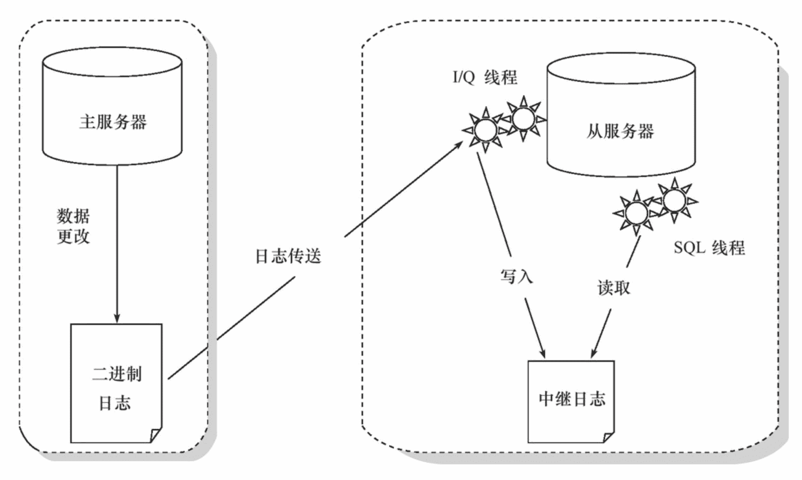

# 第二章 第 8 节 Java 数据库-8

> 原文：[`www.nowcoder.com/tutorial/10070/f63b4aa585b94293b22c0fd11c2670cf`](https://www.nowcoder.com/tutorial/10070/f63b4aa585b94293b22c0fd11c2670cf)

#### 6.3 说一说你对 redo log、undo log、binlog 的了解

**参考答案**

binlog（Binary Log）：

二进制日志文件就是常说的 binlog。二进制日志记录了 MySQL 所有修改数据库的操作，然后以二进制的形式记录在日志文件中，其中还包括每条语句所执行的时间和所消耗的资源，以及相关的事务信息。

默认情况下，二进制日志功能是开启的，启动时可以重新配置`--log-bin[=file_name]`选项，修改二进制日志存放的目录和文件名称。

redo log：

重做日志用来实现事务的持久性，即事务 ACID 中的 D。它由两部分组成：一是内存中的重做日志缓冲（redo log buffer），其是易失的；二是重做日志文件（redo log file），它是持久的。

InnoDB 是事务的存储引擎，它通过 Force Log at Commit 机制实现事务的持久性，即当事务提交（COMMIT）时，必须先将该事务的所有日志写入到重做日志文件进行持久化，待事务的 COMMIT 操作完成才算完成。这里的日志是指重做日志，在 InnoDB 存储引擎中，由两部分组成，即 redo log 和 undo log。

redo log 用来保证事务的持久性，undo log 用来帮助事务回滚及 MVCC 的功能。redo log 基本上都是顺序写的，在数据库运行时不需要对 redo log 的文件进行读取操作。而 undo log 是需要进行随机读写的。

undo log：

重做日志记录了事务的行为，可以很好地通过其对页进行“重做”操作。但是事务有时还需要进行回滚操作，这时就需要 undo。因此在对数据库进行修改时，InnoDB 存储引擎不但会产生 redo，还会产生一定量的 undo。这样如果用户执行的事务或语句由于某种原因失败了，又或者用户用一条 ROLLBACK 语句请求回滚，就可以利用这些 undo 信息将数据回滚到修改之前的样子。

redo 存放在重做日志文件中，与 redo 不同，undo 存放在数据库内部的一个特殊段（segment）中，这个段称为 undo 段（undo segment），undo 段位于共享表空间内。

#### 6.4 谈谈你对 MVCC 的了解

**参考答案**

InnoDB 默认的隔离级别是 RR（REPEATABLE READ），RR 解决脏读、不可重复读、幻读等问题，使用的是 MVCC。MVCC 全称 Multi-Version Concurrency Control，即多版本的并发控制协议。它最大的优点是读不加锁，因此读写不冲突，并发性能好。InnoDB 实现 MVCC，多个版本的数据可以共存，主要基于以下技术及数据结构：

1.  隐藏列：InnoDB 中每行数据都有隐藏列，隐藏列中包含了本行数据的事务 id、指向 undo log 的指针等。
2.  基于 undo log 的版本链：每行数据的隐藏列中包含了指向 undo log 的指针，而每条 undo log 也会指向更早版本的 undo log，从而形成一条版本链。
3.  ReadView：通过隐藏列和版本链，MySQL 可以将数据恢复到指定版本。但是具体要恢复到哪个版本，则需要根据 ReadView 来确定。所谓 ReadView，是指事务（记做事务 A）在某一时刻给整个事务系统（trx_sys）打快照，之后再进行读操作时，会将读取到的数据中的事务 id 与 trx_sys 快照比较，从而判断数据对该 ReadView 是否可见，即对事务 A 是否可见。

#### 6.5 MySQL 主从同步是如何实现的？

**参考答案**

复制（replication）是 MySQL 数据库提供的一种高可用高性能的解决方案，一般用来建立大型的应用。总体来说，replication 的工作原理分为以下 3 个步骤：

1.  主服务器（master）把数据更改记录到二进制日志（binlog）中。
2.  从服务器（slave）把主服务器的二进制日志复制到自己的中继日志（relay log）中。
3.  从服务器重做中继日志中的日志，把更改应用到自己的数据库上，以达到数据的最终一致性。

复制的工作原理并不复杂，其实就是一个完全备份加上二进制日志备份的还原。不同的是这个二进制日志的还原操作基本上实时在进行中。这里特别需要注意的是，复制不是完全实时地进行同步，而是异步实时。这中间存在主从服务器之间的执行延时，如果主服务器的压力很大，则可能导致主从服务器延时较大。复制的工作原理如下图所示，其中从服务器有 2 个线程，一个是 I/O 线程，负责读取主服务器的二进制日志，并将其保存为中继日志；另一个是 SQL 线程，复制执行中继日志。

