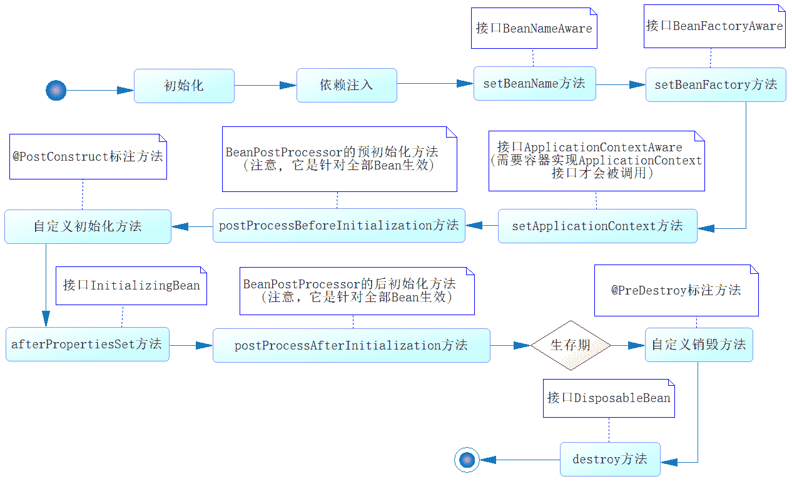

# 第三章 第 2 节 Java-web 开发-2

> 原文：[`www.nowcoder.com/tutorial/10070/2b75bba03b704f79966c006b7fff3277`](https://www.nowcoder.com/tutorial/10070/2b75bba03b704f79966c006b7fff3277)

## 2\. Spring

#### 2.1 请你说说 Spring 的核心是什么

**参考答案**

Spring 框架包含众多模块，如 Core、Testing、Data Access、Web Servlet 等，其中 Core 是整个 Spring 框架的核心模块。Core 模块提供了 IoC 容器、AOP 功能、数据绑定、类型转换等一系列的基础功能，而这些功能以及其他模块的功能都是建立在 IoC 和 AOP 之上的，所以 IoC 和 AOP 是 Spring 框架的核心。

IoC（Inversion of Control）是控制反转的意思，这是一种面向对象编程的设计思想。在不采用这种思想的情况下，我们需要自己维护对象与对象之间的依赖关系，很容易造成对象之间的耦合度过高，在一个大型的项目中这十分的不利于代码的维护。IoC 则可以解决这种问题，它可以帮我们维护对象与对象之间的依赖关系，降低对象之间的耦合度。

说到 IoC 就不得不说 DI（Dependency Injection），DI 是依赖注入的意思，它是 IoC 实现的实现方式，就是说 IoC 是通过 DI 来实现的。由于 IoC 这个词汇比较抽象而 DI 却更直观，所以很多时候我们就用 DI 来代替它，在很多时候我们简单地将 IoC 和 DI 划等号，这是一种习惯。而实现依赖注入的关键是 IoC 容器，它的本质就是一个工厂。

AOP（Aspect Oriented Programing）是面向切面编程思想，这种思想是对 OOP 的补充，它可以在 OOP 的基础上进一步提高编程的效率。简单来说，它可以统一解决一批组件的共性需求（如权限检查、记录日志、事务管理等）。在 AOP 思想下，我们可以将解决共性需求的代码独立出来，然后通过配置的方式，声明这些代码在什么地方、什么时机调用。当满足调用条件时，AOP 会将该业务代码织入到我们指定的位置，从而统一解决了问题，又不需要修改这一批组件的代码。

#### 2.2 说一说你对 Spring 容器的了解

**参考答案**

Spring 主要提供了两种类型的容器：BeanFactory 和 ApplicationContext。

*   BeanFactory：是基础类型的 IoC 容器，提供完整的 IoC 服务支持。如果没有特殊指定，默认采用延
    迟初始化策略。只有当客户端对象需要访问容器中的某个受管对象的时候，才对该受管对象进行初始化以及依赖注入操作。所以，相对来说，容器启动初期速度较快，所需要的资源有限。对于资源有限，并且功能要求不是很严格的场景，BeanFactory 是比较合适的 IoC 容器选择。
*   ApplicationContext：它是在 BeanFactory 的基础上构建的，是相对比较高级的容器实现，除了拥有 BeanFactory 的所有支持，ApplicationContext 还提供了其他高级特性，比如事件发布、国际化信息支持等。ApplicationContext 所管理的对象，在该类型容器启动之后，默认全部初始化并绑定完成。所以，相对于 BeanFactory 来说，ApplicationContext 要求更多的系统资源，同时，因为在启动时就完成所有初始化，容
    器启动时间较之 BeanFactory 也会长一些。在那些系统资源充足，并且要求更多功能的场景中，ApplicationContext 类型的容器是比较合适的选择。

#### 2.3 说一说你对 BeanFactory 的了解

**参考答案**

BeanFactory 是一个类工厂，与传统类工厂不同的是，BeanFactory 是类的通用工厂，它可以创建并管理各种类的对象。这些可被创建和管理的对象本身没有什么特别之处，仅是一个 POJO，Spring 称这些被创建和管理的 Java 对象为 Bean。并且，Spring 中所说的 Bean 比 JavaBean 更为宽泛一些，所有可以被 Spring 容器实例化并管理的 Java 类都可以成为 Bean。

BeanFactory 是 Spring 容器的顶层接口，Spring 为 BeanFactory 提供了多种实现，最常用的是 XmlBeanFactory。但它在 Spring 3.2 中已被废弃，建议使用 XmlBeanDefinitionReader、DefaultListableBeanFactory 替代。BeanFactory 最主要的方法就是 `getBean(String beanName)`，该方法从容器中返回特定名称的 Bean。

#### 2.4 说一说你对 Spring IOC 的理解

**参考答案**

IoC（Inversion of Control）是控制反转的意思，这是一种面向对象编程的设计思想。在不采用这种思想的情况下，我们需要自己维护对象与对象之间的依赖关系，很容易造成对象之间的耦合度过高，在一个大型的项目中这十分的不利于代码的维护。IoC 则可以解决这种问题，它可以帮我们维护对象与对象之间的依赖关系，降低对象之间的耦合度。

说到 IoC 就不得不说 DI（Dependency Injection），DI 是依赖注入的意思，它是 IoC 实现的实现方式，就是说 IoC 是通过 DI 来实现的。由于 IoC 这个词汇比较抽象而 DI 却更直观，所以很多时候我们就用 DI 来代替它，在很多时候我们简单地将 IoC 和 DI 划等号，这是一种习惯。而实现依赖注入的关键是 IoC 容器，它的本质就是一个工厂。

在具体的实现中，主要由三种注入方式：

1.  构造方法注入

    就是被注入对象可以在它的构造方法中声明依赖对象的参数列表，让外部知道它需要哪些依赖对象。然后，IoC Service Provider 会检查被注入的对象的构造方法，取得它所需要的依赖对象列表，进而为其注入相应的对象。构造方法注入方式比较直观，对象被构造完成后，即进入就绪状态，可以马上使用。

2.  setter 方法注入

    通过 setter 方法，可以更改相应的对象属性。所以，当前对象只要为其依赖对象所对应的属性添加 setter 方法，就可以通过 setter 方法将相应的依赖对象设置到被注入对象中。setter 方法注入虽不像构造方法注入那样，让对象构造完成后即可使用，但相对来说更宽松一些，
    可以在对象构造完成后再注入。

3.  接口注入

    相对于前两种注入方式来说，接口注入没有那么简单明了。被注入对象如果想要 IoC Service Provider 为其注入依赖对象，就必须实现某个接口。这个接口提供一个方法，用来为其注入依赖对象。IoC Service Provider 最终通过这些接口来了解应该为被注入对象注入什么依赖对象。相对于前两种依赖注入方式，接口注入比较死板和烦琐。

总体来说，构造方法注入和 setter 方法注入因为其侵入性较弱，且易于理解和使用，所以是现在使用最多的注入方式。而接口注入因为侵入性较强，近年来已经不流行了。

#### 2.5 Spring 是如何管理 Bean 的？

**参考答案**

Spring 通过 IoC 容器来管理 Bean，我们可以通过 XML 配置或者注解配置，来指导 IoC 容器对 Bean 的管理。因为注解配置比 XML 配置方便很多，所以现在大多时候会使用注解配置的方式。

以下是管理 Bean 时常用的一些注解：

1.  @ComponentScan 用于声明扫描策略，通过它的声明，容器就知道要扫描哪些包下带有声明的类，也可以知道哪些特定的类是被排除在外的。
2.  @Component、@Repository、@Service、@Controller 用于声明 Bean，它们的作用一样，但是语义不同。@Component 用于声明通用的 Bean，@Repository 用于声明 DAO 层的 Bean，@Service 用于声明业务层的 Bean，@Controller 用于声明视图层的控制器 Bean，被这些注解声明的类就可以被容器扫描并创建。
3.  @Autowired、@Qualifier 用于注入 Bean，即告诉容器应该为当前属性注入哪个 Bean。其中，@Autowired 是按照 Bean 的类型进行匹配的，如果这个属性的类型具有多个 Bean，就可以通过@Qualifier 指定 Bean 的名称，以消除歧义。
4.  @Scope 用于声明 Bean 的作用域，默认情况下 Bean 是单例的，即在整个容器中这个类型只有一个实例。可以通过@Scope 注解指定 prototype 值将其声明为多例的，也可以将 Bean 声明为 session 级作用域、request 级作用域等等，但最常用的还是默认的单例模式。
5.  @PostConstruct、@PreDestroy 用于声明 Bean 的生命周期。其中，被@PostConstruct 修饰的方法将在 Bean 实例化后被调用，@PreDestroy 修饰的方法将在容器销毁前被调用。

#### 2.6 介绍 Bean 的作用域

**参考答案**

默认情况下，Bean 在 Spring 容器中是单例的，我们可以通过@Scope 注解修改 Bean 的作用域。该注解有如下 5 个取值，它们代表了 Bean 的 5 种不同类型的作用域：

| 类型 | 说明 |
| --- | --- |
| singleton | 在 Spring 容器中仅存在一个实例，即 Bean 以单例的形式存在。 |
| prototype | 每次调用 getBean()时，都会执行 new 操作，返回一个新的实例。 |
| request | 每次 HTTP 请求都会创建一个新的 Bean。 |
| session | 同一个 HTTP Session 共享一个 Bean，不同的 HTTP Session 使用不同的 Bean。 |
| globalSession | 同一个全局的 Session 共享一个 Bean，一般用于 Portlet 环境。 |

#### 2.7 说一说 Bean 的生命周期

**参考答案**

Spring 容器管理 Bean，涉及对 Bean 的创建、初始化、调用、销毁等一系列的流程，这个流程就是 Bean 的生命周期。整个流程参考下图：



这个过程是由 Spring 容器自动管理的，其中有两个环节我们可以进行干预。

1.  我们可以自定义初始化方法，并在该方法前增加@PostConstruct 注解，届时 Spring 容器将在调用 SetBeanFactory 方法之后调用该方法。
2.  我们可以自定义销毁方法，并在该方法前增加@PreDestroy 注解，届时 Spring 容器将在自身销毁前，调用这个方法。

#### 2.8 Spring 是怎么解决循环依赖的？

**参考答案**

首先，需要明确的是 spring 对循环依赖的处理有三种情况：

1.  构造器的循环依赖：这种依赖 spring 是处理不了的，直接抛出 BeanCurrentlylnCreationException 异常。
2.  单例模式下的 setter 循环依赖：通过“三级缓存”处理循环依赖。
3.  非单例循环依赖：无法处理。

接下来，我们具体看看 spring 是如何处理第二种循环依赖的。

Spring 单例对象的初始化大略分为三步：

1.  createBeanInstance：实例化，其实也就是调用对象的构造方法实例化对象；
2.  populateBean：填充属性，这一步主要是多 bean 的依赖属性进行填充；
3.  initializeBean：调用 spring xml 中的 init 方法。

从上面讲述的单例 bean 初始化步骤我们可以知道，循环依赖主要发生在第一步、第二步。也就是构造器循环依赖和 field 循环依赖。 Spring 为了解决单例的循环依赖问题，使用了三级缓存。

```cpp
/** Cache of singleton objects: bean name –> bean instance */
private final Map singletonObjects = new ConcurrentHashMap(256);
/** Cache of singleton factories: bean name –> ObjectFactory */
private final Map> singletonFactories = new HashMap>(16);
/** Cache of early singleton objects: bean name –> bean instance */
private final Map earlySingletonObjects = new HashMap(16);
```

这三级缓存的作用分别是：

*   singletonFactories ： 进入实例化阶段的单例对象工厂的 cache （三级缓存）；
*   earlySingletonObjects ：完成实例化但是尚未初始化的，提前暴光的单例对象的 Cache （二级缓存）；
*   singletonObjects：完成初始化的单例对象的 cache（一级缓存）。

我们在创建 bean 的时候，会首先从 cache 中获取这个 bean，这个缓存就是 sigletonObjects。主要的调用方法是：

```cpp
protected Object getSingleton(String beanName, boolean allowEarlyReference) {
    Object singletonObject = this.singletonObjects.get(beanName);
    //isSingletonCurrentlyInCreation()判断当前单例 bean 是否正在创建中
    if (singletonObject == null && isSingletonCurrentlyInCreation(beanName)) {
        synchronized (this.singletonObjects) {
            singletonObject = this.earlySingletonObjects.get(beanName);
            //allowEarlyReference 是否允许从 singletonFactories 中通过 getObject 拿到对象
            if (singletonObject == null && allowEarlyReference) {
                ObjectFactory<?> singletonFactory = this.singletonFactories.get(beanName);
                if (singletonFactory != null) {
                    singletonObject = singletonFactory.getObject();
                    //从 singletonFactories 中移除，并放入 earlySingletonObjects 中。
                    //其实也就是从三级缓存移动到了二级缓存
                    this.earlySingletonObjects.put(beanName, singletonObject);
                    this.singletonFactories.remove(beanName);
                }
            }
        }
    }
    return (singletonObject != NULL_OBJECT ? singletonObject : null);
}
```

从上面三级缓存的分析，我们可以知道，Spring 解决循环依赖的诀窍就在于 singletonFactories 这个三级 cache。这个 cache 的类型是 ObjectFactory，定义如下：

```cpp
public interface ObjectFactory<T> {
    T getObject() throws BeansException;
}
```

这个接口在 AbstractBeanFactory 里实现，并在核心方法 doCreateBean（）引用下面的方法：

```cpp
protected void addSingletonFactory(String beanName, ObjectFactory<?> singletonFactory) {
    Assert.notNull(singletonFactory, "Singleton factory must not be null");
    synchronized (this.singletonObjects) {
        if (!this.singletonObjects.containsKey(beanName)) {
            this.singletonFactories.put(beanName, singletonFactory);
            this.earlySingletonObjects.remove(beanName);
            this.registeredSingletons.add(beanName);
        }
    }
}
```

这段代码发生在 createBeanInstance 之后，populateBean（）之前，也就是说单例对象此时已经被创建出来(调用了构造器)。这个对象已经被生产出来了，此时将这个对象提前曝光出来，让大家使用。

这样做有什么好处呢？让我们来分析一下“A 的某个 field 或者 setter 依赖了 B 的实例对象，同时 B 的某个 field 或者 setter 依赖了 A 的实例对象”这种循环依赖的情况。A 首先完成了初始化的第一步，并且将自己提前曝光到 singletonFactories 中，此时进行初始化的第二步，发现自己依赖对象 B，此时就尝试去 get(B)，发现 B 还没有被 create，所以走 create 流程，B 在初始化第一步的时候发现自己依赖了对象 A，于是尝试 get(A)，尝试一级缓存 singletonObjects(肯定没有，因为 A 还没初始化完全)，尝试二级缓存 earlySingletonObjects（也没有），尝试三级缓存 singletonFactories，由于 A 通过 ObjectFactory 将自己提前曝光了，所以 B 能够通过 ObjectFactory.getObject 拿到 A 对象(虽然 A 还没有初始化完全，但是总比没有好呀)，B 拿到 A 对象后顺利完成了初始化阶段 1、2、3，完全初始化之后将自己放入到一级缓存 singletonObjects 中。此时返回 A 中，A 此时能拿到 B 的对象顺利完成自己的初始化阶段 2、3，最终 A 也完成了初始化，进去了一级缓存 singletonObjects 中，而且更加幸运的是，由于 B 拿到了 A 的对象引用，所以 B 现在 hold 住的 A 对象完成了初始化。

#### 2.9 @Autowired 和@Resource 注解有什么区别？

**参考答案**

1.  @Autowired 是 Spring 提供的注解，@Resource 是 JDK 提供的注解。
2.  @Autowired 是只能按类型注入，@Resource 默认按名称注入，也支持按类型注入。
3.  @Autowired 按类型装配依赖对象，默认情况下它要求依赖对象必须存在，如果允许 null 值，可以设置它 required 属性为 false，如果我们想使用按名称装配，可以结合@Qualifier 注解一起使用。@Resource 有两个中重要的属性：name 和 type。name 属性指定 byName，如果没有指定 name 属性，当注解标注在字段上，即默认取字段的名称作为 bean 名称寻找依赖对象，当注解标注在属性的 setter 方法上，即默认取属性名作为 bean 名称寻找依赖对象。需要注意的是，@Resource 如果没有指定 name 属性，并且按照默认的名称仍然找不到依赖对象时， @Resource 注解会回退到按类型装配。但一旦指定了 name 属性，就只能按名称装配了。