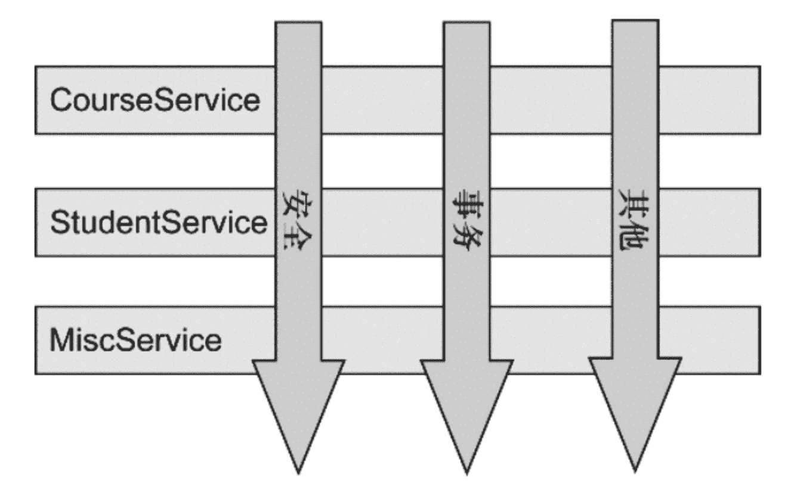

# 第三章 第 3 节 Java-web 开发-3

> 原文：[`www.nowcoder.com/tutorial/10070/17d9210c2cc740988ae43110ffe03b23`](https://www.nowcoder.com/tutorial/10070/17d9210c2cc740988ae43110ffe03b23)

#### 2.10 Spring 中默认提供的单例是线程安全的吗？

**参考答案**

不是。

Spring 容器本身并没有提供 Bean 的线程安全策略。如果单例的 Bean 是一个无状态的 Bean，即线程中的操作不会对 Bean 的成员执行查询以外的操作，那么这个单例的 Bean 是线程安全的。比如，Controller、Service、DAO 这样的组件，通常都是单例且线程安全的。如果单例的 Bean 是一个有状态的 Bean，则可以采用 ThreadLocal 对状态数据做线程隔离，来保证线程安全。

#### 2.11 说一说你对 Spring AOP 的理解

**参考答案**

AOP（Aspect Oriented Programming）是面向切面编程，它是一种编程思想，是面向对象编程（OOP）的一种补充。面向对象编程将程序抽象成各个层次的对象，而面向切面编程是将程序抽象成各个切面。如下图，可以很形象地看出，所谓切面，相当于应用对象间的横切点，我们可以将其单独抽象为单独的模块。

AOP 的术语：

*   连接点（join point）：对应的是具体被拦截的对象，因为 Spring 只能支持方法，所以被拦截的对象往往就是指特定的方法，AOP 将通过动态代理技术把它织入对应的流程中。
*   切点（point cut）：有时候，我们的切面不单单应用于单个方法，也可能是多个类的不同方法，这时，可以通过正则式和指示器的规则去定义，从而适配连接点。切点就是提供这样一个功能的概念。
*   通知（advice）：就是按照约定的流程下的方法，分为前置通知、后置通知、环绕通知、事后返回通知和异常通知，它会根据约定织入流程中。
*   目标对象（target）：即被代理对象。
*   引入（introduction）：是指引入新的类和其方法，增强现有 Bean 的功能。
*   织入（weaving）：它是一个通过动态代理技术，为原有服务对象生成代理对象，然后将与切点定义匹配的连接点拦截，并按约定将各类通知织入约定流程的过程。
*   切面（aspect）：是一个可以定义切点、各类通知和引入的内容，SpringAOP 将通过它的信息来增强 Bean 的功能或者将对应的方法织入流程。

Spring AOP：

AOP 可以有多种实现方式，而 Spring AOP 支持如下两种实现方式。

*   JDK 动态代理：这是 Java 提供的动态代理技术，可以在运行时创建接口的代理实例。Spring AOP 默认采用这种方式，在接口的代理实例中织入代码。
*   CGLib 动态代理：采用底层的字节码技术，在运行时创建子类代理的实例。当目标对象不存在接口时，Spring AOP 就会采用这种方式，在子类实例中织入代码。

#### 2.12 请你说说 AOP 的应用场景

**参考答案**

Spring AOP 为 IoC 的使用提供了更多的便利，一方面，应用可以直接使用 AOP 的功能，设计应用的横切关注点，把跨越应用程序多个模块的功能抽象出来，并通过简单的 AOP 的使用，灵活地编制到模块中，比如可以通过 AOP 实现应用程序中的日志功能。另一方面，在 Spring 内部，一些支持模块也是通过 Spring AOP 来实现的，比如事务处理。从这两个角度就已经可以看到 Spring AOP 的核心地位了。

#### 2.13 Spring AOP 不能对哪些类进行增强？

**参考答案**

1.  Spring AOP 只能对 IoC 容器中的 Bean 进行增强，对于不受容器管理的对象不能增强。
2.  由于 CGLib 采用动态创建子类的方式生成代理对象，所以不能对 final 修饰的类进行代理。

#### 2.14 JDK 动态代理和 CGLIB 有什么区别？

**参考答案**

JDK 动态代理

这是 Java 提供的动态代理技术，可以在运行时创建接口的代理实例。Spring AOP 默认采用这种方式，在接口的代理实例中织入代码。

CGLib 动态代理

采用底层的字节码技术，在运行时创建子类代理的实例。当目标对象不存在接口时，Spring AOP 就会采用这种方式，在子类实例中织入代码。

#### 2.15 既然有没有接口都可以用 CGLIB，为什么 Spring 还要使用 JDK 动态代理？

**参考答案**

在性能方面，CGLib 创建的代理对象比 JDK 动态代理创建的代理对象高很多。但是，CGLib 在创建代理对象时所花费的时间比 JDK 动态代理多很多。所以，对于单例的对象因为无需频繁创建代理对象，采用 CGLib 动态代理比较合适。反之，对于多例的对象因为需要频繁的创建代理对象，则 JDK 动态代理更合适。

#### 2.16 Spring 如何管理事务？

**参考答案**

Spring 为事务管理提供了一致的编程模板，在高层次上建立了统一的事务抽象。也就是说，不管是选择 MyBatis、Hibernate、JPA 还是 Spring JDBC，Spring 都可以让用户以统一的编程模型进行事务管理。

Spring 支持两种事务编程模型：

1.  编程式事务

    Spring 提供了 TransactionTemplate 模板，利用该模板我们可以通过编程的方式实现事务管理，而无需关注资源获取、复用、释放、事务同步及异常处理等操作。相对于声明式事务来说，这种方式相对麻烦一些，但是好在更为灵活，我们可以将事务管理的范围控制的更为精确。

2.  声明式事务

    Spring 事务管理的亮点在于声明式事务管理，它允许我们通过声明的方式，在 IoC 配置中指定事务的边界和事务属性，Spring 会自动在指定的事务边界上应用事务属性。相对于编程式事务来说，这种方式十分的方便，只需要在需要做事务管理的方法上，增加@Transactional 注解，以声明事务特征即可。

#### 2.17 Spring 的事务传播方式有哪些？

**参考答案**

当我们调用一个业务方法时，它的内部可能会调用其他的业务方法，以完成一个完整的业务操作。这种业务方法嵌套调用的时候，如果这两个方法都是要保证事务的，那么就要通过 Spring 的事务传播机制控制当前事务如何传播到被嵌套调用的业务方法中。

Spring 在 TransactionDefinition 接口中规定了 7 种类型的事务传播行为，它们规定了事务方法和事务方法发生嵌套调用时如何进行传播，如下表：

| 事务传播类型 | 说明 |
| --- | --- |
| PROPAGATION_REQUIRED | 如果当前没有事务，则新建一个事务；如果已存在一个事务，则加入到这个事务中。这是最常见的选择。 |
| PROPAGATION_SUPPORTS | 支持当前事务，如果当前没有事务，则以非事务方式执行。 |
| PROPAGATION_MANDATORY | 使用当前的事务，如果当前没有事务，则抛出异常。 |
| PROPAGATION_REQUIRES_NEW | 新建事务，如果当前存在事务，则把当前事务挂起。 |
| PROPAGATION_NOT_SUPPORTED | 以非事务方式执行操作，如果当前存在事务，则把当前事务挂起。 |
| PROPAGATION_NEVER | 以非事务方式执行操作，如果当前存在事务，则抛出异常。 |
| PROPAGATION_NESTED | 如果当前存在事务，则在嵌套事务内执行；如果当前没有事务，则执行与 PROPAGATION_REQUIRED 类似的操作。 |

#### 2.18 Spring 的事务如何配置，常用注解有哪些？

**参考答案**

事务的打开、回滚和提交是由事务管理器来完成的，我们使用不同的数据库访问框架，就要使用与之对应的事务管理器。在 Spring Boot 中，当你添加了数据库访问框架的起步依赖时，它就会进行自动配置，即自动实例化正确的事务管理器。

对于声明式事务，是使用@Transactional 进行标注的。这个注解可以标注在类或者方法上。

*   当它标注在类上时，代表这个类所有公共（public）非静态的方法都将启用事务功能。
*   当它标注在方法上时，代表这个方法将启用事务功能。

另外，在@Transactional 注解上，我们可以使用 isolation 属性声明事务的隔离级别，使用 propagation 属性声明事务的传播机制。

#### 2.19 说一说你对声明式事务的理解

**参考答案**

Spring 事务管理的亮点在于声明式事务管理，它允许我们通过声明的方式，在 IoC 配置中指定事务的边界和事务属性，Spring 会自动在指定的事务边界上应用事务属性。相对于编程式事务来说，这种方式十分的方便，只需要在需要做事务管理的方法上，增加@Transactional 注解，以声明事务特征即可。