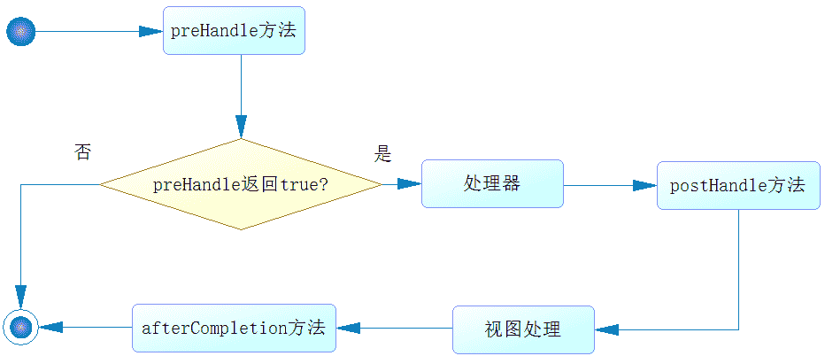

# 第三章 第 4 节 Java-web 开发-4

> 原文：[`www.nowcoder.com/tutorial/10070/7f350d1414e945849ebc75ca43d84027`](https://www.nowcoder.com/tutorial/10070/7f350d1414e945849ebc75ca43d84027)

## 3\. Spring MVC

#### 3.1 什么是 MVC？

**参考答案**

MVC 是一种设计模式，在这种模式下软件被分为三层，即 Model（模型）、View（视图）、Controller（控制器）。Model 代表的是数据，View 代表的是用户界面，Controller 代表的是数据的处理逻辑，它是 Model 和 View 这两层的桥梁。将软件分层的好处是，可以将对象之间的耦合度降低，便于代码的维护。

#### 3.2 DAO 层是做什么的？

**参考答案**

DAO 是 Data Access Obejct 的缩写，即数据访问对象，在项目中它通常作为独立的一层，专门用于访问数据库。这一层的具体实现技术有很多，常用的有 Spring JDBC、Hibernate、JPA、MyBatis 等，在 Spring 框架下无论采用哪一种技术访问数据库，它的编程模式都是统一的。

#### 3.3 介绍一下 Spring MVC 的执行流程

**参考答案**

1.  整个过程开始于客户端发出的一个 HTTP 请求，Web 应用服务器接收到这个请求。如果匹配 DispatcherServlet 的请求映射路径，则 Web 容器将该请求转交给 DispatcherServlet 处理。
2.  DispatcherServlet 接收到这个请求后，将根据请求的信息（包括 URL、HTTP 方法、请求报文头、请求参数、Cookie 等）及 HandlerMapping 的配置找到处理请求的处理器（Handler）。可将 HandlerMapping 看做路由控制器，将 Handler 看做目标主机。值得注意的是，在 Spring MVC 中并没有定义一个 Handler 接口，实际上任何一个 Object 都可以成为请求处理器。
3.  当 DispatcherServlet 根据 HandlerMapping 得到对应当前请求的 Handler 后，通过 HandlerAdapter 对 Handler 进行封装，再以统一的适配器接口调用 Handler。HandlerAdapter 是 Spring MVC 框架级接口，顾名思义，HandlerAdapter 是一个适配器，它用统一的接口对各种 Handler 方法进行调用。
4.  处理器完成业务逻 辑的处理后，将返回一个 ModelAndView 给 DispatcherServlet，ModelAndView 包含了视图逻辑名和模型数据信息。
5.  ModelAndView 中包含的是“逻辑视图名”而非真正的视图对象，DispatcherServlet 借由 ViewResolver 完成逻辑视图名到真实视图对象的解析工作。
6.  当得到真实的视图对象 View 后，DispatcherServlet 就使用这个 View 对象对 ModelAndView 中的模型数据进行视图渲染。
7.  最终客户端得到的响应消息可能是一个普通的 HTML 页面，也可能是一个 XML 或 JSON 串，甚至是一张图片或一个 PDF 文档等不同的媒体形式。

#### 3.4 说一说你知道的 Spring MVC 注解

**参考答案**

@RequestMapping：

作用：该注解的作用就是用来处理请求地址映射的，也就是说将其中的处理器方法映射到 url 路径上。

属性：

*   method：是让你指定请求的 method 的类型，比如常用的有 get 和 post。
*   value：是指请求的实际地址，如果是多个地址就用{}来指定就可以啦。
*   produces：指定返回的内容类型，当 request 请求头中的 Accept 类型中包含指定的类型才可以返回的。
*   consumes：指定处理请求的提交内容类型，比如一些 json、html、text 等的类型。
*   headers：指定 request 中必须包含那些的 headed 值时，它才会用该方法处理请求的。
*   params：指定 request 中一定要有的参数值，它才会使用该方法处理请求。

@RequestParam：

作用：是将请求参数绑定到你的控制器的方法参数上，是 Spring MVC 中的接收普通参数的注解。

属性：

*   value 是请求参数中的名称。
*   required 是请求参数是否必须提供参数，它的默认是 true，意思是表示必须提供。

@RequestBody：

作用：如果作用在方法上，就表示该方法的返回结果是直接按写入的 Http responsebody 中（一般在异步获取数据时使用的注解）。

属性：required，是否必须有请求体。它的默认值是 true，在使用该注解时，值得注意的当为 true 时 get 的请求方式是报错的，如果你取值为 false 的话，get 的请求是 null。

@PathVaribale：

作用：该注解是用于绑定 url 中的占位符，但是注意，spring3.0 以后，url 才开始支持占位符的，它是 Spring MVC 支持的 rest 风格 url 的一个重要的标志。

#### 3.5 介绍一下 Spring MVC 的拦截器

**参考答案**

拦截器会对处理器进行拦截，这样通过拦截器就可以增强处理器的功能。Spring MVC 中，所有的拦截器都需要实现 HandlerInterceptor 接口，该接口包含如下三个方法：preHandle()、postHandle()、afterCompletion()。

这些方法的执行流程如下图：

通过上图可以看出，Spring MVC 拦截器的执行流程如下：

*   执行 preHandle 方法，它会返回一个布尔值。如果为 false，则结束所有流程，如果为 true，则执行下一步。
*   执行处理器逻辑，它包含控制器的功能。
*   执行 postHandle 方法。
*   执行视图解析和视图渲染。
*   执行 afterCompletion 方法。

Spring MVC 拦截器的开发步骤如下：

1.  开发拦截器：

    实现 handlerInterceptor 接口，从三个方法中选择合适的方法，实现拦截时要执行的具体业务逻辑。

2.  注册拦截器：

    定义配置类，并让它实现 WebMvcConfigurer 接口，在接口的 addInterceptors 方法中，注册拦截器，并定义该拦截器匹配哪些请求路径。

#### 3.6 怎么去做请求拦截？

**参考答案**

如果是对 Controller 记性拦截，则可以使用 Spring MVC 的拦截器。

如果是对所有的请求（如访问静态资源的请求）进行拦截，则可以使用 Filter。

如果是对除了 Controller 之外的其他 Bean 的请求进行拦截，则可以使用 Spring AOP。