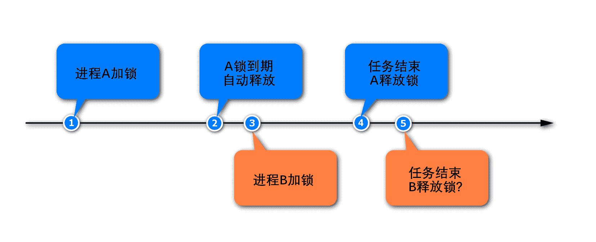

# 第四章 第 1 节 Java-中间件-1

> 原文：[`www.nowcoder.com/tutorial/10070/d1df94f5f1354e20a897c08aa99f8629`](https://www.nowcoder.com/tutorial/10070/d1df94f5f1354e20a897c08aa99f8629)

## 1\. Redis

#### 1.1 Redis 可以用来做什么？

**参考答案**

1.  Redis 最常用来做缓存，是实现分布式缓存的首先中间件；
2.  Redis 可以作为数据库，实现诸如点赞、关注、排行等对性能要求极高的互联网需求；
3.  Redis 可以作为计算工具，能用很小的代价，统计诸如 PV/UV、用户在线天数等数据；
4.  Redis 还有很多其他的使用场景，例如：可以实现分布式锁，可以作为消息队列使用。

#### 1.2 Redis 和传统的关系型数据库有什么不同？

**参考答案**

Redis 是一种基于键值对的 NoSQL 数据库，而键值对的值是由多种数据结构和算法组成的。Redis 的数据都存储于内存中，因此它的速度惊人，读写性能可达 10 万/秒，远超关系型数据库。

关系型数据库是基于二维数据表来存储数据的，它的数据格式更为严谨，并支持关系查询。关系型数据库的数据存储于磁盘上，可以存放海量的数据，但性能远不如 Redis。

#### 1.3 Redis 有哪些数据类型？

**参考答案**

1.  Redis 支持 5 种核心的数据类型，分别是字符串、哈希、列表、集合、有序集合；
2.  Redis 还提供了 Bitmap、HyperLogLog、Geo 类型，但这些类型都是基于上述核心数据类型实现的；
3.  Redis 在 5.0 新增加了 Streams 数据类型，它是一个功能强大的、支持多播的、可持久化的消息队列。

#### 1.4 Redis 是单线程的，为什么还能这么快？

**参考答案**

1.  对服务端程序来说，线程切换和锁通常是性能杀手，而单线程避免了线程切换和竞争所产生的消耗；
2.  Redis 的大部分操作是在内存上完成的，这是它实现高性能的一个重要原因；
3.  Redis 采用了 IO 多路复用机制，使其在网络 IO 操作中能并发处理大量的客户端请求，实现高吞吐率。

关于 Redis 的单线程架构实现，如下图：


#### 1.5 Redis 在持久化时 fork 出一个子进程，这时已经有两个进程了，怎么能说是单线程呢？

**参考答案**

Redis 是单线程的，主要是指 Redis 的网络 IO 和键值对读写是由一个线程来完成的。而 Redis 的其他功能，如持久化、异步删除、集群数据同步等，则是依赖其他线程来执行的。所以，说 Redis 是单线程的只是一种习惯的说法，事实上它的底层不是单线程的。

#### 1.6 set 和 zset 有什么区别？

**参考答案**

set：

*   集合中的元素是无序、不可重复的，一个集合最多能存储 232-1 个元素；
*   集合除了支持对元素的增删改查之外，还支持对多个集合取交集、并集、差集。

zset：

*   有序集合保留了集合元素不能重复的特点；
*   有序集合会给每个元素设置一个分数，并以此作为排序的依据；
*   有序集合不能包含相同的元素，但是不同元素的分数可以相同。

#### 1.7 说一下 Redis 中的 watch 命令

**参考答案**

很多时候，要确保事务中的数据没有被其他客户端修改才执行该事务。Redis 提供了 watch 命令来解决这类问题，这是一种乐观锁的机制。客户端通过 watch 命令，要求服务器对一个或多个 key 进行监视，如果在客户端执行事务之前，这些 key 发生了变化，则服务器将拒绝执行客户端提交的事务，并向它返回一个空值。

#### 1.8 说说 Redis 中 List 结构的相关操作

**参考答案**

列表是线性有序的数据结构，它内部的元素是可以重复的，并且一个列表最多能存储 2³²-1 个元素。列表包含如下的常用命令：

*   lpush/rpush：从列表的左侧/右侧添加数据；
*   lrange：指定索引范围，并返回这个范围内的数据；
*   lindex：返回指定索引处的数据；
*   lpop/rpop：从列表的左侧/右侧弹出一个数据；
*   blpop/brpop：从列表的左侧/右侧弹出一个数据，若列表为空则进入阻塞状态。

#### 1.9 你要如何设计 Redis 的过期时间？

**参考答案**

1.  热点数据不设置过期时间，使其达到“物理”上的永不过期，可以避免缓存击穿问题；
2.  在设置过期时间时，可以附加一个随机数，避免大量的 key 同时过期，导致缓存雪崩。

#### 1.10 Redis 中，sexnx 命令的返回值是什么，如何使用该命令实现分布式锁？

**参考答案**

setnx 命令返回整数值，当返回 1 时表示设置值成果，当返回 0 时表示设置值失败（key 已存在）。

一般我们不建议直接使用 setnx 命令来实现分布式锁，因为为了避免出现死锁，我们要给锁设置一个自动过期时间。而 setnx 命令和设置过期时间的命令不是原子的，可能加锁成果而设置过期时间失败，依然存在死锁的隐患。对于这种情况，Redis 改进了 set 命令，给它增加了 nx 选项，启用该选项时 set 命令的效果就会 setnx 一样了。

采用 Redis 实现分布式锁，就是在 Redis 里存一份代表锁的数据，通常用字符串即可。采用改进后的 setnx 命令（即`set...nx...`命令）实现分布式锁的思路，以及优化的过程如下：

加锁：

第一版，这种方式的缺点是容易产生死锁，因为客户端有可能忘记解锁，或者解锁失败。

```cpp
setnx key value
```

第二版，给锁增加了过期时间，避免出现死锁。但这两个命令不是原子的，第二步可能会失败，依然无法避免死锁问题。

```cpp
setnx key value
expire key seconds
```

第三版，通过“set...nx...”命令，将加锁、过期命令编排到一起，它们是原子操作了，可以避免死锁。

```cpp
set key value nx ex seconds 
```

解锁：

解锁就是删除代表锁的那份数据。

```cpp
del key
```

问题：

看起来已经很完美了，但实际上还有隐患，如下图。进程 A 在任务没有执行完毕时，锁已经到期被释放了。等进程 A 的任务执行结束后，它依然会尝试释放锁，因为它的代码逻辑就是任务结束后释放锁。但是，它的锁早已自动释放过了，它此时释放的可能是其他线程的锁。



想要解决这个问题，我们需要解决两件事情：

1.  在加锁时就要给锁设置一个标识，进程要记住这个标识。当进程解锁的时候，要进行判断，是自己持有的锁才能释放，否则不能释放。可以为 key 赋一个随机值，来充当进程的标识。
2.  解锁时要先判断、再释放，这两步需要保证原子性，否则第二步失败的话，就会出现死锁。而获取和删除命令不是原子的，这就需要采用 Lua 脚本，通过 Lua 脚本将两个命令编排在一起，而整个 Lua 脚本的执行是原子的。

按照以上思路，优化后的命令如下：

```cpp
# 加锁
set key random-value nx ex seconds 

# 解锁
if redis.call("get",KEYS[1]) == ARGV[1] then
    return redis.call("del",KEYS[1])
else
    return 0
end
```

#### 1.11 说一说 Redis 的持久化策略

**参考答案**

Redis 支持 RDB 持久化、AOF 持久化、RDB-AOF 混合持久化这三种持久化方式。

RDB：

RDB(Redis Database)是 Redis 默认采用的持久化方式，它以快照的形式将进程数据持久化到硬盘中。RDB 会创建一个经过压缩的二进制文件，文件以“.rdb”结尾，内部存储了各个数据库的键值对数据等信息。RDB 持久化的触发方式有两种：

*   手动触发：通过 SAVE 或 BGSAVE 命令触发 RDB 持久化操作，创建“.rdb”文件；
*   自动触发：通过配置选项，让服务器在满足指定条件时自动执行 BGSAVE 命令。

其中，SAVE 命令执行期间，Redis 服务器将阻塞，直到“.rdb”文件创建完毕为止。而 BGSAVE 命令是异步版本的 SAVE 命令，它会使用 Redis 服务器进程的子进程，创建“.rdb”文件。BGSAVE 命令在创建子进程时会存在短暂的阻塞，之后服务器便可以继续处理其他客户端的请求。总之，BGSAVE 命令是针对 SAVE 阻塞问题做的优化，Redis 内部所有涉及 RDB 的操作都采用 BGSAVE 的方式，而 SAVE 命令已经废弃！

BGSAVE 命令的执行流程，如下图：


BGSAVE 命令的原理，如下图：


RDB 持久化的优缺点如下：

*   优点：RDB 生成紧凑压缩的二进制文件，体积小，使用该文件恢复数据的速度非常快；

*   缺点：BGSAVE 每次运行都要执行 fork 操作创建子进程，属于重量级操作，不宜频繁执行，

    所以 RDB 持久化没办法做到实时的持久化。

AOF：

AOF（Append Only File），解决了数据持久化的实时性，是目前 Redis 持久化的主流方式。AOF 以独立日志的方式，记录了每次写入命令，重启时再重新执行 AOF 文件中的命令来恢复数据。AOF 的工作流程包括：命令写入（append）、文件同步（sync）、文件重写（rewrite）、重启加载（load），如下图：


AOF 默认不开启，需要修改配置项来启用它：

```cpp
appendonly yes                           # 启用 AOF
appendfilename "appendonly.aof"      # 设置文件名
```

AOF 以文本协议格式写入命令，如：

```cpp
*3\r\n$3\r\nset\r\n$5\r\nhello\r\n$5\r\nworld\r\n
```

文本协议格式具有如下的优点：

1.  文本协议具有很好的兼容性；

2.  直接采用文本协议格式，可以避免二次处理的开销；

3.  文本协议具有可读性，方便直接修改和处理。

AOF 持久化的文件同步机制：

为了提高程序的写入性能，现代操作系统会把针对硬盘的多次写操作优化为一次写操作。

1.  当程序调用 write 对文件写入时，系统不会直接把书记写入硬盘，而是先将数据写入内存的缓冲区中；

2.  当达到特定的时间周期或缓冲区写满时，系统才会执行 flush 操作，将缓冲区中的数据冲洗至硬盘中；

这种优化机制虽然提高了性能，但也给程序的写入操作带来了不确定性。

1.  对于 AOF 这样的持久化功能来说，冲洗机制将直接影响 AOF 持久化的安全性；

2.  为了消除上述机制的不确定性，Redis 向用户提供了 appendfsync 选项，来控制系统冲洗 AOF 的频率；

3.  Linux 的 glibc 提供了 fsync 函数，可以将指定文件强制从缓冲区刷到硬盘，上述选项正是基于此函数。

appendfsync 选项的取值和含义如下：


AOF 持久化的优缺点如下：

*   优点：与 RDB 持久化可能丢失大量的数据相比，AOF 持久化的安全性要高很多。通过使用 everysec 选项，用户可以将数据丢失的时间窗口限制在 1 秒之内。
*   缺点：AOF 文件存储的是协议文本，它的体积要比二进制格式的”.rdb”文件大很多。AOF 需要通过执行 AOF 文件中的命令来恢复数据库，其恢复速度比 RDB 慢很多。AOF 在进行重写时也需要创建子进程，在数据库体积较大时将占用大量资源，会导致服务器的短暂阻塞。

RDB-AOF 混合持久化：

Redis 从 4.0 开始引入 RDB-AOF 混合持久化模式，这种模式是基于 AOF 持久化构建而来的。用户可以通过配置文件中的“aof-use-rdb-preamble yes”配置项开启 AOF 混合持久化。Redis 服务器在执行 AOF 重写操作时，会按照如下原则处理数据：

*   像执行 BGSAVE 命令一样，根据数据库当前的状态生成相应的 RDB 数据，并将其写入 AOF 文件中；
*   对于重写之后执行的 Redis 命令，则以协议文本的方式追加到 AOF 文件的末尾，即 RDB 数据之后。

通过使用 RDB-AOF 混合持久化，用户可以同时获得 RDB 持久化和 AOF 持久化的优点，服务器既可以通过 AOF 文件包含的 RDB 数据来实现快速的数据恢复操作，又可以通过 AOF 文件包含的 AOF 数据来将丢失数据的时间窗口限制在 1s 之内。