# 第四章 第 2 节 Java-中间件-2

> 原文：[`www.nowcoder.com/tutorial/10070/b9ebf6363fee4aa893386e9a33067923`](https://www.nowcoder.com/tutorial/10070/b9ebf6363fee4aa893386e9a33067923)

#### 1.12 如何实现 Redis 的高可用？

**参考答案**

实现 Redis 的高可用，主要有哨兵和集群两种方式。

哨兵：

Redis Sentinel（哨兵）是一个分布式架构，它包含若干个哨兵节点和数据节点。每个哨兵节点会对数据节点和其余的哨兵节点进行监控，当发现节点不可达时，会对节点做下线标识。如果被标识的是主节点，它就会与其他的哨兵节点进行协商，当多数哨兵节点都认为主节点不可达时，它们便会选举出一个哨兵节点来完成自动故障转移的工作，同时还会将这个变化实时地通知给应用方。整个过程是自动的，不需要人工介入，有效地解决了 Redis 的高可用问题！

一组哨兵可以监控一个主节点，也可以同时监控多个主节点，两种情况的拓扑结构如下图：

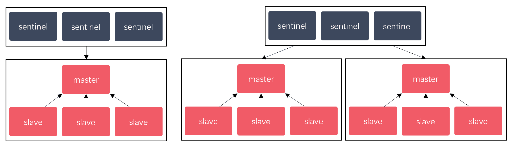

哨兵节点包含如下的特征：

1.  哨兵节点会定期监控数据节点，其他哨兵节点是否可达；

2.  哨兵节点会将故障转移的结果通知给应用方；

3.  哨兵节点可以将从节点晋升为主节点，并维护后续正确的主从关系；

4.  哨兵模式下，客户端连接的是哨兵节点集合，从中获取主节点信息；

5.  节点的故障判断是由多个哨兵节点共同完成的，可有效地防止误判；

6.  哨兵节点集合是由多个哨兵节点组成的，即使个别哨兵节点不可用，整个集合依然是健壮的；

7.  哨兵节点也是独立的 Redis 节点，是特殊的 Redis 节点，它们不存储数据，只支持部分命令。

集群：

Redis 集群采用虚拟槽分区来实现数据分片，它把所有的键根据哈希函数映射到`0-16383`整数槽内，计算公式为`slot=CRC16(key)&16383`，每一个节点负责维护一部分槽以及槽所映射的键值数据。虚拟槽分区具有如下特点：

1.  解耦数据和节点之间的关系，简化了节点扩容和收缩的难度；

2.  节点自身维护槽的映射关系，不需要客户端或者代理服务维护槽分区元数据；

3.  支持节点、槽、键之间的映射查询，用于数据路由，在线伸缩等场景。

Redis 集群中数据的分片逻辑如下图：

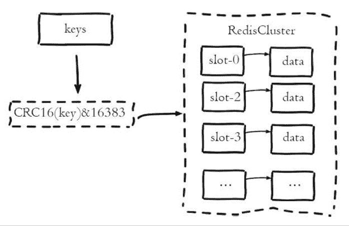

#### 1.13 Redis 的主从同步是如何实现的？

**参考答案**

从 2.8 版本开始，Redis 使用 psync 命令完成主从数据同步，同步过程分为全量复制和部分复制。全量复制一般用于初次复制的场景，部分复制则用于处理因网络中断等原因造成数据丢失的场景。psync 命令需要以下参数的支持：

1.  复制偏移量：主节点处理写命令后，会把命令长度做累加记录，从节点在接收到写命令后，也会做累加记录；从节点会每秒钟上报一次自身的复制偏移量给主节点，而主节点则会保存从节点的复制偏移量。

2.  积压缓冲区：保存在主节点上的一个固定长度的队列，默认大小为 1M，当主节点有连接的从节点时被创建；主节点处理写命令时，不但会把命令发送给从节点，还会写入积压缓冲区；缓冲区是先进先出的队列，可以保存最近已复制的数据，用于部分复制和命令丢失的数据补救。

3.  主节点运行 ID：每个 Redis 节点启动后，都会动态分配一个 40 位的十六进制字符串作为运行 ID；如果使用 IP 和端口的方式标识主节点，那么主节点重启变更了数据集（RDB/AOF），从节点再基于复制偏移量复制数据将是不安全的，因此当主节点的运行 ID 变化后，从节点将做全量复制。

psync 命令的执行过程以及返回结果，如下图：

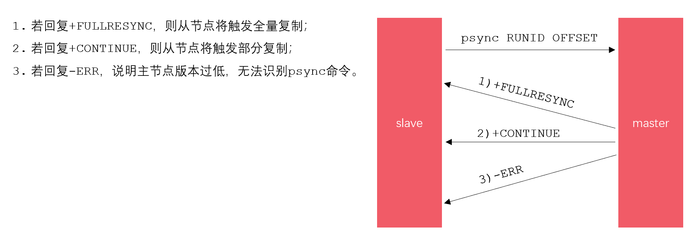

全量复制的过程，如下图：

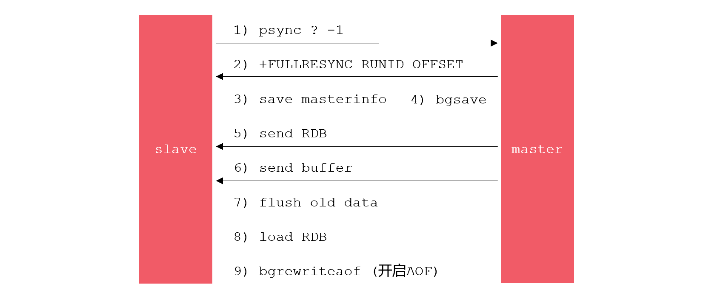

部分复制的过程，如下图：

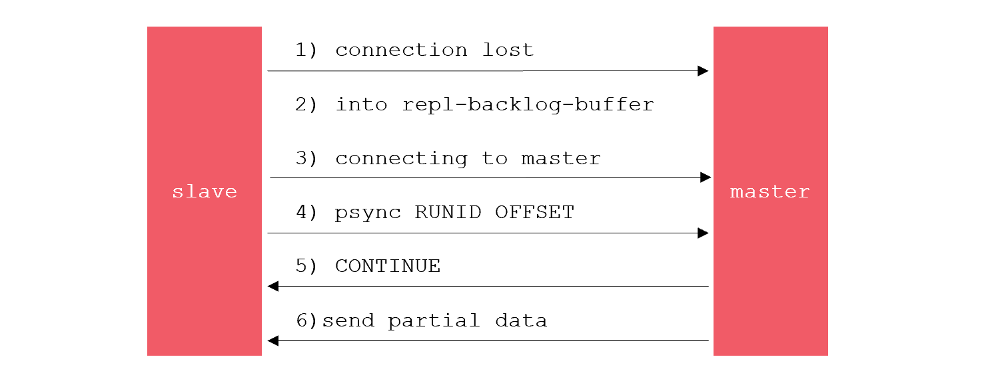

#### 1.14 Redis 为什么存的快，内存断电数据怎么恢复？

**参考答案**

Redis 存的快是因为它的数据都存放在内存里，并且为了保证数据的安全性，Redis 还提供了三种数据的持久化机制，即 RDB 持久化、AOF 持久化、RDB-AOF 混合持久化。若服务器断电，那么我们可以利用持久化文件，对数据进行恢复。理论上来说，AOF/RDB-AOF 持久化可以将丢失数据的窗口控制在 1S 之内。

#### 1.15 说一说 Redis 的缓存淘汰策略

**参考答案**

当写入数据将导致超出 maxmemory 限制时，Redis 会采用 maxmemory-policy 所指定的策略进行数据淘汰，该策略一共包含如下 8 种选项：

| **策略** | **描述** | **版本** |
| --- | --- | --- |
| noeviction | 直接返回错误； |  |
| volatile-ttl | 从设置了过期时间的键中，选择过期时间最小的键，进行淘汰； |  |
| volatile-random | 从设置了过期时间的键中，随机选择键，进行淘汰； |  |
| volatile-lru | 从设置了过期时间的键中，使用 LRU 算法选择键，进行淘汰； |  |
| volatile-lfu | 从设置了过期时间的键中，使用 LFU 算法选择键，进行淘汰； | 4.0 |
| allleys-random | 从所有的键中，随机选择键，进行淘汰； |  |
| allkeys-lru | 从所有的键中，使用 LRU 算法选择键，进行淘汰； |  |
| allkeys-lfu | 从所有的键中，使用 LFU 算法选择键，进行淘汰； | 4.0 |

其中，volatile 前缀代表从设置了过期时间的键中淘汰数据，allkeys 前缀代表从所有的键中淘汰数据。关于后缀，ttl 代表选择过期时间最小的键，random 代表随机选择键，需要我们额外关注的是 lru 和 lfu 后缀，它们分别代表采用 lru 算法和 lfu 算法来淘汰数据。

LRU（Least Recently Used）是按照最近最少使用原则来筛选数据，即最不常用的数据会被筛选出来！

*   标准 LRU：把所有的数据组成一个链表，表头和表尾分别表示 MRU 和 LRU 端，即最常使用端和最少使用端。刚被访问的数据会被移动到 MRU 端，而新增的数据也是刚被访问的数据，也会被移动到 MRU 端。当链表的空间被占满时，它会删除 LRU 端的数据。
*   近似 LRU：Redis 会记录每个数据的最近一次访问的时间戳（LRU）。Redis 执行写入操作时，若发现内存超出 maxmemory，就会执行一次近似 LRU 淘汰算法。近似 LRU 会随机采样 N 个 key，然后淘汰掉最旧的 key，若淘汰后内存依然超出限制，则继续采样淘汰。可以通过 maxmemory_samples 配置项，设置近似 LRU 每次采样的数据个数，该配置项的默认值为 5。

LRU 算法的不足之处在于，若一个 key 很少被访问，只是刚刚偶尔被访问了一次，则它就被认为是热点数据，短时间内不会被淘汰。

LFU 算法正式用于解决上述问题，LFU（Least Frequently Used）是 Redis4 新增的淘汰策略，它根据 key 的最近访问频率进行淘汰。LFU 在 LRU 的基础上，为每个数据增加了一个计数器，来统计这个数据的访问次数。当使用 LFU 策略淘汰数据时，首先会根据数据的访问次数进行筛选，把访问次数最低的数据淘汰出内存。如果两个数据的访问次数相同，LFU 再比较这两个数据的访问时间，把访问时间更早的数据淘汰出内存。

#### 1.16 请介绍一下 Redis 的过期策略

**参考答案**

Redis 支持如下两种过期策略：

惰性删除：客户端访问一个 key 的时候，Redis 会先检查它的过期时间，如果发现过期就立刻删除这个 key。

定期删除：Redis 会将设置了过期时间的 key 放到一个独立的字典中，并对该字典进行每秒 10 次的过期扫描，

过期扫描不会遍历字典中所有的 key，而是采用了一种简单的贪心策略。该策略的删除逻辑如下：

1.  从过期字典中随机选择 20 个 key；

2.  删除这 20 个 key 中已过期的 key；

3.  如果已过期 key 的比例超过 25%，则重复步骤 1。

#### 1.17 缓存穿透、缓存击穿、缓存雪崩有什么区别，该如何解决？

**参考答案**

缓存穿透：

问题描述：

客户端查询根本不存在的数据，使得请求直达存储层，导致其负载过大，甚至宕机。出现这种情况的原因，可能是业务层误将缓存和库中的数据删除了，也可能是有人恶意攻击，专门访问库中不存在的数据。

解决方案：

1.  缓存空对象：存储层未命中后，仍然将空值存入缓存层，客户端再次访问数据时，缓存层会直接返回空值。
2.  布隆过滤器：将数据存入布隆过滤器，访问缓存之前以过滤器拦截，若请求的数据不存在则直接返回空值。

缓存击穿：

问题描述：

一份热点数据，它的访问量非常大。在其缓存失效的瞬间，大量请求直达存储层，导致服务崩溃。

解决方案：

1.  永不过期：热点数据不设置过期时间，所以不会出现上述问题，这是“物理”上的永不过期。或者为每个数据设置逻辑过期时间，当发现该数据逻辑过期时，使用单独的线程重建缓存。
2.  加互斥锁：对数据的访问加互斥锁，当一个线程访问该数据时，其他线程只能等待。这个线程访问过后，缓存中的数据将被重建，届时其他线程就可以直接从缓存中取值。

缓存雪崩：

问题描述：

在某一时刻，缓存层无法继续提供服务，导致所有的请求直达存储层，造成数据库宕机。可能是缓存中有大量数据同时过期，也可能是 Redis 节点发生故障，导致大量请求无法得到处理。

解决方案：

1.  避免数据同时过期：设置过期时间时，附加一个随机数，避免大量的 key 同时过期。

2.  启用降级和熔断措施：在发生雪崩时，若应用访问的不是核心数据，则直接返回预定义信息/空值/错误信息。或者在发生雪崩时，对于访问缓存接口的请求，客户端并不会把请求发给 Redis，而是直接返回。

3.  构建高可用的 Redis 服务：采用哨兵或集群模式，部署多个 Redis 实例，个别节点宕机，依然可以保持服务的整体可用。

#### 1.18 如何保证缓存与数据库的双写一致性？

**参考答案**

四种同步策略：

想要保证缓存与数据库的双写一致，一共有 4 种方式，即 4 种同步策略：

1.  先更新缓存，再更新数据库；
2.  先更新数据库，再更新缓存；
3.  先删除缓存，再更新数据库；
4.  先更新数据库，再删除缓存。

从这 4 种同步策略中，我们需要作出比较的是：

1.  更新缓存与删除缓存哪种方式更合适？
2.  应该先操作数据库还是先操作缓存？

更新缓存还是删除缓存：

下面，我们来分析一下，应该采用更新缓存还是删除缓存的方式。

*   更新缓存

    优点：每次数据变化都及时更新缓存，所以查询时不容易出现未命中的情况。

    缺点：更新缓存的消耗比较大。如果数据需要经过复杂的计算再写入缓存，那么频繁的更新缓存，就会影响服务器的性能。如果是写入数据频繁的业务场景，那么可能频繁的更新缓存时，却没有业务读取该数据。

*   删除缓存

    优点：操作简单，无论更新操作是否复杂，都是将缓存中的数据直接删除。

    缺点：删除缓存后，下一次查询缓存会出现未命中，这时需要重新读取一次数据库。

从上面的比较来看，一般情况下，删除缓存是更优的方案。

先操作数据库还是缓存：

下面，我们再来分析一下，应该先操作数据库还是先操作缓存。

首先，我们将先删除缓存与先更新数据库，在出现失败时进行一个对比：

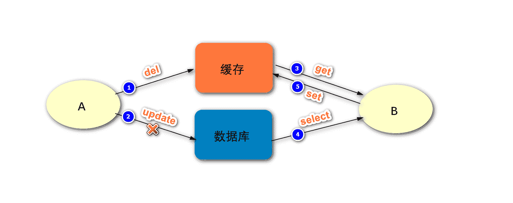

如上图，是先删除缓存再更新数据库，在出现失败时可能出现的问题：

1.  进程 A 删除缓存成功；
2.  进程 A 更新数据库失败；
3.  进程 B 从缓存中读取数据；
4.  由于缓存被删，进程 B 无法从缓存中得到数据，进而从数据库读取数据；
5.  进程 B 从数据库成功获取数据，然后将数据更新到了缓存。

最终，缓存和数据库的数据是一致的，但仍然是旧的数据。而我们的期望是二者数据一致，并且是新的数据。

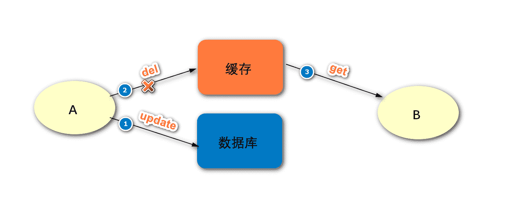

如上图，是先更新数据库再删除缓存，在出现失败时可能出现的问题：

1.  进程 A 更新数据库成功；
2.  进程 A 删除缓存失败；
3.  进程 B 读取缓存成功，由于缓存删除失败，所以进程 B 读取到的是旧的数据。

最终，缓存和数据库的数据是不一致的。

经过上面的比较，我们发现在出现失败的时候，是无法明确分辨出先删缓存和先更新数据库哪个方式更好，以为它们都存在问题。后面我们会进一步对这两种方式进行比较，但是在这里我们先探讨一下，上述场景出现的问题，应该如何解决呢？

实际上，无论上面我们采用哪种方式去同步缓存与数据库，在第二步出现失败的时候，都建议采用重试机制解决，因为最终我们是要解决掉这个错误的。而为了避免重试机制影响主要业务的执行，一般建议重试机制采用异步的方式执行，如下图：

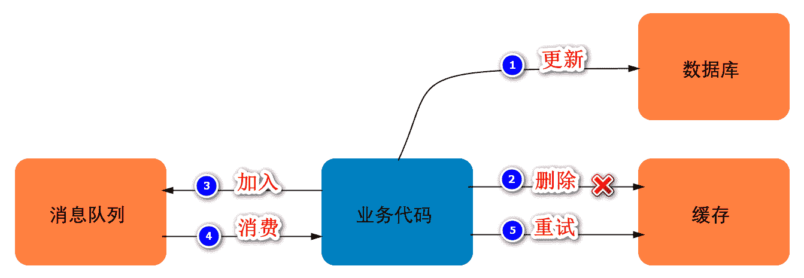

这里我们按照先更新数据库，再删除缓存的方式，来说明重试机制的主要步骤：

1.  更新数据库成功；
2.  删除缓存失败；
3.  将此数据加入消息队列；
4.  业务代码消费这条消息；
5.  业务代码根据这条消息的内容，发起重试机制，即从缓存中删除这条记录。

好了，下面我们再将先删缓存与先更新数据库，在没有出现失败时进行对比：

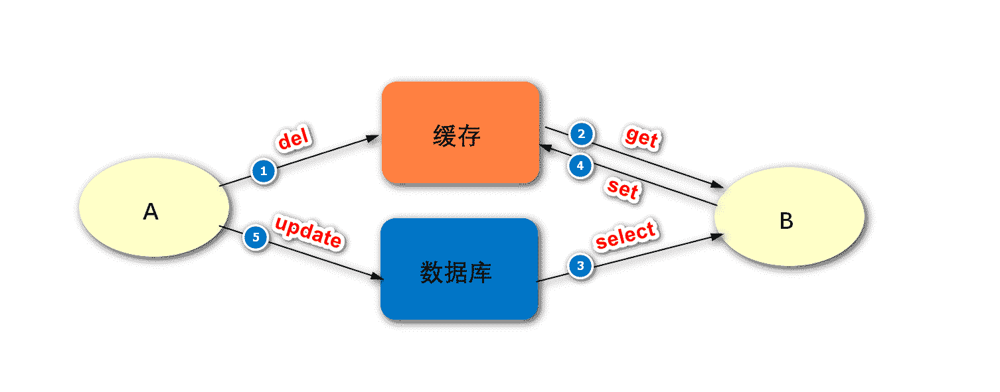

如上图，是先删除缓存再更新数据库，在没有出现失败时可能出现的问题：

1.  进程 A 删除缓存成功；
2.  进程 B 读取缓存失败；
3.  进程 B 读取数据库成功，得到旧的数据；
4.  进程 B 将旧的数据成功地更新到了缓存；
5.  进程 A 将新的数据成功地更新到数据库。

可见，进程 A 的两步操作均成功，但由于存在并发，在这两步之间，进程 B 访问了缓存。最终结果是，缓存中存储了旧的数据，而数据库中存储了新的数据，二者数据不一致。

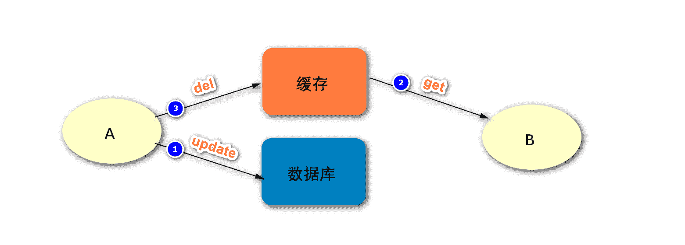

如上图，是先更新数据库再删除缓存，再没有出现失败时可能出现的问题：

1.  进程 A 更新数据库成功；
2.  进程 B 读取缓存成功；
3.  进程 A 更新数据库成功。

可见，最终缓存与数据库的数据是一致的，并且都是最新的数据。但进程 B 在这个过程里读到了旧的数据，可能还有其他进程也像进程 B 一样，在这两步之间读到了缓存中旧的数据，但因为这两步的执行速度会比较快，所以影响不大。对于这两步之后，其他进程再读取缓存数据的时候，就不会出现类似于进程 B 的问题了。

最终结论：

经过对比你会发现，先更新数据库、再删除缓存是影响更小的方案。如果第二步出现失败的情况，则可以采用重试机制解决问题。

**扩展阅读**

延时双删

上面我们提到，如果是先删缓存、再更新数据库，在没有出现失败时可能会导致数据的不一致。如果在实际的应用中，出于某些考虑我们需要选择这种方式，那有办法解决这个问题吗？答案是有的，那就是采用延时双删的策略，延时双删的基本思路如下：

1.  删除缓存；
2.  更新数据库；
3.  sleep N 毫秒；
4.  再次删除缓存。

阻塞一段时间之后，再次删除缓存，就可以把这个过程中缓存中不一致的数据删除掉。而具体的时间，要评估你这项业务的大致时间，按照这个时间来设定即可。

采用读写分离的架构怎么办？

如果数据库采用的是读写分离的架构，那么又会出现新的问题，如下图：

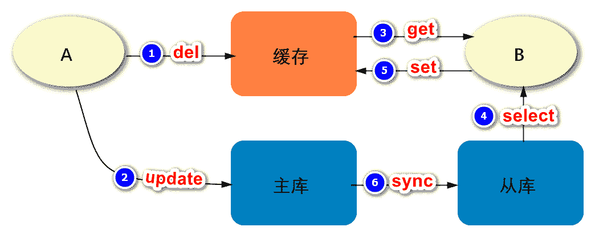

进程 A 先删除缓存，再更新主数据库，然后主库将数据同步到从库。而在主从数据库同步之前，可能会有进程 B 访问了缓存，发现数据不存在，进而它去访问从库获取到旧的数据，然后同步到缓存。这样，最终也会导致缓存与数据库的数据不一致。这个问题的解决方案，依然是采用延时双删的策略，但是在评估延长时间的时候，要考虑到主从数据库同步的时间。

第二次删除失败了怎么办？

如果第二次删除依然失败，则可以增加重试的次数，但是这个次数要有限制，当超出一定的次数时，要采取报错、记日志、发邮件提醒等措施。