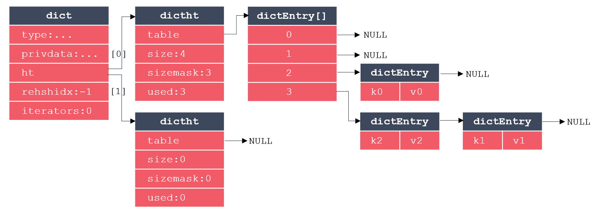
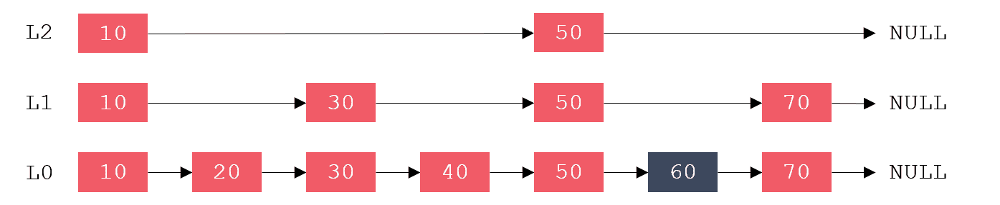
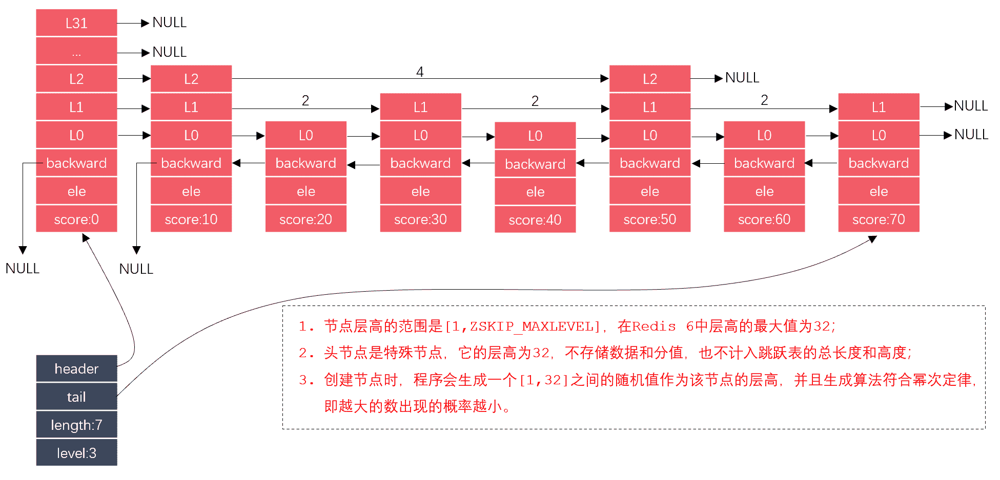
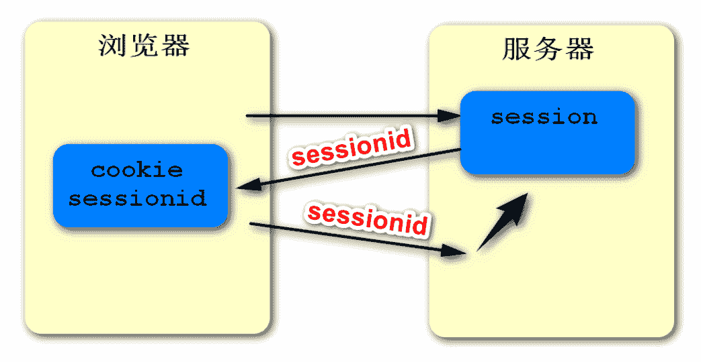
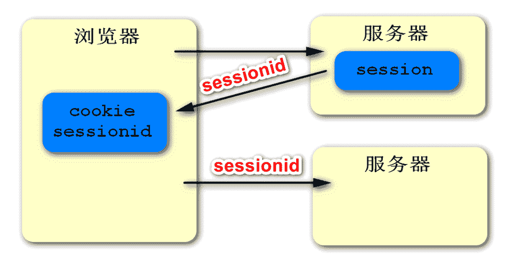
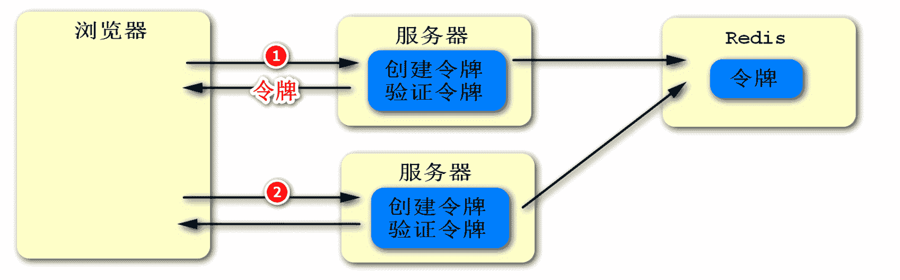
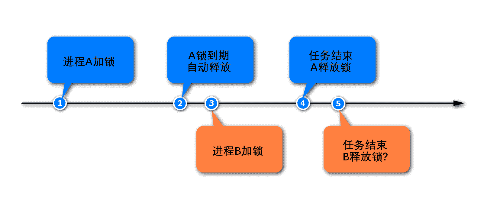
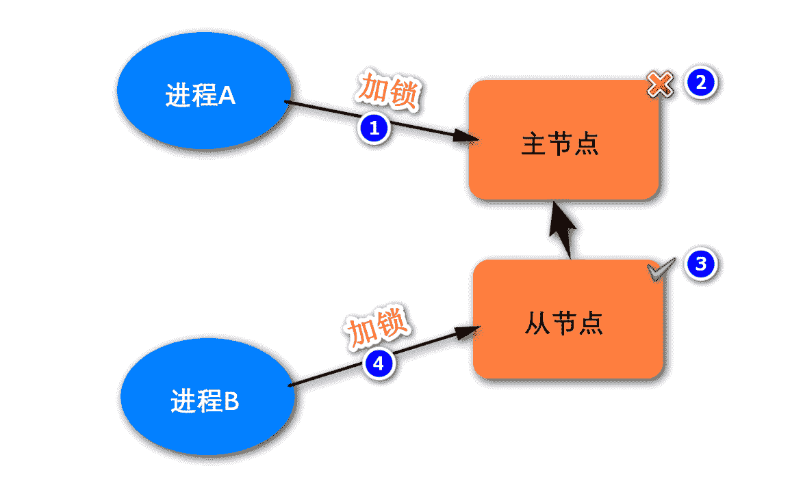
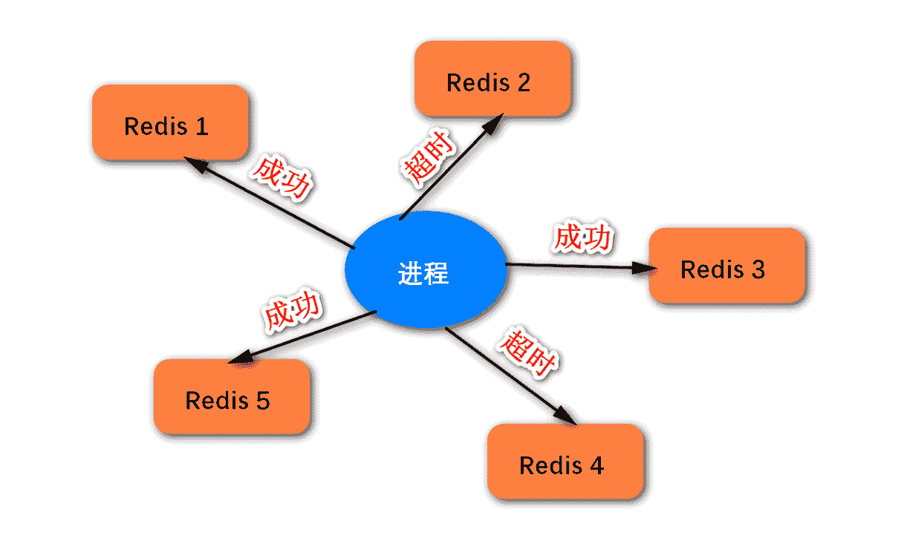

# 第四章 第 4 节 Java-中间件-4

> 原文：[`www.nowcoder.com/tutorial/10070/f44476968a62463d864f54c8eee222b9`](https://www.nowcoder.com/tutorial/10070/f44476968a62463d864f54c8eee222b9)

#### 1.23 介绍一下 zset 类型底层的数据结构

**参考答案**

有序集合对象有 2 种编码方案，当同时满足以下条件时，集合对象采用 ziplist 编码，否则采用 skiplist 编码：

*   有序集合保存的元素数量不超过 128 个；
*   有序集合保存的所有元素的成员长度都小于 64 字节。

其中，ziplist 编码的有序集合采用压缩列表作为底层实现，skiplist 编码的有序集合采用 zset 结构作为底层实现。

其中，zset 是一个复合结构，它的内部采用字典和跳跃表来实现，其源码如下。其中，dict 保存了从成员到分支的映射关系，zsl 则按分值由小到大保存了所有的集合元素。这样，当按照成员来访问有序集合时可以直接从 dict 中取值，当按照分值的范围访问有序集合时可以直接从 zsl 中取值，采用了空间换时间的策略以提高访问效率。

```cpp
typedef struct zset {
    dict *dict;        // 字典，保存了从成员到分值的映射关系；
    zskiplist *zsl; // 跳跃表，按分值由小到大保存所有集合元素；
} zset;
```

综上，zset 对象的底层数据结构包括：压缩列表、字典、跳跃表。

压缩列表：

压缩列表（ziplist），是 Redis 为了节约内存而设计的一种线性数据结构，它是由一系列具有特殊编码的连续内存块构成的。一个压缩列表可以包含任意多个节点，每个节点可以保存一个字节数组或一个整数值。

压缩列表的结构如下图所示：


该结构当中的字段含义如下表所示：

| **属性** | **类型** | **长度** | **说明** |
| --- | --- | --- | --- |
| zlbytes | uint32_t | 4 字节 | 压缩列表占用的内存字节数； |
| zltail | uint32_t | 4 字节 | 压缩列表表尾节点距离列表起始地址的偏移量（单位字节）； |
| zllen | uint16_t | 2 字节 | 压缩列表包含的节点数量，等于 UINT16_MAX 时，需遍历列表计算真实数量； |
| entryX | 列表节点 | 不固定 | 压缩列表包含的节点，节点的长度由节点所保存的内容决定； |
| zlend | uint8_t | 1 字节 | 压缩列表的结尾标识，是一个固定值 0xFF； |

其中，压缩列表的节点由以下字段构成：


previous_entry_length（pel）属性以字节为单位，记录当前节点的前一节点的长度，其自身占据 1 字节或 5 字节：

1.  如果前一节点的长度小于 254 字节，则“pel”属性的长度为 1 字节，前一节点的长度就保存在这一个字节内；

2.  如果前一节点的长度达到 254 字节，则“pel”属性的长度为 5 字节，其中第一个字节被设置为 0xFE，之后的四个字节用来保存前一节点的长度；

基于“pel”属性，程序便可以通过指针运算，根据当前节点的起始地址计算出前一节点的起始地址，从而实现从表尾向表头的遍历操作。

content 属性负责保存节点的值（字节数组或整数），其类型和长度则由 encoding 属性决定，它们的关系如下：

| **encoding** | **长度** | **content** |
| --- | --- | --- |
| 00 xxxxxx | 1 字节 | 最大长度为 26 -1 的字节数组； |
| 01 xxxxxx bbbbbbbb | 2 字节 | 最大长度为 214-1 的字节数组； |
| 10 **__** bbbbbbbb ... ... ... | 5 字节 | 最大长度为 232-1 的字节数组； |
| 11 000000 | 1 字节 | int16_t 类型的整数； |
| 11 010000 | 1 字节 | int32_t 类型的整数； |
| 11 100000 | 1 字节 | int64_t 类型的整数； |
| 11 110000 | 1 字节 | 24 位有符号整数； |
| 11 111110 | 1 字节 | 8 位有符号整数； |
| 11 11xxxx | 1 字节 | 没有 content 属性，xxxx 直接存[0,12]范围的整数值； |

字典：

字典（dict）又称为散列表，是一种用来存储键值对的数据结构。C 语言没有内置这种数据结构，所以 Redis 构建了自己的字典实现。

Redis 字典的实现主要涉及三个结构体：字典、哈希表、哈希表节点。其中，每个哈希表节点保存一个键值对，每个哈希表由多个哈希表节点构成，而字典则是对哈希表的进一步封装。这三个结构体的关系如下图所示：



其中，dict 代表字典，dictht 代表哈希表，dictEntry 代表哈希表节点。可以看出，dictEntry 是一个数组，这很好理解，因为一个哈希表里要包含多个哈希表节点。而 dict 里包含 2 个 dictht，多出的哈希表用于 REHASH。当哈希表保存的键值对数量过多或过少时，需要对哈希表的大小进行扩展或收缩操作，在 Redis 中，扩展和收缩哈希表是通过 REHASH 实现的，执行 REHASH 的大致步骤如下：

1.  为字典的 ht[1]哈希表分配内存空间

    如果执行的是扩展操作，则 ht[1]的大小为第 1 个大于等于 ht[0].used*2 的 2n。如果执行的是收缩操作，则 ht[1]的大小为第 1 个大于等于 ht[0].used 的 2n。

2.  将存储在 ht[0]中的数据迁移到 ht[1]上

    重新计算键的哈希值和索引值，然后将键值对放置到 ht[1]哈希表的指定位置上。

3.  将字典的 ht[1]哈希表晋升为默认哈希表

    迁移完成后，清空 ht[0]，再交换 ht[0]和 ht[1]的值，为下一次 REHASH 做准备。

当满足以下任何一个条件时，程序会自动开始对哈希表执行扩展操作：

1.  服务器目前没有执行 bgsave 或 bgrewriteof 命令，并且哈希表的负载因子大于等于 1；

2.  服务器目前正在执行 bgsave 或 bgrewriteof 命令，并且哈希表的负载因子大于等于 5。

为了避免 REHASH 对服务器性能造成影响，REHASH 操作不是一次性地完成的，而是分多次、渐进式地完成的。渐进式 REHASH 的详细过程如下：

1.  为 ht[1]分配空间，让字典同时持有 ht[0]和 ht[1]两个哈希表；

2.  在字典中的索引计数器 rehashidx 设置为 0，表示 REHASH 操作正式开始；

3.  在 REHASH 期间，每次对字典执行添加、删除、修改、查找操作时，程序除了执行指定的操作外，还会顺带将 ht[0]中位于 rehashidx 上的所有键值对迁移到 ht[1]中，再将 rehashidx 的值加 1；

4.  随着字典不断被访问，最终在某个时刻，ht[0]上的所有键值对都被迁移到 ht[1]上，此时程序将 rehashidx 属性值设置为-1，标识 REHASH 操作完成。

REHSH 期间，字典同时持有两个哈希表，此时的访问将按照如下原则处理：

1.  新添加的键值对，一律被保存到 ht[1]中；

2.  删除、修改、查找等其他操作，会在两个哈希表上进行，即程序先尝试去 ht[0]中访问要操作的数据，若不存在则到 ht[1]中访问，再对访问到的数据做相应的处理。

跳跃表：

跳跃表的查找复杂度为平均 O(logN)，最坏 O(N)，效率堪比红黑树，却远比红黑树实现简单。跳跃表是在链表的基础上，通过增加索引来提高查找效率的。

有序链表插入、删除的复杂度为 O(1)，而查找的复杂度为 O(N)。例：若要查找值为 60 的元素，需要从第 1 个元素依次向后比较，共需比较 6 次才行，如下图：


跳跃表是从有序链表中选取部分节点，组成一个新链表，并以此作为原始链表的一级索引。再从一级索引中选取部分节点，组成一个新链表，并以此作为原始链表的二级索引。以此类推，可以有多级索引，如下图：



跳跃表在查找时，优先从高层开始查找，若 next 节点值大于目标值，或 next 指针指向 NULL，则从当前节点下降一层继续向后查找，这样便可以提高查找的效率了。

跳跃表的实现主要涉及 2 个结构体：zskiplist、zskiplistNode，它们的关系如下图所示：



其中，蓝色的表格代表 zskiplist，红色的表格代表 zskiplistNode。zskiplist 有指向头尾节点的指针，以及列表的长度，列表中最高的层级。zskiplistNode 的头节点是空的，它不存储任何真实的数据，它拥有最高的层级，但这个层级不记录在 zskiplist 之内。

#### 1.24 如何利用 Redis 实现分布式 Session？

**参考答案**

在 web 开发中，我们会把用户的登录信息存储在 session 里。而 session 是依赖于 cookie 的，即服务器创建 session 时会给它分配一个唯一的 ID，并且在响应时创建一个 cookie 用于存储这个 SESSIONID。当客户端收到这个 cookie 之后，就会自动保存这个 SESSIONID，并且在下次访问时自动携带这个 SESSIONID，届时服务器就可以通过这个 SESSIONID 得到与之对应的 session，从而识别用户的身。如下图：



现在的互联网应用，基本都是采用分布式部署方式，即将应用程序部署在多台服务器上，并通过 nginx 做统一的请求分发。而服务器与服务器之间是隔离的，它们的 session 是不共享的，这就存在 session 同步的问题了，如下图：



如果客户端第一次访问服务器，请求被分发到了服务器 A 上，则服务器 A 会为该客户端创建 session。如果客户端再次访问服务器，请求被分发到服务器 B 上，则由于服务器 B 中没有这个 session，所以用户的身份无法得到验证，从而产生了不一致的问题。

解决这个问题的办法有很多，比如可以协调多个服务器，让他们的 session 保持同步。也可以在分发请求时做绑定处理，即将某一个 IP 固定分配给同一个服务器。但这些方式都比较麻烦，而且性能上也有一定的消耗。更合理的方式就是采用类似于 Redis 这样的高性能缓存服务器，来实现分布式 session。

从上面的叙述可知，我们使用 session 保存用户的身份信息，本质上是要做两件事情。第一是保存用户的身份信息，第二是验证用户的身份信息。如果利用其它手段实现这两个目标，那么就可以不用 session，或者说我们使用的是广义上的 session 了。

具体实现的思路如下图，我们在服务端增加两段程序：

第一是创建令牌的程序，就是在用户初次访问服务器时，给它创建一个唯一的身份标识，并且使用 cookie 封装这个标识再发送给客户端。那么当客户端下次再访问服务器时，就会自动携带这个身份标识了，这和 SESSIONID 的道理是一样的，只是改由我们自己来实现了。另外，在返回令牌之前，我们需要将它存储起来，以便于后续的验证。而这个令牌是不能保存在服务器本地的，因为其他服务器无法访问它。因此，我们可以将其存储在服务器之外的一个地方，那么 Redis 便是一个理想的场所。

第二是验证令牌的程序，就是在用户再次访问服务器时，我们获取到了它之前的身份标识，那么我们就要验证一下这个标识是否存在了。验证的过程很简单，我们从 Redis 中尝试获取一下就可以知道结果。



#### 1.25 如何利用 Redis 实现一个分布式锁？

**参考答案**

何时需要分布式锁？

在分布式的环境下，当多个 server 并发修改同一个资源时，为了避免竞争就需要使用分布式锁。那为什么不能使用 Java 自带的锁呢？因为 Java 中的锁是面向多线程设计的，它只局限于当前的 JRE 环境。而多个 server 实际上是多进程，是不同的 JRE 环境，所以 Java 自带的锁机制在这个场景下是无效的。

如何实现分布式锁？

采用 Redis 实现分布式锁，就是在 Redis 里存一份代表锁的数据，通常用字符串即可。实现分布式锁的思路，以及优化的过程如下：

1.  加锁：

    第一版，这种方式的缺点是容易产生死锁，因为客户端有可能忘记解锁，或者解锁失败。

    ```cpp
    setnx key value
    ```

    第二版，给锁增加了过期时间，避免出现死锁。但这两个命令不是原子的，第二步可能会失败，依然无法避免死锁问题。

    ```cpp
    setnx key value
    expire key seconds
    ```

    第三版，通过“set...nx...”命令，将加锁、过期命令编排到一起，它们是原子操作了，可以避免死锁。

    ```cpp
    set key value nx ex seconds 
    ```

2.  解锁：

    解锁就是删除代表锁的那份数据。

    ```cpp
    del key
    ```

3.  问题：

    看起来已经很完美了，但实际上还有隐患，如下图。进程 A 在任务没有执行完毕时，锁已经到期被释放了。等进程 A 的任务执行结束后，它依然会尝试释放锁，因为它的代码逻辑就是任务结束后释放锁。但是，它的锁早已自动释放过了，它此时释放的可能是其他线程的锁。

    

想要解决这个问题，我们需要解决两件事情：

1.  在加锁时就要给锁设置一个标识，进程要记住这个标识。当进程解锁的时候，要进行判断，是自己持有的锁才能释放，否则不能释放。可以为 key 赋一个随机值，来充当进程的标识。
2.  解锁时要先判断、再释放，这两步需要保证原子性，否则第二步失败的话，就会出现死锁。而获取和删除命令不是原子的，这就需要采用 Lua 脚本，通过 Lua 脚本将两个命令编排在一起，而整个 Lua 脚本的执行是原子的。

按照以上思路，优化后的命令如下：

```cpp
# 加锁
set key random-value nx ex seconds 

# 解锁
if redis.call("get",KEYS[1]) == ARGV[1] then
    return redis.call("del",KEYS[1])
else
    return 0
end
```

基于 RedLock 算法的分布式锁：

上述分布式锁的实现方案，是建立在单个主节点之上的。它的潜在问题如下图所示，如果进程 A 在主节点上加锁成功，然后这个主节点宕机了，则从节点将会晋升为主节点。若此时进程 B 在新的主节点上加锁成果，之后原主节点重启，成为了从节点，系统中将同时出现两把锁，这是违背锁的唯一性原则的。



总之，就是在单个主节点的架构上实现分布式锁，是无法保证高可用的。若要保证分布式锁的高可用，则可以采用多个节点的实现方案。这种方案有很多，而 Redis 的官方给出的建议是采用 RedLock 算法的实现方案。该算法基于多个 Redis 节点，它的基本逻辑如下：

*   这些节点相互独立，不存在主从复制或者集群协调机制；
*   加锁：以相同的 KEY 向 N 个实例加锁，只要超过一半节点成功，则认定加锁成功；
*   解锁：向所有的实例发送 DEL 命令，进行解锁；

RedLock 算法的示意图如下，我们可以自己实现该算法，也可以直接使用 Redisson 框架。

