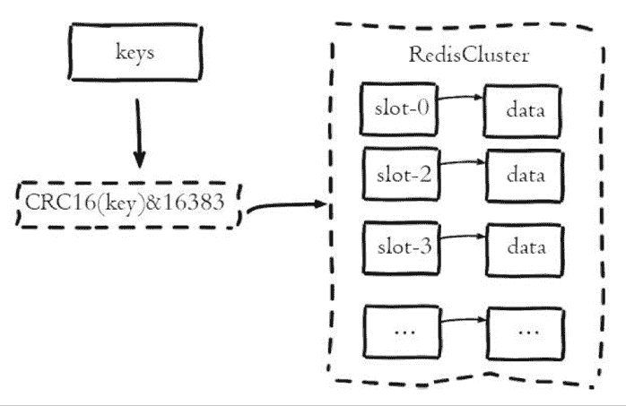

# 第四章 第 5 节 Java-中间件-5

> 原文：[`www.nowcoder.com/tutorial/10070/0e5f5e5baf574e7bb763739ec4b9864c`](https://www.nowcoder.com/tutorial/10070/0e5f5e5baf574e7bb763739ec4b9864c)

#### 1.26 说一说你对布隆过滤器的理解

**参考答案**

布隆过滤器可以用很低的代价，估算出数据是否真实存在。例如：给用户推荐新闻时，要去掉重复的新闻，就可以利用布隆过滤器，判断该新闻是否已经推荐过。

布隆过滤器的核心包括两部分：

1.  一个大型的位数组；
2.  若干个不一样的哈希函数，每个哈希函数都能将哈希值算的比较均匀。

布隆过滤器的工作原理：

1.  添加 key 时，每个哈希函数都利用这个 key 计算出一个哈希值，再根据哈希值计算一个位置，并将位数组中这个位置的值设置为 1。
2.  询问 key 时，每个哈希函数都利用这个 key 计算出一个哈希值，再根据哈希值计算一个位置。然后对比这些哈希函数在位数组中对应位置的数值：
    *   如果这几个位置中，有一个位置的值是 0，就说明这个布隆过滤器中，不存在这个 key。
    *   如果这几个位置中，所有位置的值都是 1，就说明这个布隆过滤器中，极有可能存在这个 key。之所以不是百分之百确定，是因为也可能是其他的 key 运算导致该位置为 1。

#### 1.27 多台 Redis 抗高并发访问该怎么设计？

**参考答案**

Redis Cluster 是 Redis 的分布式解决方案，在 3.0 版本正式推出，有效地解决了 Redis 分布式方面的需求。当遇到单机内存、并发、流量等瓶颈时，可以采用 Cluster 架构方案达到负载均衡的目的。

Redis 集群采用虚拟槽分区来实现数据分片，它把所有的键根据哈希函数映射到`0-16383`整数槽内，计算公式为`slot=CRC16(key)&16383`，每一个节点负责维护一部分槽以及槽所映射的键值数据。虚拟槽分区具有如下特点：

1.  解耦数据和节点之间的关系，简化了节点扩容和收缩的难度；

2.  节点自身维护槽的映射关系，不需要客户端或者代理服务维护槽分区元数据；

3.  支持节点、槽、键之间的映射查询，用于数据路由，在线伸缩等场景。

Redis 集群中数据的分片逻辑如下图：

#### 1.28 如果并发量超过 30 万，怎么设计 Redis 架构？

**参考答案**

Redis Cluster 是 Redis 的分布式解决方案，在 3.0 版本正式推出，有效地解决了 Redis 分布式方面的需求。当遇到单机内存、并发、流量等瓶颈时，可以采用 Cluster 架构方案达到负载均衡的目的。

Redis 集群采用虚拟槽分区来实现数据分片，它把所有的键根据哈希函数映射到`0-16383`整数槽内，计算公式为`slot=CRC16(key)&16383`，每一个节点负责维护一部分槽以及槽所映射的键值数据。虚拟槽分区具有如下特点：

1.  解耦数据和节点之间的关系，简化了节点扩容和收缩的难度；

2.  节点自身维护槽的映射关系，不需要客户端或者代理服务维护槽分区元数据；

3.  支持节点、槽、键之间的映射查询，用于数据路由，在线伸缩等场景。

Redis 集群中数据的分片逻辑如下图：

## 2\. 消息队列

#### 2.1 MQ 有什么用？

**参考答案**

消息队列有很多使用场景，比较常见的有 3 个：解耦、异步、削峰。

1.  解耦：传统的软件开发模式，各个模块之间相互调用，数据共享，每个模块都要时刻关注其他模块的是否更改或者是否挂掉等等，使用消息队列，可以避免模块之间直接调用，将所需共享的数据放在消息队列中，对于新增业务模块，只要对该类消息感兴趣，即可订阅该类消息，对原有系统和业务没有任何影响，降低了系统各个模块的耦合度，提高了系统的可扩展性。
2.  异步：消息队列提供了异步处理机制，在很多时候应用不想也不需要立即处理消息，允许应用把一些消息放入消息中间件中，并不立即处理它，在之后需要的时候再慢慢处理。
3.  削峰：在访问量骤增的场景下，需要保证应用系统的平稳性，但是这样突发流量并不常见，如果以这类峰值的标准而投放资源的话，那无疑是巨大的浪费。使用消息队列能够使关键组件支撑突发访问压力，不会因为突发的超负荷请求而完全崩溃。消息队列的容量可以配置的很大，如果采用磁盘存储消息，则几乎等于“无限”容量，这样一来，高峰期的消息可以被积压起来，在随后的时间内进行平滑的处理完成，而不至于让系统短时间内无法承载而导致崩溃。在电商网站的秒杀抢购这种突发性流量很强的业务场景中，消息队列的强大缓冲能力可以很好的起到削峰作用。

#### 2.2 说一说生产者与消费者模式

**参考答案**

所谓生产者-消费者问题，实际上主要是包含了两类线程。一种是生产者线程用于生产数据，另一种是消费者线程用于消费数据，为了解耦生产者和消费者的关系，通常会采用共享的数据区域，就像是一个仓库。生产者生产数据之后直接放置在共享数据区中，并不需要关心消费者的行为。而消费者只需要从共享数据区中去获取数据，就不再需要关心生产者的行为。但是，这个共享数据区域中应该具备这样的线程间并发协作的功能：

1.  如果共享数据区已满的话，阻塞生产者继续生产数据放置入内；
2.  如果共享数据区为空的话，阻塞消费者继续消费数据。

在 Java 语言中，实现生产者消费者问题时，可以采用三种方式：

1.  使用 Object 的 wait/notify 的消息通知机制；
2.  使用 Lock 的 Condition 的 await/signal 的消息通知机制；
3.  使用 BlockingQueue 实现。

#### 2.3 消息队列如何保证顺序消费？

**参考答案**

在生产中经常会有一些类似报表系统这样的系统，需要做 MySQL 的 binlog 同步。比如订单系统要同步订单表的数据到大数据部门的 MySQL 库中用于报表统计分析，通常的做法是基于 Canal 这样的中间件去监听订单数据库的 binlog，然后把这些 binlog 发送到 MQ 中，再由消费者从 MQ 中获取 binlog 落地到大数据部门的 MySQL 中。

在这个过程中，可能会有对某个订单的增删改操作，比如有三条 binlog 执行顺序是增加、修改、删除。消费者愣是换了顺序给执行成删除、修改、增加，这样能行吗？肯定是不行的。不同的消息队列产品，产生消息错乱的原因，以及解决方案是不同的。下面我们以 RabbitMQ、Kafka、RocketMQ 为例，来说明保证顺序消费的办法。

RabbitMQ：

对于 RabbitMQ 来说，导致上面顺序错乱的原因通常是消费者是集群部署，不同的消费者消费到了同一订单的不同的消息。如消费者 A 执行了增加，消费者 B 执行了修改，消费者 C 执行了删除，但是消费者 C 执行比消费者 B 快，消费者 B 又比消费者 A 快，就会导致消费 binlog 执行到数据库的时候顺序错乱，本该顺序是增加、修改、删除，变成了删除、修改、增加。如下图：

RabbitMQ 的问题是由于不同的消息都发送到了同一个 queue 中，多个消费者都消费同一个 queue 的消息。解决这个问题，我们可以给 RabbitMQ 创建多个 queue，每个消费者固定消费一个 queue 的消息，生产者发送消息的时候，同一个订单号的消息发送到同一个 queue 中，由于同一个 queue 的消息是一定会保证有序的，那么同一个订单号的消息就只会被一个消费者顺序消费，从而保证了消息的顺序性。如下图：

Kafka：

对于 Kafka 来说，一个 topic 下同一个 partition 中的消息肯定是有序的，生产者在写的时候可以指定一个 key，通过我们会用订单号作为 key，这个 key 对应的消息都会发送到同一个 partition 中，所以消费者消费到的消息也一定是有序的。

那么为什么 Kafka 还会存在消息错乱的问题呢？问题就出在消费者身上。通常我们消费到同一个 key 的多条消息后，会使用多线程技术去并发处理来提高消息处理速度，否则一条消息的处理需要耗时几十 毫秒，1 秒也就只能处理几十条消息，吞吐量就太低了。而多线程并发处理的话，binlog 执行到数据库的时候就不一定还是原来的顺序了。如下图：

Kafka 从生产者到消费者消费消息这一整个过程其实都是可以保证有序的，导致最终乱序是由于消费者端需要使用多线程并发处理消息来提高吞吐量，比如消费者消费到了消息以后，开启 32 个线程处理消息，每个线程线程处理消息的快慢是不一致的，所以才会导致最终消息有可能不一致。

所以对于 Kafka 的消息顺序性保证，其实我们只需要保证同一个订单号的消息只被同一个线程处理的就可以了。由此我们可以在线程处理前增加个内存队列，每个线程只负责处理其中一个内存队列的消息，同一个订单号的消息发送到同一个内存队列中即可。如下图：

RocketMQ：

对于 RocketMQ 来说，每个 Topic 可以指定多个 MessageQueue，当我们写入消息的时候，会把消息均匀地分发到不同的 MessageQueue 中，比如同一个订单号的消息，增加 binlog 写入到 MessageQueue1 中，修改 binlog 写入到 MessageQueue2 中，删除 binlog 写入到 MessageQueue3 中。

但是当消费者有多台机器的时候，会组成一个 Consumer Group，Consumer Group 中的每台机器都会负责消费一部分 MessageQueue 的消息，所以可能消费者 A 消费了 MessageQueue1 的消息执行增加操作，消费者 B 消费了 MessageQueue2 的消息执行修改操作，消费者 C 消费了 MessageQueue3 的消息执行删除操作，但是此时消费 binlog 执行到数据库的时候就不一定是消费者 A 先执行了，有可能消费者 C 先执行删除操作，因为几台消费者是并行执行，是不能够保证他们之间的执行顺序的。如下图：

RocketMQ 的消息乱序是由于同一个订单号的 binlog 进入了不同的 MessageQueue，进而导致一个订单的 binlog 被不同机器上的 Consumer 处理。

要解决 RocketMQ 的乱序问题，我们只需要想办法让同一个订单的 binlog 进入到同一个 MessageQueue 中就可以了。因为同一个 MessageQueue 内的消息是一定有序的，一个 MessageQueue 中的消息只能交给一个 Consumer 来进行处理，所以 Consumer 消费的时候就一定会是有序的。

#### 2.4 消息队列如何保证消息不丢？

**参考答案**

丢数据一般分为两种，一种是 mq 把消息丢了，一种就是消费时将消息丢了。下面从 rabbitmq 和 kafka 分别说一下，丢失数据的场景。

RabbitMQ：

RabbitMQ 丢失消息分为如下几种情况：

1.  生产者丢消息：

    生产者将数据发送到 RabbitMQ 的时候，可能在传输过程中因为网络等问题而将数据弄丢了。

2.  RabbitMQ 自己丢消息：

    如果没有开启 RabbitMQ 的持久化，那么 RabbitMQ 一旦重启数据就丢了。所以必须开启持久化将消息持久化到磁盘，这样就算 RabbitMQ 挂了，恢复之后会自动读取之前存储的数据，一般数据不会丢失。除非极其罕见的情况，RabbitMQ 还没来得及持久化自己就挂了，这样可能导致一部分数据丢失。

3.  消费端丢消息：

    主要是因为消费者消费时，刚消费到还没有处理，结果消费者就挂了，这样你重启之后，RabbitMQ 就认为你已经消费过了，然后就丢了数据。

针对上述三种情况，RabbitMQ 可以采用如下方式避免消息丢失：

1.  生产者丢消息：

    *   可以选择使用 RabbitMQ 提供是事务功能，就是生产者在发送数据之前开启事务，然后发送消息，如果消息没有成功被 RabbitMQ 接收到，那么生产者会受到异常报错，这时就可以回滚事务，然后尝试重新发送。如果收到了消息，那么就可以提交事务。这种方式有明显的缺点，即 RabbitMQ 事务开启后，就会变为同步阻塞操作，生产者会阻塞等待是否发送成功，太耗性能会造成吞吐量的下降。
    *   可以开启 confirm 模式。在生产者那里设置开启了 confirm 模式之后，每次写的消息都会分配一个唯一的 id，然后如何写入了 RabbitMQ 之中，RabbitMQ 会给你回传一个 ack 消息，告诉你这个消息发送 OK 了。如果 RabbitMQ 没能处理这个消息，会回调你一个 nack 接口，告诉你这个消息失败了，你可以进行重试。而且你可以结合这个机制知道自己在内存里维护每个消息的 id，如果超过一定时间还没接收到这个消息的回调，那么你可以进行重发。

    事务机制是同步的，你提交了一个事物之后会阻塞住，但是 confirm 机制是异步的，发送消息之后可以接着发送下一个消息，然后 RabbitMQ 会回调告知成功与否。 一般在生产者这块避免丢失，都是用 confirm 机制。

2.  RabbitMQ 自己丢消息：

    设置消息持久化到磁盘，设置持久化有两个步骤：

    *   创建 queue 的时候将其设置为持久化的，这样就可以保证 RabbitMQ 持久化 queue 的元数据，但是不会持久化 queue 里面的数据。
    *   发送消息的时候讲消息的 deliveryMode 设置为 2，这样消息就会被设为持久化方式，此时 RabbitMQ 就会将消息持久化到磁盘上。 必须要同时开启这两个才可以。

    而且持久化可以跟生产的 confirm 机制配合起来，只有消息持久化到了磁盘之后，才会通知生产者 ack，这样就算是在持久化之前 RabbitMQ 挂了，数据丢了，生产者收不到 ack 回调也会进行消息重发。

3.  消费端丢消息：

    使用 RabbitMQ 提供的 ack 机制，首先关闭 RabbitMQ 的自动 ack，然后每次在确保处理完这个消息之后，在代码里手动调用 ack。这样就可以避免消息还没有处理完就 ack。

Kafka：

Kafka 丢失消息分为如下几种情况：

1.  生产者丢消息：

    生产者没有设置相应的策略，发送过程中丢失数据。

2.  Kafka 自己丢消息：

    比较常见的一个场景，就是 Kafka 的某个 broker 宕机了，然后重新选举 partition 的 leader 时。如果此时 follower 还没来得及同步数据，leader 就挂了，然后某个 follower 成为了 leader，它就少了一部分数据。

3.  消费端丢消息：

    消费者消费到了这个数据，然后消费之自动提交了 offset，让 Kafka 知道你已经消费了这个消息，当你准备处理这个消息时，自己挂掉了，那么这条消息就丢了。

针对上述三种情况，Kafka 可以采用如下方式避免消息丢失：

1.  生产者丢消息：

    关闭自动提交 offset，在自己处理完毕之后手动提交 offset，这样就不会丢失数据。

2.  Kafka 自己丢消息：

    一般要求设置 4 个参数来保证消息不丢失：

    *   给 topic 设置 `replication.factor` 参数，这个值必须大于 1，表示要求每个 partition 必须至少有 2 个副本。
    *   在 kafka 服务端设置 `min.isync.replicas` 参数，这个值必须大于 1，表示 要求一个 leader 至少感知到有至少一个 follower 在跟自己保持联系正常同步数据，这样才能保证 leader 挂了之后还有一个 follower。
    *   在生产者端设置 `acks=all` ，表示 要求每条每条数据，必须是写入所有 replica 副本之后，才能认为是写入成功了。
    *   在生产者端设置 `retries=MAX` (很大的一个值)，表示这个是要求一旦写入事变，就无限重试。
3.  消费端丢消息：

    如果按照上面设置了 ack=all，则一定不会丢失数据，要求是，你的 leader 接收到消息，所有的 follower 都同步到了消息之后，才认为本次写成功了。如果没满足这个条件，生产者会自动不断的重试，重试无限次。