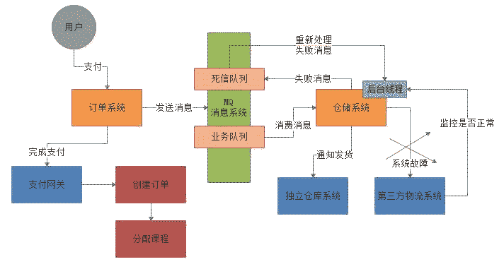
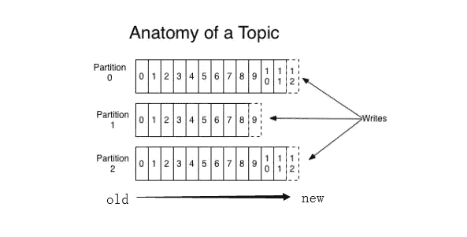
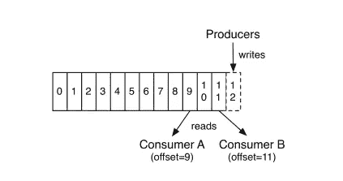
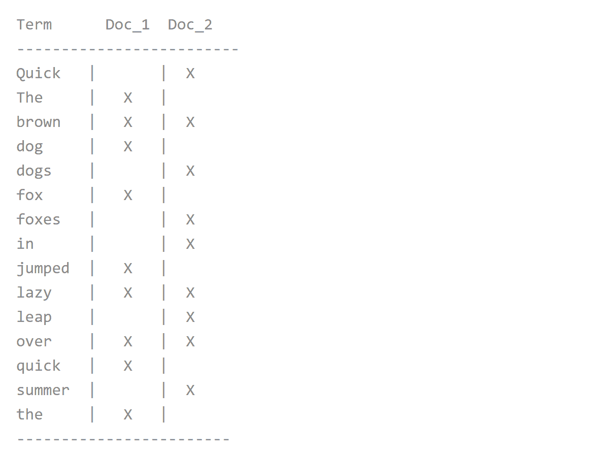
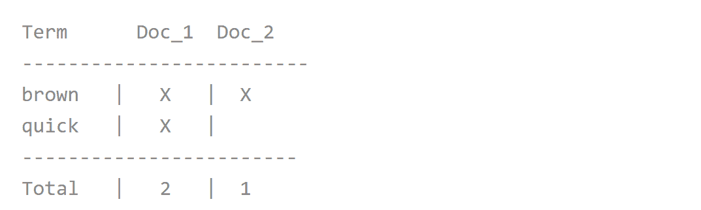
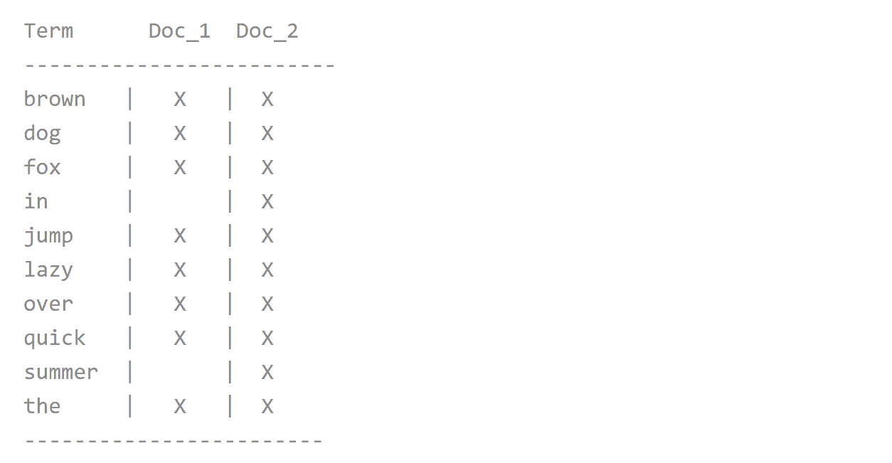

# 第四章 第 6 节 Java-中间件-6

> 原文：[`www.nowcoder.com/tutorial/10070/483208a7898741678e3d8bf6214c5821`](https://www.nowcoder.com/tutorial/10070/483208a7898741678e3d8bf6214c5821)

#### 2.5 消息队列如何保证不重复消费？

**参考答案**

先大概说一说可能会有哪些重复消费的问题。首先就是比如 rabbitmq、rocketmq、kafka，都有可能会出现消费重复消费的问题，正常。因为这问题通常不是 mq 自己保证的，是给你保证的。然后我们挑一个 kafka 来举个例子，说说怎么重复消费吧。

kafka 实际上有个 offset 的概念，就是每个消息写进去，都有一个 offset，代表他的序号，然后 consumer 消费了数据之后，每隔一段时间，会把自己消费过的消息的 offset 提交一下，代表我已经消费过了，下次我要是重启啥的，你就让我继续从上次消费到的 offset 来继续消费吧。

但是凡事总有意外，比如我们之前生产经常遇到的，就是你有时候重启系统，看你怎么重启了，如果碰到点着急的，直接 kill 进程了，再重启。这会导致 consumer 有些消息处理了，但是没来得及提交 offset，尴尬了。重启之后，少数消息会再次消费一次。

其实重复消费不可怕，可怕的是你没考虑到重复消费之后，怎么保证幂等性。举个例子,假设你有个系统，消费一条往数据库里插入一条，要是你一个消息重复两次，你不就插入了两条，这数据不就错了？但是你要是消费到第二次的时候，自己判断一下已经消费过了，直接扔了，不就保留了一条数据？

一条数据重复出现两次，数据库里就只有一条数据，这就保证了系统的幂等性幂等性。通俗点说，就一个数据，或者一个请求，给你重复来多次，你得确保对应的数据是不会改变的，不能出错。

想要保证不重复消费，其实还要结合业务来思考，这里给几个思路：

1.  比如你拿个数据要写库，你先根据主键查一下，如果这数据都有了，你就别插入了，update 一下。
2.  比如你是写 redis，那没问题了，反正每次都是 set，天然幂等性。
3.  比如你不是上面两个场景，那做的稍微复杂一点，你需要让生产者发送每条数据的时候，里面加一个全局唯一的 id，类似订单 id 之类的东西，然后你这里消费到了之后，先根据这个 id 去比如 redis 里查一下，之前消费过吗？如果没有消费过，你就处理，然后这个 id 写 redis。如果消费过了，那你就别处理了，保证别重复处理相同的消息即可。

还有比如基于数据库的唯一键来保证重复数据不会重复插入多条，我们之前线上系统就有这个问题，就是拿到数据的时候，每次重启可能会有重复，因为 kafka 消费者还没来得及提交 offset，重复数据拿到了以后我们插入的时候，因为有唯一键约束了，所以重复数据只会插入报错，不会导致数据库中出现脏数据。

#### 2.6 MQ 处理消息失败了怎么办？

**参考答案**

一般生产环境中，都会在使用 MQ 的时候设计两个队列：一个是核心业务队列，一个是死信队列。核心业务队列，就是比如专门用来让订单系统发送订单消息的，然后另外一个死信队列就是用来处理异常情况的。

比如说要是第三方物流系统故障了，此时无法请求，那么仓储系统每次消费到一条订单消息，尝试通知发货和配送，都会遇到对方的接口报错。此时仓储系统就可以把这条消息拒绝访问，或者标志位处理失败！注意，这个步骤很重要。

一旦标志这条消息处理失败了之后，MQ 就会把这条消息转入提前设置好的一个死信队列中。然后你会看到的就是，在第三方物流系统故障期间，所有订单消息全部处理失败，全部会转入死信队列。然后你的仓储系统得专门有一个后台线程，监控第三方物流系统是否正常，能否请求的，不停的监视。一旦发现对方恢复正常，这个后台线程就从死信队列消费出来处理失败的订单，重新执行发货和配送的通知逻辑。死信队列的使用，其实就是 MQ 在生产实践中非常重要的一环，也就是架构设计必须要考虑的。

整个过程，如下图所示：

#### 2.7 请介绍消息队列推和拉的使用场景

**参考答案**

推模式：

推模式是服务器端根据用户需要，由目的、按时将用户感兴趣的信息主动发送到用户的客户端。

优点：

*   对用户要求低，方便用户获取需要的信息；
*   及时性好，服务器端及时地向客户端推送更新动态信息，吞吐量大。

缺点：

*   不能确保发送成功，推模式采用广播方式，只有服务器端和客户端在同一个频道上，推模式才有效，用户才能接收到信息；
*   没有信息状态跟踪，推模式采用开环控制技术，一个信息推送后的状态，比如客户端是否接收等，无从得知；
*   针对性较差。推送的信息可能并不能满足客户端的个性化需求。

拉模式：

拉模式是客户端主动从服务器端获取信息。

优点：

*   针对性强，能满足客户端的个性化需求；
*   信息传输量较小，网络中传输的只是客户端的请求和服务器端对该请求的响应；
*   服务器端的任务轻。服务器端只是被动接收查询，对客户端的查询请求做出响应。

缺点：

*   实时性较差，针对于服务器端实时更新的信息，客户端难以获取实时信息；
*   对于客户端用户的要求较高，需要对服务器端具有一定的了解。

#### 2.8 RabbitMQ 和 Kafka 有什么区别？

**参考答案**

在实际生产应用中，通常会使用 Kafka 作为消息传输的数据管道，RabbitMQ 作为交易数据作为数据传输管道，主要的取舍因素则是是否存在丢数据的可能。RabbitMQ 在金融场景中经常使用，具有较高的严谨性，数据丢失的可能性更小，同事具备更高的实时性。而 Kafka 优势主要体现在吞吐量上，虽然可以通过策略实现数据不丢失，但从严谨性角度来讲，大不如 RabbitMQ。而且由于 Kafka 保证每条消息最少送达一次，有较小的概率会出现数据重复发送的情况。详细来说，它们之间主要有如下的区别：

1.  应用场景方面

    RabbitMQ：用于实时的，对可靠性要求较高的消息传递上。

    Kafka：用于处于活跃的流式数据，大数据量的数据处理上。

2.  架构模型方面

    RabbitMQ：以 broker 为中心，有消息的确认机制。

    Kafka：以 consumer 为中心，没有消息的确认机制。

3.  吞吐量方面

    RabbitMQ：支持消息的可靠的传递，支持事务，不支持批量操作，基于存储的可靠性的要求存储可以采用内存或硬盘，吞吐量小。

    Kafka：内部采用消息的批量处理，数据的存储和获取是本地磁盘顺序批量操作，消息处理的效率高，吞吐量高。

4.  集群负载均衡方面

    RabbitMQ：本身不支持负载均衡，需要 loadbalancer 的支持。

    Kafka：采用 zookeeper 对集群中的 broker，consumer 进行管理，可以注册 topic 到 zookeeper 上，通过 zookeeper 的协调机制，producer 保存对应的 topic 的 broker 信息，可以随机或者轮询发送到 broker 上，producer 可以基于语义指定分片，消息发送到 broker 的某个分片上。

#### 2.9 Kafka 为什么速度快？

**参考答案**

Kafka 的消息是保存或缓存在磁盘上的，一般认为在磁盘上读写数据是会降低性能的，因为寻址会比较消耗时间，但是实际上，Kafka 的特性之一就是高吞吐率。即使是普通的服务器，Kafka 也可以轻松支持每秒百万级的写入请求，超过了大部分的消息中间件，这种特性也使得 Kafka 在日志处理等海量数据场景广泛应用。

下面从数据写入和读取两方面分析，为什么 Kafka 速度这么快：

写入数据：

Kafka 会把收到的消息都写入到硬盘中，它绝对不会丢失数据。为了优化写入速度 Kafka 采用了两个技术，顺序写入和 MMFile 。

一、顺序写入

磁盘读写的快慢取决于你怎么使用它，也就是顺序读写或者随机读写。在顺序读写的情况下，磁盘的顺序读写速度和内存持平。因为硬盘是机械结构，每次读写都会寻址->写入，其中寻址是一个“机械动作”，它是最耗时的。所以硬盘最讨厌随机 I/O，最喜欢顺序 I/O。为了提高读写硬盘的速度，Kafka 就是使用顺序 I/O。

而且 Linux 对于磁盘的读写优化也比较多，包括 read-ahead 和 write-behind，磁盘缓存等。如果在内存做这些操作的时候，一个是 JAVA 对象的内存开销很大，另一个是随着堆内存数据的增多，JAVA 的 GC 时间会变得很长，使用磁盘操作有以下几个好处：

1.  磁盘顺序读写速度超过内存随机读写；
2.  JVM 的 GC 效率低，内存占用大。使用磁盘可以避免这一问题；
3.  系统冷启动后，磁盘缓存依然可用。

下图就展示了 Kafka 是如何写入数据的， 每一个 Partition 其实都是一个文件 ，收到消息后 Kafka 会把数据插入到文件末尾（虚框部分）：

这种方法有一个缺陷——没有办法删除数据 ，所以 Kafka 是不会删除数据的，它会把所有的数据都保留下来，每个消费者（Consumer）对每个 Topic 都有一个 offset 用来表示读取到了第几条数据 。

二、Memory Mapped Files

即便是顺序写入硬盘，硬盘的访问速度还是不可能追上内存。所以 Kafka 的数据并不是实时的写入硬盘 ，它充分利用了现代操作系统分页存储来利用内存提高 I/O 效率。Memory Mapped Files(后面简称 mmap)也被翻译成 内存映射文件，在 64 位操作系统中一般可以表示 20G 的数据文件，它的工作原理是直接利用操作系统的 Page 来实现文件到物理内存的直接映射。完成映射之后你对物理内存的操作会被同步到硬盘上（操作系统在适当的时候）。

通过 mmap，进程像读写硬盘一样读写内存（当然是虚拟机内存），也不必关心内存的大小有虚拟内存为我们兜底。使用这种方式可以获取很大的 I/O 提升，省去了用户空间到内核空间复制的开销（调用文件的 read 会把数据先放到内核空间的内存中，然后再复制到用户空间的内存中。）

但也有一个很明显的缺陷——不可靠，写到 mmap 中的数据并没有被真正的写到硬盘，操作系统会在程序主动调用 flush 的时候才把数据真正的写到硬盘。Kafka 提供了一个参数——producer.type 来控制是不是主动 flush，如果 Kafka 写入到 mmap 之后就立即 flush 然后再返回 Producer 叫 同步 (sync)；写入 mmap 之后立即返回 Producer 不调用 flush 叫异步 (async)。

读取数据：

一、基于 sendfile 实现 Zero Copy

传统模式下，当需要对一个文件进行传输的时候，其具体流程细节如下：

*   调用 read 函数，文件数据被 copy 到内核缓冲区；
*   read 函数返回，文件数据从内核缓冲区 copy 到用户缓冲区；
*   write 函数调用，将文件数据从用户缓冲区 copy 到内核与 socket 相关的缓冲区；
*   数据从 socket 缓冲区 copy 到相关协议引擎。

以上细节是传统 read/write 方式进行网络文件传输的方式，我们可以看到，在这个过程当中，文件数据实际上是经过了四次 copy 操作：硬盘->内核 buf->用户 buf->socket 相关缓冲区->协议引擎。而 sendfile 系统调用则提供了一种减少以上多次 copy，提升文件传输性能的方法。

在内核版本 2.1 中，引入了 sendfile 系统调用，以简化网络上和两个本地文件之间的数据传输。sendfile 的引入不仅减少了数据复制，还减少了上下文切换。运行流程如下：

*   sendfile 系统调用，文件数据被 copy 至内核缓冲区；
*   再从内核缓冲区 copy 至内核中 socket 相关的缓冲区；
*   最后再 socket 相关的缓冲区 copy 到协议引擎。

相较传统 read/write 方式，2.1 版本内核引进的 sendfile 已经减少了内核缓冲区到 user 缓冲区，再由 user 缓冲区到 socket 相关缓冲区的文件 copy，而在内核版本 2.4 之后，文件描述符结果被改变，sendfile 实现了更简单的方式，再次减少了一次 copy 操作。

在 Apache、Nginx、lighttpd 等 web 服务器当中，都有一项 sendfile 相关的配置，使用 sendfile 可以大幅提升文件传输性能。Kafka 把所有的消息都存放在一个一个的文件中，当消费者需要数据的时候 Kafka 直接把文件发送给消费者，配合 mmap 作为文件读写方式，直接把它传给 sendfile。

二、批量压缩

在很多情况下，系统的瓶颈不是 CPU 或磁盘，而是网络 IO，对于需要在广域网上的数据中心之间发送消息的数据流水线尤其如此。进行数据压缩会消耗少量的 CPU 资源,不过对于 kafka 而言,网络 IO 更应该需要考虑。

*   如果每个消息都压缩，但是压缩率相对很低，所以 Kafka 使用了批量压缩，即将多个消息一起压缩而不是单个消息压缩；
*   Kafka 允许使用递归的消息集合，批量的消息可以通过压缩的形式传输并且在日志中也可以保持压缩格式，直到被消费者解压缩；
*   Kafka 支持多种压缩协议，包括 Gzip 和 Snappy 压缩协议。

总结：

Kafka 速度的秘诀在于，它把所有的消息都变成一个批量的文件，并且进行合理的批量压缩，减少网络 IO 损耗，通过 mmap 提高 I/O 速度，写入数据的时候由于单个 Partion 是末尾添加所以速度最优。读取数据的时候配合 sendfile 直接暴力输出。

#### 2.10 RabbitMQ 如何保证消息已达？

**参考答案**

RabbitMQ 可能丢失消息分为如下几种情况：

1.  生产者丢消息：

    生产者将数据发送到 RabbitMQ 的时候，可能在传输过程中因为网络等问题而将数据弄丢了。

2.  RabbitMQ 自己丢消息：

    如果没有开启 RabbitMQ 的持久化，那么 RabbitMQ 一旦重启数据就丢了。所以必须开启持久化将消息持久化到磁盘，这样就算 RabbitMQ 挂了，恢复之后会自动读取之前存储的数据，一般数据不会丢失。除非极其罕见的情况，RabbitMQ 还没来得及持久化自己就挂了，这样可能导致一部分数据丢失。

3.  消费端丢消息：

    主要是因为消费者消费时，刚消费到还没有处理，结果消费者就挂了，这样你重启之后，RabbitMQ 就认为你已经消费过了，然后就丢了数据。

针对上述三种情况，RabbitMQ 可以采用如下方式避免消息丢失：

1.  生产者丢消息：

    *   可以选择使用 RabbitMQ 提供是事务功能，就是生产者在发送数据之前开启事务，然后发送消息，如果消息没有成功被 RabbitMQ 接收到，那么生产者会受到异常报错，这时就可以回滚事务，然后尝试重新发送。如果收到了消息，那么就可以提交事务。这种方式有明显的缺点，即 RabbitMQ 事务开启后，就会变为同步阻塞操作，生产者会阻塞等待是否发送成功，太耗性能会造成吞吐量的下降。
    *   可以开启 confirm 模式。在生产者那里设置开启了 confirm 模式之后，每次写的消息都会分配一个唯一的 id，然后如何写入了 RabbitMQ 之中，RabbitMQ 会给你回传一个 ack 消息，告诉你这个消息发送 OK 了。如果 RabbitMQ 没能处理这个消息，会回调你一个 nack 接口，告诉你这个消息失败了，你可以进行重试。而且你可以结合这个机制知道自己在内存里维护每个消息的 id，如果超过一定时间还没接收到这个消息的回调，那么你可以进行重发。

    事务机制是同步的，你提交了一个事物之后会阻塞住，但是 confirm 机制是异步的，发送消息之后可以接着发送下一个消息，然后 RabbitMQ 会回调告知成功与否。 一般在生产者这块避免丢失，都是用 confirm 机制。

2.  RabbitMQ 自己丢消息：

    设置消息持久化到磁盘，设置持久化有两个步骤：

    *   创建 queue 的时候将其设置为持久化的，这样就可以保证 RabbitMQ 持久化 queue 的元数据，但是不会持久化 queue 里面的数据。
    *   发送消息的时候讲消息的 deliveryMode 设置为 2，这样消息就会被设为持久化方式，此时 RabbitMQ 就会将消息持久化到磁盘上。 必须要同时开启这两个才可以。

    而且持久化可以跟生产的 confirm 机制配合起来，只有消息持久化到了磁盘之后，才会通知生产者 ack，这样就算是在持久化之前 RabbitMQ 挂了，数据丢了，生产者收不到 ack 回调也会进行消息重发。

3.  消费端丢消息：

    使用 RabbitMQ 提供的 ack 机制，首先关闭 RabbitMQ 的自动 ack，然后每次在确保处理完这个消息之后，在代码里手动调用 ack。这样就可以避免消息还没有处理完就 ack。

## 3\. 搜索引擎

#### 3.1 说说 ElasticSearch put 的全过程

**参考答案**

put 过程主要分为三个阶段：

1.  协调阶段：

    Client 客户端选择一个 node 发送 put 请求，此时当前节点就是协调节点（coordinating node）。协调节点根据 document 的 id 进行路由，将请求转发给对应的 node。这个 node 上的是 primary shard 。

2.  主要阶段：

    对应的 primary shard 处理请求，写入数据 ，然后将数据同步到 replica shard。

    *   primary shard 会验证传入的数据结构；
    *   本地执行相关操作；
    *   将操作转发给 replica shard。

    当数据写入 primary shard 和 replica shard 成功后，路由节点返回响应给 Client。

3.  副本阶段：

    每个 replica shard 在转发后，会进行本地操作。

在写操作时，默认情况下，只需要 primary shard 处于活跃状态即可进行操作。在索引设置时可以设置这个属性：`index.write.wait_for_active_shards`。默认是 1，即 primary shard 写入成功即可返回。 如果设置为 all 则相当于 number_of_replicas+1 就是 primary shard 数量 + replica shard 数量。就是需要等待 primary shard 和 replica shard 都写入成功才算成功。可以通过索引设置动态覆盖此默认设置。

#### 3.2 说说 ElasticSearch 的倒排索引

**参考答案**

Elasticsearch 使用一种称为倒排索引的结构，它适用于快速的全文搜索。一个倒排索引由文档中所有不重复词的列表构成，对于其中每个词，有一个包含它的文档列表。

例如，假设我们有两个文档，每个文档的 `content` 域包含如下内容：

1.  The quick brown fox jumped over the lazy dog
2.  Quick brown foxes leap over lazy dogs in summer

为了创建倒排索引，我们首先将每个文档的 `content` 域拆分成单独的 词（我们称它为 `词条` 或 `tokens` ），创建一个包含所有不重复词条的排序列表，然后列出每个词条出现在哪个文档。结果如下所示：

现在，如果我们想搜索 `quick brown` ，我们只需要查找包含每个词条的文档：

两个文档都匹配，但是第一个文档比第二个匹配度更高。如果我们使用仅计算匹配词条数量的简单相似性算法 ，那么，我们可以说，对于我们查询的相关性来讲，第一个文档比第二个文档更佳。

但是，我们目前的倒排索引有一些问题：

*   `Quick` 和 `quick` 以独立的词条出现，然而用户可能认为它们是相同的词。
*   `fox` 和 `foxes` 非常相似, 就像 `dog` 和 `dogs` ；他们有相同的词根。
*   `jumped` 和 `leap`, 尽管没有相同的词根，但他们的意思很相近。他们是同义词。

使用前面的索引搜索 `+Quick +fox` 不会得到任何匹配文档。（记住，`+` 前缀表明这个词必须存在。）只有同时出现 `Quick` 和 `fox` 的文档才满足这个查询条件，但是第一个文档包含 `quick fox` ，第二个文档包含 `Quick foxes` 。

我们的用户可以合理的期望两个文档与查询匹配。我们可以做的更好。如果我们将词条规范为标准模式，那么我们可以找到与用户搜索的词条不完全一致，但具有足够相关性的文档。例如：

*   `Quick` 可以小写化为 `quick` 。
*   `foxes` 可以 *词干提取* --变为词根的格式-- 为 `fox` 。类似的， `dogs` 可以为提取为 `dog` 。
*   `jumped` 和 `leap` 是同义词，可以索引为相同的单词 `jump` 。

现在索引看上去像这样：

这还远远不够。我们搜索 `+Quick +fox` *仍然* 会失败，因为在我们的索引中，已经没有 `Quick` 了。但是，如果我们对搜索的字符串使用与 `content` 域相同的标准化规则，会变成查询 `+quick +fox` ，这样两个文档都会匹配！

#### 3.3 说一说你对 solr 的了解

**参考答案**

Solr 是一个高性能，采用 Java 开发，基于 Lucene 的全文搜索服务器。同时对其进行了扩展，提供了比 Lucene 更为丰富的查询语言，同时实现了可配置、可扩展并对查询性能进行了优化，并且提供了一个完善的功能管理界面，是一款非常优秀的全文搜索引擎。