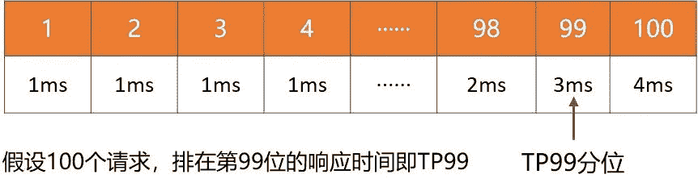
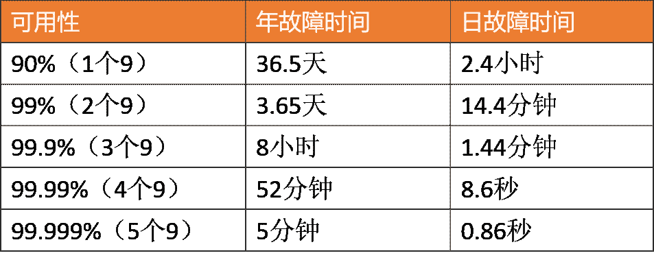
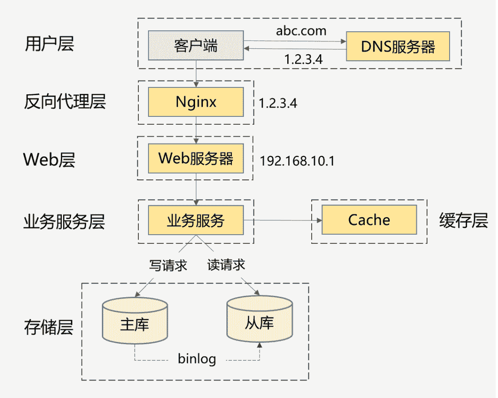

# 第五章 第 1 节 Java-分布式-1

> 原文：[`www.nowcoder.com/tutorial/10070/1b32886cbeb3447fa36fef8435d4d8af`](https://www.nowcoder.com/tutorial/10070/1b32886cbeb3447fa36fef8435d4d8af)

## 1\. 分布式

#### 1.1 什么是 CAP 原则？

**参考答案**

CAP 定理又称 CAP 原则，指的是在一个分布式系统中，Consistency（一致性）、 Availability（可用性）、Partition tolerance（分区容错性），最多只能同时三个特性中的两个，三者不可兼得。

*   Consistency (一致性)：

    “all nodes see the same data at the same time”，即更新操作成功并返回客户端后，所有节点在同一时间的数据完全一致，这就是分布式的一致性。一致性的问题在并发系统中不可避免，对于客户端来说，一致性指的是并发访问时更新过的数据如何获取的问题。从服务端来看，则是更新如何复制分布到整个系统，以保证数据最终一致。

*   Availability (可用性)：

    可用性指“Reads and writes always succeed”，即服务一直可用，而且是正常响应时间。好的可用性主要是指系统能够很好的为用户服务，不出现用户操作失败或者访问超时等用户体验不好的情况。

*   Partition Tolerance (分区容错性)：

    即分布式系统在遇到某节点或网络分区故障的时候，仍然能够对外提供满足一致性和可用性的服务。分区容错性要求能够使应用虽然是一个分布式系统，而看上去却好像是在一个可以运转正常的整体。比如现在的分布式系统中有某一个或者几个机器宕掉了，其他剩下的机器还能够正常运转满足系统需求，对于用户而言并没有什么体验上的影响。

#### 1.2 说一说你对高并发的理解

**参考答案**

1\. 如何理解高并发？

高并发意味着大流量，需要运用技术手段抵抗流量的冲击，这些手段好比操作流量，能让流量更平稳地被系统所处理，带给用户更好的体验。我们常见的高并发场景有：淘宝的双 11、春运时的抢票、微博大 V 的热点新闻等。除了这些典型事情，每秒几十万请求的秒杀系统、每天千万级的订单系统、每天亿级日活的信息流系统等，都可以归为高并发。很显然，上面谈到的高并发场景，并发量各不相同，那到底多大并发才算高并发呢？

1.  不能只看数字，要看具体的业务场景。不能说 10W QPS 的秒杀是高并发，而 1W QPS 的信息流就不是高并发。信息流场景涉及复杂的推荐模型和各种人工策略，它的业务逻辑可能比秒杀场景复杂 10 倍不止。因此，不在同一个维度，没有任何比较意义。
2.  业务都是从 0 到 1 做起来的，并发量和 QPS 只是参考指标，最重要的是：在业务量逐渐变成原来的 10 倍、100 倍的过程中，你是否用到了高并发的处理方法去演进你的系统，从架构设计、编码实现、甚至产品方案等维度去预防和解决高并发引起的问题？而不是一味的升级硬件、加机器做水平扩展。

此外，各个高并发场景的业务特点完全不同：有读多写少的信息流场景、有读多写多的交易场景，那是否有通用的技术方案解决不同场景的高并发问题呢？我觉得大的思路可以借鉴，别人的方案也可以参考，但是真正落地过程中，细节上还会有无数的坑。另外，由于软硬件环境、技术栈、以及产品逻辑都没法做到完全一致，这些都会导致同样的业务场景，就算用相同的技术方案也会面临不同的问题，这些坑还得一个个趟。

2\. 高并发系统设计的目标是什么？

先搞清楚高并发系统设计的目标，在此基础上再讨论设计方案和实践经验才有意义和针对性。

2.1 宏观目标

高并发绝不意味着只追求高性能，这是很多人片面的理解。从宏观角度看，高并发系统设计的目标有三个：高性能、高可用，以及高可扩展。

1.  高性能：性能体现了系统的并行处理能力，在有限的硬件投入下，提高性能意味着节省成本。同时，性能也反映了用户体验，响应时间分别是 100 毫秒和 1 秒，给用户的感受是完全不同的。
2.  高可用：表示系统可以正常服务的时间。一个全年不停机、无故障；另一个隔三差五出线上事故、宕机，用户肯定选择前者。另外，如果系统只能做到 90%可用，也会大大拖累业务。
3.  高扩展：表示系统的扩展能力，流量高峰时能否在短时间内完成扩容，更平稳地承接峰值流量，比如双 11 活动、明星离婚等热点事件。

这 3 个目标是需要通盘考虑的，因为它们互相关联、甚至也会相互影响。比如说：考虑系统的扩展能力，你会将服务设计成无状态的，这种集群设计保证了高扩展性，其实也间接提升了系统的性能和可用性。再比如说：为了保证可用性，通常会对服务接口进行超时设置，以防大量线程阻塞在慢请求上造成系统雪崩，那超时时间设置成多少合理呢？一般，我们会参考依赖服务的性能表现进行设置。

2.2 微观目标

再从微观角度来看，高性能、高可用和高扩展又有哪些具体的指标来衡量？为什么会选择这些指标呢？

2.2.1 性能指标

通过性能指标可以度量目前存在的性能问题，同时作为性能优化的评估依据。一般来说，会采用一段时间内的接口响应时间作为指标。

1.  平均响应时间：最常用，但是缺陷很明显，对于慢请求不敏感。比如 1 万次请求，其中 9900 次是 1ms，100 次是 100ms，则平均响应时间为 1.99ms，虽然平均耗时仅增加了 0.99ms，但是 1%请求的响应时间已经增加了 100 倍。

2.  TP90、TP99 等分位值：将响应时间按照从小到大排序，TP90 表示排在第 90 分位的响应时间， 分位值越大，对慢请求越敏感。

    

3.  吞吐量：和响应时间呈反比，比如响应时间是 1ms，则吞吐量为每秒 1000 次。

通常，设定性能目标时会兼顾吞吐量和响应时间，比如这样表述：在每秒 1 万次请求下，AVG 控制在 50ms 以下，TP99 控制在 100ms 以下。对于高并发系统，AVG 和 TP 分位值必须同时要考虑。另外，从用户体验角度来看，200 毫秒被认为是第一个分界点，用户感觉不到延迟，1 秒是第二个分界点，用户能感受到延迟，但是可以接受。因此，对于一个健康的高并发系统，TP99 应该控制在 200 毫秒以内，TP999 或者 TP9999 应该控制在 1 秒以内。

2.2.2 可用性指标

高可用性是指系统具有较高的无故障运行能力，可用性 = 平均故障时间 / 系统总运行时间，一般使用几个 9 来描述系统的可用性。

对于高并发系统来说，最基本的要求是：保证 3 个 9 或者 4 个 9。原因很简单，如果你只能做到 2 个 9，意味着有 1%的故障时间，像一些大公司每年动辄千亿以上的 GMV 或者收入，1%就是 10 亿级别的业务影响。

2.2.3 可扩展性指标

面对突发流量，不可能临时改造架构，最快的方式就是增加机器来线性提高系统的处理能力。

对于业务集群或者基础组件来说，扩展性 = 性能提升比例 / 机器增加比例，理想的扩展能力是：资源增加几倍，性能提升几倍。通常来说，扩展能力要维持在 70%以上。

但是从高并发系统的整体架构角度来看，扩展的目标不仅仅是把服务设计成无状态就行了，因为当流量增加 10 倍，业务服务可以快速扩容 10 倍，但是数据库可能就成为了新的瓶颈。

像 MySQL 这种有状态的存储服务通常是扩展的技术难点，如果架构上没提前做好规划（垂直和水平拆分），就会涉及到大量数据的迁移。

因此，高扩展性需要考虑：服务集群、数据库、缓存和消息队列等中间件、负载均衡、带宽、依赖的第三方等，当并发达到某一个量级后，上述每个因素都可能成为扩展的瓶颈点。

3\. 高并发的实践方案有哪些？

了解了高并发设计的 3 大目标后，再系统性总结下高并发的设计方案，会从以下两部分展开：先总结下通用的设计方法，然后再围绕高性能、高可用、高扩展分别给出具体的实践方案。

3.1 通用的设计方法

通用的设计方法主要是从「纵向」和「横向」两个维度出发，俗称高并发处理的两板斧：纵向扩展和横向扩展。

3.1.1 纵向扩展（scale-up）

它的目标是提升单机的处理能力，方案又包括：

1.  提升单机的硬件性能：通过增加内存、CPU 核数、存储容量、或者将磁盘升级成 SSD 等堆硬件的方式来提升。
2.  提升单机的软件性能：使用缓存减少 IO 次数，使用并发或者异步的方式增加吞吐量。

3.1.2 横向扩展（scale-out）

因为单机性能总会存在极限，所以最终还需要引入横向扩展，通过集群部署以进一步提高并发处理能力，又包括以下 2 个方向：

1.  做好分层架构：这是横向扩展的提前，因为高并发系统往往业务复杂，通过分层处理可以简化复杂问题，更容易做到横向扩展。

    

    上面这种图是互联网最常见的分层架构，当然真实的高并发系统架构会在此基础上进一步完善。比如会做动静分离并引入 CDN，反向代理层可以是 LVS+Nginx，Web 层可以是统一的 API 网关，业务服务层可进一步按垂直业务做微服务化，存储层可以是各种异构数据库。

2.  各层进行水平扩展：无状态水平扩容，有状态做分片路由。业务集群通常能设计成无状态的，而数据库和缓存往往是有状态的，因此需要设计分区键做好存储分片，当然也可以通过主从同步、读写分离的方案提升读性能。

3.2 具体的实践方案

下面再结合我的个人经验，针对高性能、高可用、高扩展 3 个方面，总结下可落地的实践方案。

3.2.1 高性能的实践方案

1.  集群部署，通过负载均衡减轻单机压力。
2.  多级缓存，包括静态数据使用 CDN、本地缓存、分布式缓存等，以及对缓存场景中的热点 key、缓存穿透、缓存并发、数据一致性等问题的处理。
3.  分库分表和索引优化，以及借助搜索引擎解决复杂查询问题。
4.  考虑 NoSQL 数据库的使用，比如 HBase、TiDB 等，但是团队必须熟悉这些组件，且有较强的运维能力。
5.  异步化，将次要流程通过多线程、MQ、甚至延时任务进行异步处理。
6.  限流，需要先考虑业务是否允许限流（比如秒杀场景是允许的），包括前端限流、Nginx 接入层的限流、服务端的限流。
7.  对流量进行削峰填谷，通过 MQ 承接流量。
8.  并发处理，通过多线程将串行逻辑并行化。
9.  预计算，比如抢红包场景，可以提前计算好红包金额缓存起来，发红包时直接使用即可。
10.  缓存预热，通过异步任务提前预热数据到本地缓存或者分布式缓存中。
11.  减少 IO 次数，比如数据库和缓存的批量读写、RPC 的批量接口支持、或者通过冗余数据的方式干掉 RPC 调用。
12.  减少 IO 时的数据包大小，包括采用轻量级的通信协议、合适的数据结构、去掉接口中的多余字段、减少缓存 key 的大小、压缩缓存 value 等。
13.  程序逻辑优化，比如将大概率阻断执行流程的判断逻辑前置、For 循环的计算逻辑优化，或者采用更高效的算法。
14.  各种池化技术的使用和池大小的设置，包括 HTTP 请求池、线程池（考虑 CPU 密集型还是 IO 密集型设置核心参数）、数据库和 Redis 连接池等。
15.  JVM 优化，包括新生代和老年代的大小、GC 算法的选择等，尽可能减少 GC 频率和耗时。
16.  锁选择，读多写少的场景用乐观锁，或者考虑通过分段锁的方式减少锁冲突。

上述方案无外乎从计算和 IO 两个维度考虑所有可能的优化点，需要有配套的监控系统实时了解当前的性能表现，并支撑你进行性能瓶颈分析，然后再遵循二八原则，抓主要矛盾进行优化。