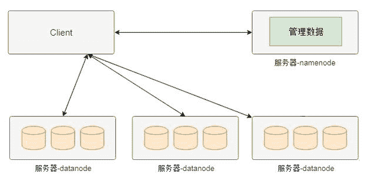
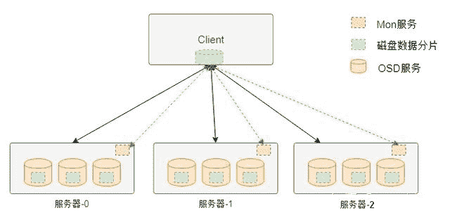
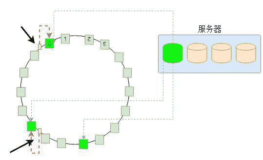
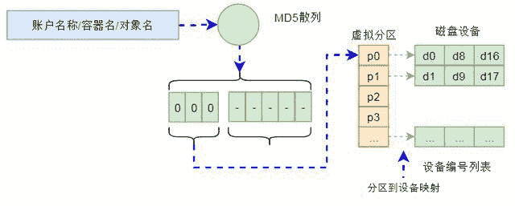
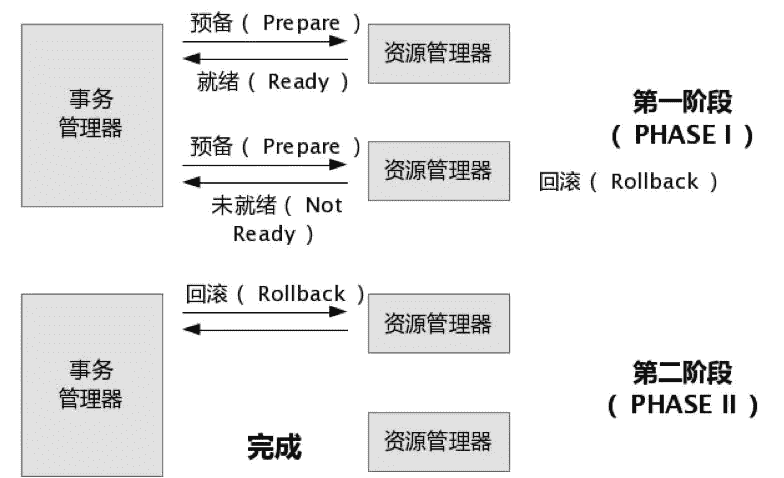
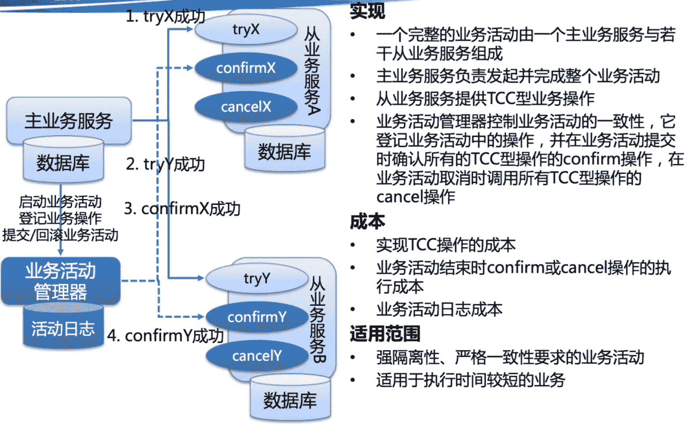
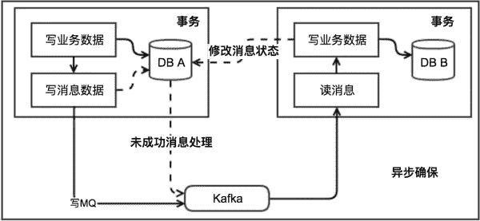
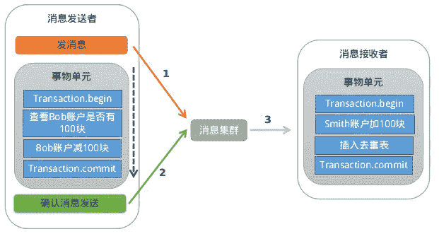
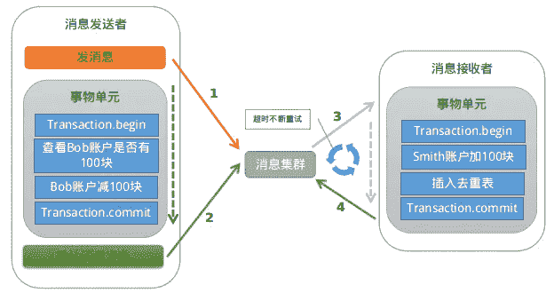

# 第五章 第 2 节 Java-分布式-2

> 原文：[`www.nowcoder.com/tutorial/10070/2f7fce544e59490d8069d432c9f12bfb`](https://www.nowcoder.com/tutorial/10070/2f7fce544e59490d8069d432c9f12bfb)

3.2.2 高可用的实践方案

1.  对等节点的故障转移，Nginx 和服务治理框架均支持一个节点失败后访问另一个节点。
2.  非对等节点的故障转移，通过心跳检测并实施主备切换（比如 redis 的哨兵模式或者集群模式、MySQL 的主从切换等）。
3.  接口层面的超时设置、重试策略和幂等设计。
4.  降级处理：保证核心服务，牺牲非核心服务，必要时进行熔断；或者核心链路出问题时，有备选链路。
5.  限流处理：对超过系统处理能力的请求直接拒绝或者返回错误码。
6.  MQ 场景的消息可靠性保证，包括 producer 端的重试机制、broker 侧的持久化、consumer 端的 ack 机制等。
7.  灰度发布，能支持按机器维度进行小流量部署，观察系统日志和业务指标，等运行平稳后再推全量。
8.  监控报警：全方位的监控体系，包括最基础的 CPU、内存、磁盘、网络的监控，以及 Web 服务器、JVM、数据库、各类中间件的监控和业务指标的监控。
9.  灾备演练：类似当前的“混沌工程”，对系统进行一些破坏性手段，观察局部故障是否会引起可用性问题。

高可用的方案主要从冗余、取舍、系统运维 3 个方向考虑，同时需要有配套的值班机制和故障处理流程，当出现线上问题时，可及时跟进处理。

3.2.3 高扩展的实践方案

1.  合理的分层架构：比如上面谈到的互联网最常见的分层架构，另外还能进一步按照数据访问层、业务逻辑层对微服务做更细粒度的分层（但是需要评估性能，会存在网络多一跳的情况）。
2.  存储层的拆分：按照业务维度做垂直拆分、按照数据特征维度进一步做水平拆分（分库分表）。
3.  业务层的拆分：最常见的是按照业务维度拆（比如电商场景的商品服务、订单服务等），也可以按照核心接口和非核心接口拆，还可以按照请求源拆（比如 To C 和 To B，APP 和 H5）。

#### 1.3 如何实现分布式存储？

**参考答案**

分布式存储是一个大的概念，其包含的种类繁多，除了传统意义上的分布式文件系统、分布式块存储和分布式对象存储外，还包括分布式数据库和分布式缓存等。下面我们探讨一下分布式文件系统等传统意义上的存储架构，实现这种存储架构主要有三种通用的形式，其它存储架构也基本上基于上述架构，并没有太大的变化。

中间控制节点架构（HDFS）

分布式存储最早是由谷歌提出的，其目的是通过廉价的服务器来提供使用与大规模，高并发场景下的 Web 访问问题。下图是谷歌分布式存储（HDFS）的简化的模型。在该系统的整个架构中将服务器分为两种类型，一种名为 namenode，这种类型的节点负责管理管理数据（元数据），另外一种名为 datanode，这种类型的服务器负责实际数据的管理。

上图分布式存储中，如果客户端需要从某个文件读取数据，首先从 namenode 获取该文件的位置（具体在哪个 datanode），然后从该位置获取具体的数据。在该架构中 namenode 通常是主备部署，而 datanode 则是由大量节点构成一个集群。由于元数据的访问频度和访问量相对数据都要小很多，因此 namenode 通常不会成为性能瓶颈，而 datanode 集群可以分散客户端的请求。因此，通过这种分布式存储架构可以通过横向扩展 datanode 的数量来增加承载能力，也即实现了动态横向扩展的能力。

完全无中心架构---计算模式（Ceph）

下图是 Ceph 存储系统的架构，在该架构中与 HDFS 不同的地方在于该架构中没有中心节点。客户端是通过一个设备映射关系计算出来其写入数据的位置，这样客户端可以直接与存储节点通信，从而避免中心节点的性能瓶颈。

在 Ceph 存储系统架构中核心组件有 Mon 服务、OSD 服务和 MDS 服务等。对于块存储类型只需要 Mon 服务、OSD 服务和客户端的软件即可。其中 Mon 服务用于维护存储系统的硬件逻辑关系，主要是服务器和硬盘等在线信息。Mon 服务通过集群的方式保证其服务的可用性。OSD 服务用于实现对磁盘的管理，实现真正的数据读写，通常一个磁盘对应一个 OSD 服务。
客户端访问存储的大致流程是，客户端在启动后会首先从 Mon 服务拉取存储资源布局信息，然后根据该布局信息和写入数据的名称等信息计算出期望数据的位置（包含具体的物理服务器信息和磁盘信息），然后该位置信息直接通信，读取或者写入数据。

完全无中心架构---一致性哈希（Swift）

与 Ceph 的通过计算方式获得数据位置的方式不同，另外一种方式是通过一致性哈希的方式获得数据位置。一致性哈希的方式就是将设备做成一个哈希环，然后根据数据名称计算出的哈希值映射到哈希环的某个位置，从而实现数据的定位。

上图是一致性哈希的基本原理，为了绘制简单，本文以一个服务器上的一个磁盘为例进行介绍。为了保证数据分配的均匀性及出现设备故障时数据迁移的均匀性，一致性哈希将磁盘划分为比较多的虚拟分区，每个虚拟分区是哈希环上的一个节点。整个环是一个从 0 到 32 位最大值的一个区间，并且首尾相接。当计算出数据（或者数据名称）的哈希值后，必然落到哈希环的某个区间，然后以顺时针，必然能够找到一个节点。那么，这个节点就是存储数据的位置。
Swift 存储的整个数据定位算法就是基于上述一致性哈希实现的。在 Swift 对象存储中，通过账户名/容器名/对象名三个名称组成一个位置的标识，通过该唯一标识可以计算出一个整型数来。而在存储设备方面，Swift 构建一个虚拟分区表，表的大小在创建集群是确定（通常为几十万），这个表其实就是一个数组。这样，根据上面计算的整数值，以及这个数组，通过一致性哈希算法就可以确定该整数在数组的位置。而数组中的每项内容是数据 3 个副本（也可以是其它副本数量）的设备信息（包含服务器和磁盘等信息）。也就是经过上述计算，可以确定一个数据存储的具体位置。这样，Swift 就可以将请求重新定向到该设备进行处理。

上述计算过程是在一个名为 Proxy 的服务中进行的，该服务可以集群化部署。因此可以分摊请求的负载，不会成为性能瓶颈。

#### 1.4 说一说你对分布式事务的了解

**参考答案**

分布式事务就是指事务的参与者、支持事务的服务器、资源服务器以及事务管理器分别位于不同的分布式系统的不同节点之上。简单的说，就是一次大的操作由不同的小操作组成，这些小的操作分布在不同的服务器上，且属于不同的应用，分布式事务需要保证这些小操作要么全部成功，要么全部失败。本质上来说，分布式事务就是为了保证不同数据库的数据一致性。

要实现分布式事务，有如下几种常见的解决方案：

2PC

说到 2PC 就不得不聊数据库分布式事务中的 XA Transactions。

如上图，在 XA 协议中分为两阶段：

第一阶段：事务管理器要求每个涉及到事务的数据库预提交(precommit)此操作，并反映是否可以提交。

第二阶段：事务协调器要求每个数据库提交数据，或者回滚数据。

优点：

*   尽量保证了数据的强一致，实现成本较低，在各大主流数据库都有自己实现，对于 MySQL 是从 5.5 开始支持。

缺点：

*   单点问题:事务管理器在整个流程中扮演的角色很关键，如果其宕机，比如在第一阶段已经完成，在第二阶段正准备提交的时候事务管理器宕机，资源管理器就会一直阻塞，导致数据库无法使用。
*   同步阻塞:在准备就绪之后，资源管理器中的资源一直处于阻塞，直到提交完成，释放资源。
*   数据不一致:两阶段提交协议虽然为分布式数据强一致性所设计，但仍然存在数据不一致性的可能，比如在第二阶段中，假设协调者发出了事务 commit 的通知，但是因为网络问题该通知仅被一部分参与者所收到并执行了 commit 操作，其余的参与者则因为没有收到通知一直处于阻塞状态，这时候就产生了数据的不一致性。

总的来说，XA 协议比较简单，成本较低，但是其单点问题，以及不能支持高并发依然是其最大的弱点。

TCC

关于 TCC（Try-Confirm-Cancel）的概念，最早是由 Pat Helland 于 2007 年发表的一篇名为《Life beyond Distributed Transactions:an Apostate’s Opinion》的论文提出。 TCC 事务机制相比于上面介绍的 XA，解决了其几个缺点：

1.  解决了协调者单点，由主业务方发起并完成这个业务活动。业务活动管理器也变成多点，引入集群。
2.  同步阻塞：引入超时，超时后进行补偿，并且不会锁定整个资源，将资源转换为业务逻辑形式，粒度变小。
3.  数据一致性，有了补偿机制之后，由业务活动管理器控制一致性。

如上图，对于 TCC 的解释：

*   Try 阶段：尝试执行,完成所有业务检查（一致性），预留必须业务资源（准隔离性）。
*   Confirm 阶段：确认执行真正执行业务，不作任何业务检查，只使用 Try 阶段预留的业务资源，Confirm 操作满足幂等性。要求具备幂等设计，Confirm 失败后需要进行重试。
*   Cancel 阶段：取消执行，释放 Try 阶段预留的业务资源 Cancel 操作满足幂等性 Cancel 阶段的异常和 Confirm 阶段异常处理方案基本上一致。

举个简单的例子如果你用 100 元买了一瓶水，在 Try 阶段你需要向你的钱包检查是否够 100 元并锁住这 100 元，水也是一样的。如果有一个失败，则进行 cancel(释放这 100 元和这一瓶水)，如果 cancel 失败不论什么失败都进行重试 cancel，所以需要保持幂等。如果都成功，则进行 confirm,确认这 100 元扣，和这一瓶水被卖，如果 confirm 失败无论什么失败则重试(会依靠活动日志进行重试)。

对于 TCC 来说适合以下场景：

*   强隔离性，严格一致性要求的活动业务。
*   执行时间较短的业务。

本地消息表

本地消息表这个方案最初是 ebay 提出的，此方案的核心是将需要分布式处理的任务通过消息日志的方式来异步执行。消息日志可以存储到本地文本、数据库或消息队列，再通过业务规则自动或人工发起重试。人工重试更多的是应用于支付场景，通过对账系统对事后问题的处理。

对于本地消息队列来说核心是把大事务转变为小事务，还是举上面用 100 元去买一瓶水的例子：

1.  当你扣钱的时候，你需要在你扣钱的服务器上新增加一个本地消息表，你需要把你扣钱和写入减去水的库存到本地消息表放入同一个事务(依靠数据库本地事务保证一致性。
2.  这个时候有个定时任务去轮询这个本地事务表，把没有发送的消息，扔给商品库存服务器，叫他减去水的库存，到达商品服务器之后这个时候得先写入这个服务器的事务表，然后进行扣减，扣减成功后，更新事务表中的状态。
3.  商品服务器通过定时任务扫描消息表或者直接通知扣钱服务器，扣钱服务器本地消息表进行状态更新。
4.  针对一些异常情况，定时扫描未成功处理的消息，进行重新发送，在商品服务器接到消息之后，首先判断是否是重复的，如果已经接收，在判断是否执行，如果执行在马上又进行通知事务，如果未执行，需要重新执行需要由业务保证幂等，也就是不会多扣一瓶水。

本地消息队列是 BASE 理论，是最终一致模型，适用于对一致性要求不高的场景，实现这个模型时需要注意重试的幂等。

MQ 事务

在 RocketMQ 中实现了分布式事务，实际上其实是对本地消息表的一个封装，将本地消息表移动到了 MQ 内部，下面简单介绍一下 MQ 事务。

基本流程如下：

第一阶段 Prepared 消息，会拿到消息的地址。

第二阶段执行本地事务。

第三阶段通过第一阶段拿到的地址去访问消息，并修改状态。消息接受者就能使用这个消息。

如果确认消息失败，在 RocketMq Broker 中提供了定时扫描没有更新状态的消息，如果有消息没有得到确认，会向消息发送者发送消息，来判断是否提交，在 rocketmq 中是以 listener 的形式给发送者，用来处理。

如果消费超时，则需要一直重试，消息接收端需要保证幂等。如果消息消费失败，这个就需要人工进行处理，因为这个概率较低，如果为了这种小概率时间而设计这个复杂的流程反而得不偿失。

Saga 事务

Saga 是 30 年前一篇数据库伦理提到的一个概念。其核心思想是将长事务拆分为多个本地短事务，由 Saga 事务协调器协调，如果正常结束那就正常完成，如果某个步骤失败，则根据相反顺序一次调用补偿操作。 Saga 的组成：

每个 Saga 由一系列 sub-transaction Ti 组成 每个 Ti 都有对应的补偿动作 Ci，补偿动作用于撤销 Ti 造成的结果,这里的每个 T，都是一个本地事务。 可以看到，和 TCC 相比，Saga 没有“预留 try”动作，它的 Ti 就是直接提交到库。

Saga 的执行顺序有两种：

*   T1, T2, T3, ..., Tn
*   T1, T2, ..., Tj, Cj,..., C2, C1，其中 0 < j < n

Saga 定义了两种恢复策略：

向后恢复，即上面提到的第二种执行顺序，其中 j 是发生错误的 sub-transaction，这种做法的效果是撤销掉之前所有成功的 sub-transation，使得整个 Saga 的执行结果撤销。 向前恢复，适用于必须要成功的场景，执行顺序是类似于这样的：T1, T2, ..., Tj(失败), Tj(重试),..., Tn，其中 j 是发生错误的 sub-transaction。该情况下不需要 Ci。这里要注意的是，在 saga 模式中不能保证隔离性，因为没有锁住资源，其他事务依然可以覆盖或者影响当前事务。

还是拿 100 元买一瓶水的例子来说，这里定义：

*   T1=扣 100 元，T2=给用户加一瓶水，T3=减库存一瓶水；
*   C1=加 100 元，C2=给用户减一瓶水，C3=给库存加一瓶水；

我们一次进行 T1，T2，T3 如果发生问题，就执行发生问题的 C 操作的反向。 上面说到的隔离性的问题会出现在，如果执行到 T3 这个时候需要执行回滚，但是这个用户已经把水喝了(另外一个事务)，回滚的时候就会发现，无法给用户减一瓶水了。这就是事务之间没有隔离性的问题。

可以看见 saga 模式没有隔离性的影响还是较大，可以参照华为的解决方案:从业务层面入手加入一 Session 以及锁的机制来保证能够串行化操作资源。也可以在业务层面通过预先冻结资金的方式隔离这部分资源， 最后在业务操作的过程中可以通过及时读取当前状态的方式获取到最新的更新。