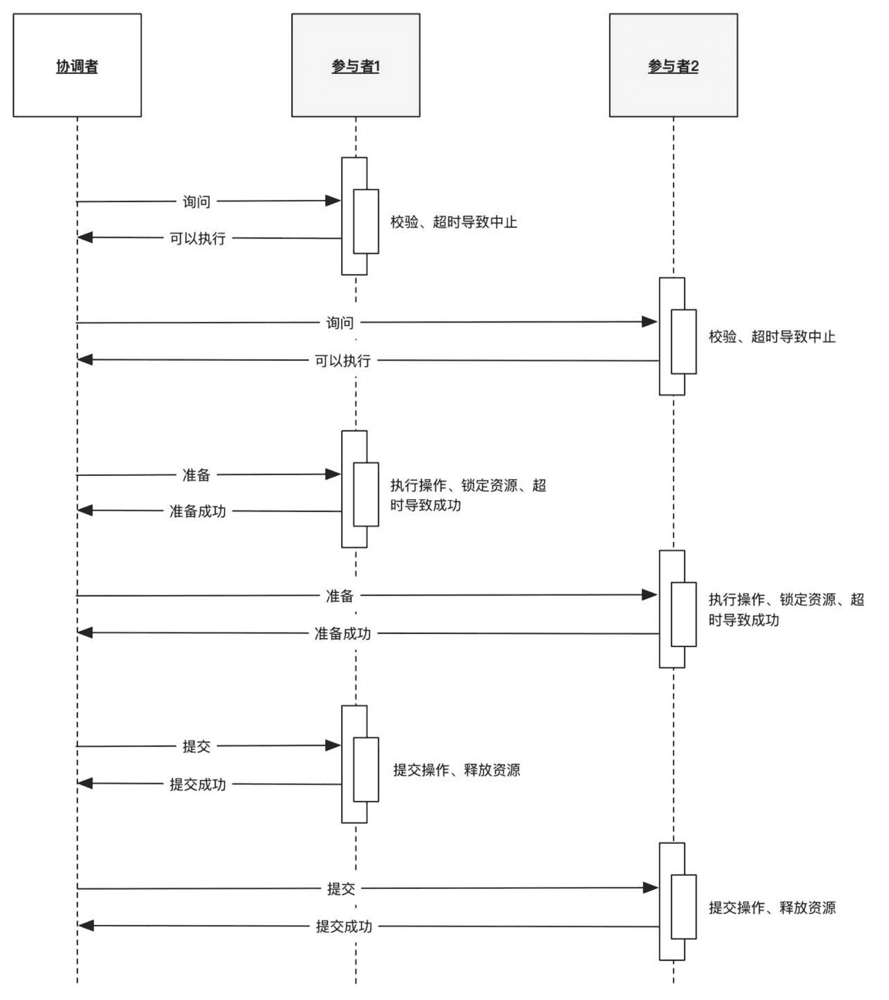
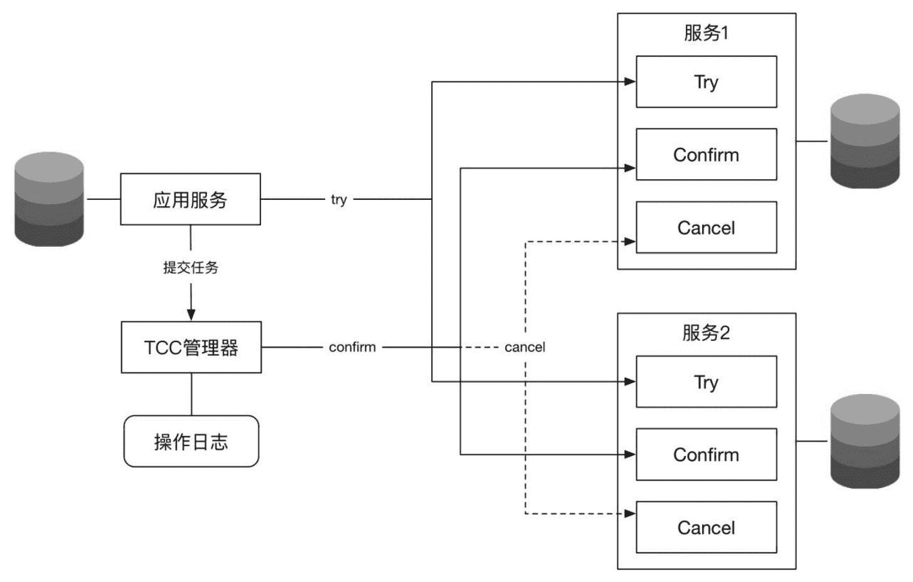
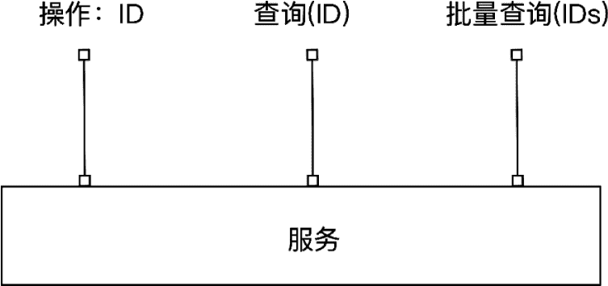
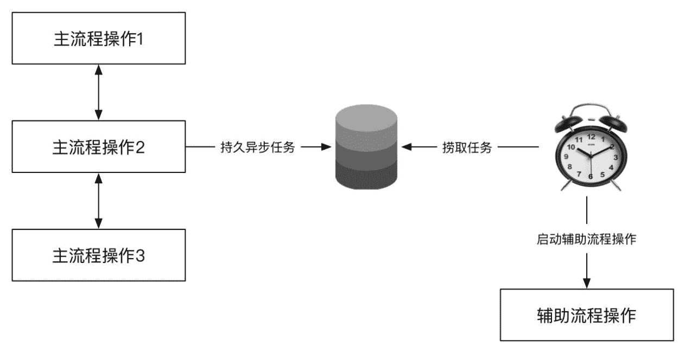
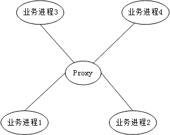
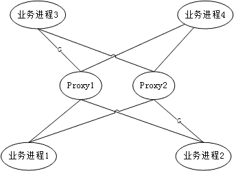
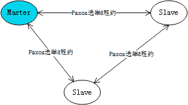

# 第五章 第 3 节 Java-分布式-3

> 原文：[`www.nowcoder.com/tutorial/10070/699232c494ce4801bfeb4b2f39a953cd`](https://www.nowcoder.com/tutorial/10070/699232c494ce4801bfeb4b2f39a953cd)

#### 1.5 分布式系统如何保证最终一致性？

**参考答案**

国际开放标准组织 Open Group 定义了 DTS（分布式事务处理模型），模型中包含 4 种角色：应用程序、事务管理器、资源管理器和通信资源管理器。事务管理器是统管全局的管理者，资源管理器和通信资源管理器是事务的参与者。

JEE（Java 企业版）规范也包含此分布式事务处理模型的规范，并在所有 AppServer 中进行实现。在 JEE 规范中定义了 TX 协议和 XA 协议，TX 协议定义应用程序与事务管理器之间的接口，XA 协议则定义事务管理器与资源管理器之间的接口。在过去使用 AppServer 如 WebSphere、 WebLogic、JBoss 等配置数据源时会看见类似 XADatasource 的数据源，这就是实现了分布式事务处理模型的关系型数据库的数据源。在企业级开发 JEE 中，关系型数据库、JMS 服务扮演资源管理器的角色，而 EJB 容器扮演事务管理器的角色。

下面我们介绍两阶段提交协议、三阶段提交协议及阿里巴巴提出的 TCC，它们都是根据 DTS 这一思想演变而来的。

两阶段提交协议

两阶段提交协议把分布式事务分为两个阶段，一个是准备阶段，另一个是提交阶段。准备阶段和提交阶段都是由事务管理器发起的，为了接下来讲解方便，我们将事务管理器称为协调者，将资源管理器称为参与者。

两阶段提交协议的流程如下所述。

*   准备阶段：协调者向参与者发起指令，参与者评估自己的状态，如果参与者评估指令可以完成，则会写 redo 或者 undo 日志（Write-Ahead Log 的一种），然后锁定资源，执行操作，但是并不提交。

*   提交阶段：如果每个参与者明确返回准备成功，也就是预留资源和执行操作成功，则协调者向参与者发起提交指令，参与者提交资源变更的事务，释放锁定的资源；如果任何一个参与者明确返回准备失败，也就是预留资源或者执行操作失败，则协调者向参与者发起中止指令，参与者取消已经变更的事务，执行 undo 日志，释放锁定的资源。两阶段提交协议的成功场景如下图所示。

    

    我们看到两阶段提交协议在准备阶段锁定资源，这是一个重量级的操作，能保证强一致性，但是实现起来复杂、成本较高、不够灵活，更重要的是它有如下致命的问题。

*   阻塞：从上面的描述来看，对于任何一次指令都必须收到明确的响应，才会继续进行下一步，否则处于阻塞状态，占用的资源被一直锁定，不会被释放。

*   单点故障：如果协调者宕机，参与者没有协调者指挥，则会一直阻塞，尽管可以通过选举新的协调者替代原有协调者，但是如果协调者在发送一个提交指令后宕机，而提交指令仅仅被一个参与者接收，并且参与者接收后也宕机，则新上任的协调者无法处理这种情况。

*   脑裂：协调者发送提交指令，有的参与者接收到并执行了事务，有的参与者没有接收到事务就没有执行事务，多个参与者之间是不一致的。

上面的所有问题虽然很少发生，但都需要人工干预处理，没有自动化的解决方案，因此两阶段提交协议在正常情况下能保证系统的强一致性，但是在出现异常的情况下，当前处理的操作处于错误状态，需要管理员人工干预解决，因此可用性不够好，这也符合 CAP 协议的一致性和可用性不能兼得的原理。

三阶段提交协议

三阶段提交协议是两阶段提交协议的改进版本。它通过超时机制解决了阻塞的问题，并且把两个阶段增加为以下三个阶段。

*   询问阶段：协调者询问参与者是否可以完成指令，协调者只需要回答是或不是，而不需要做真正的操作，这个阶段超时会导致中止。
*   准备阶段：如果在询问阶段所有参与者都返回可以执行操作，则协调者向参与者发送预执行请求，然后参与者写 redo 和 undo 日志，执行操作但是不提交操作；如果在询问阶段任意参与者返回不能执行操作的结果，则协调者向参与者发送中止请求，这里的逻辑与两阶段提交协议的准备阶段是相似的。
*   提交阶段：如果每个参与者在准备阶段返回准备成功，也就是说预留资源和执行操作成功，则协调者向参与者发起提交指令，参与者提交资源变更的事务，释放锁定的资源；如果任何参与者返回准备失败，也就是说预留资源或者执行操作失败，则协调者向参与者发起中止指令，参与者取消已经变更的事务，执行 undo 日志，释放锁定的资源，这里的逻辑与两阶段提交协议的提交阶段一致。

三阶段提交协议的成功场景示意图如下图所示：

三阶段提交协议与两阶段提交协议主要有以下两个不同点：

*   增加了一个询问阶段，询问阶段可以确保尽可能早地发现无法执行操作而需要中止的行为，但是它并不能发现所有这种行为，只会减少这种情况的发生。
*   在准备阶段以后，协调者和参与者执行的任务中都增加了超时，一旦超时，则协调者和参与者都会继续提交事务，默认为成功，这也是根据概率统计超时后默认为成功的正确性最大。

三阶段提交协议与两阶段提交协议相比，具有如上优点，但是一旦发生超时，系统仍然会发生不一致，只不过这种情况很少见，好处是至少不会阻塞和永远锁定资源。

TCC

签名讲解了两阶段提交协议和三阶段提交协议，实际上它们能解决常见的分布式事务的问题，但是遇到极端情况时，系统会产生阻塞或者不一致的问题，需要运营或者技术人员解决。两阶段及三阶段方案中都包含多个参与者、多个阶段实现一个事务，实现复杂，性能也是一个很大的问题，因此，在互联网的高并发系统中，鲜有使用两阶段提交和三阶段提交协议的场景。

后来有人提出了 TCC 协议，TCC 协议将一个任务拆分成 Try、Confirm、Cancel 三个步骤，正常的流程会先执行 Try，如果执行没有问题，则再执行 Confirm，如果执行过程中出了问题，则执行操作的逆操作 Cancel。从正常的流程上讲，这仍然是一个两阶段提交协议，但是在执行出现问题时有一定的自我修复能力，如果任何参与者出现了问题，则协调者通过执行操作的逆操作来 Cancel 之前的操作，达到最终的一致状态。

可以看出，从时序上来说，如果遇到极端情况，则 TCC 会有很多问题，例如，如果在取消时一些参与者收到指令，而另一些参与者没有收到指令，则整个系统仍然是不一致的。对于这种复杂的情况，系统首先会通过补偿的方式尝试自动修复，如果系统无法修复，则必须由人工参与解决。

从 TCC 的逻辑上看，可以说 TCC 是简化版的三阶段提交协议，解决了两阶段提交协议的阻塞问题，但是没有解决极端情况下会出现不一致和脑裂的问题。然而，TCC 通过自动化补偿手段，将需要人工处理的不一致情况降到最少，也是一种非常有用的解决方案。某著名的互联网公司在内部的一些中间件上实现了 TCC 模式。

我们给出一个使用 TCC 的实际案例，在秒杀的场景中，用户发起下订单请求，应用层先查询库存，确认商品库存还有余量，则锁定库存，此时订单状态为待支付，然后指引用户去支付，由于某种原因用户支付失败或者支付超时，则系统会自动将锁定的库存解锁以供其他用户秒杀。

TCC 协议的使用场景如下图所示：

在大规模、高并发服务化系统中，一个功能被拆分成多个具有单一功能的子功能，一个流程会有多个系统的多个单一功能的服务组合实现，如果使用两阶段提交协议和三阶段提交协议，则确实能解决系统间的一致性问题。除了这两个协议的自身问题，其实现也比较复杂、成本比较高，最重要的是性能不好，相比来看，TCC 协议更简单且更容易实现，但是 TCC 协议由于每个事务都需要执行 Try，再执行 Confirm，略显臃肿，因此，现实系统的底线是仅仅需要达到最终一致性，而不需要实现专业的、复杂的一致性协议。实现最终一致性有一些非常有效、简单的模式，下面就介绍这些模式及其应用场景。

查询模式

任何服务操作都需要提供一个查询接口，用来向外部输出操作执行的状态。服务操作的使用方可以通过查询接口得知服务操作执行的状态，然后根据不同的状态来做不同的处理操作。

为了能够实现查询，每个服务操作都需要有唯一的流水号标识，也可使用此次服务操作对应的资源 ID 来标识，例如：请求流水号、订单号等。首先，单笔查询操作是必须提供的，也鼓励使用单笔订单查询，这是因为每次调用需要占用的负载是可控的。批量查询则根据需要来提供，如果使用了批量查询，则需要有合理的分页机制，并且必须限制分页的大小，以及对批量查询的吞吐量有容量评估、熔断、隔离和限流等措施。

补偿模式

有了上面的查询模式，在任何情况下，我们都能得知具体的操作所处的状态，如果整个操作都处于不正常的状态，则我们需要修正操作中有问题的子操作，这可能需要重新执行未完成的子操作，后者取消已经完成的子操作，通过修复使整个分布式系统达到一致。为了让系统最终达到一致状态而做的努力都叫作补偿。

对于服务化系统中同步调用的操作，若业务操作发起方还没有收到业务操作执行方的明确返回或者调用超时，业务发起方需要及时地调用业务执行方来获得操作执行的状态，这里使用在前面学习的查询模式。在获得业务操作执行方的状态后，如果业务执行方已经完成预设工作，则业务发起方向业务的使用方返回成功；如果业务操作执行方的状态为失败或者未知，则会立即告诉业务使用方失败，也叫作快速失败策略，然后调用业务操作的逆向操作，保证操作不被执行或者回滚已经执行的操作，让业务使用方、业务操作发起方和业务操作执行方最终达到一致状态。

补偿模式如下图所示：

异步确保模式

异步确保模式是补偿模式的一个典型案例，经常应用到使用方对响应时间要求不太高的场景中，通常把这类操作从主流程中摘除，通过异步的方式进行处理，处理后把结果通过通知系统通知给使用方。这个方案的最大好处是能够对高并发流量进行消峰，例如：电商系统中的物流、配送，以及支付系统中的计费、入账等。

在实践中将要执行的异步操作封装后持久入库，然后通过定时捞取未完成的任务进行补偿操作来实现异步确保模式，只要定时系统足够健壮，则任何任务最终都会被成功执行。

异步确保模式如下图所示：

定期校对模式

系统在没有达到一致之前，系统间的状态是不一致的，甚至是混乱的，需要通过补偿操作来达到最终一致性的目的，但是如何来发现需要补偿的操作呢？

在操作主流程中的系统间执行校对操作，可以在事后异步地批量校对操作的状态，如果发现不一致的操作，则进行补偿，补偿操作与补偿模式中的补偿操作是一致的。

另外，实现定期校对的一个关键就是分布式系统中需要有一个自始至终唯一的 ID，生成全局唯一 ID 有以下两种方法：

*   持久型：使用数据库表自增字段或者 Sequence 生成，为了提高效率，每个应用节点可以缓存一个批次的 ID，如果机器重启则可能会损失一部分 ID，但是这并不会产生任何问题。
*   时间型：一般由机器号、业务号、时间、单节点内自增 ID 组成，由于时间一般精确到秒或者毫秒，因此不需要持久就能保证在分布式系统中全局唯一、粗略递增等。

可靠消息模式

在分布式系统中，对于主流程中优先级比较低的操作，大多采用异步的方式执行，也就是前面提到的异步确保模型，为了让异步操作的调用方和被调用方充分解耦，也由于专业的消息队列本身具有可伸缩、可分片、可持久等功能，我们通常通过消息队列实现异步化。对于消息队列，我们需要建立特殊的设施来保证可靠的消息发送及处理机的幂等性。

缓存一致性模式

在大规模、高并发系统中的一个常见的核心需求就是亿级的读需求，显然，关系型数据库并不是解决高并发读需求的最佳方案，互联网的经典做法就是使用缓存来抗住读流量。

*   如果性能要求不是非常高，则尽量使用分布式缓存，而不要使用本地缓存。
*   写缓存时数据一定要完整，如果缓存数据的一部分有效，另一部分无效，则宁可在需要时回源数据库，也不要把部分数据放入缓存中。
*   使用缓存牺牲了一致性，为了提高性能，数据库与缓存只需要保持弱一致性，而不需要保持强一致性，否则违背了使用缓存的初衷。
*   读的顺序是先读缓存，后读数据库，写的顺序要先写数据库，后写缓存。

#### 1.6 谈谈你对分布式的单点问题的了解

**参考答案**

在分布式系统中，单点问题是一个比较常见的问题，对于单点问题可以分为有状态服务的单点问题和无状态服务的单点问题。

无状态服务的单点问题

对于无状态的服务，单点问题的解决比较简单，因为服务是无状态的，所以服务节点很容易进行平行扩展。比如，在分布式系统中，为了降低各进程通信的网络结构的复杂度，我们会增加一个代理节点，专门做消息的转发，其他的业务进行直接和代理节点进行通信，类似一个星型的网络结构。

参考上面两个图，图中 proxy 是一个消息转发代理，业务进程中的消息都会经过该代理，这也是比较场景的一个架构。在上图中，只有一个 proxy，如果该节点挂了，那么所有的业务进程之间都无法进行通信。由于 proxy 是无状态的服务，所以很容易想到第二个图中的解决方案，增加一个 proxy 节点，两个 proxy 节点是对等的。增加新节点后，业务进程需要与两个 Proxy 之间增加一个心跳的机制，业务进程在发送消息的时候根据 proxy 的状态，选择一个可用的 proxy 进行消息的传递。从负载均衡的角度来看，如果两个 proxy 都是存活状态的话，业务进程应当随机选择一个 proxy。

那么该解决方案中会存在什么问题呢？主要存在的问题是消息的顺序性问题。一般来说，业务的消息都是发送、应答，再发送、再应答这样的顺序进行的，在业务中可以保证消息的顺序性。但是，在实际的应用中，会出现这样一个情况：在业务进程 1 中，有个业务需要给业务进程 3 发送消息 A 和消息 B，根据业务的特性，消息 A 必须要在消息 B 之前到达。如果业务进程 1 在发送消息 A 的时候选择了 proxy1，在发送消息 B 的时候选择了 proxy2，那么在分布式环境中，我们并不能确保先发送的消息 A 一定就能比后发送的消息 B 先到达业务进程 3。那么怎么解决这个问题？其实方案也比较简单，对于这类对消息顺序有要求的业务，我们可以指定对应的 proxy 进行发送，比如消息 A 和消息 B 都是使用 proxy1 进行发送，这样就可以保证消息 A 比消息 B 先到达业务进程 3。

整体来说，对于无状态的服务的单点问题的解决方案还是比较简单的，只要增加对应的服务节点即可。

有状态服务的单点问题

相对无状态服务的单点问题，有状态服务的单点问题就复杂多了。如果在架构中，有个节点是单点的，并且该节点是有状态的服务，那么首先要考虑的是该节点是否可以去状态，如果可以，则优先选择去除状态的方案（比如说把状态存储到后端的可靠 DB 中，可能存在性能的损耗），然后就退化成了一个无状态服务的单点问题了，这就可以参考上一方案了。
但是，并不是所有的服务都是可以去状态的，比如说对于一些业务它只能在一个节点中进行处理，如果在不同的节点中处理的话可能会造成状态的不一致，这类型的业务是无法去除状态的。对于这种无法去除状态的单点的问题的解决方案也是有多种，但是越完善的方案实现起来就越复杂，不过整体的思路都是采用主备的方式。

第一个方案就是就是增加一个备用节点，备用节点和业务进程也可以进行通信，但是所有的业务消息都发往 Master 节点进行处理。Master 节点和 Slave 节点之间采用 ping 的方式进行通信。Slave 节点会定时发送 ping 包给 Master 节点，Master 节点收到后会响应一个 Ack 包。当 Slave 节点发现 Master 节点没有响应的时候，就会认为 Master 节点挂了，然后把自己升级为 Master 节点，并且通知业务进程把消息转发给自己。该方案看起来也是挺完美的，好像不存在什么问题，Slave 升级为 Master 后所有的业务消息都会发给它。但是，如果在 Master 内部有一些自己的业务逻辑，比如说随机生成一些业务数据，并且定时存档。那么当 Master 和 Slave 之间的网络出现问题的时候，Slave 会认为 Master 挂了，就会升级为 Master，同样会执行 Master 的相应的业务逻辑，同样也会生成一些业务数据回写到 DB。但是，其实 Master 是没有挂的，它同样也在运行对应的业务逻辑（即使业务进程的消息没有发给旧的 Master 了），这样就会出现两个 Master 进行写同一份数据了，造成数据的混乱。所以说，该方案并不是一个很好的方案。

那怎么解决可能会出现多个 Master 的问题？换个角度看，该问题其实就是怎么去裁决哪个节点是 Master 的问题。

方案一：引入第三方的服务进行裁决。

我们可以引入 ZooKeeper，由 ZooKeeper 进行裁决。同样，我们启动两个主节点，“节点 A”和节点 B。它们启动之后向 ZooKeeper 去注册一个节点，假设节点 A 注册的节点为 master001，节点 B 注册的节点为 master002，注册完成后进行选举，编号小的节点为真正的主节点。那么，通过这种方式就完成了对两个 Master 进程的调度。

方案二： 通过选举算法和租约的方式实现 Master 的选举。

对于方案一的缺点主要要多维护一套 ZooKeeper 的服务，如果原本业务上并没有部署该服务的话，要增加该服务的维护也是比较麻烦的事情。这个时候我们可以在业务进程中加入 Master 的选举方案。目前有比较成熟的选举算法，比如 Paxos 和 Raft。然后再配合租约机制，就可以实现 Master 的选举，并且确保当前只有一个 Master 的方案。但是，这些选举算法理解起来并不是那么地容易，要实现一套完善的方案也是挺难的。所以不建议重复造轮子，业内有很多成熟的框架或者组件可以使用，比如微信的 PhxPaxos。

比如上图的方案中，三个节点其实都是对等的，通过选举算法确定一个 Master。为了确保任何时候都只能存在一个 Matster，需要加入租约的机制。一个节点成为 Master 后，Master 和非 Master 节点都会进行计时，在超过租约时间后，三个节点后可以发起“我要成为 Master”的请求，进行重新选举。由于三个节点都是对等的，任意一个都可以成为 Master，也就是说租期过后，有可能会出现 Master 切换的情况，所以为了避免 Master 的频繁切换，Master 节点需要比另外两个节点先发起自己要成为 Master 的请求（续租），告诉其他两个节点我要继续成为 Master，然后另外两个节点收到请求后会进行应答，正常情况下另外两个节点会同意该请求。关键点就是，在租约过期之前，非 Master 节点不能发起“我要成为 Master”的请求，这样就可以解决 Master 频繁切换的问题。

#### 1.7 HTTP 和 RPC 有什么区别？

**参考答案**

传输协议

*   RPC，可以基于 TCP 协议，也可以基于 HTTP 协议。
*   HTTP，基于 HTTP 协议。

传输效率

*   RPC，使用自定义的 TCP 协议，可以让请求报文体积更小，或者使用 HTTP2 协议，也可以很好的减少报文的体积，提高传输效率。
*   HTTP，如果是基于 HTTP1.1 的协议，请求中会包含很多无用的内容，如果是基于 HTTP2.0，那么简单的封装一下是可以作为一个 RPC 来使用的，这时标准 RPC 框架更多的是服务治理。

性能消耗

*   RPC，可以基于 thrift 实现高效的二进制传输。
*   HTTP，大部分是通过 json 来实现的，字节大小和序列化耗时都比 thrift 要更消耗性能。

负载均衡

*   RPC，基本都自带了负载均衡策略。
*   HTTP，需要配置 Nginx，HAProxy 来实现。

服务治理

*   RPC，能做到自动通知，不影响上游。
*   HTTP，需要事先通知，修改 Nginx/HAProxy 配置。

总之，RPC 主要用于公司内部的服务调用，性能消耗低，传输效率高，服务治理方便。HTTP 主要用于对外的异构环境，浏览器接口调用，APP 接口调用，第三方接口调用等。