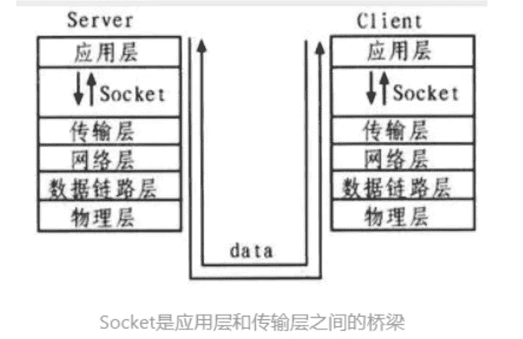

# 第六章 第 4 节 Java-操作系统-4

> 原文：[`www.nowcoder.com/tutorial/10070/17c749d64e4b468abed50da18adf97c7`](https://www.nowcoder.com/tutorial/10070/17c749d64e4b468abed50da18adf97c7)

#### 1.16 进程切换为什么比线程更消耗资源？

**参考回答**

进程切换时需要**刷新 TLB**并获取新的地址空间，然后切换硬件上下文和内核栈；线程切换时只需要切换硬件上下文和内核栈。

**答案解析**

**进程是程序的动态表现。** 一个程序进行起来后，会使用很多资源，比如使用寄存器，内存，文件等。每当切换进程时，必须要考虑保存当前进程的状态。状态包括存放在内存中的程序的代码和数据，它的栈、通用目的寄存器的内容、程序计数器、环境变量以及打开的文件描述符的集合，这个状态叫做上下文（Context）。可见，想要切换进程，保存的状态还不少。不仅如此，由于虚拟内存机制，进程切换时需要**刷新 TLB**并获取新的地址空间。

线程存在于进程中，一个进程可以有一个或多个线程。**线程是运行在进程上下文中的逻辑流**，这个线程可以独立完成一项任务。同样线程有自己的上下文，包括唯一的整数线程 ID， 栈、栈指针、程序计数器、通用目的寄存器和条件码。**可以理解为线程上下文是进程上下文的子集。**

**由于保存线程的上下文明显比进程的上下文小，因此系统切换线程时，必然开销更小。**

#### 1.17 介绍一下进程之间的通信。

**参考回答**

为了提高计算机系统的效率．增强计算机系统内各种硬件的并行操作能力．操作系统要求程序结构必须适应并发处理的需要．为此引入了进程的概念。而进程并行时，需要考虑进程间的通信，进程间通信主要有以下几种方式：匿名管道、命名管道、信号、消息队列、共享内存、信号量、Socket。

1.  匿名管道：管道是一种半双工的通信方式，数据只能单向流动，而且只能在具有亲缘关系的进程间使用。进程的亲缘关系通常是指父子进程关系。

```cpp
#include <stdio.h>
#include <unistd.h>
#include <stdlib.h>
#include <string.h>
#include <sys/wait.h>

int pipe_default[2];

int main()
{
  pid_t pid;
  char buffer[32];

  memset(buffer, 0, 32);
  if(pipe(pipe_default) < 0)
  {
    printf("Failed to create pipe!\n");
    return 0;
  }

  if(0 == (pid = fork()))
  {
    close(pipe_default[1]); //关闭写端
    sleep(2);
    if(read(pipe_default[0], buffer, 32) > 0)
    {
      printf("[Client] Receive data from server: %s \n", buffer);
    }
    close(pipe_default[0]);
   }
  else
  {
    close(pipe_default[0]);  //关闭读端
    char msg[32]="== hello world ==";
    if(-1 != write(pipe_default[1], msg, strlen(msg)))
    {
      printf("[Server] Send data to client: %s \n",msg);
    }
    close(pipe_default[1]);
    waitpid(pid, NULL, 0);
  }
  return 1;
}
```

2.  有名管道

    匿名管道，由于没有名字，只能用于亲缘关系的进程间通信。为了克服这个缺点，提出了有名管道(FIFO)。

    有名管道不同于匿名管道之处在于它提供了一个路径名与之关联，**以有名管道的文件形式存在于文件系统中**，这样，**即使与有名管道的创建进程不存在亲缘关系的进程，只要可以访问该路径，就能够彼此通过有名管道相互通信**，因此，通过有名管道不相关的进程也能交换数据。值的注意的是，有名管道严格遵循**先进先出(first in first out)** ,对匿名管道及有名管道的读总是从开始处返回数据，对它们的写则把数据添加到末尾。它们不支持诸如 lseek()等文件定位操作。**有名管道的名字存在于文件系统中，内容存放在内存中。**

3.  信号

*   信号是 Linux 系统中用于进程间互相通信或者操作的一种机制，信号可以在任何时候发给某一进程，而无需知道该进程的状态。
*   如果该进程当前并未处于执行状态，则该信号就有内核保存起来，知道该进程回复执行并传递给它为止。
*   如果一个信号被进程设置为阻塞，则该信号的传递被延迟，直到其阻塞被取消是才被传递给进程。

以下列出几个常用的信号：

| 信号 | 描述 |
| --- | --- |
| SIGHUP | 当用户退出终端时，由该终端开启的所有进程都退接收到这个信号，默认动作为终止进程。 |
| SIGINT | 程序终止(interrupt)信号, 在用户键入 INTR 字符(通常是`Ctrl+C`)时发出，用于通知前台进程组终止进程。 |
| SIGQUIT | 和`SIGINT`类似, 但由 QUIT 字符(通常是`Ctrl+\`)来控制. 进程在因收到`SIGQUIT`退出时会产生`core`文件, 在这个意义上类似于一个程序错误信号。 |
| SIGKILL | 用来立即结束程序的运行. **本信号不能被阻塞、处理和忽略**。 |
| SIGTERM | 程序结束(terminate)信号, 与`SIGKILL`不同的是该信号可以被阻塞和处理。通常用来要求程序自己正常退出。 |
| SIGSTOP | 停止(stopped)进程的执行. 注意它和 terminate 以及 interrupt 的区别:该进程还未结束, 只是暂停执行. **本信号不能被阻塞, 处理或忽略**. |

代码示例：

下面的代码收到程序退出信号后会执行用户定义的信号处理函数来替代系统默认的处理程序。

```cpp
#include<stdlib.h>
#include<stdio.h>
#include<signal.h>
#include<sys/types.h>
#include<unistd.h>

void sig_handle(int sig) {
    printf("received signal: %d, quit.\n", sig);
    exit(0);
}

int main () {
    signal(SIGINT, sig_handle);
    signal(SIGKILL, sig_handle);
    signal(SIGSEGV, sig_handle);
    signal(SIGTERM, sig_handle);

     int i = 0;
     while (1) {
         printf("%d\n", ++i);
         sleep(2);
     }

     printf("main quit.");

     return 0;
}
```

运行结果：

```cpp
1
2
received signal: 15, quit.
```

4.  消息队列

*   消息队列是**存放在内核中的消息链表**，每个消息队列由消息队列标识符表示。
*   与管道（无名管道：只存在于内存中的文件；命名管道：存在于实际的磁盘介质或者文件系统）不同的是消息队列**存放在内核中**，只有在内核重启(即，操作系统重启)或者显示地删除一个消息队列时，该消息队列才会被真正的删除。
*   另外与管道不同的是，消息队列在某个进程往一个队列写入消息之前，并**不需要另外某个进程在该队列上等待消息的到达**。

> **消息队列特点总结：**
> 
> （1）消息队列是消息的链表,具有特定的格式,存放在内存中并由消息队列标识符标识.
> 
> （2）消息队列允许一个或多个进程向它写入与读取消息.
> 
> （3）管道和消息队列的通信数据都是先进先出的原则。
> 
> （4）消息队列可以实现消息的随机查询,消息不一定要以先进先出的次序读取,也可以按消息的类型读取.比 FIFO 更有优势。
> 
> （5）消息队列克服了信号承载信息量少，管道只能承载无格式字 节流以及缓冲区大小受限等缺。
> 
> （6）目前主要有两种类型的消息队列：POSIX 消息队列以及 System V 消息队列，系统 V 消息队列目前被大量使用。系统 V 消息队列是随内核持续的，只有在内核重起或者人工删除时，该消息队列才会被删除。

5.  共享内存

    进程间本身的内存是相互隔离的，而共享内存机制相当于给两个进程开辟了一块二者均可访问的内存空间，这时，两个进程便可以共享一些数据了。但是，多进程同时占用资源会带来一些意料之外的情况，这时，我们往往会采用上述的信号量来控制多个进程对共享内存空间的访问。

    ```cpp
    #include <iostream>
    #include <stdlib.h>
    #include <string.h>
    #include <sys/shm.h>
    #include <sys/ipc.h>
    #include <unistd.h>

    using namespace std;
    int main()
    {
      char *shmaddr;
      char *shmaddread;
      char str[]="Hello, I am a processing. \n";
      int shmid;

      key_t key = ftok(".",1);
      pid_t pid1 = fork();
      if(pid1 == -1){
         cout << "Fork error. " << endl;
         exit(1);
      }
      else if(pid1 == 0){
         //子进程
         shmid = shmget(key,1024,IPC_CREAT | 0600);
         shmaddr = (char*)shmat(shmid, NULL, 0);
                    strcpy(shmaddr, str);
         cout << "[Writer] write: " << shmaddr << endl;
         shmdt(shmaddr);
      }
      else
      {
         //父进程
         pid_t pid2 = fork();
         if(pid2 == -1){
           cout << "Fork error. " << endl;
           exit(1);
        }
        else if(pid2 == 0){
           //子进程
           sleep(2);
           shmid = shmget(key,1024,IPC_CREAT | 0600);
           shmaddread = (char*)shmat(shmid, NULL, 0);        
           cout << "[Reader] read: " << shmaddread << endl;
           shmdt(shmaddread);
        }
      }
      sleep(3);
      return 0;
    }
    ```

6.  信号量

    信号量主要用来解决进程和线程间并发执行时的同步问题，进程同步是并发进程为了完成共同任务采用某个条件来协调他们的活动，这是进程之间发生的一种直接制约关系。

    对信号量的操作分为 P 操作和 V 操作，P 操作是将信号量的值减一，V 操作是将信号量的值加一。当信号量的值小于等于 0 之后，再进行 P 操作时，当前进程或线程会被阻塞，直到另一个进程或线程执行了 V 操作将信号量的值增加到大于 0 之时。锁也是用的这种原理实现的。

    信号量我们需要定义信号量的数量，设定初始值，以及决定何时进行 PV 操作。

    ```cpp
     #include <unistd.h>  
     #include <sys/types.h>  
     #include <sys/stat.h>  
     #include <fcntl.h>  
     #include <stdlib.h>  
     #include <stdio.h>  
     #include <string.h>  
     #include <sys/sem.h>
     #define KEY (key_t)15030110070
     #define N 20

     static void p(int semid ,int semNum);  
     static void v(int semid ,int semNum);

     union semun {  
         int val;  
         struct semid_ds *buf;  
         ushort *array;  
     };  

     int main(int argc ,char* argv[])
     {
       int i;
       int semid;

       semid = semget(KEY,3,IPC_CREAT|0660);  
       union semun arg[3];  
       arg[0].val = 1;                     //mutex  [0]  对缓冲区进行操作的互斥信号量
       arg[1].val = N;               //empty  [1]  缓冲区空位个数 n
       arg[2].val = 0;                     //full [2]  产品个数

         for(i=0;i<3;i++)  
             semctl(semid,i,SETVAL,arg[i]);  

       pid_t p1,p2;
       if((p1=fork()) == 0)
       {
         //子进程 1，消费者
         while(1)
         {
           printf("消费者 1 等待中...\n");
           sleep(2);
           int product = rand() % 2 + 1;
           for(int i = 0; i < product; i++)
           {
             p(semid ,2);    //消费
             p(semid ,0);    //加锁
             printf(" [消费者 1] 消费产品 1\. 剩余：  %d\n", semctl(semid, 2, GETVAL, NULL));
             v(semid ,0);    //开锁
             v(semid ,1);    //释放空位
           }
           sleep(2);
         }
         }
       else
       {
         if((p2=fork()) == 0)
         {
           //子进程 2，消费者
           while(1)
           {
             printf("消费者 2 等待中...\n");
             sleep(2);
             int product = rand() % 2 + 1;
             for(int i = 0; i < product; i++)
             {
               p(semid ,2);    //消费
               p(semid ,0);    //加锁
               printf(" [消费者 2] 消费产品 1\. 剩余：  %d\n", semctl(semid, 2, GETVAL, NULL));
               v(semid ,0);    //开锁
               v(semid ,1);    //释放空位
             }
             sleep(2);
           }
         }
         else
         {
           //父进程，生产者
           while(1)
           {
             printf("生产者开始生产...\n");
             int product = rand() % 5 + 1;

             for(int i = 0; i < product; i++)
             {
               p(semid ,1);    //占用空位
               p(semid ,0);    //加锁
               printf(" [生产者] 生产产品 1\. 剩余：  %d\n", semctl(semid, 2, GETVAL, NULL) + 1);  
               v(semid ,0);    //开锁
               v(semid, 2);    //生产
             }
             sleep(2);
           }
         }
       }
       return 0;
     }

     /* p 操作 */  
     void p(int semid ,int semNum)
     {  
         struct sembuf sb;  
         sb.sem_num = semNum;  
         sb.sem_op = -1;  
         sb.sem_flg = SEM_UNDO;  
         semop(semid, &sb, 1);  
     }  

     /* v 操作 */  
     void v(int semid ,int semNum)
     {  
         struct sembuf sb;  
         sb.sem_num = semNum;  
         sb.sem_op = 1;  
         sb.sem_flg = SEM_UNDO;  
         semop(semid, &sb, 1);  
     }  
    ```

7.  socket

    

    套接字可以看做是：不同主机之间的进程进行双向通信的端点。（套接字 = IP 地址 + 端口号）