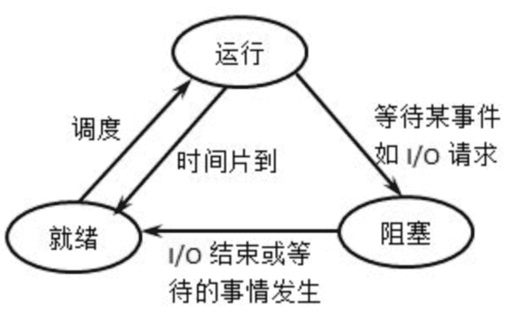
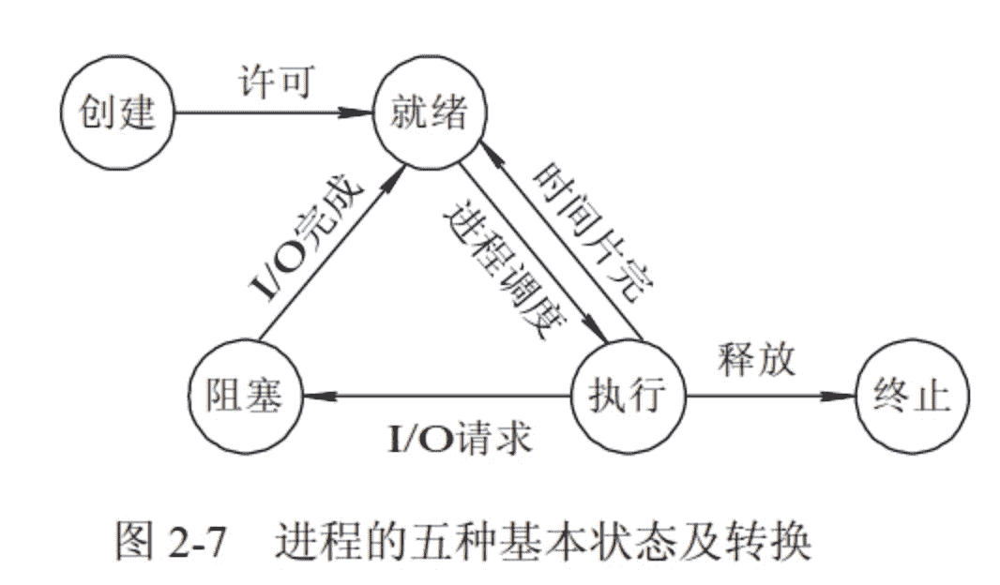

# 第六章 第 6 节 Java-操作系统-6

> 原文：[`www.nowcoder.com/tutorial/10070/b9c3d3e7eb0742ccbe43ef7590c010f9`](https://www.nowcoder.com/tutorial/10070/b9c3d3e7eb0742ccbe43ef7590c010f9)

#### 1.21 请介绍线程之间的通信方式。

**参考回答**

1.  锁机制：包括互斥锁、条件变量、读写锁互斥锁提供了以排他方式防止数据结构被并发修改的方法。读写锁允许多个线程同时读共享数据，而对写操作是互斥的。条件变量可以以原子的方式阻塞进程，直到某个特定条件为真为止。对条件的测试是在互斥锁的保护下进行的。条件变量始终与互斥锁一起使用。
2.  信号量机制(Semaphore)：包括无名线程信号量和命名线程信号量
3.  信号机制(Signal)：类似进程间的信号处理线程间的通信目的主要是用于线程同步，所以线程没有像进程通信中的用于数据交换的通信机制。

#### 1.22 说一说进程的状态。

**参考回答**

1.  进程的 3 种基本状态：**运行、就绪和阻塞。**

（1）就绪：当一个进程获得了除处理机以外的一切所需资源，一旦得到处理机即可运行，则称此进程处于就绪状态。就绪进程可以按多个优先级来划分队列。例如，当一个进程由于时间片用完而进入就绪状态时，排入低优先级队列；当进程由 I／O 操作完成而进入就绪状态时，排入高优先级队列。

（2）运行：当一个进程在处理机上运行时，则称该进程处于运行状态。处于此状态的进程的数目小于等于处理器的数目，对于单处理机系统，处于运行状态的进程只有一个。在没有其他进程可以执行时（如所有进程都在阻塞状态），通常会自动执行系统的空闲进程。

（3）阻塞：也称为等待或睡眠状态，一个进程正在等待某一事件发生（例如请求 I/O 而等待 I/O 完成等）而暂时停止运行，这时即使把处理机分配给进程也无法运行，故称该进程处于阻塞状态。

其转移图如下：



2.  进程的五种状态

    **创建状态**：进程在创建时需要申请一个空白 PCB，向其中填写控制和管理进程的信息，完成资源分配。如果创建工作无法完成，比如资源无法满足，就无法被调度运行，把此时进程所处状态称为创建状态

    **就绪状态**：进程已经准备好，已分配到所需资源，只要分配到 CPU 就能够立即运行

    **执行状态**：进程处于就绪状态被调度后，进程进入执行状态

    **阻塞状态**：正在执行的进程由于某些事件（I/O 请求，申请缓存区失败）而暂时无法运行，进程受到阻塞。在满足请求时进入就绪状态等待系统调用

    **终止状态**：进程结束，或出现错误，或被系统终止，进入终止状态。无法再执行



#### 1.23 CPU 调度的最小单位是什么？线程需要 CPU 调度吗？

**参考回答**

1.  进程是 CPU 分配资源的最小单位，线程是 CPU 调度的最小单位。

2.  线程是比进程更小的能独立运行的基本单位，需要通过 CPU 调度来切换上下文，达到并发的目的。

#### 1.24 进程之间共享内存的通信方式有什么好处？

**参考回答**

采用共享内存通信的一个显而易见的好处是效率高，因为进程可以直接读写内存，而不需要任何数据的拷贝。对于像管道和消息队列等通信方式，则需要在内核和用户空间进行四次的数据拷贝，而共享内存则只拷贝两次数据：一次从输入文件到共享内存区，另一次从共享内存区到输出文件。

实际上，进程之间在共享内存时，并不总是读写少量数据后就解除映射，有新的通信时，再重新建立共享内存区域。而是保持共享区域，直到通信完毕为止，这样，数据内容一直保存在共享内存中，并没有写回文件。共享内存中的内容往往是在解除映射时才写回文件的。因此，采用共享内存的通信方式效率是非常高的。

#### 1.25 如何杀死一个进程？

**参考回答**

1.  杀死父进程并不会同时杀死子进程：每个进程都有一个父进程。可以使用 `pstree` 或 `ps` 工具来观察这一点。

    ```cpp
    # 启动两个虚拟进程
    $ sleep 100 &
    $ sleep 101 &

    $ pstree -p
    init(1)-+
            |-bash(29051)-+-pstree(29251)
                          |-sleep(28919)
                          `-sleep(28964)

    $ ps j -A
     PPID   PID  PGID   SID TTY      TPGID STAT   UID   TIME COMMAND
        0     1     1     1 ?           -1 Ss       0   0:03 /sbin/init
    29051  1470  1470 29051 pts/2     2386 SN    1000   0:00 sleep 100
    29051  1538  1538 29051 pts/2     2386 SN    1000   0:00 sleep 101
    29051  2386  2386 29051 pts/2     2386 R+    1000   0:00 ps j -A
        1 29051 29051 29051 pts/2     2386 Ss    1000   0:00 -bash

    ```

    调用 `ps` 命令可以显示 PID（进程 ID） 和 PPID（父进程 ID）。

    杀死父进程后，子进程将会成为孤儿进程，而 init 进程将重新成为它的父进程。

2.  杀死进程组或会话中的所有进程

    ```cpp
    $ kill -SIGTERM -- -19701
    ```

    这里用一个负数 `-19701` 向进程组发送信号。如果传递的是一个正数，这个数将被视为进程 ID 用于终止进程。如果传递的是一个负数，它被视为 PGID，用于终止整个进程组。负数来自系统调用的直接定义。

    杀死会话中的所有进程与之完全不同。即使是具有会话 ID 的系统，例如 Linux，也没有提供系统调用来终止会话中的所有进程。需要遍历 `/proc` 输出的进程树，收集所有的 SID，然后一一终止进程。

    Pgrep 实现了遍历、收集并通过会话 ID 杀死进程的算法。可以使用以下命令：

    ```cpp
    pkill -s <SID>
    ```

#### 1.26 说一说 kill 的原理。

**参考回答**

*   kill 命令的执行原理是这样的，kill 命令会向操作系统内核发送一个信号（多是终止信号）和目标进程的 PID，然后系统内核根据收到的信号类型，对指定进程进行相应的操作。kill 命令的基本格式如下：

    [root@localhost ~]# kill [信号] PID

*   kill 命令是按照 PID 来确定进程的，所以 kill 命令只能识别 PID，而不能识别进程名。

*   kill 命令只是“发送”一个信号，因此，只有当信号被程序成功“捕获”，系统才会执行 kill 命令指定的操作；反之，如果信号被“封锁”或者“忽略”，则 kill 命令将会失效。

#### 1.27 介绍下你知道的锁。

**参考回答**

1.  悲观锁

悲观锁并不是某一个锁，是一个锁类型，无论是否并发竞争资源，都会锁住资源，并等待资源释放下一个线程才能获取到锁。 这明显很悲观，所以就叫悲观锁。这明显可以归纳为一种策略，只要符合这种策略的锁的具体实现，都是悲观锁的范畴。

2.  乐观锁

与悲观锁相对的，乐观锁也是一个锁类型。当线程开始竞争资源时，不是立马给资源上锁，而是进行一些前后值比对，以此来操作资源。例如常见的 CAS 操作，就是典型的乐观锁。示例如下

```cpp
int cas(long *addr, long old, long new) {
    /* 原子执行 */
    if(*addr != old)
        return 0;
    *addr = new;
    return 1;
}
```

3.  自旋锁

自旋锁是一种基础的同步原语，用于保障对共享数据的互斥访问。与互斥锁的相比，在获取锁失败的时候不会使得线程阻塞而是一直自旋尝试获取锁。当线程等待自旋锁的时候，CPU 不能做其他事情，而是一直处于轮询忙等的状态。

自旋锁主要适用于被持有时间短，线程不希望在重新调度上花过多时间的情况。实际上许多其他类型的锁在底层使用了自旋锁实现，例如多数互斥锁在试图获取锁的时候会先自旋一小段时间，然后才会休眠。如果在持锁时间很长的场景下使用自旋锁，则会导致 CPU 在这个线程的时间片用尽之前一直消耗在无意义的忙等上，造成计算资源的浪费。

```cpp
// 用户空间用 atomic_flag 实现自旋互斥
#include <thread>
#include <vector>
#include <iostream>
#include <atomic>

std::atomic_flag lock = ATOMIC_FLAG_INIT;

void f(int n)
{
    for (int cnt = 0; cnt < 100; ++cnt) {
        while (lock.test_and_set(std::memory_order_acquire))  // 获得锁
             ; // 自旋
        std::cout << "Output from thread " << n << '\n';
        lock.clear(std::memory_order_release);               // 释放锁
    }
}

int main()
{
    std::vector<std::thread> v;
    for (int n = 0; n < 10; ++n) {
        v.emplace_back(f, n);
    }
    for (auto& t : v) {
        t.join();
    }
}
```

4.  公平锁

多个线程竞争同一把锁，如果依照先来先得的原则，那么就是一把公平锁。

5.  非公平锁

多个线程竞争锁资源，抢占锁的所有权。

6.  共享锁

多个线程可以共享这个锁的拥有权。一般用于数据的读操作，防止数据被写修改。共享锁的代码示例如下：

```cpp
    #include <shared_mutex>
    #include <mutex>
    #include <iostream>
    #include <thread>
    #include <chrono>

    std::shared_mutex test_lock;

    std::mutex cout_lock;

    int arr[3] = {11, 22, 33};

    void unique_lock_demo(int id)
    {
        std::unique_lock lock{test_lock};

        for(int i =0; i < 3; i++)
        {
                arr[i] = i + 100 * id;
        }

        for(int i = 0; i < 3; i++)
        {
            std::unique_lock pl(cout_lock);
            std::cout << "In unique: " << id << ": " << arr[i] << std::endl;
            pl.unlock();
            std::this_thread::sleep_for(std::chrono::seconds(1));
        }
    }

    void shared_lock_demo(int id)
    {
        std::shared_lock lock{test_lock};

        for(int i = 0; i < 3; i++)
        {
            std::unique_lock pl(cout_lock);
            std::cout << "In shared " << id << ": " << arr[i] << std::endl;
            pl.unlock();
            std::this_thread::sleep_for(std::chrono::seconds(1));
        }
    }

    int main()
    {

       std::thread t3(unique_lock_demo,3);
       std::thread t4(unique_lock_demo,4);
       std::thread t1(shared_lock_demo,1);
       std::thread t2(shared_lock_demo,2);

       t1.join();
       t2.join();
       t3.join();
       t4.join();
       return 0;
    }
```

输出为：

```cpp
    In unique: 3: 300
    In unique: 3: 301
    In unique: 3: 302
    In shared 1: 300
    In shared 2: 300
    In shared 1: 301
    In shared 2: 301
    In shared 1: 302
    In shared 2: 302
    In unique: 4: 400
    In unique: 4: 401
    In unique: 4: 402
```

从这个输出可以看出：

*   如果一个线程已经获取了*共享锁*，则其他任何线程都无法获取*互斥锁*，但是可以获取*共享锁*。
*   从这个输出可以看出，验证了如果一个线程已经获取了*互斥锁*，则其他线程都无法获取该锁。

7.  死锁

死锁是指两个或两个以上的进程在执行过程中，由于竞争资源或者由于彼此通信而造成的一种阻塞的现象，若无外力作用，它们都将无法推进下去。此时称系统处于死锁状态或系统产生了死锁，这些永远在互相等待的进程称为死锁进程。

```cpp
mutex;   //代表一个全局互斥对象
void  A()
{
    mutex.lock();
    //这里操作共享数据
    B();  //这里调用 B 方法
    mutex.unlock();
    return;
}
void  B()
{
    mutex.lock();
    //这里操作共享数据
    mutex.unlock();
    return;
}
```