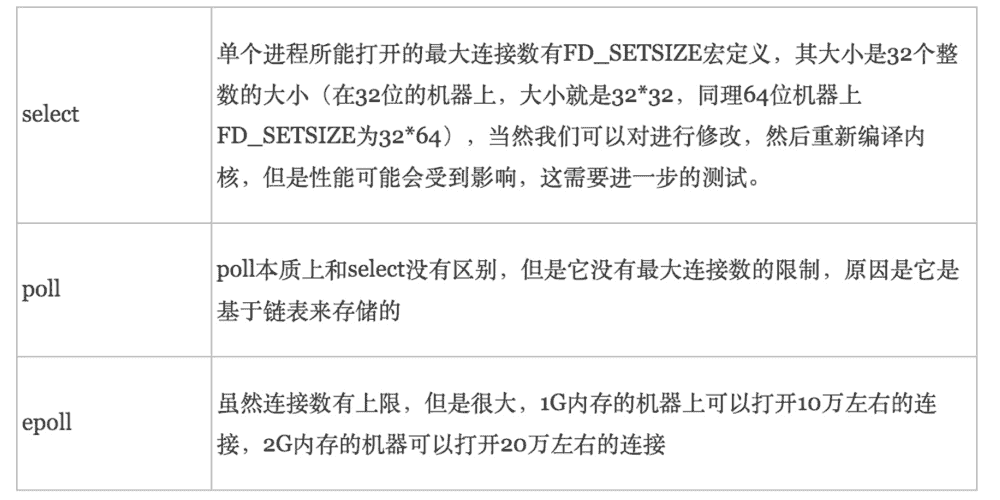
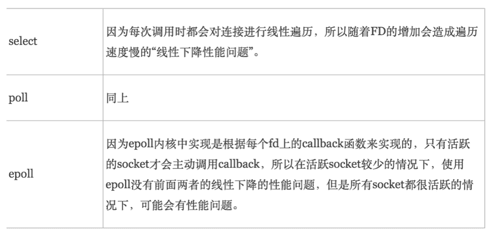
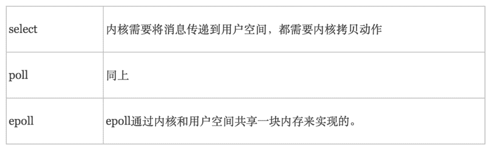

# 第六章 第 7 节 Java-操作系统-7

> 原文：[`www.nowcoder.com/tutorial/10070/33c52e7c7ad34abdb4f2eda9a7c28045`](https://www.nowcoder.com/tutorial/10070/33c52e7c7ad34abdb4f2eda9a7c28045)

#### 1.28 什么情况下会产生死锁？

**参考回答**

如果在计算机系统中同时具备下面四个必要条件时，那么会发生死锁。换句话说，只要下面四个条件有一个不具备，系统就不会出现死锁。

1.  互斥条件。即某个资源在一段时间内只能由一个进程占有，不能同时被两个或两个以上的进程占有。这种独占资源如 CD-ROM 驱动器，打印机等等，必须在占有该资源的进程主动释放它之后，其它进程才能占有该资源。这是由资源本身的属性所决定的。如独木桥就是一种独占资源，两方的人不能同时过桥。

    ```cpp
    #include <list>
    #include <mutex>
    #include <algorithm>

    std::list<int> some_list;    // 1
    std::mutex some_mutex;    // 2

    void add_to_list(int new_value)
    {
      std::lock_guard<std::mutex> guard(some_mutex);    // 3
      some_list.push_back(new_value);
    }

    bool list_contains(int value_to_find)
    {
      std::lock_guard<std::mutex> guard(some_mutex);    // 4
      return std::find(some_list.begin(),some_list.end(),value_to_find) != some_list.end();
    }
    ```

    代码中有一个全局变量①，这个全局变量被一个全局的互斥量保护②。add_to_list()③和 list_contains()④函数中使用`std::lock_guard<std::mutex>`，使得这两个函数中对数据的访问是互斥的：list_contains()不可能看到正在被 add_to_list()修改的列表。

2.  不剥夺条件。进程所获得的资源在未使用完毕之前，资源申请者不能强行地从资源占有者手中夺取资源，而只能由该资源的占有者进程自行释放。如过独木桥的人不能强迫对方后退，也不能非法地将对方推下桥，必须是桥上的人自己过桥后空出桥面（即主动释放占有资源），对方的人才能过桥。

3.  请求和保持条件。进程至少已经占有一个资源，但又申请新的资源；由于该资源已被另外进程占有，此时该进程阻塞；但是，它在等待新资源之时，仍继续占用已占有的资源。还以过独木桥为例，甲乙两人在桥上相遇。甲走过一段桥面（即占有了一些资源），还需要走其余的桥面（申请新的资源），但那部分桥面被乙占有（乙走过一段桥面）。甲过不去，前进不能，又不后退；乙也处于同样的状况。

4.  循环等待条件。存在一个进程等待序列{P1，P2，...，Pn}，其中 P1 等待 P2 所占有的某一资源，P2 等待 P3 所占有的某一源，......，而 Pn 等待 P1 所占有的的某一资源，形成一个进程循环等待环。就像前面的过独木桥问题，甲等待乙占有的桥面，而乙又等待甲占有的桥面，从而彼此循环等待。

    ```cpp
    std::mutex m;
    void f()
    {
    // ....
    std::lock_guard lock(m); // 1 子线程锁住互斥量 m
    // ...
    }
    int main()
    {
    std::thread t(f);
    std::lock_guard lock(m); // 2 主线程锁住互斥量 m
    // ...
    t.join(); // 3 等待子线程结束
    return 0;
    }
    ```

    上述过程可能导致在 2 处上锁，然后子线程在 1 处发生阻塞，最后主线程在 3 处一直等待子线程结束，无穷等待下去。

上面提到的这四个条件在死锁时会同时发生。也就是说，只要有一个必要条件不满足，则死锁就可以排除。

#### 1.29 说一说你对自旋锁的理解。

**参考回答**

旋锁的定义：当一个线程尝试去获取某一把锁的时候，如果这个锁此时已经被别人获取(占用)，那么此线程就无法获取到这把锁，该线程将会等待，间隔一段时间后会再次尝试获取。这种采用循环加锁 -> 等待的机制被称为`自旋锁(spinlock)`。

**自旋锁有以下特点**

*   用于临界区互斥
*   在任何时刻最多只能有一个执行单元获得锁
*   要求持有锁的处理器所占用的时间尽可能短
*   等待锁的线程进入忙循环

**自旋锁存在的问题**

*   如果某个线程持有锁的时间过长，就会导致其它等待获取锁的线程进入循环等待，消耗 CPU。使用不当会造成 CPU 使用率极高。
*   无法满足等待时间最长的线程优先获取锁。不公平的锁就会存在“线程饥饿”问题。

**自旋锁的优点**

*   自旋锁不会使线程状态发生切换，一直处于用户态，即线程一直都是 active 的；不会使线程进入阻塞状态，减少了不必要的上下文切换，执行速度快
*   非自旋锁在获取不到锁的时候会进入阻塞状态，从而进入内核态，当获取到锁的时候需要从内核态恢复，需要线程上下文切换。（线程被阻塞后便进入内核（Linux）调度状态，这个会导致系统在用户态与内核态之间来回切换，严重影响锁的性能）

**自旋锁与互斥锁的区别**

*   自旋锁与互斥锁都是为了实现保护资源共享的机制。
*   无论是自旋锁还是互斥锁，在任意时刻，都最多只能有一个保持者。
*   获取互斥锁的线程，如果锁已经被占用，则该线程将进入睡眠状态；获取自旋锁的线程则不会睡眠，而是一直循环等待锁释放。

#### 1.30 说一说你对悲观锁的理解。

**参考回答**

悲观锁总是假设最坏的情况，每次去拿数据的时候都认为别人会修改，所以每次在拿数据的时候都会上锁，这样别人想拿这个数据就会阻塞直到它拿到锁（**共享资源每次只给一个线程使用，其它线程阻塞，用完后再把资源转让给其它线程**）。传统的关系型数据库里边就用到了很多这种锁机制，比如行锁，表锁等，读锁，写锁等，都是在做操作之前先上锁。

#### 1.31 说一说你对乐观锁的理解。

**参考回答**

乐观锁总是假设最好的情况，每次去拿数据的时候都认为别人不会修改，所以不会上锁，但是在更新的时候会判断一下在此期间别人有没有去更新这个数据，可以使用版本号机制和 CAS 算法实现。**乐观锁适用于多读的应用类型，这样可以提高吞吐量**，像数据库提供的类似于**write_condition 机制**，其实都是提供的乐观锁。

#### 1.32 CAS 在什么地方用到过吗？

**参考回答**

*   CAS 是英文单词**CompareAndSwap**的缩写，中文意思是：比较并替换。CAS 需要有 3 个操作数：内存地址 V，旧的预期值 A，即将要更新的目标值 B。CAS 指令执行时，当且仅当内存地址 V 的值与预期值 A 相等时，将内存地址 V 的值修改为 B，否则就什么都不做。整个比较并替换的操作是一个原子操作。

*   高并发环境下，对同一个数据的**并发读**（两边都读出余额是 100）与**并发写**（一个写回 28，一个写回 38）导致的数据一致性问题。

    解决方案是在 set 写回的时候，加上初始状态的条件 compare，只有初始状态不变时，才允许 set 写回成功，这是一种常见的降低读写锁冲突，保证数据一致性的方法。

#### 1.33 谈谈 IO 多路复用。

**参考回答**

1.  IO 多路复用是一种同步 IO 模型，实现一个线程可以监视多个文件句柄；一旦某个文件句柄就绪，就能够通知应用程序进行相应的读写操作；没有文件句柄就绪时会阻塞应用程序，交出 cpu。多路是指网络连接，复用指的是同一个线程。

2.  IO 多路复用有三种实现方式:select, poll, epoll

    (1)select：时间复杂度 O(n)，它仅仅知道了，有 I/O 事件发生了，却并不知道是哪那几个流（可能有一个，多个，甚至全部），只能无差别轮询所有流，找出能读出数据，或者写入数据的流，对他们进行操作。所以**select 具有 O(n)的无差别轮询复杂度**，同时处理的流越多，无差别轮询时间就越长。

    ```cpp
     int select (int n, fd_set *readfds, fd_set *writefds, fd_set *exceptfds, struct timeval *timeout);
    ```

    select 函数监视的文件描述符分 3 类，分别是 writefds、readfds、和 exceptfds。调用后 select 函数会阻塞，直到有描述副就绪（有数据 可读、可写、或者有 except），或者超时（timeout 指定等待时间，如果立即返回设为 null 即可），函数返回。当 select 函数返回后，可以 通过遍历 fdset，来找到就绪的描述符。

    select 目前几乎在所有的平台上支持，其良好跨平台支持也是它的一个优点。select 的一 个缺点在于单个进程能够监视的文件描述符的数量存在最大限制，在 Linux 上一般为 1024，可以通过修改宏定义甚至重新编译内核的方式提升这一限制，但是这样也会造成效率的降低。

(2)poll：时间复杂度 O(n)，poll 本质上和 select 没有区别，它将用户传入的数组拷贝到内核空间，然后查询每个 fd 对应的设备状态， **但是它没有最大连接数的限制**，原因是它是基于链表来存储的。

```cpp
int poll (struct pollfd *fds, unsigned int nfds, int timeout);
```

不同与 select 使用三个位图来表示三个 fdset 的方式，poll 使用一个 pollfd 的指针实现。

```cpp
struct pollfd {
    int fd; /* file descriptor */
    short events; /* requested events to watch */
    short revents; /* returned events witnessed */
};
```

pollfd 结构包含了要监视的 event 和发生的 event，不再使用 select“参数-值”传递的方式。同时，pollfd 并没有最大数量限制（但是数量过大后性能也是会下降）。 和 select 函数一样，poll 返回后，需要轮询 pollfd 来获取就绪的描述符。

(3)epoll：时间复杂度 O(1)，**epoll 可以理解为 event poll**，不同于忙轮询和无差别轮询，epoll 会把哪个流发生了怎样的 I/O 事件通知我们。所以说 epoll 实际上是**事件驱动（每个事件关联上 fd）** 的，此时对这些流的操作都是有意义的。

epoll 操作过程需要三个接口，分别如下：

```cpp
int epoll_create(int size)；//创建一个 epoll 的句柄，size 用来告诉内核这个监听的数目一共有多大
int epoll_ctl(int epfd, int op, int fd, struct epoll_event *event)；
int epoll_wait(int epfd, struct epoll_event * events, int maxevents, int timeout);
```

*   int epoll_create(int size)：创建一个 epoll 的句柄，size 用来告诉内核这个监听的数目一共有多大，这个参数不同于 select()中的第一个参数，给出最大监听的 fd+1 的值，参数 size 并不是限制了 epoll 所能监听的描述符最大个数，只是对内核初始分配内部数据结构的一个建议。当创建好 epoll 句柄后，它就会占用一个 fd 值，在 linux 下如果查看/proc/进程 id/fd/，是能够看到这个 fd 的，所以在使用完 epoll 后，必须调用 close()关闭，否则可能导致 fd 被耗尽。

*   int epoll_ctl(int epfd, int op, int fd, struct epoll_event *event)：函数是对指定描述符 fd 执行 op 操作。- epfd：是 epoll_create()的返回值。- op：表示 op 操作，用三个宏来表示：添加 EPOLL_CTL_ADD，删除 EPOLL_CTL_DEL，修改 EPOLL_CTL_MOD。分别添加、删除和修改对 fd 的监听事件。- fd：是需要监听的 fd（文件描述符）- epoll_event：是告诉内核需要监听什么事，

*   int epoll_wait(int epfd, struct epoll_event * events, int maxevents, int timeout)：等待 epfd 上的 io 事件，最多返回 maxevents 个事件。参数 events 用来从内核得到事件的集合，maxevents 告之内核这个 events 有多大，这个 maxevents 的值不能大于创建 epoll_create()时的 size，参数 timeout 是超时时间（毫秒，0 会立即返回，-1 将不确定，也有说法说是永久阻塞）。该函数返回需要处理的事件数目，如返回 0 表示已超时。

3.  select、poll、epoll 区别

*   支持一个进程所能打开的最大连接数



*   FD 剧增后带来的 IO 效率问题



*   消息传递方式



#### 1.34 谈谈 poll 和 epoll 的区别。

**参考回答**

1.  poll 将用户传入的数组拷贝到内核空间，然后查询每个 fd 对应的设备状态，如果设备就绪则在设备等待队列中加入一项并继续遍历，如果遍历完所有 fd 后没有发现就绪设备，则挂起当前进程，直到设备就绪或者主动超时，被唤醒后它又要再次遍历 fd。这个过程经历了多次无谓的遍历。

    它没有最大连接数的限制，原因是它是基于链表来存储的，但是同样有缺点：

    1.  `大量的 fd 的数组被整体复制于用户态和内核地址空间之间`，而不管这样的复制是不是有意义。
    2.  `poll 还有一个特点是“水平触发”`，如果报告了 fd 后，没有被处理，那么下次 poll 时会再次报告该 fd。
2.  epoll 是在 2.6 内核中提出的，是之前的 select 和 poll 的增强版本。相对于 select 和 poll 来说，epoll 更加灵活，没有描述符限制。epoll 使用一个文件描述符管理多个描述符，将用户关系的文件描述符的事件存放到内核的一个事件表中，这样在用户空间和内核空间的 copy 只需一次。

    epoll 支持水平触发和边缘触发，最大的特点在于边缘触发，它只告诉进程哪些 fd 刚刚变为就绪态，并且只会通知一次。还有一个特点是，epoll 使用“事件”的就绪通知方式，通过 epoll_ctl 注册 fd，一旦该 fd 就绪，内核就会采用类似 callback 的回调机制来激活该 fd，epoll_wait 便可以收到通知。其优点有：

    1.  没有最大并发连接的限制，能打开的 FD 的上限远大于 1024（1G 的内存上能监听约 10 万个端口）。

    2.  效率提升，不是轮询的方式，不会随着 FD 数目的增加效率下降。只有活跃可用的 FD 才会调用 callback 函数；即 Epoll 最大的优点就在于它只管你“活跃”的连接，而跟连接总数无关，因此在实际的网络环境中，Epoll 的效率就会远远高于 select 和 poll。

    3.  内存拷贝，利用 mmap()文件映射内存加速与内核空间的消息传递；即 epoll 使用 mmap 减少复制开销。

#### 1.35 谈谈 select 和 epoll 的区别。

**参考回答**

1.  select 函数监视的文件描述符分 3 类，分别是 writefds、readfds、和 exceptfds。调用后 select 函数会阻塞，直到有描述符就绪（有数据 可读、可写、或者有 except），或者超时（timeout 指定等待时间，如果立即返回设为 null 即可），函数返回。当 select 函数返回后，可以通过遍历 fdset，来找到就绪的描述符。

    select 目前几乎在所有的平台上支持，其良好跨平台支持也是它的一个优点。select 的一个缺点在于单个进程能够监视的文件描述符的数量存在最大限制，在 Linux 上一般为 1024，可以通过修改宏定义甚至重新编译内核的方式提升这一限制，但是这样也会造成效率的降低。

    内核需要传递消息到用户空间，需要内存拷贝

2.  相对于 select 和 poll 来说，epoll 更加灵活，没有描述符限制。epoll 使用一个文件描述符管理多个描述符，将用户关系的文件描述符的事件存放到内核的一个事件表中，这样在用户空间和内核空间的 copy 只需一次。

    epoll 能打开的 FD 的上限远大于 1024（1G 的内存上能监听约 10 万个端口）。

    效率提升，不是轮询的方式，不会随着 FD 数目的增加效率下降。只有活跃可用的 FD 才会调用 callback 函数；即 Epoll 最大的优点就在于它只管你“活跃”的连接，而跟连接总数无关，因此在实际的网络环境中，Epoll 的效率就会远远高于 select 和 poll。

#### 1.36 epoll 有哪两种模式？

**参考回答**

**epoll 对文件描述符的操作有两种模式：`LT（level trigger）和 ET（edge trigger）`。LT 模式是默认模式，LT 模式与 ET 模式的区别如下：**

LT 模式：当 epoll_wait 检测到描述符事件发生并将此事件通知应用程序，`应用程序可以不立即处理该事件`。下次调用 epoll_wait 时，会再次响应应用程序并通知此事件。

ET 模式：当 epoll_wait 检测到描述符事件发生并将此事件通知应用程序，`应用程序必须立即处理该事件`。如果不处理，下次调用 epoll_wait 时，不会再次响应应用程序并通知此事件。

1.  **LT 模式**

    `LT(level triggered)是缺省的工作方式，并且同时支持 block 和 no-block socket`。在这种做法中，内核告诉你一个文件描述符是否就绪了，然后你可以对这个就绪的 fd 进行 IO 操作。`如果你不作任何操作，内核还是会继续通知你的`。

2.  **ET 模式**

    `ET(edge-triggered)是高速工作方式，只支持 no-block socket`。在这种模式下，当描述符从未就绪变为就绪时，内核通过 epoll 告诉你。然后它会假设你知道文件描述符已经就绪，并且不会再为那个文件描述符发送更多的就绪通知，直到你做了某些操作导致那个文件描述符不再为就绪状态了(比如，你在发送，接收或者接收请求，或者发送接收的数据少于一定量时导致了一个 EWOULDBLOCK 错误）。`但是请注意，如果一直不对这个 fd 作 IO 操作(从而导致它再次变成未就绪)，内核不会发送更多的通知(only once)`。

    `ET 模式在很大程度上减少了 epoll 事件被重复触发的次数，因此效率要比 LT 模式高`。epoll 工作在 ET 模式的时候，`必须使用非阻塞套接口`，以避免由于一个文件句柄的阻塞读/阻塞写操作把处理多个文件描述符的任务饿死。