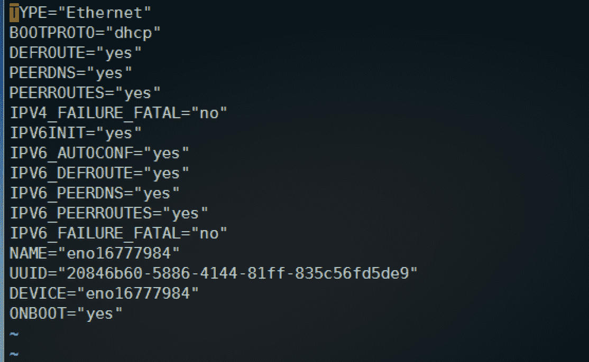
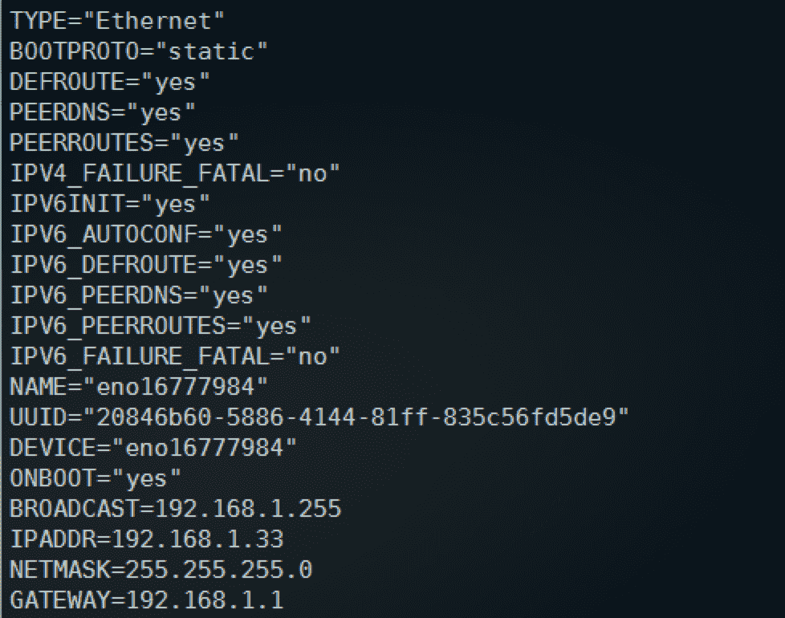
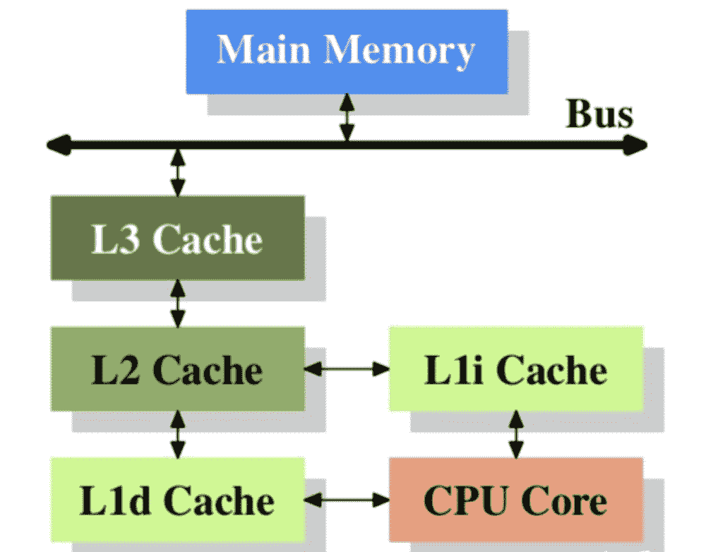

# 第六章 第 9 节 Java-操作系统-9

> 原文：[`www.nowcoder.com/tutorial/10070/7ca41570f8a849d485082260d01d16d4`](https://www.nowcoder.com/tutorial/10070/7ca41570f8a849d485082260d01d16d4)

#### 1.42 操作系统的地址有几种，请具体说明。

**参考回答**

操作系统有物理地址、逻辑地址、线性地址（也叫虚拟地址）三种地址

1.  物理地址

    在存储器里以字节为单位存储信息，为正确地存放或取得信息，每一个字节单元给以一个唯一的存储器地址，称为物理地址（Physical Address），又叫实际地址或绝对地址。

    地址从 0 开始编号，顺序地每次加 1，因此存储器的物理地址空间是呈线性增长的。它是用二进制数来表示的，是无符号整数，书写格式为十六进制数。它是出现在 CPU 外部地址总线上的寻址物理内存的地址信号，是地址变换的最终结果。用于内存芯片级的单元寻址，与处理器和 CPU 连接的地址总线相对应。

2.  逻辑地址

    逻辑地址是指在计算机体系结构中是指应用程序角度看到的内存单元（memory cell）、存储单元（storage element）、网络主机（network host）的地址。 逻辑地址往往不同于物理地址（physical address），通过地址翻译器（address translator）或映射函数可以把逻辑地址转化为物理地址。

    在有地址变换功能的计算机中,访问指令给出的地址 (操作数) 叫逻辑地址,也叫相对地址。要经过寻址方式的计算或变换才得到内存储器中的物理地址。把用户程序中使用的地址称为相对地址即逻辑地址。逻辑地址由两个 16 位的地址分量构成，一个为段基值，另一个为偏移量。两个分量均为无符号数编码。

3.  线性地址

    线性地址（Linear Address）是逻辑地址到物理地址变换之间的中间层。在分段部件中逻辑地址是段中的偏移地址，然后加上基地址就是线性地址。

    线性地址是一个 32 位无符号整数，可以用来表示高达 4GB 的地址，也就是，高达 4294967296 个内存单元。线性地址通常用十六进制数字表示，值的范围从 0x00000000 到 0xffffffff）。程序代码会产生逻辑地址，通过逻辑地址变换就可以生成一个线性地址。如果启用了分页机制，那么线性地址可以再经过变换以产生一个物理地址。当采用 4KB 分页大小的时候，线性地址的高 10 位为页目录项在页目录表中的编号，中间 10 位为页表中的页号，其低 12 位则为偏移地址。如果是使用 4MB 分页机制，则高 10 位页号，低 22 位为偏移地址。如果没有启用分页机制，那么线性地址直接就是物理地址。

#### 1.43 Linux 的静态网络怎么配置？

**参考回答**

网络配置的配置文件在/etc/sysconfig/network-scripts/下，文件名前缀为 ifcfg-后面跟的就是网卡的名称，可以使用 ifconfig 查看，也可以使用命令： ls /etc/sysconfig/network-scripts/ifcfg-* 列出所有的设备配置文件，

　　

　　比如这里就是 ifcfg-eno16777984 这个文件，ifcfg-lo 是本地回环地址的配置文件，所有计算机都有，不用动他，

　　现在使用： vim /etc/sysconfig/network-scripts/ifcfg-eno16777984 打开配置文件进行编辑，默认情况是 dhcp 动态获取的，如下图：

　　

　　这时候如果想修改成静态的，首先把 BOOTPROTO="dhcp"改成 BOOTPROTO="static"表示静态获取，然后在最后追加比如下面的配置：

```cpp
BROADCAST=192.168.1.255
IPADDR=192.168.1.33
NETMASK=255.255.255.0
GATEWAY=192.168.1.1
```

　　BROADCAST 设置的是局域网广播地址，IPADDR 就是静态 IP，NETMASK 是子网掩码，GATEWAY 就是网关或者路由地址；需要说明，原来还有个 NETWORK 配置的是局域网网络号，这个是 ifcalc 自动计算的，所以这里配置这些就足够了，最终配置如下图：

　　

　　配置完成之后保存退出，

　　设置完毕，然后使用命令： /etc/init.d/network restart 或者 service network restart 重启网络服务，重启后如果路由配置了支持静态 IP，那么 linux 就能获取到刚才配置的 IP 地址，这样静态 IP 就配置成功了

#### 1.44 DNS 用了哪些协议？

**参考回答**

1.  DNS 在进行区域传输的时候使用 TCP 协议，其它时候则使用 UDP 协议；

    DNS 的规范规定了 2 种类型的 DNS 服务器，一个叫主 DNS 服务器，一个叫辅助 DNS 服务器。在一个区中主 DNS 服务器从自己本机的数据文件中读取该区的 DNS 数据信息，而辅助 DNS 服务器则从区的主 DNS 服务器中读取该区的 DNS 数据信息。当一个辅助 DNS 服务器启动时，它需要与主 DNS 服务器通信，并加载数据信息，这就叫做区传送（zone transfer）。

2.  为什么既使用 TCP 又使用 UDP？

    UDP 报文的最大长度为 512 字节，而 TCP 则允许报文长度超过 512 字节。当 DNS 查询超过 512 字节时，协议的 TC 标志出现删除标志，这时则使用 TCP 发送。通常传统的 UDP 报文一般不会大于 512 字节。

3.  区域传送时使用 TCP，主要有以下两点考虑：

    1.  辅域名服务器会定时（一般时 3 小时）向主域名服务器进行查询以便了解数据是否有变动。如有变动，则会执行一次区域传送，进行数据同步。区域传送将使用 TCP 而不是 UDP，因为数据同步传送的数据量比一个请求和应答的数据量要多得多。

    2.  TCP 是一种可靠的连接，保证了数据的准确性。

4.  域名解析时使用 UDP 协议：

    客户端向 DNS 服务器查询域名，一般返回的内容都不超过 512 字节，用 UDP 传输即可。不用经过 TCP 三次握手，这样 DNS 服务器负载更低，响应更快。虽然从理论上说，客户端也可以指定向 DNS 服务器查询的时候使用 TCP，但事实上，很多 DNS 服务器进行配置的时候，仅支持 UDP 查询包。

#### 1.45 说一说你对 Linux 内核的了解。

**参考回答**

内核是操作系统的核心，具有很多最基本功能，它负责管理系统的进程、内存、设备驱动程序、文件和网络系统，决定着系统的性能和稳定性。

Linux 内核有 4 项工作：

1.  **内存管理：** 追踪记录有多少内存存储了什么以及存储在哪里
2.  **进程管理：** 确定哪些进程可以使用中央处理器（CPU）、何时使用以及持续多长时间
3.  **设备驱动程序：** 充当硬件与进程之间的调解程序/解释程序
4.  **系统调用和安全防护：** 从流程接受服务请求

在正确实施的情况下，内核对于用户是不可见的，它在自己的小世界（称为内核空间）中工作，并从中分配内存和跟踪所有内容的存储位置。用户所看到的内容（例如 Web 浏览器和文件则被称为用户空间。这些应用通过系统调用接口（SCI）与内核进行交互。

*举例来说，* 内核就像是一个为高管（硬件）服务的忙碌的个人助理。助理的工作就是将员工和公众（用户）的消息和请求（进程）转交给高管，记住存放的内容和位置（内存），并确定在任何特定的时间谁可以拜访高管、会面时间有多长。

为了更具象地理解内核，不妨将 Linux 计算机想象成有三层结构：

硬件：物理机（这是系统的底层结构或基础）是由内存（RAM）、处理器（或 CPU）以及输入/输出（I/O）设备（例如存储、网络和图形）组成的。其中，CPU 负责执行计算和内存的读写操作。

Linux 内核：操作系统的核心。它是驻留在内存中的软件，用于告诉 CPU 要执行哪些操作。

用户进程：这些是内核所管理的运行程序。用户进程共同构成了用户空间。用户进程有时也简称为进程。内核还允许这些进程和服务器彼此进行通信（称为进程间通信或 IPC）。

系统执行的代码通过以下两种模式之一在 CPU 上运行：内核模式或用户模式。在内核模式下运行的代码可以不受限制地访问硬件，而用户模式则会限制 SCI 对 CPU 和内存的访问。内存也存在类似的分隔情况（内核空间和用户空间）。这两个小细节构成了一些复杂操作的基础，例如安全防护、构建容器和虚拟机的权限分隔。

这也意味着：如果进程在用户模式下失败，则损失有限，无伤大雅，可以由内核进行修复。另一方面，由于内核进程要访问内存和处理器，因此内核进程的崩溃可能会引起整个系统的崩溃。由于用户进程之间会有适当的保护措施和权限要求，因此一个进程的崩溃通常不会引起太多问题。

#### 1.46 说一说你对 Linux 内核态与用户态的了解。

**参考回答**

内核态其实从本质上说就是内核，它是一种**特殊的软件程序，控制计算机的硬件资源，例如协调 CPU 资源，分配内存资源，并且提供稳定的环境供应用程序运行**。

用户态就是提供应用程序运行的空间，为了使应用程序访问到内核管理的资源例如 CPU，内存，I/O。内核必须提供一组通用的访问接口，这些接口就叫**系统调用。**

1.  **系统调用**是操作系统的最小功能单位。根据不同的应用场景，不同的 Linux 发行版本提供的系统调用数量也不尽相同，大致在 240-350 之间。这些系统调用组成了用户态跟内核态交互的基本接口。

2.  从用户态到内核态切换可以通过三种方式：

    1.  系统调用：系统调用本身就是中断，但是是软件中断，跟硬中断不同。

    2.  异常：如果当前进程运行在用户态，如果这个时候发生了异常事件，就会触发切换。例如：缺页异常。

    3.  外设中断：当外设完成用户的请求时，会向 CPU 发送中断信号。

#### 1.47 Linux 负载是什么？

**参考回答**

负载(load)是 linux 机器的一个重要指标，直观了反应了机器当前的状态。

在 UNIX 系统中，系统负载是对当前 CPU 工作量的度量，被定义为特定时间间隔内运行队列中的平均线程数。load average 表示机器一段时间内的平均 load。这个值越低越好。负载过高会导致机器无法处理其他请求及操作，甚至导致死机。

`top` 或 `uptime` 等命令会输出系统的平均负载 (Load Average)，一般会有三个值，分别代表 1 分钟，5 分钟和 15 分钟的平均负载。

负载记录的是 CPU 的负荷，能对 CPU 造成负荷的是进程（包括线程）的执行。负载的数值代表的是 CPU 还没处理完的进程的数目。

系统的负载采用的是指数移动平均，计算方法如下：

```cpp
S(0) = 0
S(t) = a * X(t) + (1-a)*S(t-1)
```

其中，X(t) 为最近一次采样的值，a 为最近采样值占的比重，S(t) 则是系统最近一次采样的负载。

指数移动平均的计算方式会累计历史所有的采样值，但离现在越久，占的比重越小。更具体的，Linux 系统上对 1 分钟的平均负载取 a 的取值 2 为 1 - e^(-5/60)，5 分钟为 1 - e^(-5s/5min)，以此类推。

以一分钟为例，上面的取值能达到的效果是，最近一分钟的采样占所有历史值的比重约为 63%（准确值为 1 - 1/e），5 分钟和 15 分钟也一样。

单核满载是 `1`，有 `n` 核满载是 `n`。一般说线上运行的系统大于 `0.7` 的时候就要注意了。

#### 1.48 Linux 如何设置开机启动？

**参考回答**

1.  编辑 rc.loacl 脚本

    linux 开机之后会执行/etc/rc.local 文件中的脚本。

    所以可以直接在/etc/rc.local 中添加启动脚本。

    ```cpp
    $ vim /etc/rc.local
    ```

2.  添加一个开机启动服务。

    将启动脚本复制到 /etc/init.d 目录下，并设置脚本权限, 假设脚本为 test

    ```cpp
     $ mv test /etc/init.d/test
     $ sudo chmod 755 /etc/init.d/test
    ```

    将该脚本放倒启动列表中去

    ```cpp
     $ cd .etc/init.d
     $ sudo update-rc.d test defaults 95
    ```

    注：其中数字 95 是脚本启动的顺序号，按照自己的需要相应修改即可。在有多个启动脚本，而它们之间又有先后启动的依赖关系时就知道这个数字的具体作用了。

    将该脚本从启动列表中剔除

    ```cpp
     $ cd /etc/init.d
     $ sudo update-rc.d -f test remove
    ```

#### 1.49 谈谈 Linux 的内存管理。

**参考回答**

常见的计算机存储层次如下：

*   寄存器：CPU 提供的，读写 ns 级别，容量字节级别。
*   CPU 缓存：CPU 和 CPU 间的缓存，读写 10ns 级别，容量较大一些，百到千节。
*   主存：动态内存，读写 100ns 级别，容量 GB 级别。
*   外部存储介质：磁盘、SSD，读写 ms 级别，容量可扩展到 TB 级别。

CPU 内的缓存示意图如下：



其中 L1d 和 L1i 都是 CPU 内部的 cache，

*   L1d 是数据 cache。
*   L1i 是指令缓存。
*   L2 是 CPU 内部的，不区分指令和数据的。
*   由于现代 PC 有多个 CPU，L3 缓存多个核心共用一个。

对于编程人员来说，绝大部分观察主存和外部存储介质就可以了。如果要做极致的性能优化，可以关注 L1、L2、L3 的 cache，比如 nginx 的绑核操作、pthread 调度会影响 CPU cache 等。

**1\. 虚拟内存**

物理内存是有限的（即使支持了热插拔）、非连续的，不同的 CPU 架构对物理内存的组织都不同。这使得直接使用物理内存非常复杂，为了降低使用内存的复杂度，引入了虚拟内存机制。

虚拟内存抽象了应用程序物理内存的细节，只允许物理内存保存所需的信息（按需分页），并提供了一种保护和控制进程间数据共享数据的机制。有了虚拟内存机制之后，每次访问可以使用更易理解的虚拟地址，让 CPU 转换成实际的物理地址访问内存，降低了直接使用、管理物理内存的门槛。

物理内存按大小被分成页框、页，每块物理内存可以被映射为一个或多个虚拟内存页。这块映射关系，由操作系统的页表来保存，页表是有层级的。层级最低的页表，保存实际页面的物理地址，较高层级的页表包含指向低层级页表的物理地址，指向顶级的页表的地址，驻留在寄存器中。当执行地址转换时，先从寄存器获取顶级页表地址，然后依次索引，找到具体页面的物理地址。

**2\. 大页机制**

虚拟地址转换的过程中，需要好几个内存访问，由于内存访问相对 CPU 较慢，为了提高性能，CPU 维护了一个 TLB 地址转换的 cache，TLB 是比较重要且珍稀的缓存，对于大内存工作集的应用程序，会因 TLB 命中率低大大影响到性能。

为了减少 TLB 的压力，增加 TLB 缓存的命中率，有些系统会把页的大小设为 MB 或者 GB，这样页的数目少了，需要转换的页表项也小了，足以把虚拟地址和物理地址的映射关系，全部保存于 TLB 中。

**3\. 区域概念**

通常硬件会对访问不同的物理内存的范围做出限制，在某些情况下设备无法对所有的内存区域做 DMA。在其他情况下，物理内存的大小也会超过了虚拟内存的最大可寻址大小，需要执行特殊操作，才能访问这些区域。这些情况下，Linux 对内存页的可能使用情况将其分组到各自的区域中（方便管理和限制）。比如 ZONE_DMA 用于指明哪些可以用于 DMA 的区域，ZONE_HIGHMEM 包含未永久映射到内核地址空间的内存，ZONE_NORMAL 标识正常的内存区域。

**4\. 节点**

多核 CPU 的系统中，通常是 NUMA 系统（非统一内存访问系统）。在这种系统中，内存被安排成具有不同访问延迟的存储组，这取决于与处理器的距离。每一个库，被称为一个节点，每个节点 Linux 构建了一个独立的内存管理子系统。一个节点有自己的区域集、可用页和已用页表和各种统计计数器。

**5\. page cache**

从外部存储介质中加载数据到内存中，这个过程是比较耗时的，因为外部存储介质读写性能毫秒级。为了减少外部存储设备的读写，Linux 内核提供了 Page cache。最常见的操作，每次读取文件时，数据都会被放入页面缓存中，以避免后续读取时所进行昂贵的磁盘访问。同样，当写入文件时，数据被重新放置在缓存中，被标记为脏页，定期的更新到存储设备上，以提高读写性能。

**6\. 匿名内存**

匿名内存或者匿名映射表示不受文件系统支持的内存，比如程序的堆栈隐式创立的，或者显示通过 mmap 创立的。

**7\. 内存回收**

贯穿系统的生命周期，一个物理页可存储不同类型的数据，可以是内核的数据结构，或是 DMA 访问的 buffer，或是从文件系统读取的数据，或是用户程序分配的内存等。

根据页面的使用情况，Linux 内存管理对其进行了不同的处理，可以随时释放的页面，称之为可回收页面，这类页面为：页面缓存或者是匿名内存（被再次交换到硬盘上）

大多数情况下，保存内部内核数据并用 DMA 缓冲区的页面是不能重新被回收的，但是某些情况下，可以回收使用内核数据结构的页面。例如：文件系统元数据的内存缓存，当系统处于内存压力情况下，可以从主存中丢弃它们。

释放可回收的物理内存页的过程，被称之为回收，可以同步或者异步的回收操作。当系统负载增加到一定程序时，kswapd 守护进程会异步的扫描物理页，可回收的物理页被释放，并逐出备份到存储设备。

**8\. compaction**

系统运行一段时间，内存就会变得支离破碎。虽然使用虚拟村内可以将分散的物理页显示为连续的物理页，但有时需要分配较大的物理连续内存区域。比如设备驱动程序需要一个用于 DMA 的大缓冲区时，或者大页内存机制分页时。内存 compact 可以解决了内存碎片的问题，这个机制将被占用的页面，从内存区域合适的移动，以换取大块的空闲物理页的过程，由 kcompactd 守护进程完成。

**9\. OOM killer**

机器上的内存可能会被耗尽，并且内核将无法回收足够的内存用于运行新的程序，为了保存系统的其余部分，内核会调用 OOM killer 杀掉一些进程，以释放内存。

10.  段页机制

段页机制是操作系统管理内存的一种方式，简单的来说，就是如何管理、组织系统中的内存。要理解这种机制，需要了解一下内存寻址的发展历程。

*   直接寻址：早期的内存很小，通过硬编码的形式，直接定位到内存地址。这种方式有着明显的缺点：可控性弱、难以重定位、难以维护
*   分段机制：8086 处理器，寻址空间达到 1MB，即地址线扩展了 20 位，由于制作 20 位的寄存器较为困难，为了能在 16 位的寄存器的基础上，寻址 20 位的地址空间，引入了`段`的概念，即`内存地址=段基址左移 4 位+偏移`
*   分页机制：随着寻址空间的进一步扩大、虚拟内存技术的引入，操作系统引入了分页机制。引入分页机制后，逻辑地址经过段机制转换得到的地址仅是中间地址，还需要通过页机制转换，才能得到实际的物理地址。`逻辑地址 -->(分段机制) 线性地址 -->(分页机制) 物理地址`。