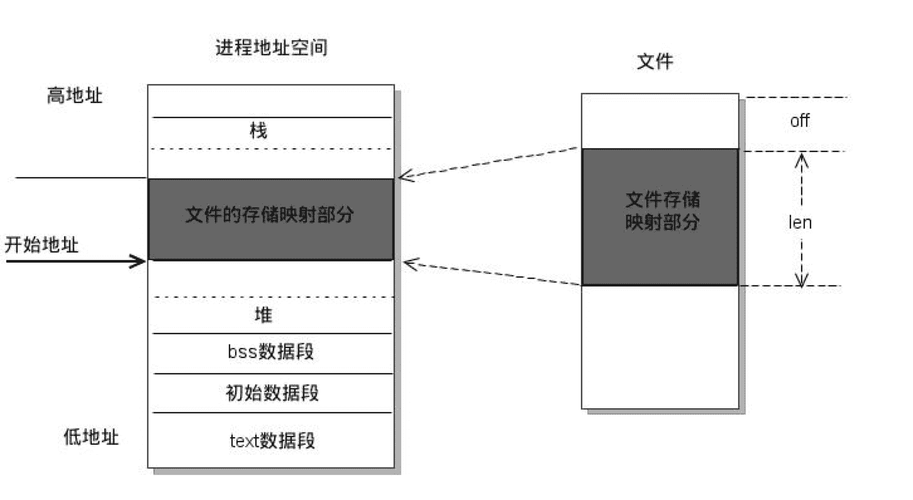
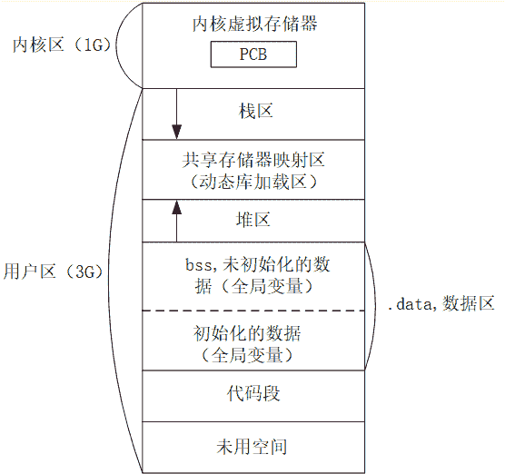
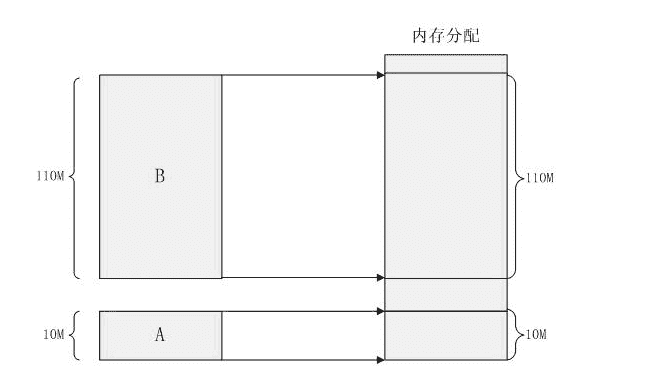

# 第六章 第 10 节 Java-操作系统-10

> 原文：[`www.nowcoder.com/tutorial/10070/44fbe941c9b54bf0a255af07d17d3eae`](https://www.nowcoder.com/tutorial/10070/44fbe941c9b54bf0a255af07d17d3eae)

#### 1.50 谈谈内存映射文件。

**参考回答**

1.  **内存映射（mmap）** 是一种内存映射文件的方法，即将一个文件或者其他对象映射到进程的地址空间，实现文件磁盘地址和应用程序进程虚拟地址空间中一段虚拟地址的一一映射关系。实现这样的映射关系后，进程就可以采用指针的方式读写操作这一段内存，而系统会自动回写藏页面到对应的文件磁盘上。应用程序处理映射部分如同访问主存。

2.  mmap 内存映射原理

（1）线程启动映射过程，并在虚拟地址空间中为映射创建虚拟映射区域。

先在用户空间调用库函数 mmap，并在进程当前进程的虚拟地址空间中，寻找一段空闲的满足要求的连续虚拟地址作为内存虚拟映射区域，对此区域初始化并插入进程的虚拟地址区域链表或树中。

（2）系统在内核空间调用内核函数 mmap，实现文件物理地址和进程虚拟地址之间的一一映射关系。

（3）进程发起堆这片映射空间的访问

进程读写操作访问虚拟地址，查询页表，发现这一段地址并不在内存的物理页面上，因为虽然建立了映射关系，但是还没有将文件从磁盘移到内存中。由此发生缺页中断，内核请求从磁盘调入页面。调页过程先在交换缓存空间（swap cache）中查找，若没有则通过 nopage 函数把缺失页从磁盘调入内存。之后进程会对其做读写操作，若写操作改变了页面内容，一段时间后系统会自动回写脏页面到磁盘中。(修改过的脏页面不会立即更新到文件中，可以调用 msync 来强制同步，写入文件)

3.  mmap 和分页文件操作的区别

区别在于分页文件操作在进程访存时是需要先查询页面缓存 **(page cache)** 的，若发生缺页中断，需要通过 inode 定位文件磁盘地址，先把缺失文件复制到 page cache，再从 page cache 复制到内存中，才能进行访问。这样访存需要经过两次文件复制，写操作也是一样。总结来说，常规文件操作为了提高读写效率和保护磁盘，使用了页缓存机制。这样造成读文件时需要先将文件页从磁盘拷贝到页缓存中，由于页缓存处在内核空间，不能被用户进程直接寻址，所以还需要将页缓存中数据页再次拷贝到内存对应的用户空间中。**但 mmap 的优势在于，把磁盘文件与进程虚拟地址做了映射，这样可以跳过 page cache，只使用一次数据拷贝。**

#### 1.51 谈谈虚拟内存模型。

**参考回答**

​ 虚拟内存分成五大区，分别为**栈区、堆区、全局区（静态区）、文字常量区（常量存储区）、程序代码区**。五大区特性如下：

1.  栈区（stack）： 由编译器自动分配释放 ，存放函数的参数值，局部变量的值等。其操作方式类似于数据结构中的栈。
2.  堆区（heap）： 一般由程序员分配释放， 若程序员不释放，程序结束时可能由 OS 回收 。注意它与数据结构中的堆是两回事，分配方式倒是类似于链表。
3.  全局区（静态区）（static）：全局变量和静态变量的存储是放在一块的，初始化的全局变量和静态变量在一块区域， 未初始化的全局变量和未初始化的静态变量在相邻的另一块区域。程序结束后由系统释放。
4.  文字常量区（**常量存储区**） ：**常量字符串**就是放在这里的。 程序结束后由系统释放。这是一块比较特殊的存储区，他们里面存放的是常量，不允许修改。
5.  程序代码区：存放函数体的二进制代码。

**答案解析**

​ 以 32 位的操作系统为例，32 位的操作系统每个进程对应的虚拟内存为 4G（2 的 32 次方），其中内核区 1G，用户区 3G。结构图如下：

#### 1.52 什么是物理内存和虚拟内存，为什么要有虚拟内存？

**参考回答**

1.  物理内存及虚拟内存定义

    ​ **物理内存**是相对于虚拟内存而言的。物理内存指通过物理内存条而获得的内存空间，而**虚拟内存**则是指将硬盘的一块区域划分来作为内存。内存主要作用是在计算机运行时为操作系统和各种程序提供临时储存。

2.  **为什么要有虚拟内存**

    ​ 在早期的计算机中，要运行一个程序，会把这些程序全都装入内存，程序都是直接运行在内存上的，也就是说程序中访问的内存地址都是实际的物理内存地址。当计算机同时运行多个程序时，必须保证这些程序用到的内存总量要小于计算机实际物理内存的大小。 **早期内存分配方法实例：**

    ​ 某台计算机总的内存大小是 128M ，现在同时运行两个程序 A 和 B ， A 需占用内存 10M ， B 需占用内存 110 。计算机在给程序分配内存时会采取这样的方法：先将内存中的前 10M 分配给程序 A ，接着再从内存中剩余的 118M 中划分出 110M 分配给程序 B 。这种分配方法可以保证程序 A 和程序 B 都能运行，但是这种简单的内存分配策略问题很多。如下图：

    <[`static.nowcoder.com/images/activity/2021jxy/java/img`](https://static.nowcoder.com/images/activity/2021jxy/java/img) src="[`static.nowcoder.com/images/activity/2021jxy/java/img/asset/早期内存分配截图.png"`](https://static.nowcoder.com/images/activity/2021jxy/java/img/asset/%E6%97%A9%E6%9C%9F%E5%86%85%E5%AD%98%E5%88%86%E9%85%8D%E6%88%AA%E5%9B%BE.png") alt="早期内存分配截图" style="zoom:80%;" />

    ​ 早期内存分配方法

    ​ 早期的内存分配方法存在如下几个问题**（为什么要有虚拟内存的原因）**：

    ​ **问题 1** ：进程地址空间不隔离。由于程序都是直接访问物理内存，所以恶意程序可以随意修改别的进程的内存数据，以达到破坏的目的。有些非恶意的，但是有 bug 的程序也可能不小心修改了其它程序的内存数据，就会导致其它程序的运行出现异常。这种情况对用户来说是无法容忍的，因为用户希望使用计算机的时候，其中一个任务失败了，至少不能影响其它的任务。

    ​ **问题 2** ：内存使用效率低。在 A 和 B 都运行的情况下，如果用户又运行了程序 C，而程序 C 需要 20M 大小的内存才能运行，而此时系统只剩下 8M 的空间可供使用，所以此时系统必须在已运行的程序中选择一个将该程序的数据暂时拷贝到硬盘上，释放出部分空间来供程序 C 使用，然后再将程序 C 的数据全部装入内存中运行。可以想象得到，在这个过程中，有大量的数据在装入装出，导致效率十分低下。

    ​ **问题 3** ：程序运行的地址不确定。当内存中的剩余空间可以满足程序 C 的要求后，操作系统会在剩余空间中随机分配一段连续的 20M 大小的空间给程序 C 使用，因为是随机分配的，所以程序运行的地址是不确定的。

3.  虚拟内存的实现（可以在页式或段式内存管理的基础上实现）

    ​ （1）在装入程序时，不必将其全部装入到内存，而只需将当前要执行的部分页面或段装入到内存，就可让程序开始执行；

    ​ （2）在程序执行过程中，如果需执行的指令或访的数据尚未在内存（称为缺页或缺段)，则由处理器通知操作系线将相应的页面或段调入到内存，然后继续执订程序；

    ​ （3）另一方面，操作系统将内存中暂时不用的页面或段调出保存在外存上，从而腾出更多空困空间存放将要装入的程字以及将要调入的页画或段。

    ​ **虚拟技术基本特征：**大的用户空间（物理内存和外存相结合形成虚拟空间）、部分交换（调入和调出是对部分虚拟地址空间进行的）、不连续性（物理内存分配的不连续，虚拟地址空间使用的不连续）。

**答案解析**

1.  **分段**

    ​ 为了解决早期内存分配方式带来的问题，人们想到了一种变通的方法，就是增加一个中间层，利用一种间接的地址访问方法访问物理内存。按照这种方法，程序中访问的内存地址不再是实际的物理内存地址，而是一个虚拟地址，然后由操作系统将这个虚拟地址映射到适当的物理内存地址上。这样，只要操作系统处理好虚拟地址到物理内存地址的映射，就可以保证不同的程序最终访问的内存地址位于不同的区域，彼此没有重叠，就可以达到内存地址空间隔离的效果。

    ​ 当创建一个进程时，操作系统会为该进程分配一个 4GB 大小的虚拟进程地址空间。之所以是 4GB ，是因为在 32 位的操作系统中，一个指针长度是 4 字节，而 4 字节指针的寻址能力是从 0x00000000~~0xFFFFFFFF，最大值 0xFFFFFFFF 表示的即为 4GB 大小的容量。与虚拟地址空间相对的，还有一个物理地址空间，这个地址空间对应的是真实的物理内存。如果你的计算机上安装了 512M 大小的内存，那么这个物理地址空间表示的范围是 0x00000000~~0x1FFFFFFF 。当操作系统做虚拟地址到物理地址映射时，只能映射到这一范围，操作系统也只会映射到这一范围。当进程创建时，每个进程都会有一个自己的 4GB 虚拟地址空间。要注意的是这个 4GB 的地址空间是“虚拟”的，并不是真实存在的，而且每个进程只能访问自己虚拟地址空间中的数据，无法访问别的进程中的数据，通过这种方法实现了进程间的地址隔离。那是不是这 4GB 的虚拟地址空间应用程序可以随意使用呢？很遗憾，在 Windows 系统下，这个虚拟地址空间被分成了 4 部分： NULL 指针区、用户区、 64KB 禁入区、内核区。

    （1）**NULL 指针区** （0x00000000~0x0000FFFF）: 如果进程中的一个线程试图操作这个分区中的数据，CPU 就会引发非法访问。他的作用是，调用 malloc 等内存分配函数时，如果无法找到足够的内存空间，它将返回 NULL。而不进行安全性检查。它只是假设地址分配成功，并开始访问内存地址 0x00000000（NULL）。由于禁止访问内存的这个分区，因此会发生非法访问现象，并终止这个进程的运行。

    （2）**用户模式分区** ( 0x00010000~0xBFFEFFFF)：这个分区中存放进程的私有地址空间。一个进程无法以任何方式访问另外一个进程驻留在这个分区中的数据 （相同 exe，通过 copy-on-write 来完成地址隔离）。（在 windows 中，所有 .exe 和动态链接库都载入到这一区域。系统同时会把该进程可以访问的所有内存映射文件映射到这一分区）。

    （3）**隔离区** (0xBFFF0000~0xBFFFFFFF)：这个分区禁止进入。任何试图访问这个内存分区的操作都是违规的。微软保留这块分区的目的是为了简化操作系统的现实。

    （4）**内核区** (0xC0000000~0xFFFFFFFF)：这个分区存放操作系统驻留的代码。线程调度、内存管理、文件系统支持、网络支持和所有设备驱动程序代码都在这个分区加载。这个分区被所有进程共享。

    ​ 应用程序能使用的只是用户区而已，大约 2GB 左右 ( 最大可以调整到 3GB) 。内核区为 2GB ，内核区保存的是系统线程调度、内存管理、设备驱动等数据，这部分数据供所有的进程共享，但应用程序是不能直接访问的。

    ​ **人们之所以要创建一个虚拟地址空间，目的是为了解决进程地址空间隔离的问题。**但程序要想执行，必须运行在真实的内存上，所以，必须在虚拟地址与物理地址间建立一种映射关系。这样，通过映射机制，当程序访问虚拟地址空间上的某个地址值时，就相当于访问了物理地址空间中的另一个值。人们想到了一种分段(Sagmentation) 的方法，它的思想是在虚拟地址空间和物理地址空间之间做一一映射。比如说虚拟地址空间中某个 10M 大小的空间映射到物理地址空间中某个 10M 大小的空间。这种思想理解起来并不难，操作系统保证不同进程的地址空间被映射到物理地址空间中不同的区域上，这样每个进程最终访问到的。

    ​ 物理地址空间都是彼此分开的。通过这种方式，就实现了进程间的地址隔离。还是以实例说明，假设有两个进程 A 和 B ，进程 A 所需内存大小为 10M ，其虚拟地址空间分布在 0x00000000 到 0x00A00000 ，进程 B 所需内存为 100M ，其虚拟地址空间分布为 0x00000000 到 0x06400000 。那么按照分段的映射方法，进程 A 在物理内存上映射区域为 0x00100000 到 0x00B00000 ，，进程 B 在物理内存上映射区域为 0x00C00000 到 0x07000000 。于是进程 A 和进程 B 分别被映射到了不同的内存区间，彼此互不重叠，实现了地址隔离。从应用程序的角度看来，进程 A 的地址空间就是分布在 0x00000000 到 0x00A00000 ，在做开发时，开发人员只需访问这段区间上的地址即可。应用程序并不关心进程 A 究竟被映射到物理内存的那块区域上了，所以程序的运行地址也就是相当于说是确定的了。 下图显示的是分段方式的内存映射方法：

​ 分段方式的内存映射方法

​ 这种分段的映射方法虽然解决了上述中的问题 1 和问题 3，但并没能解决问题 2，即内存的使用效率问题。在分段的映射方法中，每次换入换出内存的都是整个程序， 这样会造成大量的磁盘访问操作，导致效率低下。所以这种映射方法还是稍显粗糙，粒度比较大。实际上，程序的运行有局部性特点，在某个时间段内，程序只是访问程序的一小部分数据，也就是说，程序的大部分数据在一个时间段内都不会被用到。基于这种情况，人们想到了粒度更小的内存分割和映射方法，这种方法就是分页 (Paging) 。

2.  **分页**

    ​ 分页的基本方法是，将地址空间分成许多的页。每页的大小由 CPU 决定，然后由操作系统选择页的大小。目前 Inter 系列的 CPU 支持 4KB 或 4MB 的页大小，而 PC 上目前都选择使用 4KB 。按这种选择， 4GB 虚拟地址空间共可以分成 1048576 页， 512M 的物理内存可以分为 131072 个页。显然虚拟空间的页数要比物理空间的页数多得多。

    ​ 在分段的方法中，每次程序运行时总是把程序全部装入内存，而分页的方法则有所不同。分页的思想是程序运行时用到哪页就为哪页分配内存，没用到的页暂时保留在硬盘上。当用到这些页时再在物理地址空间中为这些页分配内存，然后建立虚拟地址空间中的页和刚分配的物理内存页间的映射。下面通过介绍一个可执行文件的装载过程来说明分页机制的实现方法。

    ​ 一个可执行文件 (PE 文件 ) 其实就是一些编译链接好的数据和指令的集合，它也会被分成很多页，在 PE 文件执行的过程中，它往内存中装载的单位就是页。当一个 PE 文件被执行时，操作系统会先为该程序创建一个 4GB 的进程虚拟地址空间。前面介绍过，虚拟地址空间只是一个中间层而已，它的功能是利用一种映射机制将虚拟地址空间映射到物理地址空间，所以，创建 4GB 虚拟地址空间其实并不是要真的创建空间，只是要创建那种映射机制所需要的数据结构而已，这种数据结构就是页目和页表。

    ​ 当创建完虚拟地址空间所需要的数据结构后，进程开始读取 PE 文件的第一页。在 PE 文件的第一页包含了 PE 文件头和段表等信息，进程根据文件头和段表等信息，将 PE 文件中所有的段一一映射到虚拟地址空间中相应的页 (PE 文件中的段的长度都是页长的整数倍 ) 。这时 PE 文件的真正指令和数据还没有被装入内存中，操作系统只是据 PE 文件的头部等信息建立了 PE 文件和进程虚拟地址空间中页的映射关系而已。当 CPU 要访问程序中用到的某个虚拟地址时，当 CPU 发现该地址并没有相相关联的物理地址时， CPU 认为该虚拟地址所在的页面是个空页面， CPU 会认为这是个页错误 (Page Fault) ， CPU 也就知道了操作系统还未给该 PE 页面分配内存，CPU 会将控制权交还给操作系统。操作系统于是为该 PE 页面在物理空间中分配一个页面，然后再将这个物理页面与虚拟空间中的虚拟页面映射起来，然后将控制权再还给进程，进程从刚才发生页错误的位置重新开始执行。由于此时已为 PE 文件的那个页面分配了内存，所以就不会发生页错误了。随着程序的执行，页错误会不断地产生，操作系统也会为进程分配相应的物理页面来满足进程执行的需求。

    ​ 分页方法的核心思想就是当可执行文件执行到第 x 页时，就为第 x 页分配一个内存页 y ，然后再将这个内存页添加到进程虚拟地址空间的映射表中 , 这个映射表就相当于一个 y=f(x) 函数。应用程序通过这个映射表就可以访问到 x 页关联的 y 页了。

#### 1.53 内存和缓存有什么区别？

**参考回答**

​ 内存和缓存是计算机不同的组成部件。

1.  内存特性

    ​ 内存也被称作内存储器，其作用是用于暂时存放 CPU 的运算数据，以及与硬盘等外部存储交换的数据。只要计算机在运行中，CPU 就会把需要进行运算的数据调到内存中进行运算，当运算完成后 CPU 再将结果传送出来，内存的运行也决定了计算机的稳定运行。

2.  缓存特性

    ​ CPU 芯片面积和成本的因素影响，决定了缓存都很小。现在一般的缓存不过几 M，CPU 缓存的运行频率极高，一般是和处理器同频运作，工作效率远远大于系统内存和硬盘。实际工作时，CPU 往往需要重复读取读取同样的数据块，而缓存容量的增大，可以大幅度提升 CPU 内部读取数据的命中率，而不用再到内存或者硬盘上寻找，以此提高系统性能。

#### 1.54 请你说说缓存溢出。

**参考回答**

1.  缓存溢出及其危害

​ **缓存溢出**是指输入到一个缓冲区或者数据保存区域的数据量超过了其容量，从而导致覆盖了其它区域数据的状况。攻击者造成并利用这种状况使系统崩溃或者通过插入特制的代码来控制系统。被覆盖的区域可能存有其它程序的变量、参数、类似于返回地址或指向前一个栈帧的指针等程序控制流数据。缓冲区可以位于堆、栈或进程的数据段。这种错误可能产生如下后果：

​ （1）破坏程序的数据；

​ （2）改变程序的控制流，因此可能访问特权代码。

​ 最终很有可能造成程序终止。当攻击者成功地攻击了一个系统之后，作为攻击的一部分，程序的控制流可能会跳转到攻击者选择的代码处，造成的结果是被攻击的进程可以执行任意的特权代码（比如通过判断输入是否和密码匹配来访问特权代码，如果存在缓冲区漏洞，非法输入导致存放“密码”的内存区被覆盖，从而使得“密码”被改写，因此判断为匹配进而获得了特权代码的访问权）

​ 缓冲区溢出攻击是最普遍和最具危害性的计算机安全攻击类型之一。

2.  如何预防缓存溢出

    广义上分为**两类**：

    （1）编译时防御系统，目的是强化系统以抵御潜伏于新程序中的恶意攻击

    （2）运行时预防系统，目的是检测并终止现有程序中的恶意攻击