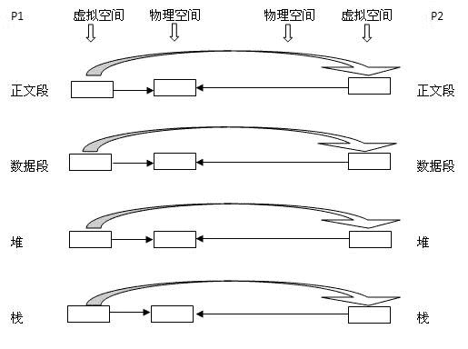
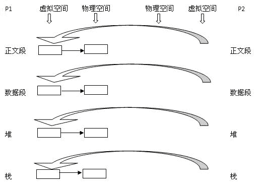

# 第六章 第 11 节 Java-操作系统-11

> 原文：[`www.nowcoder.com/tutorial/10070/50c425ac21b844be8a7cc52527b0e338`](https://www.nowcoder.com/tutorial/10070/50c425ac21b844be8a7cc52527b0e338)

#### 1.55 深拷贝和浅拷贝的区别是什么，它们各自的使用场景是什么？

**参考回答**

​ **浅拷贝**只是对指针的拷贝，拷贝后两个指针指向同一个内存空间；**深拷贝**不断对指针进行拷贝，而且对指针指向的内容进行拷贝，经深拷贝后的指针是指向两个不同的地址空间。

1.  浅拷贝

    ​ 对一个已知对象进行拷贝时，编译系统会自动调用一次构造函数（拷贝构造函数），如果用户未定义拷贝构造函数，则会调用默认拷贝构造函数，调用一次构造函数，调用两次析构函数，两个对象的指针成员所指内存相同，但是程序结束时该内存被释放了两次，会造成内存泄漏问题。

2.  深拷贝

    ​ 在对含有指针成员的对象进行拷贝时，必须要自己定义拷贝构造函数，使拷贝后的对象指针成员有自己的内存空间，即进行深拷贝，这样就避免了内存泄漏的发生，调用一次构造函数，一次自定义拷贝构造函数，两次析构函数。两个对象的指针成员所指内容不同。

#### 1.56 说说 IO 模型。

**参考回答**

1.  什么是 IO

    ​ 我们都知道 unix 世界里，一切皆文件。而文件是什么呢？文件就是一串二进制流而已。无论是 socket，还是 FIFO、管道、终端，对我们来说，一切都是文件，一切都是流。在信息交换的过程中，我们都是对这些流进行数据的收发操作简称为**I/O 操作**(input and output)。往流中读出数据，系统调用 read；写入数据，系统调用 write。

    ​ 计算机里有这么多的流，我怎么知道要操作哪个流呢？

    ​ 做到这个的就是**文件描述符**，即通常所说的 fd，一个 fd 就是一个整数，所以对这个整数的操作就是对这个文件（流）的操作。我们创建一个 socket，通过系统调用会返回一个文件描述符，那么剩下对 socket 的操作就会转化为对这个描述符的操作。不能不说这又是一种分层和抽象的思想。

2.  IO 交互

    ​ 对于一个输入操作来说，进程 IO 系统调用后，内核会先看缓冲区有没有相应的缓存数据，没有的话再到设备中读取，因为设备 IO 一般速度较慢，需要等待，内核缓冲区有数据则直接复制到进程空间。所以，对于一个网络输入操作通常包括**两个不同阶段**：

    （1）等待网络数据到达网卡->读取到内核缓冲区

    （2）从内核缓冲区复制数据->用户空间

    ​ IO 有内存 IO、网络 IO 和磁盘 IO 三种，通常我们所说的 IO 指的是**网络 IO**和**磁盘 IO**两者。

3.  五大 I/O 模型

    Linux 有五大 I/O 模型，分别为**阻塞 IO、同步非阻塞 IO、IO 多路复用、信号驱动 IO、异步 IO**。五种 IO 模型特性分别如下：

    （1）阻塞 IO（blocking IO）

    ​ 最传统的一种 IO 模型，即在读写数据过程中会发生阻塞现象。

    ​ 当用户线程发出 IO 请求之后，内核会去查看数据是否就绪，如果没有就绪就会等待数据就绪，而用户线程就会处于阻塞状态，用户线程交出 CPU。当数据就绪之后，内核会将数据拷贝到用户线程，并返回结果给用户线程，用户线程才解除 block 状态。

    ​ 典型的阻塞 IO 模型的例子为：

    ​ data = socket.read();

    ​ 如果数据没有就绪，就会一直阻塞在 read 方法。

<[`static.nowcoder.com/images/activity/2021jxy/java/img`](https://static.nowcoder.com/images/activity/2021jxy/java/img) src="[`static.nowcoder.com/images/activity/2021jxy/java/img/asset/阻塞 IO 模型.png"`](https://static.nowcoder.com/images/activity/2021jxy/java/img/asset/%E9%98%BB%E5%A1%9EIO%E6%A8%A1%E5%9E%8B.png") alt="阻塞 IO 模型" style="zoom:80%;" />

​ 阻塞 I/O 模型

（2）同步非阻塞 IO（nonblocking IO)

​ 当用户线程发起一个 read 操作后，并不需要等待，而是马上就得到了一个结果。如果结果是一个 error 时，它就知道数据还没有准备好，于是它可以再次发送 read 操作。一旦内核中的数据准备好了，并且又再次收到了用户线程的请求，那么它马上就将数据拷贝到了用户线程，然后返回。

​ 所以事实上，在非阻塞 IO 模型中，用户线程需要不断地询问内核数据是否就绪，也就说非阻塞 IO 不会交出 CPU，而会一直占用 CPU。

典型的非阻塞 IO 模型一般如下：

```cpp
while(true){ 
  data = socket.read();
  if(data!= error){
    处理数据
    break;
  }
}
```

​ 但是对于非阻塞 IO 就有一个非常严重的问题，在 while 循环中需要不断地去询问内核数据是否就绪，这样会导致 CPU 占用率非常高，因此一般情况下很少使用 while 循环这种方式来读取数据。

<[`static.nowcoder.com/images/activity/2021jxy/java/img`](https://static.nowcoder.com/images/activity/2021jxy/java/img) src="[`static.nowcoder.com/images/activity/2021jxy/java/img/asset/非阻塞 IO 模型.png"`](https://static.nowcoder.com/images/activity/2021jxy/java/img/asset/%E9%9D%9E%E9%98%BB%E5%A1%9EIO%E6%A8%A1%E5%9E%8B.png") alt="非阻塞 IO 模型" style="zoom:80%;" />

​ 同步非阻塞 I/O 模型

（3）IO 多路复用（IO multiplexing）

​ 多路复用 IO 模型是目前使用得比较多的模型。Java NIO 实际上就是多路复用 IO。

​ 在多路复用 IO 模型中，会有一个线程不断去轮询多个 socket 的状态，只有当 socket 真正有读写事件时，才真正调用实际的 IO 读写操作。因为在多路复用 IO 模型中，只需要使用一个线程就可以管理多个 socket，系统不需要建立新的进程或者线程，也不必维护这些线 程和 进程，并且只有在真正有 socket 读写事件进行时，才会使用 IO 资源，所以它大大减少了资源占用。

​ 在 Java NIO 中，是通过 selector.select()去查询每个通道是否有到达事件，如果没有事件，则一直阻塞在那里，因此这种方式会导致用户线程的阻塞。

​ 也许有朋友会说，我可以采用多线程+ 阻塞 IO 达到类似的效果，但是由于在多线程 + 阻塞 IO 中，每个 socket 对应一个线程，这样会造成很大的资源占用，并且尤其是对于长连接来说，线程的资源一直不会释放，如果后面陆续有很多连接的话，就会造成性能上的瓶颈。

​ 而多路复用 IO 模式，通过一个线程就可以管理多个 socket，只有当 socket 真正有读写事件发生才会占用资源来进行实际的读写操作。因此，多路复用 IO 比较适合连接数比较多的情况。

另外多路复用 IO 为何比非阻塞 IO 模型的效率高是因为在非阻塞 IO 中，不断地询问 socket 状态时通过用户线程去进行的，而在多路复用 IO 中，轮询每个 socket 状态是内核在进行的，这个效率要比用户线程要高的多。

​ **注意:**多路复用 IO 模型是通过轮询的方式来检测是否有事件到达，并且对到达的事件逐一进行响应。因此对于多路复用 IO 模型来说，一旦事件响应体很大，那么就会导致后续的事件迟迟得不到处理，并且会影响新的事件轮询。

<[`static.nowcoder.com/images/activity/2021jxy/java/img`](https://static.nowcoder.com/images/activity/2021jxy/java/img) src="[`static.nowcoder.com/images/activity/2021jxy/java/img/asset/IO 复用模型.png"`](https://static.nowcoder.com/images/activity/2021jxy/java/img/asset/IO%E5%A4%8D%E7%94%A8%E6%A8%A1%E5%9E%8B.png") alt="IO 复用模型" style="zoom:80%;" />

​ I/O 多路复用模型

（4）信号驱动 IO（signal driven IO）

​ 在信号驱动 IO 模型中，当用户线程发起一个 IO 请求操作，会给对应的 socket 注册一个信号函数，然后用户线程会继续执行，当内核数据就绪时会发送一个信号给用户线程，用户线程接收到信号之后，便在信号函数中调用 IO 读写操作来进行实际的 IO 请求操作。这个一般用于 UDP 中，对 TCP 套接口几乎是没用的，原因是该信号产生得过于频繁，并且该信号的出现并没有说明发生了什么事情。

<[`static.nowcoder.com/images/activity/2021jxy/java/img`](https://static.nowcoder.com/images/activity/2021jxy/java/img) src="[`static.nowcoder.com/images/activity/2021jxy/java/img/asset/信号驱动 IO 模型.png"`](https://static.nowcoder.com/images/activity/2021jxy/java/img/asset/%E4%BF%A1%E5%8F%B7%E9%A9%B1%E5%8A%A8IO%E6%A8%A1%E5%9E%8B.png") alt="信号驱动 IO 模型" style="zoom:80%;" />

​ 信号驱动 I/O 模型

（5）异步 IO（asynchronous IO）

​ 异步 IO 模型才是最理想的 IO 模型，在异步 IO 模型中，当用户线程发起 read 操作之后，立刻就可以开始去做其它的事。而另一方面，从内核的角度，当它收到一个 asynchronous read 之后，它会立刻返回，说明 read 请求已经成功发起了，因此不会对用户线程产生任何阻塞。然后，内核会等待数据准备完成，再将数据拷贝到用户线程，当这一切都完成之后，内核会给用户线程发送一个信号，告诉它 read 操作完成了。也就说用户线程完全不需要关心实际的整个 IO 操作是如何进行的，只需要先发起一个请求，当接收内核返回的成功信号时表示 IO 操作已经完成，可以直接去使用数据了。

​ 也就说在异步 IO 模型中，IO 操作的两个阶段都不会阻塞用户线程，这两个阶段都是由内核自动完成，然后发送一个信号告知用户线程操作已完成。用户线程中不需要再次调用 IO 函数进行具体的读写。这点是和信号驱动模型有所不同的，在信号驱动模型中，当用户线程接收到信号表示数据已经就绪，然后需要用户线程调用 IO 函数进行实际的读写操作；而在异步 IO 模型中，收到信号表示 IO 操作已经完成，不需要再在用户线程中调用 IO 函数进行实际的读写操作。

​ **注意:**异步 IO 是需要操作系统的底层支持，在 Java 7 中，提供了 Asynchronous IO（简称 AIO）。

<[`static.nowcoder.com/images/activity/2021jxy/java/img`](https://static.nowcoder.com/images/activity/2021jxy/java/img) src="[`static.nowcoder.com/images/activity/2021jxy/java/img/asset/异步 IO 模型.png"`](https://static.nowcoder.com/images/activity/2021jxy/java/img/asset/%E5%BC%82%E6%AD%A5IO%E6%A8%A1%E5%9E%8B.png") alt="异步 IO 模型" style="zoom:80%;" />

​ 异步 I/O 模型

​ 前四种 IO 模型实际上都属于同步 IO，只有最后一种是真正的异步 IO，因为无论是多路复用 IO 还是信号驱动模型，IO 操作的第 2 个阶段都会引起用户线程阻塞，也就是内核进行数据拷贝的过程都会让用户线程阻塞。

#### 1.57 Linux 中的软链接和硬链接有什么区别？

**参考回答**

1.  inode 概念

    ​ inode 是文件系统中存储文件元信息的区域，中文叫节点索引，每个节点索引包含了文件的创建者，大小，日期等等。可以通过 ls -i file 命令查看 inode 的值。

2.  根据 Linux 系统存储文件的特点，链接的方式分为**软链接和硬链接**2 种

    ​ **软链接**相当于建立了一个新的快捷方式文件，该文件有自己的名称和 inode 以及物理存储的文件数据，文件数据里记录着如何跳转的设置数据，访问该快捷文件会被重新定向到原始文件，删除原始文件，软链文件失效；**硬链接**相当于为当前文件名对应的文件再建立了一个文件别名，别名对应的 inode 以及物理数据都是一样的，一旦建立，我们甚至根本无法区分谁是原始文件的原始名称，删除文件的其中一个名称，文件不会丢失，除非把所有的名称都删除。

    如下图：

    <[`static.nowcoder.com/images/activity/2021jxy/java/img`](https://static.nowcoder.com/images/activity/2021jxy/java/img) src="[`static.nowcoder.com/images/activity/2021jxy/java/img/asset/软硬连接.png"`](https://static.nowcoder.com/images/activity/2021jxy/java/img/asset/%E8%BD%AF%E7%A1%AC%E8%BF%9E%E6%8E%A5.png") alt="软硬连接" style="zoom:100%;" />

    ​ hard link(硬链) 和 file 都指向同一个 inode，inode 对应了一个实际物理存储的文件。soft link（软链） 对应一个新的 inode， 新的 inode 对应一个新的物理存储文件，物理存储文件又指向了目标文件 file。

3.  **软连接和硬链接的区别**

    (1) **软链接**可以为文件和目录（哪怕是不存在的）创建链接；**硬链接**只能为文件创建链接。
    (2) **软链接**可以跨文件系统；**硬链接**必须是同一个文件系统
    (3) **硬链接**因为只是文件的一个别名，所以不重复占用内存；**软链接**因为只是一个访问文件的快捷方式文件，文件内只包含快捷指向信息，所以占用很小的内存。
    (4) **软链接**的文件权限和源文件可以不一样；**硬链接**文件权限肯定是一样的，因为他们本来就是一个文件的不同名称而已。

4.  二者使用场景

    ​ 一般比较重要的文件我们担心文件被误删除且传统复制备份方式占用 double 数量的空间会造成浪费，可以使用硬链做备份来解决；软链接一般被用来设置可执行文件的快捷方式的路径。

**答案解析**

1.  创建硬链接

    ```cpp
    [root@localhost ~]# touch cangls
    [root@localhost ~]# ln /root/cangls /tmp
    #建立硬链接文件，目标文件没有写文件名，会和原名一致
    #也就是/tmp/cangls 是硬链接文件
    ```

2.  创建软链接

    ```cpp
    [root@localhost ~]# touch bols
    [root@localhost ~]# In -s /root/bols /tmp
    #建立软链接文件
    ```

    **注意：**软链接文件的源文件必须写成绝对路径，而不能写成相对路径（硬链接没有这样的要求）；否则软链接文件会报错。

#### 1.58 说说缺页中断机制。

**参考回答**

1.  缺页中断

    ​ 在请求分页系统中，可以通过查询页表中的状态位来确定所要访问的页面是否存在于内存中。当所要访问的页面不在内存时，会产生一次**缺页中断**，此时操作系统会根据页表中的外存地址在外存中找到所缺的一页，将其调入内存。
    　缺页中断的处理流程如下：

    ​ A. 在内存中有空闲物理页面时，分配一物理页帧 f，转第 E 步；

    ​ B. 依据页面置换算法选择被替换的物理页帧 f，对应逻辑页 q；

    ​ C. 如果 q 被修改过，则把它写回外存；

    ​ D. 修改 q 的页表项中驻留位置为 0；

    ​ E. 将需要访问的页 p 装入到物理页 f；

    ​ F. 修改 p 的页表项驻留位为 1，物理页帧号为 f；

    ​ G. 重新执行产生缺页的指令。

2.  **缺页中断与一般的中断存在区别**

    **（1）范围不同**

​ 一般中断只需要保护现场然后就直接跳到需及时处理的地方；

​ 缺页中断除了保护现场之外，还要判断内存中是否有足够的空间存储所需的页或段，然后再把所需页调进来再使用。

​ **（2）结果不同**

​ 一般中断在处理完之后返回时，执行下一条指令；

​ 缺页中断返回时，执行产生中断的那一条指令。

​ **（3）次数不同**

​ 一般中断只产生一次，发生中断指令后转入相应处理程序进行处理，恢复被中断程序现场;

​ 在指令执行期间产生和处理缺页中断信号，一条指令在执行期间，可能产生多次缺页中断。

**答案解析**

​ **产生缺页中断的几种情况**：

1.  当内存管理单元（MMU）中确实没有创建虚拟物理页映射关系，并且在该虚拟地址之后再没有当前进程的线性区（vma）的时候，这将杀掉该进程；
2.  当 MMU 中确实没有创建虚拟页物理页映射关系，并且在该虚拟地址之后存在当前进程的线性区 vma 的时候，这很可能是缺页中断，并且可能是栈溢出导致的缺页中断；
3.  当使用 malloc/mmap 等希望访问物理空间的库函数/系统调用后，由于 linux 并未真正给新创建的 vma 映射物理页，此时若先进行写操作，将和 2 产生缺页中断的情况一样；若先进行读操作虽然也会产生缺页异常，将被映射给默认的零页，等再进行写操作时，仍会产生缺页中断，这次必须分配 1 物理页了，进入写时复制的流程；
4.  当使用 fork 等系统调用创建子进程时，子进程不论有无自己的 vma，它的 vma 都有对于物理页的映射，但它们共同映射的这些物理页属性为只读，即 linux 并未给子进程真正分配物理页，当父子进程任何一方要写相应物理页时，导致缺页中断的写时复制。

#### 1.59 软中断和硬中断有什么区别？

**参考回答**

1.  硬中断

    ​ 由与系统相连的外设(比如网卡、硬盘)自动产生的。主要是用来通知操作系统外设状态的变化。比如当网卡收到数据包的时候，就会发出一个中断。我们通常所说的中断指的是硬中断(hardirq)。

2.  软终端

    ​ 为了满足实时系统的要求，中断处理应该是越快越好。Linux 为了实现这个特点，当中断发生的时候，硬中断处理那些短时间就可以完成的工作，而将那些处理事件比较长的工作，放到中断之后来完成，也就是软中断(softirq)来完成。

3.  中断嵌套

    ​ Linux 下**硬中断是可以嵌套的**，但是没有优先级的概念，也就是说任何一个新的中断都可以打断正在执行的中断，但同种中断除外。**软中断不能嵌套**，但相同类型的软中断可以在不同 CPU 上并行执行。

4.  **软中断与硬中断之间的区别**

    （1）**硬中断**是由外部事件引起的因此具有随机性和突发性；**软中断**是执行中断指令产生的，无外面事件中断请求信号，因此软中断的发生不是随机的而是由程序安排好的；

    （2）**硬中断**的中断号是由中断控制器提供的；**软中断**的中断号是由指令直接给出的，无需使用中断控制器。

    （3）**硬中断**的中断响应周期，CPU 需要发中断回合信号；**软中断**的中断响应周期，CPU 不需要发中断回合信号。

    （4）**硬中断**是可屏蔽的；**软中断**是不可屏蔽的。

#### 1.60 介绍一下你对 CopyOnWrite 的了解。

**参考回答**

1.  CopyOnWrite（写时拷贝技术）

    ​ Linux 的 fork()使用写时拷贝页来实现新进程的创建，它是一种可推迟甚至避免数据拷贝的技术，开始时内核并不会复制整个地址空间，而是让父子进程共享地址空间，只有在写时才复制地址空间，使得父子进程都拥有独立的地址空间，即资源的复制是在只有需要写入时才会发生。在此之前都是以读的方式去和父进程共享资源，这样，在页根本不会被写入的场景下，fork()立即执行 exec()，无需对地址空间进行复制，fork()的实际开销就是复制父进程的一个页表和为子进程创建一个进程描述符，也就是说只有当进程空间中各段的内存内容发生变化时，父进程才将其内容复制一份传给子进程，大大提高了效率。

2.  写时拷贝技术优缺点

    ​ 写时拷贝技术是一种很重要的优化手段，核心是懒惰处理实体资源请求，在多个实体资源之间只是共享资源，起初是并不真正实现资源拷贝，只有当实体有需要对资源进行修改时才真正为实体分配私有资源。但写时拷贝技术技术也有它的优点和缺点：

    **优点：**写时拷贝技术可以减少分配和复制大量资源时带来的瞬间延时，但实际上是将这种延时附加到了后续的操作之中。

    **缺点：**写时拷贝技术可以减少不必要的资源分配。比如 fork 进程时，并不是所有的页面都需要复制，父进程的代码段和只读数据段都不被允许修改，所以无需复制。

**答案解析**

​ 写时复制技术详述：

​ 现在有一个父进程 P1，这是一个主体，那么它是有灵魂也就身体的。现在在其虚拟地址空间（有相应的数据结构表示）上有：正文段，数据段，堆，栈这四个部分，相应的，内核要为这四个部分分配各自的物理块。即：正文段块，数据段块，堆块，栈块。至于如何分配，这是内核去做的事，在此不详述。

1.  现在 P1 用 fork()函数为进程创建一个子进程 P2，

    内核：

    （1）复制 P1 的正文段，数据段，堆，栈这四个部分，注意是其内容相同。

    （2）为这四个部分分配物理块，P2 的：正文段－＞PI 的正文段的物理块，其实就是不为 P2 分配正文段块，让 P2 的正文段指向 P1 的正文段块，数据段－＞P2 自己的数据段块（为其分配对应的块），堆－＞P2 自己的堆块，栈－＞P2 自己的栈块。如下图所示：从左到右大的方向箭头表示复制内容。

    ​ <[`static.nowcoder.com/images/activity/2021jxy/java/img`](https://static.nowcoder.com/images/activity/2021jxy/java/img) src="[`static.nowcoder.com/images/activity/2021jxy/java/img/asset/写时复制 1.jpg"`](https://static.nowcoder.com/images/activity/2021jxy/java/img/asset/%E5%86%99%E6%97%B6%E5%A4%8D%E5%88%B61.jpg") alt="写时复制 1" style="zoom:100%;" />

2.  写时复制技术：内核只为新生成的子进程创建虚拟空间结构，它们来复制于父进程的虚拟究竟结构，但是不为这些段分配物理内存，它们共享父进程的物理空间，当父子进程中有更改相应段的行为发生时，再为子进程相应的段分配物理空间。

    

3.  vfork()：这个做法更加火爆，内核连子进程的虚拟地址空间结构也不创建了，直接共享了父进程的虚拟空间，当然了，这种做法就顺

    水推舟的共享了父进程的物理空间!



​ 通过以上的分析，相信大家对进程有个深入的认识，它是怎么一层层体现出自己来的，进程是一个主体，那么它就有灵魂与身体，系统必须为实现它创建相应的实体， 灵魂实体与物理实体。这两者在系统中都有相应的数据结构表示，物理实体更是体现了它的物理意义。以下援引 LKD

传统的 fork()系统调用直接把所有的资源复制给新创建的进程。这种实现过于简单并且效率低下，因为它拷贝的数据也许并不共享，更糟的情况是，如果新进程打算立即执行一个新的映像，那么所有的拷贝都将前功尽弃。Linux 的 fork()使用写时拷贝（copy-on-write）页实现。写时拷贝是一种可以推迟甚至免除拷贝数据的技术。内核此时并不复制整个进程地址空间，而是让父进程和子进程共享同一个拷贝。只有在需要写入的时候，数据才会被复制，从而使各个进程拥有各自的拷贝。也就是说，资源的复制只有在需要写入的时候才进行，在此之前，只是以只读方式共享。这种技术使地址空间上的页的拷贝被推迟到实际发生写入的时候。在页根本不会被写入的情况下—举例来说，fork()后立即调用 exec()—它们就无需复制了。fork()的实际开销就是复制父进程的页表以及给子进程创建惟一的进程描述符。在一般情况下，进程创建后都会马上运行一个可执行的文件，这种优化可以避免拷贝大量根本就不会被使用的数据（地址空间里常常包含数十兆的数据）。由于 Unix 强调进程快速执行的能力，所以这个优化是很重要的。这里补充一点：**Linux COW 与 exec 没有必然联系**。

​ 实际上 COW 技术不仅仅在 Linux 进程上有应用，其他例如 C++的 String 在有的 IDE 环境下也支持 COW 技术，即例如：

```cpp
string str1 = "hello world";
string str2 = str1;
```

之后执行代码:

```cpp
str1[1]='q';
str2[1]='w';
```

​ 在开始的两个语句后，str1 和 str2 存放数据的地址是一样的，而在修改内容后，str1 的地址发生了变化，而 str2 的地址还是原来的,这就是 C++中的 COW 技术的应用，不过 VS2005 似乎已经不支持 COW。

#### 1.61 Linux 替换文本该如何操作呢？

**参考回答**

1.  通过 vi 编辑器来替换
    **vi/vim 中可以使用 :s 命令来替换字符串。**
    :s/well/good/ 替换当前行第一个 well 为 good
    :s/well/good/g 替换当前行所有 well 为 good
    :n,s/well/good/g 替换第 n 行开始到最后一行中每一行所有 well 为 good
    n 为数字，若 n 为 .，表示从当前行开始到最后一行
    :%s/well/good/（等同于 :g/well/s//good/） 替换每一行的第一个 well 为 good
    :%s/well/good/g（等同于 :g/well/s//good/g） 替换每一行中所有 well 为 good，可以使用 # 作为分隔符，此时中间出现的 / 不会作为分隔符
    :s#well/#good/# 替换当前行第一个 well/ 为 good/
    :%s#/usr/bin#/bin#g 可以把文件中所有路径/usr/bin 换成/bin

2.  直接替换文件中的字符串。(此法不用打开文件即可替换字符串，而且可以批量替换多个文件。)

    （1）**perl 命令替换**，参数含义如下：

    ```cpp
    -a  自动分隔模式，用空格分隔$_ 并保存到@F 中。相当于@F = split ”。分隔符可以使用-F 参数指定
    -F  指定-a 的分隔符，可以使用正则表达式
    -e  执行指定的脚本。
    -i<扩展名>  原地替换文件，并将旧文件用指定的扩展名备份。不指定扩展名则不备份。
    -l  对输入内容自动 chomp，对输出内容自动添加换行
    -n  自动循环，相当于 while(<>) { 脚本; }
    -p  自动循环+自动输出，相当于 while(<>) { 脚本; print; }
    **用法示例：**
    perl -p -i.bak -e 's/\bfoo\b/bar/g' *.c
    将所有 C 程序中的 foo 替换成 bar，旧文件备份成.bak
    ```

    ​ perl -p -i -e "s/shan/hua/g" ./lishan.txt ./lishan.txt.bak
    ​ 将当前文件夹下 lishan.txt 和 lishan.txt.bak 中的“shan”都替换为“hua”

    ​ perl -i.bak -pe 's/(\d+)/ 1 + $1 /ge' file1 file2
    ​ 将每个文件中出现的数值都加一

    （2）**sed 命令下批量替换文件内容** 　

    ​ 格式: sed -i "s/查找字段/替换字段/g" `grep 查找字段 -rl 路径` 文件名

    ​ -i 表示 inplace edit，就地修改文件

    ​ -r 表示搜索子目录

    ​ -l 表示输出匹配的文件名
    ​ s 表示替换，d 表示删除

    ​ **用法示例：**

    ​ sed -i "s/shan/hua/g" lishan.txt

    ​ 把当前目录下 lishan.txt 里的 shan 都替换为 hua

**答案解析**

​ **sed 的其他用法如下：**

1.  删除行首空格
    sed 's/^[ ]*//g' filename
    sed 's/^ *//g' filename
    sed 's/^[[:space:]]*//g' filename
2.  行后和行前添加新行
    行后：sed 's/pattern/&\n/g' filename
    行前：sed 's/pattern/\n&/g' filename
    &代表 pattern
3.  使用变量替换(使用双引号)
    sed -e "s/var2/g" filename
4.  在第一行前插入文本
    sed -i '1 i\插入字符串' filename
5.  在最后一行插入
    sed -i '$ a\插入字符串' filename
6.  在匹配行前插入
    sed -i '/pattern/ i "插入字符串"' filename
7.  在匹配行后插入
    sed -i '/pattern/ a "插入字符串"' filename
8.  删除文本中空行和空格组成的行以及#号注释的行
    grep -v ^# filename | sed /^[[:space:]]*/d

​