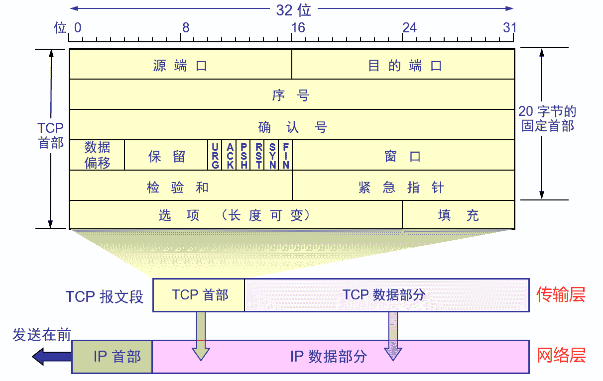
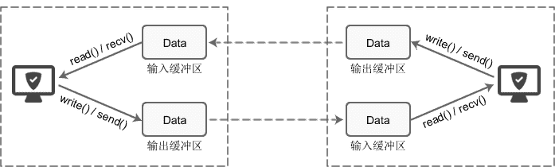
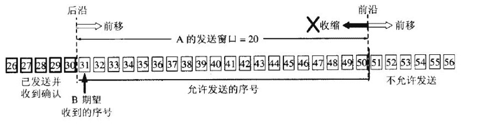
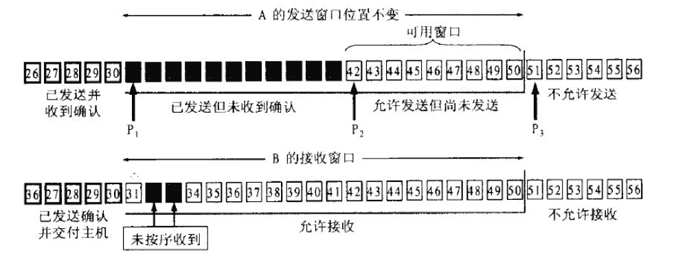
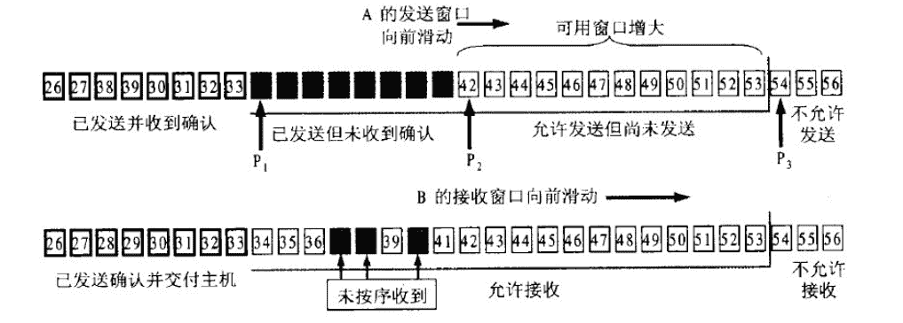
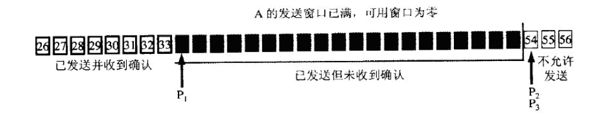
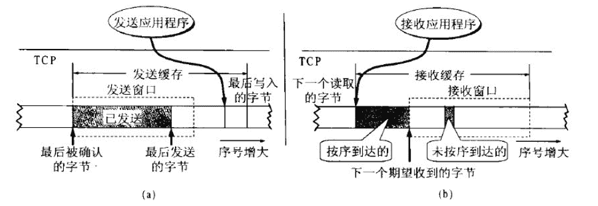

# 第七章 第 4 节 Java-计算机网络-4

> 原文：[`www.nowcoder.com/tutorial/10070/6251f2f6e7cb41e783b271be0dbf3095`](https://www.nowcoder.com/tutorial/10070/6251f2f6e7cb41e783b271be0dbf3095)

#### 1.16 介绍一下 TCP 和 UDP 的区别。

**参考回答**

​ TCP 和 UDP 有如下区别：

1.  连接：TCP 面向连接的传输层协议，即传输数据之前必须先建立好连接；UDP 无连接。
2.  服务对象：TCP 点对点的两点间服务，即一条 TCP 连接只能有两个端点；UDP 支持一对一，一对多，多对一，多对多的交互通信。
3.  可靠性：TCP 可靠交付：无差错，不丢失，不重复，按序到达；UDP 尽最大努力交付，不保证可靠交付。
4.  拥塞控制/流量控制：有拥塞控制和流量控制保证数据传输的安全性；UDP 没有拥塞控制，网络拥塞不会影响源主机的发送效率。
5.  报文长度：TCP 动态报文长度，即 TCP 报文长度是根据接收方的窗口大小和当前网络拥塞情况决定的；UDP 面向报文，不合并，不拆分，保留上面传下来报文的边界。
6.  首部开销：TCP 首部开销大，首部 20 个字节；UDP 首部开销小，8 字节（源端口，目的端口，数据长度，校验和）。
7.  适用场景（由特性决定）：数据完整性需让位于通信实时性，则应该选用 TCP 协议（如文件传输、重要状态的更新等）；反之，则使用 UDP 协议（如视频传输、实时通信等）。

#### 1.17 TCP 和 UDP 对于网络稳定性有什么要求？

**参考回答**

1.  TCP 优缺点

    ​ **优点：可靠、稳定**

    ​ TCP 的可靠体现在 TCP 在传输数据之前，会有三次握手来建立连接，而且在数据传递时，有确认、窗口、重传、拥塞控制机制，在数据传完之后，还会断开连接用来节约系统资源。

    ​ **缺点：慢，效率低，占用系统资源高，易被攻击**

    ​ 在传递数据之前要先建立连接，这会消耗时间，而且在数据传递时，确认机制、重传机制、拥塞机制等都会消耗大量时间，而且要在每台设备上维护所有的传输连接。然而，每个链接都会占用系统的 CPU、内存等硬件资源。因为 TCP 有确认机制、三次握手机制，这些也导致 TCP 容易被利用，实现 DOS、DDOS、CC 等攻击。

2.  UDP 优缺点

    ​ **优点：快，比 TCP 稍安全**

    ​ UDP 没有 TCP 拥有的各种机制，是一个无状态的传输协议，所以传递数据非常快，没有 TCP 的这些机制，被攻击利用的机制就少一些，但是也无法避免被攻击。

    ​ **缺点：不可靠，不稳定**

    ​ 因为没有 TCP 的那些机制，UDP 在传输数据时，如果网络质量不好，就会很容易丢包，造成数据的缺失。

3.  适用场景（**网络稳定性要求**）

    ​ TCP：当对网络通讯质量有要求时，比如 HTTP、HTTPS、FTP 等传输文件的协议， POP、SMTP 等邮件传输的协议

    ​ UDP：对网络通讯质量要求不高时，要求网络通讯速度要快的场景。

    ​ **所以，TCP 对网络稳定性要求高，而 UDP 相对弱一些。**

#### 1.18 如何让 UDP 可靠一些？

**参考回答**

1.  为什么需要可靠的 UDP

    ​ 在弱网（2G、3G、信号不好）环境下，使用 TCP 连接的延迟很高，影响体验。使用 UDP 是很好的解决方案，既然把 UDP 作为弱网里面的 TCP 来使用，就必须保证数据传输能像 TCP 一样可靠

2.  如何实现可靠的 UDP

    ​ UDP 它不属于连接型协议，因而具有资源消耗小，处理速度快的优点，所以通常音频、视频和普通数据在传送时使用 UDP 较多，因为它们即使偶尔丢失一两个数据包，也不会对接收结果产生太大影响。传输层无法保证数据的可靠传输，只能通过**应用层**来实现了。实现的方式可以参照 tcp 可靠性传输的方式，只是实现不在传输层，实现转移到了应用层。关键在于两点，从应用层角度考虑：

    （1）提供超时重传，能避免数据报丢失。

    （2）提供确认序列号，可以对数据报进行确认和排序。

    ​ **本端**：首先在 UDP 数据报定义一个首部，首部包含确认序列号和时间戳，时间戳是用来计算 RTT(数据报传输的往返时间)，计算出合适的 RTO(重传的超时时间)。然后以等-停的方式发送数据报，即收到对端的确认之后才发送下一个的数据报。当时间超时，本端重传数据报，同时 RTO 扩大为原来的两倍，重新开始计时。

    ​ **对端**：接受到一个数据报之后取下该数据报首部的时间戳和确认序列号，并添加本端的确认数据报首部之后发送给对端。根据此序列号对已收到的数据报进行排序并丢弃重复的数据报。

**答案解析**

​ **扩展资料**

1.  **已经实现的可靠 UDP：**

​ （1）RUDP 可靠数据报传输协议；

​ （2）RTP 实时传输协议

​ 为数据提供了具有实时特征的端对端传送服务；

​ Eg：组播或单播网络服务下的交互式视频、音频或模拟数据

​ （3）UDT

​ 基于 UDP 的数据传输协议，是一种互联网传输协议；

​ 主要目的是支持高速广域网上的海量数据传输，引入了新的拥塞控制和数据可靠性控制机制（互联网上的标准数据传输协议 TCP 在高带宽长距离的网络上性能很差）；

​ UDT 是面向连接的双向的应用层协议，同时支持可靠的数据流传输和部分可靠的数据报服务；

​ 应用：高速数据传输，点到点技术(P2P)，防火墙穿透，多媒体数据传输；

#### 1.19 TCP 报文首部中序号占多少字节？

**参考回答**

​ 序号字段占 4 个字节（32 位）。

**答案解析**



​ TCP 首部字段详细图

​ TCP 首部包括 20 字节的固定首部部分及长度可变的其他选项，所以 TCP 首部长度可变。20 个字节又分为 5 部分，每部分 4 个字节 32 位，如图中的 5 行，每行表示 32 位。

1.  **源端口和目的端口**字段——各占 2 字节（16 位）。端口是运输层与应用层的服务接口。运输层的复用和分用功能都要通过端口才能实现。

2.  **序号**字段——占 4 字节。TCP 连接中传送的数据流中的每一个字节都编上一个序号。序号字段的值则**指的是本报文段所发送的数据的第一个字节的序号。**比如分组的第一个数据包由文件的 14 个字节数据组成，那么该数据包所添加的序号就是 1，同理第二个数据包由文件的 59 个字节数据组成，那么该数据包所添加的序号就是 5；

3.  **确认号**字段——占 4 字节，是期望收到对方的下一个报文段的数据的第一个字节的序号。比如接收端收到由文件 14 个字节数据+TCP 首部组成的数据包后，删除首部提取 14 个字节数据，返回的确认号为 5，即告诉发送端下一次应该发送文件的第 5 个字节及其之后字节组成的数据包过来。

4.  **数据偏移**（即首部长度）——占 4 位，它指出 TCP 报文段的数据起始处距离 TCP 报文段的起始处有多远，也就是 TCP 首部的长度。“数据偏移”的单位是 32 位字（以 4 字节为计算单位），最大 1111 表示 15x4=60 个字节，即表示 TCP 首部最大长度为 60 个字节，因此“选项”部分最多 40 个字节。

5.  **保留**字段——占 6 位，保留为今后使用，但目前应置为 0。

6.  这里的六位二进制位，分别表示不同含义：

    （1）**紧急 URG** —— 当 URG = 1 时，表明紧急指针字段有效。它告诉系统此报文段中有紧急数据，应尽快传送(相当于高优先级的数据)。 即 URG=1 的数据包不用排队直接优先传输。

    （2）**同步 SYN** —— 同步 SYN = 1 表示这是一个连接请求或连接接受报文。即 A 想与 B 建立连接，发送过去的第一个数据包（第一次握手）中 SYN=1；B 返回的数据包（第二次握手）中 SYN=1 表示同意建立连接。

    （3）**确认 ACK** —— 只有当 ACK = 1 时确认号字段才有效。当 ACK = 0 时，确认号无效。

7.  **窗口**字段 —— 占 2 字节，用来让对方设置发送窗口的依据，单位为字节。

8.  **检验和** —— 占 2 字节。检验和字段检验的范围包括首部和数据这两部分。在计算检验和时，要在 TCP 报文段的前面加上 12 字节的伪首部。

9.  **紧急指针**字段 —— 占 16 位，指出在本报文段中紧急数据共有多少个字节（紧急数据放在本报文段数据的最前面）。

10.  **选项**字段 —— 长度可变。TCP 最初只规定了一种选项，即最大报文段长度 MSS (Maximum Segment Size)是 TCP 报文段中的数据字段的最大长度。数据字段加上 TCP 首部才等于整个的 TCP 报文段。MSS 告诉对方 TCP：“我的缓存所能接收的报文段的数据字段的最大长度是 MSS 个字节。”**其他选项**有：窗口扩大选项、时间戳选项、选择确认选项（SACK）。

11.  **填充**字段 —— 这是为了使整个首部长度是 4 字节的整数倍。

#### 1.20 TCP 中的缓存有什么作用？

**参考回答**

1.  TCP 缓冲区是什么

    每个 socket 被创建后，都会分配两个缓冲区，输入缓冲区和输出缓冲区。

2.  **缓冲区的意义（作用）**

    

    ​ TCP 套接字的 I/O 缓冲区示意图

    ​ **TCP 的发送缓冲区是用来缓存应用程序的数据，发送缓冲区的每个字节都有序列号，被应答确认的序列号对应的数据会从发送缓冲区删除掉。**

    ​ write()/send() 并不立即向网络中传输数据，而是先将数据写入缓冲区中，再由 TCP 协议将数据从缓冲区发送到目标机器。一旦将数据写入到缓冲区，函数就可以成功返回，不管它们有没有到达目标机器，也不管它们何时被发送到网络，这些都是 TCP 协议负责的事情。
    ​ TCP 协议独立于 write()/send() 函数，数据有可能刚被写入缓冲区就发送到网络，也可能在缓冲区中不断积压，多次写入的数据被一次性发送到网络，比如 nagle 算法，这取决于当时的网络情况、当前线程是否空闲等诸多因素，不由程序员控制。
    ​ read()/recv() 函数也是如此，也从输入缓冲区中读取数据，而不是直接从网络中读取。

3.  I/O 缓冲区特性

    （1）I/O 缓冲区在每个 TCP 套接字中单独存在；

    （2）I/O 缓冲区在创建套接字时自动生成；

    （3）即使关闭套接字也会继续传送输出缓冲区中遗留的数据；

    （4）关闭套接字将丢失输入缓冲区中的数据。

    输入输出缓冲区的默认大小一般都是 8K，可以通过 getsockopt() 函数获取：

    ```cpp
    //代码实例（缓冲区大小获取）
    int servSock = socket(PF_INET, SOCK_STREAM, 0);
    unsigned optVal;
    int optLen = sizeof(int);
    getsockopt(servSock, SOL_SOCKET, SO_SNDBUF, (char*)&optVal, &optLen);
    /*
        运行结果：
        Buffer length: 8192 
    */
    ```

#### 1.21 说一说 TCP 是怎么控制流量的？

**参考回答**

1.  所谓**流量控制**就是让发送发送速率不要过快，让接收方来得及接收。

2.  TCP 控制流量的方法

    ​ 利用**滑动窗口机制**就可以实施流量控制。

    ​ **原理**就是运用 TCP 报文段中的窗口大小字段来控制，发送方的发送窗口不可以大于接收方发回的窗口大小。考虑一种特殊的情况，就是接收方若没有缓存足够使用，就会发送零窗口大小的报文，此时发送放将发送窗口设置为 0，停止发送数据。之后接收方有足够的缓存，发送了非零窗口大小的报文，但是这个报文在中途丢失的，那么发送方的发送窗口就一直为零导致死锁。

    ​ 解决这个问题，TCP 为每一个连接设置一个持续计时器（persistence timer）。只要 TCP 的一方收到对方的零窗口通知，就启动该计时器，周期性的发送一个零窗口探测报文段。对方就在确认这个报文的时候给出现在的窗口大小（注意：TCP 规定，即使设置为零窗口，也必须接收以下几种报文段：零窗口探测报文段、确认报文段和携带紧急数据的报文段）。

**答案解析**

1.  TCP 的滑动窗口

    ​ 为了提高信道的利用率 TCP 协议不使用停止等待协议，而是使用连续 ARQ 协议，意思就是可以连续发出若干个分组然后等待确认，而不是发送一个分组就停止并等待该分组的确认。

    ​ TCP 的两端都有发送/接收缓存和发送/接收窗口。TCP 的缓存是一个循环队列，其中发送窗口可以用 3 个指针表示。而发送窗口的大小受 TCP 数据报中窗口大小的影响，TCP 数据报中的窗口大小是接收端通知发送端其还可以接收多少数据，所以发送窗口根据接收的的窗口大小的值动态变化。

    ​ 以下的几张图片就帮助理解一下滑动窗口的机制：

    

    ​ 图 1 根据 B 给出的窗口值，A 构造出自己的发送窗口

    

    ​ 图 2 A 发送了 11 个字节的数据

    ​ 注意上图中的 3 个指针 P1、P2、P3！此时接收窗口中接收的数据可能是失序的，但是也先存储在接收缓存之中。发送确认号的时候依然发送 31，表示 B 期望接收的下一个数据报的标示符是 31。

    

    ​ 图 3 A 收到新的确认号，发送窗口向前滑动

    

    ​ 图 4 发送窗口内的序号都属于已经发送但未被确认

    ​ 如果发送窗口中的数据报都属于已发送但未被确认的话，那么 A 就不能再继续发送数据，而需要进行等待。

    

    ​ 图 5 TCP 的发送缓存和发送窗口（a）与接收缓存和接收窗口（b）

2.  传输效率及 Nagle 算法

    ​ TCP 的数据传输分为交互数据流和成块数据流，交互数据流一般是一些交互式应用程序的命令，所以这些数据很小，而考虑到 TCP 报头和 IP 报头的总和就有 40 字节，如果数据量很小的话，那么网络的利用效率就较低。

    ​ 数据传输使用 Nagle 算法，Nagle 算法很简单，就是规定一个 TCP 连接最多只能有一个**未被确认的未完成的小分组**。在该分组的确认到达之前不能发送其他的小分组。

    ​ 但是也要考虑另一个问题，叫做糊涂窗口综合症。当接收方的缓存已满的时候，交互应用程序一次只从缓存中读取一个字节（这时候缓存中腾出一个字节），然后向发送方发送确认信息，此时发送方再发送一个字节（收到的窗口大小为 1），这样网络的效率很低。

    ​ 要解决这个问题，可以让接收方等待一段时间，使得接收缓存已有最够的空间容纳一个最长报文段，或者等到接收缓存已有一半的空间。只要这两种情况出现一种，就发送确认报文，同时发送方可以把数据积累成大的报文段发送。