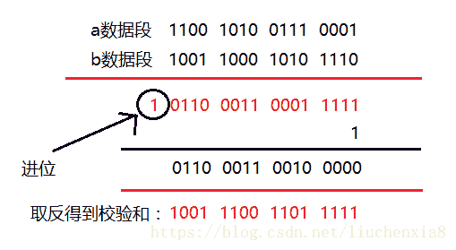
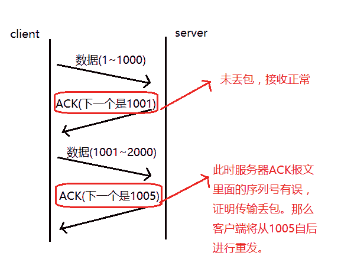
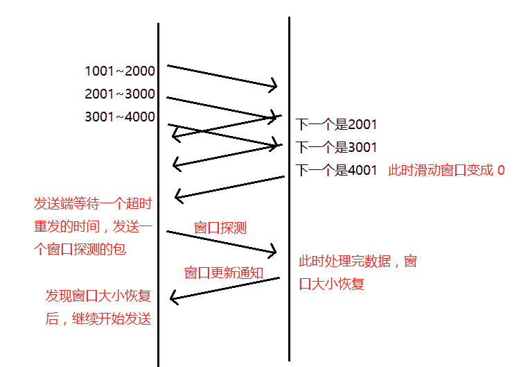
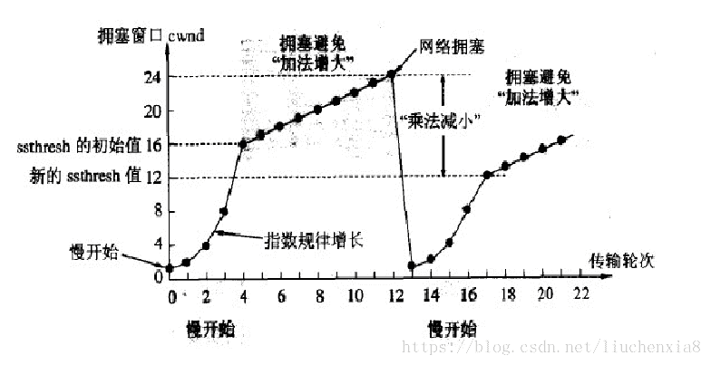

# 第七章 第 5 节 Java-计算机网络-5

> 原文：[`www.nowcoder.com/tutorial/10070/fcb3038d372b44c6b731a1561f207250`](https://www.nowcoder.com/tutorial/10070/fcb3038d372b44c6b731a1561f207250)

#### 1.22 HTTP2.0 中 TCP 阻塞了怎么办？

**参考回答**

​ HTTP2.0 中 TCP 阻塞了有如下两种方法可以解决：

​ **（1）并发 TCP 连接**（浏览器一个域名采用 6-8 个 TCP 连接，并发 HTTP 请求）
​ **（2）域名分片**（多个域名，可以建立更多的 TCP 连接，从而提高 HTTP 请求的并发）

**答案解析**

​ **1\. TCP 队头阻塞**

​ TCP 数据包是有序传输，中间一个数据包丢失，会等待该数据包重传，造成后面的数据包的阻塞。

​ **2\. HTTP 队头阻塞**

​ http 队头阻塞和 TCP 队头阻塞完全不是一回事。

​ http1.x 采用长连接(Connection:keep-alive)，可以在一个 TCP 请求上，发送多个 http 请求。

​ 有非管道化和管道化，两种方式。

​ **非管道化**，完全串行执行，请求->响应->请求->响应...，后一个请求必须在前一个响应之后发送。

​ **管道化**，请求可以并行发出，但是响应必须串行返回。后一个响应必须在前一个响应之后。原因是，没有序号标明顺序，只能串行接收。

​ **管道化请求的致命弱点**:

​ （1）会造成队头阻塞，前一个响应未及时返回，后面的响应被阻塞
​ （2）请求必须是幂等请求，不能修改资源。因为，意外中断时候，客户端需要把未收到响应的请求重发，非幂等请求，会造成资源破坏。

​ 由于这个原因，目前大部分浏览器和 Web 服务器，都关闭了管道化，采用非管道化模式。

​ 无论是非管道化还是管道化，都会造成队头阻塞(请求阻塞)。

​ **解决 http 队头阻塞的方法：**

​ **（1）并发 TCP 连接**（浏览器一个域名采用 6-8 个 TCP 连接，并发 HTTP 请求）
​ **（2）域名分片**（多个域名，可以建立更多的 TCP 连接，从而提高 HTTP 请求的并发）

**2\. HTTP2 方式**

​ http2 使用一个域名单一 TCP 连接发送请求，请求包被二进制分帧，不同请求可以互相穿插，避免了 http 层面的请求队头阻塞。
​ 但是不能避免 TCP 层面的队头阻塞。

#### 1.23 TCP 如何保证可靠性？

**参考回答**

​ TCP 协议保证数据传输可靠性的方式主要有：**校验和、序列号、确认应答、超时重传、连接管理、流量控制、拥塞控制**。

1.  校验和

    **计算方式：**在数据传输的过程中，将发送的数据段都当做一个 16 位的整数。将这些整数加起来。并且前面的进位不能丢弃，补在后面，最后取反，得到校验和。
    **发送方：**在发送数据之前计算检验和，并进行校验和的填充。
    **接收方：**收到数据后，对数据以同样的方式进行计算，求出校验和，与发送方的进行比对。

    **

    **注意：**如果接收方比对校验和与发送方不一致，那么数据一定传输有误。但是如果接收方比对校验和与发送方一致，**数据不一定传输成功。**

2.  序列号和确认应答

    **序列号：**TCP 传输时将每个字节的数据都进行了编号，这就是序列号。
    **确认应答：**TCP 传输的过程中，每次接收方收到数据后，都会对传输方进行确认应答。也就是发送 ACK 报文。这个 ACK 报文当中带有对应的确认序列号，告诉发送方，接收到了哪些数据，下一次的数据从哪里发。

    

    ​ 序列号的作用不仅仅是应答的作用，有了序列号能够将接收到的数据根据序列号排序，并且去掉重复序列号的数据。这也是 TCP 传输可靠性的保证之一。

3.  超时重传

    ​ 在进行 TCP 传输时，由于确认应答与序列号机制，也就是说发送方发送一部分数据后，都会等待接收方发送的 ACK 报文，并解析 ACK 报文，判断数据是否传输成功。如果发送方发送完数据后，迟迟没有等到接收方的 ACK 报文，这该怎么办呢？而没有收到 ACK 报文的原因可能是什么呢？

    ​ 首先，发送方没有接收到响应的 ACK 报文原因可能有两点：

    ​ （1）数据在传输过程中由于网络原因等直接全体丢包，接收方根本没有接收到。

    ​ （2）接收方接收到了响应的数据，但是发送的 ACK 报文响应却由于网络原因丢包了。

    ​ TCP 在解决这个问题的时候引入了一个新的机制，叫做超时重传机制。**简单理解就是发送方在发送完数据后等待一个时间，时间到达没有接收到 ACK 报文，那么对刚才发送的数据进行重新发送。**如果是刚才第一个原因，接收方收到二次重发的数据后，便进行 ACK 应答。如果是第二个原因，接收方发现接收的数据已存在（判断存在的根据就是序列号，所以上面说序列号还有去除重复数据的作用），那么直接丢弃，仍旧发送 ACK 应答。

4.  连接管理

    ​ 连接管理就是三次握手与四次挥手的过程，保证可靠的连接，是保证可靠性的前提。

5.  流量控制

    ​ 收端在接收到数据后，对其进行处理。如果发送端的发送速度太快，导致接收端的结束缓冲区很快的填充满了。此时如果发送端仍旧发送数据，那么接下来发送的数据都会丢包，继而导致丢包的一系列连锁反应，超时重传呀什么的。而 TCP 根据接收端对数据的处理能力，决定发送端的发送速度，这个机制就是流量控制。

    ​ 在 TCP 协议的报头信息当中，有一个 16 位字段的窗口大小。在介绍这个窗口大小时我们知道，窗口大小的内容实际上是接收端接收数据缓冲区的剩余大小。这个数字越大，证明接收端接收缓冲区的剩余空间越大，网络的吞吐量越大。接收端会在确认应答发送 ACK 报文时，将自己的即时窗口大小填入，并跟随 ACK 报文一起发送过去。而发送方根据 ACK 报文里的窗口大小的值的改变进而改变自己的发送速度。如果接收到窗口大小的值为 0，那么发送方将停止发送数据。并定期的向接收端发送窗口探测数据段，让接收端把窗口大小告诉发送端。

    

6.  拥塞控制

    ​ TCP 传输的过程中，发送端开始发送数据的时候，如果刚开始就发送大量的数据，那么就可能造成一些问题。网络可能在开始的时候就很拥堵，如果给网络中在扔出大量数据，那么这个拥堵就会加剧。拥堵的加剧就会产生大量的丢包，就对大量的超时重传，严重影响传输。

    ​ 所以 TCP 引入了慢启动的机制，在开始发送数据时，先发送少量的数据探路。探清当前的网络状态如何，再决定多大的速度进行传输。这时候就引入一个叫做拥塞窗口的概念。发送刚开始定义拥塞窗口为 1，每次收到 ACK 应答，拥塞窗口加 1。在发送数据之前，首先将拥塞窗口与接收端反馈的窗口大小比对，取较小的值作为实际发送的窗口。

    ​ 拥塞窗口的增长是指数级别的。慢启动的机制只是说明在开始的时候发送的少，发送的慢，但是增长的速度是非常快的。为了控制拥塞窗口的增长，不能使拥塞窗口单纯的加倍，设置一个拥塞窗口的阈值，当拥塞窗口大小超过阈值时，不能再按照指数来增长，而是线性的增长。在慢启动开始的时候，慢启动的阈值等于窗口的最大值，一旦造成网络拥塞，发生超时重传时，慢启动的阈值会为原来的一半（这里的原来指的是发生网络拥塞时拥塞窗口的大小），同时拥塞窗口重置为 1。

    

    ​ 拥塞控制是 TCP 在传输时尽可能快的将数据传输，并且避免拥塞造成的一系列问题。是可靠性的保证，同时也是维护了传输的高效性。

**答案解析**

​ 无

#### 1.24 说一说 TCP 里的 reset 状态。

**参考回答**

1.  TCP 异常终止（reset 报文）

    ​ TCP 的异常终止是相对于正常释放 TCP 连接的过程而言的，我们都知道，TCP 连接的建立是通过三次握手完成的，而 TCP 正常释放连接是通过四次挥手来完成，但是有些情况下，TCP 在交互的过程中会出现一些意想不到的情况，导致 TCP 无法按照正常的四次挥手来释放连接，如果此时不通过其他的方式来释放 TCP 连接的话，这个 TCP 连接将会一直存在，占用系统的部分资源。在这种情况下，我们就需要有一种能够释放 TCP 连接的机制，这种机制就是 TCP 的 reset 报文。reset 报文是指 TCP 报头的标志字段中的 reset 位置一的报文。

2.  **RST 标志位（Reset）**

    ​ RST 表示复位，用来异常的关闭连接，在 TCP 的设计中它是不可或缺的。就像上面说的一样，发送 RST 包关闭连接时，不必等缓冲区的包都发出去（不像上面的 FIN 包），直接就丢弃缓存区的包发送 RST 包。而接收端收到 RST 包后，也不必发送 ACK 包来确认。

    ​ TCP 处理程序会在自己认为的异常时刻发送 RST 包。例如，A 向 B 发起连接，但 B 之上并未监听相应的端口，这时 B 操作系统上的 TCP 处理程序会发 RST 包。

    ​ 又比如，AB 正常建立连接了，正在通讯时，A 向 B 发送了 FIN 包要求关连接，B 发送 ACK 后，网断了，A 通过若干原因放弃了这个连接（例如进程重启）。网通了后，B 又开始发数据包，A 收到后表示压力很大，不知道这野连接哪来的，就发了个 RST 包强制把连接关了，B 收到后会出现 connect reset by peer 错误。

**答案解析**

1.  TCP 异常终止的常见情形

    （1）客户端尝试与服务器未对外提供服务的端口建立 TCP 连接，服务器将会直接向客户端发送 reset 报文。

    （2）客户端和服务器的某一方在交互的过程中发生异常（如程序崩溃等），该方系统将向对端发送 TCP reset 报文，告之对方释放相关的 TCP 连接。

    （3）接收端收到 TCP 报文，但是发现该 TCP 的报文，并不在其已建立的 TCP 连接列表内，则其直接向对端发送 reset 报文。

    （4）在交互的双方中的某一方长期未收到来自对方的确认报文，则其在超出一定的重传次数或时间后，会主动向对端发送 reset 报文释放该 TCP 连接。

    （5）有些应用开发者在设计应用系统时，会利用 reset 报文快速释放已经完成数据交互的 TCP 连接，以提高业务交互的效率。

#### 1.25 如何利用 UDP 实现可靠传输？

**参考回答**

1.  实现方法：

    （1）将实现放到应用层，然后类似于 TCP，实现确认机制、重传机制和窗口确认机制；

    （2）给数据包进行编号，按顺序接收并存储，接收端收到数据包后发送确认信息给发送端，发送端接收到确认信息后继续发送，若接收端接收的数据不是期望的顺序编号，则要求重发；（主要解决丢包和包无序的问题）

2.  已经实现的可靠 UDP：

    （1）RUDP 可靠数据报传输协议；

    （2）RTP 实时传输协议

    ​ 为数据提供了具有实时特征的端对端传送服务；例如：组播或单播网络服务下的交互式视频、音频或模拟数据。

    （3）UDT

    ​ 基于 UDP 的数据传输协议，是一种互联网传输协议； 主要目的是支持高速广域网上的海量数据传输，引入了新的拥塞控制和数据可靠性控制机制（互联网上的标准数据传输协议 TCP 在高带宽长距离的网络上性能很差）；

​ UDT 是面向连接的双向的应用层协议，同时支持可靠的数据流传输和部分可靠的数据报服务；

​ 应用：高速数据传输，点到点技术(P2P)，防火墙穿透，多媒体数据传输；

**答案解析**

​ 无

#### 1.26 报文乱序怎么办？

**参考回答**

​ 数据包会因为 IP 层所规划的路由链路的不同导致数据包的接收顺序与发送顺序会有所不同。另外因为 TCP 是一种全双工的协议，乱序可能发生在正向链路，也可能发生在反向链路，这两种不同的情况给 TCP 带来的影响也会略有差异。

1.  **正向链路乱序**

    ​ **此时 TCP 会**无法判断**是数据包丢失还是乱序**，因为丢包和乱序都会导致接收端收到次序混乱的数据包，造成接收端的数据空洞。**TCP 会将这种情况暂定为数据包的乱序**，**因为乱序是时间问题（可能是数据包的迟到），而丢包则意味着重传**。当 TCP 意识到包出现乱序的情况时，会立即 ACK，该 ACK 的 TSER 部分包含的 TSEV 值会记录当前接收端收到有序报文段的时刻。这会使得数据包的 RTT 样本值增大，进一步导致 RTO 时间延长。这对 TCP 来说无疑是有益的，因为 TCP 有充分的时间判断数据包到底是失序还是丢了来防止不必要的数据重传。当然严重的乱序则会让发送端以为是丢包**一旦重复的 ACK 超过 TCP 的阈值，便会触发超时重传机制**，以及时解决这种问题。

2.  **反向链路（ACK）乱序**

    ​ 顾名思义，如果发生这种情况，就会导致发送端窗口快速前移，这会导致发送端出现不必要的流量突发，影响网络带宽。

**答案解析**

​ 无