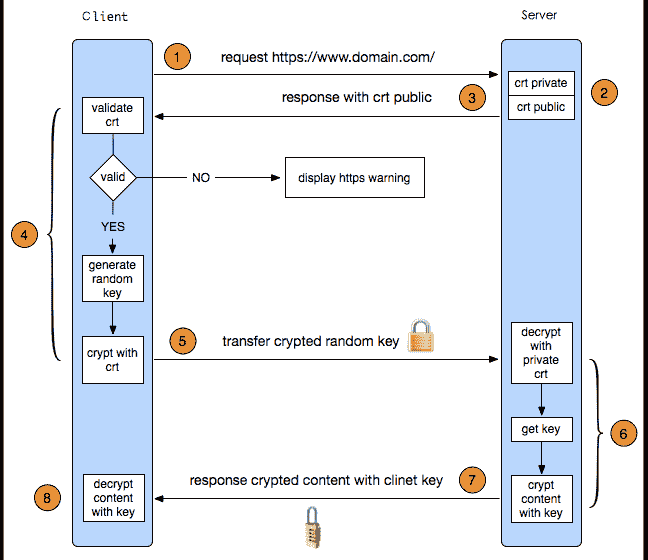
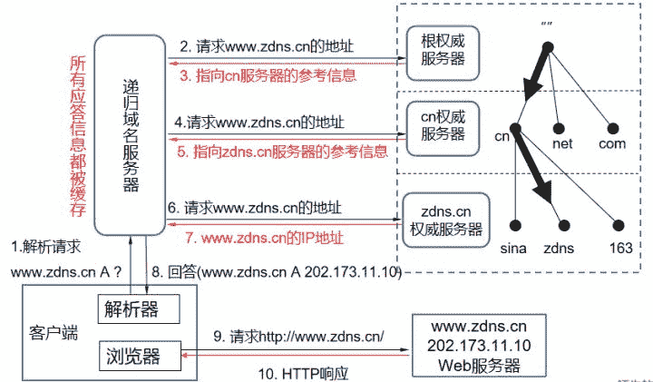
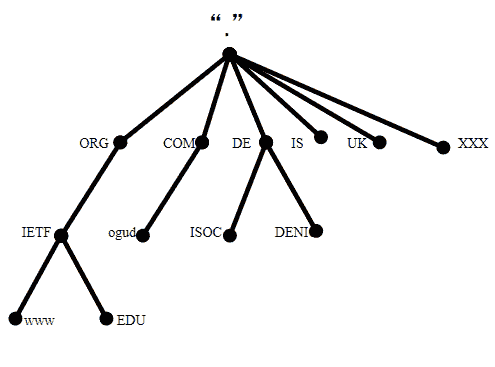
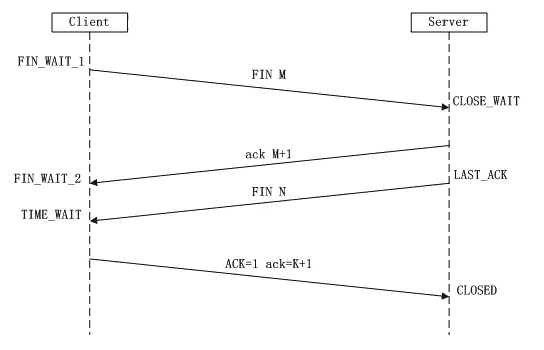

# 第七章 第 8 节 Java-计算机网络-8

> 原文：[`www.nowcoder.com/tutorial/10070/a2514d67092743ea9d48060c5165745c`](https://www.nowcoder.com/tutorial/10070/a2514d67092743ea9d48060c5165745c)

#### 1.40 介绍一下 HTTP 协议中的长连接和短连接。

**参考回答**

​ HTTP 协议的底层使用 TCP 协议，所以 HTTP 协议的长连接和短连接在本质上是 TCP 层的长连接和短连接。由于 TCP 建立连接、维护连接、释放连接都是要消耗一定的资源，浪费一定的时间。所对于服务器来说，频繁的请求释放连接会浪费大量的时间，长时间维护太多的连接的话又需要消耗资源。所以长连接和短连接并不存在优劣之分，只是适用的场合不同而已。长连接和短连接分别有如下优点和缺点：

**长连接优点：**可以节省较多的 TCP 连接和释放的操作，节约时间，对于频繁请求资源的用户来说，适合长连接。

**长连接缺点：**由于有保活功能，当遇到大量的恶意连接时，服务器的压力会越来越大。这时服务器需要采取一些策略，关闭一些长时间没有进行读写事件的的连接。

**短连接优点：**短连接对服务器来说管理比较简单，只要存在的连接都是有效连接，不需要额外的控制手段，而且不会长时间占用资源 。

**短连接缺点：**如果客户端请求频繁的话，会在 TCP 的建立和释放上浪费大量的时间。

​ **注意：**从**HTTP/1.1 版本起**，默认使用长连接用以保持连接特性。使用长连接的 HTTP 协议，会在响应消息报文段加入: Connection: keep-alive。TCP 中也有 keep alive，但是 TCP 中的 keep alive 只是探测 TCP 连接是否活着，而 HTTP 中的 keep-alive 是让一个 TCP 连接获得更久一点。

**答案解析**

​ 无

#### 1.41 介绍一下 HTTPS 的流程。

**参考回答**

​ **HTTPS 在传输的过程中会涉及到三个密钥：**服务器端的公钥和私钥，用来进行非对称加密；客户端生成的随机密钥，用来进行对称加密。一个 HTTPS 请求实际上包含了两次 HTTP 传输，如下图可以细分为以下 8 步：

1.  客户端向服务器发起 HTTPS 请求，连接到服务器的 443 端口
2.  服务器端有一个密钥对，即公钥和私钥，是用来进行非对称加密使用的，服务器端保存着私钥，不能将其泄露，公钥可以发送给任何人。
3.  服务器将自己的公钥发送给客户端。
4.  客户端收到服务器端的公钥之后，会对公钥进行检查，验证其合法性，如果发现发现公钥有问题，那么 HTTPS 传输就无法继续。严格的说，这里应该是验证服务器发送的数字证书的合法性，关于客户端如何验证数字证书的合法性，下文会进行说明。如果公钥合格，那么客户端会生成一个随机值，这个随机值就是用于进行对称加密的密钥，我们将该密钥称之为 client key，即客户端密钥，这样在概念上和服务器端的密钥容易进行区分。然后用服务器的公钥对客户端密钥进行非对称加密，这样客户端密钥就变成密文了，至此，HTTPS 中的第一次 HTTP 请求结束。
5.  客户端会发起 HTTPS 中的第二个 HTTP 请求，将加密之后的客户端密钥发送给服务器。
6.  服务器接收到客户端发来的密文之后，会用自己的私钥对其进行非对称解密，解密之后的明文就是客户端密钥，然后用客户端密钥对数据进行对称加密，这样数据就变成了密文。
7.  然后服务器将加密后的密文发送给客户端。
8.  客户端收到服务器发送来的密文，用客户端密钥对其进行对称解密，得到服务器发送的数据。这样 HTTPS 中的第二个 HTTP 请求结束，整个 HTTPS 传输完成。

**答案解析**

​ 无

#### 1.42 介绍一下 HTTP 的失败码。

**参考回答**

​ HTTP 的错误码包含**客户端错误 4XX** 和**服务端错误 5XX** ，两种错误分别如下：

1.  客户端错误 4XX

    ​ 这类的状态码是适用于客户端似乎有错误的情况。除了响应给 HEAD 请求外，服务器应该包含一个包括错误情况描述的实体，和它是暂时的还是永久性的。这些状态码适用于任何请求方法。用户代理应该展示所有包含的实体给用户。

    　如果客户端正在发送数据，使用 TCP 的服务器应该在服务器关闭输出链接时，仔细确保客户端确认收到包含响应的数据包（receipt of the packet(s) ） 。如果客户端继续在服务器关闭后发送数据，服务器的 TCP 栈将会发生一个重置包给客户端，这可能会在 HTTP 应用程序读取和解释客户端的未确认输入缓冲区（input buffers）之前将其擦除。

    **400**(错误请求) 服务器不理解请求的语法。

    **401**(未授权) 请求要求进行身份验证。登录后，服务器可能会返回对页面的此响应。

    **403**(已禁止) 服务器拒绝请求。如果在 Googlebot 尝试抓取您网站上的有效网页时显示此状态代码(您可在 Google 网站管理员工具中诊断下的网络抓取页面上看到此状态代码)，那么，这可能是您的服务器或主机拒绝 Googlebot 对其进行访问。

    **404**(未找到) 服务器找不到请求的网页。例如，如果请求是针对服务器上不存在的网页进行的，那么，服务器通常会返回此代码。

    如果您的网站上没有 robots.txt 文件，而您在 Google 网站管理员工具”诊断”标签的 robots.txt 页上发现此状态，那么，这是正确的状态。然而，如果您有 robots.txt 文件而又发现了此状态，那么，这说明您的 robots.txt 文件可能是命名错误或位于错误的位置。(该文件应当位于顶级域名上，且应当名为 robots.txt)。

    如果您在 Googlebot 尝试抓取的网址上发现此状态(位于”诊断”标签的 HTTP 错误页上)，那么，这表示 Googlebot 所追踪的可能是另一网页中的无效链接(旧链接或输入有误的链接)。

    **405**(方法禁用) 禁用请求中所指定的方法。

    **406**(不接受) 无法使用请求的内容特性来响应请求的网页。

    **407**(需要代理授权) 此状态代码与 401(未授权)类似，但却指定了请求者应当使用代理进行授权。如果服务器返回此响应，那么，服务器还会指明请求者应当使用的代理。

    **408**(请求超时) 服务器等候请求时超时。

    **409**(冲突) 服务器在完成请求时发生冲突。服务器必须包含有关响应中所发生的冲突的信息。服务器在响应与前一个请求相冲突的 PUT 请求时可能会返回此代码，同时会提供两个请求的差异列表。

    **410**(已删除) 如果请求的资源已被永久删除，那么，服务器会返回此响应。该代码与 404(未找到)代码类似，但在资源以前有但现在已经不复存在的情况下，有时会替代 404 代码出现。如果资源已被永久删除，那么，您应当使用 301 代码指定该资源的新位置。

    **411**(需要有效长度) 服务器不会接受包含无效内容长度标头字段的请求。

    **412**(未满足前提条件) 服务器未满足请求者在请求中设置的其中一个前提条件。

    **413**(请求实体过大) 服务器无法处理请求，因为请求实体过大，已超出服务器的处理能力。

    **414**(请求的 URI 过长) 请求的 URI(通常为网址)过长，服务器无法进行处理。

    **415**(不支持的媒体类型) 请求的格式不受请求页面的支持。

    **416**(请求范围不符合要求) 如果请求是针对网页的无效范围进行的，那么，服务器会返回此状态代码。

    **417**(未满足期望值) 服务器未满足”期望”请求标头字段的要求。

2.  服务端错误 5XX

    ​ 响应状态码已数字 5 开头，表明了这类服务器知道其错误或者无法执行请求的情况。出了响应 HEAD 请求外，服务器应该包括一个包含错误情况说明的实体，以及他是暂时地还是永久性的，用户代理应该将所有包含的实体展示给用户。这些响应代码适用于任何请求方法。

    **500**(服务器内部错误) 服务器遇到错误，无法完成请求。

    **501**(尚未实施) 服务器不具备完成请求的功能。例如，当服务器无法识别请求方法时，服务器可能会返回此代码。

    **502**(错误网关) 服务器作为网关或代理，从上游服务器收到了无效的响应。

    **503**(服务不可用) 目前无法使用服务器(由于超载或进行停机维护)。通常，这只是一种暂时的状态。

    **504**(网关超时) 服务器作为网关或代理，未及时从上游服务器接收请求。

    **505**(HTTP 版本不受支持) 服务器不支持请求中所使用的 HTTP 协议版本。

#### 1.43 说一说你知道的 http 状态码。

**参考回答**

​ HTTP 状态码由三个十进制数字组成，第一个十进制数字定义了状态码的类型，后两个数字没有分类的作用。HTTP 状态码共分为 5 种类型，分类及分类描述如下表：

| 分类 | 分类描述 |
| --- | --- |
| 1** | 信息，服务器收到请求，需要请求者继续执行操作 |
| 2** | 成功，操作被成功接收并处理 |
| 3** | 重定向，需要进一步的操作以完成请求 |
| 4** | 客户端错误，请求包含语法错误或无法完成请求 |
| 5** | 服务器错误，服务器在处理请求的过程中发生了错误 |

**各类别常见状态码**有如下几种：

1.  **2xx （3 种）**

    **200 OK：**表示从客户端发送给服务器的请求被正常处理并返回；

    **204 No Content：**表示客户端发送给客户端的请求得到了成功处理，但在返回的响应报文中不含实体的主体部分（没有资源可以返回）；

    **206 Patial Content：**表示客户端进行了范围请求，并且服务器成功执行了这部分的 GET 请求，响应报文中包含由 Content-Range 指定范围的实体内容。

2.  **3xx （5 种）**

    **301 Moved Permanently：**永久性重定向，表示请求的资源被分配了新的 URL，之后应使用更改的 URL；

    **302 Found：**临时性重定向，表示请求的资源被分配了新的 URL，希望本次访问使用新的 URL；

    ​ 301 与 302 的区别：前者是永久移动，后者是临时移动（之后可能还会更改 URL）

    **303 See Other：**表示请求的资源被分配了新的 URL，应使用 GET 方法定向获取请求的资源；

    302 与 303 的区别：后者明确表示客户端应当采用 GET 方式获取资源

    **304 Not Modified：**表示客户端发送附带条件（是指采用 GET 方法的请求报文中包含 if-Match、If-Modified-Since、If-None-Match、If-Range、If-Unmodified-Since 中任一首部）的请求时，服务器端允许访问资源，但是请求为满足条件的情况下返回该状态码；

    **307 Temporary Redirect：**临时重定向，与 303 有着相同的含义，307 会遵照浏览器标准不会从 POST 变成 GET；（不同浏览器可能会出现不同的情况）；

3.  **4xx （4 种）**

    **400 Bad Request：**表示请求报文中存在语法错误；

    **401 Unauthorized：**未经许可，需要通过 HTTP 认证；

    **403 Forbidden：**服务器拒绝该次访问（访问权限出现问题）

    **404 Not Found：**表示服务器上无法找到请求的资源，除此之外，也可以在服务器拒绝请求但不想给拒绝原因时使用；

4.  **5xx （2 种）**

    **500 Inter Server Error：**表示服务器在执行请求时发生了错误，也有可能是 web 应用存在的 bug 或某些临时的错误时；

    **503 Server Unavailable：**表示服务器暂时处于超负载或正在进行停机维护，无法处理请求；

**答案解析**

​ 无

#### 1.44 301 和 302 有什么区别？

**参考回答**

​ 301 和 302 的区别在于，**301 重定向是永久的重定向**，搜索引擎在抓取新内容的同时也将旧的网址交换为重定向之后的网址。**302 重定向是暂时的重定向**，搜索引擎会抓取新的内容而保存旧的网址。由于效劳器前往 302 代码，搜索引擎以为新的网址只是暂时的。

#### 1.45 302 和 304 有什么区别？

**参考回答**

​ 302 和 304 是网页请求的两个不同的响应状态码。302 （临时移动）表示 服务器目前从不同位置的网页响应请求，但请求者应继续使用原有位置来进行以后的请求。 304 （未修改）表示 自从上次请求后，请求的网页未修改过。 服务器返回此响应时，不会返回网页内容。

**答案解析**

​ 无

#### 1.46 请描述一次完整的 HTTP 请求的过程。

**参考回答**

​ DNS 解析流程图

1.  首先客户端位置是一台电脑或手机，在打开浏览器以后，比如输入[`www.zdns.cn 的域名，它首先是由浏览器发起一个 DNS 解析请求，如果本地缓存服务器中找不到结果，则首先会向根服务器查询，根服务器里面记录的都是各个顶级域所在的服务器的位置，当向根服务器请求 http://www.zdns.cn 的时候，根服务器就会返回.cn 服务器的位置信息；`](http://www.zdns.cn%E7%9A%84%E5%9F%9F%E5%90%8D%EF%BC%8C%E5%AE%83%E9%A6%96%E5%85%88%E6%98%AF%E7%94%B1%E6%B5%8F%E8%A7%88%E5%99%A8%E5%8F%91%E8%B5%B7%E4%B8%80%E4%B8%AADNS%E8%A7%A3%E6%9E%90%E8%AF%B7%E6%B1%82%EF%BC%8C%E5%A6%82%E6%9E%9C%E6%9C%AC%E5%9C%B0%E7%BC%93%E5%AD%98%E6%9C%8D%E5%8A%A1%E5%99%A8%E4%B8%AD%E6%89%BE%E4%B8%8D%E5%88%B0%E7%BB%93%E6%9E%9C%EF%BC%8C%E5%88%99%E9%A6%96%E5%85%88%E4%BC%9A%E5%90%91%E6%A0%B9%E6%9C%8D%E5%8A%A1%E5%99%A8%E6%9F%A5%E8%AF%A2%EF%BC%8C%E6%A0%B9%E6%9C%8D%E5%8A%A1%E5%99%A8%E9%87%8C%E9%9D%A2%E8%AE%B0%E5%BD%95%E7%9A%84%E9%83%BD%E6%98%AF%E5%90%84%E4%B8%AA%E9%A1%B6%E7%BA%A7%E5%9F%9F%E6%89%80%E5%9C%A8%E7%9A%84%E6%9C%8D%E5%8A%A1%E5%99%A8%E7%9A%84%E4%BD%8D%E7%BD%AE%EF%BC%8C%E5%BD%93%E5%90%91%E6%A0%B9%E6%9C%8D%E5%8A%A1%E5%99%A8%E8%AF%B7%E6%B1%82http://www.zdns.cn%E7%9A%84%E6%97%B6%E5%80%99%EF%BC%8C%E6%A0%B9%E6%9C%8D%E5%8A%A1%E5%99%A8%E5%B0%B1%E4%BC%9A%E8%BF%94%E5%9B%9E.cn%E6%9C%8D%E5%8A%A1%E5%99%A8%E7%9A%84%E4%BD%8D%E7%BD%AE%E4%BF%A1%E6%81%AF%EF%BC%9B)
2.  递归服务器拿到.cn 的权威服务器地址以后，就会寻问.cn 的权威服务器，知不知道[`www.zdns.cn 的位置。这个时候.cn 权威服务器查找并返回 http://zdns.cn 服务器的地址；`](http://www.zdns.cn%E7%9A%84%E4%BD%8D%E7%BD%AE%E3%80%82%E8%BF%99%E4%B8%AA%E6%97%B6%E5%80%99.cn%E6%9D%83%E5%A8%81%E6%9C%8D%E5%8A%A1%E5%99%A8%E6%9F%A5%E6%89%BE%E5%B9%B6%E8%BF%94%E5%9B%9Ehttp://zdns.cn%E6%9C%8D%E5%8A%A1%E5%99%A8%E7%9A%84%E5%9C%B0%E5%9D%80%EF%BC%9B)
3.  继续向[`zdns.cn 的权威服务器去查询这个地址，由 http://zdns.cn 的服务器给出了地址：202.173.11.10；`](http://zdns.cn%E7%9A%84%E6%9D%83%E5%A8%81%E6%9C%8D%E5%8A%A1%E5%99%A8%E5%8E%BB%E6%9F%A5%E8%AF%A2%E8%BF%99%E4%B8%AA%E5%9C%B0%E5%9D%80%EF%BC%8C%E7%94%B1http://zdns.cn%E7%9A%84%E6%9C%8D%E5%8A%A1%E5%99%A8%E7%BB%99%E5%87%BA%E4%BA%86%E5%9C%B0%E5%9D%80%EF%BC%9A202.173.11.10%EF%BC%9B)
4.  最终进入 http 的链接，顺利访问网站；

**补充说明**：一旦递归服务器拿到解析记录以后，就会在本地进行缓存，如果下次客户端再请求本地的递归域名服务器相同域名的时候，就不会再这样一层一层查了，因为本地服务器里面已经有缓存了，这个时候就直接把[`www.zdns.cn 的记录返回给客户端就可以了。`](http://www.zdns.cn%E7%9A%84%E8%AE%B0%E5%BD%95%E8%BF%94%E5%9B%9E%E7%BB%99%E5%AE%A2%E6%88%B7%E7%AB%AF%E5%B0%B1%E5%8F%AF%E4%BB%A5%E4%BA%86%E3%80%82)

#### 1.47 什么是重定向？

**参考回答**

​ **重定向(Redirect)**就是通过各种方法将各种网络请求重新定个方向转到其它位置（如：网页重定向、域名的重定向、路由选择的变化也是对数据报文经由路径的一种重定向）。

**答案解析**

1.  需要重定向的情况

    （1）网站调整（如改变网页目录结构）；

    （2）网页被移到一个新地址；

    （3）网页扩展名改变(如应用需要把.php 改成.Html 或.shtml)。

    这几种情况下，如果不做重定向，则用户收藏夹或搜索引擎数据库中旧地址只能让访问客户得到一个 404 页面错误信息，访问流量白白丧失；再者某些注册了多个域名的网站，也需要通过重定向让访问这些域名的用户自动跳转到主站点等。

2.  常用的重定向的方式

    （1）301 redirect-----永久性转移

    ​ 当用户或搜索引擎向网站服务器发出浏览请求时，服务器返回的 HTTP 数据流中头信息(header)中的状态码的一种，表示本网页永久性转移到另一个地址。

    （2）302 redirect-----暂时性转移 (Temporarily Moved )

    ​ 也被认为是**暂时重定向**（temporary redirect），一条对网站浏览器的指令来显示浏览器被要求显示的不同的 URL，当一个网页经历过短期的 URL 的变化时使用。一个暂时重定向是一种服务器端的重定向，能够被搜索引擎蜘蛛正确地处理。

3.  新旧重定向方式的区别

    ​ **302 重定向是暂时的重定向**，搜索引擎会抓取新的内容而保存旧的网址。由于效劳器前往 302 代码，搜索引擎以为新的网址只是暂时的；

    ​ **301 重定向是永久的重定向**，搜索引擎在抓取新内容的同时也将旧的网址交换为重定向之后的网址。

4.  为什么 302 重定向和网址劫持有关联

    ​ 从网址 A 做一个 302 重定向到网址 B 时，主机服务器的隐含意思是网址 A 随时有可能改主意，重新显示本身的内容或转向其他的地方。大部分的搜索引擎在大部分情况下，当收到 302 重定向时，一般只要去抓取目标网址就可以了，也就是说网址 B。如果搜索引擎在遇到 302 转向时，百分之百的都抓取目标网址 B 的话，就不用担心网址 URL 劫持了。问题就在于，有的时候搜索引擎，尤其是 Google，并不能总是抓取目标网址。

    ​ 比如说，有的时候 A 网址很短，但是它做了一个 302 重定向到 B 网址，而 B 网址是一个很长的乱七八糟的 URL 网址，甚至还有可能包含一些问号之类的参数。很自然的，A 网址更加用户友好，而 B 网址既难看，又不用户友好。这时 Google 很有可能会仍然显示网址 A。由于搜索引擎排名算法只是程序而不是人，在遇到 302 重定向的时候，并不能像人一样的去准确判定哪一个网址更适当，这就造成了网址 URL 劫持的可能性。也就是说，一个不道德的人在他自己的网址 A 做一个 302 重定向到你的网址 B，出于某种原因， Google 搜索结果所显示的仍然是网址 A，但是所用的网页内容却是你的网址 B 上的内容，这种情况就叫做网址 URL 劫持。你辛辛苦苦所写的内容就这样被别人偷走了。

    ​ 302 重定向所造成的网址 URL 劫持现象，已经存在一段时间了。不过到目前为止，似乎也没有什么更好的解决方法。在正在进行的数据中心转换中，302 重定向问题也是要被解决的目标之一。从一些搜索结果来看，网址劫持现象有所改善，但是并没有完全解决。

#### 1.48 重定向和请求转发有什么区别？

**参考回答**

1.  请求转发

    ​ 客户首先发送一个请求到服务器端，服务器端发现匹配的 servlet，并指定它去执行，当这个 servlet 执行完之后，它要调用 getRequestDispacther()方法，把请求转发给指定的 student_list.jsp,整个流程都是在服务器端完成的，而且是在同一个请求里面完成的，因此 servlet 和 jsp 共享的是同一个 request，在 servlet 里面放的所有东西，在 student_list 中都能取出来，因此，student_list 能把结果 getAttribute()出来，getAttribute()出来后执行完把结果返回给客户端。整个过程是一个请求，一个响应。

2.  重定向

    ​ 客户发送一个请求到服务器，服务器匹配 servlet，servlet 处理完之后调用了 sendRedirect()方法，立即向客户端返回这个响应，响应行告诉客户端你必须要再发送一个请求，去访问 student_list.jsp，紧接着客户端收到这个请求后，立刻发出一个新的请求，去请求 student_list.jsp,这里两个请求互不干扰，相互独立，在前面 request 里面 setAttribute()的任何东西，在后面的 request 里面都获得不了。可见，在 sendRedirect()里面是两个请求，两个响应。（服务器向浏览器发送一个 302 状态码以及一个 location 消息头，浏览器收到请求后会向再次根据重定向地址发出请求）

3.  **二者区别**

    （1）请求次数：重定向是浏览器向服务器发送一个请求并收到响应后再次向一个新地址发出请求，转发是服务器收到请求后为了完成响应跳转到一个新的地址；重定向至少请求两次，转发请求一次；

    （2）地址栏不同：重定向地址栏会发生变化，转发地址栏不会发生变化；

    （3）是否共享数据：重定向两次请求不共享数据，转发一次请求共享数据（在 request 级别使用信息共享，使用重定向必然出错）；

    （4）跳转限制：重定向可以跳转到任意 URL，转发只能跳转本站点资源；

    （5）发生行为不同：重定向是客户端行为，转发是服务器端行为。

**答案解析**

​ 无

#### 1.49 介绍一下 DNS 寻址的过程。

**参考回答**

​ DNS 解析流程图

1.  首先客户端位置是一台电脑或手机，在打开浏览器以后，比如输入[`www.zdns.cn 的域名，它首先是由浏览器发起一个 DNS 解析请求，如果本地缓存服务器中找不到结果，则首先会向根服务器查询，根服务器里面记录的都是各个顶级域所在的服务器的位置，当向根服务器请求 http://www.zdns.cn 的时候，根服务器就会返回.cn 服务器的位置信息；`](http://www.zdns.cn%E7%9A%84%E5%9F%9F%E5%90%8D%EF%BC%8C%E5%AE%83%E9%A6%96%E5%85%88%E6%98%AF%E7%94%B1%E6%B5%8F%E8%A7%88%E5%99%A8%E5%8F%91%E8%B5%B7%E4%B8%80%E4%B8%AADNS%E8%A7%A3%E6%9E%90%E8%AF%B7%E6%B1%82%EF%BC%8C%E5%A6%82%E6%9E%9C%E6%9C%AC%E5%9C%B0%E7%BC%93%E5%AD%98%E6%9C%8D%E5%8A%A1%E5%99%A8%E4%B8%AD%E6%89%BE%E4%B8%8D%E5%88%B0%E7%BB%93%E6%9E%9C%EF%BC%8C%E5%88%99%E9%A6%96%E5%85%88%E4%BC%9A%E5%90%91%E6%A0%B9%E6%9C%8D%E5%8A%A1%E5%99%A8%E6%9F%A5%E8%AF%A2%EF%BC%8C%E6%A0%B9%E6%9C%8D%E5%8A%A1%E5%99%A8%E9%87%8C%E9%9D%A2%E8%AE%B0%E5%BD%95%E7%9A%84%E9%83%BD%E6%98%AF%E5%90%84%E4%B8%AA%E9%A1%B6%E7%BA%A7%E5%9F%9F%E6%89%80%E5%9C%A8%E7%9A%84%E6%9C%8D%E5%8A%A1%E5%99%A8%E7%9A%84%E4%BD%8D%E7%BD%AE%EF%BC%8C%E5%BD%93%E5%90%91%E6%A0%B9%E6%9C%8D%E5%8A%A1%E5%99%A8%E8%AF%B7%E6%B1%82http://www.zdns.cn%E7%9A%84%E6%97%B6%E5%80%99%EF%BC%8C%E6%A0%B9%E6%9C%8D%E5%8A%A1%E5%99%A8%E5%B0%B1%E4%BC%9A%E8%BF%94%E5%9B%9E.cn%E6%9C%8D%E5%8A%A1%E5%99%A8%E7%9A%84%E4%BD%8D%E7%BD%AE%E4%BF%A1%E6%81%AF%EF%BC%9B)
2.  递归服务器拿到.cn 的权威服务器地址以后，就会寻问.cn 的权威服务器，知不知道[`www.zdns.cn 的位置。这个时候.cn 权威服务器查找并返回 http://zdns.cn 服务器的地址；`](http://www.zdns.cn%E7%9A%84%E4%BD%8D%E7%BD%AE%E3%80%82%E8%BF%99%E4%B8%AA%E6%97%B6%E5%80%99.cn%E6%9D%83%E5%A8%81%E6%9C%8D%E5%8A%A1%E5%99%A8%E6%9F%A5%E6%89%BE%E5%B9%B6%E8%BF%94%E5%9B%9Ehttp://zdns.cn%E6%9C%8D%E5%8A%A1%E5%99%A8%E7%9A%84%E5%9C%B0%E5%9D%80%EF%BC%9B)
3.  继续向[`zdns.cn 的权威服务器去查询这个地址，由 http://zdns.cn 的服务器给出了地址：202.173.11.10；`](http://zdns.cn%E7%9A%84%E6%9D%83%E5%A8%81%E6%9C%8D%E5%8A%A1%E5%99%A8%E5%8E%BB%E6%9F%A5%E8%AF%A2%E8%BF%99%E4%B8%AA%E5%9C%B0%E5%9D%80%EF%BC%8C%E7%94%B1http://zdns.cn%E7%9A%84%E6%9C%8D%E5%8A%A1%E5%99%A8%E7%BB%99%E5%87%BA%E4%BA%86%E5%9C%B0%E5%9D%80%EF%BC%9A202.173.11.10%EF%BC%9B)
4.  最终进入 http 的链接，顺利访问网站；

**补充说明**：一旦递归服务器拿到解析记录以后，就会在本地进行缓存，如果下次客户端再请求本地的递归域名服务器相同域名的时候，就不会再这样一层一层查了，因为本地服务器里面已经有缓存了，这个时候就直接把[`www.zdns.cn 的记录返回给客户端就可以了。`](http://www.zdns.cn%E7%9A%84%E8%AE%B0%E5%BD%95%E8%BF%94%E5%9B%9E%E7%BB%99%E5%AE%A2%E6%88%B7%E7%AB%AF%E5%B0%B1%E5%8F%AF%E4%BB%A5%E4%BA%86%E3%80%82)

**答案解析**

1.  什么是 DNS

    ​ DNS 就是域名系统，是因特网中的一项核心服务，是用于实现域名和 IP 地址相互映射的一个分布式数据库，能够使用户更方便的访问互联网，而不用去记住能够被机器直接读取的 IP 数串。通过主机名，得到该主机名对应的 IP 地址的过程叫做域名解析（或主机名解析）。

2.  域名解析结构

    

    ​ 如上图所示，域名结构是树状结构，树的最顶端代表根服务器，根的下一层就是由我们所熟知的.com、.net、.cn 等通用域和.cn、.uk 等国家域组成，称为顶级域。网上注册的域名基本都是二级域名，比如[`baidu.com、http://taobao.com 等等二级域名，它们基本上是归企业和运维人员管理。接下来是三级或者四级域名，这里不多赘述。总体概括来说域名是由整体到局部的机制结构。`](http://baidu.com%E3%80%81http://taobao.com%E7%AD%89%E7%AD%89%E4%BA%8C%E7%BA%A7%E5%9F%9F%E5%90%8D%EF%BC%8C%E5%AE%83%E4%BB%AC%E5%9F%BA%E6%9C%AC%E4%B8%8A%E6%98%AF%E5%BD%92%E4%BC%81%E4%B8%9A%E5%92%8C%E8%BF%90%E7%BB%B4%E4%BA%BA%E5%91%98%E7%AE%A1%E7%90%86%E3%80%82%E6%8E%A5%E4%B8%8B%E6%9D%A5%E6%98%AF%E4%B8%89%E7%BA%A7%E6%88%96%E8%80%85%E5%9B%9B%E7%BA%A7%E5%9F%9F%E5%90%8D%EF%BC%8C%E8%BF%99%E9%87%8C%E4%B8%8D%E5%A4%9A%E8%B5%98%E8%BF%B0%E3%80%82%E6%80%BB%E4%BD%93%E6%A6%82%E6%8B%AC%E6%9D%A5%E8%AF%B4%E5%9F%9F%E5%90%8D%E6%98%AF%E7%94%B1%E6%95%B4%E4%BD%93%E5%88%B0%E5%B1%80%E9%83%A8%E7%9A%84%E6%9C%BA%E5%88%B6%E7%BB%93%E6%9E%84%E3%80%82)

#### 1.50 说一说你对 TIME_WAIT 的理解。

**参考回答**

1.  出现 TIME_WAIT 的状态原因

    ​ TIME_WAIT 状态之所以存在,是为了保证网络的可靠性。由于 TCP 连接是双向的，所以在关闭连接的时候，两个方向各自都需要关闭。先发 FIN 包的一方执行的是主动关闭，后发送 FIN 包的一方执行的是被动关闭。主动关闭的一方会进入 TIME_WAIT 状态，并且在此状态停留 2MSL 时长。如果 Server 端一直没有向 client 端发送 FIN 消息(调用 close() API)，那么这个 CLOSE_WAIT 会一直存在下去。

2.  MSL 概念

    ​ 其指的是报文段的最大生存时间。如果报文段在网络中活动了 MSL 时间，还没有被接收，那么就会被丢弃。关于 MSL 的大小，RFC 793 协议中给出的建议是 2 分钟，不过 Linux 中，通常是半分钟。

3.  TIME_WAIT 持续两个 MSL 的作用

    ​ 首先，可靠安全地关闭 TCP 连接。比如网络拥塞，如果主动关闭方最后一个 ACK 没有被被动关闭方接收到，这时被动关闭方会对 FIN 进行超时重传，在这时尚未关闭的 TIME_WAIT 就会把这些尾巴问题处理掉，不至于对新连接及其他服务产生影响。其次，防止由于没有持续 TIME_WAIT 时间导致的新的 TCP 连接建立起来，延迟的 FIN 重传包会干扰新的连接。

4.  TIME_WAIT 占用的资源

    ​ 少量内存（大概 4K）和一个文件描述符 fd。

5.  TIME_WAIT 关闭的危害

    ​ 首先，当网络情况不好时，如果主动方无 TIME_WAIT 等待，关闭前个连接后，主动方与被动方又建立起新的 TCP 连接，这时被动方重传或延时过来的 FIN 包到达后会直接影响新的 TCP 连接；其次，当网络情况不好时，同时没有 TIME_WAIT 等待时，关闭连接后无新连接，那么当接收到被动方重传或延迟的 FIN 包后，会给被动方回送一个 RST 包，可能会影响被动方其他的服务连接。

**答案解析**

当 client 端传输完成数据，或者需要断开连接时：

1.  Client 端发送一个 FIN 报文给 Server 端。表示要终止 Client 到 Server 这个方向的连接。通过调用 close(socket) API。表示 Client 不再会发送数据到 Server 端。(但 Server 还能继续发给 Client 端)。Client 状态变为 FIN_WAIT_1。

2.  Server 端收到 FIN 后，发送一个 ACK 报文给 Client 端(序号为 M+1)。Server 状态变为 CLOSE_WAIT，Client 收到序号为(M+1)的 ACK 后状态变为 FIN_WAIT_2。Server 端也发送一个 FIN 报文给 Client 端。(序号为 N)
    表示 Server 也要终止到 Client 端这个方向的连接。通过调用 close(socket) API。Server 端状态变为 LAST_ACK。

3.  Client 端收到报文 FIN 后，也发送一个 ACK 报文给服务器。(序号 N+1)，Client 状态变为 TIME_WAIT。

4.  Server 端收到序号为(N+1)的 ACK， Server 的状态变为 CLOSED。

5.  等带 2MSL 之后，Client 的状态也变为 CLOSE。

至此，一个完整的 TCP 连接就关闭了。

#### 1.51 TIME_WAIT、CLOSE_WAIT 状态发生在哪一步？

**参考回答**

1.  **TIME_WAIT 状态**发生在客户端主动关闭连接时，发送最后一个 ack 后；**CLOSE_WAIT 状态**发生在在 Sever 端收到 Client 的 FIN 消息之后。

2.  出现 TIME_WAIT 的状态原因

    ​ TIME_WAIT 状态之所以存在,是为了保证网络的可靠性。由于 TCP 连接是双向的，所以在关闭连接的时候，两个方向各自都需要关闭。先发 FIN 包的一方执行的是主动关闭，后发送 FIN 包的一方执行的是被动关闭。主动关闭的一方会进入 TIME_WAIT 状态，并且在此状态停留 2MSL 时长。如果 Server 端一直没有向 client 端发送 FIN 消息(调用 close() API)，那么这个 CLOSE_WAIT 会一直存在下去。

3.  出现 CLOSE_WAIT 的状态原因

    ​ 假设最终的 ACK 丢失，server 将重发 FIN，client 必须维护 TCP 状态信息以便可以重发最终的 ACK，否则会发送 RST，结果 server 认为发生错误。TCP 实现必须可靠地终止连接的两个方向(全双工关闭)，client 必须进入 TIME_WAIT 状态，因为 client 可能面临重发最终 ACK 的情形。

4.  为什么 TIME_WAIT 状态需要保持 2MSL 这么长的时间？

    ​ 如果 TIME_WAIT 状态保持时间不足够长(比如小于 2MSL)，第一个连接就正常终止了。第二个拥有相同相关五元组的连接出现，而第一个连接的重复报文到达，干扰了第二个连接。TCP 实现必须防止某个连接的重复报文在连接终止后出现，所以让 TIME_WAIT 状态保持时间足够长(2MSL)，连接相应方向上的 TCP 报文要么完全响应完毕，要么被丢弃。建立第二个连接的时候，不会混淆。

**答案解析**

当 client 端传输完成数据，或者需要断开连接时：

1.  Client 端发送一个 FIN 报文给 Server 端。表示要终止 Client 到 Server 这个方向的连接。通过调用 close(socket) API。表示 Client 不再会发送数据到 Server 端。(但 Server 还能继续发给 Client 端)。Client 状态变为 FIN_WAIT_1。

2.  Server 端收到 FIN 后，发送一个 ACK 报文给 Client 端(序号为 M+1)。Server 状态变为 CLOSE_WAIT，Client 收到序号为(M+1)的 ACK 后状态变为 FIN_WAIT_2。Server 端也发送一个 FIN 报文给 Client 端。(序号为 N)
    表示 Server 也要终止到 Client 端这个方向的连接。通过调用 close(socket) API。Server 端状态变为 LAST_ACK。

3.  Client 端收到报文 FIN 后，也发送一个 ACK 报文给服务器。(序号 N+1)，Client 状态变为 TIME_WAIT。

4.  Server 端收到序号为(N+1)的 ACK， Server 的状态变为 CLOSED。

5.  等带 2MSL 之后，Client 的状态也变为 CLOSE。

至此，一个完整的 TCP 连接就关闭了。