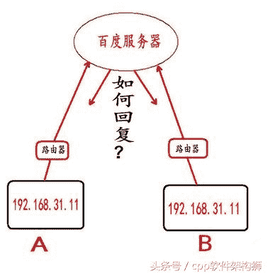
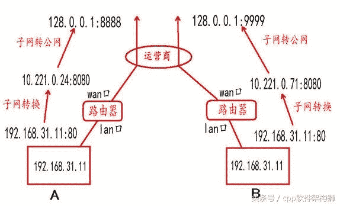

# 第七章 第 10 节 Java-计算机网络-10

> 原文：[`www.nowcoder.com/tutorial/10070/0171ecce875e4c119c0ec31822410a0f`](https://www.nowcoder.com/tutorial/10070/0171ecce875e4c119c0ec31822410a0f)

#### 1.56 对路由协议是否有所了解？

**参考回答**

​ 有了解。

1.  路由协议定义

    ​ **路由协议**（英语：Routing protocol）是一种指定数据包转送方式的网上协议。Internet 网络的主要节点设备是路由器，路由器通过路由表来转发接收到的数据。转发策略可以是人工指定的（通过静态路由、策略路由等方法）。在具有较小规模的网络中，人工指定转发策略没有任何问题。但是在具有较大规模的网络中（如跨国企业网络、ISP 网络），如果通过人工指定转发策略，将会给网络管理员带来巨大的工作量，并且在管理、维护路由表上也变得十分困难。为了解决这个问题，动态路由协议应运而生。动态路由协议可以让路由器自动学习到其他路由器的网络，并且网络拓扑发生改变后自动更新路由表。网络管理员只需要配置动态路由协议即可，相比人工指定转发策略，工作量大大减少。

2.  原理

    ​ 路由协议通过在路由器之间共享路由信息来支持可路由协议。路由信息在相邻路由器之间传递，确保所有路由器知道到其它路由器的路径。总之，路由协议创建了路由表，描述了网络拓扑结构；路由协议与路由器，执行路由选择和数据包转发功能。

3.  路由器的作用以及常见的路由协议

    ​ **路由协议主要运行于路由器上，路由协议是用来确定到达路径的，起到一个地图导航，负责找路的作用。**它工作在网络层。它包括 RIP，IGRP（Cisco 私有协议），EIGRP（Cisco 私有协议），OSPF，IS-IS，BGP。以下为这六个协议的详细说明：

    （1）RIP（路由信息协议）

    ​ RIP 很早就被用在 Internet 上，是**最简单的路由协议**。它是“路由信息协议（Route Information Protocol）”的简写，主要传递路由信息，通过每隔 30 秒广播一次路由表，维护相邻路由器的位置关系，同时根据收到的路由表信息计算自己的路由表信息。RIP 是一个**距离矢量路由协议**，最大跳数为 15 跳，超过 15 跳的网络则认为目标网络不可达。此协议通常用在网络架构较为简单的小型网络环境。分为 RIPv1 和 RIPv2 两个版本，后者支持 VLSM 技术以及一系列技术上的改进。RIP 的收敛速度较慢。

    （2）IGRP（内部网关路由协议）

    ​ IGRP 协议是“内部网关路由协议（Interior Gateway Routing Protocol）”的缩写，由 Cisco 于二十世纪八十年代独立开发，属于 Cisco 私有协议。IGRP 和 RIP 一样，同属距离矢量路由协议，因此在诸多方面有着相似点，如 IGRP 也是周期性的广播路由表，也存在最大跳数（默认为 100 跳，达到或超过 100 跳则认为目标网络不可达）。IGRP 最大的特点是使用了混合度量值，同时考虑了链路的带宽、延迟、负载、MTU、可靠性 5 个方面来计算路由的度量值，而不像其他 IGP 协议单纯的考虑某一个方面来计算度量值。IGRP 已经被 Cisco 独立开发的 EIGRP 协议所取代，版本号为 12.3 及其以上的 Cisco IOS（Internetwork Operating System）已经不支持该协议，已经罕有运行 IGRP 协议的网络。

    （3）EIGRP（增强型内部网关路由协议）

    ​ 由于 IGRP 协议的种种缺陷以及不足，Cisco 开发了 EIGRP 协议（增强型内部网关路由协议）来取代 IGRP 协议。EIGRP 属于高级距离矢量路由协议（又称混合型路由协议），继承了 IGRP 的混合度量值，最大特点在于引入了非等价负载均衡技术，并拥有极快的收敛速度。EIGRP 协议在 Cisco 设备网络环境中广泛部署。

    （4）OSPF（开放式最短路径优先）

    ​ OSPF 协议是“开放式最短路径优先（Open Shortest Path First）”的缩写，属于链路状态路由协议。OSPF 提出了“区域（area）”的概念，每个区域中所有路由器维护着一个相同的链路状态数据库（LSDB）。区域又分为骨干区域（骨干区域的编号必须为 0）和非骨干区域（非 0 编号区域），如果一个运行 OSPF 的网络只存在单一区域，则该区域可以是骨干区域或者非骨干区域。如果该网络存在多个区域，那么必须存在骨干区域，并且所有非骨干区域必须和骨干区域直接相连。OSPF 利用所维护的链路状态数据库，通过最短路径优先算法（SPF 算法）计算得到路由表。OSPF 的收敛速度较快。由于其特有的开放性以及良好的扩展性，OSPF 协议在各种网络中广泛部署。

    （5）IS-IS（中间系统到中间系统）

    ​ IS-IS 协议是 Intermediate system to intermediate system（中间系统到中间系统）的缩写，属于链路状态路由协议。标准 IS-IS 协议是由国际标准化组织制定的 ISO/IEC 10589:2002 所定义的，标准 IS-IS 不适合用于 IP 网络，因此 IETF 制定了适用于 IP 网络的集成化 IS-IS 协议（Integrated IS-IS）。和 OSPF 相同，IS-IS 也使用了“区域”的概念，同样也维护着一份链路状态数据库，通过最短生成树算法（SPF）计算出最佳路径。IS-IS 的收敛速度较快。集成化 IS-IS 协议是 ISP 骨干网上最常用的 IGP 协议。

    （6）BGP（边界网关协议）

    ​ 为了维护各个 ISP 的独立利益，标准化组织制定了 ISP 间的路由协议 BGP。BGP 是“边界网关协议（Border Gateway Protocol）”的缩写，处理各 ISP 之间的路由传递。但是 BGP 运行在相对核心的地位，需要用户对网络的结构有相当的了解，否则可能会造成较大损失。

**答案解析**

​ 无

#### 1.57 直播可能需要使用到什么样的协议？

**参考回答**

​ 视频直播有多种协议，使用 rtmp 协议的就是 rtmp 直播。直播流就是视频流，即传递的视频数据。常见的协议有**RTMP、RTSP、HTTP 协议**，这三个协议都属于互联网**TCP/IP 五层体系结构中应用层**的协议。理论上这三种都可以用来做视频直播或点播。但通常来说，**直播一般用 RTMP、RTSP，而点播用 HTTP。**下面分别介绍下三者的特点。

1.  RTMP 协议

    （1）是流媒体协议；

    （2）RTMP 协议是 Adobe 的私有协议，未完全公开；

    （3）RTMP 协议一般传输的是 flv，f4v 格式流；

    （4）RTMP 一般在 TCP1 个通道上传输命令和数据。

2.  RTSP 协议

    （1）是流媒体协议；

    （2）RTSP 协议是共有协议，并有专门机构做维护；

    （3）RTSP 协议一般传输的是 ts、mp4 格式的流；

    （4）RTSP 传输一般需要 2-3 个通道，命令和数据通道分离。

3.  HTTP 协议

    （1）不是是流媒体协议；

    （2）HTTP 协议是共有协议，并有专门机构做维护；

    （3）HTTP 协议没有特定的传输流；

    （4）HTTP 传输一般需要 2-3 个通道，命令和数据通道分离。

**答案解析**

​ **扩展资料**

​ 一个完整的视频直播过程，包括**采集、处理、编码、封装、推流、传输、转码、分发、解码、播放等**。

1.  采集

    ​ 音频采集音频的采集过程主要通过设备将环境中的模拟信号采集成 PCM 编码的原始数据，然后编码压缩成 MP3 等格式的数据分发出去。常见的音频压缩格式有：MP3，AAC，HE-AAC，Opus，FLAC，Vorbis (Ogg)，Speex 和 AMR 等。

    ​ 图像采集 图像的采集过程主要由摄像头等设备拍摄成 YUV 编码的原始数据，然后经过编码压缩成 H.264 等格式的数据分发出去。常见的视频封装格式有：MP4、3GP、AVI、MKV、WMV、MPG、VOB、FLV、SWF、MOV、RMVB 和 WebM 等。

2.  处理

    ​ 视频或者音频完成采集之后得到原始数据，为了增强一些现场效果或者加上一些额外的效果，我们一般会在将其编码压缩前进行处理。

    ​ 视频：美颜、水印、路径、自定义。

    ​ 音频：混音、降噪、特效、自定义。

3.  编码

    ​ 对流媒体传输来说，编码非常重要，它的编码性能、编码速度和编码压缩比会直接影响整个流媒体传输的用户体验和传输成本。

    ​ 常见的视频编码器：

    ​ （1）H.264/AVC

    ​ （2）HEVC/H.265

    ​ （3）VP8

    ​ （4）VP9

    ​ （5）FFmpeg

    ​ 音频编码器：Mp3, AAC 等。

4.  封装

    ​ 把编码器生成的多媒体内容(视频，音频，字幕，章节信息等)混合封装在一起几种常见的封装格式：

    ​ （1）AVI 格式(后缀为 .avi)

    ​ （2）DV-AVI 格式(后缀为 .avi)

    ​ （3）QuickTime File Format 格式(后缀为 .mov)

    ​ （4）MPEG 格式(文件后缀可以是 .mpg .mpeg .mpe .dat .vob .asf .3gp .mp4 等)

    ​ （5）WMV 格式(后缀为.wmv .asf)

    ​ （6）Real Video 格式(后缀为 .rm .rmvb)

    ​ （7）Flash Video 格式(后缀为 .flv)

    ​ （8）Matroska 格式(后缀为 .mkv)

    ​ （9）MPEG2-TS 格式 (后缀为 .ts)

    ​ 目前，我们在流媒体传输，尤其是直播中主要采用的就是 FLV 和 MPEG2-TS 格式，分别用于 RTMP/HTTP-FLV 和 HLS 协议。

5.  推流

    ​ 推流是指使用推流工具等内容抓取软件把直播内容传输到服务器的过程。推送协议主要有三种：

    ​ （1）RTSP(Real Time Streaming Protocol)：实时流传送协议，是用来控制声音或影像的多媒体串流协议, 由 Real Networks 和 Netscape 共同提出的;

    ​ （2）RTMP(Real Time Messaging Protocol)：实时消息传送协议，是 Adobe 公司为 Flash 播放器和服务器之间音频、视频和数据传输 开发的开放协议;

    ​ （3）HLS(HTTP Live Streaming)：是苹果公司(Apple Inc.)实现的基于 HTTP 的流媒体传输协议;RTMP 是目前主流的流媒体传输协议，广泛用于直播领域，市面上绝大多数的直播产品都采用了这个协议。

    ​ RTMP 协议基于 TCP，是一种设计用来进行实时数据通信的网络协议，主要用来在 flash/AIR 平台和支持 RTMP 协议的流媒体/交互服务器之间进行音视频和数据通信。支持该协议的软件包括 Adobe Media Server/Ultrant Media Server/red5 等。它有三种变种：

    ​ （1）RTMP 工作在 TCP 之上的明文协议，使用端口 1935；

    ​ （2）RTMPT 封装在 HTTP 请求之中，可穿越防火墙;

    ​ （3）RTMPS 类似 RTMPT，但使用的是 HTTPS 连接;

    ​ RTMP 协议就像一个用来装数据包的容器，这些数据可以是 AMF 格式的数据,也可以是 FLV 中的视/音频数据。一个单一的连接可以通过不同的通道传输多路网络流。这些通道中的包都是按照固定大小的包传输的。

6.  传输

    ​ 推送出去的流媒体需要传输到观众，整个链路就是传输网络。

7.  转码

    ​ 视频直播播流端的码率是根据推流端决定的，即播流端的码率是与推流端的码率一致的。但是遇到以下场景会造成直播效果较差：推流端码率与播流端带宽不相匹配。当推流端码率较高而客户端带宽资源有限就会导致播放出现卡顿，而当推流端码率较低但是客户端对于直播效率要求较高时会导致播放效果较差。播放器插件需要实现多码率切换。前端播放器插件常可以设置码率切换，这就需要同一路推流可以同时提供多种码率的播流地址。因此，视频直播提供了实时转码功能对同一路推流地址同时提供多路不同码率播流地址提供服务。

8.  分发

    ​ 流媒体服务器的作用是负责直播流的发布和转播分发功能。

9.  解码

    ​ 编码器(Encoder)：压缩信号的设备或程序；

    ​ 解码器(Decoder)：解压缩信号的设备或程序；

    ​ 编解码器(Codec)：编解码器对。

10.  播放器流播放主要是实现直播节目在终端上的展现。因为这里使用的传输协议是 RTMP， 所以只要支持 RTMP 流协议的播放器都可以使用。

#### 1.58 谈谈单工、双工、半双工的通信方式。

**参考回答**

1.  **单工：**数据传输只支持数据在一个方向上传输；在同一时间只有一方能接受或发送信息，不能实现双向通信。举例：电视，广播。
2.  **半双工：**半双工数据传输允许数据在两个方向上传输,但是,在某一时刻,只允许数据在一个方向上传输,它实际上是一种切换方向的单工通信；在同一时间只可以有一方接受或发送信息，可以实现双向通信。举例：对讲机。
3.  **双工：**全双工数据通信允许数据同时在两个方向上传输,因此,全双工通信是两个单工通信方式的结合,它要求发送设备和接收设备都有独立的接收和发送能力；在同一时间可以同时接受和发送信息，实现双向通信。举例：电话通信。

**答案解析**

​ **扩展资料：**

​ 单工、半双工和全双工是电信计算机网络中的三种通信信道。这些通信信道可以提供信息传达的途径。通信信道可以是物理传输介质或通过多路复用介质的逻辑连接。物理传输介质是指能够传播能量波的材料物质，例如数据通信中的导线。并且逻辑连接通常指电路交换连接或分组模式虚拟电路连接，例如无线电信通道。由于通信信道的帮助，信息可以无障碍地传输。

​ 单工模式一般用在只向一个方向传输数据的场合。例如计算机与打印机之间的通信是单工模式，因为只有计算机向打印机传输数据，而没有相反方向的数据传输。还有在某些通信信道中，如单工无线发送等。

#### 1.59 说一说内网和外网通信的过程。

**参考回答**

1.  公有 IP 和私有 IP 概念

    ​ **公有地址(Public address)**：由 Inter NIC(Internet Network Information Center 因特网信息中心)负责。这些 IP 地址分配给注册并向 Inter NIC 提出申请的组织机构，公有 IP 全球唯一，通过它直接访问因特网(直接能上网)。

    　**私有地址(Private address)**：属于非注册地址，专门为组织机构内部使用，说白了，私有 IP 不能直接上网。

    ​ 家里路由器分出来的 IP 就是私有 IP（局域网 IP），真正拥有公有 IP 的是运营商（电信、移动、联通），运营商购买了一些公有 IP（外网 IP），然后通过这些公有 IP 分出来，再分给一个一个的用户使用。所以，**A 家庭的局域网 IP 和 B 家庭的局域网 IP 相同很正常**，但是，最终 A 和 B 能上网(数据走出去)还是通过运营商的公有 IP，毕竟，公有 IP 的资源有限，这一片区域的用户使用的很有可能(实际上就是这样的)是同一个公有 IP。

2.  内网和外网通信过程

    ​ 内网和外网的通信是通过**端口映射**来实现的。

    ​ 我们平时经过路由器，通过宽带，最终去到运营商那边，数据是从运营商出去，最终数据是回到运营商那边，运营商再把数据发送到用户的电脑。路由器，至少有两个端口：WAN 口和 LAN 口。**WAN 口**接外部 IP 地址用，通常指的是出口，转发来自内部 LAN 接口的 IP 数据包，这个口的 IP 是唯一的。**LAN 口**接内部 IP 地址用，LAN 内部是交换机。

    ​ **举例：**假如 A 和 B 的局域网（内网） IP 相同（192.168.31.11），当他们同时访问百度服务器（外网）的时候，百度服务器如何区分哪个是 A，哪个是 B 呢？

    

​ 

​ **分析：**为了方便大家理解，我们把 IP 的转化方向反过来分析（准确来说，公网转局域网）。A 电脑的 IP 是局域网 IP（192.168.31.11），这个 IP（192.168.31.11）是从路由器的 lan 口分配的。

​ 当我们上百度的时候，经过路由器的 wan 口，进行相应的 IP、端口转化：192.168.31.11:80 -> 10.221.0.24:8080,所以，从 wan 口出去的地址为：10.221.0.24:8080。如下图：

​ 最后，经过运营商，运营商那边会做相应的端口映射（而且是动态端口映射），子网 IP（10.221.0.24:8080）转化为公网 IP（128.0.0.1:8888），通过这个公网 IP 去访问百度服务器。

​ 同理，B 的过程也是一样。通过这样的层层端口映射，最终保证地址（IP + 端口）的唯一性。A 和 B 访问百度服务器，尽管它们的局域网 IP 是一样的，但是最终它们访问百度的地址（IP + 端口）是唯一的，所以，百度服务器回复时，原路返回时能够区分到底给谁回。

**答案解析**

1.  概念

    **内网（局域网）**

    ​ 指在某一区域内由多台计算机互联成的计算机组。一般是方圆几千米以内。局域网可以实现文件管理、应用软件共享、打印机共享、工作组内的日程安排、电子邮件和传真通信服务等功能。局域网是封闭型的，可以由办公室内的两台计算机组成，也可以由一个公司内的上千台计算机组成。

    **外网（广域网）**

    ​ 又称**公网**。是连接不同地区局域网或城域网计算机通信的远程网。通常跨接很大的物理范围，所覆盖的范围从几十公里到几千公里，它能连接多个地区、城市和国家，或横跨几个洲并能提供远距离通信，形成国际性的远程网络。广域网并不等同于互联网。

2.  内网和外网的区别

    （1）ip 地址设置的区别，一般内网有自己的 IP 号段，也不会和互联网号段冲突，内网就是从路由器以下开始的，而且 IP 都是以 192 开头的 IP。一般是不能拥有外网 IP 的，因为个人或者小群体用外网也是一种资源浪费，所以一般都是通过内网去上网的，外网 Ip 一般都是用于公司企业，学校等机构的。

    （2）内网电脑连接外网需要一个统一出口，可能被限制一些不必要的访问，而外网就不经路由器或交换机就可以上网的网络，可以直接被外界所访问到，无需经如何设备，直接连接电脑。

    （3）内网相对外网会多一层安全防火墙（外网路由），相对来说抵御来自外网的攻击能力会好一些；内网不足之处在于，可能会遭到来自内部的攻击；因为要共享带宽，相对网速可能会慢些（终端越多越慢）。

    （4）内网的 ip 可以经常换，可以自己定义规则；而外网的 ip 一般都是固定的，你装好宽带的时候，你的 ip 就固定下来了。

​