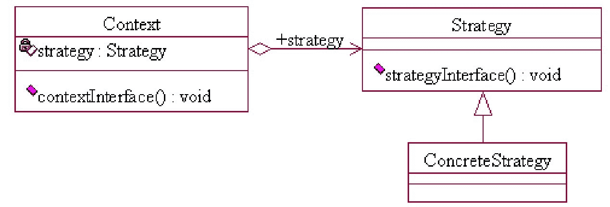
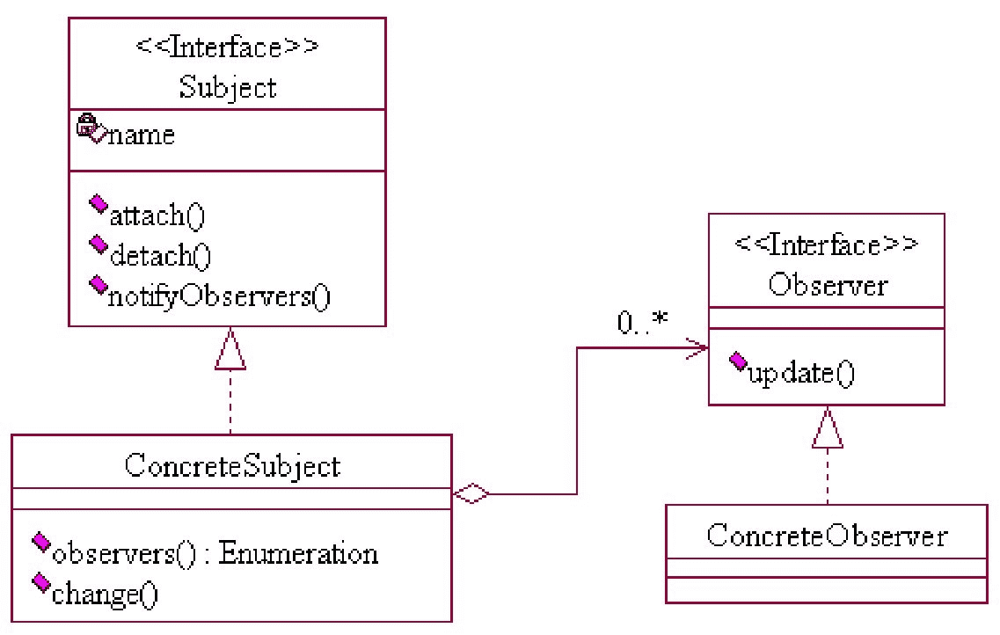
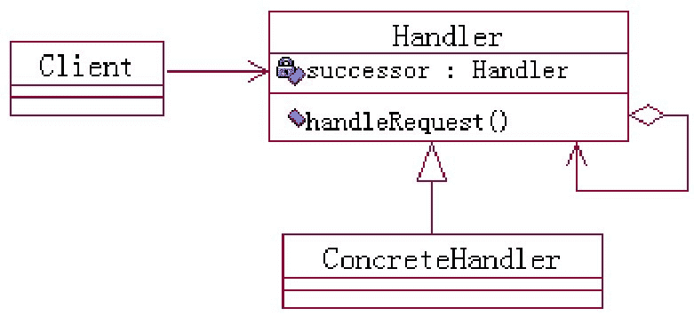

# 第八章 第 3 节 Java-设计模式-3

> 原文：[`www.nowcoder.com/tutorial/10070/27e58d8a56264e1f888624772f5fb4cd`](https://www.nowcoder.com/tutorial/10070/27e58d8a56264e1f888624772f5fb4cd)

#### 1.8 说一说你策略模式的理解

**参考答案**

策略模式（Strategy Pattern）也叫政策模式，是一种比较简单的模式。它的目的是定义一组算法，将每个算法都封装起来，并且使它们之间可以互换。其用意是针对一组算法，将每一个算法封装到具有共同接口的独立的类中，从而使得它们可以相互替换，使得算法可以在不影响到客户端的情况下发生变化。

策略模式的通用类图如下图所示：



策略模式涉及以下 3 个角色：

*   环境（Context）角色：该角色也叫上下文角色，起到承上启下的作用，屏蔽高层模块对策略、算法的直接访问，它持有一个 Strategy 类的引用。
*   抽象策略（Strategy）角色：该角色对策略、算法进行抽象，通常定义每个策略或算法必须具有的方法和属性。
*   具体策略（Concrete Strategy）角色：该角色实现抽象策略中的具体操作，含有具体的算法。

抽象策略 Strategy 的代码如下所示：

```cpp
public abstract class Strategy {
    public abstract void strategyInterface();
}
```

具体策略 ConcreteStrategy 的代码如下所示：

```cpp
public class ConcreteStrategy extends Strategy {
    public void strategyInterface() {
        ...
    }
}
```

环境角色 Context 的代码如下所示：

```cpp
public class Context {
    private Strategy strategy = null;
    public Context(Strategy strategy) {
        this.strategy = strategy;
    }
    public void contextInterface() {
        this.strategy.strategyInterface();
    }
}
```

策略模式包括如下优点：

*   策略模式提供了管理相关的算法族的办法。策略类的等级结构定义了一个算法或行为族，恰当地使用继承可以把公共的代码移到父类中，从而避免代码重复。
*   策略模式提供了可以替换继承关系的办法。继承可以处理多种算法或行为，如果不用策略模式，那么使用算法或行为的环境类就可能会有一些子类，每一个子类提供一个不同的算法或行为。但是，这样算法或行为的使用者就和算法本身混在一起，从而不可能再独立演化。
*   使用策略模式可以避免使用多重条件转移语句。多重转移语句不易维护，它把采取哪一种算法或采取哪一种行为的逻辑与算法或行为的逻辑混合在一起，统统列在一个多重转移语句里面，这比使用继承的办法还要原始和落后。

策略模式包括如下缺点：

*   客户端必须知道所有的策略类，并自行决定使用哪一个策略类。这就意味着客户端必须理解这些算法的区别，以便适时选择恰当的算法类，即策略模式只适用于客户端知道所有的算法或行为的情况。
*   策略模式造成很多的策略类。有时候可以通过把依赖于环境的状态保持到客户端里面，而将策略类设计成可共享的，这样策略类实例可以被不同客户端使用。可以使用享元模式来减少对象的数量。

策略模式有如下几个应用场景：

*   多个类只是在算法或行为上稍有不同的场景。
*   算法需要自由切换的场景。
*   需要屏蔽算法规则的场景。

#### 1.9 说一说你对观察者模式的了解

**参考答案**

观察者模式（Observer Pattern）也称发布订阅模式，它的目的是定义对象间一种一对多的依赖关系，使得每当一个对象改变状态，则所有依赖于它的对象都会得到通知并被自动更新。

观察者模式的类图如下图所：



观察者模式具有以下 4 个角色：

*   抽象主题（Subject）角色：该角色又称为“被观察者”，可以增加和删除观察者对象。
*   抽象观察者（Observer）角色：该角色为所有的具体观察者定义一个接口，在得到主题的通知时更新自己。
*   具体主题（Concrete Subject）角色：该角色又称为“具体被观察者”，它将有关状态存入具体观察者对象，在具体主题的内部状态改变时，给所有登记过的观察者发出通知。
*   具体观察者（Concrete Observer）角色：该角色实现抽象观察者所要求的更新接口，以便使自身的状态与主题的状态相协调。

上述类图所涉及的代码如下所示：

```cpp
interface Subject {
    // 登记一个新的观察者
    public void attach(Observer obs);
    // 删除一个登记过的观察者
    public void detach(Observer obs);
    // 通知所有登记过的观察者对象
    public void notifyObserver();
}
interface Observer {
    // 更新方法
    public void update();
}
class ConcreteSubject implements Subject {
    private Vector<Observer> obsVector = new Vector<Observer>();
    // 登记一个新的观察者
    public void attach(Observer obs) {
        obsVector.add(obs);
    }
    // 删除一个登记过的观察者
    public void detach(Observer obs) {
        obsVector.remove(obs);
    }
    // 通知所有登记过的观察者对象
    public void notifyObserver() {
        for (Observer e : obsVector) {
            e.update();
        }
    }
    // 返回观察者集合的 Enumeration 对象
    public Enumeration<Observer> observers() {
        return obsVector.elements();
    }
    // 业务方法，改变状态
    public void change() {
        this.notifyObserver();
    }
}
class ConcreteObserver implements Observer {
    // 实现更新方法
    public void update() {
        System.out.println("收到通知，并进行处理！");
    }
}
```

观察者模式具有以下几个优点：

*   观察者和被观察者之间是抽象耦合。被观察者角色所知道的只是一个具体观察者集合，每一个具体观察者都符合一个抽象观察者的接口。被观察者并不认识任何一个具体的观察者，它只知道它们都有一个共同的接口。由于被观察者和观察者没有紧密的耦合在一起，因此它们可以属于不同的抽象化层次，且都非常容易扩展。
*   支持广播通信。被观察者会向所有登记过的观察者发出通知，这就是一个触发机制，形成一个触发链。

观察模式的缺点如下：

*   如果一个主题有多个直接或间接的观察者，则通知所有的观察者会花费很多时间，且开发和调试都比较复杂。
*   如果在主题之间有循环依赖，被观察者会触发它们之间进行循环调用，导致系统崩溃。在使用观察者模式时要特别注意这一点。
*   如果对观察者的通知是通过另外的线程进行异步投递，系统必须保证投递的顺序执行。
*   虽然观察者模式可以随时使观察者知道所观察的对象发生了变化，但是观察者模式没有提供相应的机制使观察者知道所观察的对象是如何发生变化。

观察者模式的应用场景如下：

*   关联行为场景。
*   事件多级触发场景。
*   跨系统的消息交换场景，如消息队列的处理机制。

#### 1.10 说一说你对责任链模式的了解

**参考答案**

责任链模式（Chain of Responsibility Pattern）是一种常见的行为模式，它的目的是使多个对象都有机会处理请求，从而避免了请求的发送者和接收者之间的耦合关系。将这些对象连成一条链，并沿着这条链传递该请求，直到有对象处理它为止。

责任链模式的重点是在“链”上，由一条链去处理相似的请求，在链中决定谁来处理这个请求，并返回相应的结果。责任链模式的类图如下图所示：



责任链模式涉及以下两个角色：

*   抽象处理者（Handler）角色：该角色对请求进行抽象，并定义一个方法以设定和返回对下一个处理者的引用。
*   具体处理者（Concrete Handler）角色：该角色接到请求后，可以选择将请求处理掉，或者将请求传给下一个处理者。由于具体处理者持有对下一个处理者的引用，因此，如果需要，具体处理者可以访问下一个处理者。

上述类图所涉及的代码如下所示：

```cpp
abstract class Handler {
    private Handler successor;
    public abstract void handleRequest();
    public Handler getSuccessor() {
        return successor;
    }
    public void setSuccessor(Handler successor) {
        this.successor = successor;
    }
}
class ConcreteHandler extends Handler {
    // 处理请求
    public void handleRequest() {
        if (getSuccessor() != null) {
            System.out.println("请求传递给" + getSuccessor());
            getSuccessor().handleRequest();
        } else {
            System.out.println("请求处理");
        }
    }
}
```

责任链模式的优点如下：

*   责任链模式将请求和处理分开，请求者不知道是谁处理的，处理者可以不用知道请求的全貌。
*   提高系统的灵活性。

责任链模式的缺点如下：

*   降低程序的性能，每个请求都是从链头遍历到链尾，当链比较长的时候，性能会大幅下降。
*   不易于调试，由于采用了类似递归的方式，调试的时候逻辑比较复杂。

责任链模式的应用场景如下：

*   一个请求需要一系列的处理工作。
*   业务流的处理，例如，文件审批。
*   对系统进行补充扩展。

#### 1.11 说一说装饰器模式和适配器模式的区别

**参考答案**

装饰器的目的是动态地给一个对象添加一些额外的职责，这个对象的类型不会发生变化，但是行为却发生了改变。

适配器的目的是将一个类的接口变换成客户端所期待的另一种接口，就是可以将一个对象包装成另外的一个接口。